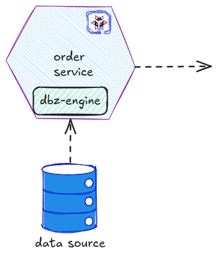

# Quarkus Debezium Extension

Quarkus Debezium Extension should provide a simple way to receive data source events inside a Quarkus Native Application and apply some logic to them (see image) thanks to the engine and an appropriate connector.



In order to be able to receive those events from the data-source, the actual way to achieve it is to import the `debezium-engine` and a connector like in this way:

```xml
<dependency>
    <groupId>io.debezium</groupId>
    <artifactId>debezium-embedded</artifactId>
    <version>${version.debezium}</version>
</dependency>
<dependency>
    <groupId>io.debezium</groupId>
    <artifactId>debezium-connector-mysql</artifactId>
    <version>${version.debezium}</version>
</dependency>
```
This approach doesn't work out-of-the-box in situations in which [we want to build a native image of the application](https://debezium.io/blog/2025/03/12/superfast-debezium/).

## 2. Module Organization (Debezium quarkus engine with Quarkus connector)
The module proposed contains the `engine` and the `connector` like in this way:

```xml
<dependency>
    <groupId>io.debezium</groupId>
    <artifactId>debezium-quarkus-mysql</artifactId>
    <version>${version.debezium}</version>
</dependency>
```

With this solution, the configuration property delegated to define the connector class should be unavailable and already defined inside the extension:
```txt
connector.class=io.debezium.connector.mysql.MySqlConnector
```


## Quarkus Debezium Extension configuration
The extensions must be configurable using the properties and yaml like any Quarkus application. The configuration properties available for the debezium engine must be available using a prefix `quarkus.debezium.xxx` like:

```properties
quarkus.debezium.configuration.offset.storage=org.apache.kafka.connect.storage.MemoryOffsetBackingStore
quarkus.debezium.configuration.database.hostname=localhost
quarkus.debezium.configuration.database.port=5432
quarkus.debezium.configuration.database.user=postgresuser
quarkus.debezium.configuration.database.password=postgrespw
quarkus.debezium.configuration.database.dbname=postgresuser
quarkus.debezium.configuration.snapshot.mode=never
```

## Quarkus Debezium Extension additional feature

The extension permits to address some use-cases already present in Debezium but in a _Quarkus_ way:

- `Debezium Listener`
- `Custom Debezium Converter`

### Quarkus  Debezium Listener

a Quarkus Developer using a `Debezium Listener`  can intercept events (`INSERT, UPDATE, DELETE...`) from a table like `order`, with a simple annotation like:

```java
import io.debezium.engine.ChangeEvent;
import jakarta.enterprise.context.ApplicationScoped;  


@ApplicationScoped  
class OrderListener {
  
    @DebeziumListener("order")  
    public void listener(ChangeEvent<String, String> event) {  
        /// some logic to apply 
    }  
}
```

or in batch:

```java
import io.debezium.engine.ChangeEvent;
import jakarta.enterprise.context.ApplicationScoped;  


@ApplicationScoped  
class OrderListener {
  
    @DebeziumBatchListener("order")  
    public void listener(List<ChangeEvent<String, String>> events) {  
        /// some logic to apply
    }  
}
```

even listen only a certain type of event

```java
import io.debezium.engine.InsertEvent;
import jakarta.enterprise.context.ApplicationScoped;  
import io.debezium.engine.quarkus.Operation.INSERT;

@ApplicationScoped  
class OrderListener {
  
    @DebeziumBatchListener("order", INSERT)  
    public void listener(List<InsertEvent<String, String>> events) {  
        /// some logic to apply
    }  
}
```

### Custom Debezium Converter

It should be possible to receive events mapped as data classes like:

```java
public record Order(long id, String name, int price) {}
```

```java
import io.debezium.engine.InsertEvent;
import jakarta.enterprise.context.ApplicationScoped;

@ApplicationScoped  
class OrderListener {  
  
    @DebeziumListener("order")  
    public void listener(InsertEvent<String, Order> event) {  
        /// some logic to apply
    }  
}
```

using something similar for the [quarkus kafka library](https://quarkus.io/guides/kafka#jackson-serialization):

```java
package com.acme.order.jackson;

import io.quarkus.debezium.client.serialization.ObjectMapperDeserializer;

public class OrderDeserializer extends ObjectMapperDeserializer<Order> {
    public OrderDeserializer() {
        super(Order.class);
    }
}
```

```properties
quarkus.debezium.deserializer=com.acme.order.jackson.OrderDeserializer
```

## Considerations
This approach that is inspired by Kafka can be useful for the development of Debezium Server.