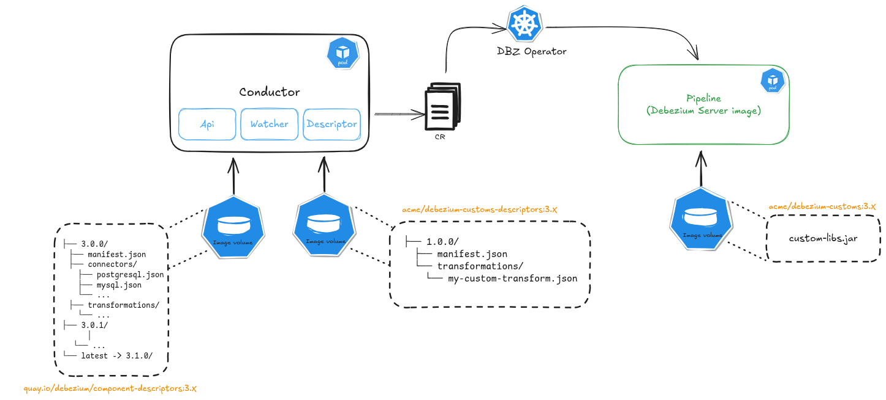

# DDD-13: Debezium component descriptors

## Motivation
The Debezium platform project was started with the idea to provide a centralized and easy way to manage data pipelines on Kubernetes with Debezium Server.
In that platform, users can configure different components: sources, sinks, and transformations to build their data pipelines.
For those familiar with Debezium, these components are highly configurable through a set of configuration properties.
These properties are declared by the components themselves, and usually a property defines some basic information:

* name
* description
* type
* default value
* validator

These properties are generally documented in the component docs, which is sufficient if you configure it in the standard way (Kafka Connect, Debezium Server, Debezium engine), but this is not the case for the Debezium Platform.

The UI of the Debezium Platform (stage) needs a way to get all the possible configuration properties declared by a component to easily allow users to configure them.

This document will present how this can be achieved.

## Goals

The goal is to define a descriptor for Connectors, Transformations, and Sinks (and storage?) and how this will be created and exposed to the stage.

## Descriptors format

Descriptor format should be expressive and human writable/readable. The first thought goes to JSON and YAML, but also a custom DSL can be an option.
Let's explore how the different formats appear for describing connector properties.

```json
{
  "name": "PostgreSQL Connector",
  "type": "source-connector",
  "version": "1.0.0",
  "metadata": {
    "description": "Captures changes from a PostgreSQL database",
    "tags": ["database", "postgresql", "cdc"]
  },
  "properties": [
    {
      "name": "topic.prefix",
      "type": "string",
      "required": true,
      "display": {
        "label": "Topic prefix",
        "description": "Topic prefix that identifies and provides a namespace for the particular database server/cluster that is capturing changes. The topic prefix should be unique across all other connectors, since it is used as a prefix for all Kafka topic names that receive events emitted by this connector. Only alphanumeric characters, hyphens, dots and underscores must be accepted.",
        "group": "Connection",
        "groupOrder": 0,
        "width": "medium",
        "importance": "high"
      },
      "validation": [
        {
          "type": "regex",
          "pattern": "^[a-zA-Z0-9._-]+$",
          "message": "Only alphanumeric characters, hyphens, dots and underscores are allowed"
        }
      ]
    },
    {
      "name": "table.include.list",
      "type": "list",
      "display": {
        "label": "Include Tables",
        "description": "The tables for which changes are to be captured",
        "group": "Filters",
        "groupOrder": 2,
        "width": "long",
        "importance": "high"
      },
      "validation": [
        {
          "type": "regex-list",
          "message": "Each item must be a valid regular expression"
        }
      ]
    },
     {
        "name": "connection.adapter",
        "type": "string",
        "display": {
           "label": "Connector adapter",
           "description": "The adapter to use when capturing changes from the database.",
           "group": "Connection advanced",
           "groupOrder": 1,
           "width": "medium",
           "importance": "high"
        },
        "valueDependants": [
           {
              "values": ["LogMiner"],
              "dependants": ["log.mining.buffer.type"]
           }
        ],
        "validation": [
           {
              "type": "regex",
              "pattern": "[XStream|LogMiner|LogMiner_Unbuffered|OLR]",
              "message": "Permitted value are: XStream, LogMiner, LogMiner_Unbuffered, OLR"
           }
        ]
     },
     {
        "name": "log.mining.buffer.type",
        "type": "string",
        "display": {
           "label": "Controls which buffer type implementation to be used",
           "description": "The buffer type controls how the connector manages buffering transaction data.",
           "group": "Connection advanced",
           "groupOrder": 2,
           "width": "medium",
           "importance": "low"
        },
        "valueDependants": [
           {
              "values": ["ehcache"],
              "dependants": [
                 "log.mining.buffer.ehcache.global.config",
                 "log.mining.buffer.ehcache.transactions.config",
                 "log.mining.buffer.ehcache.processedtransactions.config",
                 "log.mining.buffer.ehcache.schemachanges.config",
                 "log.mining.buffer.ehcache.events.config"
              ]
           },
           {
              "values": ["infinispan_embedded", "infinispan_remote"],
              "dependants": [
                 "log.mining.buffer.infinispan.cache.global",
                 "log.mining.buffer.infinispan.cache.transactions",
                 "log.mining.buffer.infinispan.processedtransactions.config",
                 "log.mining.buffer.infinispan.cache.schema_changes",
                 "log.mining.buffer.infinispan.cache.events"
              ]
           }
        ],
        "validation": [
           {
              "type": "regex",
              "pattern": "[memory|infinispan_embedded|infinispan_remote|ehcache]",
              "message": "Permitted value are: memory, infinispan_embedded, infinispan_remote, ehcache"
           }
        ]
     }
  ],
  "groups": [
    {
      "name": "Connection",
      "order": 0,
      "description": "Connection configuration for the PostgreSQL database"
    },
    {
      "name": "Filters",
      "order": 2,
      "description": "Filtering options for tables and changes"
    }
  ]
}
```
The above example adhere to the following json-schema:

```json
{
  "$schema": "http://json-schema.org/draft-07/schema#",
  "title": "PostgreSQL Connector Configuration Schema",
  "description": "Schema for validating PostgreSQL connector configurations",
  "type": "object",
  "required": ["name", "type", "version", "metadata", "properties"],
  "properties": {
    "name": {
      "type": "string",
      "description": "The name of the connector"
    },
    "type": {
      "type": "string",
      "enum": ["source-connector", "sink-connector"],
      "description": "The type of connector (source or sink)"
    },
    "version": {
      "type": "string",
      "pattern": "^\\d+\\.\\d+\\.\\d+$",
      "description": "The version of the connector in semantic versioning format"
    },
    "metadata": {
      "type": "object",
      "required": ["description"],
      "properties": {
        "description": {
          "type": "string",
          "description": "A description of the connector's functionality"
        },
        "tags": {
          "type": "array",
          "items": {
            "type": "string"
          },
          "description": "Tags categorizing the connector"
        }
      }
    },
    "properties": {
      "type": "array",
      "items": {
        "type": "object",
        "required": ["name", "type"],
        "properties": {
          "name": {
            "type": "string",
            "description": "The name of the property"
          },
          "type": {
            "type": "string",
            "enum": ["string", "number", "boolean", "list", "object"],
            "description": "The data type of the property"
          },
          "required": {
            "type": "boolean",
            "description": "Whether the property is required"
          },
          "display": {
            "type": "object",
            "properties": {
              "label": {
                "type": "string",
                "description": "Display label for the property"
              },
              "description": {
                "type": "string",
                "description": "Description of the property"
              },
              "group": {
                "type": "string",
                "description": "Group this property belongs to"
              },
              "groupOrder": {
                "type": "integer",
                "minimum": 0,
                "description": "Order of the group this property belongs to"
              },
              "width": {
                "type": "string",
                "enum": ["small", "medium", "long"],
                "description": "Display width for the property"
              },
              "importance": {
                "type": "string",
                "enum": ["low", "medium", "high"],
                "description": "Importance level of the property"
              }
            }
          },
          "validation": {
            "type": "array",
            "items": {
              "type": "object",
              "required": ["type"],
              "properties": {
                "type": {
                  "type": "string",
                  "enum": ["regex", "regex-list", "min", "max", "required"],
                  "description": "The type of validation to apply"
                },
                "pattern": {
                  "type": "string",
                  "description": "Regex pattern for validation"
                },
                "message": {
                  "type": "string",
                  "description": "Error message to display when validation fails"
                }
              }
            }
          }
        }
      }
    },
    "groups": {
      "type": "array",
      "items": {
        "type": "object",
        "required": ["name", "order"],
        "properties": {
          "name": {
            "type": "string",
            "description": "Name of the configuration group"
          },
          "order": {
            "type": "integer",
            "minimum": 0,
            "description": "Order in which the group should be displayed"
          },
          "description": {
            "type": "string",
            "description": "Description of the configuration group"
          }
        }
      }
    }
  },
  "additionalProperties": false
}
```

The same in YAML:

```yaml
name: PostgreSQL Connector
type: source-connector
version: 1.0.0
metadata:
  description: Captures changes from a PostgreSQL database
  tags: 
    - database
    - postgresql
    - cdc

groups:
  - name: Connection
    order: 0
    description: Connection configuration for the PostgreSQL database
  - name: Filters
    order: 2
    description: Filtering options for tables and changes

properties:
  - name: topic.prefix
    type: string
    required: true
    display:
      label: Topic prefix
      description: >
        Topic prefix that identifies and provides a namespace for the particular database 
        server/cluster that is capturing changes. The topic prefix should be unique across 
        all other connectors, since it is used as a prefix for all Kafka topic names 
        that receive events emitted by this connector. Only alphanumeric characters, 
        hyphens, dots and underscores must be accepted.
      group: Connection
      groupOrder: 0
      width: medium
      importance: high
    validation:
      - type: regex
        pattern: ^[a-zA-Z0-9._-]+$
        message: Only alphanumeric characters, hyphens, dots and underscores are allowed

  - name: table.include.list
    type: list
    display:
      label: Include Tables
      description: The tables for which changes are to be captured
      group: Filters
      groupOrder: 2
      width: long
      importance: high
    validation:
      - type: regex-list
        message: Each item must be a valid regular expression
```

A custom DSL:

```text
connector "PostgreSQL Connector" {
  type: source-connector
  version: "1.0.0"
  tags: [database, postgresql, cdc]
  description: "Captures changes from a PostgreSQL database"
}

group Connection {
  order: 0
  description: "Connection configuration for the PostgreSQL database"

  property "topic.prefix" {
    type: string
    required: true
    label: "Topic prefix"
    width: medium
    importance: high
    description: """
      Topic prefix that identifies and provides a namespace for the particular database 
      server/cluster is capturing changes. The topic prefix should be unique across 
      all other connectors, since it is used as a prefix for all Kafka topic names 
      that receive events emitted by this connector. Only alphanumeric characters, 
      hyphens, dots and underscores must be accepted.
    """
    validate {
      regex("^[a-zA-Z0-9._-]+$", "Only alphanumeric characters, hyphens, dots and underscores are allowed")
    }
  }
}

group Filters {
  order: 2
  description: "Filtering options for tables and changes"

  property "table.include.list" {
    type: list
    label: "Include Tables"
    width: long
    importance: high
    description: "The tables for which changes are to be captured"
    validate {
      regex-list("Each item must be a valid regular expression")
    }
  }
}
```

We exclude more complex formats like [OAS](https://swagger.io/specification/), although it is used by `debezium-schema-generator`, since it is unnecessarily complicated for our scope.

Given that JSON is easy to read/write and commonly used in frontend applications, it is the easiest choice.

### Value-based Dependencies

The descriptor format supports expressing dependencies between properties based on specific values through the `valueDependants` field. This allows the UI to show or hide configuration properties dynamically based on the selected value of another property.

As shown in the JSON example above, `valueDependants` is an array of objects, where each object specifies:
- `values`: An array of string values that trigger the dependency
- `dependants`: An array of property names that become relevant when the parent property has one of the specified values

For example, when `connection.adapter` is set to `"LogMiner"`, the property `log.mining.buffer.type` becomes relevant. Similarly, when `log.mining.buffer.type` is set to `"ehcache"`, all the ehcache-specific configuration properties become relevant.

This feature improves the user experience by reducing configuration complexity, showing users only the properties that are applicable to their specific configuration choices.

## Generate descriptors

### Debezium schema generator
The old UI used a JSON descriptor built by the `debezium-schema-generator`. The `SchemaGenerator` class based its generation on the following interfaces:

```java
public interface ConnectorMetadataProvider {

    ConnectorMetadata getConnectorMetadata();
}

public interface ConnectorMetadata {

    ConnectorDescriptor getConnectorDescriptor();

    Field.Set getConnectorFields();
}
```
Each connector needs to implement these two interfaces to provide the information required for the descriptor generation.

The `ConnectorDescriptor` class contains some basic information like the `className`, `version`, `displayName`, and `id`.
The `Field` class contains the information used to describe a configuration property. Below is an extract of the properties of this class:

```java
    private final String name;
    private final String displayName;
    private final String desc;
    private final Supplier<Object> defaultValueGenerator;
    private final Validator validator;
    private final Width width;
    private final Type type;
    private final Importance importance;
    private final List<String> dependents;
    private final Recommender recommender;
    private final java.util.Set<?> allowedValues;
    private final GroupEntry group;
    private final boolean isRequired;
    private final java.util.Set<String> deprecatedAliases;
```

The `Field` class currently supports a generic `dependents` list but does not support value-based dependencies. 
To enable the `valueDependants` feature described in the descriptor format, a new method needs to be added:

```java
public Field withDependents(String fieldValue, String... dependents)
```

This method allows specifying which dependent fields become relevant when the current field has a specific value, enabling the schema generator to produce descriptors with proper value-based dependency information.


| Pro                           | Cons                                                     |
|-------------------------------|----------------------------------------------------------|
| Alias and deprecation support | Requires changes to the components code                  |
| Decoupled from Kafka Connect  | Loose control on custom connectors, transformations, etc |


### Kafka Connect data

Every Kafka Connect component exposes the `ConfigDef` object that contains the definition of configuration properties that the component declares.
A configuration is mapped in the `ConfigKey` class.

```java
public static class ConfigKey {
    public final String name;
    public final Type type;
    public final String documentation;
    public final Object defaultValue;
    public final Validator validator;
    public final Importance importance;
    public final String group;
    public final int orderInGroup;
    public final Width width;
    public final String displayName;
    public final List<String> dependents;
    public final Recommender recommender;
    public final boolean internalConfig;
    public final String alternativeString;

    //...
}
```

| Pro                              | Cons                                        |
|----------------------------------|---------------------------------------------|
| Discoverability of components    | Coupled with Kafka Connect                  |
| No change to the components code | Missing support for deprecation and aliases |

The `Discoverability of components` requires an in-depth analysis.
The `ConfigDef config()` method is declared in different interfaces/classes, so discoverability means to look for all of these.

```java
public abstract class Connector implements Versioned {
    
    /**
     * Define the configuration for the connector.
     * @return The ConfigDef for this connector; may not be null.
     */
    public abstract ConfigDef config();
}

public interface Converter {

    /**
     * Configuration specification for this converter.
     * @return the configuration specification; may not be null
     */
    default ConfigDef config() {
        return new ConfigDef();
    }
}

public interface Transformation<R extends ConnectRecord<R>> extends Configurable, Closeable {

    /** Configuration specification for this transformation. */
    ConfigDef config();
}

public interface Predicate<R extends ConnectRecord<R>> extends Configurable, AutoCloseable {

    /**
     * Configuration specification for this predicate.
     *
     * @return the configuration definition for this predicate; never null
     */
    ConfigDef config();
}
```

We could propose a KIP to move this method into a dedicated interface:

```java
/**
 * ConfigSpecifier has the sole responsibility of defining what configuration a component accepts
 */
public interface ConfigSpecifier {
   
    /** Configuration specification. */
    ConfigDef config();
}
```

to easily discover all classes that implement this interface.

### Considerations

The final consideration is that we need to support both, the table below shows how component and configuration discoverability should work

#### Component and Configuration Discoverability

| Aspect                            | Debezium                                                                 | Kafka Connect                                                                       |
|-----------------------------------|--------------------------------------------------------------------------|-------------------------------------------------------------------------------------|
| **Component Discoverability**     | Via the `ConnectorMetadataProvider`                                      | Via the different interfaces that expose `org.apache.kafka.common.config.ConfigDef` |
| **Configuration Discoverability** | Via `io.debezium.config.ConfigDefinition` and `io.debezium.config.Field` | Via `org.apache.kafka.common.config.ConfigKey`                                      |

Then the `debezium-schema-generator` needs to be modified to support the new format and be component agnostic.
For the Kafka Connect components discoverability we will use all the interfaces describe before, in the first phase, while proposing a KIP to have a unified interface. 

## How to expose descriptors

Since the main user of these descriptors, as of now, will be the Debezium Platform, they cannot be obtained from a running Debezium server instance,
as the information contained in the description needs to be used during the creation of the Debezium Platform components (Source, Destination, and Transformation).

This requires the descriptors to be available to the platform conductor before running the Debezium server instance.

The figure below shows the high-level architecture, including support for both official Debezium descriptors and custom user-provided descriptors.



### Descriptor Registry and Distribution

The descriptors will be generated during the Debezium release process and published to a dedicated GitHub repository (`debezium-descriptors-registry`).
This repository will contain the JSON descriptor files organized by version, providing a centralized registry for all component descriptors.

A GitHub workflow will be configured to trigger on pushes to the main branch. This workflow will:
1. Package the repository content (descriptor files grouped by version) into an OCI artifact
2. Push the OCI artifact to quay.io under the Debezium organization

This approach ensures that descriptor updates are automatically packaged and made available as immutable OCI artifacts following the same distribution model as container images.

#### Repository Structure

The `debezium-descriptors-registry` repository will be organized with the following structure:

```
debezium-descriptors-registry/
├── 3.0.0/
│   ├── manifest.json
│   ├── connectors/
│   │   ├── postgresql.json
│   │   ├── mysql.json
│   │   ├── mongodb.json
│   │   ├── oracle.json
│   │   ├── sqlserver.json
│   │   └── ...
│   ├── transformations/
│   │   ├── extract-new-record-state.json
│   │   ├── outbox-event-router.json
│   │   └── ...
│   └── sinks/
│       ├── kafka.json
│       ├── kinesis.json
│       └── ...
├── 3.0.1/
│   ├── manifest.json
│   ├── connectors/
│   ├── transformations/
│   └── sinks/
├── 3.1.0/
│   └── ...
└── latest -> 3.1.0/
```

Each Debezium version has its own top-level directory containing:
- A `manifest.json` file that provides metadata about the version and lists all available descriptors
- Subdirectories organized by component type (`connectors`, `transformations`, `sinks`)
- Individual JSON descriptor files for each component

The `latest` symlink points to the most recent stable version for easy discovery.

Having descriptors organized per version enables future support for pipeline versioning in the Debezium Platform. While the platform will initially use only the current stable version, this structure provides the foundation for users to create and manage pipelines with specific Debezium versions, ensuring compatibility and allowing controlled upgrades.

### Mounting Descriptors in the Conductor Pod

The OCI artifact containing the descriptors will be mounted on the conductor pod using [Image Volumes](https://github.com/kubernetes/enhancements/issues/4639).
As of Kubernetes 1.35, this feature is enabled by default, though still in beta status. Image volumes allow OCI artifacts to be mounted directly as volume sources without requiring init containers or additional setup.

Once mounted in the `conductor` pod, the descriptor files will be available in the filesystem. A REST API will serve these files to the frontend application,
enabling the Debezium Platform UI to dynamically discover and present configuration options for available components.

This approach maintains the Debezium descriptor distribution as immutable and version-controlled while providing a standard Kubernetes-native mechanism for making the descriptors available at runtime.

### Alternative to Image volumes

If Image Volumes cannot be used (for example, in Kubernetes versions prior to 1.35 or if the beta feature is disabled), we can leverage [init containers](http://kubernetes.io/docs/concepts/workloads/pods/init-containers/) as an alternative approach.

The OCI artifact containing descriptors would be used as an init container for the `conductor` pod.
A shared volume (emptyDir or persistent volume) would be mounted in both the init container and the main conductor container.
The init container would copy the descriptor files from the OCI artifact to the shared volume during pod initialization.
The main conductor container would then access these files from the shared volume and serve them via the REST API.

### Supporting Custom Components

Users who develop custom components (connectors, transformations, or sinks) will need to provide descriptors for these components to make them available in the Debezium Platform UI.

#### Generating Custom Descriptors

Users can generate descriptors for their custom components using the `debezium-schema-generator` tool. Since custom components implement the standard Kafka Connect interfaces (`Connector`, `Transformation`, etc.) with the `ConfigDef config()` method, the generator can automatically extract configuration metadata.

The generation process can be integrated into the user's build pipeline to automatically create descriptor files whenever custom components are built.

#### Packaging Custom Descriptors

Users should package their custom descriptors as OCI artifacts following the same structure as the official `debezium-descriptors-registry`:

```
my-custom-descriptors/
├── 1.0.0/
│   ├── manifest.json
│   └── transformations/
│       └── my-custom-transform.json
└── latest -> 1.0.0/
```

This OCI artifact can be built using the same approach as the official registry and pushed to a container registry accessible by the Kubernetes cluster (e.g., `acme/debezium-customs-descriptors:3.x`).

#### Mounting Multiple Descriptor Sources

The conductor pod supports mounting multiple descriptor sources simultaneously using image volumes (or init containers). The official Debezium descriptors and user-provided custom descriptors are mounted as separate volumes, allowing the REST API to discover and serve descriptors from all available sources.

Users are responsible for ensuring their custom descriptor names do not conflict with official Debezium component names. Since custom components represent new implementations rather than overrides of existing ones, conflicts should naturally be avoided through proper naming conventions.

#### Future Tooling

While users can initially leverage the `debezium-schema-generator` for creating custom descriptors, dedicated tooling may be provided in the future to simplify the generation and packaging workflow. This could include:
- CLI tools for generating descriptors from custom component JARs
- Build plugins for Maven/Gradle to automate descriptor generation
- Templates and examples for creating OCI artifacts with custom descriptors

## Proposed changes

1. Add support for value-based dependencies in `io.debezium.config.Field`:
   1. Implement the new `withDependents(String fieldValue, String... dependents)` method
   2. Update the internal data structures to store value-based dependency mappings
   3. Update connectors to use this method for declaring value-based dependencies
2. Modify the `debezium-schema-generator` to generate descriptors with the new format:
   1. Add support for generating `valueDependants` field from the Field class dependency information
3. Modify the `debezium-schema-generator` to generate descriptors for other components (transforms, predicates, etc.).
   1. If we go for the KIP to have a common interface, until it is approved, we can just look for the different interfaces.
4. Integrate descriptor generation into the Debezium release process:
   1. Configure the build to generate descriptors during release
   2. Automatically publish generated descriptors to the `debezium-descriptors-registry` repository, organized by version
5. Create the `debezium-descriptors-registry` GitHub repository:
   1. Set up the repository structure for version-organized descriptor files
   2. Implement a GitHub workflow that builds an OCI artifact from the repository content on main branch pushes
   3. Configure the workflow to push the OCI artifact to quay.io under the Debezium organization
6. Implement the REST API in the conductor to serve descriptor files to the frontend application:
   1. Support discovery and serving of descriptors from multiple mounted sources (official + custom)
   2. Implement endpoint(s) to list and retrieve available component descriptors
7. Update the Debezium Platform Helm chart:
   1. Add support for mounting the descriptor OCI artifact as an image volume
   2. Provide configuration options for mounting additional custom descriptor OCI artifacts
   3. Provide configuration options for using the init container alternative approach for Kubernetes versions prior to 1.35

> **_Note:_** Point 3 can be postponed to the end so that we can go through the whole pieces having only the connector descriptors and then add the others.