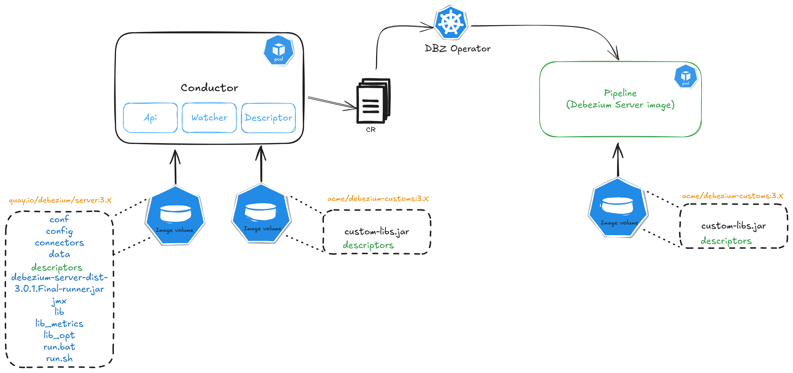

# DDD-13: Debezium component descriptors

## Motivation
The Debezium platform project was started with the idea to provide a centralized and easy way to manage data pipelines on Kubernetes with Debezium Server.
In that platform, users can configure different components: sources, sinks, and transformations to build their data pipelines.
For those familiar with Debezium, these components are highly configurable through a set of configuration properties.
These properties are declared by the components themselves, and usually a property defines some basic information:

* name
* description
* type
* default value
* validator

These properties are generally documented in the component docs, which is sufficient if you configure it in the standard way (Kafka Connect, Debezium Server, Debezium engine), but this is not the case for the Debezium Platform.

The UI of the Debezium Platform (stage) needs a way to get all the possible configuration properties declared by a component to easily allow users to configure them.

This document will present how this can be achieved.

## Goals

The goal is to define a descriptor for Connectors, Transformations, and Sinks (and storage?) and how this will be created and exposed to the stage.

## Descriptors format

Descriptor format should be expressive and human writable/readable. The first thought goes to JSON and YAML, but also a custom DSL can be an option.
Let's explore how the different formats appear for describing connector properties.

```json
{
  "name": "PostgreSQL Connector",
  "type": "source-connector",
  "version": "1.0.0",
  "metadata": {
    "description": "Captures changes from a PostgreSQL database",
    "tags": ["database", "postgresql", "cdc"]
  },
  "properties": [
    {
      "name": "topic.prefix",
      "type": "string",
      "required": true,
      "display": {
        "label": "Topic prefix",
        "description": "Topic prefix that identifies and provides a namespace for the particular database server/cluster that is capturing changes. The topic prefix should be unique across all other connectors, since it is used as a prefix for all Kafka topic names that receive events emitted by this connector. Only alphanumeric characters, hyphens, dots and underscores must be accepted.",
        "group": "Connection",
        "groupOrder": 0,
        "width": "medium",
        "importance": "high"
      },
      "validation": [
        {
          "type": "regex",
          "pattern": "^[a-zA-Z0-9._-]+$",
          "message": "Only alphanumeric characters, hyphens, dots and underscores are allowed"
        }
      ]
    },
    {
      "name": "table.include.list",
      "type": "list",
      "display": {
        "label": "Include Tables",
        "description": "The tables for which changes are to be captured",
        "group": "Filters",
        "groupOrder": 2,
        "width": "long",
        "importance": "high"
      },
      "validation": [
        {
          "type": "regex-list",
          "message": "Each item must be a valid regular expression"
        }
      ]
    }
  ],
  "groups": [
    {
      "name": "Connection",
      "order": 0,
      "description": "Connection configuration for the PostgreSQL database"
    },
    {
      "name": "Filters",
      "order": 2,
      "description": "Filtering options for tables and changes"
    }
  ]
}
```
The above example adhere to the following json-schema:

```json
{
  "$schema": "http://json-schema.org/draft-07/schema#",
  "title": "PostgreSQL Connector Configuration Schema",
  "description": "Schema for validating PostgreSQL connector configurations",
  "type": "object",
  "required": ["name", "type", "version", "metadata", "properties"],
  "properties": {
    "name": {
      "type": "string",
      "description": "The name of the connector"
    },
    "type": {
      "type": "string",
      "enum": ["source-connector", "sink-connector"],
      "description": "The type of connector (source or sink)"
    },
    "version": {
      "type": "string",
      "pattern": "^\\d+\\.\\d+\\.\\d+$",
      "description": "The version of the connector in semantic versioning format"
    },
    "metadata": {
      "type": "object",
      "required": ["description"],
      "properties": {
        "description": {
          "type": "string",
          "description": "A description of the connector's functionality"
        },
        "tags": {
          "type": "array",
          "items": {
            "type": "string"
          },
          "description": "Tags categorizing the connector"
        }
      }
    },
    "properties": {
      "type": "array",
      "items": {
        "type": "object",
        "required": ["name", "type"],
        "properties": {
          "name": {
            "type": "string",
            "description": "The name of the property"
          },
          "type": {
            "type": "string",
            "enum": ["string", "number", "boolean", "list", "object"],
            "description": "The data type of the property"
          },
          "required": {
            "type": "boolean",
            "description": "Whether the property is required"
          },
          "display": {
            "type": "object",
            "properties": {
              "label": {
                "type": "string",
                "description": "Display label for the property"
              },
              "description": {
                "type": "string",
                "description": "Description of the property"
              },
              "group": {
                "type": "string",
                "description": "Group this property belongs to"
              },
              "groupOrder": {
                "type": "integer",
                "minimum": 0,
                "description": "Order of the group this property belongs to"
              },
              "width": {
                "type": "string",
                "enum": ["small", "medium", "long"],
                "description": "Display width for the property"
              },
              "importance": {
                "type": "string",
                "enum": ["low", "medium", "high"],
                "description": "Importance level of the property"
              }
            }
          },
          "validation": {
            "type": "array",
            "items": {
              "type": "object",
              "required": ["type"],
              "properties": {
                "type": {
                  "type": "string",
                  "enum": ["regex", "regex-list", "min", "max", "required"],
                  "description": "The type of validation to apply"
                },
                "pattern": {
                  "type": "string",
                  "description": "Regex pattern for validation"
                },
                "message": {
                  "type": "string",
                  "description": "Error message to display when validation fails"
                }
              }
            }
          }
        }
      }
    },
    "groups": {
      "type": "array",
      "items": {
        "type": "object",
        "required": ["name", "order"],
        "properties": {
          "name": {
            "type": "string",
            "description": "Name of the configuration group"
          },
          "order": {
            "type": "integer",
            "minimum": 0,
            "description": "Order in which the group should be displayed"
          },
          "description": {
            "type": "string",
            "description": "Description of the configuration group"
          }
        }
      }
    }
  },
  "additionalProperties": false
}
```

The same in YAML:

```yaml
name: PostgreSQL Connector
type: source-connector
version: 1.0.0
metadata:
  description: Captures changes from a PostgreSQL database
  tags: 
    - database
    - postgresql
    - cdc

groups:
  - name: Connection
    order: 0
    description: Connection configuration for the PostgreSQL database
  - name: Filters
    order: 2
    description: Filtering options for tables and changes

properties:
  - name: topic.prefix
    type: string
    required: true
    display:
      label: Topic prefix
      description: >
        Topic prefix that identifies and provides a namespace for the particular database 
        server/cluster that is capturing changes. The topic prefix should be unique across 
        all other connectors, since it is used as a prefix for all Kafka topic names 
        that receive events emitted by this connector. Only alphanumeric characters, 
        hyphens, dots and underscores must be accepted.
      group: Connection
      groupOrder: 0
      width: medium
      importance: high
    validation:
      - type: regex
        pattern: ^[a-zA-Z0-9._-]+$
        message: Only alphanumeric characters, hyphens, dots and underscores are allowed

  - name: table.include.list
    type: list
    display:
      label: Include Tables
      description: The tables for which changes are to be captured
      group: Filters
      groupOrder: 2
      width: long
      importance: high
    validation:
      - type: regex-list
        message: Each item must be a valid regular expression
```

A custom DSL:

```text
connector "PostgreSQL Connector" {
  type: source-connector
  version: "1.0.0"
  tags: [database, postgresql, cdc]
  description: "Captures changes from a PostgreSQL database"
}

group Connection {
  order: 0
  description: "Connection configuration for the PostgreSQL database"

  property "topic.prefix" {
    type: string
    required: true
    label: "Topic prefix"
    width: medium
    importance: high
    description: """
      Topic prefix that identifies and provides a namespace for the particular database 
      server/cluster is capturing changes. The topic prefix should be unique across 
      all other connectors, since it is used as a prefix for all Kafka topic names 
      that receive events emitted by this connector. Only alphanumeric characters, 
      hyphens, dots and underscores must be accepted.
    """
    validate {
      regex("^[a-zA-Z0-9._-]+$", "Only alphanumeric characters, hyphens, dots and underscores are allowed")
    }
  }
}

group Filters {
  order: 2
  description: "Filtering options for tables and changes"

  property "table.include.list" {
    type: list
    label: "Include Tables"
    width: long
    importance: high
    description: "The tables for which changes are to be captured"
    validate {
      regex-list("Each item must be a valid regular expression")
    }
  }
}
```

We exclude more complex formats like [OAS](https://swagger.io/specification/), although it is used by `debezium-schema-generator`, since it is unnecessarily complicated for our scope.

Given that JSON is easy to read/write and commonly used in frontend applications, it is the easiest choice.


## Generate descriptors

### Debezium schema generator
The old UI used a JSON descriptor built by the `debezium-schema-generator`. The `SchemaGenerator` class based its generation on the following interfaces:

```java
public interface ConnectorMetadataProvider {

    ConnectorMetadata getConnectorMetadata();
}

public interface ConnectorMetadata {

    ConnectorDescriptor getConnectorDescriptor();

    Field.Set getConnectorFields();
}
```
Each connector needs to implement these two interfaces to provide the information required for the descriptor generation.

The `ConnectorDescriptor` class contains some basic information like the `className`, `version`, `displayName`, and `id`.
The `Field` class contains the information used to describe a configuration property. Below is an extract of the properties of this class:

```java
    private final String name;
    private final String displayName;
    private final String desc;
    private final Supplier<Object> defaultValueGenerator;
    private final Validator validator;
    private final Width width;
    private final Type type;
    private final Importance importance;
    private final List<String> dependents;
    private final Recommender recommender;
    private final java.util.Set<?> allowedValues;
    private final GroupEntry group;
    private final boolean isRequired;
    private final java.util.Set<String> deprecatedAliases;
```

| Pro                           | Cons                                                     |
|-------------------------------|----------------------------------------------------------|
| Alias and deprecation support | Requires changes to the components code                  |
| Decoupled from Kafka Connect  | Loose control on custom connectors, transformations, etc |


### Kafka Connect data

Every Kafka Connect component exposes the `ConfigDef` object that contains the definition of configuration properties that the component declares.
A configuration is mapped in the `ConfigKey` class.

```java
public static class ConfigKey {
    public final String name;
    public final Type type;
    public final String documentation;
    public final Object defaultValue;
    public final Validator validator;
    public final Importance importance;
    public final String group;
    public final int orderInGroup;
    public final Width width;
    public final String displayName;
    public final List<String> dependents;
    public final Recommender recommender;
    public final boolean internalConfig;
    public final String alternativeString;

    //...
}
```

| Pro                              | Cons                                        |
|----------------------------------|---------------------------------------------|
| Discoverability of components    | Coupled with Kafka Connect                  |
| No change to the components code | Missing support for deprecation and aliases |

The `Discoverability of components` requires an in-depth analysis.
The `ConfigDef config()` method is declared in different interfaces/classes, so discoverability means to look for all of these.

```java
public abstract class Connector implements Versioned {
    
    /**
     * Define the configuration for the connector.
     * @return The ConfigDef for this connector; may not be null.
     */
    public abstract ConfigDef config();
}

public interface Converter {

    /**
     * Configuration specification for this converter.
     * @return the configuration specification; may not be null
     */
    default ConfigDef config() {
        return new ConfigDef();
    }
}

public interface Transformation<R extends ConnectRecord<R>> extends Configurable, Closeable {

    /** Configuration specification for this transformation. */
    ConfigDef config();
}

public interface Predicate<R extends ConnectRecord<R>> extends Configurable, AutoCloseable {

    /**
     * Configuration specification for this predicate.
     *
     * @return the configuration definition for this predicate; never null
     */
    ConfigDef config();
}
```

We could propose a KIP to move this method into a dedicated interface:

```java
/**
 * ConfigSpecifier has the sole responsibility of defining what configuration a component accepts
 */
public interface ConfigSpecifier {
   
    /** Configuration specification. */
    ConfigDef config();
}
```

to easily discover all classes that implement this interface.

### Considerations

The approach of using the `Kafka Connect` classes, even if it is coupled to it, offers more flexibility in supporting components outside Debezium.
The only real drawback is the missing support for deprecation and aliases that could help during upgrade paths. Could we consider contributing and adding support to `ConfigKey`?

Then the `debezium-schema-generator` could be modified to support the new format and how to retrieve the components.

## How to expose descriptors

Since the main user of these descriptors, as of now, will be the Debezium Platform, they cannot be obtained from a running Debezium server instance,
as the information contained in the description needs to be used during the creation of the Debezium Platform components (Source, Destination, and Transformation).

This requires the descriptors to be available to the platform conductor before running the Debezium server instance.

The figure below shows the high-level architecture.



In the long term, we will leverage [Image Volumes](https://kubernetes.io/docs/tasks/configure-pod-container/image-volumes/), which are moving to beta in Kubernetes 1.33. For the near future, the same can be achieved using just persistent volumes with little variation that I'll show later.

The idea is that the `conductor` pod will have two images mounted as volumes: Debezium server and an image provided by the user with custom libs.

Once mounted in the `conductor` pod, the new `descriptor service`, during startup, will be in charge of reading the descriptors and exposing them through an API in the form of `json`.

With this approach, we maintain our Debezium server distribution as immutable while giving users the possibility to extend it by providing an image.

### Alternative to Image volumes

Until Image Volumes become officially available, we can leverage [init containers](http://kubernetes.io/docs/concepts/workloads/pods/init-containers/).
Both `debezium-server` and user `custom-image` will be used as init containers for the `conductor` pod.
A persistent volume is required to copy the descriptors from init container images and then share this volume with the regular container.

## Proposed changes

1. Modify the `debezium-schema-generator` to generate descriptors with the new format.
2. Modify the `debezium-schema-generator` to generate descriptors for other components (transforms, predicates, etc.).
   1. If we go for the KIP to have a common interface, until it is approved, we can just look for the different interfaces.
3. Generate descriptors on Debezium Server distribution:
   1. Add `debezium-schema-generator` plugin to `debezium-server-dist`
   2. Modify the assembly to copy generated files to the distribution package
4. Implement the descriptor service
5. Support volumes in the Debezium Platform Helm chart

> **_Note:_** Point 2 can be postponed to the end so that we can go thought the whole pieces having only the connector descriptors and then add the others. 

## Open points

* Contribute to adding deprecation/alias support to `ConfigKey`?
* Support for Storage? Maybe in the next phase?