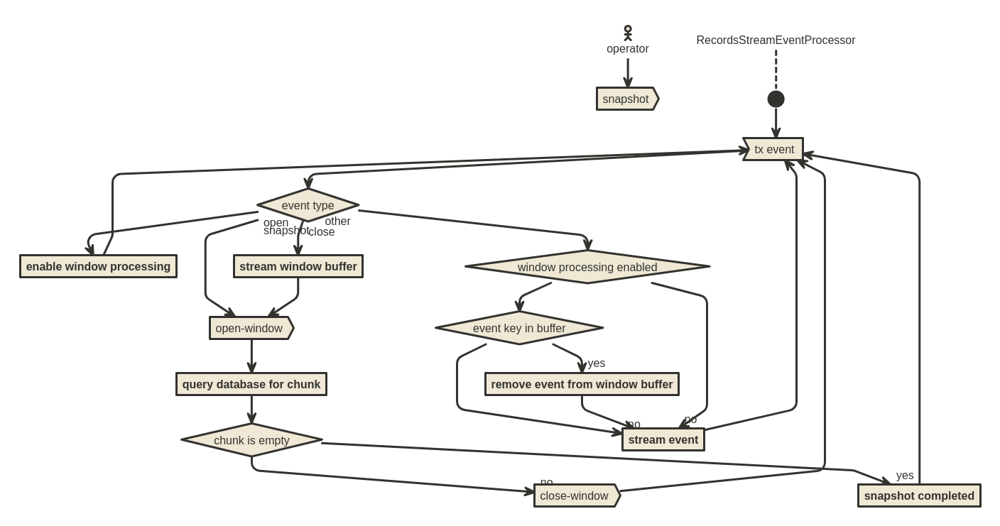
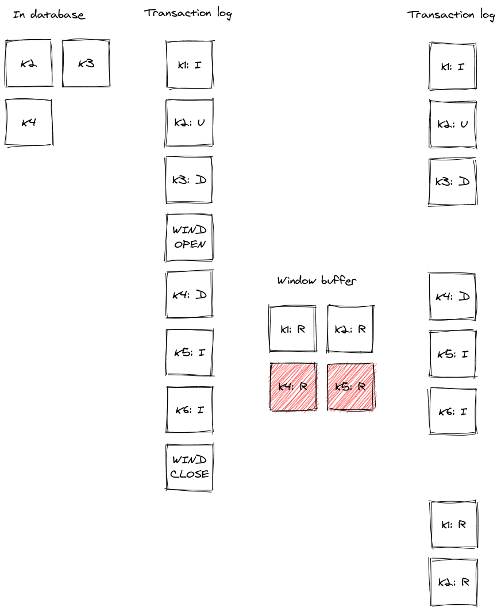

# DDD-3: Incremental snapshotting

## Motivation

Debezium is a platform to stream changes executed on data by processing transaction logs of a database.
As the data already existing in database are usually not available in the transaction log Debezium executes *consistent* snapshot at the start of a connector.

The snapshot is executed by reading of the content of all captured tables into Debezium and delivering it to Kafka.
Snapshotting processes the tables sequentially and streaming is started only after it is completed.
Depending on the size of database, the process can take hours or even days.
The process itself can be interrupted, but it then must be executed from start.

Many use cases don't require the data existing in the source database to be delivered all upfront.
Instead, they require the data to be delivered at an unspecific point of time.
This leads to the idea of incremental snapshotting, where the snapshot is taken in parallel with streaming.
The result will be that the streaming will be executed from start and the snapshotting will be executed in chunks, which would allow resuming of snapshot in the middle of execution.

A second problem with snapshots is visible when it is necessary to update the list of captured tables.
As the content of the newly added tables usually needs to be streamed as well, it is usually necessary to temporarily suspend the streaming, execute the snapshot of new tables and then resume streaming (not implemented in Debezium yet).
The incremental snapshotting would resolve this scenario too.

## Goals

* Provide support for resumeable snapshots
* Provide support for snapshots running concurrently with streaming
* Provide support for updates to the filter configuration (include/exclude lists for captured tables)
* Provide support for ad-hoc snapshots (triggered while the connector is running)

## Non-goals

* Parallelization of snapshotting

## Proposed changes

The proposed implementation is based on the solution articulated in the paper [DBLog: A Watermark Based Change-Data-Capture Framework](https://arxiv.org/pdf/2010.12597v1.pdf).
The key principle is introduction of snapshotting watermark records by writing checkpoint records into a watermarking table.
The streaming framework reads in parallel both the existing data and the changes from the transaction log;
when a checkpoint is hit in the transaction log, a reconciliation is performed and a new chunk to be snapshotted defined.

Embracing this approach requires a complete shift in paradigm in what it means to have a snapshotted record.
In the classic approach, the downstream system will receive the `read` event follow by `update` and eventually `delete` events.
In the new approach, the `read` event is just a point in time materialization of the data record and it is perfectly valid to receive `update` records later on followed by the `read` record, or even receive `delete` record for an event that was not delivered before.

For more details please read the referred paper.

The Debezium implementation will be based on signalling table.
To start an incremental snapshot, a signal `snapshot` will be written to the table with parameters

* `tables` - list of tables to be captured
* `type` - set to `incremental`

New signals `snapshot-window-open` and `snapshot-window-close` will be implemented to handle the watermark signal with no parameters.

When a chunk should be snapshotted

* streaming is paused (this is implicit when the signal is handled)
* a `snapshot-window-open` watermark signal is emitted
* a new data chunk is read from database by generating the `SELECT` statement and placed into a window buffer keyed by primary keys
* a `snapshot-window-close` watermark signal is emitted
* streaming is resumed

During the subsequent streaming

* if `snapshot-window-open` is received then window processing mode is enabled
* if `snapshot-window-close` is received then window processing mode is disabled and the rest of the windows buffer is streamed
* if window processing mode is enabled then
  * if the event key is contained in the window buffer then it is removed form the window buffer
* event is streamed

High-level diagram of incremental snapshotting

Example of window processing

The `SELECT` will need to be generated and fulfill these conditions:

* it will be ordered by primary keys, like `ORDER BY key1, key2`
* it must return only a limited number of records based on the chunk size, e.g. using `TOP n` or `LIMIT n`
* it will contain records starting from but not including the last one seen like `WHERE key1 >= xx AND key2 >= yy AND NOT (key1 = xx AND key2 = yy)`

The snapshotting is terminated when the chunk query will not return any results and there are no more tables to be snapshotted.

### Testing

The testing of this change will be challenging.
Contrary to current practices the snapshotted table(s) will need to at least hundred of records and snapshot chunk size would need to be set to five or ten records to ensure that multiple chunk are executed.
It will be necessary to introduce a way how to inject/execute DMLs between open and close of snapshot window.

It is also necessary to test the behaviour of the connector creash and restart while

* window is closed but buffer is not empty
* window is opened
* window buffer streaming is in progress

### Rejected alternatives

tbd.

### Open questions

* How to avoid a never-ending incremental snapshot if there are inserts happening continously?
* How to deal with different PK types? And composite PKs?

