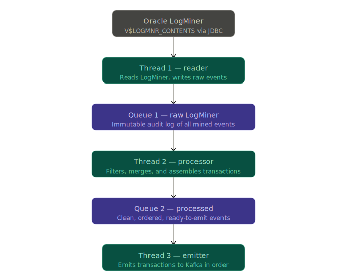

# DDD-36: Oracle Multi-threaded Streaming

## Overview

This document describes a proposed redesign of the Debezium Oracle connector's LogMiner processing pipeline.
The current implementation is single-threaded, combining database reading, event processing, and event dispatch into a sequential flow, which we've traditionally used for all our connectors.
But this approach for LogMiner leads to heap pressure from large in-flight transactions and limits throughput by coupling IO bound and CPU bound work together.

The proposed architecture splits the pipeline into three logical threads, connected by two `ChronicleQueue` instances, both using disk-backed memory-mapped files for inter-thread communication.
This eliminates heap exhaustion for large transactions while improving throughput and scalability.

## Current Architecture

The existing single-threaded flow is:

1. Execute LogMiner SQL, iterate `V$LOGMNR_CONTENTS` results over a JDBC `ResultSet`.
2. Map each row to a `LogMinerEventRow` POJO, parse the associated `SQL_REDO`, and cache the POJO's metadata and parsed `SQL_REDO` as a `LogMinerEvent` object in the transaction buffer.
3. On `COMMIT`, pop the transaction off the buffer, apply merge/discard logic, and emit.
4. On `ROLLBACK`, pop the transaction off the buffer, discarding the entire transaction and event list.

The primary limitations of this approach are:

* **Heap Exhaustion**: Large or long-running transactions accumulate unbounded heap usage as events are buffered until a `COMMIT` or `ROLLBACK` is observed. 
While the connector does have off-heap buffer options using Infinispan and Ehcache, the disk-based persistence offered by these solutions is slow, and contributes to throughput issues.
* **Coupled I/O**: The database reader stalls while processing and emitting events, reducing the LogMiner query throughput.
* **No audit trail**: All LogMiner output is discarded after processing, with no ability to replay and/or inspect what we originally mined.
This becomes even more important as Oracle often only retains logs for a limited period of time (sometimes hours).

## Goal

The goal of this proposal is:

* Provide an alternative architecture that leverages multiple threads to scale the capture, coordinating, and applying of change events read from LogMiner.
This model mirrors a similar architecture used by Oracle for Oracle 23/26 XStream and GoldenGate.
* The implementation must be optional, and opt-in. Due to some of the limitations with `ChronicleQueue` and memory-mapped files, not every environment will be a good fit, and users need a fallback solution.
Additionally, if the single-threaded model is kept, it can act as a fallback when things go wrong during the multithreaded development/feedback cycle of the feature.

## Proposed Architecture

### High-Level Flow



Each thread is fully decoupled from the others.
Threads 1 and 3 are purely I/O-bound.
Thread 2 owns all the processing logic.
The two `ChronicleQueue` queue instances serve as durable, disk-backed inter-thread transports, replacing heap or other off-heap solutions.

### Thread 1 - Reader

Thread 1 is a deliberately simple, fast database reader.
Its only job is to execute the LogMiner SQL, iterate the `ResultSet`, mapping each row to a structured entry written to Queue 1.
It contains no business logic.

#### Behavior

* Executes LogMiner SQL against `V$LOGMNR_CONTENTS`
* Maps each JDBC row to an entry in Queue 1 (see below)
* Tracks Queue 1's [last written high watermark](#last-written-high-watermark) to avoid duplicate writes on restarts or re-reads
* Returns to querying the next LogMiner batch as fast as possible

#### High-watermark tracking

In the current architecture, Debezium resumes from the `scn` value in the offsets, which is the eldest in-flight transaction that was previously buffered, and rebuffers changes from this point forward.
If a transaction has previously been seen, by comparing its `XID` or `COMMIT_SCN` values to information in the offsets, the transaction is discarded.
If a transaction has not been seen previously, Debezium iterates all events, and dispatches them.
If a transaction was mid-dispatch when the connector restarted, the algorithm uses the current `txId` and `txSeq` to dispatch only the portion of the transaction not sent previously.

In the new multithreaded model, things remain quite similar.
The reader thread (Thread 1) resumes reading from the `scn` value in the offsets.
The thread records the current queue offset/index where it starts, and reprimes the queue just like the old approach reprimed the transaction buffer.

Ideally, it would be even better if we tracked per-event position, like XStream, which would allow the re-prime to be more efficient, only appending rows we had not previously seen, even for in-flight transactions.
This would use the [last written high watermark](#last-written-high-watermark), to compare an event's position before it's appended to the queue, e.g.:

```java
if (logMinerEventRow.getPosition() > lastWrittenWatermark) {
  writeRowToQueue(logMinerEventRow);
  updateLastWrittenWatermark(logMinerEventRow);
}
```

If we can achieve this, the `lastWrittenWatermark` would be tracked in the offsets and JMX metrics. 

### Queue 1 - LogMiner Raw Data

Queue 1 is an immutable, append-only audit log of everything Oracle LogMiner has produced.
It serves two primarily roles:

1. **Inter-thread transport**: Thread 2 will read from it to process transactions.
2. **Audit Log**: This can be retained for debugging purposes or the ability to replay events.

#### Entry Schema

Each entry in the queue contains a set of structured uncompressed metadata key/value pairs, followed by the `SQL_REDO` payload.

The following are the uncompressed metadata fields.
These fields are not compressed as they're read by Thread 2 to maximize Chronicle Queue pre-processing pass speeds.

| Field            | Type     | Notes                                                          |
|------------------|----------|----------------------------------------------------------------|
| `XID`            | `String` | Transaction identifier                                         |
| `SCN`            | `String` | System change number                                           |
| `OPERATION_CODE` | `int`    | Oracle's numeric operation code                                |
| `THREAD#`        | `int`    | Assigned redo thread number                                    |
| `TABLE_NAME`     | `String` | The fully qualified `TableId` value, serialized as a `String`  |
| `ROW_ID`         | `String` | The Oracle unique table row identifier assigned to the change  |
| `CSF`            | `int`    | Continuation flag (1=next row merge with this row, 0=last row) |
| `ROLLBACK`       | `int`    | Savepoint/Partial rollback flag                                |
| `RS_ID`          | `String` | Rollback segement identifier                                   |
| `SSN`            | `int`    | SQL sequence number                                            |

The following are the compressed fields.

| Field      | Type     | Notes                                        |
|------------|----------|----------------------------------------------|
| `SQL_REDO` | `String` | The raw Oracle reconstructed SQL, compressed |

#### Compression

The `SQL_REDO` column is the dominant contributor to Queue 1 disk usage.
Oracle's reconstructed SQL is highly repetitive (table names, column names, and so on).
When this is repeated across multiple rows, this compresses quite well.
Compression is applied at the field level, leaving all metadata fields uncompressed.

Queue compression will be made configurable:

```java
public enum SqlRedoCompression {
    NONE, // fastest write/read, highest disk usage
    LZ4,  // default - low CPU overhead, good ratio
    ZSTD, // best ratio, higher CPU and recommended for large transactions
}
```

The `LZ4` compression is recommended and the default, while `ZSTD` is preferred in Oracle environments where long-running transactions risk disk exhaustion.

#### Retention / Cleanup

The Queue 1 entries are retained until both of the following conditions are met:

1. The `scn >= queueEntry.SCN` (Thread 1 has advanced past this entry)
2. The `commit_scn >= queueEntry.SCN` (Thread 3 has emitted the transaction containing the entry)

Cleanup is driven by `StoreFileListener`, which fires when a queue file reaches maximum capacity and rolls.
When the queue rolls to a new active file, non-active files become eligible for deletion.

A map of "roll cycle to maximum SCN" is maintained by Thread 1, and used to evaluate the deletion condition:

```java
private boolean isSafeToDelete(int cycle) {
    final long maxScnInCycle = cycleScnIndex.getMaxScn(cycle);
    return scnWatermark >= maxScnInCycle && commitScnWatermark >= maxScnInCycle;
}
```

### Thread 2 - Processor

Thread 2 owns all transaction processing logic.
It is responsible for reading from Queue 1, reconstructs transactions by `XID` (transaction id), applies the multiple event consolidation into a single logical event as well as partial rollback discard rules, and writes the final reconstructed set of events for each transaction into Queue 2.

#### Transaction Index Lookup

Thread 2 is responsible for maintaining a lightweight heap map of in-flight transactions:
```java
Map<String, Long> transactionIdToBeginIndex; // XID to Queue 1 index of BEGIN events
```

This map holds only a `long` index per transaction (8 bytes), regardless of how many events the transaction contains.
The event payloads themselves remain on disk in Queue 1.
This eliminates the heap exhaustion risk that is present in the current implementation.

#### Processing Flow

When Thread 2 observes a `COMMIT` for a given `XID`, it performs two unique passes over the transaction's entries in Queue 1.

**Pass 1: Build thin index**

Thread 2 seeks to the stored `BEGIN` index for the `XID`, reading the queue forward until the `COMMIT`.
During this pass, only uncompressed metadata key/value pairs are used.
This pass builds:

1. `List<ThinIndex>`: a lightweight index of all events in the transaction
2. `Set<Long> skipIndexes`: Set of indices from Queue 1 for the transaction to discard (e.g. partial rollbacks)
3. `Map<LobKey, LobGroup>`: Grouping of LOB fragment sequences for merges.

**Pass 2: Assemble**

Thread 2 iterates the `ThinIndex` list and for each retained event, seeks back to its `queueIndex` in Queue 1, decompresses the `SQL_REDO`, and writes the final event to Queue 2.
Any event in `skipIndexes` are never decompressed.

For LOB merge events, Pass 2 seeks to each fragment's `queueIndex`, decompresses and merges the fragment values.
This simulates the logic that currently exists inside the `TransactionCommitConsumer` implementation.
Once all groupings are merged, the consolidated event is written to Queue 2.

**Discard Logic - Partial Rollbacks**

LogMiner emits events with `ROLLBACK=1` flag.
This most often is when a savepoint is rolled back within a transaction, but can represent other scenarios like constraint violations, where Oracle records the original insert, and then reverts it due to the constraint.
These events cancel earlier events that often have the same `ROW_ID`.
Both the original and the rollback event are added to the `skipIndexes`, and are excluded from Queue 2, as well as the decompression of their respective `SQL_REDO` column.

**Rollback Handling**

When Thread 2 observes a `ROLLBACK` for a transaction, the entire transaction is discarded.
In this case, the `xidToBeginIndex` entry for the transaction's `XID` is removed and nothing is written to Queue 2.

### Queue 2 - Processed Events

Queue 2 contains the final, clean set of events to be emitted to the target system.
It is written exclusively by Thread 2 and read exclusively by Thread 3.

Each transaction in Queue 2 begins with a `BEGIN` event, followed by its events and terminated by a `COMMIT`.
The `COMMIT` marker carries the `commit_scn` along with an event count.
Thread 3 waits for this `COMMIT` marker before emitting the transaction.

#### Entry Schema

Queue 2 entries are fully processed, structured events with parsed column values and no raw SQL, unless the user has configured to include the raw SQL.
If the SQL is to be included, it will be compressed.
The exact schema to be used here generally will align to contain all needed fields to populate the `source` information block and the `before` and `after` portions of a Debezium event.

### Thread 3 - Emitter

Thread 3 is purely an IO-bound producer thread.
It reads all processed events from Queue 2 and emits them as `SourceRecord` instances.
All events are emitted from Queue 2 in transaction commit chronological order.

The `commit_scn` represents the highest transaction's commit point for a given Oracle redo thread.
Thread 3 is responsible for maintaining this offset state.

There are several benefits by splitting the dispatch to the `EventDispatcher` to a separate thread:

* Because the LogMiner implementation buffers all events for a transaction until the `COMMIT` is observed, this can create a high burst of events into the `ChangeEventQueue` that the `EventDispatcher` enqueues.
If this queue is left to its default of 8k, or even sized to 16k or 32k, large transactions can quickly consume the entire buffer, placing back-pressure on the mining process.
* When an event is dispatched to the `EventDispatcher`, this is also where the configured post processor implementations are called. 
If the configuration uses a `ReselectPostProcessor`, this can easily cause latency/back-pressure due to the reselection of LOB columns.

> [!NOTE]
> It is possible that thread 3 could be eliminated by relying on a custom pluggable dequeue, see [DBZ-8968](https://github.com/debezium/debezium/pull/6468).
> This would allow thread 2 to enqueue directly without concerns of back-pressure if the pluggable dequeue had reasonable size limits for a system's largest transactions.

## Chronicle Queue

> [!IMPORTANT]
> While this document explicitly discusses `ChronicleQueue` as a first-class citizen in the design, it should be treated as an implementation detail.
> The solution should be extendable, supporting other potential similar solutions that could be leveraged where memory-mapped files aren't possible.

### Configuration

Both Queue 1 and 2 are constructed using `SingleChronicleQueueBuilder`:
```java
SingleChronicleQueueBuilder
        .binary(queueDirectory)
        .rollCycle(RollCycles.HOURLY)
        .blockSize(64 << 20)
        .storeFileListener(storeFileListener)
        .build();
```

* **One entry per row**: The `writeDocument` API must be called once per `ResultSet` row, not once per batch. 
Wrapping multiple `ResultSet` rows in a single `writeDocument` will exhaust the mapped chunk boundary, and throw a `DecoratedBufferOverflowException`.
* **Roll Cycle**: hourly rolling with aggressive cleanup keeps disk usage bounded, subject to long-running transactions.
* **Block Size**: A 64MB block size by default. This should be tunable based on observed average entry size.

### Concerns

#### Requires memory-mapped filesystem support

`ChronicleQueue` uses memory-mapped files, and these are not possible or reliable across every filesystem. 
As outlined in [this section](https://github.com/OpenHFT/Chronicle-Queue/?rgh-link-date=2026-04-10T12%3A14%3A21Z#usage), this prevents the use of things like NFS, AFS, SAN-based, or other storages that use network-based file systems.

#### JVM argument requirements

`ChronicleQueue` does come with its own sets of concerns, most notably the requirement to set the following JVM arguments due to how the library uses various Sun-specific APIs:

```text
--add-exports=java.base/jdk.internal.ref=ALL-UNNAMED
--add-exports=java.base/sun.nio.ch=ALL-UNNAMED 
--add-exports=jdk.unsupported/sun.misc=ALL-UNNAMED 
--add-exports=jdk.compiler/com.sun.tools.javac.file=ALL-UNNAMED 
--add-opens=jdk.compiler/com.sun.tools.javac=ALL-UNNAMED 
--add-opens=java.base/java.lang=ALL-UNNAMED 
--add-opens=java.base/java.lang.reflect=ALL-UNNAMED 
--add-opens=java.base/java.io=ALL-UNNAMED 
--add-opens=java.base/java.util=ALL-UNNAMED
```

The library authors are already working on newer releases not to require these without any loss of performance.

## Scalability

### Multiple Kafka Connect Tasks?

By utilizing multiple threads to handle independent stages during streaming with inter-thread concurrent transport, a given stage could be promoted to a Kafka Connect task instead.
By using multiple tasks, this would allow the connector to take advantage of a Kafka Connect cluster's full processing power, similar to how Google Spanner works.

### Fan-out per Pluggable Database

Given that Oracle transactions cannot span across a pluggable database boundary, there is the possibility to use multiple threads/tasks to fan out the workload per PDB.
In this setup, rather than using a single T1/T2/T3/Q1/Q2 set to read all changes for all pluggable databases, the connector could fan out to N-sets (where N is the number of captured PDBs).

While a fan-out of N readers increases the load on Oracle, it does provide the benefit to capture changes for PDBs in a way where high activity in one PDB does not cause latency for capturing changes to the other PDB.

### Parallelization LogMiner reads

With the new log-count/size based mining algorithm, this introduces the potential possibility to scale the reader thread using a fan-out worker strategy during bursts.
There are some concerns with long-running transactions that need to be dealt with, but this architecture lends itself to scaling independent isolated portions of the pipeline.

## Open Items

TBD

## Appendix

### Last Written High Watermark

Oracle's system change number (SCN) is not unique, and can be assigned to two or more changes.
In order, to create a high-watermark, one must use a concatenation of multiple values, that include things like the commit scn (CSCN), event scn (SCN), transaction id (XID), sequence within the transaction (SSN), and the relative byte access (RBA) in the transaction logs. 
