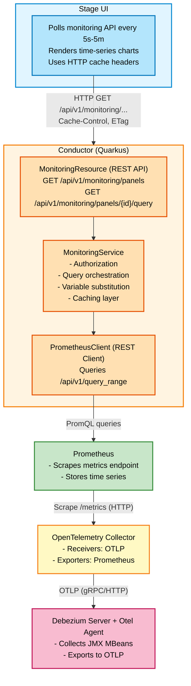
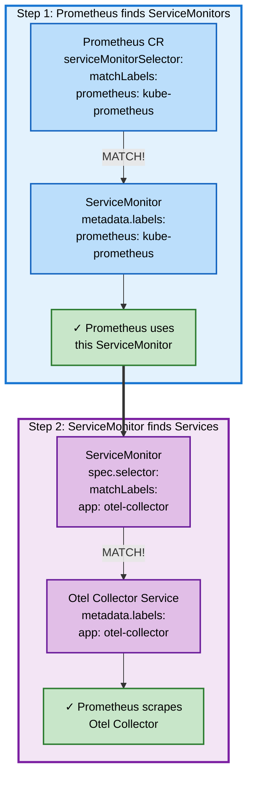

# DDD-38: Pipeline Monitoring for Debezium Platform

## Motivation

The Debezium Platform enables users to create and manage data pipelines through the Stage UI. However, the platform currently lacks integrated monitoring capabilities, which is a critical gap for production deployments.

**Why monitoring is essential:**

Users need visibility into pipeline health and performance to operate data pipelines effectively. Key questions that users must be able to answer include:
- Is my pipeline running correctly?
- What is the current replication lag between source and destination?
- How many events are being processed per second?
- Are there any errors or bottlenecks in the pipeline?
- Has the initial snapshot completed, and how much progress has been made?

Without built-in monitoring, users must either:
- Deploy and maintain separate monitoring infrastructure (Prometheus, Grafana, configure dashboards)
- Query metrics manually through external tools
- Operate pipelines without visibility into their operational state

This represents a significant operational burden and increases the barrier to adoption for users who want a complete, integrated platform experience.

## Goals

### Primary Objectives

1. **Expose pipeline metrics** - Make Debezium Server operational metrics accessible to users through the Stage UI
2. **Integrated user experience** - Monitoring embedded in Stage UI without requiring separate tools or authentication
3. **Real-time monitoring** - Display current and historical metrics through efficient polling mechanisms
4. **Simple deployment** - Monitoring infrastructure deployed alongside the platform with minimal configuration

## Proposed Solution: OpenTelemetry + Prometheus + Custom REST API

### Overview

The monitoring system consists of four key components working together:

1. **OpenTelemetry Java Agent** on Debezium Server instances to collect metrics from JMX MBeans
2. **OpenTelemetry Collector** to receive, process, and export metrics
3. **Prometheus** (installed or external) to scrape and store time-series data from the Otel Collector
4. **Custom REST API** in Conductor to query metrics and serve them to Stage UI with caching

This approach provides end-to-end observability from metric collection to visualization while establishing OpenTelemetry as the foundation for future native instrumentation. The architecture enables a gradual migration path from agent-based collection to OpenTelemetry SDK native instrumentation.

### Architecture



Following the **Data flow:**
1. Debezium Server (with Otel Agent) exports metrics to Otel Collector via OTLP
2. Otel Collector processes and exposes metrics via Prometheus exporter
3. Prometheus scrapes Otel Collector's `/metrics` endpoint
4. User navigates to pipeline monitoring page in Stage UI
5. Stage UI polls: `GET /api/v1/monitoring/panels/{panelId}/query?pipeline_id=X&start=...&end=...`
6. Conductor checks cache for recent query results
7. If cache miss: queries Prometheus with `rate(debezium_metrics_events_filtered{service_name="X"}[5m])`
8. Prometheus returns time-series data
9. Conductor transforms to compact format and caches with TTL
10. Response sent to UI with Cache-Control headers
11. Browser caches response to avoid redundant requests
12. UI renders time-series chart


### Component 1: OpenTelemetry Java Agent on Debezium Server

#### Built-in Support

The Debezium Server container image **already includes** the OpenTelemetry Java Agent. This will be restructured to align with the existing metrics infrastructure:

**Current state:**
- OpenTelemetry Java Agent is bundled in the Debezium Server image
- No standardized configuration for Debezium-specific MBeans

**Target state (to be implemented):**
- Move the Otel Java Agent to the `debezium-server-dist` module under `src/main/resources/distro/lib_metrics/`
- Provide an `enable_otel_agent.sh` script (similar to the existing `enable_exporter.sh` for JMX exporter)
- Include pre-configured collector settings for Debezium JMX MBeans

**Example structure:**
```
debezium-server-dist/src/main/resources/distro/
├── lib_metrics/
│   ├── opentelemetry-javaagent-*.jar
│   ├── enable_otel_agent.sh           # New script
│   └── otel-config/
│       └── debezium-jmx-config.yaml   # JMX metric collection config
```

**enable_otel_agent.sh script:**
```bash
#!/bin/bash
# To enable OpenTelemetry Java Agent, set OTEL_AGENT_ENABLED environment variable

if [ -n "${OTEL_AGENT_ENABLED}" ]; then
  OTEL_CONFIG_FILE=${OTEL_CONFIG_FILE:-"config/otel-jmx-config.yaml"}
  OTEL_AGENT_JAR=$(find lib_metrics -name "opentelemetry-javaagent-*.jar")
  OTEL_EXPORTER_OTLP_ENDPOINT=${OTEL_EXPORTER_OTLP_ENDPOINT:-"http://otel-collector:4317"}
  
  export JAVA_OPTS="-javaagent:${OTEL_AGENT_JAR} \
    -Dotel.jmx.target.system=debezium \
    -Dotel.jmx.config=${OTEL_CONFIG_FILE} \
    -Dotel.exporter.otlp.endpoint=${OTEL_EXPORTER_OTLP_ENDPOINT} \
    -Dotel.metrics.exporter=otlp \
    -Dotel.service.name=${OTEL_SERVICE_NAME:-debezium-server} \
    ${JAVA_OPTS}"
fi
```

#### Configuration via Debezium Operator

The Debezium Operator will be extended to support **both JMX Exporter and OpenTelemetry Agent** configurations, allowing users to choose their preferred monitoring approach.

**Current state:**
- Operator supports JMX Exporter configuration (existing feature)

**Future state:**
- Operator supports both JMX Exporter and OpenTelemetry Agent
- Users choose one approach per pipeline (mutually exclusive)

**OpenTelemetry configuration (to be implemented):**

```yaml
apiVersion: debezium.io/v1alpha1
kind: DebeziumServer
metadata:
  name: pipeline-123
spec:
  runtime:
    metrics:
      opentelemetry:
        enabled: true
        collector:
          endpoint: http://otel-collector.monitoring.svc:4317
```

The operator will automatically:
- Configure the OpenTelemetry Java Agent on the Debezium Server pod
- Set environment variables (`OTEL_AGENT_ENABLED=true`, `OTEL_EXPORTER_OTLP_ENDPOINT`)
- Inject the service name (`OTEL_SERVICE_NAME=pipeline-123`)
- Configure resource attributes (pipeline ID, connector type, etc.)

**JMX Exporter configuration (existing):**

```yaml
apiVersion: debezium.io/v1alpha1
kind: DebeziumServer
metadata:
  name: pipeline-123
spec:
  runtime:
    metrics:
      jmxExporter:
        enabled: true
```

This configuration continues to work as before, creating a Service with the `debezium.io/classifier: jmx-exporter` label for Prometheus scraping.

**Migration strategy:**

Users running existing pipelines with JMX Exporter can continue using that approach. New pipelines can opt into OpenTelemetry. Over time, as OpenTelemetry becomes the default, the platform documentation will recommend Otel for new deployments while maintaining backward compatibility with JMX Exporter.

#### JMX MBean Collection

The OpenTelemetry Java Agent collects metrics from Debezium's JMX MBeans using the JMX Metric Gatherer extension. 

**debezium-jmx-config.yaml:**
```yaml
rules:
  # Streaming metrics
  - bean: debezium.postgres:type=connector-metrics,context=streaming,server=*,task=*
    metricAttribute:
      context: streaming
    mapping:
      MilliSecondsSinceLastEvent:
        metric: debezium.metrics.milliseconds_since_last_event
        type: gauge
        desc: Milliseconds since the last event was processed
      TotalNumberOfEventsSeen:
        metric: debezium.metrics.total_events_seen
        type: counter
        desc: Total number of events seen by the connector
      NumberOfEventsFiltered:
        metric: debezium.metrics.events_filtered
        type: counter
        desc: Number of events filtered by transformations
      
  # Snapshot metrics
  - bean: debezium.postgres:type=connector-metrics,context=snapshot,server=*
    metricAttribute:
      context: snapshot
    mapping:
      TotalTableCount:
        metric: debezium.metrics.snapshot.total_tables
        type: gauge
      RemainingTableCount:
        metric: debezium.metrics.snapshot.remaining_tables
        type: gauge
      SnapshotRunning:
        metric: debezium.metrics.snapshot.running
        type: gauge
      SnapshotCompleted:
        metric: debezium.metrics.snapshot.completed
        type: gauge
```

#### Metric Labels

Exported metrics include these labels (as OTLP resource attributes):
- `service.name` - Debezium Server name (maps to pipeline ID)
- `debezium.connector.type` - Connector type (postgresql, mysql, oracle, sqlserver, etc.)
- `context` - Metric category (snapshot, streaming, schema, transaction)
- `task` - Task ID for parallel tasks

Example OTLP metric:
```
debezium_metrics_events_filtered{
  service.name="pipeline-123",
  debezium.connector.type="postgresql",
  context="streaming",
  task="0"
} 42.0
```

### Component 2: OpenTelemetry Collector

The OpenTelemetry Collector acts as a central aggregation and processing layer for metrics from all Debezium Server instances.

#### Deployment

The Otel Collector will be deployed as a Kubernetes Deployment (or StatefulSet) within the platform namespace, with a Service exposing the OTLP receiver endpoints.

**Deployment configuration:**
```yaml
apiVersion: apps/v1
kind: Deployment
metadata:
  name: otel-collector
spec:
  replicas: 1
  template:
    spec:
      containers:
        - name: otel-collector
          image: otel/opentelemetry-collector-contrib:0.98.0
          ports:
            - containerPort: 4317  # OTLP gRPC
              name: otlp-grpc
            - containerPort: 4318  # OTLP HTTP
              name: otlp-http
            - containerPort: 8889  # Prometheus exporter
              name: prometheus
```

#### Configuration

The Otel Collector configuration defines:
1. **Receivers**: OTLP (gRPC and HTTP) to receive metrics from Debezium Server instances
2. **Processors**: Batch processor for efficient metric handling, resource detection
3. **Exporters**: Prometheus exporter to expose metrics for scraping

**otel-collector-config.yaml:**
```yaml
receivers:
  otlp:
    protocols:
      grpc:
        endpoint: 0.0.0.0:4317
      http:
        endpoint: 0.0.0.0:4318

processors:
  batch:
    timeout: 10s
    send_batch_size: 1024
  
  # Add resource attributes for better context
  resource:
    attributes:
      - key: deployment.environment
        value: debezium-platform
        action: insert

exporters:
  prometheus:
    endpoint: "0.0.0.0:8889"
    namespace: debezium
    const_labels:
      platform: debezium-platform
    # Convert OTLP metrics to Prometheus format
    resource_to_telemetry_conversion:
      enabled: true

service:
  pipelines:
    metrics:
      receivers: [otlp]
      processors: [batch, resource]
      exporters: [prometheus]
```

#### Metric Transformation

The Prometheus exporter in the Otel Collector automatically converts OTLP metrics to Prometheus format:

**OTLP format (from Java Agent):**
```
Metric: debezium.metrics.events_filtered
Resource attributes: {service.name="pipeline-123", debezium.connector.type="postgresql"}
Data point: 42.0
```

**Prometheus format (exposed at :8889/metrics):**
```
debezium_metrics_events_filtered{
  service_name="pipeline-123",
  debezium_connector_type="postgresql",
  platform="debezium-platform"
} 42.0
```

#### Service Discovery

The Otel Collector's Prometheus exporter endpoint is exposed via a Kubernetes Service, which Prometheus scrapes:

```yaml
apiVersion: v1
kind: Service
metadata:
  name: otel-collector
  labels:
    app: otel-collector
    debezium.io/classifier: otel-metrics  # For Prometheus ServiceMonitor
spec:
  ports:
    - name: otlp-grpc
      port: 4317
      protocol: TCP
    - name: otlp-http
      port: 4318
      protocol: TCP
    - name: prometheus
      port: 8889
      protocol: TCP
  selector:
    app: otel-collector
```

### Component 3: Prometheus Deployment

The platform will support **three deployment scenarios** to accommodate different user environments.

#### Understanding ServiceMonitor (Prometheus Operator Concept)

ServiceMonitor is a Custom Resource Definition (CRD) provided by Prometheus Operator that enables **automatic service discovery**. 
It acts as a bridge between Prometheus and Kubernetes Services.

**How it works - Two-level label matching:**



**Example scenario:**

1. **Platform deploys OpenTelemetry Collector Service**:
   ```yaml
   apiVersion: v1
   kind: Service
   metadata:
     name: otel-collector
     labels:
       app: otel-collector  # ← ServiceMonitor looks for this
   spec:
     ports:
       - name: prometheus
         port: 8889
   ```

2. **Platform creates ServiceMonitor**:
   ```yaml
   apiVersion: monitoring.coreos.com/v1
   kind: ServiceMonitor
   metadata:
     name: debezium-otel-collector
     labels:
       prometheus: kube-prometheus  # ← Prometheus looks for this
   spec:
     selector:
       matchLabels:
         app: otel-collector  # ← Finds Otel Collector Service
     endpoints:
       - port: prometheus
         interval: 15s
   ```

3. **Prometheus Operator configures Prometheus**:
   - Finds ServiceMonitor (matches `prometheus: kube-prometheus` label)
   - Reads ServiceMonitor's selector
   - Finds the Service with `app: otel-collector`
   - Automatically updates Prometheus scrape configuration
   - Prometheus starts scraping `http://otel-collector:8889/metrics`

**Key benefit:** All pipeline metrics flow through the central Otel Collector, which aggregates and exposes them via a single Prometheus endpoint. This simplifies Prometheus configuration and reduces scrape overhead compared to scraping each pipeline individually.

#### Deployment Options

#### Option 1: Install Prometheus Operator (Default)

Deploy `kube-prometheus-stack` as a Helm chart dependency. Prometheus automatically discovers the OpenTelemetry Collector via `ServiceMonitor` custom resource.

**Helm Chart dependency:**
```yaml
dependencies:
  - name: kube-prometheus-stack
    version: "~56.0.0"
    repository: https://prometheus-community.github.io/helm-charts
    condition: monitoring.prometheus.install
```

**ServiceMonitor for auto-discovery:**
```yaml
apiVersion: monitoring.coreos.com/v1
kind: ServiceMonitor
metadata:
  name: debezium-otel-collector
spec:
  selector:
    matchLabels:
      app: otel-collector
  endpoints:
    - port: prometheus
      interval: 15s
```

**Benefits:**
- Single scrape endpoint for all pipeline metrics
- Declarative configuration
- No manual Prometheus updates required
- Otel Collector handles metric aggregation and transformation

#### Option 2: Use Existing Prometheus Operator

Connect to user's existing Prometheus Operator installation. Platform creates a `ServiceMonitor` that:
- Uses `spec.selector` to match the OpenTelemetry Collector Service (with `app: otel-collector` label)
- Has custom `metadata.labels` so the user's Prometheus Operator discovers the ServiceMonitor

**Configuration:**
```yaml
monitoring:
  prometheus:
    install: false
    external:
      url: http://prometheus-operated.monitoring.svc:9090
      usesOperator: true
  serviceMonitor:
    labels:
      # Labels on the ServiceMonitor resource itself
      # Must match the user's Prometheus serviceMonitorSelector
      prometheus: kube-prometheus
```

**Created ServiceMonitor:**
```yaml
apiVersion: monitoring.coreos.com/v1
kind: ServiceMonitor
metadata:
  name: debezium-otel-collector
  labels:
    # User's Prometheus looks for ServiceMonitors with these labels
    prometheus: kube-prometheus
spec:
  selector:
    matchLabels:
      # ServiceMonitor finds the Otel Collector Service
      app: otel-collector
  endpoints:
    - port: prometheus
      interval: 15s
```

**Requirements:**
- User's Prometheus Operator configured with `serviceMonitorSelector` matching the labels specified
- Network access to platform namespace

#### Option 3: Use Existing Vanilla Prometheus

Connect to user's existing Prometheus (without Operator). Platform provides manual scrape configuration via Helm installation NOTES.

**Configuration:**
```yaml
monitoring:
  prometheus:
    install: false
    external:
      url: http://prometheus-server.monitoring.svc:9090
      usesOperator: false
```

**User must manually add to `prometheus.yml`:**
```yaml
scrape_configs:
  - job_name: 'debezium-otel-collector'
    static_configs:
      - targets:
          - 'otel-collector.<platform-namespace>.svc:8889'
        labels:
          platform: debezium
```

Alternatively, with Kubernetes service discovery:
```yaml
scrape_configs:
  - job_name: 'debezium-otel-collector'
    kubernetes_sd_configs:
      - role: service
        namespaces:
          names:
            - <platform-namespace>
    relabel_configs:
      - source_labels: [__meta_kubernetes_service_label_app]
        regex: otel-collector
        action: keep
      - source_labels: [__meta_kubernetes_service_name]
        target_label: instance
```

Helm chart displays context-aware instructions in NOTES.txt after installation.

### Component 4: Custom REST API in Conductor

#### Architecture

**MonitoringResource** (REST controller):
- `GET /api/v1/monitoring/panels` - List available panels
- `GET /api/v1/monitoring/panels/{id}/query` - Query panel data with time range

**MonitoringService** (business logic):
- Query orchestration: Substitute `{{pipeline_id}}` template variable
- Response transformation: Convert Prometheus response to compact format
- Caching: Reduce load on Prometheus with dynamic TTL

**PrometheusClient** (REST client):
- MicroProfile REST Client to query Prometheus `/api/v1/query_range`
- Timeout: 30s (configurable)

**MonitoringCache** (Caffeine):
- In-memory cache with dynamic TTL based on data freshness
- Max 1000 entries (configurable)
- Cache invalidation on pipeline deletion

#### API Endpoints

**List Available Panels:**
```
GET /api/v1/monitoring/panels
```

Response:
```json
{
  "panels": [
    {
      "id": "events-filtered",
      "title": "Events Filtered",
      "description": "Number of events filtered by transformations per second",
      "category": "streaming",
      "unit": "events/s",
      "visualization": {
        "type": "line",
        "suggested_step": "15s"
      }
    }
  ]
}
```

**Query Panel Data:**
```
GET /api/v1/monitoring/panels/{panelId}/query
  ?pipeline_id=pipeline-123
  &start=2026-04-23T10:00:00Z
  &end=2026-04-23T11:00:00Z
  &step=1m
```

Response:
```json
{
  "panel_id": "events-filtered",
  "pipeline_id": "pipeline-123",
  "time_range": {
    "start": "2026-04-23T10:00:00Z",
    "end": "2026-04-23T11:00:00Z",
    "step": "1m"
  },
  "series": [
    {
      "labels": {
        "context": "streaming",
        "plugin": "postgresql"
      },
      "datapoints": [
        [1745414100, 35.2],
        [1745414160, 37.8],
        [1745414220, 42.1]
      ]
    }
  ],
  "metadata": {
    "cached": false,
    "query_duration_ms": 45
  }
}
```

**Data format optimization:**
- Compact array-of-arrays: `[[timestamp, value], ...]`
- ~53% smaller than verbose JSON (object per datapoint)
- Timestamps in Unix epoch (seconds)

#### Panel Configuration

Panels defined in YAML configuration (single source of truth):

```yaml
monitoring:
  panels:
    - id: events-filtered
      title: "Events Filtered"
      description: "Number of events filtered by transformations per second"
      category: streaming
      query: 'rate(debezium_metrics_events_filtered{service_name="{{pipeline_id}}"}[5m])'
      unit: events/s
      visualization:
        type: line
        suggested_step: 15s

    - id: replication-lag
      title: "Replication Lag"
      description: "Time lag between source database and connector"
      category: streaming
      query: 'debezium_metrics_milliseconds_behind_source{service_name="{{pipeline_id}}"}'
      unit: ms
      visualization:
        type: line
        suggested_step: 15s
```

**Variable substitution:**
- `{{pipeline_id}}` replaced with actual pipeline ID from query parameters
- Prevents PromQL injection attacks (only predefined queries allowed)
- Input validation: `pipeline_id` verified against existing pipelines

**Metric naming:**
- OpenTelemetry conventions use snake_case for metric names
- Resource attribute `service.name` becomes label `service_name` in Prometheus
- The Otel Collector's Prometheus exporter automatically converts OTLP metrics to Prometheus format

#### Predefined Panels

Based on the [official Debezium Grafana dashboard](https://github.com/debezium/debezium-examples/blob/main/monitoring/debezium-grafana/debezium-dashboard.json), the following panels will be provided:

**Streaming Metrics:**
- **Time Since Last Event**: `debezium_metrics_milliseconds_since_last_event` - Gauge showing milliseconds since last event received (indicates if pipeline is stalled)
- **Event Count**: `debezium_metrics_total_events_seen` and `debezium_metrics_events_skipped` - Line graph showing total events processed and skipped
- **Connected**: `debezium_metrics_connected` - Boolean indicator (0/1) showing database connection status

**Snapshot Metrics:**
- **Table Count**: `debezium_metrics_snapshot_total_tables` - Total number of tables to snapshot
- **Remaining Tables**: `debezium_metrics_snapshot_remaining_tables` - Number of tables yet to be snapshotted
- **Snapshot Running**: `debezium_metrics_snapshot_running` - Boolean indicator (0/1) if snapshot is currently running
- **Snapshot Completed**: `debezium_metrics_snapshot_completed` - Boolean indicator (0/1) if snapshot has completed
- **Snapshot Aborted**: `debezium_metrics_snapshot_aborted` - Boolean indicator (0/1) if snapshot was aborted
- **Rows Scanned**: `debezium_metrics_snapshot_rows_scanned` - Table showing rows scanned per table during snapshot

**Optional Advanced Panels** (JVM/Infrastructure - lower priority):
- Heap Memory Usage
- Thread Count

**Note:** The exact metric names depend on the JMX metric gatherer configuration. The names above follow OpenTelemetry naming conventions (snake_case). The mapping from Debezium JMX MBean attributes to Otel metric names is defined in the `debezium-jmx-config.yaml` file.

### Component 5: Stage UI Integration

**Responsibilities:**
- Poll Conductor monitoring API at configurable intervals (5s, 10s, 30s, 1m, 5m)
- Render time-series charts (line graphs, area charts)
- Automatically use browser HTTP cache based on Cache-Control headers

**Data flow:**
1. Debezium Server (with Otel Agent) exports metrics to Otel Collector via OTLP
2. Otel Collector processes and exposes metrics via Prometheus exporter
3. Prometheus scrapes Otel Collector's `/metrics` endpoint
4. User navigates to pipeline monitoring page in Stage UI
5. Stage UI polls: `GET /api/v1/monitoring/panels/{panelId}/query?pipeline_id=X&start=...&end=...`
6. Conductor checks cache for recent query results
7. If cache miss: queries Prometheus with `rate(debezium_metrics_events_filtered{service_name="X"}[5m])`
8. Prometheus returns time-series data
9. Conductor transforms to compact format and caches with TTL
10. Response sent to UI with Cache-Control headers
11. Browser caches response to avoid redundant requests
12. UI renders time-series chart

## Performance Characteristics

### Caching Strategy (Three Layers)

**Layer 1: Browser Cache**
- HTTP Cache-Control headers (10s-1h based on data freshness)
- No network request if data is fresh

**Layer 2: Conductor Cache (Caffeine)**
- In-memory key-value store with dynamic TTL
- Historical data (ended >5min ago): 24h TTL
- Live data (<15min range): 10s TTL
- Avoids Prometheus queries for repeated requests

**Layer 3: ETag Validation**
- If-None-Match header with ETag
- 304 Not Modified responses (no body)
- Efficient revalidation with minimal bandwidth

### Scalability

- **Stateless API**: Horizontal scaling of Conductor instances
- **Query optimization**: Auto-calculated step based on time range prevents over-fetching
- **Cache per instance**: Each Conductor instance has its own cache (acceptable for read-heavy workload)

## Alternative Approaches Considered

### Embedded Grafana Dashboards

We evaluated embedding Grafana dashboards via iframe as an alternative to building a custom REST API. 
This would have leveraged Grafana's mature visualization features and reduced development effort.

**Approach investigated:**
- Deploy Grafana OSS alongside the platform
- Create public dashboards with monitoring panels
- Embed dashboards in Stage UI via iframe
- Use URL parameters like `?var-pipeline_id=X` to filter metrics per pipeline

**Why this approach was rejected:**

1. **Public Dashboards don't support variables** ([Grafana limitation](https://grafana.com/docs/grafana/latest/visualizations/dashboards/share-dashboards-panels/shared-dashboards/))
   - Public dashboards cannot accept URL parameters for template variables
   - This is a known limitation tracked in [GitHub issue #67346](https://github.com/grafana/grafana/issues/67346)
   - No workaround available as of April 2026

2. **Creating separate dashboards per pipeline is not scalable**
   - Would require one dashboard per pipeline (e.g., 100 pipelines = 100 dashboards)
   - Maintenance nightmare: updates to panel layout require updating all dashboards
   - No single source of truth for dashboard configuration
   - Dashboard sprawl makes it difficult to ensure consistency

3. **Authenticated embedding introduces complexity**
   - Regular (non-public) dashboards support variables but require authentication
   - Creates "double login" UX problem (Stage UI auth + Grafana auth)
   - Requires same-domain deployment and complex cookie/CORS configuration
   - Grafana Cloud explicitly doesn't support authenticated embedding due to security concerns

**Conclusion:** The custom REST API approach provides better control, proper authorization, and eliminates the variable limitation issue while maintaining a consistent user experience within Stage UI.

## Future Extensibility and Evolution

### Migration Path: From Agent to SDK

The current implementation uses the **OpenTelemetry Java Agent** to collect metrics from JMX MBeans without modifying Debezium Server code. However, the long-term vision is to adopt **native OpenTelemetry SDK instrumentation** for better performance, control, and functionality.

**Evolution timeline:**

**Phase 1 (Current):** OpenTelemetry Agent → Otel Collector → Prometheus
- Zero code changes in Debezium Server
- Agent collects JMX metrics via reflection
- Metrics exported to Otel Collector via OTLP

**Phase 2 (Future):** OpenTelemetry SDK → Otel Collector → Prometheus
- Debezium Server integrates OpenTelemetry SDK directly
- Use native instrumentation instead of JMX MBeans
- Better performance (no reflection overhead)
- Richer context propagation (traces, logs correlation)
- Custom metrics beyond what JMX provides

**Phase 3 (Long-term):** Multi-source observability
- Debezium Server: Otel SDK
- Conductor: Otel SDK (Quarkus OpenTelemetry extension)
- Infrastructure: Otel Collector receivers (host metrics, Kubernetes metrics)
- All telemetry flows through Otel Collector for unified processing

**Why this matters:**

1. **OpenTelemetry as default** - Establishes Otel as the observability standard for Debezium Platform
2. **Unified telemetry** - Metrics, traces, and logs in a single pipeline
3. **Cloud-native ready** - Direct integration with OTLP-native backends (Grafana Cloud, Datadog, New Relic, etc.)
4. **Future-proof** - Easier to add custom metrics, distributed tracing, and advanced observability features

### Pluggable Architecture

The architecture can evolve to support different metric sources and storage backends without changing the frontend API contract.

#### Extensibility Points

**1. Metrics Collection Layer**

Current: OpenTelemetry Java Agent collecting JMX metrics

Future options:
- **OpenTelemetry SDK**: Native instrumentation in Debezium Server (planned)
- **Micrometer**: Collect metrics from Conductor (Quarkus Micrometer extension)
- **Custom collectors**: User-provided Otel Collector receivers

**2. Metrics Storage Layer**

Current: Prometheus time-series database

Future options:
- **InfluxDB**: High-cardinality data, Flux query language
- **TimescaleDB**: SQL-based queries, PostgreSQL compatibility
- **Cloud services**: AWS Timestream, Azure Monitor, Google Cloud Monitoring
- **OTLP-native backends**: Grafana Cloud, Datadog, Honeycomb (via Otel Collector exporters)
- **Custom storage**: User-provided implementations

**3. Multi-Source Metrics**

The Otel Collector can aggregate metrics from multiple sources:
- Debezium Server operational metrics (currently: Otel Agent, future: Otel SDK)
- Conductor application metrics (Quarkus Micrometer → Otel Collector bridge)
- Infrastructure metrics (Otel Collector host metrics receiver)
- Kubernetes metrics (Otel Collector k8s cluster receiver)
- Database metrics (custom Otel Collector receivers for pg_stat_*, Oracle AWR, etc.)

### API Stability

**Critical design principle:** The REST API contract (`GET /api/v1/monitoring/panels/{id}/query`) remains stable regardless of backend changes.

- Frontend code unchanged
- Panel query format unchanged
- Response format unchanged
- Authorization model unchanged

Only backend collector and storage implementations become swappable based on configuration.

### When to Implement

This extensibility should be implemented **only when there's proven demand**:

- Multiple users request support for different monitoring stacks
- JMX + Prometheus has limitations for specific use cases
- Users have existing monitoring infrastructure they want to integrate

## References

- [Debezium Monitoring Documentation](https://debezium.io/documentation/reference/stable/operations/monitoring.html)
- [Debezium Monitoring Examples](https://github.com/debezium/debezium-examples/tree/main/monitoring)
- [Prometheus Query API](https://prometheus.io/docs/prometheus/latest/querying/api/)
- [JMX Exporter Configuration](https://github.com/prometheus/jmx_exporter)
- [Grafana Public Dashboards Limitations](https://grafana.com/docs/grafana/latest/visualizations/dashboards/share-dashboards-panels/shared-dashboards/)
- [kube-prometheus-stack Helm Chart](https://github.com/prometheus-community/helm-charts/tree/main/charts/kube-prometheus-stack)
