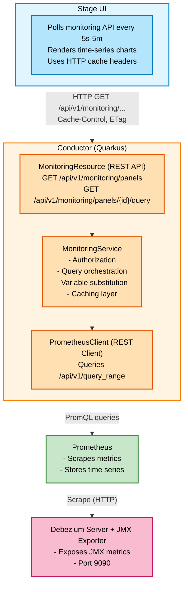
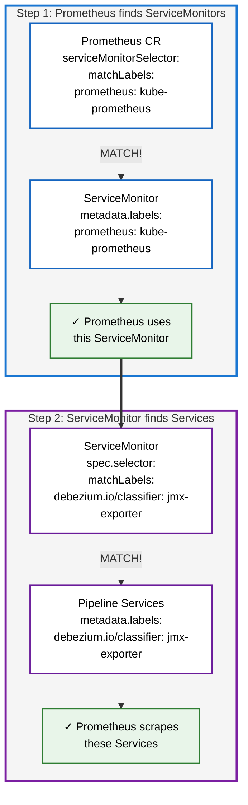

# DDD-38: Pipeline Monitoring for Debezium Platform

## Motivation

The Debezium Platform enables users to create and manage data pipelines through the Stage UI. However, the platform currently lacks integrated monitoring capabilities, which is a critical gap for production deployments.

**Why monitoring is essential:**

Users need visibility into pipeline health and performance to operate data pipelines effectively. Key questions that users must be able to answer include:
- Is my pipeline running correctly?
- What is the current replication lag between source and destination?
- How many events are being processed per second?
- Are there any errors or bottlenecks in the pipeline?
- Has the initial snapshot completed, and how much progress has been made?

Without built-in monitoring, users must either:
- Deploy and maintain separate monitoring infrastructure (Prometheus, Grafana, configure dashboards)
- Query metrics manually through external tools
- Operate pipelines without visibility into their operational state

This represents a significant operational burden and increases the barrier to adoption for users who want a complete, integrated platform experience.

## Goals

### Primary Objectives

1. **Expose pipeline metrics** - Make Debezium Server operational metrics accessible to users through the Stage UI
2. **Integrated user experience** - Monitoring embedded in Stage UI without requiring separate tools or authentication
3. **Real-time monitoring** - Display current and historical metrics through efficient polling mechanisms
4. **Simple deployment** - Monitoring infrastructure deployed alongside the platform with minimal configuration

## Proposed Solution: JMX + Prometheus + Custom REST API

### Overview

The monitoring system consists of three key components working together:

1. **JMX Exporter** on Debezium Server instances to expose metrics in Prometheus format
2. **Prometheus** (installed or external) to scrape and store time-series data
3. **Custom REST API** in Conductor to query metrics and serve them to Stage UI with caching

This approach provides end-to-end observability from metric collection to visualization while maintaining control over user experience.

### Architecture



### Component 1: JMX Exporter on Debezium Server

#### Built-in Support

The Debezium Server container image **already includes** all required components for JMX Prometheus monitoring:
- JMX Prometheus exporter Java agent
- Auto-configuration scripts
- Pre-configured metric patterns for Debezium connectors

No additional setup or downloads are needed.

#### Configuration via Debezium Operator

JMX monitoring can be enabled through the Debezium Operator configuration. The operator supports JMX configuration via the `DebeziumServer` custom resource:

```yaml
apiVersion: debezium.io/v1alpha1
kind: DebeziumServer
metadata:
  name: pipeline-123
spec:
  runtime:
    metrics:
      jmxExporter:
        enabled: true
```

The operator automatically:
- Configures the JMX exporter on the Debezium Server pod
- Creates a Kubernetes Service exposing the metrics endpoint
- Adds appropriate labels (`debezium.io/classifier: jmx-exporter`) for Prometheus discovery

For detailed configuration options, see the [Debezium Operator JMX Configuration Reference](https://debezium.io/documentation/reference/stable/operations/debezium-operator.html#debezium-operator-schema-reference-jmxconfig).

#### Metric Labels

Exported metrics include these labels:
- `name` - Debezium Server name (maps to pipeline ID)
- `plugin` - Connector type (postgresql, mysql, oracle, sqlserver, etc.)
- `context` - Metric category (snapshot, streaming, schema, transaction)
- `task` - Task ID for parallel tasks

Example: `debezium_metrics_NumberOfEventsFiltered{name="pipeline-123", plugin="postgresql", context="streaming", task="0"}`

### Component 2: Prometheus Deployment

The platform will support **three deployment scenarios** to accommodate different user environments.

#### Understanding ServiceMonitor (Prometheus Operator Concept)

ServiceMonitor is a Custom Resource Definition (CRD) provided by Prometheus Operator that enables **automatic service discovery**. 
It acts as a bridge between Prometheus and Kubernetes Services.

**How it works - Two-level label matching:**



**Example scenario:**

1. **Debezium Operator creates Services** when pipelines are deployed:
   ```yaml
   apiVersion: v1
   kind: Service
   metadata:
     name: pipeline-123-exporter-metrics
     labels:
       debezium.io/classifier: jmx-exporter  # ← ServiceMonitor looks for this
   spec:
     ports:
       - name: metrics-jmx
         port: 8080
   ```

2. **Platform creates ServiceMonitor**:
   ```yaml
   apiVersion: monitoring.coreos.com/v1
   kind: ServiceMonitor
   metadata:
     name: debezium-pipelines
     labels:
       prometheus: kube-prometheus  # ← Prometheus looks for this
   spec:
     selector:
       matchLabels:
         debezium.io/classifier: jmx-exporter  # ← Finds pipeline Services
     endpoints:
       - port: metrics-jmx
         interval: 15s
   ```

3. **Prometheus Operator configures Prometheus**:
   - Finds ServiceMonitor (matches `prometheus: kube-prometheus` label)
   - Reads ServiceMonitor's selector
   - Finds all Services with `debezium.io/classifier: jmx-exporter`
   - Automatically updates Prometheus scrape configuration
   - Prometheus starts scraping `http://pipeline-123-exporter-metrics:8080/metrics`

**Key benefit:** When a new pipeline is created, its Service gets the `jmx-exporter` label, ServiceMonitor automatically includes it, and Prometheus starts scraping it **without any manual configuration**.

#### Deployment Options

#### Option 1: Install Prometheus Operator (Default)

Deploy `kube-prometheus-stack` as a Helm chart dependency. Prometheus automatically discovers all pipeline Services via `ServiceMonitor` custom resources.

**Helm Chart dependency:**
```yaml
dependencies:
  - name: kube-prometheus-stack
    version: "~56.0.0"
    repository: https://prometheus-community.github.io/helm-charts
    condition: monitoring.prometheus.install
```

**ServiceMonitor for auto-discovery:**
```yaml
apiVersion: monitoring.coreos.com/v1
kind: ServiceMonitor
metadata:
  name: debezium-pipelines
spec:
  selector:
    matchLabels:
      debezium.io/classifier: jmx-exporter
  endpoints:
    - port: metrics-jmx
      interval: 15s
```

**Benefits:**
- New pipelines automatically discovered and scraped
- Declarative configuration
- No manual Prometheus updates required

#### Option 2: Use Existing Prometheus Operator

Connect to user's existing Prometheus Operator installation. Platform creates a `ServiceMonitor` that:
- Uses `spec.selector` to match Debezium Server Services (with `debezium.io/classifier: jmx-exporter` label)
- Has custom `metadata.labels` so the user's Prometheus Operator discovers the ServiceMonitor

**Configuration:**
```yaml
monitoring:
  prometheus:
    install: false
    external:
      url: http://prometheus-operated.monitoring.svc:9090
      usesOperator: true
  serviceMonitor:
    labels:
      # Labels on the ServiceMonitor resource itself
      # Must match the user's Prometheus serviceMonitorSelector
      prometheus: kube-prometheus
```

**Created ServiceMonitor:**
```yaml
apiVersion: monitoring.coreos.com/v1
kind: ServiceMonitor
metadata:
  name: debezium-pipelines
  labels:
    # User's Prometheus looks for ServiceMonitors with these labels
    prometheus: kube-prometheus
spec:
  selector:
    matchLabels:
      # ServiceMonitor finds Services with this label (created by Debezium Operator)
      debezium.io/classifier: jmx-exporter
  endpoints:
    - port: metrics-jmx
      interval: 15s
```

**Requirements:**
- User's Prometheus Operator configured with `serviceMonitorSelector` matching the labels specified
- Network access to platform namespace

#### Option 3: Use Existing Vanilla Prometheus

Connect to user's existing Prometheus (without Operator). Platform provides manual scrape configuration via Helm installation NOTES.

**Configuration:**
```yaml
monitoring:
  prometheus:
    install: false
    external:
      url: http://prometheus-server.monitoring.svc:9090
      usesOperator: false
```

**User must manually add to `prometheus.yml`:**
```yaml
scrape_configs:
  - job_name: 'debezium-pipelines'
    kubernetes_sd_configs:
      - role: service
        namespaces:
          names:
            - <platform-namespace>
    relabel_configs:
      - source_labels: [__meta_kubernetes_service_label_debezium_io_classifier]
        regex: jmx-exporter
        action: keep
      - source_labels: [__meta_kubernetes_service_name]
        target_label: instance
```

Helm chart displays context-aware instructions in NOTES.txt after installation.

### Component 3: Custom REST API in Conductor

#### Architecture

**MonitoringResource** (REST controller):
- `GET /api/v1/monitoring/panels` - List available panels
- `GET /api/v1/monitoring/panels/{id}/query` - Query panel data with time range

**MonitoringService** (business logic):
- Query orchestration: Substitute `{{pipeline_id}}` template variable
- Response transformation: Convert Prometheus response to compact format
- Caching: Reduce load on Prometheus with dynamic TTL

**PrometheusClient** (REST client):
- MicroProfile REST Client to query Prometheus `/api/v1/query_range`
- Timeout: 30s (configurable)

**MonitoringCache** (Caffeine):
- In-memory cache with dynamic TTL based on data freshness
- Max 1000 entries (configurable)
- Cache invalidation on pipeline deletion

#### API Endpoints

**List Available Panels:**
```
GET /api/v1/monitoring/panels
```

Response:
```json
{
  "panels": [
    {
      "id": "events-filtered",
      "title": "Events Filtered",
      "description": "Number of events filtered by transformations per second",
      "category": "streaming",
      "unit": "events/s",
      "visualization": {
        "type": "line",
        "suggested_step": "15s"
      }
    }
  ]
}
```

**Query Panel Data:**
```
GET /api/v1/monitoring/panels/{panelId}/query
  ?pipeline_id=pipeline-123
  &start=2026-04-23T10:00:00Z
  &end=2026-04-23T11:00:00Z
  &step=1m
```

Response:
```json
{
  "panel_id": "events-filtered",
  "pipeline_id": "pipeline-123",
  "time_range": {
    "start": "2026-04-23T10:00:00Z",
    "end": "2026-04-23T11:00:00Z",
    "step": "1m"
  },
  "series": [
    {
      "labels": {
        "context": "streaming",
        "plugin": "postgresql"
      },
      "datapoints": [
        [1745414100, 35.2],
        [1745414160, 37.8],
        [1745414220, 42.1]
      ]
    }
  ],
  "metadata": {
    "cached": false,
    "query_duration_ms": 45
  }
}
```

**Data format optimization:**
- Compact array-of-arrays: `[[timestamp, value], ...]`
- ~53% smaller than verbose JSON (object per datapoint)
- Timestamps in Unix epoch (seconds)

#### Panel Configuration

Panels defined in YAML configuration (single source of truth):

```yaml
monitoring:
  panels:
    - id: events-filtered
      title: "Events Filtered"
      description: "Number of events filtered by transformations per second"
      category: streaming
      query: 'rate(debezium_metrics_NumberOfEventsFiltered{name="{{pipeline_id}}"}[5m])'
      unit: events/s
      visualization:
        type: line
        suggested_step: 15s

    - id: replication-lag
      title: "Replication Lag"
      description: "Time lag between source database and connector"
      category: streaming
      query: 'debezium_metrics_MilliSecondsBehindSource{name="{{pipeline_id}}"}'
      unit: ms
      visualization:
        type: line
        suggested_step: 15s
```

**Variable substitution:**
- `{{pipeline_id}}` replaced with actual pipeline ID from query parameters
- Prevents PromQL injection attacks (only predefined queries allowed)
- Input validation: `pipeline_id` verified against existing pipelines

#### Predefined Panels

Based on the [official Debezium Grafana dashboard](https://github.com/debezium/debezium-examples/blob/main/monitoring/debezium-grafana/debezium-dashboard.json), the following panels will be provided:

**Streaming Metrics:**
- **Time Since Last Event**: `debezium_metrics_MilliSecondsSinceLastEvent` - Gauge showing milliseconds since last event received (indicates if pipeline is stalled)
- **Event Count**: `debezium_metrics_TotalNumberOfEventsSeen` and `debezium_metrics_NumberOfEventsSkipped` - Line graph showing total events processed and skipped
- **Connected**: `debezium_metrics_Connected` - Boolean indicator (0/1) showing database connection status

**Snapshot Metrics:**
- **Table Count**: `debezium_metrics_TotalTableCount` - Total number of tables to snapshot
- **Remaining Tables**: `debezium_metrics_RemainingTableCount` - Number of tables yet to be snapshotted
- **Snapshot Running**: `debezium_metrics_SnapshotRunning` - Boolean indicator (0/1) if snapshot is currently running
- **Snapshot Completed**: `debezium_metrics_SnapshotCompleted` - Boolean indicator (0/1) if snapshot has completed
- **Snapshot Aborted**: `debezium_metrics_SnapshotAborted` - Boolean indicator (0/1) if snapshot was aborted
- **Rows Scanned**: `debezium_metrics_RowsScanned` - Table showing rows scanned per table during snapshot

**Optional Advanced Panels** (JVM/Infrastructure - lower priority):
- Heap Memory Usage
- Thread Count

### Component 4: Stage UI Integration

**Responsibilities:**
- Poll Conductor monitoring API at configurable intervals (5s, 10s, 30s, 1m, 5m)
- Render time-series charts (line graphs, area charts)
- Automatically use browser HTTP cache based on Cache-Control headers

**Data flow:**
1. User navigates to pipeline monitoring page
2. Stage UI polls: `GET /api/v1/monitoring/panels/{panelId}/query?pipeline_id=X&start=...&end=...`
3. Conductor checks cache for recent query results
4. If cache miss: queries Prometheus with `rate(metric{name="X"}[5m])`
5. Prometheus returns time-series data
6. Conductor transforms to compact format and caches with TTL
7. Response sent to UI with Cache-Control headers
8. Browser caches response to avoid redundant requests
9. UI renders time-series chart

## Performance Characteristics

### Caching Strategy (Three Layers)

**Layer 1: Browser Cache**
- HTTP Cache-Control headers (10s-1h based on data freshness)
- No network request if data is fresh

**Layer 2: Conductor Cache (Caffeine)**
- In-memory key-value store with dynamic TTL
- Historical data (ended >5min ago): 24h TTL
- Live data (<15min range): 10s TTL
- Avoids Prometheus queries for repeated requests

**Layer 3: ETag Validation**
- If-None-Match header with ETag
- 304 Not Modified responses (no body)
- Efficient revalidation with minimal bandwidth

### Scalability

- **Stateless API**: Horizontal scaling of Conductor instances
- **Query optimization**: Auto-calculated step based on time range prevents over-fetching
- **Cache per instance**: Each Conductor instance has its own cache (acceptable for read-heavy workload)

## Alternative Approaches Considered

### Embedded Grafana Dashboards

We evaluated embedding Grafana dashboards via iframe as an alternative to building a custom REST API. 
This would have leveraged Grafana's mature visualization features and reduced development effort.

**Approach investigated:**
- Deploy Grafana OSS alongside the platform
- Create public dashboards with monitoring panels
- Embed dashboards in Stage UI via iframe
- Use URL parameters like `?var-pipeline_id=X` to filter metrics per pipeline

**Why this approach was rejected:**

1. **Public Dashboards don't support variables** ([Grafana limitation](https://grafana.com/docs/grafana/latest/visualizations/dashboards/share-dashboards-panels/shared-dashboards/))
   - Public dashboards cannot accept URL parameters for template variables
   - This is a known limitation tracked in [GitHub issue #67346](https://github.com/grafana/grafana/issues/67346)
   - No workaround available as of April 2026

2. **Creating separate dashboards per pipeline is not scalable**
   - Would require one dashboard per pipeline (e.g., 100 pipelines = 100 dashboards)
   - Maintenance nightmare: updates to panel layout require updating all dashboards
   - No single source of truth for dashboard configuration
   - Dashboard sprawl makes it difficult to ensure consistency

3. **Authenticated embedding introduces complexity**
   - Regular (non-public) dashboards support variables but require authentication
   - Creates "double login" UX problem (Stage UI auth + Grafana auth)
   - Requires same-domain deployment and complex cookie/CORS configuration
   - Grafana Cloud explicitly doesn't support authenticated embedding due to security concerns

**Conclusion:** The custom REST API approach provides better control, proper authorization, and eliminates the variable limitation issue while maintaining a consistent user experience within Stage UI.

## Future Extensibility: Pluggable Architecture

The initial implementation uses **JMX Exporter → Prometheus → REST API**, which covers the majority of use cases. 
However, the architecture can evolve to support different metric sources and storage backends without changing the frontend API contract.

### Extensibility Points

**1. Metrics Collection Layer**

Current: JMX Exporter scraping Debezium Server metrics

Future options:
- **Micrometer**: Collect metrics from Conductor and other Spring/Quarkus services
- **OpenTelemetry**: Cloud-native observability with OTLP protocol
- **Custom collectors**: User-provided implementations for proprietary systems

**2. Metrics Storage Layer**

Current: Prometheus time-series database

Future options:
- **InfluxDB**: High-cardinality data, Flux query language
- **TimescaleDB**: SQL-based queries, PostgreSQL compatibility
- **Cloud services**: AWS Timestream, Azure Monitor, Google Cloud Monitoring
- **Custom storage**: User-provided implementations

**3. Multi-Source Metrics**

Support collecting metrics from multiple sources simultaneously:
- Debezium Server operational metrics (JMX)
- Conductor application metrics (Micrometer)
- Infrastructure metrics (node exporters, Kubernetes metrics)
- Database metrics (pg_stat_* views, Oracle AWR)

### API Stability

**Critical design principle:** The REST API contract (`GET /api/v1/monitoring/panels/{id}/query`) remains stable regardless of backend changes.

- Frontend code unchanged
- Panel query format unchanged
- Response format unchanged
- Authorization model unchanged

Only backend collector and storage implementations become swappable based on configuration.

### When to Implement

This extensibility should be implemented **only when there's proven demand**:

- Multiple users request support for different monitoring stacks
- JMX + Prometheus has limitations for specific use cases
- Users have existing monitoring infrastructure they want to integrate

## References

- [Debezium Monitoring Documentation](https://debezium.io/documentation/reference/stable/operations/monitoring.html)
- [Debezium Monitoring Examples](https://github.com/debezium/debezium-examples/tree/main/monitoring)
- [Prometheus Query API](https://prometheus.io/docs/prometheus/latest/querying/api/)
- [JMX Exporter Configuration](https://github.com/prometheus/jmx_exporter)
- [Grafana Public Dashboards Limitations](https://grafana.com/docs/grafana/latest/visualizations/dashboards/share-dashboards-panels/shared-dashboards/)
- [kube-prometheus-stack Helm Chart](https://github.com/prometheus-community/helm-charts/tree/main/charts/kube-prometheus-stack)
