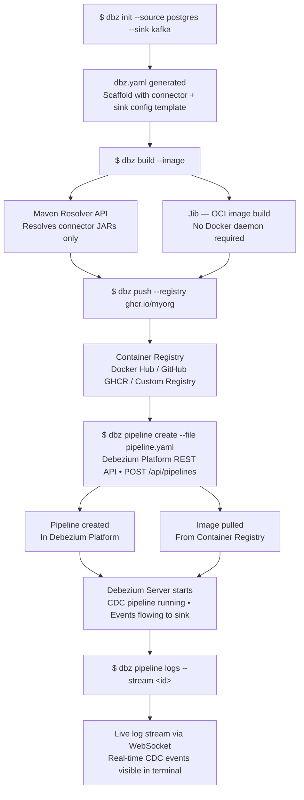
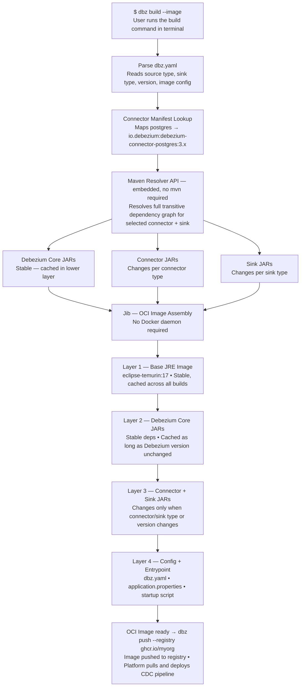

# DDD-40: Debezium CLI — A Unified Command-Line Interface for CDC Pipeline Lifecycle Management

## Motivation

Debezium is a powerful CDC platform, but today the only way to fully create and manage a CDC pipeline is through the Debezium Platform UI. There is no command-line interface that gives developers a fast, scriptable, and developer-friendly way to interact with the CDC ecosystem.

The current developer experience has two significant friction points:

1. **Setup friction**: assembling a working Debezium Server requires manually identifying which JARs to include, managing connector dependencies, and wiring configuration files. There is no single command that scaffolds a ready-to-run setup.
2. **Operational friction**: once a Platform instance is running, all lifecycle operations (creating pipelines, managing sources and destinations, tailing logs) must go through the UI. There is no way to script these operations or integrate them into CI/CD pipelines.

Tools like `kubectl`, the AWS CLI, and the Docker CLI demonstrate that a well-designed CLI is often more powerful than a UI — it is composable, scriptable, and fits naturally into automation workflows. Debezium deserves the same.

## Goals

- Provide a single `dbz` binary that covers the complete CDC developer journey: scaffold → build → push → deploy → monitor.
- Allow developers to assemble a **trimmed Debezium Server** containing only the connectors and sinks they need, without requiring Maven or a JVM to be pre-installed.
- Wrap the full **Debezium Platform REST API** so that all pipeline lifecycle operations (create, update, delete, signal, log tail) are available from the terminal.
- Produce a **native binary** (via GraalVM) with sub-50ms startup time, suitable for use in CI/CD pipelines.
- Integrate with the existing Debezium ecosystem: live inside the `debezium/debezium` monorepo, share the Debezium BOM, and follow existing versioning and CI/CD conventions.

## Non-goals

- The CLI will not replace the Debezium Platform UI. It wraps the same REST API the UI uses.
- The CLI will not manage Kafka Connect-based connectors directly. It targets Debezium Server and the Debezium Platform.
- The CLI will not implement its own CDC engine or connector logic.
- Windows native binary support is out of scope for the initial release (tracked as a stretch goal).

## Proposed Changes

### System Overview

The Debezium CLI (`dbz`) is organized into two subsystems that connect into a single end-to-end developer journey:

```
╔══════════════════════════════════════════════════════════════════════════════╗
║                            dbz  CLI  (Unified)                              ║
╠═════════════════════════════════════╦════════════════════════════════════════╣
║       BUILD SUBSYSTEM               ║       PLATFORM SUBSYSTEM               ║
║  ─────────────────────────────────  ║  ────────────────────────────────────  ║
║   dbz init  --source  --sink        ║   dbz pipeline  list / get /           ║
║   dbz validate                      ║                 create / update /      ║
║   dbz build                         ║                 delete / logs /        ║
║   dbz build --image                 ║                 signal                 ║
║   dbz push  --registry <url>        ║   dbz source    list / get / create …  ║
║                                     ║   dbz destination  …                   ║
║  [ Reads: dbz.yaml ]                ║   dbz connection   validate / schemas  ║
║  [ Uses:  Maven Resolver API ]      ║   dbz transform    …                   ║
║  [ Packs: Jib (OCI image) ]         ║   dbz catalog   list / get             ║
║                                     ║   dbz pipeline logs --stream  (WS)     ║
╚══════════════╦══════════════════════╩═══════════════════╦════════════════════╝
               ║                                          ║
               ║  push image                              ║  REST / WebSocket
               ▼                                          ▼
╔══════════════════════════╗             ╔═══════════════════════════════════╗
║    Container Registry    ║             ║      Debezium Platform            ║
║  ──────────────────────  ║             ║  ───────────────────────────────  ║
║   • Docker Hub           ║             ║   conductor (Quarkus REST API)    ║
║   • GitHub GHCR          ║  ◄──────────║   • /api/pipelines  (CRUD)        ║
║   • Custom registry      ║  pull image ║   • /api/sources                  ║
║                          ║             ║   • /api/destinations              ║
╚══════════════╦═══════════╝             ║   • /api/connections               ║
               ║                         ║   • /api/catalog                   ║
               ║  deploy                 ║   • WS  log stream                 ║
               ▼                         ╚═══════════════════════════════════╝
╔══════════════════════════╗
║    Debezium Server       ║
║  ──────────────────────  ║
║   CDC Engine (Quarkus)   ║
║   • Postgres Connector   ║
║   • MySQL Connector      ║
║   • Kafka Sink           ║
║   • Custom Sink          ║
╚══════════════════════════╝

  Developer Journey:
  ─────────────────
  $ dbz init --source postgres --sink kafka     ← scaffold dbz.yaml
  $ dbz build --image                           ← assemble trimmed server image
  $ dbz push --registry ghcr.io/myorg           ← push to registry
  $ dbz pipeline create --file pipeline.yaml    ← Platform picks up image & runs CDC
  $ dbz pipeline logs --stream <id>             ← live log tail via WebSocket
```

The **Build Subsystem** handles the local developer experience — scaffolding config, assembling a trimmed Debezium Server, and packaging it as a container image. The **Platform Subsystem** handles the operational experience — talking to a running Debezium Platform instance to create, manage, and observe pipelines via its REST API. The output of the Build Subsystem (a container image in a registry) becomes the input to the Platform Subsystem (a pipeline that references that image).



---

### Module Structure

The CLI will live as a new Maven module `debezium-cli` inside the main `debezium/debezium` monorepo. This placement ensures it shares the Debezium BOM, is versioned together with all other components, and benefits from the existing CI/CD infrastructure.

Internal package structure:

- `io.debezium.cli` — entry point, top-level `DbzCommand` (Picocli root)
- `io.debezium.cli.build` — Build Subsystem: init, validate, build, push commands
- `io.debezium.cli.platform` — Platform Subsystem: pipeline, source, destination, connection, transform, catalog commands
- `io.debezium.cli.config` — CLI config management, `dbz.yaml` parsing, env var interpolation
- `io.debezium.cli.client` — Quarkus REST client interfaces for the Platform API
- `io.debezium.cli.output` — Output formatters (table, JSON, plain)
- `io.debezium.cli.manifest` — Connector manifest registry (connector name → Maven coordinates)

---

### Technology Stack

| Component | Choice | Reason |
|---|---|---|
| CLI Framework | Quarkus CLI + Picocli | Consistent with Platform backend; Picocli provides subcommands, auto-generated help, shell completion |
| HTTP Client | Quarkus REST Client (JAX-RS) | Native Quarkus integration, type-safe REST calls against Platform API |
| WebSocket Client | Quarkus WebSocket client | For live pipeline log streaming (`dbz pipeline logs --stream`) |
| Build artifact | Native binary via GraalVM | Fast startup (<50ms), no JVM required, single distributable binary |
| Container building | Jib | Builds OCI images without a Docker daemon — better for CI/CD |
| Config format | YAML (`dbz.yaml`) | Human-readable, familiar to Debezium users |
| Repository | New module `debezium-cli` inside `debezium/debezium` | Shares BOM, versioned together with the ecosystem |

---

### CLI Framework Design — Picocli Command Hierarchy

The CLI is built using **Quarkus CLI + Picocli**. The root `DbzCommand` holds global options like `--output` and `--quiet`. Each subsystem (build, platform) is a command group. Each resource (pipeline, source, destination) is a subcommand group, and each action (list, get, create) is a leaf command.

A `@Mixin` class called `PlatformClientMixin` is shared across all Platform Subsystem commands. It reads the platform URL from `~/.dbz/config.yaml`, instantiates the REST client, and handles authentication. This eliminates duplicated boilerplate across the 30+ platform commands and ensures consistent error handling when the Platform is unreachable.

---

### Full Command Structure

**Build Subsystem — assembles a trimmed Debezium Server:**

```bash
dbz init --source postgres --sink kafka   # scaffold dbz.yaml config template
dbz validate                              # validate dbz.yaml against schema
dbz build                                 # assemble a trimmed JAR
dbz build --image                         # produce an OCI container image
dbz push                                  # push image to container registry
dbz push --registry ghcr.io/myorg
```

**Platform Subsystem — wraps the Debezium Platform REST API:**

```bash
# Pipelines
dbz pipeline list
dbz pipeline get <id>
dbz pipeline create --file pipeline.yaml
dbz pipeline update <id> --file pipeline.yaml
dbz pipeline delete <id>
dbz pipeline logs <id>                     # download full logs
dbz pipeline logs --stream <id>            # live log tail via WebSocket
dbz pipeline signal <id> --type <type>

# Sources
dbz source list | get | create | update | delete
dbz source verify-signals <id>

# Destinations
dbz destination list | get | create | update | delete

# Connections
dbz connection list | get | create | update | delete
dbz connection validate --file conn.yaml
dbz connection schemas
dbz connection collections <id>

# Transforms
dbz transform list | get | create | update | delete

# Catalog — discover available connectors
dbz catalog list
dbz catalog list --type source
dbz catalog get <type> <class>

# CLI config
dbz config set platform-url http://localhost:8080
dbz config get
dbz version
```

---

### Configuration Management — `dbz.yaml`

The `dbz.yaml` file is the central configuration artifact of the Build Subsystem. It describes the CDC pipeline (connector, sink, database config) and controls the build process (image name, registry, tag). Running `dbz init --source postgres --sink kafka` scaffolds a fully commented template.

The config file supports **environment variable interpolation** using `${VAR_NAME}` syntax, keeping credentials out of version control. The CLI's own configuration (Platform URL, registry credentials) is stored separately in `~/.dbz/config.yaml`, mirroring how `kubectl` and the AWS CLI separate project config from user-level credentials.

Example `dbz.yaml`:

```yaml
version: "1.0"
name: "my-postgres-to-kafka"

source:
  type: postgres
  config:
    database.hostname: localhost
    database.port: 5432
    database.user: ${DBZ_DB_USER}
    database.password: ${DBZ_DB_PASS}
    database.dbname: mydb
    table.include.list: public.orders

sink:
  type: kafka
  config:
    producer.bootstrap.servers: localhost:9092
    topic.prefix: cdc

build:
  image:
    name: debezium-server
    tag: postgres-kafka-latest
    registry: ghcr.io/myorg
```

---

### `dbz init` — Template Scaffolding

When a user runs `dbz init --source postgres --sink kafka`, the CLI uses **Qute** (Quarkus's built-in templating engine) to render a `dbz.yaml` from bundled per-connector template files. Each connector template includes connector-specific required fields with inline comments. Adding support for a new connector requires only a new Qute template — no changes to the `init` command logic.

Template rendering also performs **connector compatibility validation** at init time — if the source and sink combination is known to be incompatible, the CLI warns immediately rather than at build time.

---

### `dbz validate` — Two-Level Validation

The `dbz validate` command performs two levels of validation:

1. **Schema validation** — checks that all required fields are present, values match their expected types, and no unknown fields are present. Implemented using a JSON Schema validator against a bundled schema file. Adding a new required field requires only updating the schema file.

2. **Semantic validation** — checks things JSON Schema cannot express: whether the connector name matches a known manifest entry, whether the sink is compatible with the source, and whether referenced environment variables exist in the current shell. Each failure produces a clear, actionable error message.

---

### `dbz build` — Trimmed Server Assembly

Debezium Server today ships as a fat JAR containing every connector and sink. A user who only needs Postgres-to-Kafka still downloads and runs a JAR with all connectors included. The CLI solves this by assembling a **trimmed server** containing only what the user needs.

**How `dbz build` works:**

1. Parse `dbz.yaml` to identify the connector + sink combination
2. Look up the **connector manifest** (bundled with the CLI binary) that maps `postgres` → `io.debezium:debezium-connector-postgres:${version}`
3. Use the **embedded Maven Resolver API** (no Maven installation required) to resolve only the needed JAR dependency graph
4. Assemble a Debezium Server runner with the resolved classpath
5. Optionally wrap in an OCI image via **Jib** (`dbz build --image`)

The classpath assembly produces a directory of JARs rather than a single fat JAR. Jib layers these efficiently in the container image — stable dependencies (Debezium core, Quarkus runtime) in lower cached layers, frequently changing connector JARs in upper layers — making repeat `dbz push` operations significantly faster.



---

### Connector Manifest

The connector manifest is a YAML file bundled inside the CLI binary at compile time. It maps connector names to Maven coordinates and supported version ranges:

```yaml
connectors:
  postgres:
    artifact: io.debezium:debezium-connector-postgres
    versions: ["2.7.x", "3.0.x", "3.1.x"]
    sinks: [kafka, http, pulsar, redis]
  mysql:
    artifact: io.debezium:debezium-connector-mysql
    versions: ["2.7.x", "3.0.x", "3.1.x"]
    sinks: [kafka, http, pulsar, redis]
```

For users who need a connector version not in the bundled manifest (e.g. a snapshot build or community connector), `dbz.yaml` supports an **override mechanism** to specify a custom Maven coordinate directly.

---

### `dbz push` — Registry Authentication

The CLI reads credentials from the user's existing **Docker credential store** (`~/.docker/config.json`) using the same resolution logic as Docker CLI and Jib. For CI/CD environments, credentials are also accepted via environment variables (`DBZ_REGISTRY_USERNAME`, `DBZ_REGISTRY_PASSWORD`) or `~/.dbz/config.yaml`.

Resolution order: environment variables → `~/.dbz/config.yaml` → `~/.docker/config.json`.

---

### Platform REST Client

The CLI integrates with the Debezium Platform through its REST API, which exposes an OpenAPI specification at `/q/openapi`. The CLI uses a **Quarkus REST Client** interface registered against the Platform's base URL — type-safe, with JSON serialization/deserialization via Jackson.

```java
@RegisterRestClient(configKey = "debezium-platform-api")
@Path("/api")
public interface PlatformClient {

    @GET @Path("/pipelines")
    List<Pipeline> listPipelines();

    @POST @Path("/pipelines")
    Response createPipeline(PipelineRequest request);

    @GET @Path("/pipelines/{id}/logs")
    String downloadLogs(@PathParam("id") String id);

    // ... all endpoints
}
```

When the Platform returns a 4xx or 5xx response, the CLI extracts the error body, formats it clearly, and exits with a non-zero exit code. The `--quiet` flag suppresses all output except errors. The `--dry-run` flag on write commands prints the request body without calling the API.

---

### Live Log Streaming

`dbz pipeline logs --stream <id>` is the equivalent of `kubectl logs -f` for Debezium. The CLI connects to the Platform's WebSocket endpoint using a Quarkus WebSocket client and prints log lines to the terminal in real time.

The WebSocket connection lifecycle is managed carefully: the CLI handles `SIGINT` (Ctrl+C) by closing the connection cleanly and reconnects automatically on unexpected drops with exponential backoff.

```java
@ClientWebSocket
public class PipelineLogSocket {
    @OnMessage
    void onMessage(String logLine) {
        System.out.println(logLine);
    }
    @OnClose
    void onClose(CloseReason reason) {
        // reconnect with exponential backoff
    }
}
```

---

### Output Formatting

All read commands support three output modes via `--output`:

- **Table (default):** Human-readable formatted table with column headers and coloured status indicators.
- **JSON (`--output json`):** Raw Platform API response as JSON, for piping into `jq`.
- **Plain (`--output plain`):** Space-separated values with no headers, for `awk`/`cut` in shell scripts.

The output formatting logic is in a separate `io.debezium.cli.output` package, fully decoupled from command logic. Each command produces a typed result object; the formatter decides how to render it.

---

### Native Binary — GraalVM Compilation

The final artifact is a **native binary** compiled via GraalVM `native-image`. The user installs a single `dbz` file with no JVM or JAVA_HOME required. Startup time is under 50ms.

All classes that are instantiated reflectively at runtime (Jackson deserialization types, Picocli command classes, config parsers) are registered via `@RegisterForReflection` annotations and a `reflection-config.json` resource to satisfy GraalVM's closed-world analysis.

---

### Platform REST API Coverage

| Resource | Endpoints |
|---|---|
| Pipelines | list, get, create, update, delete, logs (download), logs (stream), signal |
| Sources | list, get, create, update, delete, verify-signals |
| Destinations | list, get, create, update, delete |
| Connections | list, get, create, update, delete, validate, schemas, collections |
| Transforms | list, get, create, update, delete |
| Catalog | list, list (by type), get by type+class |
| WebSocket | Live log stream (`/api/pipelines/{id}/logs/stream`) |

---

### Implementation Steps

1. Create `debezium-cli` Maven module with Quarkus + Picocli dependencies inside `debezium/debezium`
2. Implement base commands: `dbz`, `dbz version`, `dbz help`, `dbz config set/get`
3. Implement `dbz init` with Qute templates per connector
4. Implement `dbz validate` (schema + semantic validation)
5. Implement `dbz build` with embedded Maven Resolver API and connector manifest
6. Implement `dbz build --image` with Jib integration
7. Implement `dbz push` with Docker credential store resolution
8. Generate typed REST client from Platform OpenAPI spec
9. Implement all Platform Subsystem read commands (`pipeline list/get`, `source list/get`, etc.)
10. Implement all Platform Subsystem write commands (create, update, delete, signal)
11. Implement `dbz pipeline logs --stream` via Quarkus WebSocket client
12. Implement `dbz catalog list/get`
13. Add `--quiet`, `--dry-run`, and `--output` global flags
14. Configure GraalVM reflection hints and build native binary
15. Add shell completion generation (Picocli built-in: bash/zsh/fish)
16. Set up GitHub Actions CI (build, test, native binary)

## Testing

The CLI will have a three-layer test suite:

- **Unit tests (JUnit 5):** Config parsing, connector manifest lookup, output formatting, and command argument validation in isolation.
- **Integration tests (Quarkus Test + WireMock):** All Platform Subsystem commands tested against a mocked Platform REST API. Verifies HTTP client, JSON serialization, error handling, and output formatting end-to-end without a live Platform instance.
- **End-to-end tests:** Run against a real Debezium Platform instance started via Docker Compose in CI. Verifies the full `init → build → push → pipeline create → logs` flow. These run on PR merge only, not on every commit.

## Rejected Alternatives

| Decision | Chosen | Alternative | Why |
|---|---|---|---|
| Build artifact | Native binary via GraalVM | Fat JAR | No JVM required on user machine, instant startup, single distributable file |
| Maven resolution | Embedded Maven Resolver API | Shell out to `mvn` | No Maven install needed; one binary, no prerequisites |
| REST client | Typed interface against OpenAPI spec | Hand-written HTTP calls | Type-safe; compiler catches API mismatches immediately |
| Image building | Jib | Docker CLI | No Docker daemon required; works in CI/CD environments without Docker |
| Config format | YAML | TOML / JSON | Most familiar to Debezium users given existing `application.properties` conventions |

## Future Work

- `dbz doctor` — health check command that verifies Platform connectivity and registry access
- Interactive TUI — terminal dashboard for pipeline overview
- `dbz import` — import an existing Kafka Connect connector config into a pipeline
- Plugin system — `dbz plugin add` for community connector manifests
- Windows native binary via GraalVM

## References

- [Debezium Platform Conductor (REST API source)](https://github.com/debezium/debezium-platform/tree/main/debezium-platform-conductor)
- [Debezium Server](https://github.com/debezium/debezium/tree/main/debezium-server)
- [Quarkus CLI + Picocli Guide](https://quarkus.io/guides/picocli)
- [Maven Resolver API](https://maven.apache.org/resolver/)
- [Jib — containerization without Docker](https://github.com/GoogleContainerTools/jib)
- [GitHub Issue #40 — Debezium CLI](https://github.com/debezium/debezium-design-documents/issues/40)
