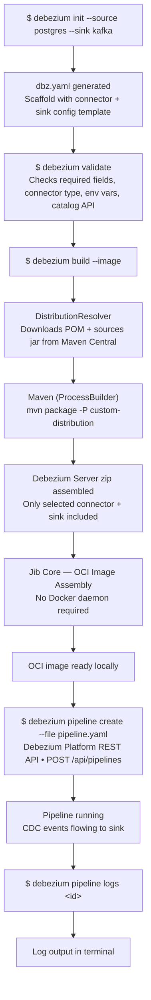
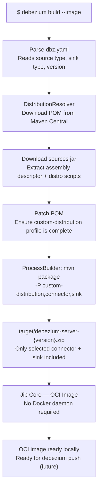

# DDD-40: Debezium CLI — A Unified Command-Line Interface for CDC Pipeline Lifecycle Management

## Motivation

Debezium is a powerful CDC platform, but today the only way to fully create and manage a CDC pipeline is through the Debezium Platform UI. There is no command-line interface that gives developers a fast, scriptable, and developer-friendly way to interact with the CDC ecosystem.

The current developer experience has two significant friction points:

1. **Setup friction**: assembling a working Debezium Server requires manually identifying which JARs to include, managing connector dependencies, and wiring configuration files. There is no single command that scaffolds a ready-to-run setup.
2. **Operational friction**: once a Platform instance is running, all lifecycle operations (creating pipelines, managing sources and destinations, tailing logs) must go through the UI. There is no way to script these operations or integrate them into CI/CD pipelines.

Tools like `kubectl`, the AWS CLI, and the Docker CLI demonstrate that a well-designed CLI is often more powerful than a UI — it is composable, scriptable, and fits naturally into automation workflows. Debezium deserves the same.

## Goals

- Provide a single `debezium` binary that covers the complete CDC developer journey: scaffold → build → deploy → monitor.
- Allow developers to assemble a **trimmed Debezium Server** containing only the connectors and sinks they need.
- Wrap the full **Debezium Platform REST API** so that all pipeline lifecycle operations (create, update, delete, signal, log tail) are available from the terminal.
- Produce a **native binary** (via GraalVM) with fast startup time, suitable for use in CI/CD pipelines.
- Support **multi-environment switching** so developers can target local, staging, and production Platform instances from a single CLI.

## Non-goals

- The CLI will not replace the Debezium Platform UI. It wraps the same REST API the UI uses.
- The CLI will not manage Kafka Connect-based connectors directly. It targets Debezium Server and the Debezium Platform.
- The CLI will not implement its own CDC engine or connector logic.
- Windows native binary support is out of scope for the initial release.

## Proposed Changes

### System Overview

The Debezium CLI (`debezium`) is organized into two subsystems that connect into a single end-to-end developer journey:

```
╔══════════════════════════════════════════════════════════════════════════════╗
║                       debezium  CLI  (Unified)                              ║
╠═════════════════════════════════════╦════════════════════════════════════════╣
║       BUILD SUBSYSTEM               ║       PLATFORM SUBSYSTEM               ║
║  ─────────────────────────────────  ║  ────────────────────────────────────  ║
║   debezium init  --source  --sink   ║   debezium pipeline  list / get /      ║
║   debezium validate                 ║                 create / update /      ║
║   debezium build                    ║                 delete / logs /        ║
║   debezium build --image            ║                 signal                 ║
║   debezium push  (future)           ║   debezium source    list / get / …    ║
║                                     ║   debezium destination  …              ║
║  [ Reads: dbz.yaml ]                ║   debezium connection   validate / …   ║
║  [ Uses:  Maven (ProcessBuilder) ]  ║   debezium transform    …              ║
║  [ Packs: Jib Core (OCI image) ]    ║   debezium catalog   list / get        ║
║                                     ║   debezium switch <env>                ║
╚══════════════╦══════════════════════╩═══════════════════╦════════════════════╝
               ║                                          ║
               ║  push image (future)                     ║  REST / WebSocket
               ▼                                          ▼
╔══════════════════════════╗             ╔═══════════════════════════════════╗
║    Container Registry    ║             ║      Debezium Platform            ║
║  ──────────────────────  ║             ║  ───────────────────────────────  ║
║   • Docker Hub           ║             ║   conductor (Quarkus REST API)    ║
║   • GitHub GHCR          ║             ║   • /api/pipelines  (CRUD)        ║
║   • Custom registry      ║             ║   • /api/sources                  ║
║                          ║             ║   • /api/destinations              ║
╚══════════════════════════╝             ║   • /api/connections               ║
                                         ║   • /api/catalog                   ║
                                         ╚═══════════════════════════════════╝

  Developer Journey:
  ─────────────────
  $ debezium init --source postgres --sink kafka     ← scaffold dbz.yaml
  $ debezium validate                                ← validate against catalog API
  $ debezium build --image                           ← assemble trimmed server image
  $ debezium pipeline create --file pipeline.yaml    ← Platform runs CDC pipeline
  $ debezium pipeline logs <id>                      ← fetch pipeline logs
```

The **Build Subsystem** handles the local developer experience — scaffolding config, assembling a trimmed Debezium Server, and packaging it as a container image. The **Platform Subsystem** handles the operational experience — talking to a running Debezium Platform instance to create, manage, and observe pipelines via its REST API.


```mermaid
flowchart TD
    A["$ debezium init --source postgres --sink kafka"] --> B["dbz.yaml generated\nScaffold with connector + sink config template"]
    B --> C["$ debezium validate\nChecks required fields, connector type, env vars, catalog API"]
    C --> D["$ debezium build --image"]
    D --> E["DistributionResolver\nDownloads POM + sources jar from Maven Central"]
    E --> F["Maven (ProcessBuilder)\nmvn package -P custom-distribution"]
    F --> G["Debezium Server zip assembled\nOnly selected connector + sink included"]
    G --> H["Jib Core — OCI Image Assembly\nNo Docker daemon required"]
    H --> I["OCI image ready locally"]
    I --> J["$ debezium pipeline create --file pipeline.yaml\nDebezium Platform REST API • POST /api/pipelines"]
    J --> K["Pipeline running\nCDC events flowing to sink"]
    K --> L["$ debezium pipeline logs &lt;id&gt;"]
    L --> M["Log output in terminal"]
```

---

### Repository and Module Structure

The CLI lives in the **`debezium/jbang-catalog`** repository as a JBang-based application. It is structured as a multi-module Maven project:

- `debezium-jbang-core` — entry point (`DebeziumJBangMain`), all commands, configuration, REST clients, and output formatting
- `debezium-jbang-inventory` — static connector registry (`connectors.yaml`) mapping connector names to Maven artifact IDs
- `debezium-jbang-it` — integration tests

Internal package structure inside `debezium-jbang-core`:

- `io.debezium.jbang.core` — entry point, Quarkus main
- `io.debezium.jbang.core.commands.build` — Build Subsystem: `BuildCommand`, `DistributionResolver`
- `io.debezium.jbang.core.commands.init` — `InitCommand`, Qute templates
- `io.debezium.jbang.core.commands.validate` — `ValidateCommand`, `PropertyValidator` composite
- `io.debezium.jbang.core.commands.pipeline` — pipeline CRUD + logs + signal
- `io.debezium.jbang.core.commands.source` — source CRUD + verify-signals
- `io.debezium.jbang.core.commands.destination` — destination CRUD
- `io.debezium.jbang.core.commands.connection` — connection CRUD + validate + schemas + collections
- `io.debezium.jbang.core.commands.transform` — transform CRUD
- `io.debezium.jbang.core.commands.catalog` — catalog list/get
- `io.debezium.jbang.core.commands.config` — `ConfigCommand` (get/set)
- `io.debezium.jbang.core.configuration` — `Configuration` YAML model, `~/.dbz/config.yaml` management
- `io.debezium.jbang.core.common` — `Printer`, shared HTTP client utilities

---

### Technology Stack

| Component | Choice | Reason |
|---|---|---|
| CLI Framework | Quarkus + Picocli | Native Quarkus CDI integration; Picocli provides subcommands, auto-generated help, shell completion |
| HTTP Client | Quarkus REST Client (JAX-RS) | Type-safe REST calls against Platform API |
| Build artifact | Native binary via GraalVM | Fast startup, no JVM required, single distributable binary |
| Distribution assembly | Maven (ProcessBuilder) | Spawns `mvn package -P custom-distribution`; downloads POM and assembly descriptor from Maven Central |
| Container building | Jib Core | Builds OCI images without a Docker daemon |
| Config format | YAML (`dbz.yaml` project config; `~/.dbz/config.yaml` user config) | Human-readable, familiar to Debezium users |
| Repository | `debezium/jbang-catalog` | JBang-based CLI alongside existing catalog tooling |

---

### CLI Framework Design — Picocli Command Hierarchy

The CLI is built using **Quarkus + Picocli**. The root `DebeziumJBangMain` is registered as a `@QuarkusMain` and constructs the full Picocli command tree at startup. Each resource (pipeline, source, destination) is a subcommand group, and each action (list, get, create) is a leaf command.

On first run, the CLI automatically initializes `~/.dbz/config.yaml` via `Configuration.initializeIfAbsent()` — this creates a default empty config file so subsequent `config set` and `switch` commands have a file to write to.

---

### Full Command Structure

**Build Subsystem — assembles a trimmed Debezium Server:**

```bash
debezium init --source postgres --sink kafka   # scaffold dbz.yaml config template
debezium validate                              # validate dbz.yaml (fields + catalog API)
debezium build                                 # assemble trimmed server distribution zip
debezium build --image                         # produce an OCI container image via Jib Core
debezium push                                  # push image to registry (future — dbz#2438)
```

**Platform Subsystem — wraps the Debezium Platform REST API:**

```bash
# Pipelines
debezium pipeline list
debezium pipeline get <id>
debezium pipeline create --file pipeline.yaml
debezium pipeline update <id> --file pipeline.yaml
debezium pipeline delete <id>
debezium pipeline logs <id>
debezium pipeline signal <id> --type <type>

# Sources
debezium source list | get | create | update | delete
debezium source verify-signals <id>

# Destinations
debezium destination list | get | create | update | delete

# Connections
debezium connection list | get | create | update | delete
debezium connection validate --file conn.yaml
debezium connection schemas
debezium connection collections <id>

# Transforms
debezium transform list | get | create | update | delete

# Catalog — discover available connectors
debezium catalog list
debezium catalog get <type> <class>

# Multi-environment switching
debezium switch <env>       # switch active environment in ~/.dbz/config.yaml

# CLI config
debezium config set platform-url http://localhost:8080
debezium config get
debezium version
```

---

### Configuration Management

#### Project config — `dbz.yaml`

The `dbz.yaml` file describes the CDC pipeline (connector, sink, database config) and controls the build process (image name, base image). Running `debezium init --source postgres --sink kafka` scaffolds a template using Qute.

The config file supports **environment variable interpolation** using `${VAR_NAME}` syntax, keeping credentials out of version control.

Example `dbz.yaml`:

```yaml
version: "1.0"
name: "my-postgres-to-kafka"

source:
  type: postgres
  config:
    database.hostname: localhost
    database.port: 5432
    database.user: ${DBZ_DB_USER}
    database.password: ${DBZ_DB_PASS}
    database.dbname: mydb
    table.include.list: public.orders

sink:
  type: kafka
  config:
    producer.bootstrap.servers: localhost:9092
    topic.prefix: cdc
```

#### User config — `~/.dbz/config.yaml`

The user-level config stores per-environment Platform URLs, the active environment, optional Maven Central URL override, optional local Maven repository path, and base image override. It is created automatically on first CLI run.

Example `~/.dbz/config.yaml`:

```yaml
default: local
environments:
  local:
    url: http://localhost:8080
  staging:
    url: http://staging.example.com:8080
mavenCentralUrl: https://repo1.maven.org/maven2/
mavenLocalRepo: ""
baseImage: ""
```

Running `debezium switch staging` updates the `default` field to `staging`, and all subsequent Platform commands target that environment.

---

### `debezium init` — Template Scaffolding

When a user runs `debezium init --source postgres --sink kafka`, the CLI uses **Qute** (Quarkus's built-in templating engine) to render a `dbz.yaml` from bundled per-connector template files. Each connector template includes connector-specific required fields with inline comments. Adding support for a new connector requires only a new Qute template — no changes to the `init` command logic.

---

### `debezium validate` — Multi-Level Validation

The `debezium validate` command uses a **composite `PropertyValidator` pattern** to run multiple validation passes in sequence:

1. **`RequiredFieldValidator`** — checks that all required fields are present (`version`, `name`, `source.type`, `sink.type`).
2. **`EnumValueValidator`** — verifies that `source.type` and `sink.type` match known entries in `connectors.yaml` (the inventory module).
3. **Environment variable check** — detects unresolved `${VAR_NAME}` references and warns when those variables are not set in the shell.
4. **Catalog API validation** — when a Debezium Platform conductor is running, calls `/api/catalog` to validate connector property values against the live schema. This pass is skipped gracefully when the Platform is unreachable.

Each validator is a separate class implementing `PropertyValidator`, making the suite easy to extend.

---

### `debezium build` — Trimmed Server Assembly

The `debezium build` command directly addresses a major enterprise adoption blocker: Debezium Server ships with all connectors and sinks bundled, causing companies to fail security scans due to CVEs in connectors they do not use. By building an image with only the required connector and sink, the attack surface is reduced.

**How `debezium build` works (implemented via `DistributionResolver`):**

1. Parse `dbz.yaml` to identify the connector + sink combination.
2. Resolve the active Debezium Server version from the inventory.
3. Download the `debezium-server-dist-{version}.pom` from Maven Central (configurable via `mavenCentralUrl` in `~/.dbz/config.yaml`).
4. Download the `debezium-server-dist-{version}-sources.jar` and extract the assembly descriptor (`server-distribution.xml`) and distro scripts into a temporary project directory.
5. Patch the POM to ensure the `custom-distribution` profile has `debezium-server-core`, the `maven-assembly-plugin`, and any explicit connector/sink artifacts needed for older releases that predate connector profiles.
6. Spawn `mvn package -P custom-distribution,<connector-profile>,<sink-profile> -DskipTests` via **ProcessBuilder**, streaming its output to the terminal.
7. Copy the resulting zip to `target/debezium-server-{version}.zip`.
8. If `--image` is passed, use **Jib Core** to layer the distribution into an OCI image without requiring a Docker daemon.

If `mavenLocalRepo` is set in `~/.dbz/config.yaml`, it is passed to Maven as `-Dmaven.repo.local`. Otherwise Maven uses its default `~/.m2` cache — no `-D` parameter is passed.


```mermaid
flowchart TD
    A["$ debezium build --image"] --> B["Parse dbz.yaml\nReads source type, sink type, version"]
    B --> C["DistributionResolver\nDownload POM from Maven Central"]
    C --> D["Download sources jar\nExtract assembly descriptor + distro scripts"]
    D --> E["Patch POM\nEnsure custom-distribution profile is complete"]
    E --> F["ProcessBuilder: mvn package\n-P custom-distribution,connector,sink"]
    F --> G["target/debezium-server-{version}.zip\nOnly selected connector + sink included"]
    G --> H["Jib Core — OCI Image\nNo Docker daemon required"]
    H --> I["OCI image ready locally\nReady for debezium push (future)"]
```

---

### Connector Inventory

The connector inventory is a YAML file (`connectors.yaml`) bundled inside the `debezium-jbang-inventory` module. It maps connector names to Maven artifact IDs and supported sink types:

```yaml
connectors:
  postgres:
    artifact: debezium-connector-postgres
    sinks: [kafka, http, pulsar, redis]
  mysql:
    artifact: debezium-connector-mysql
    sinks: [kafka, http, pulsar, redis]
```

The `ConnectorRegistry` class (in `debezium-jbang-core`) reads this file at startup and is used by both `debezium validate` and `debezium build` for connector resolution and validation.

---

### `debezium push` — Registry Authentication (Future)

`debezium push` ([dbz#2438](https://github.com/debezium/dbz/issues/2438)) is the near-term follow-up feature. It will authenticate and push the assembled OCI image to a registry, with credential resolution from:

1. Environment variables (`DBZ_REGISTRY_USERNAME`, `DBZ_REGISTRY_PASSWORD`)
2. `~/.dbz/config.yaml`
3. `~/.docker/config.json` (Docker credential store)

---

### Platform REST Client

The CLI integrates with the Debezium Platform through its REST API. Each resource group (pipelines, sources, destinations, connections, transforms, catalog) has a dedicated typed Quarkus REST Client interface. The active Platform URL is read from `~/.dbz/config.yaml` based on the currently active environment.

When the Platform returns a 4xx or 5xx response, the CLI extracts the error body, formats it clearly, and exits with a non-zero exit code.

---

### Native Binary — GraalVM Compilation

The final artifact is a **native binary** compiled via GraalVM `native-image`. All classes instantiated reflectively at runtime (Jackson deserialization types, Picocli command classes, config parsers) are registered via `@RegisterForReflection` and Quarkus's native image configuration. Optional compression dependencies (Apache Commons Compress, brotli, zstd-jni, xz) and Apache HttpClient static initializers required specific GraalVM substitutions to support native compilation.

---

### Platform REST API Coverage

| Resource | Endpoints |
|---|---|
| Pipelines | list, get, create, update, delete, logs, signal |
| Sources | list, get, create, update, delete, verify-signals |
| Destinations | list, get, create, update, delete |
| Connections | list, get, create, update, delete, validate, schemas, collections |
| Transforms | list, get, create, update, delete |
| Catalog | list, list (by type), get by type+class |

---

### Implementation Steps (Completed during GSoC 2026)

1. Pipeline management commands — list, get, create, update, delete ([PR #13](https://github.com/debezium/jbang-catalog/pull/13))
2. Source and destination management commands ([PR #14](https://github.com/debezium/jbang-catalog/pull/14))
3. Connection and transform management commands ([PR #16](https://github.com/debezium/jbang-catalog/pull/16))
4. Catalog commands and pipeline logs ([PR #18](https://github.com/debezium/jbang-catalog/pull/18))
5. Multi-environment switching, config management, pipeline signal, source verify-signals, version command ([PR #19](https://github.com/debezium/jbang-catalog/pull/19))
6. `debezium init` and `debezium validate` commands ([PR #20](https://github.com/debezium/jbang-catalog/pull/20))
7. Catalog API validation and inventory module refactor ([PR #21](https://github.com/debezium/jbang-catalog/pull/21))
8. `debezium build` command with `DistributionResolver` and Jib Core ([PR #22](https://github.com/debezium/jbang-catalog/pull/22))
9. Network integration tests for build command ([PR #23](https://github.com/debezium/jbang-catalog/pull/23))
10. Fix init templates to use correct default version ([PR #24](https://github.com/debezium/jbang-catalog/pull/24))
11. Build command v2: sources jar extraction, configurable Maven Central URL, `~/.dbz` auto-init ([PR #25](https://github.com/debezium/jbang-catalog/pull/25))

## Testing

The CLI has a three-layer test suite:

- **Unit tests (JUnit 5):** Config parsing, connector inventory lookup, output formatting, and command argument validation in isolation.
- **Integration tests (Quarkus Test + WireMock):** All Platform Subsystem commands tested against a mocked Platform REST API. Verifies HTTP client, JSON serialization, error handling, and output formatting end-to-end without a live Platform instance.
- **Network integration tests:** Tests for the build command that download real POM and sources jar from Maven Central and verify the assembly process end-to-end.

## Rejected Alternatives

| Decision | Chosen | Alternative | Why |
|---|---|---|---|
| Build artifact | Native binary via GraalVM | Fat JAR | No JVM required on user machine, fast startup, single distributable file |
| Maven distribution assembly | ProcessBuilder spawning `mvn package` | Embedded Maven Resolver API | ProcessBuilder reuses the existing `custom-distribution` Maven profile in the official Debezium Server POM; the embedded Resolver API would require reimplementing the full assembly descriptor logic |
| REST client | Typed Quarkus REST Client interfaces | Hand-written HTTP calls | Type-safe; compiler catches API mismatches immediately |
| Image building | Jib Core | Docker CLI | No Docker daemon required; works in CI/CD environments without Docker |
| Config format | YAML | TOML / JSON | Most familiar to Debezium users given existing `application.properties` conventions |
| Repository | `debezium/jbang-catalog` | New module in `debezium/debezium` monorepo | The jbang-catalog repo already hosts JBang-based Debezium tooling; avoids touching the large monorepo CI during initial development |

## Future Work

- **`debezium push` ([dbz#2438](https://github.com/debezium/dbz/issues/2438))** — push the assembled OCI image to Docker Hub, GHCR, or a custom registry with credential resolution from `~/.docker/config.json`, environment variables, and `~/.dbz/config.yaml`
- **Color-highlighted CLI output** — improve readability of validation errors and command output
- **`debezium logs` and `debezium status`** — real-time pipeline log streaming and pipeline health monitoring
- **`debezium scale`** — scaling connector instances via the platform API
- **MCP integration** — exposing CLI commands as MCP tools for AI assistant workflows
- **Broader connector inventory** — extending `connectors.yaml` to cover all supported Debezium connectors and sinks
- **`debezium doctor`** — health check command that verifies Platform connectivity and build prerequisites

## References

- [debezium/jbang-catalog](https://github.com/debezium/jbang-catalog) — CLI repository
- [Debezium Platform Conductor (REST API source)](https://github.com/debezium/debezium-platform/tree/main/debezium-platform-conductor)
- [Debezium Server](https://github.com/debezium/debezium/tree/main/debezium-server)
- [Quarkus CLI + Picocli Guide](https://quarkus.io/guides/picocli)
- [Jib Core — containerization without Docker](https://github.com/GoogleContainerTools/jib)
- [GitHub Issue #40 — Debezium CLI](https://github.com/debezium/debezium-design-documents/issues/40)
- [Parent tracker: debezium/dbz#2061](https://github.com/debezium/dbz/issues/2061)
