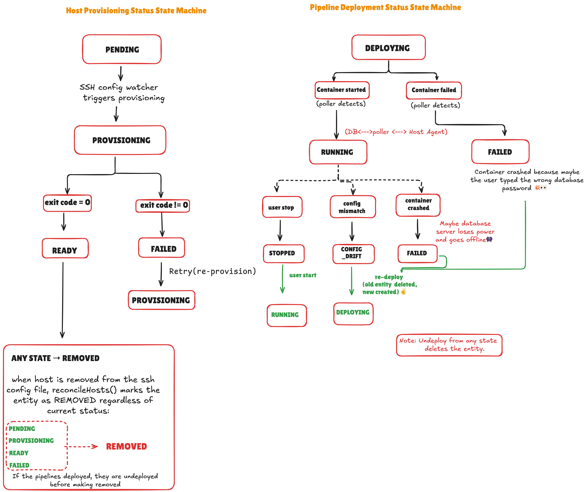

# DDD-41: Host-Based Pipeline Deployment for the Debezium Platform

## Motivation

The Debezium Platform currently supports pipeline deployment exclusively through the Kubernetes-based Debezium Operator. While this works well for teams running Kubernetes, a significant portion of production environments operate on bare-metal servers, cloud VMs (EC2, Azure VMs), and on-premise machines that do not run Kubernetes.

This proposal introduces a host-based deployment path as a first-class alternative to the existing Kubernetes path. By implementing an `EnvironmentController` that deploys Debezium Server containers on remote hosts via Ansible and a lightweight host-side agent, the Platform becomes environment-agnostic.

**Key design philosophy:** Users focus on pipeline design, not on deployment infrastructure. The host management is fully automated — a sysadmin provides an SSH config file, the Platform watches it, provisions hosts automatically via Ansible, and deploys pipelines using a round-robin strategy with zero user intervention on host selection.

---

## Proposed Changes

### 1. High-Level Architecture

The diagram below shows the two deployment paths (left side) and the complete request flow from user click to container running (right side):


**Key architectural decisions:**
- **Global deployment mode:** The Platform runs in exactly one mode at a time — either `operator` (Kubernetes) or `host` (bare-metal). This is selected at startup via a runtime configuration property, not per-pipeline.
- **SSH Config as source of truth:** Hosts are declared through a standard OpenSSH `~/.ssh/config` file mounted into the Conductor. No UI or REST API is needed for host registration.
- **File Watcher for auto-discovery:** A background Java `WatchService` monitors the SSH config file for changes. When hosts are added, modified, or removed, provisioning is triggered automatically.
- **Round-Robin scheduling:** When deploying a pipeline, the Platform automatically selects a `READY` host using a least-loaded round-robin strategy. Users never choose which host to deploy to.
- **Zero direct SSH in Java:** SSH connectivity is handled entirely by Ansible during provisioning. The Conductor never opens SSH sessions in Java code.
- **HTTP REST for lifecycle:** All ongoing pipeline lifecycle operations (deploy, undeploy, start, stop, logs) are executed via lightweight HTTP REST calls to the Agent running on the remote host.

---

### 2. Deployment Mode Selection

The Platform operates in one of two mutually exclusive modes, configured globally at startup:

```properties
# application.properties
debezium.deployment.mode=host   # or "operator" (default)
```

| Mode | When to use | What it activates |
|---|---|---|
| `operator` | Platform is running inside Kubernetes | `OperatorEnvironmentController` (existing behavior, unchanged) |
| `host` | Platform manages bare-metal/VM hosts | `HostEnvironmentController` (new) |

**Why global mode instead of per-pipeline routing:**
- The Platform deployment itself determines available infrastructure. If the platform runs on Kubernetes, it has access to the K8s API. If it runs as a Docker container on bare-metal, it has access to the mounted SSH config.
- A single mode eliminates the need for a complex routing controller that dynamically delegates per-pipeline.
- This aligns with the Platform's core promise that users focus on pipeline design, not deployment.

#### 2.1 CDI Bean Selection via `@LookupIfProperty`

The deployment mode property determines which `EnvironmentController` bean is active at runtime. Quarkus CDI provides `@LookupIfProperty` for runtime-evaluated bean selection — both bean classes remain on the classpath in a single compiled image, enabling a **"build once, deploy anywhere"** model:

```java
@ApplicationScoped
@LookupIfProperty(name = "debezium.deployment.mode", stringValue = "operator", lookupIfMissing = true)
@Named("operator-environment-controller")
public class OperatorEnvironmentController implements EnvironmentController {
    // Existing code — unchanged
}
```

```java
@ApplicationScoped
@LookupIfProperty(name = "debezium.deployment.mode", stringValue = "host")
@Named("host-environment-controller")
public class HostEnvironmentController implements EnvironmentController {
    // New implementation
}
```

When `debezium.deployment.mode=operator` (or is absent), only `OperatorEnvironmentController` is resolved during programmatic lookup. When `debezium.deployment.mode=host`, only `HostEnvironmentController` is resolved. CDI never sees ambiguity because only one implementation is active during any `Instance<T>` lookup.

The same Docker image can be promoted from staging to production, and the deployment mode is switched via an environment variable: `docker run -e DEBEZIUM_DEPLOYMENT_MODE=host platform-conductor:nightly`.

**Impact on existing code:** `PipelineService` switches from `@All List<EnvironmentController>` to `Instance<EnvironmentController>.get()` for the active bean — a minimal change.

---

### 3. Host Discovery via SSH Config File Watcher

The diagram below shows the SSH config file watcher flow (left side) and how Ansible uses the SSH config for host provisioning (right side):


Instead of building a UI screen and REST API for host registration, the Platform uses a **file-based, automated discovery** model.

#### 3.1 How It Works

1. **The sysadmin** creates a standard OpenSSH config file listing all target hosts:

```
Host db-server-1
    HostName 192.168.1.10
    User ubuntu
    Port 22
    IdentityFile ~/.ssh/db-server-1.key

Host db-server-2
    HostName 192.168.1.20
    User deploy
    Port 2222
    IdentityFile ~/.ssh/db-server-2.key
```

2. **The sysadmin** mounts this file into the Conductor container at `~/.ssh/config`:
   - **Kubernetes:** Mount a Secret as a volume with `defaultMode: 256` (octal `0400`) to enforce strict SSH key permissions
   - **Docker Compose:** Bind mount: `-v /path/to/ssh-config:/home/jboss/.ssh/config:ro` (ensure host-side key permissions are `0600`)
   - **Development:** Place at `~/.ssh/config` on the development machine

3. **The SSH private key files** referenced by `IdentityFile` are also mounted into the container's `~/.ssh/` directory. **Critical:** Keys must have strict permissions (`0400` or `0600`). OpenSSH rejects keys with more permissive modes (e.g., `0644`) with a fatal `"Permissions are too open"` error.

4. **On startup**, the `SshConfigWatcherService` reads and parses the SSH config file, validates SSH key file permissions, and creates `HostStatusEntity` records in the database for each discovered host.

5. **A Java `WatchService`** continues monitoring the file for changes. When the sysadmin edits the file, the watcher detects the modification and triggers the appropriate action:
   - **New host added** → Create `HostStatusEntity` with status `PENDING`, trigger Ansible provisioning
   - **Host removed** → Mark `HostStatusEntity` as `REMOVED`, undeploy any pipelines from that host
   - **Host modified** (e.g., IP changed) → Re-provision via Ansible

#### 3.2 SSH Config File Parser

Parsing is implemented as a lightweight, zero-dependency Java class (`SshConfigParser`) using `BufferedReader` line-by-line parsing. No external SSH library (JSch, Mina-SSHD) is needed because we only parse the config file format — we never open SSH connections from Java.

Key parsing rules per the ssh_config(5) specification:
- Keywords are case-insensitive, arguments are case-sensitive
- Both whitespace and `=` are valid delimiters (e.g., `Port 22` and `Port=22`)
- Inline comments supported (OpenSSH 8.5+)
- Quoted values for paths with spaces
- `Host *` and `Host db-?` wildcard entries are skipped

#### 3.3 SshConfigWatcherService

The watcher runs as a background thread on application startup, using the Java NIO `WatchService` API:

- Monitors the **parent directory** (Java NIO limitation — `WatchService` operates on directories).
- Filters events to only react to changes in the specific config file.
- Watches for `ENTRY_MODIFY`, `ENTRY_CREATE`, and `ENTRY_DELETE` — Kubernetes ConfigMap volume mounts use an atomic symlink-swap mechanism that triggers `ENTRY_CREATE`/`ENTRY_DELETE` rather than `ENTRY_MODIFY`.
- A **2-second debounce delay** prevents unnecessary Ansible runs when the sysadmin is making multiple rapid edits.
- `OVERFLOW` events trigger a full reconciliation as a safety measure.
- A **`@Scheduled` periodic fallback (every 5 minutes)** re-reads the file regardless of events, catching events that WatchService may miss on NFS mounts or Kubernetes.

---

### 4. Data Model

#### 4.1 HostStatusEntity

Since the SSH config file is the source of truth for host connection details (IP, user, key), the database only tracks **provisioning status** and **runtime metadata**:

| Field | Type | Description |
|---|---|---|
| `id` | `Long` | Primary key (sequence-generated) |
| `sshAlias` | `String` | Unique — the `Host` alias from the SSH config file (e.g., `db-server-1`) |
| `hostname` | `String` | Cached `HostName` value from SSH config (for display/reference) |
| `provisioningStatus` | `Enum` | `PENDING`, `PROVISIONING`, `READY`, `FAILED`, `REMOVED` |
| `provisioningReport` | `JSON` | Ansible output, error messages |
| `agentPort` | `int` | Port where the Host Agent listens (default: 8090) |
| `agentToken` | `String` | Bearer token generated during provisioning for Agent API auth |
| `lastCheckedAt` | `Timestamp` | Last time the watcher verified this host |

**Note:** There is intentionally no `pipelineCount` column. Host load is calculated dynamically via a `COUNT` query on the `host_deployment` table inside a pessimistic lock. This prevents stale counter drift when concurrent deploy/undeploy operations occur.

#### 4.2 HostDeploymentEntity

Links a pipeline to a specific host. This entity is created when the scheduling logic assigns a pipeline to a host:

| Field | Type | Description |
|---|---|---|
| `id` | `Long` | Primary key |
| `pipeline` | `PipelineEntity` | FK to pipeline (Many-to-One, `UNIQUE` constraint — one active deployment per pipeline) |
| `hostStatus` | `HostStatusEntity` | FK to host status (Many-to-One) |
| `containerName` | `String` | Docker container name on the remote host |
| `imageVersion` | `String` | Debezium Server Docker image version |
| `serverPort` | `int` | Unique port allocated on the host (avoids TCP conflicts) |
| `deploymentStatus` | `Enum` | `DEPLOYING`, `RUNNING`, `STOPPED`, `FAILED`, `CONFIG_DRIFT` |
| `configHash` | `String` | SHA-256 of deployed `application.properties` for drift detection |

When a pipeline is undeployed, the `HostDeploymentEntity` record is **deleted** (not soft-deleted), enabling clean re-deployment and port reuse.

---

### 5. SSH Key Management

SSH private keys are managed through **volume mounts** — they are never stored in the database.

- The sysadmin mounts the SSH key directory into the Conductor container's `~/.ssh/` directory.
- The SSH config file references these keys using `IdentityFile ~/.ssh/<key-filename>`.
- Because Ansible natively uses OpenSSH, it automatically reads `~/.ssh/config` and resolves the correct private key for each host — no explicit `--private-key` flag needed.

**SSH key permission enforcement:**
- **Kubernetes:** Mount SSH keys via `Secret` with `defaultMode: 256` (decimal for octal `0400`). `ConfigMap` defaults to `0644`, which OpenSSH rejects.
- **Docker Compose:** Ensure host-side permissions: `chmod 600 ~/.ssh/*.key` before bind-mounting.
- The `SshConfigWatcherService` validates key file permissions on startup and logs a clear error if keys are too permissive.

**Security:** Key material never touches the database. Ansible reads keys natively — no SSH libraries in Java code.

---

### 6. Host Provisioning via Ansible Playbook

The diagram below shows the provisioning status state machine (left side) and the pipeline deployment status state machine (right side). Both are referenced throughout this section and Section 10:



When the File Watcher discovers a new host in the SSH config, it triggers the `HostProvisioningService` to provision that host using an Ansible Playbook.

#### 6.1 Idempotent Playbook Steps

1. **Bootstrap Python** — uses Ansible's `raw` module (required for subsequent Ansible modules).
2. **Verify connectivity** — validates SSH connection using the auto-discovered SSH config.
3. **Install Docker** — installs Docker Engine if not present (Debian/Ubuntu via `apt`, RHEL/CentOS via `yum`/`dnf`, using `ansible_os_family` facts).
4. **Start Docker daemon** — enables Docker on boot and starts the service.
5. **Configure Docker permissions** — adds the SSH user to the `docker` group.
6. **Deploy Host Agent** — installs the lightweight Debezium Host Agent as a systemd service, secured with a generated bearer token.
7. **Pre-pull Debezium Server image** — pulls the Docker image for instant first deployment.

#### 6.2 How Ansible Uses the SSH Config

The right side of the [SSH Config File Watcher Flow diagram](#3-host-discovery-via-ssh-config-file-watcher) illustrates this step-by-step: from file watcher detection through Ansible's SSH config resolution to playbook execution on the remote host.

Ansible handles all SSH connectivity — Java never opens SSH sessions. Instead of a traditional inventory file, the ad-hoc comma-separated host pattern is used: `ansible-playbook host-setup.yml -i "db-server-1,"`. When the SSH config is at the standard `~/.ssh/config` path, Ansible resolves all connection parameters (`HostName`, `User`, `IdentityFile`) automatically.

The playbook is stored at `src/main/resources/ansible/host-setup.yml` in the source tree, and is copied to `/opt/debezium/ansible/host-setup.yml` in the Docker image during build.

#### 6.3 Thread Isolation for Ansible Execution

Ansible playbook runs are long-running, blocking operations (typically 2–5 minutes). The `HostProvisioningService` uses a **dedicated, size-restricted executor pool** (size 4) to isolate Ansible execution from the Quarkus reactive thread pool and `ForkJoinPool.commonPool()`. Database updates are handled in separate transactional blocks after process exit.

---

### 7. Automatic Pipeline Scheduling (Concurrency-Safe)

When a user deploys a pipeline in host mode, they do **not** select a target host. Instead, a `HostDeploymentService` atomically selects the least-loaded host and allocates a conflict-free port.

#### 7.1 Concurrency Safety via PESSIMISTIC_WRITE

Concurrent pipeline deployments create two race conditions:
1. **Scheduling skew:** Two threads read the same stale pipeline counts and both select the same "least-loaded" host.
2. **Port collision:** Two threads query `MAX(serverPort)` simultaneously and both allocate the same port.

Both are solved by acquiring `PESSIMISTIC_WRITE` locks on ALL ready hosts (sorted by ID to prevent deadlocks) BEFORE evaluating load counts and allocating ports. The method uses `@Transactional(REQUIRES_NEW)` so locks are released immediately after selection — before the HTTP call to the Agent.

#### 7.2 DeployStrategy Interface

The default `RoundRobinStrategy` selects the `READY` host with the fewest active deployments (via a live `COUNT` query inside the lock). The `DeployStrategy` interface allows future alternatives (affinity-based, resource-based, labeled/tagged scheduling).

---

### 8. Host Pipeline Mapper

`HostPipelineMapper` consumes a `PipelineFlat` and produces a flat `application.properties` string for Debezium Server. It reuses the same prefix resolution logic and connection-type-specific field naming from the existing `PipelineMapper`.

A `TreeMap` is used for deterministic key ordering, and manual serialization (not `Properties.store()`) avoids timestamp comments — both are critical for stable SHA-256 config hashing used in drift detection.

---

### 9. Pipeline Lifecycle on Host

The lifecycle of a host-deployed pipeline mirrors the Kubernetes path:

| Operation | Kubernetes Path | Host Path |
|---|---|---|
| **Deploy** | `serverSideApply()` CRD → Operator creates Pod | HTTP POST to Agent → Docker run |
| **Undeploy** | Delete CRD → Operator removes Pod | HTTP POST to Agent → Docker rm |
| **Stop** | Set `stopped=true` on CRD | HTTP POST to Agent → Docker stop |
| **Start** | Set `stopped=false` on CRD | HTTP POST to Agent → Docker start |
| **Logs** | K8s Pod log API | HTTP GET from Agent → Docker logs |

To prevent blocking the single background Watcher thread during slow Docker operations:
1. `HostPipelineController` invokes the Agent REST endpoint — expects a fast `202 Accepted`.
2. The remote Host Agent handles the container spin-up asynchronously.
3. A `HostDeploymentStatusPoller` on the Conductor queries the Agent every 30 seconds to fetch progress and transition the state to `RUNNING` or `FAILED`.

**Host port allocation:** The Conductor dynamically assigns a unique `serverPort` within a `PESSIMISTIC_WRITE` lock on the host — `MAX(serverPort)+1` starting from a configurable base port (default `9000`).

---

### 10. Host Agent (Remote-Side)

The Host Agent is a lightweight HTTP service deployed on each remote host during Ansible provisioning. It acts as a thin wrapper around the Docker CLI — the Agent itself does not run containers; it translates HTTP requests into `docker` commands.

**What the Agent is:**
- A single-binary HTTP server (Quarkus-based) listening on a configurable port (default: `8090`)
- Deployed as a `systemd` service during Ansible provisioning (auto-starts on boot)
- Secured with a bearer token generated per-host during provisioning and stored in `HostStatusEntity.agentToken`

**What the Agent does:**

| Endpoint | Docker Command | Response |
|---|---|---|
| `POST /api/agent/deploy` | `docker run -d --name <name> -p <port>:8080 -v <config>:/debezium/conf debezium/server` | `202 Accepted` |
| `POST /api/agent/undeploy` | `docker rm -f <name>` | `200 OK` |
| `POST /api/agent/stop` | `docker stop <name>` | `200 OK` |
| `POST /api/agent/start` | `docker start <name>` | `200 OK` |
| `GET /api/agent/status/<name>` | `docker inspect <name>` | `{ running: bool, configHash: string }` |
| `GET /api/agent/logs/<name>` | `docker logs <name>` | Plain text log stream |

**Deploy request details:** The Conductor sends the `application.properties` content, container name, image version, and allocated port in the deploy request body. The Agent writes the properties to a local file and bind-mounts it into the Debezium Server container at `/debezium/conf/application.properties`.

**Config hash for drift detection:** The Agent computes a SHA-256 hash of the deployed `application.properties` file and returns it via the `/status` endpoint. The Conductor compares this hash against the expected hash stored in `HostDeploymentEntity.configHash` to detect configuration drift.

**Security:** Every request must include a valid `Authorization: Bearer <token>` header. The Agent validates it against the token set during provisioning. Requests without a valid token are rejected with `401 Unauthorized`.

---

### 11. Host Agent Client (Conductor-Side)

The Conductor communicates with remote Agents via a Quarkus REST Client. Since each Agent runs on a different host with a different IP and port, the client uses the `@Url` annotation for dynamic URL routing — following the same pattern established by `DebeziumServerClient` in the operator path.

**`HostAgentApi`** is a `@RegisterRestClient` interface that defines the Agent endpoints. Each method accepts a `@Url String baseUrl` parameter, allowing the URL to be overridden per-invocation:

```java
@RegisterRestClient(configKey = "host-agent-api")
public interface HostAgentApi {
    @POST @Path("/deploy")
    Response deploy(@Url String baseUrl,
                    @HeaderParam("Authorization") String authHeader,
                    DeployRequest request);

    @GET @Path("/status/{containerName}")
    ContainerStatus status(@Url String baseUrl,
                           @HeaderParam("Authorization") String authHeader,
                           @PathParam("containerName") String containerName);
    // ... undeploy, stop, start, logs follow the same pattern
}
```

**`HostAgentClient`** is an `@ApplicationScoped` service wrapper that constructs the base URL dynamically from `HostStatusEntity.hostname` and `agentPort` (e.g., `http://192.168.1.10:8090`), adds the `agentToken` as a `Bearer` token header, and handles error mapping.

---

### 12. Status Polling and Config Drift Detection

The pipeline deployment status state machine (right side of the [state machine diagram](#6-host-provisioning-via-ansible-playbook)) shows the transitions detected by this poller: `DEPLOYING → RUNNING`, `RUNNING → FAILED`, and `RUNNING → CONFIG_DRIFT`.

A `@Scheduled` poller runs every 30 seconds to check all active deployments:
- Queries all `HostDeploymentEntity` records with status `RUNNING` or `DEPLOYING`.
- Calls the remote Agent to check container state and deployed config hash.
- **Container exited/not found** → status updated to `FAILED`.
- **Config hash mismatch** → status updated to `CONFIG_DRIFT`.

---

### 13. Module and Package Structure

All new components reside in the `environment/host/` package:

```
debezium-platform-conductor/src/main/java/io/debezium/platform/
├── environment/
│   ├── EnvironmentController.java              ← EXISTING (unchanged interface)
│   ├── PipelineController.java                 ← EXISTING (unchanged interface)
│   ├── VaultController.java                    ← EXISTING (unchanged interface)
│   │
│   ├── operator/                               ← EXISTING PACKAGE
│   │   ├── OperatorEnvironmentController.java  ← MODIFY: add @LookupIfProperty annotation
│   │   ├── OperatorPipelineController.java     ← unchanged
│   │   ├── OperatorVaultController.java        ← unchanged
│   │   └── PipelineMapper.java                 ← unchanged
│   │
│   └── host/                                   ← NEW PACKAGE (all new files below)
│       ├── HostEnvironmentController.java      ← [NEW] @LookupIfProperty("host")
│       ├── HostPipelineController.java         ← [NEW] implements PipelineController
│       ├── HostPipelineMapper.java             ← [NEW] pipeline → application.properties
│       ├── HostDeploymentStatusPoller.java     ← [NEW] @Scheduled background poller
│       ├── agent/
│       │   ├── HostAgentApi.java               ← [NEW] Quarkus REST client interface (@Url for dynamic routing)
│       │   └── HostAgentClient.java            ← [NEW] service wrapper (URL construction + bearer token)
│       ├── provisioning/
│       │   └── HostProvisioningService.java    ← [NEW] Ansible via ProcessBuilder + dedicated executor pool
│       ├── discovery/
│       │   ├── SshConfigParser.java            ← [NEW] parses ~/.ssh/config (handles =, quotes, wildcards)
│       │   ├── SshHostEntry.java               ← [NEW] parsed host data record
│       │   └── SshConfigWatcherService.java    ← [NEW] WatchService + @Scheduled fallback + key permission validation
│       └── strategy/
│           ├── DeployStrategy.java             ← [NEW] interface
│           └── RoundRobinStrategy.java         ← [NEW] least-loaded round-robin
│
├── data/model/
│   ├── HostStatusEntity.java                   ← [NEW] (no pipeline_count — uses live COUNT query)
│   ├── HostDeploymentEntity.java               ← [NEW]
│   ├── ProvisioningStatus.java                 ← [NEW] enum
│   └── DeploymentStatus.java                   ← [NEW] enum
│
├── domain/
│   ├── HostDeploymentService.java              ← [NEW] atomic select + port allocation with PESSIMISTIC_WRITE
│   └── PipelineService.java                    ← MODIFY: Instance<T> replaces @All List
│
└── resources/
    ├── ansible/
    │   └── host-setup.yml                      ← [NEW] Ansible playbook
    └── db/migration/
        └── V3.4.0__add_host_deployment.sql     ← [NEW] Flyway migration
```

---

### 14. Conductor Docker Image

The Conductor Docker image includes:
- **Ansible** — installed via `pip3 install ansible`
- **OpenSSH client** — for Ansible's SSH transport
- **`community.docker` Ansible collection** — `ansible-galaxy collection install community.docker`

A single image includes both operator-mode and host-mode dependencies. The runtime mode is selected via the `DEBEZIUM_DEPLOYMENT_MODE` environment variable.

---

### 15. Compatibility and Migration

- **Zero breaking changes.** All existing interfaces remain unchanged.
- **Default mode is operator.** `@LookupIfProperty(lookupIfMissing = true)` ensures the operator controller activates when no mode is specified — existing deployments continue working without any configuration changes.
- **Database migration is additive.** New tables only (`V3.4.0__add_host_deployment.sql`), no changes to existing tables.
- **Single Docker image.** Both modes coexist in one image; mode is selected at runtime via environment variable.

---

## Risks and Mitigations

| Risk | Mitigation |
|---|---|
| SSH config file syntax error from sysadmin | Parser validates format; invalid entries are logged and skipped without affecting valid hosts |
| File Watcher misses events (e.g., NFS mounts, K8s ConfigMap symlink-swap) | `@Scheduled` periodic reconciliation fallback (every 5 minutes) re-reads the entire file |
| Port conflicts on target host | `PESSIMISTIC_WRITE` lock on host during port allocation prevents concurrent threads from allocating the same port |
| Config drift from manual host changes | SHA-256 hash comparison on every poll; `CONFIG_DRIFT` status surfaced |
| Blocking Watcher thread | Agent deploy endpoint returns `202 Accepted` immediately; async processing |
| SSH key file permissions too open | Validated on startup; K8s Secret `defaultMode: 256` enforces `0400`; clear error logged if keys are `0644` |
| Ansible blocks Quarkus reactive threads | Dedicated `ansibleExecutor` thread pool isolates blocking Ansible runs from `ForkJoinPool.commonPool()` |
| Concurrent deploys select same host | `PESSIMISTIC_WRITE` lock on ALL ready hosts (sorted by ID) forces serialization; live `COUNT` query inside lock |
| Remote Agent unreachable after provisioning | Status poller detects unreachable agents and marks deployments as `FAILED`; bearer token auth prevents unauthorized access |
