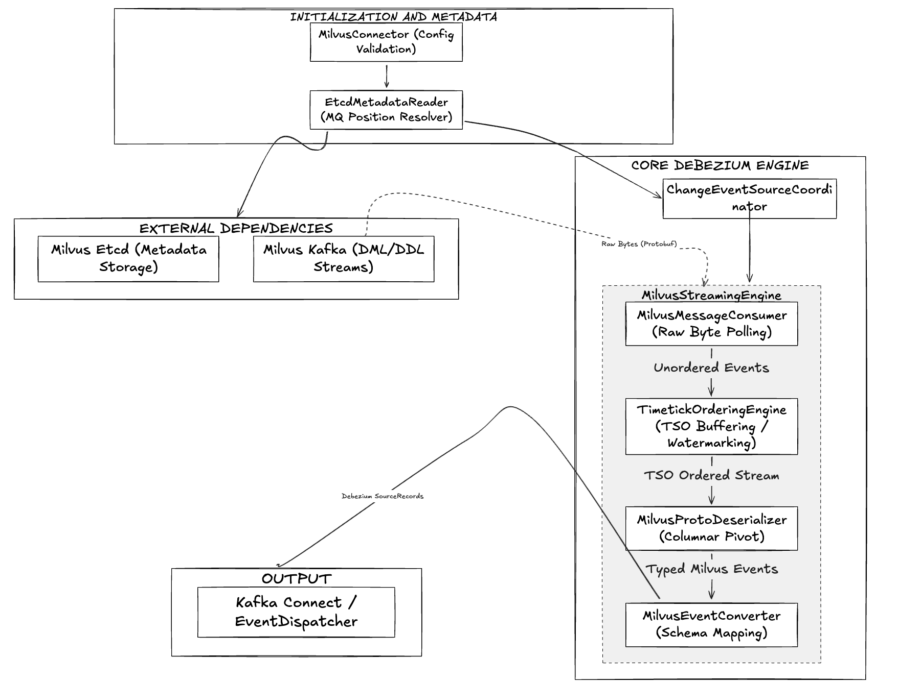
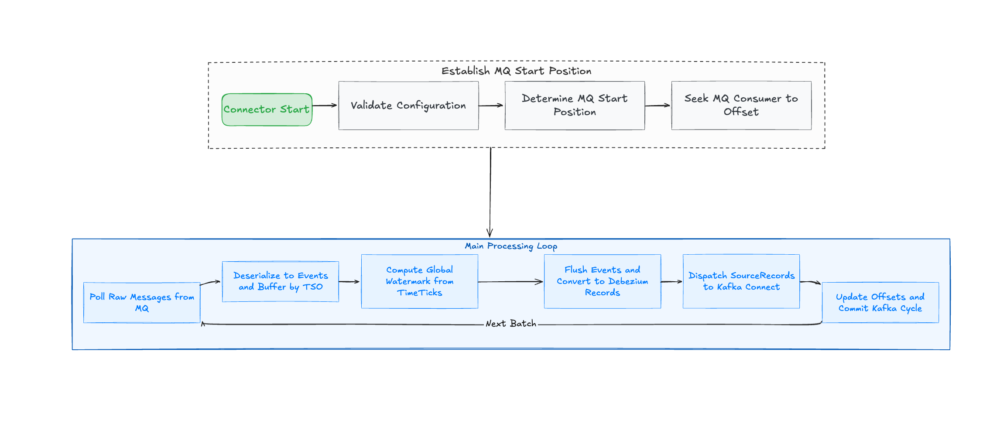

# DDD-42: Debezium Source Connector for Milvus

**Program:** Google Summer of Code 2026  
**Organization:** JBoss Community by Red Hat (Debezium)  

## 1. Motivation

Milvus is a cloud-native vector database widely used for similarity search in RAG pipelines, recommendation systems, and semantic retrieval. Debezium currently provides a **sink** connector for Milvus (data flows *into* Milvus), but no **source** connector exists, meaning changes inside Milvus are invisible to the wider data ecosystem.

This document describes how we will build a Debezium Source Connector for Milvus to capture inserts, deletes, and schema changes and emit standard Debezium change events to Kafka.

**Primary target: Milvus 2.5 with Kafka MQ backend.**  
**Framework designed to accommodate Milvus 2.6 (Woodpecker) with minimal modification.**

## Goals

- Capture Milvus 2.5 changes (DML and relevant DDL) as Debezium change events.
- Preserve ordering correctness using TSO and timetick watermark semantics.
- Provide deterministic restart behavior using Kafka Connect offset storage.
- Keep schema state consistent across snapshot, streaming, and restart paths.
- Reuse Debezium core framework classes where possible to reduce implementation risk.
- Keep a clear extension seam for Milvus 2.6 (Woodpecker) transport support.

## Proposed Changes

This proposal introduces a new Debezium source connector module for Milvus and defines:

- Milvus-specific streaming and snapshot flow built on `ChangeEventSourceCoordinator`
- metadata/bootstrap via Milvus gRPC API with etcd checkpoint alignment
- a strict deserialization pipeline for Milvus `msg.proto` events
- timetick watermark ordering and flush behavior for correctness
- offset model and restart semantics for at-least-once delivery
- schema conversion and source metadata mapping into Debezium records
- unit, integration, and Debezium Server verification strategy

### Prioritized Implementation Steps

1. Implement connector/task bootstrap (`MilvusConnector`, `MilvusConnectorTask`, config validation, partition provider).
2. Implement metadata and checkpoint readers (`MilvusMetadataClient`, `EtcdCheckpointReader`) with fail-fast startup checks.
3. Implement Kafka consumer wrapper (`KafkaMilvusMessageConsumer`) with `assign()+seek()` behavior.
4. Implement payload deserialization (`MilvusProtoDeserializer`) including column-to-row pivot and strict error handling.
5. Implement ordering engine (`TimetickOrderingEngine`) and integrate with streaming loop.
6. Implement schema layer (`MilvusSchema`, `MilvusValueConverter`) and DDL-before-DML guarantees.
7. Implement offset context + loader (`MilvusOffsetContext`) with stable flat-map serialization.
8. Wire end-to-end streaming dispatch (`MilvusStreamingChangeEventSource`) and heartbeat behavior.
9. Implement snapshot handoff (`MilvusSnapshotChangeEventSource`) using etcd checkpoint `guarantee_ts`.
10. Complete test matrix (unit + integration + Debezium Server verification).

## 2. Version Strategy & Rationale

### Why Milvus 2.5 First

| Factor | Milvus 2.5 | Milvus 2.6 |
|---|---|---|
| Internal MQ | External Kafka / Pulsar | Woodpecker (internal WAL) |
| Proto stability | Stable, well-documented | Still evolving as of early 2026 |
| CDC reference impl | `milvus-cdc` targets 2.5 | Limited reference material |
| GSoC risk | Lower — known APIs | Higher — API churn likely |
| Community adoption | Majority of production deployments | Newer, fewer deployments |

Milvus 2.5 with Kafka uses standard consumer semantics (consumer groups, offset commits, partition assignment) that are well-understood and have mature client libraries. The internal message format — Protobuf over Kafka topics — is stable and fully documented in the milvus-proto repository.

### How 2.6 Support Is Built In

The streaming abstraction (`MilvusMessageConsumer` interface) and the deserialization layer (`MilvusProtoDeserializer`) are decoupled from the MQ transport. Adding a `WoodpeckerMessageConsumer` implementation for 2.6 requires:
- A new implementation of `MilvusMessageConsumer`
- A new `WALOffset` type inside `MilvusOffsetContext`
- No changes to the timetick engine, event dispatcher, schema layer, or Kafka sink pipeline

This keeps the 2.6 path open while the core streaming pipeline stays the same.

### 2.3 Architectural Pattern

This connector follows **Standard Relational / Coordinator Pattern**. It extends `BaseSourceConnector` and `BaseSourceTask`, and delegates CDC mechanics to `ChangeEventSourceCoordinator`. Although Milvus is a non-relational vector database, the connector initially reuses Debezium's relational schema infrastructure (`RelationalDatabaseSchema`, `RelationalDatabaseConnectorConfig`) as the most mature path for schema representation. A non-relational fallback (`DatabaseSchema<CollectionId>`) is retained if mapping complexity rises.

## 3. Milvus Internals — What the Connector Must Understand

These internals drive most of the streaming behavior. If we get them wrong, the connector will produce incorrect CDC output.

### 3.1 Channel Model: pchannel vs vchannel

Milvus uses a two-level channel abstraction:

```
Collection "articles"
  └─ vchannel: by-dev-rootcoord-dml_0_v0   ─────┐
  └─ vchannel: by-dev-rootcoord-dml_1_v0   ─────┤──► pchannel: by-dev-rootcoord-dml_0 (kafka topic)
                                                │
Collection "products"                           │
  └─ vchannel: by-dev-rootcoord-dml_0_v0   ─────┘
```

**pchannel** = the actual Kafka topic (or Pulsar topic). This is what the connector subscribes to.  
**vchannel** = a logical shard within a pchannel. Multiple vchannels multiplex onto one pchannel. Each message carries a `channel_name` field identifying its vchannel.

**Why this matters:** A single Kafka topic carries interleaved messages from multiple collections and multiple vchannels. The connector must filter by vchannel, not by topic.

**How many pchannels exist?**  
Controlled by `rootcoord.dmlchannelnum` at cluster init time. Collections are assigned to vchannels round-robin. The connector discovers channel assignments from etcd at startup.

- [Milvus architecture: data model channels](https://milvus.io/docs/architecture_overview.md)
- [Milvus time synchronization design](https://github.com/milvus-io/milvus/blob/master/docs/design-docs/design_docs/20211215-milvus_timesync.md)

### 3.2 The Timestamp Oracle (TSO)

Every Milvus message carries a **TSO timestamp** in its `MsgBase.timestamp` field. It is a **Hybrid Logical Clock (HLC)** value encoding both physical time and a logical counter:

This means:
- Two events with the same physical millisecond are distinguished by the logical counter
- TSO values are **totally ordered** across all Milvus nodes for a given cluster

**Why this matters for the connector:** The connector uses TSO values as the event ordering key. All buffering and flushing decisions are made in TSO space, not in Kafka offset space. Kafka offsets control *what has been consumed from the broker* and TSO controls *what can be safely emitted to downstream*.

- [Milvus TSO implementation](https://github.com/milvus-io/milvus/blob/master/pkg/util/tsoutil/tso.go)
- [TSO field in msg.proto MsgBase](https://github.com/milvus-io/milvus-proto/blob/master/proto/msg.proto)

### 3.3 The Timetick Watermark Mechanism

This is the key mechanism behind correctness in Milvus CDC.

**The problem:** Milvus is a distributed system. Multiple proxy nodes write to the same vchannels concurrently. A consumer seeing message M with TSO=100 cannot know whether a proxy somewhere will later inject a message with TSO=95 (out of order relative to arrival, but earlier logically).

**The solution — TimeTickMsg as a watermark:**

Every Milvus node periodically publishes a `TimeTickMsg` to **every vchannel it owns**.

```
vchannel timeline (arrival order):
  Insert(TSO=92) → Insert(TSO=88) → TimeTick(TSO=100) → Insert(TSO=105) → ...
                                          ↑
                            Safe to emit all events with TSO ≤ 100
```

**The multi-vchannel watermark:**

A collection may span multiple vchannels, and a pchannel carries multiple vchannels. The connector maintains a **per-vchannel timetick**. The global watermark is:

```
global_watermark = min(latest_timetick[vchannel] for all tracked vchannels)
```

Only when the global watermark advances can events be flushed in TSO order. This prevents emitting an event from vchannel A that appears to happen after an event from vchannel B, when in fact it happened before.

**Reference behavior:**  
The connector follows the same model: keep timeticks per vchannel and flush using the global minimum watermark.

- [TimeTickMsg in msg.proto](https://github.com/milvus-io/milvus-proto/blob/master/proto/msg.proto#L200)
- [Milvus time synchronization design](https://github.com/milvus-io/milvus/blob/master/docs/design-docs/design_docs/20211215-milvus_timesync.md)

### 3.4 Message Types and Protobuf Wire Format

All Milvus MQ messages share a common envelope. The connector must handle these types:

| MsgType enum | Proto message | Connector action |
|---|---|---|
| `Insert` (1) | `InsertRequest` | Pivot columns→rows, emit `op=c` per row |
| `Delete` (2) | `DeleteRequest` | Emit `op=d` per primary key |
| `TimeTick` (1200) | `TimeTickMsg` | Advance watermark, flush buffer |
| `CreateCollection` (100) | `CreateCollectionRequest` | Apply schema, emit schema-change event |
| `DropCollection` (101) | `DropCollectionRequest` | Remove schema, emit schema-change event |
| `CreatePartition` (200) | `CreatePartitionRequest` | Update partition metadata |
| `DropPartition` (201) | `DropPartitionRequest` | Update partition metadata |

#### Wire Format Detection Decision

The connector determines wire format once at startup using `MilvusWireFormatDetector`. `MarshalType` is cluster-wide and stable for a given running version; it is not expected to vary message-to-message.

Startup probe algorithm:
1. Connect to the Kafka broker.
2. For each configured pchannel, read the first message at the next processing position:
- earliest available message after subscription
- message at stored seek position
3. Inspect bytes of the message value:
   - If bytes match MsgPack prefix : format = `MSGPACK_BATCH`
   - If bytes match a Protobuf varint tag for `MsgBase`: format = `PROTO_SINGLE`
   - Otherwise: throw `DebeziumException` with topic and offset details
4. Assert all sampled topics agree on the same format. If they differ: throw DebeziumException.
5. Store detected format in task state as (`MSGPACK_BATCH` or `PROTO_SINGLE`).
   The task will use this for all subsequent deserialization without re-probing.

#### Rolling Upgrade Behavior

If Milvus changes `MarshalType` during a rolling upgrade, a topic may contain old-format messages followed by new-format messages.

Handling:
- Probe selects the format for the next-to-be-processed message stream.
- If a mismatch appears mid-stream, `MilvusProtoDeserializer` throws `MilvusWireFormatMismatchException`.
- The exception is surfaced as fatal (`DebeziumException`), and operator restart is required after upgrade convergence.

#### Message Envelope and Deserializer Contract

Envelope structure:
- `Bytes[0:N]` is either a MsgPack batch (`MSGPACK_BATCH`) or a raw serialized proto (`PROTO_SINGLE`).
- Each decoded message contains `MsgBase` plus message-specific payload.

Deserializer contract:
- Pure function on raw payload.
- No side effects on offsets or schema state.
- Returns typed events only.
- Throws Exceptions such as `MilvusWireFormatMismatchException` or `DebeziumException`.
- No skipping would happen for unknown message types or malformed payload.

#### InsertRequest Columnar Layout (Mandatory Pivot)

Milvus sends values column-wise in `FieldData`. Row `i` is reconstructed by taking index `i` from each field array.

Contract:
- Reject row if required primary key field is missing.
- Reject batch if field column lengths do not match `num_rows`.
- Emit one Debezium record per reconstructed row.

- [msg.proto — full message definitions](https://github.com/milvus-io/milvus-proto/blob/master/proto/msg.proto)
- [schema.proto — FieldData, CollectionSchema](https://github.com/milvus-io/milvus-proto/blob/master/proto/schema.proto)
- [Milvus msgstream Go source — serialization](https://github.com/milvus-io/milvus/blob/master/pkg/mq/msgstream/msgstream.go)
- [Milvus internal column-to-row handling](https://github.com/milvus-io/milvus/blob/master/internal/storage/utils.go#L540-L582)

### 3.5 Metadata and Checkpoint Sources

Milvus gRPC API as the primary metadata source to be used while retaining direct etcd only for checkpoint data with an explicit risk acknowledgement.

`MsgPosition` (the channel checkpoint) contains:
- `msgID` for MQ seek position
- `timestamp` for `guarantee_ts` snapshot boundary

The `timestamp` field in `MsgPosition` is used as `guarantee_ts` for the snapshot SDK query, ensuring the snapshot reads only data that was durably flushed before streaming begins.

The Milvus gRPC API (MilvusServiceClient) exposes stable, versioned endpoints for all collection metadata the connector requires:

| Data needed | gRPC call 
|---|---|
| Collection schema | `DescribeCollection(collection_name)` | 
| vchannel → pchannel mapping | `DescribeCollection` response: `physical_channel_names` | Stable since 2.x |
| Database list | `ListDatabases()` | Stable since 2.3 |
| Collection list | `ShowCollections()` | Stable since 2.x |

MilvusMetadataClient wraps MilvusServiceClient and is the only metadata path for:
- Schema loading at startup and on `CreateCollectionEvent`
- Channel discovery (vchannel → pchannel mapping)
- Database enumeration for multi-tenancy

This means the original single etcd reader is split into `MilvusMetadataClient` (metadata) and `EtcdCheckpointReader` (checkpoint-only).

#### 3.5.1 Residual Direct Etcd Path (EtcdCheckpointReader)
The Milvus gRPC API does not expose channel checkpoint data. This data is stored in etcd and is required for the snapshot handoff.

Risk register for direct etcd access (checkpoint path only):

| Risk | Impact | Mitigation |
|---|---|---|
| etcd key path changes between Milvus minor versions| Connector fails to start | Configurable `milvus.etcd.checkpoint.path` override; startup validation with explicit error message |
| etcd auth/TLS changes| Connector fails to connect | Full TLS + auth config surface in connector config |
| etcd key format (proto schema) changes| Deserialization fails | `MsgPosition` proto is part of milvus-proto public repo; monitor for changes |

EtcdCheckpointReader is a contained component with a clear interface boundary. Its etcd key path is configurable and its failure mode is a loud startup error, not silent data loss.

Any attempt to read collection schema or channel assignment from etcd is a bug. The component must be documented with a @EtcdInternalAPI annotation and a warning comment explaining the stability risk.
Future mitigation: Track milvus-io/milvus-proto for addition of a checkpoint API. If one is added, EtcdCheckpointReader should be deprecated immediately.

- [Milvus etcd key layout (meta package)](https://github.com/milvus-io/milvus/blob/master/internal/metastore/kv/rootcoord/kv_catalog.go)
- [MsgPosition proto](https://github.com/milvus-io/milvus-proto/blob/master/proto/msg.proto)

## 4. Architecture Overview

### 4.1 Architecture Diagram



### 4.2 Flow Diagram




## 5. Streaming Phase — Core Design

The streaming phase is responsible for continuous, ordered, crash-safe delivery of all Milvus change events to Kafka. Correctness comes first here, even when throughput is lower.

### 5.1 Channel Discovery

Before subscribing to Kafka, the connector must know which Kafka topics (pchannels) correspond to the configured collections.

**Step 1 — Read collection metadata from Milvus gRPC API:**
- Load each configured collection.
- Resolve vchannel list from collection metadata.
- Resolve pchannel per vchannel.
- Fail startup if any configured collection cannot be resolved.

**Step 2 — Build the subscription map:**


The connector subscribes to each unique pchannel. Messages are then filtered by vchannel when processing.

**Step 3 — Determine which collections to monitor:**  
Driven by `collection.include.list` config property. If empty, monitor all collections.

- [Milvus metadata API docs](https://milvus.io/api-reference/pymilvus/v2.6.x/MilvusClient/Collections/describe_collection.md)
- [Milvus CDC overview](https://milvus.io/docs/milvus_cdc_overview.md)

### 5.2 Seek Position Bootstrap

When the streaming source starts, it must seek the Kafka consumer to the right starting position. There are three cases:

**Case A — No stored offset:**
The snapshot runs first. After snapshot completion, `MilvusOffsetContext` contains the `MsgPosition` read from etcd before the snapshot ran. Streaming seeks to that position.

**Case B — Offset stored in Kafka Connect:**
The offset map contains pchannel with topic, partition, kafka_offset parameters. Seek the Kafka consumer to kafka_offset + 1 for each partition.

**Case C — Offset expired (MQ retention exceeded):**
The stored kafka_offset is no longer available(offset out of range exception). Behavior is determined by `snapshot.mode`:
- `initial` → re-run snapshot, establish new anchor
- `never` → fail with descriptive error containing the expired offset value

Contract:
- Seek is explicit for every assigned partition.
- `OffsetOutOfRange` handling is mapped to `snapshot.mode`.
- No implicit `auto.offset.reset` fallback is allowed.


### 5.3 The Kafka Consumer Layer

**Interface:**
```java
interface MilvusMessageConsumer extends AutoCloseable {
  void assignAndSeek(Map<TopicPartition, Long> offsets);
  List<RawMilvusMessage> poll(Duration timeout);
  void close();
}
```

**KafkaMilvusMessageConsumer implementation details:**
- Uses `consumer.assign()` only.
- Calls `seek(tp, offset+1)` on warm restart.
- Uses bounded poll timeout and propagates retriable Kafka exceptions.

**note:**
`KafkaMilvusMessageConsumer` is intentionally not a group-managed consumer. It does not subscribe, does not rely on rebalances, and does not use broker-managed group offsets for recovery decisions. Ownership and resume position are controlled by Debezium internal task state.

**Key Kafka consumer configuration for correctness:**

| Property | Value | Reason |
|---|---|---|
| `enable.auto.commit` | `false` | Debezium manages offsets via Connect storage |
| `isolation.level` | `read_committed` | Avoid reading transactional messages mid-transaction |
| `auto.offset.reset` | `none` | Force explicit seek; fail if offset missing |
| `max.poll.interval.ms` | `300000` | Prevent rebalance during slow snapshot phases |
| `group.id` | Connector name | Required but offset management is manual via `seek()` |

Even with `group.id` configured, this implementation remains manually assigned (`assign`) and manually positioned (`seek`). Group metadata exists only to satisfy Kafka client requirements and operational observability and it is not used for partition ownership decisions.


### 5.4 Message Deserialization Pipeline

This step turns raw Kafka bytes into typed Milvus events.

**Wire format note:**  
Milvus's `msgstream` package wraps messages. In Kafka mode, each Kafka message value is a serialized `MsgPack` (a batch container) OR a single serialized proto depending on the batch setting. The safest approach is to attempt `MsgPack` parsing first, then fall back to individual message parsing.

**Deserializer:**
- Pure function on raw payload.
- No side effects on offsets or schema state.
- Returns typed events only.

**Column value extraction** — `extractValue(FieldData field, int rowIndex)`:
- Handles scalar, JSON, vector, and array types.
- Throws explicit conversion error when type does not match payload.

**References:**
- [ScalarField, VectorField in schema.proto](https://github.com/milvus-io/milvus-proto/blob/master/proto/schema.proto)
- [Milvus internal column-to-row handling](https://github.com/milvus-io/milvus/blob/master/internal/storage/utils.go#L540-L582)


### 5.5 The Timetick Ordering Engine (Critical)

This is the core of streaming correctness. Without it, events would be emitted in Kafka arrival order instead of logical TSO order.

**Data structures:**
- `TreeMap<Long, List<MilvusChangeEvent>> pendingByTso`
- `Map<String, Long> latestTimetickByVchannel`
- `Set<String> trackedVchannels`

**Processing a TimeTickEvent:**
1. Update `latestTimetickByVchannel[vchannel]`.
2. Compute `globalWatermark = min(latestTimetickByVchannel)`.
3. Flush all `pendingByTso` entries where `tso <= globalWatermark`.

**Buffering an event (DML/DDL):**
- Append to `pendingByTso[event.tso]`.
- Enforce max buffer entries / bytes.

**Stall detection:**
- If no watermark progress for `timetickStallTimeout`, force flush with emergency watermark `max(pendingByTso.keys())` and log WARN.

**Why the buffer is TSO-keyed, not arrival-order keyed:**  
Multiple events at the same TSO are allowed (e.g., a batch insert from two proxies at the same physical millisecond but different logical counters). The TreeMap naturally handles this because TSO values uniquely identify positions in the HLC ordering.

**Why min(vchannel timeticks) is the correct watermark:**  
Consider two vchannels: vc0 has timetick=100, vc1 has timetick=80. A buffered event with TSO=90 could be "before" an as-yet-unarrived event from vc1 with TSO=85. We cannot flush TSO=90 until vc1 confirms its watermark has passed 90. Only when min(vc0=100, vc1=80) = 80 ≥ event.TSO is it safe.

**References:**
- [Milvus time sync design](https://github.com/milvus-io/milvus/blob/master/docs/design-docs/design_docs/20211215-milvus_timesync.md)


### 5.6 DDL/DML Interleaving and Schema Evolution

DDL events (CreateCollection, DropCollection) arrive in the same Kafka stream as DML events. They carry TSOs and participate in the timetick ordering. This guarantees schema-before-data ordering. If `CreateCollectionEvent` at TSO=T is flushed, inserts for that collection with TSO>T are flushed later.

**Schema change processing in the flush path:**
1. `CreateCollectionEvent`: build table schema then emit schema change.
2. `DropCollectionEvent`: emit schema drop event then remove from schema cache.
3. DML event dispatch is blocked until schema state for that collection is valid.

**Schema evolution between restarts:**  
On restart, `MilvusMetadataClient` re-reads current schemas from Milvus gRPC metadata APIs. The connector does not rely on the schema history topic to reconstruct the current schema. The schema history topic is written for downstream consumers only.


### 5.7 The Streaming Execution Loop

Loop contract:
1. `poll()` raw messages
2. deserialize
3. update ordering state
4. flush ready events
5. dispatch Debezium records
6. update offset context

**Why this matters:**  
Kafka Connect only commits offsets when the source task returns `SourceRecord`s. An idle Milvus collection produces no events, so the committed offset can stall and recovery may resume from an older position. Heartbeats keep offsets moving even when there is no data change.


### 5.8 Crash Recovery and Restart Semantics

**Durability guarantee:** The connector provides **at-least-once delivery**. A record is committed to Kafka Connect offset storage only after the `SourceTask.poll()` method returns it. If the connector crashes before returning a record, it will be re-read and re-emitted on restart.

**Deduplication on restart:**  
Because Kafka seeks to the last committed Kafka offset, and offset commit happens after Debezium's internal queue drains, there is a window where the last N events before a crash are re-processed. Downstream consumers should use Milvus primary keys for idempotent upserts. The `source.tso` field in the event envelope enables downstream deduplication.

**Offset state stored per pchannel:**

Offset payload is stored as a flat Kafka Connect map so resume state is deterministic across restarts.

`vchannel_timeticks` is stored so the ordering engine can pre-warm its watermark state on restart, avoiding an artificial stall period at startup where all timeticks appear to be zero.

**Restart sequence:**
```
1. Load offset from Connect storage
2. Re-read all schemas from etcd (authoritative)
3. Pre-warm TimetickOrderingEngine with stored vchannel_timeticks
4. Seek Kafka consumer to kafka_offset + 1 for each pchannel
5. Enter main poll loop
```


### 5.9 Backpressure and Buffer Management

The in-memory event buffer (`TreeMap<Long, List<MilvusChangeEvent>>`) can grow unboundedly if:
- Timetick messages stop arriving (node failure)
- One vchannel's timetick lags far behind others

**Buffer limits:**
- `maxBufferedEvents` (count)
- `maxBufferedBytes` (approx payload bytes)
- crossing either threshold throws `MilvusBufferFullException`

When `MilvusBufferFullException` is thrown:
1. Stop calling `consumer.poll()` temporarily.
2. Wait up to `timetickStallTimeout` for normal watermark recovery.
3. If watermark does not recover, force-flush with emergency watermark = max buffered TSO.
4. Resume normal polling.

Force-flush is an explicit relaxation of strict ordering. A stalled vchannel can later deliver a message with `TSO < emergency_watermark`, causing potential out-of-order visibility.

Mitigation:
- Forced flush is a exceptional recovery path, not a normal correctness path.
- After forced flush, apply `lateMessageWindowMs` (default `5000` ms). Messages with `TSO <= emergency_watermark` from previously stalled vchannels are handled by `milvus.late.message.policy`:
- `drop_and_warn` (default): drop message and log WARN with TSO, vchannel, and offset.
- `fail`: throw `DebeziumException` and stop the task for operator intervention.

Forced flush is observable:
- Source block marks affected events with `force_flushed=true`.
- Metrics expose `ForcedFlushCount` and `LateMessagesDropped`.

Default rationale:
`drop_and_warn` is the default because forced flush only occurs after sustained timetick stall (typically node failure). The ordering violation is bounded to the stall window, and most downstream vector/search consumers are idempotent by primary key.


### 5.10 Edge Cases in Streaming

These are handled inside `MilvusStreamingChangeEventSource`:

**E1 — DropCollection with buffered DML:**  
Scenario: Insert(TSO=90) is buffered. DropCollection(TSO=95) is flushed first (wrong watermark). Deferred DML for dropped collection has no schema.  
Solution: When flushing at watermark W, process all events with TSO ≤ W in strict TSO order. DDL at TSO=95 will always be flushed after DML at TSO=90. If a schema is not found at dispatch time, log and skip (schema was dropped before event was processable).

**E2 — Collection not found in etcd at startup:**  
Solution: Fail fast with `DebeziumException`. This follows Debezium's convention and prevents silent data loss.

**E3 — CreateCollection received mid-stream (new collection created while connector is running):**  
Solution: `CreateCollectionEvent` arrives in the MQ stream, is flushed by the timetick engine, and `milvusSchema.applySchemaChange()` is called. The new collection's vchannels are added to `trackedVchannels` so the ordering engine starts tracking its timeticks. `MilvusMetadataClient` is called on `CreateCollectionEvent` to fetch full collection metadata.

**E4 — Timetick gap (one vchannel stops sending timeticks):**  
Scenario: A Milvus node crashes. Its vchannels stop producing TimeTickMsg. The global watermark freezes.  
Solution: `timetickStallTimeout` (default: 30s, configurable). After the timeout, force-flush with emergency watermark = max buffered TSO. Log at WARN. If the node recovers and sends a timetick, normal operation resumes with no data loss (events were buffered, not dropped).

**E5 — Kafka consumer group rebalance:**  
Solution: Use `assign()` instead of `subscribe()` for partition assignment. Do not use `subscribe()` with a group coordinator for this connector. Partition assignment is driven by vchannel discovery, not Kafka rebalance. This avoids rebalance-triggered offset commits that conflict with Debezium's offset management.

Implementation rule: edge cases are handled inside the streaming source and must be covered by integration tests.

**E6 — Empty collection (no data, no DML events):**  
Solution: The connector subscribes to the pchannel and receives only TimeTickMsg events. The watermark advances, the buffer remains empty, heartbeat events keep offsets committed. Correct behavior with no special handling needed.


## 6. Snapshot Phase

**Set a safe MQ start position**

**Algorithm:**

```
1. Read channel checkpoint from etcd:
   key: {root}/data-coord/checkpoint/binlog/channel/{pchannel}
   value: MsgPosition { msgID: <Kafka offset bytes>, timestamp: <guarantee_ts TSO> }

2. Decode msgID to Kafka {topic, partition, offset}.
   Store in MilvusOffsetContext as the streaming start position.

3. Start buffering MQ events from the checkpoint position
   (subscribe to Kafka at checkpoint offset, buffer but don't emit).

4. If snapshot.mode = initial:
   a. Query Milvus SDK for all rows with consistency_level=Strong,
      guarantee_ts = checkpoint.timestamp
   b. Emit each row as op=r SourceRecord
   c. Mark snapshot_completed = true in offset

5. Signal streaming source to start from the buffered MQ position.
   Drain buffer in TSO order using the timetick engine.
```

**Why guarantee_ts alignment works:**  
The DataCoord checkpoint TSO is the latest TSO of data flushed to object storage. By querying with `guarantee_ts = checkpoint.timestamp`, the SDK returns exactly the data visible at that TSO. Streaming begins at the MQ position corresponding to that same TSO. Together they produce a complete, gapless view.

## 7. Component Reference

| Component | Base / Type | Primary Responsibility | Runtime Guarantee |
|---|---|---|---|
| `MilvusConnector` | `BaseSourceConnector` | Connector entrypoint, task partitioning, config validation | Invalid config fails fast before task startup |
| `MilvusConnectorTask` | `BaseSourceTask<MilvusPartition, MilvusOffsetContext>` | Task lifecycle, queue/coordinator wiring | Deterministic startup/shutdown with managed resources |
| `MilvusConnectorConfig` | `RelationalDatabaseConnectorConfig` (or `CommonConnectorConfig` fallback) | Connector properties, validation, defaults | Rejects inconsistent MQ/snapshot settings |
| `MilvusPartition` / `MilvusPartition.Provider` | `Partition` / `Partition.Provider` | pchannel partition model and discovery | One partition per pchannel for offset consistency |
| `MilvusOffsetContext` / `Loader` | `CommonOffsetContext` / `OffsetContext.Loader` | Offset serialization/deserialization | Snapshot + streaming resume state remains unambiguous |
| `MilvusChangeEventSourceFactory` | `ChangeEventSourceFactory` | Builds snapshot and streaming sources | Always returns compatible source pair for coordinator |
| `MilvusSnapshotChangeEventSource` | `AbstractSnapshotChangeEventSource` | Snapshot and handoff anchor establishment | Uses etcd checkpoint `timestamp` as `guarantee_ts` |
| `MilvusStreamingChangeEventSource` | `StreamingChangeEventSource` | Main CDC loop and dispatch | At-least-once delivery and deterministic restart replay |
| `MilvusMetadataClient` | Service class | Reads collection/channel metadata from Milvus gRPC APIs | Missing required metadata fails startup |
| `EtcdCheckpointReader` | Service class | Reads checkpoint `MsgPosition` from etcd | Missing required checkpoint fails startup |
| `MilvusMessageConsumer` / `KafkaMilvusMessageConsumer` | Interface / impl | MQ read abstraction and Kafka implementation | Uses `assign()+seek()`, no rebalance-driven ownership |
| `MilvusProtoDeserializer` | Service class | Raw bytes to typed Milvus events | Unknown/malformed payload fails explicitly (no silent drop) |
| `TimetickOrderingEngine` | Service class | Buffering + watermark-based flush | Emits only events safe under global timetick watermark |
| `MilvusSchema` | `RelationalDatabaseSchema` (or `DatabaseSchema<CollectionId>` fallback) | Schema cache and schema-change application | DDL schema change applied before dependent DML dispatch |
| `MilvusValueConverter` / `VectorFieldSerializer` | `ValueConverterProvider` / `ValueConverter` | Milvus type mapping into Connect schema/value | Stable scalar/vector conversion across snapshot and stream |
| `MilvusChangeRecordEmitter` | `RelationalChangeRecordEmitter` | Builds Debezium envelope and records | Correct `op` and source metadata per emitted record |
| `MilvusSourceInfo` / `MilvusSourceInfoStructMaker` | `BaseSourceInfo` / `CommonSourceInfoStructMaker` | Source block population (`collection`, `vchannel`, `tso`) | Consistent source metadata for downstream replay/dedup |
| `MilvusEventMetadataProvider` | `EventMetadataProvider` | Timestamp/position metadata for framework metrics | Stable timestamp and position extraction |
| `MilvusErrorHandler` | `ErrorHandler` | Retriable vs fatal error handling | Transient errors retried, fatal errors stop task clearly |
| `MilvusConnection` | Service class | Milvus SDK + etcd client lifecycle | Connections validated at startup and closed on stop |

## 8. Offset Model

### Partition Key
One `MilvusPartition` per pchannel. Multiple vchannels are handled within a single partition.

### Offset Value
Flat map, Kafka Connect compatible; no nested structures except JSON string fields.

### MilvusOffset record
Required keys:
- `mq_topic`
- `mq_partition`
- `mq_offset`
- `vchannel_timeticks` (JSON map)
- `snapshot_completed`

### Serialization
`MilvusOffsetContext.getOffset()` produces the flat string map that Kafka Connect stores. `MilvusOffsetContext.Loader.load()` restores it. `vchannelTimeticks` is JSON-serialized as a string value within the flat map (Kafka Connect offset storage does not support nested maps).


## 9. Event Envelope Format

### DML Insert Event
One event per reconstructed row with `op='c'`, keyed by Milvus primary key.

### DDL Schema Change Event (schema history topic)
Schema change record is emitted before first DML that depends on it.

### Field Type Mapping

| Milvus DataType | Kafka Connect Schema | Notes |
|---|---|---|
| Bool | `Schema.BOOLEAN_SCHEMA` | |
| Int8 | `Schema.INT8_SCHEMA` | |
| Int16 | `Schema.INT16_SCHEMA` | |
| Int32 | `Schema.INT32_SCHEMA` | |
| Int64 | `Schema.INT64_SCHEMA` | |
| Float | `Schema.FLOAT32_SCHEMA` | |
| Double | `Schema.FLOAT64_SCHEMA` | |
| VarChar / String | `Schema.STRING_SCHEMA` | |
| JSON | `io.debezium.data.Json` logical type | String payload |
| FloatVector(dim) | `Schema.BYTES_SCHEMA` | Base64 of little-endian float array |
| BinaryVector(dim) | `Schema.BYTES_SCHEMA` | Base64 of raw bytes |
| SparseFloatVector | `Schema.STRING_SCHEMA` | JSON `{"index": value, ...}` |
| Float16Vector | `Schema.BYTES_SCHEMA` | Raw bytes, Base64 |
| BFloat16Vector | `Schema.BYTES_SCHEMA` | Raw bytes, Base64 |
| Array | `SchemaBuilder.array(elementSchema)` | Element type from `element_type` |

Vector dimension is encoded in `column.typeExpression()` as `"FLOAT_VECTOR(128)"` and parsed by `MilvusValueConverter` at conversion time. This avoids needing a custom JDBC type.


## 10. Testing Strategy

### 10.1 Unit Tests

| Test class | What it verifies |
|---|---|
| `TimetickOrderingEngineTest` | Watermark computation, multi-vchannel ordering, stall detection, buffer limits |
| `MilvusProtoDeserializerTest` | All MsgType variants, columnar pivot correctness, vector extraction |
| `MilvusOffsetContextTest` | Serialization/deserialization roundtrip, timetick warm-start |
| `VectorFieldSerializerTest` | Float/Binary/Sparse Base64 encoding correctness |
| `MilvusSchemaTest` | CollectionSchema → Debezium Table conversion, all Milvus types |

**TimetickOrderingEngineTest — critical test cases:**
1. out-of-order arrival across vchannels flushes in strict TSO order
2. no flush before min watermark crosses event TSO
3. stall timeout triggers force flush
4. restart with pre-warmed timeticks does not freeze watermark at zero

### 10.2 Integration Tests (Testcontainers)

Integration assertions:
- verify no missing TSO ranges across restart
- verify duplicates only in replay window (at-least-once expected)
- verify schema change appears before dependent DML

| Test scenario | Assertion |
|---|---|
| Insert 100 rows, start connector | All 100 rows appear in Kafka topic as `op=c` events |
| Insert rows, crash connector, restart, insert more rows | No gaps, no duplicates in final topic |
| Create collection while connector running | Schema change event appears before first DML event |
| Drop collection with pending inserts | All inserts emitted before drop schema change |
| Timetick stall (kill one Milvus node) | Events force-flushed after `timetickStallTimeout` |
| MQ offset expired | Connector fails with descriptive error if `snapshot.mode=never` |
| Multi-collection on same pchannel | Events correctly attributed to respective collections |

### 10.3 Debezium Server Verification

We should also verify the connector in Debezium Server mode, not only in Kafka Connect mode.

Minimal verification checklist:

1. Boot Debezium Server with `debezium.source.connector.class` pointing to `MilvusConnector`.
2. Verify snapshot records reach configured sink.
3. Insert additional rows after startup and verify streaming records reach sink.
4. Restart Debezium Server and verify resume happens from stored offsets.
5. Force an offset-expired scenario and verify `snapshot.mode` behavior (`initial` vs `never`).
6. Validate emitted source block fields (`collection`, `vchannel`, `tso`) are preserved.

## 11. Milvus 2.6 / Woodpecker

The `MilvusMessageConsumer` interface is the only point of contact between the streaming engine and the transport layer. Adding Milvus 2.6 support requires:

1. **`WoodpeckerMessageConsumer`** — implements `MilvusMessageConsumer` using the Milvus 2.6 `StreamingService` gRPC API. Subscribes to vchannels directly via `SubscribeRequest`, translates `LogEntry` proto to `RawMilvusMessage`.

2. **`WoodpeckerOffset`** — a new offset type storing `{vchannel, messageId}` pairs instead of Kafka topic/partition/offset.

4. **No changes required to:** `TimetickOrderingEngine`, `MilvusProtoDeserializer`, `MilvusSchema`, `MilvusEventConverter`, `VectorFieldSerializer`, `MilvusStreamingChangeEventSource`.

DDL via the Woodpecker WAL is more complex than etcd watch — DDL entries in the WAL require more parsing. A hybrid approach (etcd watch for DDL, Woodpecker for DML) as described in the Proposal A document is the correct design for 2.6.

## 12. Metrics and Observability

The connector implements the standard Debezium MBean layout and adds Milvus-specific metrics. All metrics are exposed via JMX following the Debezium convention:

- `debezium.milvus:type=connector-metrics,context=snapshot,server=<server>`
- `debezium.milvus:type=connector-metrics,context=streaming,server=<server>`

Prometheus scraping via the standard JMX Exporter agent is supported.

### 12.1 Snapshot MBean: MilvusSnapshotChangeEventSourceMetrics

Implements SnapshotChangeEventSourceMetricsMXBean.

| Metric | Type | Source |
|---|---|---|
| `TotalTableCount` | `int` | `MilvusMetadataClient.listCollections().size()` at snapshot start | Number of collections to snapshot |
| `RemainingTableCount` | `int` | Decremented as each collection snapshot completes | Snapshot progress |
| `SnapshotRunning` | `boolean` | Set at start, cleared at end | |
| `SnapshotCompleted` | `boolean` | Set on successful completion | |
| `SnapshotAborted` | `boolean` | Set on error | |
| `SnapshotStartTs` | `long` | System clock at snapshot start | Milliseconds since epoch |
| `SnapshotDurationInSeconds` | `long` | Derived from start/end | |
| `TotalNumberOfEventsSeen` | `long` | Incremented per `op=r` row emitted | |
| `NumberOfEventsFiltered` | `long` | Incremented for rows outside `collection.include.list` | |
| `GuaranteeTso` | `long` | `checkpoint.timestamp` from `EtcdCheckpointReader` | HLC TSO used as snapshot anchor |

**Gap**: Standard Debezium does not expose GuaranteeTso. This is a Milvus-specific addition as it is essential for diagnosing snapshot/streaming handoff issues and must be added to MilvusSnapshotChangeEventSourceMetrics as a connector-specific attribute beyond the base SnapshotChangeEventSourceMetricsMXBean interface.

### 12.2 Streaming MBean: MilvusStreamingChangeEventSourceMetrics

Implements StreamingChangeEventSourceMetricsMXBean.

| Metric | Type | Source |
|---|---|---|
| `NumberOfEventsFiltered` | `long` | Incremented per filtered vchannel message | |
| `TotalNumberOfEventsSeen` | `long` | Incremented per deserialized message | |
| `MilliSecondsBehindSource` | `long` | `System.currentTimeMillis() - (globalWatermark >> 18)` | CDC lag from watermark physical time |
| `MilliSecondsFromLastEvent` | `long` | Time since last emitted `SourceRecord` | |
| `NumberOfCommittedTransactions` | `long` | Not applicable to Milvus | See gap note below |
| `SourceEventPosition` | `Map<String, String>` | `MilvusOffsetContext.getOffset()` | Last committed offset |
| `LastEvent` | `String` | Last emitted event summary | |
| `ConnectedToKafka` | `boolean` | `KafkaMilvusMessageConsumer` health check | Connector-specific |
| `GlobalWatermarkTso` | `long` | `min(latestTimetickByVchannel)` | Connector-specific |
| `BufferedEventCount` | `int` | In-memory buffer size | Connector-specific |
| `BufferedEventBytes` | `long` | Approximate buffered bytes | Connector-specific |
| `ForcedFlushCount` | `long` | Incremented on emergency watermark flush | Connector-specific |
| `LateMessagesDropped` | `long` | Incremented on post-flush late-message drops | Connector-specific |
| `TimetickStallCount` | `long` | Incremented when a vchannel stalls | Connector-specific |
| `StalledVchannels` | `String[]` | Current stalled vchannels | Connector-specific; JConsole-friendly |
| `WireFormatDetected` | `String` | Startup probe result (`MSGPACK_BATCH` or `PROTO_SINGLE`) | Connector-specific |
| `UpsertMode` | `String` | Runtime `milvus.upsert.mode` | Connector-specific |

**Gap**: NumberOfCommittedTransactions: Milvus does not have explicit transaction boundaries in the msgstream. The closest equivalent is a flush event. This metric cannot be populated meaningfully as it will be exposed as 0 with a comment in the implementation. If the Debezium framework makes this metric mandatory, it will be documented as always-zero for this connector.

**Gap**: MilliSecondsBehindSource calculation: The TSO watermark uses physical time bits(milliseconds). The calculation (globalWatermark >> 18) extracts this. This is the same extraction used internally by Milvus.

## 13. Resources and References

### Milvus Core
| Resource | URL | Used for |
|---|---|---|
| msg.proto | https://github.com/milvus-io/milvus-proto/blob/master/proto/msg.proto | message and event contract |
| schema.proto | https://github.com/milvus-io/milvus-proto/blob/master/proto/schema.proto | field type contract |
| msgstream.go | https://github.com/milvus-io/milvus/blob/master/pkg/mq/msgstream/msgstream.go | payload framing |
| utils.go column pivot | https://github.com/milvus-io/milvus/blob/master/internal/storage/utils.go#L540-L582 | row reconstruction |
| kv_catalog.go | https://github.com/milvus-io/milvus/blob/master/internal/metastore/kv/rootcoord/kv_catalog.go | etcd metadata lookup |
| milvus_timesync.md | https://github.com/milvus-io/milvus/blob/master/docs/design-docs/design_docs/20211215-milvus_timesync.md | timetick/watermark semantics |

### Debezium Core
| Resource | URL | Used for |
|---|---|---|
| Connector development guide | https://debezium.io/documentation/reference/development/engine.html | framework behavior |
| MongoDbSchema reference | https://github.com/debezium/debezium/blob/main/debezium-connector-mongodb/src/main/java/io/debezium/connector/mongodb/MongoDbSchema.java | non-relational schema fallback |

### Kafka
| Resource | URL | Used for |
|---|---|---|
| consumer configs | https://kafka.apache.org/documentation/#consumerconfigs | assign/seek behavior |
| isolation.level | https://kafka.apache.org/documentation/#isolation.level | transactional visibility |

---