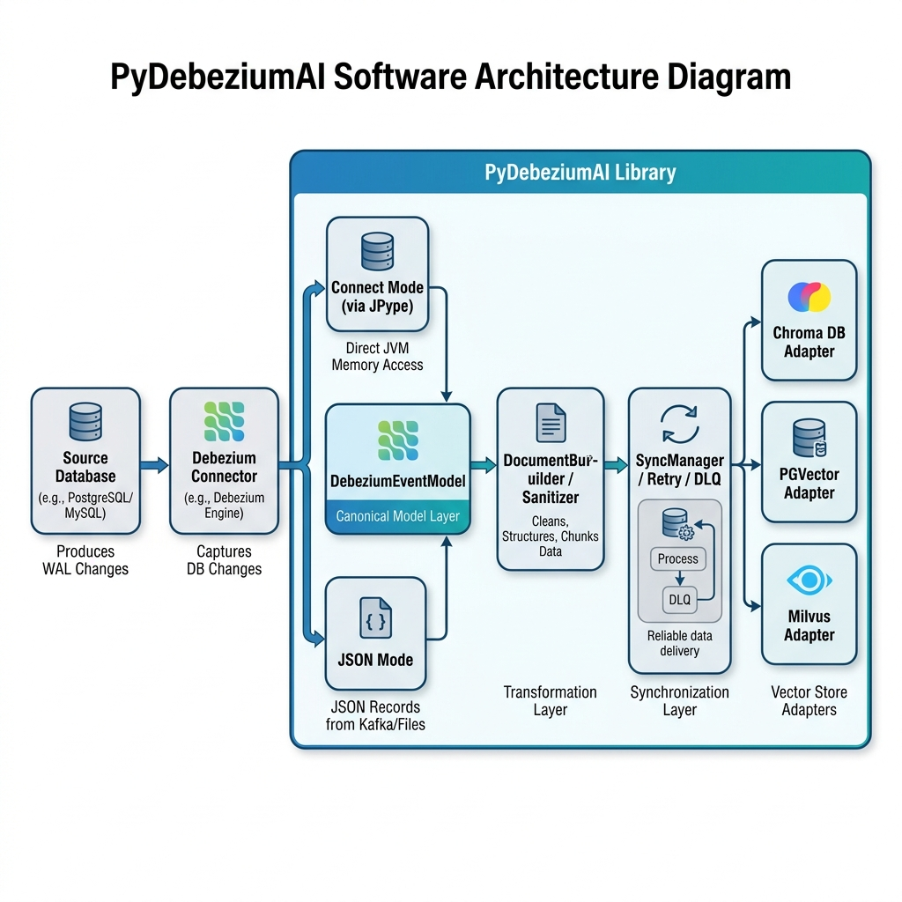

# DDD-42: Debezium Source Connector for Milvus

**Program:** Google Summer of Code 2026  
**Organization:** Debezium (JBoss Community by Red Hat)  

## 1. Motivation

Milvus is a cloud-native vector database widely used for similarity search in RAG pipelines, recommendation systems, and semantic retrieval. Debezium currently provides a **sink** connector for Milvus (data flows *into* Milvus), but no **source** connector exists, meaning changes inside Milvus are invisible to the wider data ecosystem.

This document describes the Debezium Source Connector for Milvus, which captures inserts and deletes from a Milvus physical channel and emits standard Debezium change events to Kafka. It describes the connector as merged. Where the implementation narrows the original design, the document says so and records the wider design as future work.

**Primary target: Milvus 2.5 with Kafka MQ backend.**  
**Framework designed to accommodate Milvus 2.6 (Woodpecker) with minimal modification.**

## Goals

- Capture Milvus 2.5 DML changes (inserts, deletes, and the delete+insert pair Milvus emits for an upsert) as Debezium change events; track collection DDL for ordering.
- Preserve ordering correctness using TSO and timetick watermark semantics.
- Provide deterministic restart behavior using Kafka Connect offset storage.
- Keep schema state consistent across snapshot, streaming, and restart paths.
- Reuse Debezium core framework classes where possible to reduce implementation risk.
- Keep a clear extension seam for Milvus 2.6 (Woodpecker) transport support.

## Proposed Changes

This proposal introduces a new Debezium source connector module for Milvus and defines:

- Milvus-specific streaming and snapshot flow built on `ChangeEventSourceCoordinator`
- metadata/bootstrap via Milvus gRPC API with etcd checkpoint alignment
- a strict deserialization pipeline for Milvus `msg.proto` events
- timetick watermark ordering and flush behavior for correctness
- offset model and restart semantics for at-least-once delivery
- schema conversion and source metadata mapping into Debezium records
- unit, integration, and Debezium Server verification strategy

### Prioritized Implementation Steps

1. Implement connector/task bootstrap (`MilvusConnector`, `MilvusConnectorTask`, config validation, single-pchannel partition provider).
2. Implement metadata and checkpoint readers (`MilvusServiceMetadataClient`, `JetcdEtcdCheckpointReader`) with fail-fast startup checks.
3. Implement Kafka consumer wrapper (`KafkaMilvusMessageConsumer`) with `assign()+seek()` behavior and explicit `SeekPosition` strategies.
4. Implement payload deserialization (`MilvusProtoDeserializer`, `MilvusColumnarPivot`) for both wire formats with strict error handling.
5. Implement ordering engine (`TimetickOrderingEngine`) with per-vchannel and channel-level timeticks and integrate with the streaming loop.
6. Implement schema layer (`MilvusDatabaseSchema`, `MilvusValueConverter`) with dynamic, on-demand collection registration.
7. Implement offset context + loader (`MilvusOffsetContext`) with stable flat-map serialization.
8. Wire end-to-end streaming dispatch (`MilvusStreamingChangeEventSource`), heartbeat behavior, and offset-activity monitoring.
9. Implement snapshot handoff (`MilvusSnapshotChangeEventSource`, `MilvusSnapshotQueryClient`) anchored on the etcd channel checkpoint offset.
10. Complete test matrix (unit + integration + Debezium Server verification).

## 2. Version Strategy & Rationale

### Why Milvus 2.5 First

| Factor | Milvus 2.5 | Milvus 2.6 |
|---|---|---|
| Internal MQ | External Kafka / Pulsar | Woodpecker (internal WAL) |
| Proto stability | Stable, well-documented | Still evolving as of early 2026 |
| CDC reference impl | `milvus-cdc` targets 2.5 | Limited reference material |
| GSoC risk | Lower — known APIs | Higher — API churn likely |
| Community adoption | Majority of production deployments | Newer, fewer deployments |

Milvus 2.5 with Kafka uses standard consumer semantics (consumer groups, offset commits, partition assignment) that are well-understood and have mature client libraries. The internal message format — Protobuf over Kafka topics — is stable and fully documented in the milvus-proto repository.

### How 2.6 Support Is Built In

The streaming abstraction (`MilvusMessageConsumer` interface) and the deserialization layer (`MilvusProtoDeserializer`) are decoupled from the MQ transport. Adding a `WoodpeckerMessageConsumer` implementation for 2.6 requires:
- A new implementation of `MilvusMessageConsumer`
- A new `WALOffset` type inside `MilvusOffsetContext`
- No changes to the timetick engine, event dispatcher, schema layer, or Kafka sink pipeline

This keeps the 2.6 path open while the core streaming pipeline stays the same.

### 2.3 Architectural Pattern

This connector follows **Standard Relational / Coordinator Pattern**. It extends `BaseSourceConnector` and `BaseSourceTask`, and delegates CDC mechanics to `ChangeEventSourceCoordinator`. Although Milvus is a non-relational vector database, the connector reuses Debezium's relational schema infrastructure: `MilvusConnectorConfig` extends `RelationalDatabaseConnectorConfig` (with the JDBC-only `hostname`/`port`/`user`/`password`/`database.dbname` fields excluded) and `MilvusDatabaseSchema` extends `RelationalDatabaseSchema`, so `TableSchemaBuilder`, `RelationalChangeRecordEmitter`, and the standard topic naming strategies apply unchanged. Each collection is modelled as a `TableId(null, <database>, <collection>)`. The non-relational fallback (`DatabaseSchema<CollectionId>`) considered in the proposal was not needed.

## 3. Milvus Internals — What the Connector Must Understand

These internals drive most of the streaming behavior. If we get them wrong, the connector will produce incorrect CDC output.

### 3.1 Channel Model: pchannel vs vchannel

Milvus uses a two-level channel abstraction:

```
Collection "articles"
  └─ vchannel: by-dev-rootcoord-dml_0_v0   ─────┐
  └─ vchannel: by-dev-rootcoord-dml_1_v0   ─────┤──► pchannel: by-dev-rootcoord-dml_0 (kafka topic)
                                                │
Collection "products"                           │
  └─ vchannel: by-dev-rootcoord-dml_0_v0   ─────┘
```

**pchannel** = the actual Kafka topic (or Pulsar topic). This is what the connector subscribes to.  
**vchannel** = a logical shard within a pchannel. Multiple vchannels multiplex onto one pchannel. Each message carries a `channel_name` field identifying its vchannel.

**Why this matters:** A single Kafka topic carries interleaved messages from multiple collections and multiple vchannels. The connector must filter by vchannel, not by topic.

**How many pchannels exist?**  
Controlled by `rootcoord.dmlchannelnum` at cluster init time. Collections are assigned to vchannels round-robin. The connector does not discover channel assignments: one connector instance consumes exactly one pchannel, named by `milvus.pchannel.name` (see §5.1). The vchannel→pchannel mapping is only read from `DescribeCollection` to stamp `source.vchannel` on snapshot rows.

- [Milvus architecture: data model channels](https://milvus.io/docs/architecture_overview.md)
- [Milvus time synchronization design](https://github.com/milvus-io/milvus/blob/master/docs/design-docs/design_docs/20211215-milvus_timesync.md)

### 3.2 The Timestamp Oracle (TSO)

Every Milvus message carries a **TSO timestamp** in its `MsgBase.timestamp` field. It is a **Hybrid Logical Clock (HLC)** value encoding both physical time and a logical counter:

This means:
- Two events with the same physical millisecond are distinguished by the logical counter
- TSO values are **totally ordered** across all Milvus nodes for a given cluster

**Why this matters for the connector:** The connector uses TSO values as the event ordering key. All buffering and flushing decisions are made in TSO space, not in Kafka offset space. Kafka offsets control *what has been consumed from the broker* and TSO controls *what can be safely emitted to downstream*.

- [Milvus TSO implementation](https://github.com/milvus-io/milvus/blob/master/pkg/util/tsoutil/tso.go)
- [TSO field in msg.proto MsgBase](https://github.com/milvus-io/milvus-proto/blob/master/proto/msg.proto)

### 3.3 The Timetick Watermark Mechanism

This is the key mechanism behind correctness in Milvus CDC.

**The problem:** Milvus is a distributed system. Multiple proxy nodes write to the same vchannels concurrently. A consumer seeing message M with TSO=100 cannot know whether a proxy somewhere will later inject a message with TSO=95 (out of order relative to arrival, but earlier logically).

**The solution — TimeTickMsg as a watermark:**

Every Milvus node periodically publishes a `TimeTickMsg` to **every vchannel it owns**.

```
vchannel timeline (arrival order):
  Insert(TSO=92) → Insert(TSO=88) → TimeTick(TSO=100) → Insert(TSO=105) → ...
                                          ↑
                            Safe to emit all events with TSO ≤ 100
```

**The multi-vchannel watermark:**

A collection may span multiple vchannels, and a pchannel carries multiple vchannels. The connector maintains a **per-vchannel timetick**. The global watermark is:

```
global_watermark = min(latest_timetick[vchannel] for all tracked vchannels)
```

Only when the global watermark advances can events be flushed in TSO order. This prevents emitting an event from vchannel A that appears to happen after an event from vchannel B, when in fact it happened before.

**Reference behavior:**  
The connector follows the same model: keep timeticks per vchannel and flush using the global minimum watermark. Milvus additionally publishes **channel-level** ticks with no shard name; these advance every vchannel on the pchannel at once and seed vchannels the connector has not seen yet (§5.5.1).

- [TimeTickMsg in msg.proto](https://github.com/milvus-io/milvus-proto/blob/master/proto/msg.proto#L200)
- [Milvus time synchronization design](https://github.com/milvus-io/milvus/blob/master/docs/design-docs/design_docs/20211215-milvus_timesync.md)

### 3.4 Message Types and Protobuf Wire Format

All Milvus MQ messages share a common envelope. `MilvusProtoDeserializer` maps each `MsgType` to a member of the sealed `MilvusChangeEvent` hierarchy (`Insert`, `Delete`, `DDL`, `TimeTick`), and `MilvusStreamingChangeEventSource` decides what happens to each at dispatch time:

| MsgType enum | Proto message | Deserializer output | Connector action |
|---|---|---|---|
| `Insert` | `InsertRequest` | one `MilvusChangeEvent.Insert` per pivoted row | Buffered in TSO order, emitted as `op=c` per row |
| `Delete` | `DeleteRequest` | one `MilvusChangeEvent.Delete` carrying the PK list | Buffered in TSO order, emitted as `op=d` (PK-only `before`) |
| `TimeTick` | `TimeTickMsg` | `MilvusChangeEvent.TimeTick` | Never buffered; advances the per-vchannel watermark, or the channel-level watermark when the tick carries no shard name (§5.5) |
| `CreateCollection` | `CreateCollectionRequest` | `MilvusChangeEvent.DDL(CREATE_COLLECTION)` | Tracked for ordering only. Buffered so it occupies its TSO slot, then dropped at dispatch (`determineOperation` returns `null`). No schema-change event is emitted. |
| `DropCollection` | `DropCollectionRequest` | `MilvusChangeEvent.DDL(DROP_COLLECTION)` | Same as `CreateCollection`: tracked for ordering, not emitted, and the registered schema is not evicted. |
| `CreatePartition` / `DropPartition` | `CreatePartitionRequest` / `DropPartitionRequest` | none | Discarded at deserialization with a DEBUG log. Partition membership is not represented in the event envelope. |
| any other `MsgType` | — | — | `proto_single`: fatal `MilvusWireFormatMismatchException` naming the raw `MsgType`. `msgpack_batch`: WARN and skip (the batch container is still consumed). |

Emitting `CreateCollection`/`DropCollection` as Debezium schema-change events, and carrying partition metadata in the source block, are recorded as future work (§5.6).

#### 3.4.1 Debezium Message Mapping

The `DeleteRequest` proto carries only primary key values as it does not carry the prior state of the deleted row. This means deletes from Milvus are tombstones by default. The connector maps Milvus events to Debezium change events as follows:

| Milvus Event | Debezium `op` | `before` | `after` | Kafka value |
|---|---|---|---|---|
| `InsertRequest` row | `c` (create) | `null` | Full row data | Full row payload |
| `DeleteRequest` PK | `d` (delete) | PK-only struct¹ | `null` | `null` (tombstone)² |
| Snapshot row | `r` (read) | `null` | Full row data | Full row payload |

¹ The `before` field contains only the primary key columns, since Milvus `DeleteRequest` does not include non-key fields. This is a fundamental limitation of the Milvus MQ protocol, not a connector bug.

² When `tombstones.on.delete=true` (Debezium default), the connector emits a delete record followed immediately by a `null`-valued record with the same key. This enables Kafka log compaction to reclaim storage for deleted entities.

**Downstream implications:**
- Consumers that need full `before` state for deletes must maintain their own materialized view or use a state store.
- The `source.tso` field in the event envelope allows downstream consumers to order deletes relative to inserts.
- Tombstone semantics align with Debezium's existing behavior for databases that do not provide prior state on delete (e.g., some NoSQL connectors).

- [Debezium tombstone behavior](https://debezium.io/documentation/reference/stable/connectors/mysql.html#mysql-tombstone-events)
- [msg.proto — DeleteRequest definition](https://github.com/milvus-io/milvus-proto/blob/master/proto/msg.proto)

#### Wire Format Selection (config-driven)

Milvus's `msgstream` package can publish either a **MsgPack batch** (one Kafka record carrying several messages) or a **single serialized proto** per Kafka record. `MarshalType` is cluster-wide and stable for a given running version; it does not vary message-to-message.

The connector takes the wire format from configuration and never probes the topic:

| `milvus.wire.format` | Deserializer behavior |
|---|---|
| `msgpack_batch` | Parse the record value as a MsgPack array `[msgType, pchannel, [message-map, ...]]` |
| `proto_single` | Parse the record value as one `msg.proto` message; `MsgBase` (field 1) is read first to select the concrete type |
| `auto` (default) | Behaves as `msgpack_batch`. No probe runs. |

`MilvusChangeEventSourceFactory.getStreamingChangeEventSource()` passes the configured string straight into `new MilvusProtoDeserializer(connectorConfig.getWireFormat(), pivot)`, whose only branch is `proto_single` vs. everything else. Operators running a cluster that publishes single protos must therefore set `milvus.wire.format=proto_single` explicitly; the default is correct for Milvus 2.5 Kafka deployments observed during development.

**Status of `MilvusWireFormatDetector`:** the startup probe designed in the proposal (seek to the stored offset or earliest, skip `TimeTickMsg` payloads, classify by MsgPack/proto shape, assert all pchannels agree, fall back to the configured value or `msgpack_batch` when the topic is empty) is implemented and unit-tested (`MilvusWireFormatDetectorTest`), but nothing in the production path calls it. Wiring it into the factory when `milvus.wire.format=auto`, and exposing the result as the `WireFormatDetected` metric, is future work. Until then, `auto` means `msgpack_batch`.

**Proto definitions approach:**  
The connector uses proto definitions from `milvus-sdk-java` (2.6.0), which bundles generated Java classes from `milvus-proto` (`msg.proto`, `schema.proto`, `common.proto`, etc.) as `io.milvus.grpc.*`. This avoids a git submodule or separate proto compilation step. The same artifact supplies both SDK client generations used by the connector (§7.1). If a new message type or field is added in a future Milvus release, the SDK must be upgraded accordingly.

#### Rolling Upgrade Behavior

If Milvus changes `MarshalType` during a rolling upgrade, a topic may contain old-format messages followed by new-format messages. Because the format is fixed by configuration for the life of the task:

- Messages in the configured format are processed normally.
- The first message in the other format fails to parse and `MilvusProtoDeserializer` throws `MilvusWireFormatMismatchException` (carrying the expected format, topic, partition, and offset).
- `MilvusStreamingChangeEventSource` surfaces it as a fatal `DebeziumException`; the operator restarts the connector with the updated `milvus.wire.format` after upgrade convergence. The committed offset points at the last fully processed record, so no data is skipped.

#### Message Envelope and Deserializer Contract

Envelope structure:
- `msgpack_batch`: outer MsgPack array `[msgType:int, pchannel:string, messages:[map, ...]]`. Each message map carries `msgType`, `collectionName`, `vchannel`, and `ts` (or `timestamp`); inserts add `numRows` and a `fieldsData` array of `{fieldName, type, dim, vectorData|values}`; deletes add `primaryKeys`.
- `proto_single`: a raw serialized `msg.proto` message whose field 1 is `MsgBase`. The deserializer parses it first as `TimeTickMsg` (which shares the `MsgBase` prefix) to read `msg_type`, then re-parses as `InsertRequest`, `DeleteRequest`, `CreateCollectionRequest`, or `DropCollectionRequest`.

Deserializer contract:
- Pure function on raw payload: `List<MilvusChangeEvent> deserialize(RawMilvusMessage)`.
- No side effects on offsets or schema state.
- Returns typed events only; one Kafka record may yield zero (partition DDL, pure timetick batch), one, or many events (one per pivoted insert row).
- Throws `MilvusWireFormatMismatchException` for empty payloads, malformed MsgPack/protobuf, column-length mismatches, deletes without primary keys, and (in `proto_single`) unhandled `MsgType` values.
- `msgpack_batch` tolerates unknown `msgType` values inside a batch with a WARN so a single unexpected message does not stall the pchannel.

#### InsertRequest Columnar Layout (Mandatory Pivot)

Milvus sends values column-wise in `FieldData`. Row `i` is reconstructed by taking index `i` from each field array.

Contract:
- Reject row if required primary key field is missing.
- Reject batch if field column lengths do not match `num_rows`.
- Emit one Debezium record per reconstructed row.

- [msg.proto — full message definitions](https://github.com/milvus-io/milvus-proto/blob/master/proto/msg.proto)
- [schema.proto — FieldData, CollectionSchema](https://github.com/milvus-io/milvus-proto/blob/master/proto/schema.proto)
- [Milvus msgstream Go source — serialization](https://github.com/milvus-io/milvus/blob/master/pkg/mq/msgstream/msgstream.go)
- [Milvus internal column-to-row handling](https://github.com/milvus-io/milvus/blob/master/internal/storage/utils.go#L540-L582)

### 3.5 Metadata and Checkpoint Sources

Milvus gRPC API as the primary metadata source to be used while retaining direct etcd only for checkpoint data with an explicit risk acknowledgement.

`MsgPosition` (the channel checkpoint) contains:
- `msgID` for MQ seek position
- `timestamp` for `guarantee_ts` snapshot boundary

The `timestamp` field in `MsgPosition` is the checkpoint TSO. It is recorded in the offset as `checkpoint_ts`, exposed as the `GuaranteeTso` snapshot metric, and stamped as `source.tso` on every snapshot row. The connector does not pass it to the snapshot query as `guarantee_ts`; the v2 SDK has no such parameter (see §6 for the handoff semantics). The `msgID` bytes are decoded as a little-endian 8-byte Kafka offset, with a UTF-8 decimal string fallback for deployments that encode it that way.

The Milvus gRPC API (MilvusServiceClient) exposes stable, versioned endpoints for all collection metadata the connector requires:

| Data needed | gRPC call | Java SDK method |
|---|---|---|
| Collection schema | `DescribeCollection(collection_name)` | `MilvusClient.describeCollection()` |
| vchannel → pchannel mapping | `DescribeCollection` response: `physical_channel_names` | `MilvusClient.describeCollection().getPhysicalChannelNames()` |
| Database existence / reachability | `ListDatabases()` | `MilvusClient.listDatabases()` |
| Collection list | `ShowCollections()` | `MilvusClient.showCollections()` |

`MilvusMetadataClient` (interface) / `MilvusServiceMetadataClient` (v1 `MilvusServiceClient` implementation) is the only metadata path for:
- Schema loading for every collection during the snapshot
- Schema loading on demand during streaming when the first event seen for a collection is not an `Insert` (§5.6)
- Primary-key resolution when a collection is registered from an `Insert` row
- vchannel resolution for `source.vchannel` on snapshot rows
- Database existence / reachability checks

This means the original single etcd reader is split into `MilvusMetadataClient` (metadata) and `EtcdCheckpointReader` (checkpoint-only, implemented by `JetcdEtcdCheckpointReader`).

- [milvus-sdk-java — MilvusClient](https://github.com/milvus-io/milvus-sdk-java/blob/master/sdk-core/src/main/java/io/milvus/client/MilvusClient.java)
- [milvus-sdk-java — DescribeCollection](https://github.com/milvus-io/milvus-sdk-java/blob/master/sdk-core/src/main/java/io/milvus/param/collection/DescribeCollectionParam.java)

#### 3.5.1 Residual Direct Etcd Path (EtcdCheckpointReader)
The Milvus gRPC API does not expose channel checkpoint data. This data is stored in etcd and is required for the snapshot handoff.

**Design principle:** Direct etcd access is a last resort. The connector prefers the Milvus gRPC API for all metadata operations. The etcd path exists only because no equivalent gRPC API is available as of Milvus 2.5. If a future Milvus version adds a `GetChannelCheckpoint` or equivalent API, `EtcdCheckpointReader` should be deprecated immediately in favor of the gRPC call.

**Evaluation for Milvus 2.6+:**  
The checkpoint data stored in etcd is an internal implementation detail of Milvus's DataCoord. It is not part of the public API surface. The Milvus team should be encouraged to expose this via a stable gRPC endpoint, as doing so would:
1. Remove the need for connectors to depend on etcd key layout stability
2. Allow Milvus to change internal storage without breaking downstream consumers
3. Provide a consistent API across different MQ backends (Kafka, Pulsar, Woodpecker)

An issue should be filed against the Milvus repository requesting a `GetChannelCheckpoint` API. Until such an API exists, the etcd path is the only viable option for checkpoint-aligned snapshots.

Risk register for direct etcd access (checkpoint path only):

| Risk | Impact | Mitigation |
|---|---|---|
| etcd key path changes between Milvus minor versions| Connector fails to start | Configurable `milvus.etcd.checkpoint.path` override; startup validation with explicit error message |
| etcd auth/TLS changes| Connector fails to connect | Full TLS + auth config surface in connector config |
| etcd key format (proto schema) changes| Deserialization fails | `MsgPosition` proto is part of milvus-proto public repo; monitor for changes |

EtcdCheckpointReader is a contained component with a clear interface boundary. Its etcd key path is configurable and its failure mode is a loud startup error, not silent data loss.

Any attempt to read collection schema or channel assignment from etcd is a bug. The component must be documented with a @EtcdInternalAPI annotation and a warning comment explaining the stability risk.
Future mitigation: Track milvus-io/milvus-proto for addition of a checkpoint API. If one is added, EtcdCheckpointReader should be deprecated immediately.

- [Milvus etcd key layout (meta package)](https://github.com/milvus-io/milvus/blob/master/internal/metastore/kv/rootcoord/kv_catalog.go)
- [MsgPosition proto](https://github.com/milvus-io/milvus-proto/blob/master/proto/msg.proto)

## 4. Architecture Overview



## 5. Streaming Phase — Core Design

The streaming phase is responsible for continuous, ordered, crash-safe delivery of all Milvus change events to Kafka. Correctness comes first here, even when throughput is lower.

### 5.1 Channel Scope: One pchannel, One Task

The connector does not discover pchannels; configuration fixes its topology:

- **Exactly one pchannel per connector instance.** `milvus.pchannel.name` (default `by-dev-rootcoord-dml_0`) names the Kafka topic; `milvus.kafka.partition.index` (default `0`) names the Kafka partition within it. `MilvusConnectorTask` builds a `MilvusPartition.Provider` over that single pchannel, so the Kafka Connect source partition is `{logicalName: <topic.prefix>, pchannel: <milvus.pchannel.name>}`.
- **Exactly one task.** `MilvusConnector.taskConfigs()` returns a single task config and logs a WARN if `tasks.max > 1`.
- **All vchannels on that pchannel are captured.** The connector does not enumerate vchannels up front. `TimetickOrderingEngine` starts tracking a vchannel the first time a message or timetick names it (§5.5), and `MilvusDatabaseSchema` registers a collection the first time an event for it is flushed (§5.6).
- **Collection filtering.** `milvus.collection.include.list` / `milvus.collection.exclude.list` accept comma-separated literal names or Java regular expressions and are mutually exclusive. They are applied when the snapshot chooses which collections to read. During streaming the dispatcher's table filter is `includeAll`, so every collection whose DML appears on the pchannel is emitted; applying the include/exclude lists to streaming is a known gap.

A Milvus cluster with `rootcoord.dmlchannelnum = N` therefore needs up to N connector instances (one per pchannel) to capture every collection. Because `MilvusPartition` includes the pchannel, several instances may share a `topic.prefix` without offset collisions.

**Future work.** The proposal's multi-pchannel design (resolve `physical_channel_names` from `DescribeCollection` for each included collection, subscribe to each unique pchannel, one `MilvusPartition` per pchannel, optionally one task per pchannel) remains the intended next step. `MilvusPartition.Provider` already accepts a list of pchannels and `KafkaMilvusMessageConsumer.assignAndSeek()` already accepts a set of topics, so the change is confined to `MilvusConnectorTask` (partition list), `MilvusConnector.taskConfigs()` (task fan-out), and the streaming source (one ordering engine per pchannel).

- [milvus-sdk-java — DescribeCollection](https://github.com/milvus-io/milvus-sdk-java/blob/master/sdk-core/src/main/java/io/milvus/client/MilvusClient.java)
- [Milvus CDC overview](https://milvus.io/docs/milvus_cdc_overview.md)

### 5.2 Seek Position Bootstrap and Snapshot Modes

When the streaming source starts, `MilvusStreamingChangeEventSource.seekConsumer()` positions the Kafka consumer using one of three rules, evaluated in order:

**Case A — `mq_offset_<pchannel>` present in the offset context:**
Seek to `stored + 1` (`SeekPosition.STORED_OFFSET_PLUS_ONE`). This covers every warm restart. It also covers the handoff immediately after a snapshot, because the snapshot source writes the etcd checkpoint's Kafka offset into `mq_offset_<pchannel>` before it starts reading rows (§6).

**Case B — no stored offset and `snapshot_completed=false`:**
This is a first start in `snapshot.mode=never`. Read the etcd channel checkpoint (up to 3 attempts, exponential backoff 500 ms → 5 s) and seek exactly to its Kafka offset (`SeekPosition.DEFAULT`). If etcd has no checkpoint for the pchannel, WARN and seek to `LATEST`. If etcd cannot be reached after the retries, fail with `DebeziumException` rather than guess a position.

**Case C — no stored offset and `snapshot_completed=true`:**
A snapshot ran but etcd had no checkpoint to anchor it. Seek to `LATEST`.

**Offset expired (MQ retention exceeded):**
The consumer runs with `auto.offset.reset=none`, so a seek to a purged offset surfaces as `OffsetOutOfRangeException` on the next `poll()`. `KafkaMilvusMessageConsumer` wraps it in a `DebeziumException` and the task fails regardless of `snapshot.mode`. Recovery is an operator action: clear the connector's offsets (or change `topic.prefix`) so the next start takes the "no stored offset" path. Mapping offset expiry onto `snapshot.mode` as the proposal described is future work.

**Snapshot mode matrix (as implemented in `getSnapshottingTask`):**

| `snapshot.mode` | No stored offset | Stored offset, `snapshot_completed=true` | Stored offset, `snapshot_completed=false` (interrupted snapshot) |
|---|---|---|---|
| `initial` (default) | Run snapshot | Skip snapshot | Re-run snapshot from scratch |
| `when_needed` | Run snapshot | Skip snapshot | Re-run snapshot from scratch (identical to `initial` today) |
| `never` | Skip; stream from etcd checkpoint offset (Case B) | Skip snapshot | Skip; resume streaming |
| `recovery` | Run snapshot | Skip snapshot | Skip; resume streaming (snapshot only when no offset context exists at all) |

Out of scope for this release:
- `no_data` mode does not exist; `SnapshotMode` is exactly `initial | never | recovery | when_needed`.
- Incremental and blocking (ad-hoc, signal-triggered) snapshots are not supported: `getBlockingSnapshottingTask()` returns a no-op task.
- The `Snapshotter` SPI is implemented by `MilvusSnapshotter` (`shouldSnapshotData = !offsetExists || snapshotInProgress`, `shouldSnapshotSchema = false`, `shouldStream = true`) with no-op `SnapshotQuery` and `SnapshotLock` services, so `snapshot.locking.mode` and `snapshot.select.statement.overrides` have no effect.

Contract:
- Seek is explicit for the single assigned partition.
- No implicit `auto.offset.reset` fallback is allowed.

### 5.3 The Kafka Consumer Layer

**Interface:**
```java
interface MilvusMessageConsumer extends AutoCloseable {
  void assignAndSeek(Map<TopicPartition, Long> offsets);                       // exact offsets
  void assignAndSeek(Set<String> pchannels, SeekPosition position,
                     Map<TopicPartition, Long> storedOffsets);                  // strategy-based
  List<RawMilvusMessage> poll(Duration timeout);
  void close();
}

enum SeekPosition { EARLIEST, LATEST, STORED_OFFSET_PLUS_ONE, DEFAULT /* supplied checkpoint offsets */ }
```

`RawMilvusMessage` carries `topic`, `partition`, `offset`, `key`, `value`, and the Kafka record `timestamp`.

**KafkaMilvusMessageConsumer implementation details:**
- Uses `consumer.assign()` only; `TopicPartition`s are derived from the pchannel names and `milvus.kafka.partition.index`.
- `STORED_OFFSET_PLUS_ONE` seeks to `stored + 1`; `DEFAULT` seeks exactly to the supplied checkpoint offsets; `LATEST` calls `seekToEnd()` and then eagerly resolves `position()` so the seek is materialised before the first poll.
- Bounded poll timeout (`poll.interval.ms`). Retriable and fatal Kafka exceptions are both wrapped in `DebeziumException`; the framework's `ErrorHandler` decides on retry.

**note:**
`KafkaMilvusMessageConsumer` is intentionally not a group-managed consumer. It does not subscribe, does not rely on rebalances, and does not use broker-managed group offsets for recovery decisions. Ownership and resume position are controlled by Debezium internal task state.

**Kafka consumer configuration:**

| Property | Value | Reason |
|---|---|---|
| `enable.auto.commit` | `false` | Debezium manages offsets via Connect storage |
| `isolation.level` | `read_committed` | Avoid reading transactional messages mid-transaction |
| `auto.offset.reset` | `none` | Force explicit seek; fail if offset missing |
| `group.id` | `milvus.kafka.consumer.group.id` (default `debezium-milvus`) | Required by the Kafka client; not used for partition ownership |
| `max.poll.interval.ms` | `milvus.kafka.max.poll.interval.ms` (default `300000`) | Set for completeness; has no effect with `assign()` because there is no group coordinator to trigger rebalances |
| `key.deserializer` / `value.deserializer` | `milvus.kafka.*.deserializer` (default `ByteArrayDeserializer`) | Payload bytes are decoded by `MilvusProtoDeserializer`, not by Kafka |

Even with `group.id` configured, this implementation remains manually assigned (`assign`) and manually positioned (`seek`). Group metadata exists only to satisfy Kafka client requirements and operational observability and it is not used for partition ownership decisions.

### 5.4 Message Deserialization Pipeline

This step turns raw Kafka bytes into typed Milvus events.

**Wire format note:**  
The format is fixed by `milvus.wire.format` (§3.4); there is no per-message detection or fallback. A payload that does not match the configured format is a fatal `MilvusWireFormatMismatchException`.

**Pipeline:**
1. `MilvusProtoDeserializer.deserialize(RawMilvusMessage)` decodes the envelope and, for inserts, builds one `MilvusFieldData` (field name, `DataType`, column values, `dim`) per column.
2. `MilvusColumnarPivot.pivot(columns, numRows, ...)` validates that every column has exactly `numRows` values and transposes columns into `MilvusRow`s (`fieldNames[]`, `fieldValues[]`, `fieldTypes[]`).
3. `MilvusValueConverter.convertWithType(value, DataType)` normalises each cell during the pivot (e.g. `float[]` for `FloatVector`, `byte[]` for binary/fp16/bf16/int8 vectors, JSON string for `SparseFloatVector`), so every downstream component sees Java values with a known Milvus type.

**Deserializer:**
- Pure function on raw payload.
- No side effects on offsets or schema state.
- Returns typed events only.
- Uses `effectiveTso()` to fall back to the per-row `timestamps[0]` when `MsgBase.timestamp` is `0` (the insert half of an upsert, §5.11).

**References:**
- [ScalarField, VectorField in schema.proto](https://github.com/milvus-io/milvus-proto/blob/master/proto/schema.proto)
- [Milvus internal column-to-row handling](https://github.com/milvus-io/milvus/blob/master/internal/storage/utils.go#L540-L582)

### 5.5 The Timetick Ordering Engine (Critical)

This is the core of streaming correctness. Without it, events would be emitted in Kafka arrival order instead of logical TSO order.

**Data structures (`TimetickOrderingEngine`):**
- `TreeMap<Long, List<MilvusChangeEvent>> pendingByTso`: buffered DML/DDL events keyed by TSO
- `Map<String, Long> latestTimetickByVchannel` and `Set<String> trackedVchannels`
- `long channelTimetick`: the highest channel-level tick seen (§5.5.1)
- `long globalWatermark`, `long lastWatermarkAdvanceTimeMs`
- counters: `bufferedEventCount`, `bufferedBytes`, `forceFlushCount`, `lateMessagesDropped`

**Two kinds of TimeTick.** `MilvusStreamingChangeEventSource.processMessages()` routes every `TimeTick` by its `vchannel`:

| TimeTick carries | Engine call | Effect |
|---|---|---|
| a shard/vchannel name | `updateWatermark(vchannel, tso)` | Track the vchannel, raise its tick (monotonic), recompute the global watermark |
| no shard name, or a name equal to the pchannel | `updateChannelWatermark(tso)` | **Channel-level tick** (§5.5.1) |

In `proto_single` mode the deserializer sets `vchannel = pchannel` on every `TimeTickMsg`, so all ticks are channel-level. In `msgpack_batch` mode the `vchannel` key of the message map decides.

#### 5.5.1 Channel-level TimeTicks

Milvus publishes pchannel-wide ticks that carry no shard name. Such a tick is the minimum guarantee across every producer on the channel: no message with a lower TSO can still arrive on **any** vchannel multiplexed onto this pchannel. The engine therefore:

1. Remembers the tick in `channelTimetick` (monotonic max).
2. Raises `latestTimetickByVchannel[v] = max(current, tso)` for every tracked vchannel, so one channel tick advances all of them at once.
3. If no vchannel is tracked yet, advances `globalWatermark` directly. This is what keeps the watermark, and with it heartbeats and offsets, moving on an idle pchannel that carries only timeticks.
4. **Seeds newly discovered vchannels.** When `buffer()` sees an event from a vchannel it has not tracked before, it initialises that vchannel's tick to `channelTimetick` (`putIfAbsent`). Without this, a new vchannel would enter the min-computation at `0` and drag the global watermark back to zero, stalling every other vchannel until the newcomer produced its own tick.

Vchannels discovered through the stored offset (`preWarm`) or through per-vchannel ticks are handled identically once tracked.

**Processing a per-vchannel TimeTick:**
1. Update `latestTimetickByVchannel[vchannel]` if the new value is higher.
2. Compute `globalWatermark = min(latestTimetickByVchannel[v] for v in trackedVchannels)` (missing entries count as `0`).
3. If the watermark advanced, record `lastWatermarkAdvanceTimeMs`.

**Buffering an event (`buffer(event)`):**
- **Late-message check first:** if `globalWatermark > 0 && event.tso <= globalWatermark`, the engine has already flushed past this TSO. The engine drops the event, logs a WARN with `vchannel`, `tso`, `watermark`, and `collection`, and increments `lateMessagesDropped`. This is the hardcoded policy; there is no configurable window or fail mode (§5.9).
- Enforce `milvus.buffer.max.events` and `milvus.buffer.max.bytes` (estimated: 256 B per event plus payload sizes); crossing either throws `MilvusBufferFullException` **before** the event is added.
- Append to `pendingByTso[event.tso]` and seed the vchannel tick as described above.

**Flushing (`flush()`):**
- Returns every entry with `tso <= globalWatermark` (`headMap(globalWatermark, inclusive)`) in ascending TSO order and removes it from the buffer.
- Within one TSO, events are reordered so that `Delete`s precede `Insert`s (stable sort). This is the upsert ordering rule, §5.11.

**Stall detection and force flush:**
- `isStalled()` is true when the buffer is non-empty and no watermark advance has happened for `milvus.timetick.stall.timeout.ms` (default 30 s).
- `forceFlush()` sets `globalWatermark = pendingByTso.lastKey()` (the emergency watermark), increments `forceFlushCount`, and releases the whole buffer in TSO order with the same delete-before-insert rule.
- `getStalledVchannels()` reports every tracked vchannel whose tick is below the maximum, for logging and diagnostics.

**Restart (`preWarm(Map<vchannel, tick>)`):**
Loads the `vchannel_timetick_<vchannel>` entries from the stored offset (§8) so the watermark starts at the pre-crash value instead of `0`.

**Why the buffer is TSO-keyed, not arrival-order keyed:**  
Multiple events at the same TSO are allowed (a batch insert, or the delete+insert pair of an upsert). The TreeMap naturally handles this because TSO values uniquely identify positions in the HLC ordering, and the per-TSO list preserves arrival order except for the delete-before-insert rule.

**Why min(vchannel timeticks) is the correct watermark:**  
Consider two vchannels: vc0 has timetick=100, vc1 has timetick=80. A buffered event with TSO=90 could be "before" an as-yet-unarrived event from vc1 with TSO=85. We cannot flush TSO=90 until vc1 confirms its watermark has passed 90. Only when min(vc0=100, vc1=80) = 80 ≥ event.TSO is it safe. A channel-level tick of 95 raises both vc0 and vc1 to at least 95 in one step, because Milvus guarantees nothing older than 95 is still in flight on the pchannel.

**References:**
- [Milvus time sync design](https://github.com/milvus-io/milvus/blob/master/docs/design-docs/design_docs/20211215-milvus_timesync.md)

### 5.6 Schema Registration and DDL Handling

The proposal, and an earlier revision of this document written in response to review feedback, called for a schema history topic written before dependent DML and replayed on restart, as the relational connectors do. The implementation does not do this. The connector has no schema history topic, emits no schema-change events, and `MilvusSnapshotter.shouldSnapshotSchema()` returns `false`. Instead, `MilvusDatabaseSchema` builds schema state on demand; it extends `RelationalDatabaseSchema` and keeps a per-task registry (`registeredTableIds`, `registeredColumnNames`, `registeredPkFields`).

**Registration paths (`registerCollection(db, collection, List<FieldDefinition>)`):**

| Trigger | Source of field names and types | Source of primary key |
|---|---|---|
| Snapshot of a collection (§6) | `DescribeCollection` via `MilvusMetadataClient.schema()` — every declared field with its `DataType` | `is_primary_key` from the same response |
| Streaming: first flushed event for an unregistered collection is an `Insert` | The row itself: `MilvusRow.fieldNames/fieldTypes`; when a `DataType` is `None` the JDBC type is inferred from the sample value | `DescribeCollection` if reachable; otherwise heuristics (§5.6.1) |
| Streaming: first flushed event for an unregistered collection is a `Delete` or `DDL` | `registerCollectionFromMetadata()` → `DescribeCollection` | `is_primary_key` |
| `DescribeCollection` fails (collection already dropped, metadata unreachable) | — | Event is skipped with a DEBUG log and not retried |

Registration happens once per `TableId` per task lifetime; a second call is a no-op. Each registration builds a Debezium `Table` (columns typed via `inferJdbcTypeFromMilvus`, PK column non-optional, VARCHAR length 65535) and calls `refresh(table)`, after which `TableSchemaBuilder` derives the Connect key/value schemas used by `MilvusChangeRecordEmitter`.

#### 5.6.1 Primary-key resolution

1. Ask `MilvusMetadataClient.schema(collection)` for the field flagged `is_primary_key`, provided that field is present in the event.
2. Otherwise prefer a field named `id`, `*_id`, or `id_*` whose type is `Int64` or `VarChar` (the only Milvus PK types).
3. Otherwise the first `Int64`/`VarChar` field.
4. Otherwise the first field.

**DDL in the stream:**  
`CreateCollection`/`DropCollection` messages are deserialized to `MilvusChangeEvent.DDL`, buffered so they hold their TSO slot, and then dropped at dispatch (`determineOperation()` returns `null`). Buffering them still matters: the engine cannot flush a `DropCollection` at TSO=95 ahead of an `Insert` at TSO=90 on another vchannel, so the insert (and, if needed, its schema registration) always reaches dispatch before the drop. Partition DDL is discarded at deserialization (§3.4).

**Why no schema history topic is required for this scope:**  
A Milvus 2.5 collection's field set is fixed at `CreateCollection`; there is no `ALTER` that adds, drops, or retypes fields, and Milvus 2.6's add-field is append-only. The schema that applies to any event in the stream is therefore the collection's current (or last) schema, which `DescribeCollection` or the event's own field list already provides. Point-in-time schema replay would only add value if a collection could be dropped and re-created with a different field set under the same name during one task lifetime (see limitations), which is not a target for this release.

**Restart behavior:**  
Nothing is replayed. The registry starts empty and refills lazily as events are flushed; the stored offset only contributes timeticks (§5.8).

**Known limitations of the dynamic approach:**
- A collection dropped and re-created with the same name in one task lifetime keeps the first registration (the drop does not evict it); a restart clears it.
- Because registration from an `Insert` uses the row's field list, a collection whose first observed insert omits nullable/dynamic fields is registered without them. Snapshot-registered collections do not have this problem.
- Consumers get no explicit signal for collection creation or deletion.

**Future work:**  
Emit `SchemaChangeEvent`s for `CREATE_COLLECTION`/`DROP_COLLECTION` (with `schema.history.internal.*` support so they can be replayed on restart), evict registrations on drop, and represent partition DDL in the source block. The buffered `MilvusChangeEvent.DDL` already carries `ddlType` and the collection name, so the ordering side of that work is done.

- [Debezium schema history topic pattern](https://debezium.io/documentation/reference/stable/connectors/mysql.html#mysql-schema-history-topic)

### 5.7 The Streaming Execution Loop

Loop contract (`MilvusStreamingChangeEventSource.execute()`), per iteration:
1. `offsetActivityMonitorService.pulse()` to feed `MilvusOffsetActivityMonitor`
2. `poll()` raw messages (skipped while the buffer is full)
3. deserialize; route `TimeTick`s to the watermark, everything else to `buffer()`; record `mq_offset_<topic>` for each consumed record
4. `flush()` ready events and dispatch them through `MilvusEventDispatcher`; update the `MilliSecondsBehindSource` watermark metric
5. if `isStalled()`: `forceFlush()` and dispatch
6. copy the engine's vchannel ticks into the offset context (`vchannel_timetick_*`)
7. `dispatchHeartbeatEvent()`, after the watermark update, so a heartbeat never commits an offset ahead of the events it covers

**Why this matters:**  
Kafka Connect only commits offsets when the source task returns `SourceRecord`s. An idle Milvus collection produces no events, so the committed offset can stall and recovery may resume from an older position. Heartbeats (`heartbeat.interval.ms`, interval-based because there is no JDBC connection to run a heartbeat query on) keep offsets moving even when there is no data change.

**Offset activity monitoring:**  
`MilvusOffsetActivityMonitor` compares the offset map between checks. Because Milvus publishes timeticks on the pchannel continuously even when idle, an unchanged `mq_offset_<pchannel>` over `offset.activity.monitor.interval.ms` is reported as stale, which usually means the consumer is no longer receiving messages.

### 5.8 Crash Recovery and Restart Semantics

**Durability guarantee:** The connector provides **at-least-once delivery**. A record is committed to Kafka Connect offset storage only after the `SourceTask.poll()` method returns it. If the connector crashes before returning a record, it will be re-read and re-emitted on restart.

**Deduplication on restart:**  
Because Kafka seeks to the last committed Kafka offset + 1, and offset commit happens after Debezium's internal queue drains, there is a window where the last N events before a crash are re-processed. Events re-read whose TSO is at or below the pre-warmed watermark are dropped by the late-message check (§5.5); the rest are re-emitted. Downstream consumers should use Milvus primary keys for idempotent upserts. The `source.tso` field in the event envelope enables downstream deduplication.

**Offset state stored per pchannel:**

Offset payload is stored as a flat Kafka Connect map (§8): `mq_offset_<pchannel>`, one `vchannel_timetick_<vchannel>` per tracked vchannel, `checkpoint_ts`, and `snapshot_completed`.

The vchannel timeticks are stored so the ordering engine can pre-warm its watermark state on restart, avoiding an artificial stall period at startup where all timeticks appear to be zero.

**Restart sequence (warm restart, offset present):**
```
1. Load offset from Connect storage
2. getSnapshottingTask(): skip snapshot (snapshot_completed=true) or re-run it (§5.2)
3. Pre-warm TimetickOrderingEngine with stored vchannel_timetick_* entries
4. Seek Kafka consumer to mq_offset_<pchannel> + 1
5. Enter main poll loop; schemas re-register lazily as events are flushed
```

**Startup sequence (no offset):**
```
1. No offset context
2. Run snapshot if snapshot.mode requires it (§6): read etcd checkpoint, record
   mq_offset_<pchannel> and checkpoint_ts, register schemas via gRPC, emit op=r rows
3. Pre-warm TimetickOrderingEngine (no stored ticks → watermark starts at 0 and is
   established by the first channel-level or per-vchannel tick)
4. Seek Kafka consumer: checkpoint offset + 1 after a snapshot; checkpoint offset
   in snapshot.mode=never; LATEST if no checkpoint exists
5. Enter main poll loop
```

### 5.9 Backpressure and Buffer Management

The in-memory event buffer (`TreeMap<Long, List<MilvusChangeEvent>>`) can grow unboundedly if:
- Timetick messages stop arriving (node failure)
- One vchannel's timetick lags far behind others

**Buffer limits:**
- `milvus.buffer.max.events` (default 10 000)
- `milvus.buffer.max.bytes` (default 64 MiB, approximate: 256 B per event plus `byte[]`/`float[]`/string/list payload sizes)
- crossing either threshold throws `MilvusBufferFullException` before the offending event is buffered

When `MilvusBufferFullException` is thrown, the streaming loop:
1. Stops calling `consumer.poll()` (the unbuffered record is re-read on the next successful poll because the consumer position is not advanced past a failed batch).
2. Calls `flush()`; if anything was released, resumes polling.
3. Otherwise, if `isStalled()` (no watermark progress for `milvus.timetick.stall.timeout.ms`), calls `forceFlush()` with emergency watermark = max buffered TSO and resumes polling.
4. Otherwise sleeps `min(poll.interval.ms, 1000 ms)` and re-evaluates.

Force-flush is an explicit relaxation of strict ordering. A stalled vchannel can later deliver a message with `TSO < emergency_watermark`, causing potential out-of-order visibility.

**Late-message policy (hardcoded):**  
There is no `milvus.late.message.policy`, no `lateMessageWindowMs`, and no `force_flushed` marker in the source block. `TimetickOrderingEngine.buffer()` applies one rule at all times, not only after a force flush: an event whose TSO is at or below the current `globalWatermark` is dropped, a WARN is logged with its vchannel, TSO, watermark, and collection, and the `lateMessagesDropped` counter is incremented. The same rule discards replayed events on restart (§5.8). The counters `forceFlushCount` and `lateMessagesDropped` are logged when the streaming source stops; exposing them, and a `fail` policy, through JMX/config is future work (§12.2).

Rationale for drop-and-warn as the only policy:  
Forced flush only occurs after a sustained timetick stall (typically node failure). The ordering violation is bounded to the stall window, most downstream vector/search consumers are idempotent by primary key, and failing the task would trade a bounded, logged anomaly for an outage.

### 5.10 Edge Cases in Streaming

These are handled inside `MilvusStreamingChangeEventSource` and `TimetickOrderingEngine`:

**E1 — DropCollection with buffered DML:**  
Scenario: Insert(TSO=90) is buffered. DropCollection(TSO=95) arrives on another vchannel.  
Solution: When flushing at watermark W, all events with TSO ≤ W are released in strict TSO order, so the DDL at TSO=95 is never released before the DML at TSO=90. If the collection was never registered and `DescribeCollection` now fails because the drop has already been applied server-side, the event is skipped with a DEBUG log.

**E2 — Event for a collection whose schema cannot be resolved:**  
Scenario: The first flushed event for a collection is a `Delete`, and `DescribeCollection` fails (collection gone, metadata timeout).  
Solution: `registerCollectionFromMetadata()` returns `false` and the event is skipped (DEBUG). The task does not fail; the next `Insert` for that collection registers it from the row. Snapshot-registered collections never hit this path.

**E3 — CreateCollection received mid-stream (new collection created while connector is running):**  
Solution: The `DDL` event is buffered for ordering and dropped at dispatch. The new collection's vchannel is tracked by the engine the first time a message or tick names it, and is seeded from `channelTimetick` so the global watermark does not regress (§5.5.1). Its schema is registered from the first `Insert` row (or from metadata if a `Delete` arrives first).

**E4 — Timetick gap (one vchannel stops sending timeticks):**  
Scenario: A Milvus node crashes. Its vchannels stop producing TimeTickMsg. The global watermark freezes.  
Solution: `milvus.timetick.stall.timeout.ms` (default 30 s). After the timeout, force-flush with emergency watermark = max buffered TSO and log at WARN with the stalled vchannels. If the node recovers, normal operation resumes; any message it delivers with `TSO ≤ emergency_watermark` is dropped as late (§5.9).

**E5 — Kafka consumer group rebalance:**  
Solution: Use `assign()` instead of `subscribe()` for partition assignment. Partition assignment is fixed by configuration, not by Kafka rebalance. This avoids rebalance-triggered offset commits that conflict with Debezium's offset management.

**E6 — Empty collection / idle pchannel (no DML events):**  
Solution: The connector receives only TimeTickMsg events. Channel-level ticks advance the watermark even with no tracked vchannels, the buffer remains empty, heartbeat events keep offsets committed, and `MilvusOffsetActivityMonitor` still sees `mq_offset_<pchannel>` moving. Correct behavior with no special handling needed.

**E7 — Insert with `MsgBase.timestamp = 0`:**  
Scenario: The insert half of an upsert (§5.11).  
Solution: `effectiveTso()` substitutes `timestamps[0]` from the request so the event is never treated as infinitely late.

Implementation rule: edge cases are handled inside the streaming source and must be covered by integration tests.

### 5.11 Upsert Semantics

Milvus has no upsert message type. Milvus writes an `upsert()` call to the pchannel as a `DeleteRequest` followed by an `InsertRequest` that share one commit TSO. The connector therefore emits no `op=u` events; an upsert appears downstream as `op=d` (PK-only `before`, then a tombstone if `tombstones.on.delete=true`) followed by `op=c` with the new row.

Two mechanisms make that pair safe to consume:

**1. Delete-before-insert ordering within a TSO.**  
Both halves land in the same `pendingByTso[tso]` list. Kafka arrival order is not guaranteed to match, and a consumer that applied the insert first and the delete second would end with a deleted row. `TimetickOrderingEngine.orderWithinTso()` sorts each per-TSO list so every `Delete` precedes every `Insert`. The sort is stable, so arrival order is preserved among the deletes and among the inserts (a batch insert's rows keep their order). The same rule applies in `flush()` and `forceFlush()`.

**2. `effectiveTso` fallback.**  
Milvus leaves `MsgBase.timestamp = 0` on the insert half of an upsert; the commit TSO is then present only in the per-row `timestamps` field of the `InsertRequest`. A zero TSO must never reach the ordering engine: it would sort before everything else and, once the watermark is positive, be dropped as infinitely late. `MilvusProtoDeserializer.effectiveTso(baseTso, rowTimestamps)` returns `baseTso` when it is non-zero and otherwise `rowTimestamps[0]`. All rows in one DML message share the same TSO, so the first entry is authoritative. The same helper is applied to `DeleteRequest` for symmetry. In `msgpack_batch` mode the deserializer reads `ts`, falling back to `timestamp`, from the message map.

**Configuration note.** `milvus.upsert.mode` (`passthrough` | `correlate`, default `passthrough`) is declared in `MilvusConnectorConfig` but no component reads it; `passthrough` (emit the pair as-is) is the only behavior implemented. `correlate` (pairing the delete with the insert into a single `op=u` event with `before` limited to the PK) is future work and would be implemented in the flush path where both halves are already adjacent.

**Downstream guidance.** Consumers that materialise state should apply events in topic order per key; because both halves carry the same `source.tso`, a consumer that deduplicates on `(pk, tso)` alone would collapse the pair and must also consider `op`.

## 6. Snapshot Phase

The snapshot (`MilvusSnapshotChangeEventSource`, extending `AbstractSnapshotChangeEventSource`) reads every included collection through the Milvus v2 SDK and starts streaming from the etcd channel checkpoint's Kafka offset. The query is not pinned to the checkpoint's `guarantee_ts`, so the handoff is at-least-once with a bounded duplicate window, as described below.

**Algorithm (as implemented):**

```
1. Read the channel checkpoint from etcd for the configured pchannel:
   key:   {milvus.etcd.root.path}/data-coord/checkpoint/binlog/channel/{pchannel}
          (or the milvus.etcd.checkpoint.path template)
   value: MsgPosition { msgID: <Kafka offset bytes>, timestamp: <checkpoint TSO> }

   present → offset.mq_offset_<pchannel> = decoded Kafka offset
             offset.checkpoint_ts        = timestamp
             GuaranteeTso metric         = timestamp
   absent  → checkpoint_ts = 0, WARN; streaming will later start from LATEST

2. ShowCollections; keep those matching milvus.collection.include/exclude.list;
   report them as the monitored data collections (TotalTableCount).

3. For each included collection (stops early if the task is stopped):
   a. DescribeCollection → register the schema in MilvusDatabaseSchema (§5.6),
      resolve the primary key and its type, and pick the collection's vchannel
      on this pchannel for source.vchannel (null if it cannot be resolved).
   b. Page through the collection with the v2 SDK:
        query(collection, filter = allRowsFilter(pk), output_fields = all fields,
              limit = milvus.snapshot.batch.size, offset = page * batch,
              consistency_level = STRONG)
      until a page comes back shorter than the batch size.
   c. Emit each row as an op=r record with source.tso = checkpoint_ts.
   d. Update RemainingTableCount / rows-scanned metrics and send the
      per-collection notifications.

4. offset.snapshot_completed = true → SnapshotResult.completed(offset)

5. The coordinator starts the streaming source, which seeks to
   mq_offset_<pchannel> + 1 (or LATEST when no checkpoint existed); see §5.2.
```

**Pagination and the "all rows" filter.**  
Milvus `query()` requires a filter expression, so `MilvusSnapshotQueryClient.allRowsFilter()` builds a tautology on the primary key: `pk >= 0 or pk < 0` for `Int64` keys and `pk like "%"` for `VarChar` keys. Paging is `limit`/`offset` based. This is simple and needs no server-side iterator, but it is subject to Milvus's query-result window (`proxy.maxQueryResultWindow`, `offset + limit ≤ 16384` by default); very large collections require the SDK's `queryIterator` (future work). Rows are converted back to `MilvusRow`s by field name so the snapshot and streaming paths share `MilvusChangeRecordEmitter`.

**What `guarantee_ts` does and does not do here.**  
The proposal specified `guarantee_ts = checkpoint.timestamp` on the snapshot query. `MilvusSnapshotQueryClient.queryPage()` sets only `ConsistencyLevel.STRONG`; the `guaranteeTs` argument is logged for diagnostics and never sent, because the v2 SDK (`QueryReq`) manages `guarantee_ts` server-side from the consistency level. `STRONG` makes the server wait until its timetick has passed the latest TSO at query time, so the snapshot observes every write committed before the query ran, a superset of the data as of the checkpoint TSO rather than a point-in-time view at that TSO.

**Handoff semantics: no gap, bounded duplicates.**
- No MQ buffering happens during the snapshot. Streaming starts afterwards at `checkpoint offset + 1`.
- Streaming replays everything Milvus consumed from the pchannel after the checkpoint offset, so nothing written after the checkpoint is lost (no gap).
- Writes that landed between the checkpoint offset and the moment each collection's query ran are visible both in the snapshot rows and in the replayed stream. This is the duplicate window; its size is the write volume during the snapshot. Deletes in that window are harmless: the row is already absent from the snapshot and the replayed `op=d` targets a key the consumer does not hold.
- The handoff is therefore at-least-once, consistent with §5.8. Consumers should treat `op=r` and `op=c` for the same key idempotently.
- If no checkpoint exists, the snapshot is a plain STRONG read and streaming starts at `LATEST`; writes between the query and the seek are lost. This is logged as a WARN and only occurs on a pchannel that Milvus has never checkpointed (fresh cluster).

**Interrupted snapshot.**  
Each `op=r` record carries the offset with `snapshot_completed=false`, so a crash mid-snapshot leaves a stored offset that `initial`/`when_needed` treat as "re-run from scratch" and `never`/`recovery` treat as "resume streaming" (§5.2). There is no per-collection resume.

**Future work.**  
Pin the snapshot to the checkpoint TSO (buffer MQ events from the checkpoint offset during the snapshot and use an SDK path that accepts an explicit `guarantee_ts`, or the v1 `QueryParam.withGuaranteeTimestamp`) to make the handoff duplicate-free; switch paging to `queryIterator`; apply the include/exclude lists during streaming as well as the snapshot.

## 7. Component and Configuration Reference

### 7.1 Component Reference

All classes live in `io.debezium.connector.milvus` unless a sub-package is shown.

| Component | Base / Type | Primary Responsibility | Runtime Guarantee |
|---|---|---|---|
| `MilvusConnector` | `BaseSourceConnector` | Connector entrypoint, config validation | Requires `milvus.uri` and `topic.prefix`; always emits exactly one task config |
| `MilvusConnectorTask` | `BaseSourceTask<MilvusPartition, MilvusOffsetContext>` | Task lifecycle; wires metadata client, checkpoint reader, snapshot query client, schema, dispatcher, coordinator | Deterministic startup/shutdown; closes all three Milvus/etcd clients on stop |
| `MilvusConnectorConfig` | `RelationalDatabaseConnectorConfig` | Connector properties, validation, defaults (§7.2) | JDBC-only required fields excluded; `decimal.handling.mode` defaults to `double` |
| `MilvusPartition` / `MilvusPartition.Provider` | `AbstractPartition` / `Partition.Provider` | Source partition `{logicalName, pchannel}` | One partition per pchannel; the task supplies exactly one |
| `MilvusOffsetContext` / `Loader` | `CommonOffsetContext` / `OffsetContext.Loader` | Flat offset map (§8) and `source` block state | Snapshot + streaming resume state remains unambiguous |
| `MilvusSourceInfo` / `MilvusSourceInfoStructMaker` | `BaseSourceInfo` / `AbstractSourceInfoStructMaker` | Source block (`db`, `collection`, `pchannel`, `vchannel`, `tso`, `ts_ms` derived from TSO) | Consistent source metadata for downstream replay/dedup |
| `MilvusChangeEventSourceFactory` | `ChangeEventSourceFactory` | Builds snapshot and streaming sources; constructs consumer, pivot, deserializer, ordering engine | Always returns a compatible source pair for the coordinator |
| `MilvusSnapshotter` (+ `NoOpSnapshotQuery`, `NoOpSnapshotLock`) | `Snapshotter` SPI | Snapshot policy: data yes / schema no / stream yes | No locking or query overrides apply |
| `MilvusSnapshotChangeEventSource` | `AbstractSnapshotChangeEventSource` | Checkpoint read, collection filtering, paged `op=r` emission, snapshot-mode matrix | Anchors `mq_offset_<pchannel>` on the etcd checkpoint before reading rows |
| `MilvusSnapshotQueryClient` | Service class, lazy `MilvusClientV2` | Paged STRONG-consistency `query()`; `allRowsFilter()` | Query failures surface as `DebeziumException` with collection and offset |
| `MilvusStreamingChangeEventSource` | `StreamingChangeEventSource` | Seek bootstrap, poll loop, watermark routing, dispatch, heartbeat, stall handling | At-least-once delivery; never dispatches ahead of the watermark |
| `MilvusEventDispatcher` | `EventDispatcher<MilvusPartition, TableId>` | Standard Debezium dispatch, notifications, heartbeats | Framework behavior; no Milvus-specific overrides |
| `MilvusOffsetActivityMonitor` | `OffsetActivityMonitor` | Detects a frozen `mq_offset_<pchannel>` | Stale-offset diagnostics on an otherwise silent stall |
| `metadata.MilvusMetadataClient` / `MilvusServiceMetadataClient` | Interface / v1 `MilvusServiceClient` impl | `ShowCollections`, `DescribeCollection` (schema, PK, vchannels), `ListDatabases` | `CollectionNotFoundException` for missing collections; other API errors fail loudly |
| `checkpoint.EtcdCheckpointReader` / `JetcdEtcdCheckpointReader` (`@EtcdInternalAPI`) | Interface / jetcd impl | Reads and decodes `MsgPosition` for a pchannel; `ChannelCheckpoint` decodes the Kafka offset | Missing key → `Optional.empty()`; unreachable etcd → `DebeziumException` |
| `MilvusMessageConsumer` / `KafkaMilvusMessageConsumer` / `SeekPosition` | Interface / impl / enum | MQ read abstraction with explicit seek strategies | `assign()+seek()`, no rebalance-driven ownership |
| `RawMilvusMessage` | Value class | Topic, partition, offset, key, value, timestamp of one Kafka record | Immutable input to the deserializer |
| `MilvusProtoDeserializer` | Service class | Raw bytes → `List<MilvusChangeEvent>` for `msgpack_batch` or `proto_single`; `effectiveTso` | Malformed payload fails explicitly; partition DDL discarded |
| `MilvusColumnarPivot` | Service class | Column-major `MilvusFieldData` → row-major `MilvusRow` with `convertWithType` | Rejects batches whose column lengths disagree with `num_rows` |
| `MilvusFieldData` / `MilvusRow` / `FieldDefinition` | Value classes | Column, row, and schema-registration carriers | — |
| `MilvusChangeEvent` (sealed: `Insert`, `Delete`, `TimeTick`, `DDL`) | Sealed hierarchy | Typed stream events with `collection`, `pchannel`, `vchannel`, `tso` | Exhaustive `instanceof` dispatch |
| `TimetickOrderingEngine` | Service class | Buffering, per-vchannel and channel-level watermarks, late drop, stall/force flush, delete-before-insert | Emits only events safe under the global watermark (§5.5) |
| `MilvusBufferFullException` / `MilvusWireFormatMismatchException` | Exceptions | Backpressure signal / fatal decode signal | Carry counts or topic/partition/offset for diagnostics |
| `MilvusDatabaseSchema` | `RelationalDatabaseSchema` | Dynamic collection registry, JDBC type inference, PK resolution | Schema registered before the first record for a collection is emitted |
| `MilvusValueConverter` | `ValueConverterProvider` + `ValueConverter` | Milvus `DataType` → Connect schema and value conversion (§9) | Stable scalar/vector conversion across snapshot and stream |
| `MilvusChangeRecordEmitter` | `RelationalChangeRecordEmitter` | Builds `before` (PK-only for deletes) / `after` from `MilvusRow` | Correct `op` and key per emitted record |
| `MilvusEventMetadataProvider` | `EventMetadataProvider` | Timestamp/position metadata for framework metrics | Stable extraction |
| `MilvusSnapshotChangeEventSourceMetrics` / `MilvusStreamingChangeEventSourceMetrics` (+ MXBeans) | Default metrics + Milvus MXBeans | `GuaranteeTso`, `SnapshotStartTs`; `PositionResolved`, TSO-derived `MilliSecondsBehindSource`, `SourceEventPosition` | §12 |
| `MilvusChangeEventSourceMetricsFactory` | `ChangeEventSourceMetricsFactory` | Supplies the metrics instances to the coordinator | — |
| `MilvusErrorHandler` | `ErrorHandler` | Retriable vs fatal error handling | Framework defaults |
| `MilvusConnection` | Service class | Placeholder lifecycle holder | Not used by the pipeline; the three clients above own their connections |
| `MilvusWireFormatDetector` | Service class | Topic probe for wire format | Implemented and tested but not wired (§3.4) |

**Dual SDK clients.** The connector uses both client generations shipped in `milvus-sdk-java` 2.6.0:
- the v1 `MilvusServiceClient` (`MilvusServiceMetadataClient`) for metadata, because its `DescribeCollectionResponse` exposes `virtual_channel_names` / `physical_channel_names` and raw `FieldSchema` protos (including `is_primary_key` and `dim`), which the v2 API does not surface;
- the v2 `MilvusClientV2` (`MilvusSnapshotQueryClient`) for row reads, because its `QueryReq`/`QueryResp` returns rows as `Map<String, Object>` entities that are straightforward to re-shape into `MilvusRow`s.

Both are created lazily or at task start from the same `milvus.uri` / `milvus.token` / `milvus.metadata.timeout.ms` values and closed in `MilvusConnectorTask.doStop()`.

### 7.2 Configuration Reference

Milvus-specific properties (all defined in `MilvusConnectorConfig`):

| Property | Default | Group | Description |
|---|---|---|---|
| `milvus.uri` | — (required) | connection | Milvus gRPC URI, e.g. `http://localhost:19530` |
| `milvus.token` | — | connection | Authentication token (`user:password` or API key) |
| `milvus.database` | `default` | connection | Milvus database; becomes the `db` in the source block and `TableId` |
| `milvus.etcd.endpoints` | `http://localhost:2379` | connection | Comma-separated etcd endpoints backing Milvus |
| `milvus.etcd.root.path` | `by-dev` | connection | etcd root prefix (Milvus `etcd.rootPath`) |
| `milvus.etcd.checkpoint.path` | derived: `{root}/data-coord/checkpoint/binlog/channel/%s` | connection | Override template for the checkpoint key; must contain `%s` for the pchannel |
| `milvus.kafka.bootstrap.servers` | — | connection | Kafka cluster Milvus uses as its MQ (required in practice; not validated at config time) |
| `milvus.kafka.consumer.group.id` | `debezium-milvus` | connection | `group.id` for the manually-assigned consumer |
| `milvus.kafka.partition.index` | `0` | connection | Kafka partition of the pchannel topic |
| `milvus.kafka.max.poll.interval.ms` | `300000` | connection | Passed through to the consumer; inert with `assign()` |
| `milvus.kafka.key.deserializer` / `milvus.kafka.value.deserializer` | `ByteArrayDeserializer` | connection | Kafka deserializers; must yield `byte[]` |
| `milvus.collection.include.list` | — | filters | Comma-separated literal names or regexes to capture (snapshot filter; §5.1) |
| `milvus.collection.exclude.list` | — | filters | Same syntax; mutually exclusive with the include list |
| `snapshot.mode` | `initial` | snapshot | `initial` \| `never` \| `recovery` \| `when_needed` (§5.2) |
| `milvus.snapshot.batch.size` | `1000` | snapshot | `limit` per snapshot query page |
| `milvus.pchannel.name` | `by-dev-rootcoord-dml_0` | connector | The single pchannel (Kafka topic) this instance consumes |
| `milvus.wire.format` | `auto` | connector | `auto` \| `msgpack_batch` \| `proto_single`; `auto` currently behaves as `msgpack_batch` (§3.4) |
| `milvus.upsert.mode` | `passthrough` | connector | Declared; only `passthrough` is implemented (§5.11) |
| `milvus.timetick.stall.timeout.ms` | `30000` | advanced | Watermark stall window before force flush |
| `milvus.buffer.max.events` | `10000` | advanced | Ordering-engine buffer limit (count) |
| `milvus.buffer.max.bytes` | `67108864` | advanced | Ordering-engine buffer limit (approximate bytes) |
| `milvus.metadata.timeout.ms` | `5000` | advanced | Timeout for gRPC metadata calls, the v2 client connect, and etcd reads |
| `milvus.startup.validation.enabled` | `true` | advanced | Declared; no component currently reads it |
| `decimal.handling.mode` | `double` (overridden default) | inherited | `precise` → `Decimal` (scale 7 for `Float`, 15 for `Double`); `string` → string |

Inherited Debezium properties that matter operationally: `topic.prefix` (**required**), `poll.interval.ms` (also the Kafka poll timeout), `max.batch.size`, `max.queue.size`, `max.queue.size.in.bytes`, `heartbeat.interval.ms` (interval-based heartbeats only), `tombstones.on.delete`, `offset.activity.monitor.interval.ms`, `event.processing.failure.handling.mode`, and the `topic.naming.strategy` family. The JDBC-only properties `database.hostname`, `database.port`, `database.user`, `database.password`, and `database.dbname` are excluded from the config definition.

## 8. Offset Model

### Partition Key
One `MilvusPartition` per pchannel, serialised as `{"logicalName": <topic.prefix>, "pchannel": <milvus.pchannel.name>}`. The task creates exactly one (§5.1); multiple vchannels are handled within it.

### Offset Value
Flat map, Kafka Connect compatible. Every value is a plain `Long` or `String`; there are no JSON-encoded nested structures. Per-entity state is expressed by suffixing the key, so the map grows by one entry per tracked vchannel.

### MilvusOffsetContext keys

| Key | Type | Written by | Meaning |
|---|---|---|---|
| `mq_offset_<pchannel>` | `Long` | streaming (per consumed record); snapshot (checkpoint offset) | Last consumed Kafka offset on that topic; streaming resumes at `+1` |
| `vchannel_timetick_<vchannel>` | `Long` | streaming (every loop iteration) | Latest timetick per tracked vchannel; pre-warms the ordering engine on restart |
| `checkpoint_ts` | `Long` | snapshot | etcd checkpoint TSO captured when the snapshot started (`0` if none) |
| `snapshot_completed` | `String` (`"true"`/`"false"`) | `CommonOffsetContext` | Whether the snapshot finished; drives the snapshot-mode matrix (§5.2) |

Example (one pchannel, two vchannels):
```json
{
  "mq_offset_by-dev-rootcoord-dml_0": 184233,
  "vchannel_timetick_by-dev-rootcoord-dml_0_449123_v0": 458732481167851521,
  "vchannel_timetick_by-dev-rootcoord-dml_0_449876_v0": 458732481167851521,
  "checkpoint_ts": 458732400021323777,
  "snapshot_completed": "true"
}
```

### Serialization
`MilvusOffsetContext.getOffset()` returns a copy of the internal map plus `snapshot_completed`. `MilvusOffsetContext.Loader.load()` restores it verbatim (an empty or null stored map yields a fresh context with `snapshot_completed=false`). Readers accept both numeric and string values for the `Long` keys so offsets survive JSON round-trips through Connect offset storage. `MilvusStreamingChangeEventSource.extractVchannelTimeticks()` rebuilds the pre-warm map by scanning for the `vchannel_timetick_` prefix.

## 9. Event Envelope Format

### DML Insert Event
One event per reconstructed row with `op='c'` (`op='r'` for snapshot rows), keyed by the Milvus primary key. `after` contains every registered column; `before` is `null`.

### DML Delete Event
`op='d'`, keyed by the primary key. `before` contains only the primary-key column; `after` is `null`. A `null`-valued tombstone follows when `tombstones.on.delete=true`.

### Source block
`io.debezium.connector.milvus.Source` (version 1): the common Debezium fields plus `db`, `collection`, `pchannel`, `vchannel`, and `tso` (`int64`). `ts_ms` is derived from the TSO's physical component (`tso >> 18`). Snapshot rows carry `tso = checkpoint_ts`.

### No schema-change events
The connector does not emit DDL/schema-change records or write a schema history topic (§5.6).

### Field Type Mapping

`MilvusDatabaseSchema.inferJdbcTypeFromMilvus()` maps each Milvus `DataType` to a JDBC type; `MilvusValueConverter.schemaBuilder()` maps the JDBC type to a Connect schema and `converter()`/`convertWithType()` normalise the value. All columns except the primary key are optional.

| Milvus DataType | JDBC type | Kafka Connect Schema | Value / Notes |
|---|---|---|---|
| Bool | `BOOLEAN` | `bool` | |
| Int8, Int16 | `SMALLINT` | `int16` | Int8 is widened to int16 |
| Int32 | `INTEGER` | `int32` | |
| Int64 | `BIGINT` | `int64` | Usual primary-key type |
| Float | `FLOAT` | `float32` (`decimal.handling.mode=double`, the overridden default) | `precise` → `org.apache.kafka.connect.data.Decimal` scale 7; `string` → `string` |
| Double | `DOUBLE` | `float64` | `precise` → `Decimal` scale 15; `string` → `string` |
| VarChar, String, Text | `VARCHAR(65535)` | `string` | |
| JSON | `OTHER` | `io.debezium.data.Json` (string) | Raw JSON text from the MQ payload |
| Geometry | `OTHER` | `io.debezium.data.Json` (string) | Milvus's textual representation passed through unchanged |
| FloatVector(dim) | `JAVA_OBJECT` | `io.debezium.data.vector.FloatVector` (array of `float32`) | Deserialized to `float[]`, emitted as `List<Float>`; dimension is not encoded in the schema |
| BinaryVector(dim) | `BLOB` | `bytes` | Raw packed bits, `ceil(dim/8)` bytes per vector |
| Int8Vector(dim) | `BLOB` | `bytes` | `dim` raw bytes per vector |
| Float16Vector(dim), BFloat16Vector(dim) | `BLOB` | `bytes` | `2·dim` raw bytes per vector, little-endian |
| SparseFloatVector | `VARCHAR` | `string` | JSON object `{"<index>": <value>, ...}` built from the little-endian `(uint32, float32)` pairs |
| Array | `ARRAY` | `string` | Element type is not modelled. In `proto_single` mode only the first element of each array cell is captured (`extractScalarFieldFirstValue`); full array capture is future work |
| ArrayOfVector, ArrayOfStruct | `BLOB` | `bytes` | Opaque payload |
| `None` / unknown | inferred from the sample value | `int64` / `int32` / `float64` / `float32` / `bool` / `bytes` / `string` | Only reached when a collection is registered from an insert row whose field carries no `DataType` |

**`decimal.handling.mode` override.** Milvus has no decimal type; its `Float`/`Double` are IEEE binary floats. `MilvusConnectorConfig` therefore overrides the inherited default from `precise` to `double` so that, out of the box, floats are emitted as `float32`/`float64` rather than as `Decimal` structs. Operators who need exact textual values can still choose `string` or `precise`.

**Vector dimension.** Dimension is read from `FieldData.vectors.dim` at deserialization time and used to split the flat vector payload into per-row values. It is not part of the Connect schema; a `FloatVector` column is a variable-length float array.

## 10. Testing Strategy

### 10.1 Unit Tests

| Test class | What it verifies |
|---|---|
| `TimetickOrderingEngineTest` | Watermark computation, multi-vchannel ordering, channel-level ticks and vchannel seeding, late-message drop, stall detection, force flush, buffer limits, delete-before-insert within a TSO |
| `MilvusProtoDeserializerTest` | Both wire formats, all handled `MsgType`s, partition-DDL skip, `effectiveTso` fallback and preference, vector extraction |
| `MilvusColumnarPivotTest` | Column-to-row pivot, column-length mismatch rejection |
| `MilvusValueConverterTest` | Scalar/vector conversions, `FloatVector` logical type, `decimal.handling.mode` variants |
| `MilvusOffsetContextTest` | Flat-map serialization/deserialization roundtrip, per-vchannel timetick keys, `snapshot_completed` |
| `MilvusSnapshotChangeEventSourceTest` / `MilvusSnapshotterTest` | Snapshot-mode matrix, include/exclude regex filtering, paging, checkpoint handling |
| `MilvusStreamingChangeEventSourceTest` | Seek bootstrap cases, timetick routing, dynamic schema registration, heartbeat after watermark |
| `KafkaMilvusMessageConsumerTest` / `RawMilvusMessageTest` | `assign()+seek()` strategies, consumer properties |
| `JetcdEtcdCheckpointReaderTest` / `ChannelCheckpointTest` | Key template resolution, `MsgPosition` decoding, offset byte formats |
| `MilvusServiceMetadataClientTest` | Schema/PK/vchannel extraction, `CollectionNotFoundException` mapping |
| `MilvusWireFormatDetectorTest` | Probe classification and fallbacks (component not yet wired, §3.4) |
| `MilvusConnectorConfigTest` / `MilvusConnectorTest` / `MilvusConnectorTaskTest` / `MilvusPartitionTest` | Config defaults and validation, single-task fan-out, partition identity |
| `Milvus*MetricsTest` | `GuaranteeTso`, `PositionResolved`, TSO-based lag |

**TimetickOrderingEngineTest — critical test cases:**
1. out-of-order arrival across vchannels flushes in strict TSO order
2. no flush before min watermark crosses event TSO
3. a channel-level tick advances every tracked vchannel and seeds a newly discovered one
4. stall timeout triggers force flush
5. restart with pre-warmed timeticks does not freeze watermark at zero
6. delete and insert sharing a TSO are released delete-first

### 10.2 Integration Tests (Testcontainers)

Integration suites: `MilvusStreamingPipelineIT` (end-to-end streaming) and `MilvusSnapshotHandoffIT` (snapshot → streaming handoff, including `waitForConsumerPositionResolved` on the `PositionResolved` metric).

Integration assertions:
- verify no missing TSO ranges across restart
- verify duplicates only in the replay window and the snapshot handoff window (at-least-once expected)
- verify the first DML for a newly created collection is emitted with a fully registered schema

| Test scenario | Assertion |
|---|---|
| Insert 100 rows, start connector | All 100 rows appear in Kafka topic as `op=c` events |
| Insert rows, crash connector, restart, insert more rows | No gaps; duplicates only within the replay window |
| Create collection while connector running | First DML event for the collection has the correct key and value schema; no schema-change record is expected |
| Drop collection with pending inserts | All buffered inserts are emitted; the drop produces no record |
| Timetick stall (kill one Milvus node) | Events force-flushed after `timetickStallTimeout` |
| MQ offset expired | Connector fails with a descriptive error in every `snapshot.mode` |
| Multi-collection on same pchannel | Events correctly attributed to respective collections |
| Upsert | `op=d` precedes `op=c` for the same key and TSO |

### 10.3 Debezium Server Verification

We should also verify the connector in Debezium Server mode, not only in Kafka Connect mode.

Minimal verification checklist:

1. Boot Debezium Server with `debezium.source.connector.class` pointing to `MilvusConnector`.
2. Verify snapshot records reach configured sink.
3. Insert additional rows after startup and verify streaming records reach sink.
4. Restart Debezium Server and verify resume happens from stored offsets.
5. Force an offset-expired scenario and verify `snapshot.mode` behavior (`initial` vs `never`).
6. Validate emitted source block fields (`db`, `collection`, `pchannel`, `vchannel`, `tso`) are preserved.

## 11. Milvus 2.6 / Woodpecker

The `MilvusMessageConsumer` interface is the only point of contact between the streaming engine and the transport layer. Adding Milvus 2.6 support requires:

1. **`WoodpeckerMessageConsumer`** — implements `MilvusMessageConsumer` using the Milvus 2.6 `StreamingService` gRPC API. Subscribes to vchannels directly via `SubscribeRequest`, translates `LogEntry` proto to `RawMilvusMessage`.

2. **`WoodpeckerOffset`** — a new offset type storing `{vchannel, messageId}` pairs instead of Kafka topic/partition/offset.

3. **No changes required to:** `TimetickOrderingEngine`, `MilvusProtoDeserializer`, `MilvusColumnarPivot`, `MilvusDatabaseSchema`, `MilvusValueConverter`, `MilvusChangeRecordEmitter`. `MilvusStreamingChangeEventSource` needs only its seek bootstrap generalised over the new offset type.

DDL via the Woodpecker WAL is more complex than etcd watch — DDL entries in the WAL require more parsing. A hybrid approach (etcd watch for DDL, Woodpecker for DML) as described in the Proposal A document is the correct design for 2.6.

## 12. Metrics and Observability

The connector implements the standard Debezium MBean layout and adds Milvus-specific metrics. All metrics are exposed via JMX following the Debezium convention:

- `debezium.milvus:type=connector-metrics,context=snapshot,server=<server>`
- `debezium.milvus:type=connector-metrics,context=streaming,server=<server>`

Prometheus scraping via the standard JMX Exporter agent is supported.

### 12.1 Snapshot MBean: MilvusSnapshotChangeEventSourceMetrics

Implements SnapshotChangeEventSourceMetricsMXBean.

| Metric | Type | Source |
|---|---|---|
| `TotalTableCount` | `int` | `MilvusMetadataClient.listCollections().size()` at snapshot start | Number of collections to snapshot |
| `RemainingTableCount` | `int` | Decremented as each collection snapshot completes | Snapshot progress |
| `SnapshotRunning` | `boolean` | Set at start, cleared at end | |
| `SnapshotCompleted` | `boolean` | Set on successful completion | |
| `SnapshotAborted` | `boolean` | Set on error | |
| `SnapshotStartTs` | `long` | System clock at snapshot start | Milliseconds since epoch |
| `SnapshotDurationInSeconds` | `long` | Derived from start/end | |
| `TotalNumberOfEventsSeen` | `long` | Incremented per `op=r` row emitted | |
| `NumberOfEventsFiltered` | `long` | Incremented for rows outside `collection.include.list` | |
| `GuaranteeTso` | `long` | `checkpoint.timestamp` from `EtcdCheckpointReader` | HLC TSO used as snapshot anchor |

**Gap**: Standard Debezium does not expose GuaranteeTso. This is a Milvus-specific addition as it is essential for diagnosing snapshot/streaming handoff issues and must be added to MilvusSnapshotChangeEventSourceMetrics as a connector-specific attribute beyond the base SnapshotChangeEventSourceMetricsMXBean interface.

### 12.2 Streaming MBean: MilvusStreamingChangeEventSourceMetrics

Implements StreamingChangeEventSourceMetricsMXBean.

**Implementation status.** `MilvusStreamingChangeEventSourceMetricsMXBean` currently adds one attribute beyond the Debezium default, `PositionResolved` (true once the consumer has been assigned and seeked; used by the integration tests to wait for readiness), and overrides `MilliSecondsBehindSource` (TSO-derived) and `SourceEventPosition` (`{pchannel, watermark}`). The remaining connector-specific rows below are design targets: `ForcedFlushCount`, `LateMessagesDropped`, `BufferedEventCount`, `BufferedEventBytes`, `GlobalWatermarkTso`, and `StalledVchannels` exist as `TimetickOrderingEngine` accessors and are logged, but are not yet exposed through JMX; `WireFormatDetected` depends on wiring the detector (§3.4).

| Metric | Type | Source |
|---|---|---|
| `NumberOfEventsFiltered` | `long` | Incremented per filtered vchannel message | |
| `TotalNumberOfEventsSeen` | `long` | Incremented per deserialized message | |
| `MilliSecondsBehindSource` | `long` | `System.currentTimeMillis() - (globalWatermark >> 18)` | CDC lag from watermark physical time |
| `MilliSecondsFromLastEvent` | `long` | Time since last emitted `SourceRecord` | |
| `NumberOfCommittedTransactions` | `long` | Not applicable to Milvus | See gap note below |
| `SourceEventPosition` | `Map<String, String>` | `MilvusOffsetContext.getOffset()` | Last committed offset |
| `LastEvent` | `String` | Last emitted event summary | |
| `PositionResolved` | `boolean` | Set after `assignAndSeek()` succeeds, cleared on stop | Connector-specific; implemented |
| `GlobalWatermarkTso` | `long` | `min(latestTimetickByVchannel)` | Connector-specific |
| `BufferedEventCount` | `int` | In-memory buffer size | Connector-specific |
| `BufferedEventBytes` | `long` | Approximate buffered bytes | Connector-specific |
| `ForcedFlushCount` | `long` | `TimetickOrderingEngine.getForceFlushCount()` | Connector-specific; planned (logged today) |
| `LateMessagesDropped` | `long` | `TimetickOrderingEngine.getLateMessagesDropped()` — events whose TSO was at or below the watermark when buffered | Connector-specific; planned (logged today) |
| `TimetickStallCount` | `long` | Incremented when a vchannel stalls | Connector-specific |
| `StalledVchannels` | `String[]` | Current stalled vchannels | Connector-specific; JConsole-friendly |
| `WireFormatDetected` | `String` | Configured/effective `milvus.wire.format` (`msgpack_batch` or `proto_single`); probe result once the detector is wired | Connector-specific; planned |
| `UpsertMode` | `String` | Runtime `milvus.upsert.mode` | Connector-specific; planned (only `passthrough` exists, §5.11) |

**Gap**: NumberOfCommittedTransactions: Milvus does not have explicit transaction boundaries in the msgstream. The closest equivalent is a flush event. This metric cannot be populated meaningfully as it will be exposed as 0 with a comment in the implementation. If the Debezium framework makes this metric mandatory, it will be documented as always-zero for this connector.

**Gap**: MilliSecondsBehindSource calculation: The TSO watermark uses physical time bits(milliseconds). The calculation (globalWatermark >> 18) extracts this. This is the same extraction used internally by Milvus.

## 13. Dependencies and Risk Classification

### 13.1 External Libraries

| Library | Version | Purpose | Risk |
|---|---|---|---|
| `io.milvus:milvus-sdk-java` | 2.6.0 | Proto definitions, v1 `MilvusServiceClient` (metadata), v2 `MilvusClientV2` (snapshot queries) | **Zero risk** — official SDK, maintained by Milvus team; 2.6.0 client is wire-compatible with 2.5 servers |
| `org.msgpack:msgpack-core` | 0.9.9 | MsgPack batch decoding for `milvus.wire.format=msgpack_batch` | **Zero risk** — small, stable library |
| `org.apache.kafka:kafka-clients` | 3.x (via Debezium) | Kafka consumer for pchannel subscription | **Zero risk** — standard Debezium dependency |
| `io.debezium:debezium-core` | 3.x (target) | Debezium framework classes | **Zero risk** — core framework |
| `io.debezium:debezium-embedded` | 3.x (target) | Embedded Connect for testing | **Zero risk** — standard Debezium test dependency |
| `io.etcd:jetcd-core` | 0.7.7 | etcd client for checkpoint reading | **Low risk** — well-maintained, limited surface area |
| `org.testcontainers:testcontainers` | 1.19.x | Integration test containers | **Zero risk** — test-only dependency |
| `com.google.protobuf:protobuf-java` | 3.x (via SDK) | Protobuf runtime | **Zero risk** — transitive via milvus-sdk-java |

### 13.2 Implementation Risk Classification

| Component | Risk Level | Rationale |
|---|---|---|
| `MilvusConnector`, `MilvusConnectorTask`, config classes | **Zero risk** | Standard Debezium boilerplate; follows established patterns from MySQL, PostgreSQL, MongoDB connectors |
| `MilvusServiceMetadataClient` (gRPC API wrapper) | **Zero risk** | Thin wrapper around `milvus-sdk-java`; all calls use official SDK methods |
| `KafkaMilvusMessageConsumer` | **Low risk** | Inspired by Milvus CDC Go implementation (`milvus-cdc`); translated to Java with `assign()+seek()` pattern. The Kafka consumer pattern is well-understood in Debezium |
| `JetcdEtcdCheckpointReader` | **Low risk** | Inspired by Milvus internal etcd key layout; limited to checkpoint reads only. Key paths are configurable to handle version changes |
| `MilvusProtoDeserializer`, `MilvusColumnarPivot` | **Medium risk** | Implemented from scratch. Column-to-row pivot logic is translated from Milvus Go source (`msgstream.go`, `storage/utils.go`). Requires careful handling of all Milvus data types including vectors |
| `TimetickOrderingEngine` | **Medium risk** | Implemented from scratch. Watermark logic is derived from Milvus time synchronization design docs. Multi-vchannel ordering, channel-level tick seeding, and delete-before-insert ordering are novel components with no direct Debezium equivalent |
| `MilvusDatabaseSchema`, `MilvusValueConverter` | **Low risk** | Reuses `RelationalDatabaseSchema`/`TableSchemaBuilder`; dynamic registration is new but small. Type mapping follows Debezium conventions |
| `MilvusSnapshotChangeEventSource`, `MilvusSnapshotQueryClient` | **Low risk** | Follows Debezium snapshot patterns; paged v2 SDK `query()` under `STRONG` consistency |
| `MilvusWireFormatDetector` | **Low risk** | Simple payload-shape detection; inspired by Milvus msgstream serialization logic. Not yet wired into the task |
| `MilvusOffsetContext` | **Zero risk** | Standard Debezium offset pattern; flat-map serialization follows Connect conventions |

### 13.3 Inspired Implementations (Go → Java Translation)

The following components are translated from the Milvus CDC Go codebase (`zilliztech/milvus-cdc`):

| Go Source | Java Component | Notes |
|---|---|---|
| `pkg/mq/msgstream/msgstream.go` | `MilvusProtoDeserializer` | Message envelope parsing, MsgPack/Proto detection |
| `internal/storage/utils.go` | `MilvusProtoDeserializer.extractValue()` | Column-to-row pivot, field value extraction |
| `pkg/util/tsoutil/tso.go` | `TimetickOrderingEngine` | TSO physical time extraction (`>> 18`) |
| `cdc/reader/etcd_reader.go` | `JetcdEtcdCheckpointReader` | etcd key layout for checkpoint positions |
| `cdc/impl/milvus_db_reader.go` | `MilvusSnapshotChangeEventSource` | Collection iteration and paged snapshot query (STRONG consistency; `guarantee_ts` pinning is future work) |

- [milvus-sdk-java](https://github.com/milvus-io/milvus-sdk-java)
- [milvus-cdc](https://github.com/zilliztech/milvus-cdc)
- [jetcd-core](https://github.com/etcd-io/jetcd)

## 14. Resources and References

### Milvus Core
| Resource | URL | Used for |
|---|---|---|
| msg.proto | https://github.com/milvus-io/milvus-proto/blob/master/proto/msg.proto | message and event contract |
| schema.proto | https://github.com/milvus-io/milvus-proto/blob/master/proto/schema.proto | field type contract |
| msgstream.go | https://github.com/milvus-io/milvus/blob/master/pkg/mq/msgstream/msgstream.go | payload framing |
| utils.go column pivot | https://github.com/milvus-io/milvus/blob/master/internal/storage/utils.go#L540-L582 | row reconstruction |
| kv_catalog.go | https://github.com/milvus-io/milvus/blob/master/internal/metastore/kv/rootcoord/kv_catalog.go | etcd metadata lookup |
| milvus_timesync.md | https://github.com/milvus-io/milvus/blob/master/docs/design-docs/design_docs/20211215-milvus_timesync.md | timetick/watermark semantics |

### Milvus Java SDK
| Resource | URL | Used for |
|---|---|---|
| milvus-sdk-java | https://github.com/milvus-io/milvus-sdk-java | Proto definitions, gRPC client, SDK queries |
| MilvusClient interface (v1) | https://github.com/milvus-io/milvus-sdk-java/blob/master/sdk-core/src/main/java/io/milvus/client/MilvusClient.java | describeCollection, showCollections, listDatabases |
| MilvusClientV2 (v2) | https://github.com/milvus-io/milvus-sdk-java/blob/master/sdk-core/src/main/java/io/milvus/v2/client/MilvusClientV2.java | Paged snapshot `query()` under STRONG consistency |
| DescribeCollectionParam | https://github.com/milvus-io/milvus-sdk-java/blob/master/sdk-core/src/main/java/io/milvus/param/collection/DescribeCollectionParam.java | Collection schema + physical channel resolution |

### Debezium Core
| Resource | URL | Used for |
|---|---|---|
| Connector development guide | https://debezium.io/documentation/reference/development/engine.html | framework behavior |
| MongoDbSchema reference | https://github.com/debezium/debezium/blob/main/debezium-connector-mongodb/src/main/java/io/debezium/connector/mongodb/MongoDbSchema.java | non-relational schema fallback |

### Kafka
| Resource | URL | Used for |
|---|---|---|
| consumer configs | https://kafka.apache.org/documentation/#consumerconfigs | assign/seek behavior |
| isolation.level | https://kafka.apache.org/documentation/#isolation.level | transactional visibility |

---