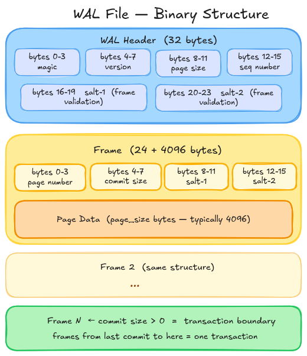
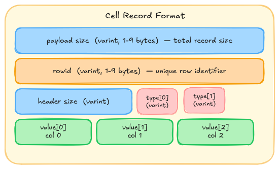

# DDD-44: SQLite Connector

# 1. Motivation

SQLite is the most widely deployed database engine in the world, embedded in virtually every mobile device, browser, IoT device, and desktop application. Despite this ubiquity, Debezium has no connector for it. Users who build local-first applications, edge computing pipelines, or offline-capable systems have no standard way to stream changes from SQLite into a broader event-driven architecture.


# 2. Background and Conceptual Context

To understand the decisions behind this connector, we need to look at how SQLite differs from traditional client-server databases. These differences directly shape how CDC can be implemented reliably.

## 2.1 The Embedded Nature
SQLite does not run as a background server process. It is a C library compiled directly into the host application. There is no network protocol, no daemon, and no logical replication slot for an external process to subscribe to. Debezium has to connect to the database file directly as an independent reader.

## 2.2 Write-Ahead Log (WAL) 
By default, SQLite uses a "Rollback Journal" where read operations block write operations (and vice-versa). This is fatal for a CDC connector, as Debezium’s continuous polling would lock the database and crash the host application.

Debezium requires the database to run in WAL mode (`PRAGMA journal_mode=WAL`). In WAL mode, SQLite uses MVCC. Writes go to a separate `data.db-wal` file while the original database file stays untouched. This lets Debezium read continuously without ever acquiring a write-lock, so readers and writers no longer block each other.

## 2.3 Physical vs. Logical Logging
The greatest challenge in building SQLite CDC is the nature of the WAL file itself.

- Logical WAL (e.g., PostgreSQL): Logs the exact row-level changes (e.g., "Table 'users', Row ID 5, Column 'name' changed from 'A' to 'B'").
- Physical WAL (SQLite): Logs raw memory states. SQLite writes changes as complete 4096-byte blocks of memory. The WAL essentially says: "Page 45 was modified; here are the new 4096 bytes for Page 45." 

When a single row is inserted, SQLite does not append just that row to the WAL. It takes the entire 4KB page that houses that row and appends the whole page as a new frame. The WAL file is a sequence of these frames. Each frame is a 24-byte header followed by one full database page of data. The file starts with a 32-byte WAL header that stores the page size and two salt values used to validate frames.



The frame header contains the page number (which database page this frame is a new version of) and a commit size field. A commit size of zero means the frame is part of an in-progress transaction. A non-zero value means this is the last frame of a committed transaction. Everything from the previous commit marker up to and including this frame forms one atomic unit. The connector only processes complete committed transactions, never partial ones.

> Notice how the frame header does not contain information about the table of the page. 
> This becomes one of the major decision factors in our architecture. 

## 2.4 SQLite Page Structure and Anonymity

To extract data from SQLite's physical WAL, we need to understand how SQLite structures its data via B-Trees. Every table in SQLite is a B-Tree made up of pages:

1. Root Pages: The entry point of the table.
2. Interior Pages: Navigational directories containing pointers to other pages.
3. Leaf Pages: The pages that hold the actual user data (rows/cells).

Let's look into the leaf page structure in detail. 


A leaf page contains a cell pointer array near the top which is a list of 2-byte offsets pointing to where each cell (row) starts within the page. Each cell in a page encodes one row using SQLite's record format. The following image gives a detailed structure of a cell.



The record header in a cell contains serial types. Serial types in the record header tell the decoder what type each column value is and how many bytes it occupies in the body. The decoder reads the header first to collect all serial types, then reads the body values in order. For example, serial type 1 means a 1-byte signed integer, serial type 7 means an 8-byte IEEE754 float, odd values ≥ 13 mean UTF-8 text with length (N-13)/2, and even values ≥ 12 mean a BLOB with length (N-12)/2. The decoder reads all serial types from the header first, then reads the body values in order using those sizes.

> The key thing to notice across all of these diagrams is that a page contains no information about which table it belongs to. SQLite B-Tree Leaf Pages carry zero relational metadata. A Leaf Page frame from the WAL (default page size is 4096 bytes since SQLite 3.12.0, configurable from 512 to 65536 bytes via `PRAGMA page_size`) has no table name, no root page ID, and no parent pointer in its header. It is completely anonymous. Because SQLite navigates strictly top-down, an external process cannot look at a WAL frame and know which table it belongs to without maintaining a live map of the entire database's B-Tree structure.


# 3. The Architecture
Now that we have understood the quirks of SQLite, let's see how we can solve these problems. Just like any connector, we will divide the complete architecture into a few important phases - 
1. Startup and Configuration
2. Snapshotting
3. Streaming
4. Schema Change Detection 
5. Offset management

Before we get into the startup and configuration, let's look into the Streaming phase, as it is a major deciding factor for rest of the architecture. 

## 3.1 Streaming

### 3.1.1 Creating the logical WAL (The Generator)

As discussed in Section 2.3, we cannot use the WAL file directly. The solution is to create a logical log table.

Instead of decoding physical memory frames, we make the SQLite engine write CDC events directly into an append-only table (`_debezium_cdc_log`). Each row records the operation type, timestamp, and before/after row states as JSON. Debezium then reads from this table using plain SQL, with no B-Tree decoding needed.

The question is how to populate this table automatically without requiring users to change their application code. The CDC payload needs to be generated by SQLite itself at the exact moment a write happens. We looked at two ways to do this: **SQL Triggers** and a **Native SQLite Extension**.

#### Approach A: SQLite Triggers
This approach relies on Debezium dynamically generating standard SQLite DDL triggers (AFTER INSERT, AFTER UPDATE, AFTER DELETE) for every monitored table.

- Mechanism: When the user’s application writes to a table, the SQLite engine automatically executes the attached trigger, which uses SQLite's built-in json_object() function to format the row data and insert it into the _debezium_cdc_log table.

**Pros:** 100% standard SQLite. It requires zero application code changes and is connection-independent. Every write is guaranteed to be captured regardless of the driver or connection pool configuration.

**Cons of this approach:** 
- SQLite does not support DDL triggers (triggers that fire on CREATE or ALTER TABLE). Because our CDC triggers are hardcoded SQL strings (e.g., json_object('id', NEW.id, 'name', NEW.name)), they are entirely blind to schema changes.
If a user executes `ALTER TABLE users ADD COLUMN age INT;`, the existing trigger will not capture the age column. Debezium must detect this change asynchronously by polling PRAGMA `schema_version`, dropping the old trigger, and rebuilding it. This introduces a critical **race condition**: any INSERT or UPDATE that occurs in the milliseconds between the `ALTER TABLE` execution and Debezium's polling cycle will be logged without the new column data.
- Every single DML operation (`INSERT`, `UPDATE`, `DELETE`) executed by the user's application forces the SQLite engine to perform additional, synchronous work within the same transaction. The database must parse the trigger logic, allocate memory to invoke the json_object() serialization functions for both the OLD and NEW states, and execute a secondary `INSERT` into the `_debezium_cdc_log` table's B-Tree. In high-throughput write scenarios, this "double-write" degrades the application's write latency.

#### Approach B: Native SQLite Extension
This approach uses a custom loadable C extension (`debezium_sqlite.so`) that registers a `sqlite3_preupdate_hook()` on the application’s connection. The hook fires inside the write pipeline before bytes are flushed to the B-Tree. It reads the column count and the OLD/NEW row states directly from memory, serialises them into JSON, and inserts into `_debezium_cdc_log` via the C API.

**Pros of this approach**
- No schema change race condition: the hook uses `sqlite3_preupdate_count()` to read the live column count at write time, not a hardcoded list. A newly added column is captured automatically from the very first write after the `ALTER TABLE`.
- Lower overhead: the hook bypasses the SQL parser and trigger compiler entirely. JSON is built from C pointers, which is much cheaper than running SQL trigger logic on every write.
- No schema pollution: no triggers are created, so `sqlite_schema` stays clean and ORMs or migration tools are not affected.

**Cons of this approach**
- Connection-specific: the hook only fires for writes on the connection that loaded the extension. In a connection pool, every connection must load the extension. If even one connection misses it, those writes are silently lost.
- Requires a code change: unlike traditional Debezium connectors, users must add `load_extension("debezium_sqlite.so")` to their application startup code.
- Platform binary: users need a compiled binary (`.so`, `.dylib`, or `.dll`) that matches their OS and architecture.

#### Conclusion: Architectural Decision (The Generator):
The Native SQLite Extension (`preupdate_hook`) is the chosen approach for v1. It eliminates the `ALTER TABLE` race condition entirely and keeps the user's schema clean. The SQL Trigger approach is not abandoned — it will be added as a configurable alternative (`generator.mode=triggers`) in a future version for users who cannot or do not want to distribute a platform-specific binary. The default will remain the extension.

### 3.1.2 Capturing Changes from the WAL (The Extractor)

Once the C extension writes CDC payloads to `_debezium_cdc_log`, Debezium needs to read them and emit `SourceRecord` objects.

SQLite has no logical replication stream like PostgreSQL's `pgoutput`, so we have to extract data from the physical WAL. We looked at three approaches, from low-level file tailing to plain SQL querying.

#### Approach A: Full B-Tree WAL Parsing
This approach bypasses the SQLite engine entirely. The connector acts as a direct file-system reader, continuously tailing the `data.db-wal` file.

**The Mechanics:**

1.  **The Anonymity Problem & Initial Mapping:** SQLite B-Tree pages are completely anonymous. A 4KB WAL frame does not contain a table name or a parent pointer in its header. To figure out which anonymous frames belong to our CDC log, the connector must first query `sqlite_schema` on startup to find the specific Root Page ID of the `_debezium_cdc_log` table.
2.  **Tree Traversal (Building the CDC Page Map):** Starting from that Root Page, the connector parses the B-Tree Interior Pages to navigate down the tree. It builds and maintains a live `HashSet<Integer>` containing only the specific Leaf Page IDs that currently hold our CDC data.
3.  **Frame Filtering:** As new 4096-byte WAL frames arrive, the connector reads the 24-byte frame header to extract the `page_id`. It performs an O(1) lookup against its in-memory `HashSet`. If the `page_id` is in the map, the frame is deterministically proven to be our CDC data. Otherwise, it is safely ignored.
4.  **Extraction:** Once the correct page is isolated, the connector parses the B-Tree Page Header and the Cell Pointer Array to locate the exact byte offsets of the rows. It then decodes SQLite Varints to extract the JSON payload.

**Pros:**

- **Zero Database Overhead:** It never executes a `SELECT` query, which means it never acquires a database read-lock and never blocks internal SQLite WAL Checkpoints.
- **No False Positives:** Because it relies on explicit B-Tree pointers, finding the correct page is 100% deterministic.

**Cons:**

- **Extreme Engineering Complexity:** This approach requires us to essentially rebuild SQLite's internal parsing engine from scratch in Java.
- **Transaction Ordering Race Conditions:** SQLite does not guarantee that Interior Pages (the map) are written to the WAL before newly allocated Leaf Pages (the data). Because of this, Debezium cannot process frames sequentially. It would have to build a "Two-Pass Transaction Buffer" in memory—waiting for a `Commit Size > 0` marker to safely update the tree structure before going back to extract the data frames.
- **Freelist Page-Recycling Risks:** If Debezium's Java map gets even slightly out of sync with SQLite's internal state, it becomes vulnerable to the "Freelist" bug. A tracked CDC Leaf Page might be emptied, sent to SQLite's Freelist, and recycled into an Interior Page for an entirely different table. Debezium would unknowingly try to parse B-Tree navigation pointers as JSON data, resulting in catastrophic `IndexOutOfBounds` crashes.
- **Overflow Page Assembly:** A single WAL frame is strictly 4096 bytes. If a CDC JSON payload is larger than this, SQLite cuts the payload off and adds a 4-byte pointer to an Overflow Page. The Java connector would have to manually recreate SQLite's overflow linked-list logic, buffering incomplete byte arrays in memory and pausing JSON parsing until the missing overflow frames appear later in the WAL stream.

#### Approach B: Unique Signature WAL Tailing
To avoid the extreme complexity of maintaining a live B-Tree map (Approach A), this approach identifies anonymous WAL frames using a byte-scanner combined with SQLite's native cell extraction.

**The Mechanics:**

1.  **The Unique Signature:** The data generator (Triggers or C-Extension) injects a 16-byte cryptographic UUID (like `__dbz_cdc_uuid__`) at the very beginning of every CDC JSON payload.
2.  **Linear Frame Scanning:** The Java connector continuously reads the `data.db-wal` file. Whenever a 4KB frame arrives, Debezium uses a fast string-matching algorithm (like Boyer-Moore) to scan the byte array for the 16-byte UUID, regardless of which table the frame belongs to.
3.  **Extraction:** If the signature is missing, the frame is instantly thrown away. If the signature is found, the connector knows it has a CDC Leaf Page. To avoid reading "ghost records" (deleted data left in unallocated memory), the scanner jumps to the B-Tree Page Header. It then loops through the active Cell Pointer Array to safely extract the active rows.
4.  **Verification Pipeline:** A user might accidentally insert the exact UUID into a normal table. To prevent this from causing false positives, the extracted payload must pass strict JSON schema validation and a sequential `RowID` High-Water Mark check before Debezium accepts it.

**Pros:**

- **Stateless Page Identification:** It treats every frame independently. There is no need to track complex B-Tree page splits, Root Pages, or Freelist page recycling.
- **Zero Database Overhead:** Because it reads files directly from the operating system, it never acquires database read-locks or blocks write operations.

**Cons:**

- **High CPU Usage (O(F) Time Complexity):** The time complexity is O(F), where F is the total number of frames written to the *entire* database. Because Debezium must byte-scan every single frame to see what is inside, a massive bulk insert on an unrelated table will force Debezium's CPU to spike as it scans thousands of irrelevant frames. This will inevitably cause replication lag.
- **Overflow Page Assembly:** If a CDC JSON payload is larger than the 4096-byte page limit, SQLite splits it. The UUID stays on the primary Leaf Page, but the rest of the JSON goes to an anonymous Overflow Page. Debezium would have to manually buffer the incomplete bytes in Java memory and track 4-byte overflow pointers to stitch the data back together.
- **Checkpoint Truncation Risks:** Debezium must perfectly track SQLite's internal WAL Salts to detect when the operating system truncates or rewrites the WAL file during a checkpoint. A slight delay in detecting this could lead to corrupted byte reads or permanent data loss.

#### Approach C: JDBC / SQLite Polling (The Chosen Architecture)

Instead of building a complex file-scanner in Java, this approach lets the SQLite engine do the heavy lifting. We simply treat the `_debezium_cdc_log` table like any normal database table and query it directly.

**The Mechanics:**

1. The Debezium connector connects to the database using standard JDBC.
2. It runs a fast query at regular intervals to fetch new changes in small batches: `SELECT * FROM _debezium_cdc_log WHERE change_id > ? ORDER BY change_id ASC LIMIT 1000;`
3. The `change_id` (an auto-incrementing number) is used to track Debezium's progress. This guarantees we never miss a record.

**Pros:**

- **Fast and Efficient:** Reading the WAL file directly forces Debezium to scan the entire database's traffic. JDBC Polling avoids this by using SQLite's built-in index to instantly jump to the newest `change_id`. Debezium only spends CPU power on actual CDC events, completely ignoring unrelated database traffic.
- **Less Complexity:** SQLite automatically manages all the messy file-system details (like split pages, recycled memory, and oversized rows). Debezium just receives clean, perfectly formatted text without needing to decode binary files in Java.
- **Proven by Turso:** When reviewing the source code for Turso (a major distributed SQLite database), we found that their CDC engine also completely avoids WAL parsing. They use this exact same SQL `SELECT` loop to extract their data.

**Trade-offs & Mitigations:**

- **WAL File Bloat:** In SQLite, an open read transaction stops the database from cleaning up the WAL file (a process called "checkpointing"). If Debezium reads data for too long, the WAL file can grow very large on the hard drive.
- *Solution:* We prevent this by keeping our queries extremely short. By using the `LIMIT` keyword to read in small batches, we pause often enough to let SQLite safely clean up the WAL file between polls.
- **Slight Database Overhead:** Because we are running actual SQL queries, it adds a very small amount of processing work to the SQLite database engine compared to reading the raw file from the operating system.


We have chosen Approach C (JDBC / SQL Polling) as the final extraction method for the Debezium SQLite Connector.

While reading the WAL file directly (Approaches A & B) sounds great because it promises "zero database overhead", it actually just moves a huge, unpredictable workload onto the Debezium Java process. 
Trying to rebuild SQLite's internal logic (like B-Tree parsing or byte-scanning) in Java is very risky. 
It makes the connector fragile, it could easily break if SQLite updates its internal file format, and it forces Debezium to waste time scanning every single database write.

By using JDBC Polling, we trade the idea of "zero database overhead" for rock-solid stability. This approach provides several major benefits:
- It guarantees events stay in the exact right order.
- It keeps Debezium fast, even when other tables in the database are extremely busy.
- It lets SQLite automatically handle large rows (overflow pages) and deleted data.

Finally, this approach uses the exact same reliable method already proven in production by the Turso database team.

### 3.1.3 Streaming Implementation

The streaming source is `SQLiteStreamingChangeEventSource`, which implements `StreamingChangeEventSource<SQLitePartition, SQLiteOffsetContext>`. Its `execute()` method runs a loop that keeps polling `_debezium_cdc_log` until the connector is stopped.

#### The Poll Loop

Each iteration of the loop runs one bounded query:

```sql
SELECT change_id, table_name, operation, old_row_data, new_row_data, committed_at
FROM _debezium_cdc_log
WHERE change_id > ?
ORDER BY change_id ASC
LIMIT <batch_size>
```

The `?` is the `change_id` from the current `SQLiteOffsetContext`. `batch_size` comes from `SQLiteConnectorConfig` and defaults to `1000`. After each batch, if no rows were returned, the loop sleeps for `poll.interval.ms` before trying again.

Keeping queries bounded is important for a reason specific to SQLite: an open read transaction blocks WAL checkpointing. A checkpoint is when SQLite copies committed WAL frames back into the main database file and resets the WAL. If Debezium holds a long read transaction, the WAL file keeps growing. Using `LIMIT` means each query opens and closes a short transaction, giving SQLite room to checkpoint between polls.

#### Processing Each Row

For each row returned, the source:

1. Deserialises `old_row_data` and `new_row_data` from JSON into the column structure held by `SQLiteDatabaseSchema`.
2. Creates a `SQLiteChangeRecordEmitter` for the row, passing it the operation (`c`, `u`, `d`) and the before/after values.
3. Calls `EventDispatcher.dispatchDataChangeEvent()`, which applies table filters, builds the Kafka Connect `SourceRecord`, and puts it on the `ChangeEventQueue`.
4. Updates the `SQLiteOffsetContext` with the current `change_id` and the `committed_at` timestamp.

The `EventDispatcher` handles schema lookups, topic naming, and envelope wrapping. The streaming source does not need to know about any of that.

#### Offset Updates

The offset is updated after each row is dispatched, not after each batch. This means that if the connector stops mid-batch, it will re-process only the rows after the last successfully dispatched `change_id`. Because `_debezium_cdc_log` rows are never deleted during streaming (deletion is covered in Section 3.5, Offset Management), re-reading rows from a partially processed batch is always safe.

#### Schema Changes During Streaming

If `SQLiteStreamingChangeEventSource` encounters a row for a table that is not in `SQLiteDatabaseSchema`, it means a new table was created or an `ALTER TABLE` happened while streaming was running. In that case, the source calls `SQLiteDatabaseSchema.refresh()` before dispatching the row. Schema change detection is covered in full in Section 3.4.

## 3.2 The Startup and Configuration.

On startup, the connector needs to do three things before it can start producing events: enforce the prerequisites on the SQLite file, read the current schema, and find out where it left off. This section walks through how that works.

### 3.2.1 Who Does What

Two actors are involved at startup: the user's application and the Debezium connector task. They run in separate processes and each has a distinct job.

**The user's application** must load the C extension on its own database connection. It has to do this before any writes happen. The `sqlite3_preupdate_hook` that the extension installs is connection-scoped: it only fires for writes on the connection that loaded the extension. Debezium cannot do this step because it connects to the database file separately, via JDBC.

```python
# Must be done in the user's application before the connector starts
conn = sqlite3.connect("myapp.db")
conn.enable_load_extension(True)
conn.load_extension("debezium_sqlite")
```

**The Debezium connector task** takes care of everything else on its own JDBC connection:

1. **WAL Mode Enforcement**: Run `PRAGMA journal_mode=WAL`. Without WAL mode, Debezium's polling `SELECT` takes a shared read-lock and blocks all application writes. WAL mode uses MVCC, so readers and writers no longer block each other. The pragma is safe to run on every startup even if WAL mode is already set.

2. **Log Table Initialization**: Run `CREATE TABLE IF NOT EXISTS _debezium_cdc_log`. The C extension's preupdate hook writes change events into this table, so it must exist before any writes happen. The `IF NOT EXISTS` clause makes this safe to run on every restart.

3. **Schema Loading**: Read all user tables from `sqlite_master` and build the in-memory `SQLiteDatabaseSchema`. This gives the connector the column names and type affinities it needs to build Kafka Connect schemas.

4. **Offset Loading**: Call `getPreviousOffsets()` to get the last committed `change_id` from Kafka Connect's offset store. If there is no stored offset (first run), the coordinator will kick off a snapshot.

5. **Coordinator Start**: Start the `ChangeEventSourceCoordinator`, which hands off to either `SQLiteSnapshotChangeEventSource` or `SQLiteStreamingChangeEventSource`.

### 3.2.2 The `_debezium_cdc_log` Table

This table is the handoff point between the C extension and the connector. The extension writes to it; the connector reads from it over JDBC. Users must not modify its schema.

```sql
CREATE TABLE IF NOT EXISTS _debezium_cdc_log (
    change_id    INTEGER PRIMARY KEY AUTOINCREMENT,
    table_name   TEXT    NOT NULL,
    operation    TEXT    NOT NULL,   -- 'c' (create), 'u' (update), 'd' (delete)
    old_row_data TEXT,               -- JSON; NULL for INSERT
    new_row_data TEXT,               -- JSON; NULL for DELETE
    committed_at INTEGER NOT NULL    -- Unix epoch milliseconds
);
```

`change_id` is this connector's equivalent of a Log Sequence Number. It is the only value stored as the offset. After each batch, the connector saves the highest `change_id` it processed. On the next poll, or after a restart, it picks up with `WHERE change_id > <last_committed_id>`.

### 3.2.3 Configuration: `SQLiteConnectorConfig`

`SQLiteConnectorConfig` extends `RelationalDatabaseConnectorConfig`. Two base classes force this: `RelationalSnapshotChangeEventSource` and `RelationalDatabaseSchema` both require a `RelationalDatabaseConnectorConfig` in their constructors. Extending it also gives us table and column filtering for free.

The downside is inheriting HOSTNAME, PORT, USER, and PASSWORD fields that SQLite does not use. These should be made optional and skipped during connection validation. The SQLite-specific connection is handled entirely through `database.file.path`.

The SQLite-specific fields are:

| Property | Description |
|---|---|
| `database.file.path` | Absolute path to the `.db` file. Required. |
| `database.server.name` | Logical name for this connector instance. Used as the Kafka topic prefix and the partition key in the offset store. |
| `table.include.list` | Comma-separated regex patterns for tables to capture. Internal tables (`sqlite_*`, `_debezium_*`) are always excluded. |
| `table.exclude.list` | Comma-separated regex patterns for tables to skip. |
| `poll.interval.ms` | How long the streaming loop sleeps between polls. Default: `500` ms. |
| `batch.size` | Max rows to fetch from `_debezium_cdc_log` per poll. Default: `1000`. Keeping this small limits how long each read transaction stays open, which prevents the WAL file from growing too large between checkpoints. |

All fields go into a `Field.Set ALL_FIELDS`, which Kafka Connect uses for validation and documentation.

### 3.2.4 Connector Lifecycle: `SQLiteConnector`

`SQLiteConnector` extends `BaseSourceConnector`. It is the entry point that Kafka Connect loads. Its `start()` method just saves the raw config map; no database connection is opened yet. `taskClass()` returns `SQLiteConnectorTask.class`.

SQLite is a single-file, single-writer database, so `taskConfigs()` rejects any request for more than one task:

```java
if (maxTasks > 1) {
    throw new IllegalArgumentException("The SQLite connector supports only a single task.");
}
```

`validateConnection()` opens a short-lived JDBC connection to check that the file exists and can be read. If the database is not in WAL mode at this point, it logs a warning but does not fail; the task will fix it on startup.

### 3.2.5 Task Lifecycle: `SQLiteConnectorTask`

`SQLiteConnectorTask` extends `BaseSourceTask<SQLitePartition, SQLiteOffsetContext>`. `preStart()` builds the `SQLiteConnectorConfig` and `SQLiteTaskContext`. `start()` runs through the full startup sequence from Section 3.2.1.

One important detail in the WAL enforcement step: the connector checks what mode the `PRAGMA` actually returned, not just whether it ran without throwing:

```java
String mode = connection.queryAndMap("PRAGMA journal_mode=WAL", rs -> rs.getString(1));
if (!"wal".equalsIgnoreCase(mode)) {
    throw new DebeziumException("Failed to set WAL mode. Another connection may hold an exclusive lock.");
}
```

This catches the case where another process holds an exclusive lock on the file. In that situation the pragma silently does nothing, and without this check the connector would start in the wrong journal mode.

`doStop()` closes the JDBC connection, schema, and event queue. `doPoll()` drains the `ChangeEventQueue` and returns the records as `SourceRecord` objects.

### 3.2.6 Partition: `SQLitePartition`

Kafka Connect uses partitions to namespace offsets. Since one SQLite file always maps to one connector instance, the partition just holds the logical server name:

```
{ "server": "<database.server.name>" }
```

`SQLitePartition.Provider` returns a set with this single partition. This is the same approach MySQL and SQL Server use in single-database mode.

### 3.2.7 Offset Context: `SQLiteOffsetContext` and `SQLiteSourceInfo`

`SQLiteOffsetContext` extends `CommonOffsetContext<SQLiteSourceInfo>` and tracks the `change_id` of the last row sent to Kafka. `getOffset()` puts this into the map that Kafka Connect persists:

```
{ "change_id": 8421 }
```

On restart, the inner `Loader` class reads this map back and rebuilds the context. If no entry exists in Kafka Connect's offset store for this partition, `OffsetReader` inserts `null` directly into the offsets map without calling `Loader.load()` at all. The null `previousOffset` then reaches `determineSnapshotOffset()`, which passes it to the `Snapshotter` — `InitialSnapshotter.shouldSnapshotData()` returns true when `previousOffset == null`, triggering a snapshot.

`SQLiteSourceInfo` extends `BaseSourceInfo` and fills in the `source` field of each Kafka message. It holds the database filename (just the basename, not the full path), the table name, the `change_id`, and the event timestamp from `committed_at`.

### 3.2.8 Schema: `SQLiteDatabaseSchema`

`SQLiteDatabaseSchema` extends `RelationalDatabaseSchema`. SQLite has no built-in DDL history, so we do not go up the `HistorizedRelationalDatabaseSchema` branch. Extending `RelationalDatabaseSchema` gives us the `Tables` registry, column and table filtering, and `schemaFor(TableId)` for free, so we only need to fill in schema loading from `sqlite_master`. It reads the current schema on startup and refreshes it when a schema change is detected (see Section 3.4).

The main method is `refresh(connection)`, which runs:

```sql
SELECT name, sql FROM sqlite_master
WHERE type = 'table'
  AND name NOT LIKE 'sqlite_%'
  AND name NOT LIKE '_debezium_%'
```

The `sql` column holds the original `CREATE TABLE` statement that SQLite stores verbatim. A lightweight `SQLiteDdlParser` reads this and builds a `Table` object for each monitored table. During this step, SQLite's [type affinity](https://www.sqlite.org/datatype3.html) rules are used to map SQLite column types to Debezium's `Column` model.

### 3.2.9 Change Event Source Factory: `SQLiteChangeEventSourceFactory`

`SQLiteChangeEventSourceFactory` implements `ChangeEventSourceFactory<SQLitePartition, SQLiteOffsetContext>`. It holds all shared resources and creates the right change source on demand.

- `getSnapshotChangeEventSource()` returns `SQLiteSnapshotChangeEventSource`. Covered in Section 3.3.
- `getStreamingChangeEventSource()` returns `SQLiteStreamingChangeEventSource`, which polls `_debezium_cdc_log` in a loop. Covered in Section 3.1.
- `getIncrementalSnapshotChangeEventSource()` returns `Optional.empty()` for now. Because SQLite only allows one writer at a time, incremental snapshots are lower priority than they are for distributed databases.

## 3.3 Snapshotting

A snapshot is a one-time full read of all monitored tables. It gives the connector a baseline of the current data before it starts streaming changes from `_debezium_cdc_log`. Without it, a first-run consumer would only see changes that happen after the connector starts, with no knowledge of the existing rows.

### 3.3.1 When Does a Snapshot Happen?

This is controlled by `snapshot.mode`, following the same pattern as other Debezium connectors:

| Mode | Behavior |
|---|---|
| `initial` (default) | Snapshot only on first run, when there is no stored offset. |
| `always` | Snapshot on every connector start, even if an offset exists. |
| `never` | Skip the snapshot entirely. Streaming starts from the current tail of `_debezium_cdc_log`. |
| `initial_only` | Snapshot once, then stop without transitioning to streaming. |

### 3.3.2 The Consistency Problem

The main challenge is making sure the snapshot and streaming hand off cleanly. While the connector is doing its full table scan, the user's application keeps running. The C extension keeps writing new rows to `_debezium_cdc_log`. When the snapshot finishes, streaming must pick up from exactly the right point: no missed events, no duplicates.

The handoff works by recording a high-water mark before any snapshot reads begin.

1. Before opening the snapshot transaction, the connector runs `SELECT MAX(change_id) FROM _debezium_cdc_log` and saves the result as `snapshotHighWatermark`.
2. It then opens a `BEGIN DEFERRED TRANSACTION`. In WAL mode, this gives a consistent read view of the database as it existed at that moment.
3. It reads all rows from all monitored tables inside this transaction and emits them as `r` (read) records.
4. Once the snapshot is done, the offset is set to `snapshotHighWatermark`.
5. Streaming then picks up with `WHERE change_id > snapshotHighWatermark`.

Any writes that came in during the snapshot will have a `change_id` greater than `snapshotHighWatermark`, so streaming will catch them. The snapshot rows and the streaming rows together give a complete, non-overlapping picture of the database.

### 3.3.3 Locking in WAL Mode

Most connectors need explicit locking during a snapshot to prevent dirty reads (MySQL takes a global read lock; SQL Server sets the transaction isolation level to SNAPSHOT or REPEATABLE READ). SQLite in WAL mode does not need this.

In WAL mode, the moment a `BEGIN DEFERRED TRANSACTION` opens, SQLite assigns it a read snapshot that is pinned to the current WAL frame. All reads inside that transaction see a consistent view of the database no matter how many writes the user's app makes on other connections. Writers never block this read transaction, and this read transaction never blocks writers.

So `lockTablesForSchemaSnapshot()` is effectively a no-op for the SQLite connector. WAL mode's MVCC gives us consistency for free.

### 3.3.4 `SQLiteSnapshotChangeEventSource`

`SQLiteSnapshotChangeEventSource` extends `RelationalSnapshotChangeEventSource<SQLitePartition, SQLiteOffsetContext>`. This base class handles the full snapshot lifecycle: table enumeration, connection management, chunked reading, and event emission. We only override the parts that are SQLite-specific.

**Note on config hierarchy:** Two base classes force `SQLiteConnectorConfig` to extend `RelationalDatabaseConnectorConfig` rather than `CommonConnectorConfig` as described in Section 3.2.3. First, `RelationalSnapshotChangeEventSource` takes a `RelationalDatabaseConnectorConfig` in its constructor. Second, `RelationalDatabaseSchema` (which `SQLiteDatabaseSchema` extends) also requires a `RelationalDatabaseConnectorConfig` in its constructor. Both constraints point to the same resolution. The trade-off is inheriting HOSTNAME, PORT, USER, and PASSWORD fields that SQLite does not use. These fields should be made optional and excluded from connection validation. In return, we get the full relational snapshot infrastructure and table/column filtering built in.

The methods we override are:

**`prepare()`**: Creates a `SQLiteSnapshotContext`, which is a thin wrapper around `RelationalSnapshotContext` with no SQLite-specific fields needed at this stage.

**`determineSnapshotOffset()`**: This is the most important override. It queries `SELECT MAX(change_id) FROM _debezium_cdc_log` and stores the result as `snapshotHighWatermark` in the offset context. This is the point streaming will resume from after the snapshot completes.

**`lockTablesForSchemaSnapshot()`**: No-op. WAL mode MVCC handles consistency without locks.

**`getAllTableIds()`**: Queries `sqlite_master` for all user tables, applying the `table.include.list` / `table.exclude.list` filters.

**`readTableStructure()`**: Calls `SQLiteDatabaseSchema.refresh(connection)` to load column definitions from `sqlite_master`.

**`getSnapshotSelect()`**: Returns `SELECT * FROM <table_name>`. There are no snapshot-specific query hints needed for SQLite.

**`completed()`**: Marks the snapshot as finished in the offset context. The next call to `getOffset()` will no longer include `snapshot: true` in the source info.

### 3.3.5 What Gets Emitted

Each row from each monitored table is emitted as a `SourceRecord` with `operation = r`. The `source` struct in each record includes `snapshot: true`. The very last row of the very last table gets `snapshot: last` instead, which signals downstream consumers that the snapshot is complete.

The order of tables during the snapshot follows the order returned by `getAllTableIds()`, which is the order they appear in `sqlite_master`. This is deterministic but not alphabetical.

## 3.4 Schema Change Detection

SQLite has no DDL event stream. There are no DDL triggers, no logical replication messages for `CREATE TABLE` or `ALTER TABLE`, and no schema history table. When the user changes their database schema, Debezium gets no notification. This section describes how the connector detects changes and how it stays consistent during the window between a DDL statement and the connector's detection of it.

### 3.4.1 Detection via `PRAGMA schema_version`

SQLite maintains an integer counter called `schema_version` in the database header. It increments by one every time any DDL statement is executed: `CREATE TABLE`, `DROP TABLE`, `ALTER TABLE`, `CREATE INDEX`, and so on. It is the only reliable cross-connection signal that the schema has changed.

The connector stores the `schema_version` value it read during startup (or during the last refresh). At the start of every poll iteration in `SQLiteStreamingChangeEventSource`, it runs:

```sql
PRAGMA schema_version
```

If the returned value is higher than the stored value, a schema change has happened since the last poll. The connector then calls `SQLiteDatabaseSchema.refresh()` before processing the current batch.

### 3.4.2 What `schema_version` Does Not Tell Us

`PRAGMA schema_version` only tells us that something changed. It does not say what changed, which table was affected, or what kind of DDL was run. To find out, we diff the current `sqlite_master` against the schema we have in memory.

The diff compares three things:

- **Tables added**: a table name appears in `sqlite_master` but not in the cached schema. The connector adds it to `SQLiteDatabaseSchema` and starts capturing events for it if it matches `table.include.list`.
- **Tables dropped**: a table name is in the cached schema but no longer in `sqlite_master`. The connector removes it and stops emitting events for it.
- **Columns changed**: a table exists in both, but its `CREATE TABLE` DDL in `sqlite_master` has changed. The connector re-parses the DDL and updates the column list.

Table renames are a special case. SQLite's `ALTER TABLE ... RENAME TO` changes the name in `sqlite_master` but does not update the `rootpage` entry. The diff will see the old name disappear and a new name appear. The connector treats this as a drop + create. If the renamed table matches `table.include.list`, it starts capturing from it fresh. Events that arrived on `_debezium_cdc_log` under the old name before the rename are still processed correctly because `table_name` in the log reflects the name at write time.

### 3.4.3 Streaming Consistency During a Schema Change

The biggest risk with polling-based schema detection is a race condition. Consider this sequence:

1. User runs `ALTER TABLE orders ADD COLUMN discount REAL`.
2. The C extension detects the column count mismatch in its cache and re-fetches `PRAGMA table_info(orders)`. From this point, all new rows written to `_debezium_cdc_log` for `orders` will include the `discount` column in their JSON.
3. Debezium's next poll runs before it has detected the `schema_version` change.
4. Debezium reads a row from `_debezium_cdc_log` that includes `discount` in `new_row_data`, but its cached schema for `orders` does not have that column.

To handle this, `SQLiteStreamingChangeEventSource` runs a secondary check on every row: it compares the number of keys in the `new_row_data` JSON against the number of columns in `SQLiteDatabaseSchema` for that table. If they do not match, it refreshes the schema before dispatching the row. This means the connector self-corrects at the row level, not just at the poll boundary.

This works without data loss because the JSON written to `_debezium_cdc_log` is always correct at write time. The extension serialises columns using the live schema it re-fetched from `PRAGMA table_info`. Debezium is catching up to a fact that has already been recorded correctly.

This is also the fundamental reason the SQL trigger approach was rejected. A trigger body is a hardcoded string like `json_object('id', NEW.id, 'name', NEW.name)`. After `ALTER TABLE orders ADD COLUMN discount REAL`, the existing trigger has no knowledge of `discount`. Any write that arrives before Debezium detects the change and rebuilds the trigger will produce a `_debezium_cdc_log` row with `discount` simply missing from the JSON. That data is gone permanently. The C extension avoids this because `sqlite3_preupdate_count(db)` reads the actual column count of the row at write time, not a count baked into a static string.

### 3.4.4 Minimum SQLite Version

The connector requires SQLite **3.35.0** or later. This is a hard requirement. Version 3.35 introduced `ALTER TABLE DROP COLUMN`, which is the last major `ALTER TABLE` capability the connector needs to handle correctly. Versions before this are not supported and the connector will refuse to start if the SQLite version reported by the JDBC driver is below this threshold.

### 3.4.5 Schema Change Events

When `SQLiteDatabaseSchema.refresh()` detects a change, the connector emits a `SchemaChangeEvent` for each affected table via the `EventDispatcher`. This follows the same pattern as other Debezium connectors and allows downstream consumers (like the schema registry or Debezium UI) to track DDL history even though SQLite itself does not.

The DDL string in the event comes directly from `sqlite_master.sql`, which SQLite stores verbatim. For `DROP TABLE`, SQLite removes the row from `sqlite_master`, so the connector generates a synthetic `DROP TABLE <name>` string for the event.

## 3.5 Offset Management

The offset for this connector is a single number: the `change_id` of the last row successfully committed to Kafka. This section covers how that number is persisted, how the connector uses it on restart, and how old rows in `_debezium_cdc_log` are cleaned up once they are no longer needed.

### 3.5.1 What the Offset Represents

The offset stored in Kafka Connect's offset store is:

```
{ "change_id": N }
```

This means: every row in `_debezium_cdc_log` with `change_id <= N` has been produced to Kafka and the offset has been committed. On the next start, the connector will resume with `WHERE change_id > N`.

It is important to understand the difference between dispatching a record and committing an offset. `SQLiteStreamingChangeEventSource` dispatches records to the `ChangeEventQueue`. Kafka Connect reads from that queue and writes records to Kafka. Only after Kafka Connect acknowledges a batch does it call back into Debezium to commit the offset. The offset therefore always lags slightly behind what has been dispatched. This is the standard Debezium at-least-once delivery model: on restart, the connector may re-process a small number of records that were dispatched but not yet offset-committed before the stop.

### 3.5.2 Log Compaction: Deleting Old Rows

`_debezium_cdc_log` is an append-only table. Without cleanup, it grows without bound. The connector deletes rows that are no longer needed after each offset commit using:

```sql
DELETE FROM _debezium_cdc_log WHERE change_id <= ?
```

The `?` is the last committed `change_id` from the offset store, not the last dispatched one. This is the safety boundary: we only delete rows whose `change_id` has been durably committed to Kafka Connect's offset store. Deleting rows that are only in the `ChangeEventQueue` but not yet offset-committed would cause permanent data loss on a crash.

The deletion runs in its own short transaction after the offset callback fires. It does not hold open the same transaction as the poll query, so it does not interfere with WAL checkpointing.

### 3.5.3 Compaction Frequency

Running a `DELETE` after every single offset commit would be wasteful. Instead, the connector batches deletions using a configurable threshold: `log.compaction.threshold` (default: `10000`). The connector tracks how many rows have been committed since the last deletion. When that count crosses the threshold, it runs the `DELETE`. This means at most `10000` already-processed rows sit in `_debezium_cdc_log` at any time, which is a small and bounded overhead.

### 3.5.4 Restart and Resume

On restart, `SQLiteOffsetContext.Loader` reads the committed `change_id` from Kafka Connect's offset store. The streaming source then issues its first poll with `WHERE change_id > <committed_id>`. Any rows that were dispatched but not offset-committed before the stop will be re-processed and re-produced to Kafka. Consumers must be idempotent or use Kafka's exactly-once consumer semantics to handle these duplicates.

If no offset exists in the store (first run, or the offset was manually deleted), the `Loader` returns `null`. `BaseSourceTask` interprets this as a signal to run a snapshot before streaming begins, as described in Section 3.3.

### 3.5.5 Offset Store and Partition Key

Kafka Connect stores offsets keyed by partition. The partition for this connector is `{ "server": "<database.server.name>" }`. This means the offset is tied to the logical name, not the physical file path. If the database file is moved or renamed, the logical name stays the same and the connector resumes correctly as long as `database.file.path` is updated in the config. If the logical name is changed, the connector treats it as a new connector instance and will snapshot from scratch.

