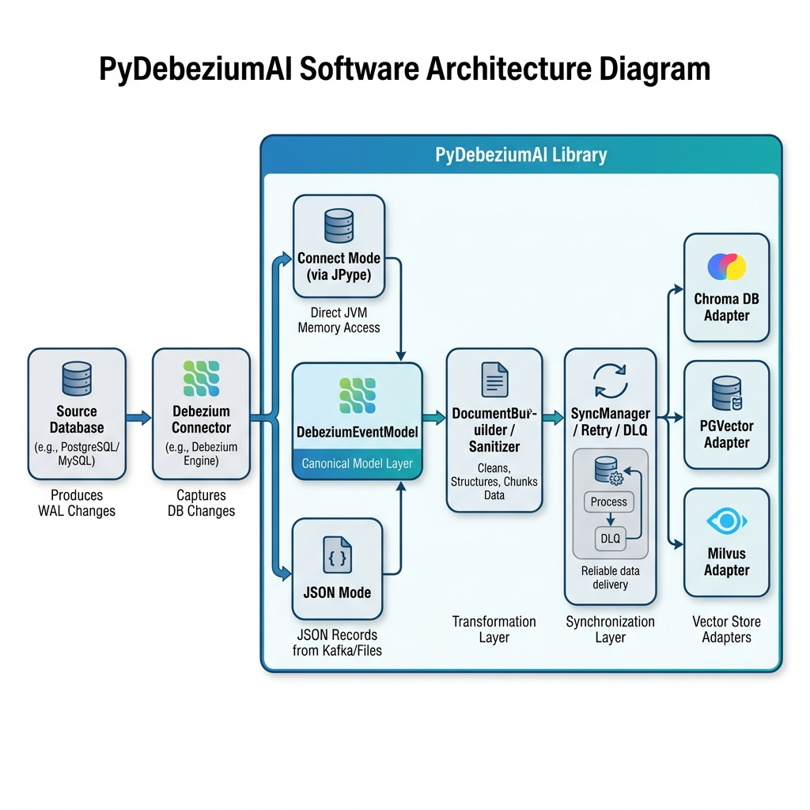

# DDD-50: PyDebeziumAI - Real-Time CDC Integration for LangChain & LangGraph

This document describes the design and architecture of **PyDebeziumAI**, a Python library that enables real-time Retrieval-Augmented Generation (RAG) synchronization by streaming database change events captured by Debezium into vector stores.

## Motivation

Modern Generative AI and Large Language Model (LLM) applications rely on Retrieval-Augmented Generation (RAG) to ground model responses in dynamic domain data. Relational databases store the source of truth for these applications, but traditional methods for syncing database state to vector search indexes have significant limitations:

1. **Periodic Batch Refreshes / Polling**: Querying the database periodically is slow, resource-intensive, and introduces sync lag. During the lag window, the LLM retrieves stale context, leading to outputs based on outdated data. Furthermore, sync lag can lead to hallucinations when there is a complete lack of data; for example, if a new product is added to the database but the change is not yet propagated to the vector store, an AI agent asked about the new product may hallucinate a response due to the missing information.
2. **Double Writes**: Forcing the application layer to write to both the database and the vector store is error-prone, violates transactional safety, and makes recovery from partial failures difficult.
3. **Complex CDC Configurations**: Existing CDC-to-AI pipelines require heavy infrastructure (e.g., Kafka, Debezium Server, Kafka Connect, Spark/Flink, and vector ingestion jobs), which is complex to manage for local developers or lighter Python microservices.

**PyDebeziumAI** addresses these limitations by providing a first-class Python library that integrates directly with Debezium (via `pydbzengine` embedded mode or JSON-over-broker inputs). It listens to WAL changes in real time and automatically updates vector database embeddings with sub-second latency.

*Note on Branding and Scope*: Although named `PyDebeziumAI` to highlight its first-class integration with Debezium CDC and AI-driven retrieval pipelines, the core orchestration layer (`LiveContext`) remains independent of any specific LLM framework, consuming generic database change events and outputting standardized LangChain Document interfaces that plug into any downstream ecosystem.

---

## Goals

- **Real-Time Vector Ingestion**: Propagate database INSERT, UPDATE, and DELETE operations to vector search stores, achieving sub-second latency from database WAL write to vector embedding index update under nominal load.
- **Connect-Mode Performance**: Support direct memory-level JVM bridge consumption of Kafka Connect `SourceRecord` objects via JPype to eliminate JSON serialization overhead.
- **Idempotency and Consistency**: Guarantee eventual consistency between the source database and the vector store. Ensure that vector indexes converge to the exact state of the source database, even under restarts, duplicate events, or schema updates.
- **Pluggable Vector Store Adapters**: Provide out-of-the-box adapters for **Chroma**, **PGVector**, and **Milvus**, while exposing a clean, simple adapter interface for additional backends.
- **Type-Safe Transformation**: Offer rich decoding for database logical types (e.g., VariableScaleDecimal, timestamp zones, geometry types) and sanitize metadata values to conform to strict vector store metadata schemas.
- **Developer-Friendly API**: Expose a simple `LiveContext` facade that integrates directly with LangChain and LangGraph retrieval pipelines.

---

## Non-goals

The following capabilities are intentionally out of scope for this design:
- **Distributed Multi-Node Synchronization**: PyDebeziumAI is designed to run as a single-node Python library or worker. Distributed clustering, replication, and multi-node coordination of vector sync processes are not handled.
- **Kafka Topic/Broker Management**: Creating, partitioning, or managing Kafka topics and schemas at the broker level is assumed to be handled externally or by Debezium's configuration.
- **Automatic Embedding Model Training**: The library handles embedding generation via existing clients (e.g., LangChain embeddings) but does not train, fine-tune, or manage the lifecycle of embedding models.
- **Cross-Database Transactional Guarantees**: Vector store writes are not coordinated with source database transactions via two-phase commit (2PC). Sync guarantees focus on eventual consistency.
- **Full Stream-Processing Semantics**: Advanced real-time stream aggregation, event windowing, or joins are left to dedicated stream processing engines like Apache Flink or Spark.

---

## Requirements

- **Runtime**: Python 3.10+ (tested on Python 3.10 and 3.11)
- **JVM Environment**: Java 17+ JRE/JDK runtime (required for embedded Debezium Engine via JPype)
- **Upstream Dependencies**: Debezium Engine 3.0+ core JARs
- **Vector Stores**: Chroma 0.4+, PGVector 0.2+, or Milvus 2.3+ (supporting deterministic, idempotent document upsert operations)
- **Integration Layer**: LangChain core package dependencies (providing `Document` models and `Embeddings` interfaces)

---

## Proposed Changes

We introduce the `pydebeziumai` Python library, structured into 5 cohesive layers.

### 1. Architectural Overview

The diagram below outlines the flow of database WAL change events through the library layers into the target vector stores.



---

### 2. Detailed Component Design

#### 2.1 Ingestion Layer & Logical Type Conversion
The ingestion layer decodes connector-specific envelopes into a unified Python structure.

- **Connect Mode**: Employs `SourceRecordExtractor` to inspect Java `SourceRecord` schema types directly over JPype. 
- **JSON Mode**: Employs `ConnectMessageExtractor`. It includes a schema decoder (`_decode_json_numerics`) to detect base64-encoded `NUMERIC` / `VariableScaleDecimal` fields in JSON payloads, decoding them back to Python floats based on the schema's scale attributes.

#### 2.2 Canonical Model Contract
We enforce a strict Pydantic contract to represent Debezium events internally. This isolates differences between database connectors (e.g., PostgreSQL vs MySQL).

```python
class DebeziumPayloadModel(BaseModel):
    before: Optional[dict[str, Any]] = None
    after: Optional[dict[str, Any]] = None
    op: str  # "c" (create), "u" (update), "d" (delete), "r" (read/snapshot)
    ts_ms: Optional[int] = None

    @property
    def current_row(self) -> Optional[dict[str, Any]]:
        return self.after if self.op in ("c", "u", "r") else self.before

    @property
    def is_delete(self) -> bool:
        return self.op == "d"


class DebeziumEventModel(BaseModel):
    destination: str
    partition: Optional[int] = None
    key: Optional[str] = None
    payload: DebeziumPayloadModel
    event_schema: Optional[DebeziumSchemaModel] = Field(default=None, alias="schema")
```

#### 2.3 Transformation Layer
Converts a canonical database row event into a LangChain `Document`.
- **Identity Strategy (`IdStrategy`)**: Dictates document ID creation. The default `TablePkIdStrategy` generates `<table>:<primary_key>`, ensuring updates cleanly overwrite existing documents instead of duplicating them.
- **Projection Policy (`ProjectionPolicy`)**: Configures which fields enter the search index text (`page_content`) vs filtering attributes (`metadata`). Supports formatting templates: `"{name} - {description} costs ${price}"`.
- **Metadata Sanitizer**: Coerces non-standard data types into vector-compatible primitives:
  - `Decimal` ──► `float`
  - `bytes` / `bytearray` ──► `hex-encoded string`
  - `datetime` / `date` / `time` ──► `ISO 8601 string`
  - `dict` / `list` ──► `string representation`

#### 2.4 Synchronization Layer (`SyncManager`)
Executes vector store commands according to CDC transaction operation types:
- **`c` (Create) and `r` (Snapshot)**: Performs an `adapter.upsert()`.
- **`u` (Update)**: Calls `adapter.delete()` on the document ID, followed by `adapter.upsert()`. This sequential delete-then-upsert guarantees that if columns are updated to NULL or metadata fields are removed, the stale fields are completely purged from the vector index rather than merged/retained (which is the default merge behavior of upsert/update APIs in many vector databases like Chroma or Milvus).
- **`d` (Delete)**: Performs a `adapter.delete()`. If `soft_delete=True`, it marks the metadata field `_is_deleted` as `True` instead of a hard removal.
- **Retry Mechanics**: When operations fail due to connection dropouts, `SyncManager` invokes a retry policy configured with exponential backoff and randomized jitter. Events failing after maximum retries are redirected to a thread-safe `DeadLetterQueue` (DLQ).

#### 2.5 Adapter Layer
Abstracts vector store vendor-specific details under a unified interface:

```python
class VectorStoreAdapter(ABC):
    @abstractmethod
    def upsert(self, document: Document) -> None:
        """Add or replace a document in the vector store."""
        pass

    @abstractmethod
    def delete(self, doc_id: str) -> None:
        """Remove a document from the vector store."""
        pass

    @abstractmethod
    def as_retriever(self, **kwargs: Any) -> BaseRetriever:
        """Expose a LangChain-compatible retriever."""
        pass
```

We ship official implementations for **Chroma**, **PGVector**, and **Milvus**.

#### 2.6 Threading Model and Lifecycle

- **Embedded Mode (Connect/JPype)**: The embedded Debezium Engine executes in the background JVM process using Java worker threads. When WAL modifications occur, the engine triggers the registered Java listener, calling back into the Python runtime through the JPype bridge.
- **JSON Ingestion Mode**: The network listener operates in an asynchronous background Python thread. Incoming messages are queued in a thread-safe `queue.Queue` before processing to prevent locking the main application thread.
- **Backpressure**: The `SyncManager` utilizes consumer-producer queue configurations to buffer records. If the vector store becomes slow or experiences write outages, events accumulate in the queue up to a configured threshold before applying backpressure on the Debezium engine stream.

#### 2.7 Synchronization Semantics and Guarantees

- **Eventual Consistency**: The system guarantees that the vector store eventually mirrors the source database. Operations are processed sequentially, and ordering guarantees are preserved per primary-key stream and connector partition to ensure that updates to the same logical row are never applied out-of-order.
- **Out-of-Order Handling**: Deduplication and synchronization are anchored on the unique primary key mapping strategy (`TablePkIdStrategy`). Because updates are idempotent upserts on the vector store, out-of-order deliveries resolve to the latest database state.
- **Atomic Updates**: To ensure that changing a database row does not leave dangling metadata keys or duplicate embeddings in the vector index, updates execute a sequential delete-then-upsert pipeline on the vector store adapter.
- **Delete-then-Upsert Failure Recovery**: If the subsequent upsert operation fails after a delete succeeds, the document temporarily disappears from the vector database index. To close this consistency gap, the failed event is redirected to the `DeadLetterQueue` (DLQ), retaining the message sequence context. To prevent out-of-order execution (e.g., a replay worker applying a retry event *after* a newer update has already been applied by the main worker), processing of subsequent update events for the affected primary key is blocked/paused while that key is in the retry/DLQ cycle. Replay workers retry the upsert sequentially, restoring consistency without race conditions or permanent data loss.
- **Soft Delete Behavior**: Configured through the LiveContext parameter `soft_delete`. If enabled (`soft_delete=True`), Debezium delete operations (`op: "d"`) translate to a metadata update setting `_is_deleted: true` rather than a hard removal.

---

## Configuration Examples

The library is instantiated and managed via the `LiveContext` facade. You can either configure the vector store adapter and embeddings manually, or pass parameters to `LiveContext` to build them automatically.

### Example A: Manual Configuration
```python
from pydebeziumai import LiveContext
from pydebeziumai.adapters import ChromaAdapter
from langchain_openai import OpenAIEmbeddings

# 1. Manually configure the target Vector Store Adapter
vector_store = ChromaAdapter(
    collection_name="products_embeddings",
    embeddings=OpenAIEmbeddings(),
    persist_directory="./chroma_db"
)

# 2. Create the real-time LiveContext facade
live_context = LiveContext(
    debezium_config={
        "name": "postgresql-connector",
        "connector.class": "io.debezium.connector.postgresql.PostgresConnector",
        "database.hostname": "localhost",
        "database.port": "5432",
        "database.user": "postgres",
        "database.password": "postgres",
        "database.dbname": "inventory",
        "topic.prefix": "inventory_prefix",
        "table.include.list": "public.products",
    },
    vector_store=vector_store,
    soft_delete=False,       # Hard delete from vector store on DB delete
    ingestion_mode="connect"  # "connect" (JPype JVM) or "json" (network broker)
)

# 3. Start synchronization in the background
live_context.start()

# 4. Access the synchronized retriever directly
retriever = live_context.as_retriever(search_kwargs={"k": 3})
```

### Example B: Auto-Instantiation
```python
from pydebeziumai import LiveContext

# LiveContext instantiates the vector store and embedding models automatically
live_context = LiveContext(
    debezium_config={
        "name": "postgresql-connector",
        "connector.class": "io.debezium.connector.postgresql.PostgresConnector",
        "database.hostname": "localhost",
        "database.port": "5432",
        "database.user": "postgres",
        "database.password": "postgres",
        "database.dbname": "inventory",
        "topic.prefix": "inventory_prefix",
        "table.include.list": "public.products",
    },
    vector_store="chroma",
    embedding_model="openai",         # Automatically initializes OpenAIEmbeddings
    persist_directory="./chroma_db",  # Forwarded to ChromaAdapter constructor
    collection_name="products_embeddings",
    soft_delete=False,
    ingestion_mode="json"
)

live_context.start()
retriever = live_context.as_retriever(search_kwargs={"k": 3})
```

---

## Risks and Mitigations

- **JVM Lifecycle Stability inside Python**: JPype loads the Java Virtual Machine into the Python process address space. Uncaught Java exceptions or improper JVM resource disposal can cause segmentation faults or crash the host Python script.
  - *Mitigation*: Run internal JVM lifecycle calls within guarded try-except wrappers and offer a pure-Python JSON-based network handler (`ConnectMessageExtractor`) to completely isolate the Python application from JVM runtimes.
- **Vector Re-indexing Bottlenecks**: Heavy batch database operations (e.g., millions of writes during migrations) can flood the vector store with updates, causing API timeouts and indexing lag.
  - *Mitigation*: Buffer incoming updates in memory and push them in batches. Configurable retry strategies with exponential backoff and randomized jitter prevent cascading failures.
- **Heterogeneous Schema Evolution**: Different source databases (Postgres, MySQL, Oracle) emit varying schemas when columns are added, removed, or changed, which can break strict vector store document mappings.
  - *Mitigation*: The `Canonical Model Layer` dynamically extracts metadata keys from schema definitions, sanitizing and typing values on the fly while providing schema migration warnings without failing.

---

## Rejected Alternatives

### 1. Kafka Connect Cluster + Standalone Python Consumer
- **Why Rejected**: Requires setting up and operating an external Kafka cluster, Kafka Connect servers, schema registries, and a separate consumer microservice. This increases infrastructure complexity significantly, making it unsuitable for local developer workflows, rapid prototyping, or lightweight serverless workloads.

### 2. Polling-Based Synchronization (Periodic SQL scan)
- **Why Rejected**: Polling introduces significant synchronization lag (stale context), places heavy load on the source database, and misses intermediate updates (e.g., a row created and deleted within the polling window). It fails to satisfy real-time sub-second latency requirements.

### 3. Application double-writes (Writing to DB and Vector DB in code)
- **Why Rejected**: Creates split-brain scenarios and data drift. If a network blip occurs after writing to the relational database but before updating the vector index, the system becomes permanently out of sync. It lacks the transaction logs' guarantee of CDC.

---

## Implementation Steps

1. **Setup Development Base & Tools**: Configure packaging via `pyproject.toml` and write `tools/setup_jars.py` to automate downloading Debezium 3.0+ engine JARs.
2. **Establish Ingestion & Extraction Layer**: Build `SourceRecordExtractor` (Connect/JPype) and `ConnectMessageExtractor` (JSON) to convert raw events into unified Python datastructures.
3. **Build Canonical Contracts**: Write validated Pydantic models for the schema/payload envelope and configure numeric decoding helpers.
4. **Implement Document Builder & Sanitizers**: Set up `ProjectionPolicy` and `TablePkIdStrategy` alongside the metadata sanitizer.
5. **Create SyncManager & Adapters**: Code the transaction handlers, the DLQ, and write backend adapters for Chroma, PGVector, and Milvus.
6. **Integrate LangChain & LangGraph Facades**: Implement `LiveContext` to coordinate threads and expose retriever pipelines.
7. **Write Tests & Examples**: Develop unit and integration tests (including E2E dockerized tests), and build the local RAG chatbot demonstration app.

---

## Backward Compatibility

PyDebeziumAI is a new library, meaning there are no breaking public API changes. However:
- Legacy imports from early experimental versions are protected using a deprecation shim in `models/source_record.py` that delegates to `models/connect_message.py`.
- Ingestion mode defaults to `json` for ease of local setup, while allowing `connect` for high-throughput JVM environments.

---

## Testing

A multi-layered validation strategy guarantees robustness:
- **Unit Tests**: Test case coverage for logical type conversion, ID generation strategies, metadata sanitization, and `SyncManager` retry schedules.
- **Integration Tests**: End-to-end vector pipeline checks using an ephemeral Chroma client.
- **E2E Live Suite**: Dockerized PostgreSQL database running alongside Python's Debezium engine to verify real-time update propagation.

---

## Future Work

- **Additional Vector Adapters**: Add official out-of-the-box adapters for Redis Vector, Weaviate, Pinecone, and Qdrant.
- **Native Async Synchronization**: Introduce async adapter endpoints (`aupsert`, `adelete`) in vector store adapters to enable non-blocking synchronization under Python frameworks like FastAPI or LangGraph.
- **Distributed Ingestion Workers**: Support distributed stream partitions where multiple consumer instances process event streams concurrently, coordinated via Redis or equivalent coordination systems.
- **Dynamic Schema Migration Tooling**: Automatically adjust metadata mappings and database representations dynamically in target vector indexes when source DDL operations occur.
- **Batching & Embedding Optimizations**: Accumulate updates and process embedding requests in batches before sending to external model providers (e.g., OpenAI, Hugging Face) to optimize rate-limiting and operational costs.

---

## Open Questions

- **Transactional Vector Sync**: Should we explore vector databases that offer read-your-own-writes or transactional boundaries (e.g., PGVector inside PostgreSQL transactional sessions)?
- **Async Client Adapters**: Should `VectorStoreAdapter` expose async APIs (`aupsert`, `adelete`) to integrate with async frameworks like FastAPI or LangGraph's async streaming engines?
- **Automatic Schema Mapping Customization**: Should we allow custom JSON-Schema-to-LangChain-Metadata mappings instead of the default projection policies?
