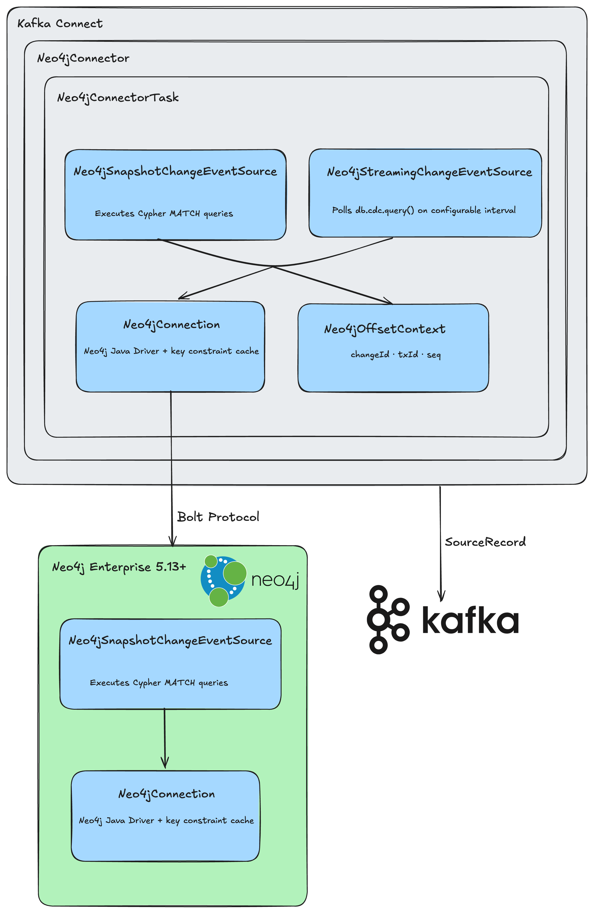
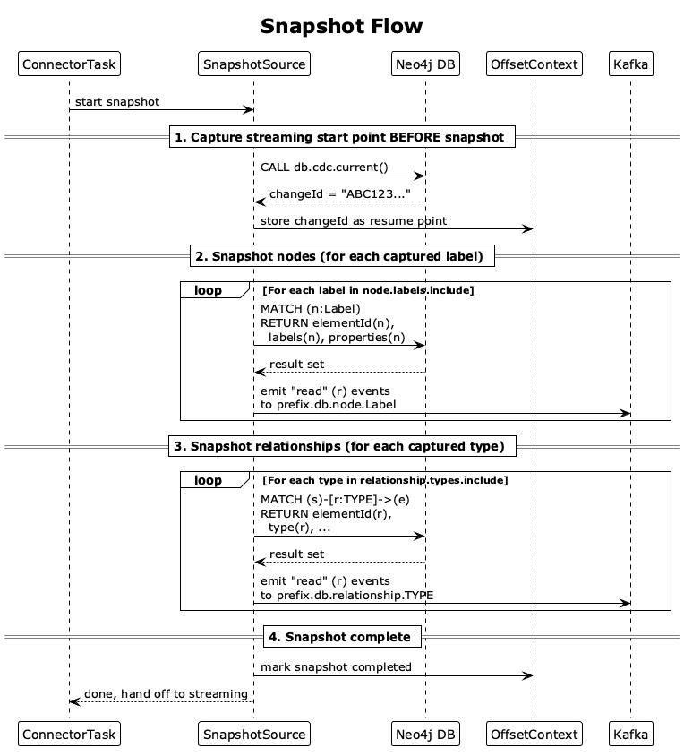
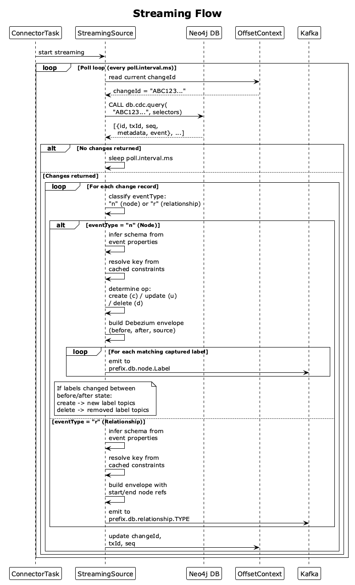

# DDD-52: Debezium source connector for Neo4j

## Motivation

Neo4j is the leading graph database, widely adopted for use cases such as knowledge graphs, fraud detection, identity and access management, and recommendation engines.
Organizations using Neo4j increasingly need to propagate graph changes to downstream systems (data warehouses, search indexes, event-driven microservices) in real time.

Today there is no Debezium connector for any graph database.
While Neo4j provides its own [Kafka connector](https://neo4j.com/docs/kafka/current/), it is tightly coupled to the Neo4j ecosystem and does not integrate with the Debezium platform, its transformation pipeline, or its operational tooling (metrics, snapshot management, offset tracking, schema history).
Starting with version 5.13, Neo4j introduced a built-in [Change Data Capture (CDC) API](https://neo4j.com/docs/cdc/current/) based on enriched transaction logs.
The CDC API exposes three Cypher procedures ([`db.cdc.earliest`, `db.cdc.current`, `db.cdc.query`](https://neo4j.com/docs/cdc/current/procedures/)) that return a cursor-based stream of committed changes with before/after state, making it a solid foundation for a CDC source connector.

Building a Debezium connector for Neo4j should:

* Bring graph databases into the Debezium ecosystem for the first time.
* Allow users to leverage the full Debezium feature set: single message transformations, multiple sink destinations, centralized offset management, and unified monitoring.
* Provide a consistent CDC experience for organizations running Neo4j alongside relational databases already captured by Debezium.

## Goals

* Provide a Debezium source connector that captures node and relationship changes from Neo4j Enterprise Edition (self-managed and Aura) databases using the built-in CDC API.
* Support initial snapshots via Cypher queries for captured labels and relationship types.
* Map Neo4j graph entities (nodes and relationships) to Kafka topics following Debezium conventions.
* Produce change events with before/after state that conform to the Debezium envelope structure.
* Provide offset tracking that survives connector restarts without data loss.
* Support filtering by node labels, relationship types, and properties.

## Out-of-scope

* Backward compatibility with Neo4j Community Edition or versions prior to 5.13: the connector requires the [CDC API](https://neo4j.com/docs/cdc/current/), which is only available in Neo4j Enterprise Edition 5.13+. Community Edition does not expose transaction log enrichment or the `db.cdc.*` procedures. Earlier Enterprise versions do not have a built-in CDC capability. Alternative approaches (APOC triggers, timestamp-based polling, direct transaction log parsing) were considered but rejected because they cannot guarantee at-least-once delivery, do not provide before/after state, and would require a fundamentally different connector architecture.

* Sink connector: this DDD covers only the **source connector** (capturing changes *from* Neo4j). Writing changes *into* Neo4j (sink connector) is a separate problem involving Cypher write queries, merge strategies, and graph-specific conflict resolution. Neo4j already provides a [sink connector in its own Kafka connector](https://neo4j.com/docs/kafka/current/sink/).

* Replication of schema/index changes: Neo4j's CDC API [does not include schema or index changes in its change events](https://neo4j.com/docs/cdc/current/) captures only node and relationship data mutations. There is no mechanism in the CDC output to detect `CREATE INDEX`, `CREATE CONSTRAINT`, or other DDL operations. Supporting schema replication would require a separate polling mechanism against system procedures (e.g., `SHOW INDEXES`, `SHOW CONSTRAINTS`), adding complexity for a use case that is uncommon in CDC scenarios.


## Requirements

* Neo4j Enterprise Edition 5.13+ or Neo4j Aura Business Critical / Virtual Dedicated Cloud.
* CDC must be enabled on the target database ([`txLogEnrichment`](https://neo4j.com/docs/cdc/current/get-started/self-managed/) set to `DIFF` or `FULL` via [`ALTER DATABASE`](https://neo4j.com/docs/operations-manual/current/database-administration/standard-databases/alter-databases/)).
* The connector user must have [`EXECUTE BOOSTED PROCEDURE db.cdc.query`](https://neo4j.com/docs/cdc/current/get-started/self-managed/) privileges and database access.
* [Transaction log retention](https://neo4j.com/docs/operations-manual/current/database-internals/transaction-logs/) must be configured (`db.tx_log.rotation.retention_policy`) to cover at least the maximum expected connector downtime.

## Proposed changes

### Change capture mechanism

The connector will use Neo4j's built-in [CDC API](https://neo4j.com/docs/cdc/current/), which derives change data from enriched transaction logs. 
The three core procedures are ([reference](https://neo4j.com/docs/cdc/current/procedures/)):

| Procedure | Purpose |
|:---|:---|
| [`db.cdc.current()`](https://neo4j.com/docs/cdc/current/procedures/) | Returns the change identifier for the last committed transaction (exclusive). |
| [`db.cdc.earliest()`](https://neo4j.com/docs/cdc/current/procedures/) | Returns the change identifier for the earliest available change in the transaction log. |
| [`db.cdc.query(from, selectors)`](https://neo4j.com/docs/cdc/current/procedures/) | Returns all changes after the given change identifier, optionally filtered by [selectors](https://neo4j.com/docs/cdc/current/procedures/selectors/). |

The connector will poll `db.cdc.query` on a configurable interval, passing the last processed change identifier as the `from` parameter and the configured selectors as filters.
Each call returns a set of change records containing `id`, `txId`, `seq`, `metadata`, and `event` fields ([output schema](https://neo4j.com/docs/cdc/current/procedures/output-schema/)).

#### Why polling

The Neo4j CDC API is **poll-only** by design. 
There is no way to subscribe, register a callback, or open a persistent stream that pushes events to the client. 
The only mechanism to read changes is to call `db.cdc.query()` and get back whatever has accumulated since the last change identifier.

This is different from other databases that offer push-based change streams (e.g., PostgreSQL logical replication pushes WAL records, MongoDB change streams block until new changes arrive). 
Neo4j's own [Kafka connector](https://neo4j.com/docs/kafka/current/) also uses polling for the same reason, as does the [Neo4j GraphQL subscriptions](https://neo4j.com/docs/graphql/current/subscriptions/customize-cdc/) layer (which polls every 1 second by default).

Polling is therefore not a design choice but a constraint of the CDC API. 
The `poll.interval.ms` configuration property lets users tune the trade-off between latency (lower interval = faster detection of changes) and database load (higher interval = fewer queries to Neo4j).

#### txLogEnrichment modes

The connector will support both [`DIFF` and `FULL` enrichment modes](https://neo4j.com/docs/cdc/current/get-started/self-managed/):

* **DIFF**: Captures only the delta (additions, updates, removals). More storage-efficient ([~50% increase](https://neo4j.com/docs/cdc/current/get-started/self-managed/) in transaction log volume). The `before` state in change events will contain only the changed properties.
* **FULL**: Records complete before/after copies of each entity ([~75% increase](https://neo4j.com/docs/cdc/current/get-started/self-managed/)). The `before` state will contain all properties of the entity, regardless of which changed.

The connector will auto-detect the active mode from the `captureMode` field in change event metadata ([output schema](https://neo4j.com/docs/cdc/current/procedures/output-schema/)) and adapt its event structure accordingly.
The connector documentation will recommend `DIFF` mode as the default for most use cases due to its lower storage overhead.

### Topic naming and routing

Graph entities will be mapped to Kafka topics following the convention:

```
<topic.prefix>.<database>.<entity_type>.<label_or_type>
```

Where:
* `<topic.prefix>` is the connector's logical name (standard Debezium `topic.prefix` property).
* `<database>` is the Neo4j database name.
* `<entity_type>` is either `node` or `relationship`.
* `<label_or_type>` is the node label or relationship type name.

Examples:
* `neo4j-server.mydb.node.Person`
* `neo4j-server.mydb.relationship.ACTED_IN`

#### Multi-label nodes

Nodes in Neo4j can have [multiple labels](https://neo4j.com/docs/getting-started/appendix/graphdb-concepts/) (e.g., `[:Person:Actor]`).
A change event for a multi-label node will be emitted to **all topics** matching the node's labels.
If a node has labels `[Person, Actor]` and both labels are captured, the change event will appear in both `<prefix>.<db>.node.Person` and `<prefix>.<db>.node.Actor`.

Each emitted copy is an identical event; consumers can deduplicate using the `elementId` field in the event value if needed.

If label addition or removal is detected (the set of labels changes between `before` and `after` state), the connector will:
* Emit a **create** event to topics for newly added labels.
* Emit a **delete** event to topics for removed labels.
* Emit an **update** event to topics for labels that remain.

#### Multi-label alternatives considered

| Alternative | Description | Why rejected |
|:---|:---|:---|
| **Primary label only** | Use the first label alphabetically or a user-configured "primary label" per node. Each event is emitted to exactly one topic. | Avoids duplication but requires arbitrary ordering decisions or additional user configuration. A consumer subscribing to `node.Actor` would miss changes to nodes that happen to have `Person` as their primary label, even though the node is an `Actor`. This breaks the intuitive contract that a topic for a label contains all changes relevant to that label. |
| **Composite label topic** | Create a combined topic name from sorted labels, e.g., `node.Actor_Person`. Each event is emitted once. | Avoids duplication and is deterministic, but causes topic proliferation: a model with N labels can produce up to 2^N topic combinations. A consumer interested in all `Person` changes would need to subscribe to every combination that includes `Person` (`Person`, `Actor_Person`, `Director_Person`, `Actor_Director_Person`, ...), making client-side subscription management impractical. |

**Chosen: Emit to all matching topics** : a node with labels `[Person, Actor]` emits to both `node.Person` and `node.Actor`. This guarantees that subscribing to a label topic gives a complete view of all changes relevant to that label, without requiring knowledge of other labels in the model. 
The trade-off is duplication, but each copy is identical and carries the `elementId`, making consumer-side deduplication straightforward when needed.

### Change event structure

Change events will follow the standard Debezium envelope format with `before`, `after`, `source`, `op`, and `ts_ms` fields.

#### Event key

Every Kafka message has a **key** and a **value**. 
In Debezium, the key identifies *which entity* changed (e.g., which row, which node), and the value describes *what* changed (the before/after state).
All Debezium connectors follow the same convention: each captured entity type (table, collection, or in our case label/type) has **one fixed key schema** that does not change between events.
When the database provides no uniqueness guarantee (no primary key in relational connectors, no key constraint in Neo4j), the event key is `null`.

The key schema for each label or relationship type is resolved **once** at startup, when `Neo4jConnection` queries `SHOW KEY CONSTRAINTS` and caches the result in memory for the connector's lifetime.

The resolution process works as follows:

1. The connector queries Neo4j for all defined key constraints:

    ```cypher
    SHOW KEY CONSTRAINTS
    ```

    This returns a result set like ([reference](https://neo4j.com/docs/cypher-manual/current/constraints/syntax/)):

    | name | type | entityType | labelsOrTypes | properties |
    |:---|:---|:---|:---|:---|
    | `person_key` | `NODE_KEY` | `NODE` | `["Person"]` | `["name", "surname"]` |
    | `acted_in_key` | `RELATIONSHIP_KEY` | `RELATIONSHIP` | `["ACTED_IN"]` | `["registerId"]` |

2. The connector filters for constraints matching the label or relationship type being processed.

3. **If a matching key constraint is found**, its properties become the event key fields. For example, `Person` nodes with a `(name, surname) IS NODE KEY` constraint produce:

    ```json
    {
      "schema": {
        "type": "struct",
        "name": "neo4j-server.mydb.node.Person.Key",
        "fields": [
          {"field": "name", "type": "string", "optional": false},
          {"field": "surname", "type": "string", "optional": false}
        ]
      },
      "payload": {"name": "Kevin", "surname": "Bacon"}
    }
    ```

4. **If no matching key constraint is found**, the event key is **`null`** (both schema and payload), consistent with how other Debezium connectors handle tables without a primary key.
   This means events for labels/types without key constraints cannot be compacted and will be distributed across partitions by Kafka's default partitioner.

5. **`message.key.properties` override.** To handle the no-key-constraint case, the connector will support a `message.key.properties` configuration property.
   This is the Neo4j-specific equivalent of `message.key.columns` used by relational Debezium connectors and renamed because Neo4j has **properties**, not columns.

    ```properties
    message.key.properties=node.Person:name,surname;relationship.ACTED_IN:registerId
    ```

When configured, the specified properties are used as event key fields regardless of whether a key constraint exists.
Note that unlike key constraints, this configuration does **not** guarantee uniqueness at the database level: the user is responsible for ensuring the chosen properties are unique. 
Using non-unique properties as keys can lead to incorrect compaction.

The key constraint approach is preferred because key constraints are the only mechanism by which Neo4j **guarantees uniqueness** for a set of properties.

#### Key strategy alternatives considered

| Alternative | Description | Why rejected |
|:---|:---|:---|
| **Always elementId** | Always use Neo4j's `elementId` as the event key, regardless of whether key constraints exist. | Simpler implementation with no constraint introspection needed. However, [elementIds are not guaranteed stable outside a single transaction](https://neo4j.com/docs/cdc/current/procedures/elementids-key-properties/) and can change after backup/restore or database migration. This makes topic compaction unreliable (the same logical entity may appear under different keys over time) and prevents consumers from using keys for semantic deduplication or entity correlation across systems. Also diverges from the standard Debezium pattern where the key is based on database-level uniqueness guarantees. |
| **elementId as fallback** | Use key constraints when available, fall back to `elementId` when no constraint exists. | Provides a key for every event, enabling compaction everywhere. However, this creates two fundamentally different key semantics under the same schema: stable business keys (from constraints) vs. unstable internal IDs (from elementId). Consumers cannot know which they're getting without inspecting the schema. Other Debezium connectors use `null` for the no-PK case rather than falling back to an internal ID, so this would be an inconsistency. The `message.key.properties` override is a cleaner escape hatch. |

**Chosen: Key constraints, null when absent, `message.key.properties` as override.** This follows the standard Debezium pattern: the event key is derived from the database's uniqueness guarantees (key constraints), `null` when no such guarantee exists, and `message.key.properties` as the user escape hatch (Neo4j-specific equivalent of `message.key.columns` used by relational connectors). Zero-configuration for users who follow Neo4j best practices of defining key constraints.

#### Value schema: node events

The value schema is the same regardless of whether a key constraint exists, the key resolution only affects the event key, not the value.
When a key constraint exists, the event key contains the constraint properties (e.g., `{"name": "Kevin", "surname": "Bacon"}`).
When no key constraint exists, the event key is `null` (see [Event key](#event-key)).

```json
{
  "before": {
    "elementId": "4:...:55135",
    "labels": ["Person", "Actor"],
    "properties": {
      "name": "Kevin",
      "surname": "Bacon",
      "born": 1958
    }
  },
  "after": {
    "elementId": "4:...:55135",
    "labels": ["Person", "Actor"],
    "properties": {
      "name": "Kevin",
      "surname": "Bacon",
      "born": 1958,
      "active": true
    }
  },
  "source": {
    "version": "3.x",
    "connector": "neo4j",
    "name": "neo4j-server",
    "ts_ms": 1700000000000,
    "db": "mydb",
    "txId": 42,
    "seq": 0,
    "changeId": "A3V16ZaLlUmnipHLFkWrlA0...",
    "captureMode": "DIFF"
  },
  "op": "u",
  "ts_ms": 1700000000123
}
```

#### Value schema : relationship events

Relationship events include the start and end node references:

```json
{
  "before": null,
  "after": {
    "elementId": "5:...:1001",
    "type": "ACTED_IN",
    "start": {
      "elementId": "4:...:55135",
      "labels": ["Person"],
      "keys": {"name": "Kevin", "surname": "Bacon"}
    },
    "end": {
      "elementId": "4:...:72001",
      "labels": ["Movie"],
      "keys": {"title": "Apollo 13"}
    },
    "properties": {
      "role": "Jack Swigert"
    }
  },
  "source": { "..." : "..." },
  "op": "c",
  "ts_ms": 1700000000456
}
```

Start and end node references include `labels` and `keys` (when [key constraints](https://neo4j.com/docs/cdc/current/procedures/elementids-key-properties/) exist on the endpoint nodes) so that consumers can correlate relationships with their endpoint node events using stable business keys.
The `elementId` is also included because the [Neo4j CDC API always provides it](https://neo4j.com/docs/cdc/current/procedures/output-schema/) in relationship change events. 
It serves as a supplementary correlation reference, especially when endpoint nodes have no key constraints defined.
Note that `elementId` here is **not used as an event key** (see [Event key](#event-key)) because, as mentioned before, it can change after backup/restore or database migration
It is purely informational metadata within the event value.

### Neo4j type mapping

[Neo4j property types](https://neo4j.com/docs/cypher-manual/current/values-and-types/property-structural-constructed/) will be mapped to Kafka Connect schema types.
See also the [Neo4j Java Driver type mapping](https://neo4j.com/docs/java-manual/current/data-types/) for how types are represented in the driver:

| Neo4j Type | Kafka Connect Type | Notes                              |
|:---|:---|:-----------------------------------|
| `Boolean` | `BOOLEAN` |                                    |
| `Integer` | `INT64` | Neo4j integers are 64-bit          |
| `Float` | `FLOAT64` |                                    |
| `String` | `STRING` |                                    |
| `Date` | `io.debezium.time.Date` | Days since epoch                   |
| `LocalTime` | `io.debezium.time.MicroTime` |                                    |
| `Time` | `io.debezium.time.ZonedTime` |                                    |
| `LocalDateTime` | `io.debezium.time.MicroTimestamp` |                                    |
| `DateTime` | `io.debezium.time.ZonedTimestamp` |                                    |
| `Duration` | `STRING` (ISO-8601) | No direct Kafka Connect equivalent |
| `Point` | `io.debezium.data.geometry.Point` | Spatial type                       |
| `List` | `ARRAY` | Element type inferred              |
| `Map` | `STRING` (JSON) | Serialized as JSON string ***      |
| `ByteArray` | `BYTES` |                                    |

*** Kafka Connect does have a `MAP` schema type, but it requires homogeneous key and value types (e.g., `MAP<STRING, STRING>`). 
Neo4j maps can have mixed value types (e.g., `{name: "Alice", age: 30, active: true}` contains `STRING`, `INTEGER`, and `BOOLEAN` values in the same map), so the Kafka Connect `MAP` type does not fit. 
Serializing to a JSON string preserves the full structure and mixed types at the cost of losing schema-level type information. 
Consumers must parse the JSON string to access individual fields.

### Schema handling

In relational databases, the schema is fixed and known upfront: every row in a table has the same columns with the same types.
Neo4j is fundamentally different. 
It is [schema-optional](https://neo4j.com/docs/getting-started/appendix/graphdb-concepts/): two nodes with the same label `Person` can have completely different sets of properties:

```cypher
CREATE (:Person {name: "Alice", age: 30})
CREATE (:Person {name: "Bob", email: "bob@example.com", active: true})
```

#### Per-event schema (no global schema, no schema manager)

The connector follows the same approach as the Debezium MongoDB connector: each event is **self-describing** and carries a schema that reflects only the properties present in that specific event.
There is no attempt to build or maintain a "global" schema across events for the same label.

For example, given the two `Person` nodes above:

- The event for `Alice` carries a schema with fields `{name: STRING, age: INT64}`.
- The event for `Bob` carries a schema with fields `{name: STRING, email: STRING, active: BOOLEAN}`.

Each event describes only itself and there is no merged schema with all four fields.

This means:
- The connector does **not** need to track which properties have been seen before.
- No in-memory property or type cache is needed.
- No schema evolution logic is needed in the connector.
- No dedicated schema manager component is needed.
- On restart, there is nothing to rebuild. Each event is independent.

The only schema-related information the connector caches is the **key constraint info** per label/type, resolved once at startup via `SHOW KEY CONSTRAINTS` (see [Event key](#event-key)). 
This is stored in `Neo4jConnection` as a simple `Map<String, List<String>>` mapping each label/type to its key properties. 
It determines how the event key is built and does not change during the connector's lifetime.

#### Type resolution

**How Neo4j handles types.** Neo4j is dynamically typed by default: each property value carries its type at runtime, and nothing prevents storing `age: 30` (Integer) on one node and `age: "thirty"` (String) on another node with the same label. The database does not flag or notify when a property's type varies across nodes.

Neo4j Enterprise provides [property type constraints](https://neo4j.com/docs/cypher-manual/current/schema/constraints/create-constraints/) to enforce a specific type at write time:

```cypher
CREATE CONSTRAINT person_age_type FOR (p:Person) REQUIRE p.age IS :: INTEGER
```

With this constraint, any write that sets `age` to a non-Integer value will fail at the database level, so the connector would never see mixed types for that property. 
Neo4j also supports [closed dynamic union types](https://neo4j.com/docs/cypher-manual/current/schema/constraints/create-constraints/) for migration scenarios (e.g., `REQUIRE p.id IS :: INTEGER | STRING`).

However, property type constraints are optional and many Neo4j deployments do not use them.

**How the connector resolves types.** The [Neo4j Java Driver](https://neo4j.com/docs/java-manual/current/data-types/) exposes property values as typed Java objects (`Long`, `String`, `Boolean`, `LocalDate`, etc.) through the `Value` interface. 
For each event, the connector inspects the Java type of each property value and maps it to a Kafka Connect schema type using the [Neo4j type mapping](#neo4j-type-mapping) table (e.g., `Long` -> `INT64`, `String` -> `STRING`, `Boolean` -> `BOOLEAN`).

No types are cached. 
If the same property has different types across events (e.g., `age: 30` on one node, `age: "thirty"` on another), each event will carry the correct type for its own values.

#### Schema registry considerations

When using a schema registry (Confluent, Apicurio), the serializer (Avro, Protobuf, JSON Schema) automatically registers new schema versions as events are produced. 
If two events for the same label have different sets of properties or different types for the same property, the serializer registers separate schema versions.

Whether this succeeds depends on the schema registry's compatibility mode (e.g., `BACKWARD`, `FORWARD`, `FULL`). 
The connector does not manage this but mentions it in documentation so ut is the responsibility of the schema registry and the user's compatibility settings.

For deployments where frequent schema changes cause issues, users should consider:
- Defining [property type constraints](https://neo4j.com/docs/cypher-manual/current/schema/constraints/create-constraints/) in Neo4j to ensure consistent types.
- Using a lenient compatibility mode (e.g., `NONE` or `FORWARD`) in the schema registry.

#### No schema history topic

Unlike relational Debezium connectors (MySQL, SQL Server, Oracle) that use a `schema.history.internal.kafka.topic` to persist DDL history, the Neo4j connector does **not** use a schema history topic. 
This is consistent with how the Debezium MongoDB connector works, which is also schema-free.

The reasons are:
- Neo4j has no DDL in the CDC stream (no `ALTER TABLE` equivalent to track).
- The schema is inferred from each event's data, not from database metadata.
- Each event is self-describing. There is no state to persist or rebuild on restart.

### Offset management

Every Debezium connector stores an **offset** that tracks its position in the source database's change stream. The offset fields vary by connector because each database provides different position identifiers. For example, MySQL uses binlog file + position, PostgreSQL uses the WAL LSN, and MongoDB uses a change stream resume token.

The Neo4j connector's offset contains a single field:

```json
{
  "changeId": "A3V16ZaLlUmnipHLFkWrlA0AAAAAAAAABQAAAAAAAAAA"
}
```

* `changeId`: The Neo4j CDC change identifier of the last successfully processed change event. This is the opaque string returned by the CDC API that identifies a specific point in the transaction log. It is passed as the `from` parameter in the next `db.cdc.query` call. Equivalent in role to MySQL's binlog position or MongoDB's resume token.

#### Expired change identifier

If the stored `changeId` is no longer available (transaction log has been pruned), the connector will fail with an informative error, giving the user the option to reset offsets and perform a new snapshot.

### Snapshot

The snapshot is controlled by the `snapshot.mode` configuration property:

| Mode | Behavior |
|:---|:---|
| `initial` (default) | Run the snapshot first, then start streaming CDC changes. |
| `never` | Skip the snapshot, start streaming CDC changes immediately. Useful when the consumer only cares about new changes. |
| `initial_only` | Run the snapshot and stop. No streaming phase. Useful for one-time data exports. |

The snapshot process follows these steps:

**Step 1: Save the current CDC position.**
Before reading any data, the connector calls `db.cdc.current()` to get the change identifier of the last committed transaction.
This identifier marks the point in the CDC stream where the snapshot "started".
The connector saves it so that after the snapshot is done, streaming can resume from this exact point without missing any changes.

Key constraints have already been resolved and cached during connector initialization (see [Event key](#event-key)).

**Step 2: Read all nodes for each captured label.**
For each label in the `node.label.include.list` configuration (or all labels if not configured), the connector runs a Cypher query to read all existing nodes (using Cypher [`elementId()`](https://neo4j.com/docs/cypher-manual/current/functions/scalar/), [`labels()`](https://neo4j.com/docs/cypher-manual/current/functions/scalar/), and [`properties()`](https://neo4j.com/docs/cypher-manual/current/functions/scalar/) functions):

```cypher
MATCH (n:Person)
RETURN elementId(n) AS elementId, labels(n) AS labels, properties(n) AS properties
```

Each node is emitted as a `read` (`r`) event to the corresponding Kafka topic (e.g., `prefix.db.node.Person`).
The schema for each event is built on the fly from the properties present in that specific node (see [Schema handling](#schema-handling)).

**Step 3: Read all relationships for each captured type.**
For each relationship type in the `relationship.type.include.list` configuration, the connector runs:

```cypher
MATCH (s)-[r:ACTED_IN]->(e)
RETURN elementId(r) AS elementId, type(r) AS type,
       elementId(s) AS startElementId, labels(s) AS startLabels,
       elementId(e) AS endElementId, labels(e) AS endLabels,
       properties(r) AS properties
```

Each relationship is emitted as a `read` (`r`) event to the corresponding topic (e.g., `prefix.db.relationship.ACTED_IN`).

**Step 4: Start streaming.**
The snapshot is complete. The connector switches to the streaming phase, calling `db.cdc.query()` starting from the change identifier saved in Step 1.

#### Snapshot strategy alternatives considered

| Alternative | Description | Why rejected |
|:---|:---|:---|
| **CDC history replay** | Use [`db.cdc.earliest()`](https://neo4j.com/docs/cdc/current/procedures/) to replay all available CDC history from the transaction log instead of querying current data. | Simpler implementation (reuses the streaming code path), but fundamentally limited by the [transaction log retention window](https://neo4j.com/docs/operations-manual/current/database-internals/transaction-logs/). If retention is set to 2 days (the default), only 2 days of history are available. The snapshot would miss all data created before that window. Also, replaying the full CDC log is significantly slower than a direct Cypher query since it must process every intermediate change (including updates and deletes) rather than reading the current state. Not viable for production use cases where the database has been running longer than the retention period. |
| **Both strategies** | Support both Cypher snapshot and CDC replay, letting the user choose via configuration. | More flexible but doubles the implementation and testing surface for the snapshot subsystem. The CDC replay approach has a fundamental limitation (retention window) that makes it unsuitable as a general-purpose snapshot, so offering it as an option would create a footgun where users select it without understanding the constraint. If CDC replay proves useful for specific use cases, it can be added in a future iteration. |

**Chosen: Cypher-based snapshot.** Querying all nodes/relationships using `MATCH` provides a complete point-in-time snapshot regardless of transaction log retention. It works for databases of any age, gives full control over which entities are included, and aligns with how other Debezium connectors perform snapshots (direct database queries).

### Configuration

Property names follow Debezium conventions: dot-separated lowercase, `<entity>.include.list` / `<entity>.exclude.list` for filters (analogous to `table.include.list` / `column.include.list` in relational connectors or `collection.include.list` / `field.exclude.list` in MongoDB), and `neo4j.*` prefix for Neo4j-specific connection properties (following the MongoDB `mongodb.*` pattern).

| Property | Type | Default | Description |
|:---|:---|:---|:---|
| `neo4j.uri` | `STRING` | (required) | Neo4j [Bolt](https://neo4j.com/docs/bolt/current/) connection URI (e.g., `bolt://localhost:7687` or `neo4j://cluster:7687`). See [URI schemes](https://neo4j.com/docs/java-manual/current/connect/). |
| `neo4j.user` | `STRING` | (required) | Neo4j authentication user. |
| `neo4j.password` | `PASSWORD` | (required) | Neo4j authentication password. |
| `neo4j.database` | `STRING` | (required) | The database name to capture changes from. |
| `neo4j.encryption` | `BOOLEAN` | `false` | Enable TLS encryption for the Bolt connection. |
| `topic.prefix` | `STRING` | (required) | Prefix for all Kafka topic names produced by this connector. Standard Debezium property. |
| `node.label.include.list` | `LIST` | (empty = all) | Comma-separated list of node labels to capture. |
| `node.label.exclude.list` | `LIST` | (empty) | Comma-separated list of node labels to exclude. |
| `relationship.type.include.list` | `LIST` | (empty = all) | Comma-separated list of relationship types to capture. |
| `relationship.type.exclude.list` | `LIST` | (empty) | Comma-separated list of relationship types to exclude. |
| `property.include.list` | `LIST` | (empty = all) | Comma-separated list of properties to include in change events. |
| `property.exclude.list` | `LIST` | (empty) | Comma-separated list of properties to exclude. |
| `message.key.properties` | `STRING` | (empty) | Override the event key for specific labels/types. Format: `node.Label:prop1,prop2;relationship.TYPE:prop3`. When set, the specified properties are used as event key fields instead of (or in absence of) key constraints. See [Event key](#event-key). |
| `snapshot.mode` | `STRING` | `initial` | Snapshot mode: `initial` (snapshot then stream), `never` (stream only), `initial_only` (snapshot without streaming). Standard Debezium property. |
| `poll.interval.ms` | `LONG` | `1000` | Interval in milliseconds between CDC poll calls. Standard Debezium property. |
| `max.batch.size` | `INT` | `2048` | Maximum number of change events per batch. Standard Debezium property. |

### Connector architecture

The connector will follow the standard Debezium connector architecture.
It will use the [Neo4j Java Driver](https://neo4j.com/docs/java-manual/current/) ([GitHub](https://github.com/neo4j/neo4j-java-driver), [API Javadoc](https://neo4j.com/docs/api/java-driver/current/)) for all communication via the [Bolt protocol](https://neo4j.com/docs/bolt/current/).

#### High-level component diagram



#### Snapshot flow



The snapshot phase runs when `snapshot.mode=initial` (or `initial_only`) and no previous offset exists.
It captures the current state of all configured labels and relationship types via direct Cypher queries.

#### Streaming flow



After the snapshot completes (or immediately if `snapshot.mode=never`), the connector enters the streaming phase.
It polls Neo4j's CDC API in a loop, processing each batch of changes.


## Future work (out of scope)

* Incremental snapshots: allow snapshotting specific labels/types while streaming continues, so users can add new labels to the capture configuration without restarting and re-snapshotting everything. Unlike relational connectors, Neo4j does not support signalling tables, so incremental snapshots could be triggered via the Kafka signal channel, the JMX signal channel, or a custom Neo4j node acting as a signal entity.
* Multi-database capture in a single connector instance
* Debezium Server integration with native Neo4j sink destinations.
* Introspect [property existence constraints](https://neo4j.com/docs/cypher-manual/current/constraints/syntax/) at startup and mark those fields as **required** (non-nullable) in the event schema, producing tighter schemas for well-constrained graphs. Similarly, introspect [property type constraints](https://neo4j.com/docs/cypher-manual/current/schema/constraints/create-constraints/) to set definitive types instead of relying on runtime inference.
* Topic routing based on custom Cypher expressions instead of labels/types.

## References

* [Neo4j CDC Documentation](https://neo4j.com/docs/cdc/current/) : procedures, output schema, selectors, setup
* [Neo4j Java Driver](https://neo4j.com/docs/java-manual/current/) ([GitHub](https://github.com/neo4j/neo4j-java-driver), [Data Types](https://neo4j.com/docs/java-manual/current/data-types/))
* [Neo4j Constraints](https://neo4j.com/docs/cypher-manual/current/constraints/syntax/) : key, existence, uniqueness, property type
* [Neo4j Property Types](https://neo4j.com/docs/cypher-manual/current/values-and-types/property-structural-constructed/)
* [Transaction Logs and Retention](https://neo4j.com/docs/operations-manual/current/database-internals/transaction-logs/)
* [Neo4j Connector for Kafka](https://neo4j.com/docs/kafka/current/) : existing Neo4j-native connector, for reference
