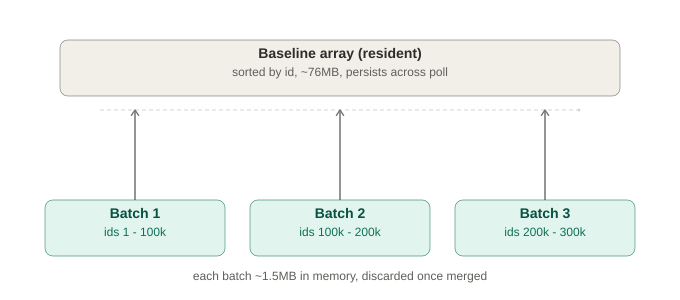
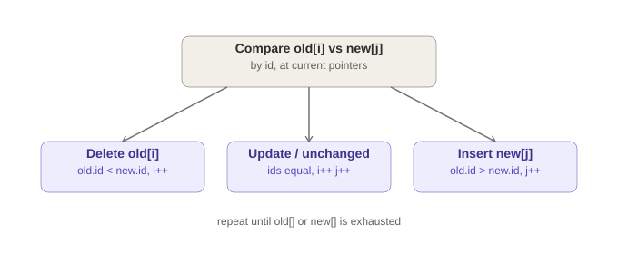

# DDD-53: Outbox Polling Connector

## Motivation

Most Debezium connectors capture changes via a database-native replication
mechanism -- PostgreSQL logical replication slots, MySQL/MariaDB binlog, and
so on. These are robust and complete, but carry non-trivial operational
overhead: they require elevated database privileges, consume replication log
resources, and mandate careful lifecycle management, since an unconsumed
slot or a reader that falls behind can grow a database's own write-ahead log
unboundedly until a human intervenes.

Many deployments cannot pay that cost. Managed databases (RDS, Cloud SQL,
and similar) frequently restrict or disallow replication access entirely,
and some teams simply do not want to grant it. This document proposes a
standalone, database-agnostic outbox polling connector: it detects changes
by periodically diffing a watched table's state against an in-memory
baseline rather than reading a replication stream, requires no elevated
privileges, no replication slot, and no trigger, and works against any
JDBC-accessible database.

Related issue: [DBZ-2127](https://github.com/debezium/dbz/issues/2127).

This document was originally scoped as a PostgreSQL-specific `LISTEN`/`NOTIFY`
mode of the existing PostgreSQL connector. Per discussion on
[debezium/debezium-design-documents#51](https://github.com/debezium/debezium-design-documents/pull/51),
`LISTEN`/`NOTIFY` was judged too narrow and too PostgreSQL-specific a
mechanism to justify the scope. This revision replaces it entirely with the
trigger-less, database-agnostic design below.

---

## Goals

### Primary
- Provide a lightweight alternative to logical replication for deployments where replication slots are unavailable or undesirable
- **Stateless connector instances** -- all durable state lives in `debezium_outbox`; the in-memory baseline is rebuilt from the watched table on every restart, never persisted
- **Horizontal scaling** -- run any number of identical instances; no coordination between them is required
- At-least-once delivery into the outbox, with a clear idempotency contract
- **Database-agnostic** -- works against any table reachable over JDBC
- No triggers, no elevated privileges, no replication slot

### Non-goals
- Full DDL capture
- Exactly-once delivery
- A replacement for Debezium's existing log-based connectors -- this is a lightweight alternative for teams who cannot use logical replication. For full CDC, the existing Debezium connectors remain the right tool.

---

## Detection Mechanism

At initialization and on every scheduled sweep, each connector instance
holds an in-memory baseline of the watched table: sorted `id` and checksum
pairs, using a 64-bit hash rather than a stored payload. Each sweep compares
current state against this baseline using a sort-merge diff. When a row has
changed, the instance writes its content into the outbox as the change
event, covering inserts, updates, and deletes. The new content then becomes
the baseline entry used for the next comparison.

```sql
CREATE TABLE debezium_outbox (
    id              BIGINT PRIMARY KEY,
    row_id          BIGINT NOT NULL,
    new_checksum    BIGINT NOT NULL,
    event_type      TEXT NOT NULL,
    payload         TEXT NOT NULL,
    idempotency_key TEXT NOT NULL,
    detected_at     TIMESTAMP NOT NULL,
    consumed_at     TIMESTAMP,
    UNIQUE (row_id, new_checksum)
);
```

`payload` holds the row's content at the moment a change is detected. For
deletes, the row's content is not recoverable -- the baseline stores
checksums only, never full row content -- so a delete event carries identity
(`row_id`) but not the deleted row's prior field values. This is a direct,
named trade-off of not requiring a trigger to capture a true before-image.

---

## Memory Footprint

This design spends JVM heap that a log-based replication slot would not
need. That trade-off should be named directly.

Measured cost is approximately 15 MB per million watched rows steady state,
roughly 30 MB peak mid-sweep, per replica. Validated safe to about 5M rows
per replica before the JVM heap becomes a limiting factor.

In exchange, this approach avoids a known failure mode of replication slots:
an unconsumed slot causes the source database's own write-ahead log to grow
unboundedly until a human intervenes, a failure that affects the primary
database itself. A stalled or crashed connector instance under this design
costs the database nothing, since its memory is simply discarded and
rebuilt on restart.

---

## A Unified Detection Core

The same diff engine processes every sweep, whether triggered by the fixed
polling interval or run at startup. New rows are read in bounded batches,
merged against the resident baseline, and released once merged.



Each batch is discarded immediately after it is merged and becomes eligible
for garbage collection, so only one batch and the resident baseline are ever
held in memory at a time.



---

## Outbox Durability, Delegated

The outbox table's durability against loss (drop, truncate, corruption) is
not the connector's responsibility. It follows whatever backup or
replication strategy the operator already applies to the database, the same
policy protecting every other table. This design does not introduce a
bespoke backup mechanism.

What is the connector's responsibility is bounded recovery behavior for the
gap between the last backup and the loss:

- The scheduled sweep checks whether the outbox table still exists as part
  of its normal write path, either through a lightweight existence check or
  by catching the error that results when a write targets a table that no
  longer exists.
- On confirmed absence, the current sweep short-circuits into the same
  initialization routine used at startup: recreate the table, discard the
  local baseline, and run a full scan that repopulates both the baseline
  and the outbox from current state.
- Because outbox writes are deduplicated on `row_id` and `new_checksum`,
  concurrent resyncs from multiple replicas collapse without coordination,
  consistent with steady-state behavior.
- Named limitation: only current state is recoverable this way. Any change
  pending in the outbox at the moment of loss, not yet consumed downstream,
  is genuinely lost. Downstream becomes eventually consistent with the
  database, not with the true event history.
- Instance restart and outbox loss are the same code path. Both reset the
  baseline and re-enter initialization.

---

## Delivery Is Out of Scope

This connector's responsibility ends at the outbox table. It does not
produce to Kafka, does not run inside Kafka Connect, and depends on no
broker of any kind. `debezium_outbox` is itself the interface: downstream
consumers read pending rows (`consumed_at IS NULL`) directly, on whatever
cadence and via whatever mechanism suits them. This keeps the connector's
own dependency footprint to a JDBC driver and a JVM -- nothing else.

Teams that want Kafka delivery can build that as a separate, independent
consumer of the outbox table. That consumer is out of scope for this
document.

---

## Horizontal Scaling

Scaling requires no configuration change, no partition assignment, and no
leader election. Each instance is identical.

```
Scale up:      start new instance -> begins sweeping immediately
Scale down:    stop any instance  -> no impact; the outbox already holds every detected change
Instance crash: baseline is discarded and rebuilt on restart, per the recovery path above
```

Because every instance independently scans and diffs the same table, adding
instances does not parallelize detection work the way it does in the
log-based, Kafka-partitioned model -- it increases redundancy and lowers
detection latency variance, not throughput. Detection is deduplicated at
write time via the `(row_id, new_checksum)` unique constraint, so redundant
detection from multiple instances is safe, not wasted correctness-wise, even
though it is not additional throughput.

---

## At-Least-Once Delivery Guarantee

```
Row changes in the watched table
    -> next sweep's sort-merge diff detects the change
    -> outbox row written (consumed_at = NULL)      <- durable, always

If the connector is down when the change occurs:
    -> nothing is lost -- the row simply differs from the baseline
    -> the next sweep after restart detects it the same way

If the connector crashes mid-sweep:
    -> rows already written to the outbox before the crash remain
    -> the next sweep re-diffs against the last committed baseline and
       catches anything missed, deduplicated by (row_id, new_checksum)
```

Delivery guarantees from the outbox onward (to Kafka or any other
destination) are the responsibility of whatever downstream consumer reads
the outbox -- see "Delivery Is Out of Scope" above.

---

## Outbox Maintenance

Consumed rows are retained for a configurable period for debugging and
replay, then purged:

```sql
DELETE FROM debezium_outbox
WHERE consumed_at IS NOT NULL
  AND consumed_at < now() - make_interval(days => :retentionDays);
```

---

## Configuration

```properties
jdbc.url=jdbc:postgresql://host:5432/db
jdbc.user=...
jdbc.password=...
table.name=orders
table.id.column=id
poll.interval.ms=5000
scan.fetch.size=1000
outbox.retention.days=7
```

---

## Backward Compatibility

Not applicable -- this is a new, standalone project with no prior released
version and no relationship to the configuration or behavior of any
existing Debezium connector.

---

## Limitations vs Log-Based CDC

| Capability | Log-based CDC (existing Debezium connectors) | This connector |
|---|---|---|
| DDL change capture | Yes | No |
| Exactly-once delivery | Yes | No (at-least-once) |
| Elevated DB privileges required | Yes (replication role) | No |
| Replication log overhead | Yes | No |
| Deleted row content | Full before-image | Identity only, no content |
| Detection latency | Near real-time (log tailing) | Bounded by poll interval |
| Horizontal scaling | Via Kafka partitions | Via independent, uncoordinated instances (redundancy, not throughput) |
| Delivery mechanism | Kafka, via Debezium/Kafka Connect | None -- the outbox table is the interface |

---

## Alternative Approaches Considered

**`LISTEN`/`NOTIFY`-based detection (PostgreSQL-specific):** narrower scope,
ties the connector to one database, and still required a connector-managed
trigger function. Superseded by this design per the discussion in
[#51](https://github.com/debezium/debezium-design-documents/pull/51).

**Connector-owned or user-owned triggers for detection:** requires elevated
privileges (`TRIGGER`) or per-table setup by the user. Rejected in favor of
pure polling, which needs neither.

**Bundling this as a mode of an existing Debezium connector:** rejected per
the discussion in #51 -- the shared-base pattern doesn't fit a connector
with a fundamentally different detection mechanism, no replication
dependency, and no Kafka Connect dependency at all.

**Polling with a full row-by-row content comparison instead of checksums:**
correct, but higher memory and I/O cost per row for no material benefit over
a 64-bit checksum comparison. Rejected.

---

## References

- [DBZ-2127: Original feature proposal](https://github.com/debezium/dbz/issues/2127)
- Discussion: [debezium/debezium-design-documents#51](https://github.com/debezium/debezium-design-documents/pull/51)
- Early implementation scaffold: [zavera/debezium-connector-outbox-poll](https://github.com/zavera/debezium-connector-outbox-poll)
