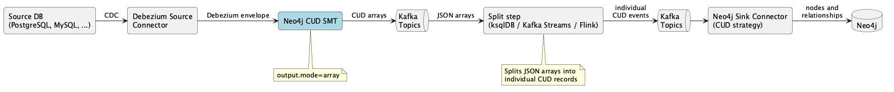
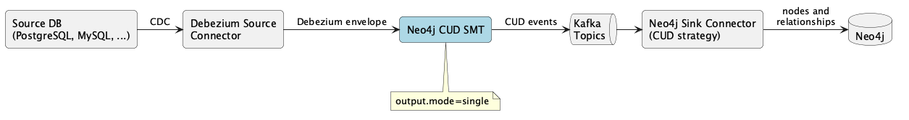

# DDD-55: Relational-to-Graph Debezium Source SMT for Neo4j

## Motivation


Neo4j's Kafka sink connector already handles writing data into Neo4j, but it expects events in its own formats (CUD, CDC, Cypher, or Pattern). 
Debezium source connectors emit events in the Debezium envelope format so there is no bridge between the two.

This DDD describes the **V1** of a Kafka Connect Single Message Transform (SMT) that converts Debezium change events into Neo4j's CUD format, enabling pipelines like:

```
PostgreSQL -> Debezium Source Connector + SMT -> Kafka -> Neo4j Sink Connector -> Neo4j
```

## Goals

1. **Transform Debezium envelope events into Neo4j CUD format**, enabling any Debezium relational source connector to feed data into Neo4j
2. **User-declarative mapping configuration**: the user explicitly configures how tables map to node labels, which columns are keys, and which foreign keys become relationships
3. **Support all Debezium operations**: create (`c`), read/snapshot (`r`), update (`u`), and delete (`d`) mapped to appropriate CUD operations
4. **Stateless**: no connection to source or target databases, no state beyond the current message and configuration

## Out of scope

- **Graph-to-Relational SMT** (Source SMT): deferred to a separate DDD
- **Convention-based automatic mapping**: V1 requires explicit configuration; automatic inference (e.g., table name -> label name, FK detection) is out of scope
- **Stateful operations**: cross-topic FK resolution and schema evolution require state and are out of scope
- **DDL event processing**: the SMT only processes DML events (inserts, updates, deletes) and skips DDL schema change events

## Architecture

The SMT is deployed on the **Debezium source connector** side. 
It intercepts each Debezium envelope event, reads the mapping configuration, and produces CUD-formatted events on a Kafka topic.

The SMT supports two output modes controlled by the `output.mode` configuration property:

**`output.mode=array`** (default): packs all CUD events (node + relationships) into a JSON array in a single Kafka record. This guarantees ordering between node and relationship events since they are in the same record. 
The output requires a [split step](#split-step-for-array-mode) to split the array into individual records before the Neo4j sink connector can consume them.



**`output.mode=single`**: produces one CUD event per Debezium event. 
The output is directly consumable by the Neo4j sink connector without any intermediate step. 
Due to the Kafka Connect `apply()` API constraint (one input record produces one output record), this mode can emit either a node event or a relationship event, not both. 
The `node.mode` property controls which one: `node.mode=node` emits the node event, `node.mode=relationship` emits the relationship event. To get both node and relationship events from the same table, use `output.mode=array`.



The `output.mode` and `node.mode` properties are orthogonal. 
The `output.mode` is configured per SMT instance, so each table can technically have a different value but mixing `array` and `single` modes on the same connector means some topics produce JSON arrays (needing split step) while others produce single events (directly consumable). 
This complicates the downstream pipeline so it is recommended to use the same `output.mode` for all tables on the same connector.

Below the four possible combinations:

| `node.mode` | `output.mode` | Result | Use case                                                          |
|:---|:---|:---|:------------------------------------------------------------------|
| `node` | `array` (default) | Array with the node event followed by relationship events | Entity tables with FK columns (e.g., `orders` with `customer_id`) |
| `node` | `single` | One node CUD event (no relationships) | Entity tables without FK columns (e.g., `customers`)              |
| `relationship` | `array` (default) | Array with referenced node merges followed by the relationship event | Join tables (e.g., `order_customer`)                        |
| `relationship` | `single` | One relationship CUD event (no nodes) | Join tables when referenced nodes are guaranteed to exist         |

## Proposed Solution

### Mapping

A Debezium CDC event carries schema metadata (column names, types, primary key fields) and the `source` block includes table name, schema, and database.
However, the DML data change events do not carry foreign key metadata or any information about relationships between tables.
For example, the Debezium envelope for an `orders` row contains `customer_id: 1004`, but nothing in that event says whether that is a simple integer property or a foreign key pointing to the `customers` table.

Debezium also emits DDL schema change events (to the schema history topic), and those can contain FK definitions (e.g., `ALTER TABLE orders ADD FOREIGN KEY ...`).
However, processing DDL events is out of scope for V1 (see [Out of scope](#out-of-scope)).
Using DDL events as a source of FK information would require the SMT to build and maintain a schema model over time, which conflicts with the stateless design proposed in V1.

The graph structure (which tables are nodes, which are join tables, which columns are FKs, what relationship types to use) could come from three possible sources:

1. **The user declares it explicitly** (V1). The user provides the full mapping configuration: `node.labels`, `node.id.properties`, `relationship.<fk>.type`, `relationship.<fk>.target.label`, etc.
This is verbose but unambiguous, and works for any schema.

2. **The SMT infers it from Debezium schema metadata** (could be future work in V2). Debezium's Kafka Connect schemas include primary key information.
FK detection could leverage naming conventions (e.g., columns ending in `_id`) or additional schema metadata if Debezium exposes it in the future.
This is the V2 convention-based mapping listed under [Future Work](#future-work).

3. **The SMT infers it from DDL events or PK<->FK relationships in the CDC stream** (could be future work in V2).
Debezium's DDL schema change events can contain FK definitions, and some dimensional information could be inferred from PK-FK relationships. 
4. However, DML events (which the SMT processes) do not carry FK metadata and using DDL events would require the SMT to build and maintain a schema model over time, making it stateful.

V1 proposes approach 1.

#### Operation Mapping

Debezium operations map to CUD operations as follows:

| Debezium `op` | Meaning | CUD `op` | Reason                                            |
|:---|:---|:---|:--------------------------------------------------|
| `c` | Create (INSERT) | `merge` | Idempotent, safe for at-least-once delivery       |
| `r` | Read (snapshot) | `merge` | Snapshot events may replay; merge is idempotent   |
| `u` | Update | `merge` | Merge updates existing node or creates if missing |
| `d` | Delete | `delete` | Removes the node; `detach` configurable           |

All create and update operations use `merge` (not `create` or `update`) because events may be replayed
and Snapshot events (`op: "r"`) are structurally identical to creates and need idempotency.
`merge` in Neo4j is an upsert so it creates the node if it doesn't exist, or updates it if it does.


#### Node Mapping

Each Debezium event from a relational table produces a CUD node event. 
The mapping is:

| Debezium field | CUD field | Description |
|:---|:---|:---|
| `source.table` | `labels` | Node label(s), configured per topic |
| Primary key columns from `after` | `ids` | Key properties for merge/update/delete lookups |
| Non-key columns from `after` | `properties` | Node properties |
| `op` | `op` | Operation (see mapping table above) |
| - | `type` | Always `"node"` |

The following examples use the `customers` table, which has no FK relationships. 
For tables without FK relationships, the output is the same in both modes except that `output.mode=array` wraps the event in a single-element JSON array. 
For multi-element array examples (node + relationships), see [Relationship Mapping](#relationship-mapping) and [Join Table Mapping](#join-table-mapping).

**Example: INSERT event**

Debezium input:
```json
{
  "before": null,
  "after": {
    "id": 1004,
    "first_name": "John",
    "last_name": "Foo",
    "email": "john@foo.org"
  },
  "source": {
    "version": "2.5.0.Final",
    "connector": "postgresql",
    "name": "dbserver1",
    "ts_ms": 1711900800000,
    "schema": "public",
    "table": "customers"
  },
  "op": "c",
  "ts_ms": 1711900800100
}
```

CUD output:
```json
{
  "type": "node",
  "op": "merge",
  "labels": ["Customer"],
  "ids": { "id": 1004 },
  "properties": {
    "first_name": "John",
    "last_name": "Foo",
    "email": "john@foo.org"
  }
}
```

**Example: UPDATE event**

Debezium input:
```json
{
  "before": {
    "id": 1004,
    "first_name": "John",
    "last_name": "Foo",
    "email": "john@foo.org"
  },
  "after": {
    "id": 1004,
    "first_name": "John",
    "last_name": "Foo",
    "email": "john.foo@newmail.org"
  },
  "source": {
    "connector": "postgresql",
    "name": "dbserver1",
    "table": "customers"
  },
  "op": "u",
  "ts_ms": 1711900900100
}
```

CUD output:
```json
{
  "type": "node",
  "op": "merge",
  "labels": ["Customer"],
  "ids": { "id": 1004 },
  "properties": {
    "first_name": "John",
    "last_name": "Foo",
    "email": "john.foo@newmail.org"
  }
}
```

**Example: DELETE event**

Debezium input:
```json
{
  "before": {
    "id": 1004,
    "first_name": "John",
    "last_name": "Foo",
    "email": "john@foo.org"
  },
  "after": null,
  "source": {
    "connector": "postgresql",
    "name": "dbserver1",
    "table": "customers"
  },
  "op": "d",
  "ts_ms": 1711901000100
}
```

CUD output:
```json
{
  "type": "node",
  "op": "delete",
  "labels": ["Customer"],
  "ids": { "id": 1004 },
  "detach": true
}
```

For delete events, the SMT reads key properties from the `before` field (since `after` is null). 

The `detach` flag in the CUD output is controlled by the SMT's `node.delete.detach` configuration property (default: `true`). 
It controls how Neo4j handles relationships when deleting a node. 
In Neo4j, a node cannot be deleted if it still has relationships attached to it, so when `detach` is `true` (the default), Neo4j first removes all relationships connected to the node, then deletes the node itself (equivalent to `DETACH DELETE` in Cypher). 
When `detach` is `false`, the delete will fail if the node has any relationships, which can be useful when you want to enforce that relationships are cleaned up explicitly before removing a node.

#### Relationship Mapping

Foreign key columns can be configured to produce CUD relationship events. 
The behavior depends on the output mode.

**Example: Order with FK to Customer**

Debezium input (from the `orders` table):
```json
{
  "after": {
    "id": 5001,
    "customer_id": 1004,
    "total": 99.95,
    "status": "pending"
  },
  "source": {
    "table": "orders"
  },
  "op": "c",
  "ts_ms": 1711900800200
}
```

With **`output.mode=array`** (default), the SMT packs both the node event and the relationship event into a JSON array:

```json
[
  {
    "type": "node",
    "op": "merge",
    "labels": ["Order"],
    "ids": { "id": 5001 },
    "properties": { "total": 99.95, "status": "pending" }
  },
  {
    "type": "relationship",
    "op": "merge",
    "rel_type": "PLACED_BY",
    "from": {
      "labels": ["Order"],
      "ids": { "id": 5001 },
      "op": "merge"
    },
    "to": {
      "labels": ["Customer"],
      "ids": { "id": 1004 },
      "op": "match"
    },
    "properties": {}
  }
]
```

The `from.op: "merge"` ensures the source node exists (created if needed). 
The `to.op: "match"` assumes the target node already exists. 
This is configurable (see the `relationship.target.node.op` configuration property).

With **`output.mode=single`**, only the node event is emitted. 
The FK column `customer_id` is excluded from properties because it is configured as a relationship, but no relationship event is produced:

```json
{
  "type": "node",
  "op": "merge",
  "labels": ["Order"],
  "ids": { "id": 5001 },
  "properties": {
    "total": 99.95,
    "status": "pending"
  }
}
```

#### Join Table Mapping

Many-to-many relationships in relational databases use join tables (e.g., `order_items`). 
In a graph, these should become relationships, not nodes. An `:OrderItem` node has no semantic meaning when it only links an order to a product.

The SMT supports this via `node.mode=relationship`. 
When set, the SMT suppresses the node event and emits only the configured relationship event(s). 
Non-FK columns on the join table become relationship properties.

**Example: Join table `order_items`**

Relational schema:
```sql
CREATE TABLE order_items (
    order_id INTEGER REFERENCES orders(id),
    product_id INTEGER REFERENCES products(id),
    quantity INTEGER,
    PRIMARY KEY (order_id, product_id)
);
```

Configuration:
```properties
transforms.neo4j_order_items.type=io.debezium.transforms.Neo4jCudConverter
transforms.neo4j_order_items.node.mode=relationship
transforms.neo4j_order_items.relationship.order_id.type=CONTAINS
transforms.neo4j_order_items.relationship.order_id.target.label=Order
transforms.neo4j_order_items.relationship.order_id.target.id=id
transforms.neo4j_order_items.relationship.product_id.type=CONTAINS
transforms.neo4j_order_items.relationship.product_id.target.label=Product
transforms.neo4j_order_items.relationship.product_id.target.id=id
transforms.neo4j_order_items.relationship.order_id.properties=quantity
```

Debezium input:
```json
{
  "after": {
    "order_id": 5001,
    "product_id": 200,
    "quantity": 3
  },
  "source": { "table": "order_items" },
  "op": "c",
  "ts_ms": 1711900800300
}
```

With **`output.mode=array`** (default), the SMT produces an array of three events: node merges for the referenced nodes (to ensure they exist), followed by the relationship:

```json
[
  {
    "type": "node",
    "op": "merge",
    "labels": ["Order"],
    "ids": { "id": 5001 },
    "properties": {}
  },
  {
    "type": "node",
    "op": "merge",
    "labels": ["Product"],
    "ids": { "id": 200 },
    "properties": {}
  },
  {
    "type": "relationship",
    "op": "merge",
    "rel_type": "CONTAINS",
    "from": {
      "labels": ["Order"],
      "ids": { "id": 5001 },
      "op": "match"
    },
    "to": {
      "labels": ["Product"],
      "ids": { "id": 200 },
      "op": "match"
    },
    "properties": {
      "quantity": 3
    }
  }
]
```

The node merge events ensure that the Order and Product nodes exist (with at least their key properties) before the relationship is created. 
The `properties: {}` is empty because the join table row does not carry the full properties of the referenced nodes. 
Neo4j's `merge` operation only sets the properties explicitly specified; an empty `properties` does not clear existing properties on the node. 
If the Order node already exists with `{id: 5001, total: 99.95, status: "pending"}` from its own entity table event, this merge is a no-op and all existing properties are preserved.
After the split step splits this array, the Neo4j sink connector processes the events in order: nodes first, then the relationship.

Note that the relationship event uses `from.op: "match"` and `to.op: "match"` (not `"merge"`) because the preceding node events already guarantee the nodes exist. No `:OrderItem` node is created since `node.mode=relationship` suppresses the join table entity node.

With **`output.mode=single`**, the SMT produces a single relationship CUD event (no node events for the referenced nodes):

```json
{
  "type": "relationship",
  "op": "merge",
  "rel_type": "CONTAINS",
  "from": {
    "labels": ["Order"],
    "ids": { "id": 5001 },
    "op": "merge"
  },
  "to": {
    "labels": ["Product"],
    "ids": { "id": 200 },
    "op": "merge"
  },
  "properties": {
    "quantity": 3
  }
}
```

In single mode, `from.op` and `to.op` use `"merge"` (not `"match"`) because there are no preceding node events to guarantee the nodes exist. Neo4j will create them with just their key properties if needed.

When two relationship configurations point to different targets (as above with `order_id` -> Order and `product_id` -> Product), the SMT uses the first FK as the `from` node and the second as the `to` node, in configuration order. 
The relationship type is taken from the first relationship configuration. 
The `direction` property can be used to invert the direction if needed.

For delete events on join tables (`op: "d"`), the SMT emits a CUD relationship delete using the FK values from `before`.

#### Multiple CUD Events per Debezium Event

For entity tables that also have FK columns configured as relationships, the SMT needs to produce both a node event and one or more relationship events from a single Debezium event.

The `output.mode` configuration property controls how this is handled:

**`output.mode=single`**

The standard Kafka Connect `Transformation<R>` interface returns a single record from `apply(R record)`. 
In single mode, the SMT produces only the node CUD event and the FK columns configured as relationships are excluded from node properties, but no relationship event is emitted.

To create relationships, the user can configure a second Debezium source connector instance with the SMT set to `node.mode=relationship` for the same topics. However, this means two independent source connectors reading from the same database, which doubles the CDC load. It also introduces ordering and race condition issues because the two connectors are independent consumers with no coordination:

- **Stale merge after delete**: the relationship connector may process an INSERT after the node connector already processed a DELETE for the same key, re-creating a deleted node via `from.op: "merge"`
- **No ordering guarantee**: the relationship connector may create a relationship before the node connector has created the referenced node
- **Doubled CDC load**: two source connectors capture the same changes from the source database

For these reasons, `output.mode=array` (default) is the recommended mode when relationships are needed.

This mode is the simplest to deploy since the output is directly consumable by the Neo4j sink connector without any intermediate step.

**`output.mode=array`**

The SMT packs all CUD events (node + relationships) into a JSON array in a single Kafka record. For a table with no relationships, the array contains a single element. For a table with FK relationships, the array contains the node event followed by one relationship event per FK.

Example output for an `orders` event with a FK to `customers`:
```json
[
  {
    "type": "node",
    "op": "merge",
    "labels": ["Order"],
    "ids": { "id": 5001 },
    "properties": { "total": 99.95, "status": "pending" }
  },
  {
    "type": "relationship",
    "op": "merge",
    "rel_type": "PLACED_BY",
    "from": { "labels": ["Order"], "ids": { "id": 5001 }, "op": "merge" },
    "to": { "labels": ["Customer"], "ids": { "id": 1004 }, "op": "match" },
    "properties": {}
  }
]
```

The node event is always first in the array, followed by relationship events. This guarantees ordering: the node is created before its relationships.

The Neo4j sink connector expects one CUD event per record, not an array. 
The user must add a [split step](#split-step-for-array-mode) between the SMT output and the Neo4j sink connector to split the array into individual records.

This mode eliminates the ordering and race condition issues that arise with `output.mode=single` when using two connector instances, at the cost of requiring an additional component in the pipeline.

#### Split step for array mode

When using `output.mode=array`, the SMT writes JSON arrays to the standard Debezium Kafka topics (e.g., `dbserver1.public.orders`). 
A split step component reads from these topics, splits each array into individual CUD records, and writes them to output topics that the Neo4j sink connector consumes.

```
Debezium topics (JSON arrays) -> Split step -> Output topics (individual CUD events) -> Neo4j Sink
```

The split step must preserve the order of elements within each array so that node events are always processed before their relationship events.

**Option 1: ksqlDB (recommended for Confluent Platform users)**

ksqlDB provides the `EXPLODE` function that takes an array field and produces one output record per array element. 
This is the simplest option if the user already runs ksqlDB.

Create a stream over the Debezium topic:
```sql
CREATE STREAM neo4j_cud_arrays (
  cud_events ARRAY<VARCHAR>
) WITH (
  KAFKA_TOPIC='dbserver1.public.orders',
  VALUE_FORMAT='JSON'
);
```

Split the array into individual records:
```sql
CREATE STREAM neo4j_cud_events AS
  SELECT EXPLODE(cud_events) AS cud_event
  FROM neo4j_cud_arrays
  EMIT CHANGES;
```

The Neo4j sink connector then consumes from the `neo4j_cud_events` topic.


**Option 2: Kafka Streams**

A lightweight Kafka Streams application that reads JSON arrays and produces individual records. 
This is a good option for users on vanilla Apache Kafka who want a JVM-based solution.

**Option 3: Apache Flink**

A Flink job that reads from the Debezium topics and produces individual records.
This is a good option for users who already have Flink infrastructure or use Debezium Server with Flink.

**Recommendation**

For most users, the choice depends on what is already available in their infrastructure:

| Already have | Recommended split step |
|:---|:---|
| Confluent Platform | ksqlDB (simplest, no code) |
| Vanilla Apache Kafka | Kafka Streams (lightweight JVM app) |
| Apache Flink | Flink job |
| Debezium Server | Kafka Streams or Flink |

### Configuration Schema

The SMT is configured using standard Kafka Connect SMT configuration properties. All properties use the prefix of the SMT instance name (e.g., `transforms.neo4j.*`).

#### SMT Registration

```properties
transforms=neo4j
transforms.neo4j.type=io.debezium.transforms.Neo4jCudConverter
```

#### Node Configuration

| Property | Type | Required | Default | Description |
|:---|:---|:---|:---|:---|
| `node.mode` | String | No | `node` | Controls the entity type: `node` (default) treats the table row as a graph node; `relationship` treats the table row as a graph relationship (no entity node is created). In `output.mode=array` with `node.mode=node`, the array contains the node event followed by relationship events. In `output.mode=array` with `node.mode=relationship`, the array contains referenced node merges followed by the relationship event. In `output.mode=single`, only one event is emitted (node or relationship). Use `relationship` for join tables (see [Join Table Mapping](#join-table-mapping)) |
| `node.labels` | String | No | Derived from `source.table` (PascalCase, singular) | Comma-separated list of Neo4j labels to apply to the node. Not used when `node.mode=relationship` |
| `node.id.properties` | String | Yes (when `node.mode=node`) | - | Comma-separated list of column names to use as CUD `ids` (key properties for merge/delete). Not used when `node.mode=relationship` |
| `node.properties.include` | String | No | All columns | Comma-separated list of columns to include as node properties. Mutually exclusive with `node.properties.exclude` |
| `node.properties.exclude` | String | No | None | Comma-separated list of columns to exclude from node properties. FK columns mapped to relationships are excluded automatically |
| `node.delete.detach` | Boolean | No | `true` | Whether to set `detach: true` on delete operations, removing the node and all its relationships |

#### Relationship Configuration

Relationships are configured per foreign key column. The property path follows the pattern `relationship.<fk_column>.*`:

| Property | Type | Required | Default | Description |
|:---|:---|:---|:---|:---|
| `relationship.<fk_column>.type` | String | Yes | - | The Neo4j relationship type (e.g., `PLACED_BY`, `BELONGS_TO`) |
| `relationship.<fk_column>.direction` | String | No | `outgoing` | Relationship direction: `outgoing` (source node -> target node) or `incoming` (target node -> source node) |
| `relationship.<fk_column>.target.label` | String | Yes | - | The label of the target node |
| `relationship.<fk_column>.target.id` | String | No | Same as `<fk_column>` | The property name on the target node that the FK value maps to |
| `relationship.<fk_column>.target.node.op` | String | No | `match` | How to handle the target node in the CUD relationship event: `match` (node must already exist) or `merge` (create node with key properties if not exists). In `output.mode=array` with `node.mode=relationship`, referenced nodes are included as separate merge events in the array, so this defaults to `match` |
| `relationship.<fk_column>.properties` | String | No | None | Comma-separated list of columns to include as relationship properties |

#### Output Configuration

| Property | Type | Required | Default | Description |
|:---|:---|:---|:---|:---|
| `output.mode` | String | No | `array` | Controls the output format: `array` (default) packs all CUD events (node + relationships) into a JSON array (requires a [split step](#split-step-for-array-mode) before the Neo4j sink connector); `single` produces one CUD event per record (node or relationship, not both) and is directly consumable by the Neo4j sink connector. See [Multiple CUD Events per Debezium Event](#multiple-cud-events-per-debezium-event) |

#### Global Configuration

| Property | Type | Required | Default | Description |
|:---|:---|:---|:---|:---|
| `tombstones.enabled` | Boolean | No | `true` | Whether to pass through tombstone records (null value) emitted by the Debezium source connector after delete events. When `true`, tombstones are forwarded for Kafka log compaction. When `false`, they are dropped by the SMT |

### Full Configuration Example

Consider a Postgres relational schema with three tables:

```sql
CREATE TABLE customers (
    id SERIAL PRIMARY KEY,
    first_name VARCHAR(100),
    last_name VARCHAR(100),
    email VARCHAR(255)
);

CREATE TABLE orders (
    id SERIAL PRIMARY KEY,
    customer_id INTEGER REFERENCES customers(id),
    total DECIMAL(10,2),
    status VARCHAR(50),
    created_at TIMESTAMP
);

CREATE TABLE products (
    id SERIAL PRIMARY KEY,
    name VARCHAR(200),
    price DECIMAL(10,2)
);

CREATE TABLE order_items (
    order_id INTEGER REFERENCES orders(id),
    product_id INTEGER REFERENCES products(id),
    quantity INTEGER,
    PRIMARY KEY (order_id, product_id)
);
```

The target graph model:

```
(:Customer {id, first_name, last_name, email})
(:Order {id, total, status, created_at})-[:PLACED_BY]->(:Customer)
(:Product {id, name, price})
(:Order)-[:CONTAINS {quantity}]->(:Product)
```

Note that `order_items` is a join table. It becomes a `CONTAINS` relationship with `quantity` as a relationship property, not a node.

#### Debezium Source Connector with SMT (PostgreSQL):

The SMT is configured on the Debezium source connector. This example uses `output.mode=array` (default), which packs all CUD events into a JSON array and requires a [split step](#split-step-for-array-mode) before the Neo4j sink connector.

```properties
connector.class=io.debezium.connector.postgresql.PostgresConnector
database.hostname=postgres
database.port=5432
database.user=debezium
database.password=dbz
database.dbname=inventory
topic.prefix=dbserver1
table.include.list=public.customers,public.orders,public.products,public.order_items

# --- SMT registration ---
transforms=neo4j_customers,neo4j_orders,neo4j_products,neo4j_order_items
transforms.neo4j_customers.type=io.debezium.transforms.Neo4jCudConverter
transforms.neo4j_orders.type=io.debezium.transforms.Neo4jCudConverter
transforms.neo4j_products.type=io.debezium.transforms.Neo4jCudConverter
transforms.neo4j_order_items.type=io.debezium.transforms.Neo4jCudConverter

# Customers (node only, no relationships, array contains one element)
transforms.neo4j_customers.node.labels=Customer
transforms.neo4j_customers.node.id.properties=id

# Orders (node + PLACED_BY relationship to Customer, array contains two elements)
transforms.neo4j_orders.node.labels=Order
transforms.neo4j_orders.node.id.properties=id
transforms.neo4j_orders.relationship.customer_id.type=PLACED_BY
transforms.neo4j_orders.relationship.customer_id.target.label=Customer
transforms.neo4j_orders.relationship.customer_id.target.id=id

# Products (node only, no relationships, array contains one element)
transforms.neo4j_products.node.labels=Product
transforms.neo4j_products.node.id.properties=id

# Order Items (join table, array contains Order node merge + Product node merge + CONTAINS relationship)
transforms.neo4j_order_items.node.mode=relationship
transforms.neo4j_order_items.relationship.order_id.type=CONTAINS
transforms.neo4j_order_items.relationship.order_id.target.label=Order
transforms.neo4j_order_items.relationship.order_id.target.id=id
transforms.neo4j_order_items.relationship.product_id.type=CONTAINS
transforms.neo4j_order_items.relationship.product_id.target.label=Product
transforms.neo4j_order_items.relationship.product_id.target.id=id
transforms.neo4j_order_items.relationship.order_id.properties=quantity
```

#### Split step (ksqlDB example):

The split step reads JSON arrays from the Debezium topics and produces individual CUD records on output topics.

```sql
CREATE STREAM orders_cud_arrays (cud_events ARRAY<VARCHAR>)
  WITH (KAFKA_TOPIC='dbserver1.public.orders', VALUE_FORMAT='JSON');

CREATE STREAM orders_cud_events AS
  SELECT EXPLODE(cud_events) AS cud_event
  FROM orders_cud_arrays
  EMIT CHANGES;
```

Repeat for each topic. See [Split step for array mode](#split-step-for-array-mode) for Kafka Streams and Flink alternatives.

#### Neo4j Sink Connector:

The Neo4j sink connector consumes from the output topics produced by the split step.

```properties
connector.class=org.neo4j.connectors.kafka.sink.Neo4jConnector
neo4j.uri=neo4j://neo4j:7687
neo4j.authentication.basic.username=neo4j
neo4j.authentication.basic.password=password
topics=ORDERS_CUD_EVENTS,CUSTOMERS_CUD_EVENTS,PRODUCTS_CUD_EVENTS,ORDER_ITEMS_CUD_EVENTS
neo4j.cud.topics=ORDERS_CUD_EVENTS,CUSTOMERS_CUD_EVENTS,PRODUCTS_CUD_EVENTS,ORDER_ITEMS_CUD_EVENTS
```

#### Recommended constraints in Neo4j

Uniqueness constraints are not required for `MERGE` to work, but they are strongly recommended. 
They create indexes that improve lookup performance for merge operations and prevent duplicate nodes from race conditions or concurrent writes:

```cypher
CREATE CONSTRAINT customer_id IF NOT EXISTS FOR (c:Customer) REQUIRE c.id IS UNIQUE;
CREATE CONSTRAINT order_id IF NOT EXISTS FOR (o:Order) REQUIRE o.id IS UNIQUE;
CREATE CONSTRAINT product_id IF NOT EXISTS FOR (p:Product) REQUIRE p.id IS UNIQUE;
```

### Type Mapping

Debezium represents column values using Kafka Connect schema types and logical types. The SMT maps these to Neo4j-compatible property types:

| Debezium / Kafka Connect Type | Neo4j Property Type | Notes |
|:---|:---|:---|
| `INT8`, `INT16`, `INT32` | `Long` | Neo4j stores all integers as 64-bit |
| `INT64` | `Long` | |
| `FLOAT32` | `Double` | Neo4j stores all floats as 64-bit |
| `FLOAT64` | `Double` | |
| `BOOLEAN` | `Boolean` | |
| `STRING` | `String` | |
| `BYTES` | `ByteArray` | |
| `io.debezium.time.Date` | `String` (ISO date) | Converted to ISO-8601 date string |
| `io.debezium.time.Timestamp` | `String` (ISO datetime) | Converted to ISO-8601 datetime string |
| `io.debezium.time.MicroTimestamp` | `String` (ISO datetime) | Converted to ISO-8601 datetime string |
| `io.debezium.time.ZonedTimestamp` | `String` (ISO datetime) | Preserves timezone information |
| `io.debezium.data.Json` | `String` | Stored as JSON string |
| `org.apache.kafka.connect.data.Decimal`, `io.debezium.data.VariableScaleDecimal` (`java.math.BigDecimal`) | `String` | Only present with `decimal.handling.mode=precise`; serialized to its exact string to avoid precision loss (see [Decimal Handling](#decimal-handling)). Use `decimal.handling.mode=double` to get a numeric `Double` (arrives as `FLOAT64`) |
| `STRUCT` (nested) | `String` (JSON) | Serialized as JSON string (Neo4j properties are flat) |
| `ARRAY` | `List` | Neo4j supports homogeneous lists |
| `MAP` | `String` (JSON) | Serialized as JSON string |
| `null` | Property omitted | Null values are not set as properties |

### Decimal Handling

Neo4j property types are limited to `Long`, `Double`, `String`, `Boolean`, and arrays of those. There is no arbitrary-precision numeric type, so `java.math.BigDecimal` values (represented in Debezium by `org.apache.kafka.connect.data.Decimal` or `io.debezium.data.VariableScaleDecimal`) cannot be stored losslessly as a numeric property.

How a decimal reaches the SMT is controlled by the source connector's `decimal.handling.mode`, so it is therefore recommended that users set `decimal.handling.mode` on the source connector according to their needs:

- **`double`** — decimals arrive as a `FLOAT64` schema (`java.lang.Double`) and are mapped to a Neo4j `Double`. Choose this when you need to perform numeric operations on the value in Neo4j and can accept the precision limits of a 64-bit float.
- **`string`** — decimals arrive as a `STRING` schema (`java.lang.String`) and are mapped to a Neo4j `String`. Choose this when you need exact precision and do not need to perform numeric operations in Neo4j.

When `decimal.handling.mode` is left at its default (`precise`), the value reaches the SMT as a `BigDecimal` (`Decimal` / `VariableScaleDecimal`). 
Rather than silently converting to a `Double` (risking precision loss) or failing the record, **the SMT falls back to serializing the value as its exact `String` representation**. 
This fallback will be documented so users are aware that a `precise` decimal will materialize as a Neo4j `String`. 
Users who want a numeric `Double` property should explicitly set `decimal.handling.mode=double`.

### Tombstone and Delete Handling

Debezium emits two records for a delete event:
1. A delete event with `op: "d"` containing the `before` state
2. A tombstone record (null value, same key) for Kafka log compaction

The SMT handles these as follows:
- **Delete event**: transformed into a CUD delete operation using key properties from `before`
- **Tombstone record**: passed through unchanged if `tombstones.enabled=true` (default), dropped otherwise

For relationship cleanup on delete, the `node.delete.detach=true` (default) ensures that deleting a node also removes all its relationships in Neo4j.

## Limitations and Constraints

### Stateless by design

The SMT processes one message at a time with no memory of previous messages:

- **No cross-topic coordination**: if an order event arrives before its customer event, the relationship may reference a node that does not exist yet in Neo4j. `output.mode=array` guarantees ordering within the same table (node before its relationships), but not across different tables/topics. The user must ensure cross-topic ordering or accept eventual consistency.
- **No automatic join table detection**: a many-to-many join table (e.g., `order_items`) cannot be automatically recognized as a relationship rather than a node. The user must explicitly configure `node.mode=relationship` (see [Join Table Mapping](#join-table-mapping)).
- **No schema evolution awareness**: if new columns appear in the source table, they will be added as properties automatically (unless `node.properties.include` is used). No ALTER operations are needed in Neo4j since it is schema-optional for properties.

### Split step required for array mode

With `output.mode=array` (default), the Neo4j sink connector cannot consume the output directly. A [split step](#split-step-for-array-mode) (ksqlDB, Kafka Streams, or Flink) is required to separate the JSON array into individual CUD records. This adds an additional component to the pipeline that must be deployed and monitored.

### No DDL propagation

Neo4j is schema-optional for properties and does not require constraints for merge operations. However, uniqueness constraints are recommended for performance and data integrity (see [Recommended constraints](#recommended-constraints-in-neo4j)). The SMT does not create constraints; they should be created separately by the user.

### No transaction boundaries

Each Debezium event is processed independently. If a relational transaction inserts a customer and an order in the same transaction, they arrive as separate events and are written to Neo4j in separate transactions. Neo4j's sink connector does support batching, but this is based on Kafka consumer batches, not source database transactions.

### Cross-topic ordering

Kafka guarantees ordering within a partition. Since Debezium typically partitions by primary key, events for the same row are ordered. `output.mode=array` guarantees ordering within the same table event (node created before its relationships).

However, events across different tables (different topics/partitions) have no ordering guarantee. This can cause relationship creation to reference nodes that don't exist yet. Mitigation options:

- Set `relationship.<fk_column>.target.node.op=merge` to create target nodes on-the-fly (may create incomplete nodes that will be filled in when the entity event arrives)
- Ensure the source database has referential integrity and the Debezium snapshot runs before streaming
- Accept eventual consistency: the relationship will succeed once both nodes exist


## Where State Becomes Necessary

Some relational-to-graph mapping scenarios require state that a stateless SMT cannot provide. These are explicitly deferred to future work:

### Cross-topic FK resolution

When processing an order event, the SMT knows `customer_id: 1004` but cannot verify that customer 1004 exists in Neo4j. A Kafka Streams application or Flink job could join the customer and order streams to ensure referential integrity before writing to Neo4j.

### Schema evolution

If the source schema changes (columns added/removed/renamed), the SMT adapts automatically for property additions (Neo4j is schema-flexible). 
However, changes to key columns or FK relationships require configuration updates and potentially data migration in Neo4j.

## Implementation

### SMT Class

The SMT will be implemented as a single class:

```
io.debezium.transforms.Neo4jCudConverter
```

It implements `org.apache.kafka.connect.transforms.Transformation<SourceRecord>` and is deployed on the Debezium source connector side.

The SMT will be part of the `debezium-core` module (or a new `debezium-smts` module if the team prefers separation), packaged as a JAR that users add to the Debezium source connector's plugin path.