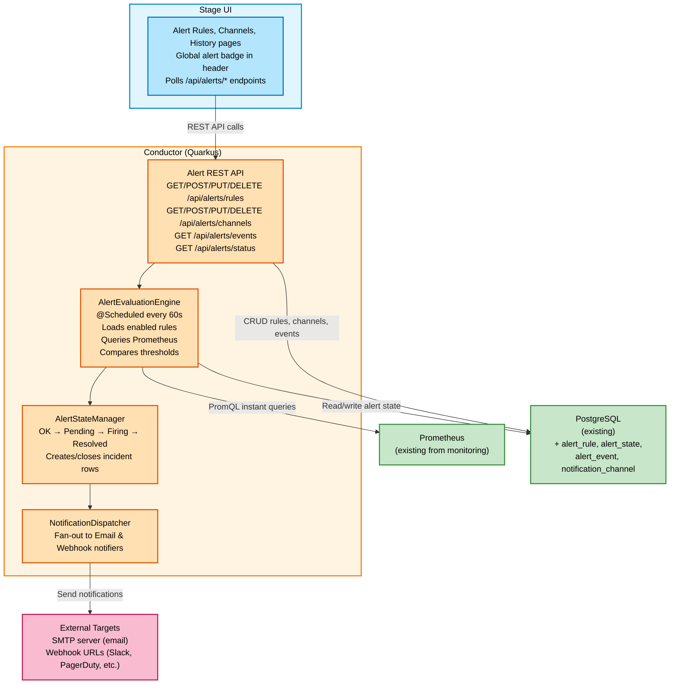

# DDD-57: Alerting for Debezium Platform

## Motivation

The Debezium Platform exposes pipeline monitoring through 14 predefined panels (DDD-38). Users can visualize metrics such as source lag, event throughput, and connection status. However, monitoring is passive: users must manually watch dashboards to detect problems.

**Why alerting is essential:**

Without alerting, operators must either:
- Watch monitoring dashboards continuously to spot degradation
- Discover pipeline problems reactively, after downstream systems are affected
- Build ad-hoc alerting outside the platform using Prometheus Alertmanager or Grafana, which requires PromQL expertise and adds operational overhead

Alerting closes this gap by letting users define threshold-based rules against existing monitoring panels and receive notifications when conditions are breached. The platform evaluates the rules, manages alert lifecycle, records incident history, and delivers notifications through email, webhooks, or the built-in UI.

## Goals

### Primary Objectives

1. **Threshold-based alert rules**: Users define rules by selecting an existing monitoring panel, a comparison operator, and a numeric threshold. No PromQL knowledge required.
2. **Global evaluation**: A rule fires for *any* pipeline that breaches its threshold. The alert event identifies which pipeline triggered it.
3. **Noise suppression**: A configurable "for" duration requires the condition to hold for N minutes before the alert fires, preventing flapping from transient spikes.
4. **Notification delivery**: Alerts are delivered through configurable channels (email and webhook), with in-app visibility always on.
5. **Incident history**: Every fire/resolve cycle is recorded as an incident, queryable and filterable for post-mortem analysis.

### Non-Goals (Future Scope)

- Alert grouping, silencing, escalation policies
- Repeat notifications while firing
- Raw PromQL mode for custom expressions
- Real-time push via SSE/WebSocket

#### Per-Pipeline Rule Scoping: Deferred by Design

The initial implementation evaluates all rules globally: a rule fires for *any* pipeline that breaches its threshold. Per-pipeline scoping, the ability to target a rule to a specific list of pipelines, is deferred to a future iteration.

**Why it's useful:**
- **Differentiated thresholds per workload type** (the strongest argument): a batch ETL pipeline may tolerate 30s of source lag, while a real-time CDC pipeline needs < 5s. A single global rule cannot express both.
- **Noise reduction for mixed workloads**: a threshold that makes sense for OLTP pipelines may fire constantly for batch ones, creating alert fatigue.
- **Selective exclusion**: operators can exclude known-noisy or under-maintenance pipelines without disabling the rule entirely.

**Why global-first is the right default:**
- Simpler UX: one rule covers everything, no risk of forgetting a pipeline.
- New pipelines are automatically covered without updating rules.
- Fewer rules to manage overall.
- Most users start with uniform rules; per-pipeline scoping is a refinement that becomes valuable as deployments grow.

**Why it's safe to defer (architectural readiness):**

The current architecture already naturally supports per-pipeline scoping at every layer. No refactoring or breaking changes are needed to add it later:

- **Database**: one new join table (`alert_rule_pipeline`) or an optional column. Additive Flyway migration, no changes to existing tables.
- **API**: add an optional `pipelineIds` field to `AlertRuleRequest`. Null/empty = global (backward compatible).
- **Evaluation engine**: the engine already produces a `Map<pipelineId, value>` from Prometheus results. Per-pipeline filtering is a one-line filter on that map before passing results to the state machine. No PromQL changes needed.
- **State machine**: already operates per `(rule, pipeline)` pair. Zero change.
- **UI**: an optional pipeline multi-select in the rule creation form. Purely additive.

## Proposed Solution: Platform-Native Alerting Engine

### Overview

The alerting system is embedded entirely within the Conductor (Quarkus backend). It extends the existing monitoring architecture by adding:

1. **Alert rules**: user-defined threshold conditions referencing existing monitoring panels
2. **Evaluation engine**: a periodic loop that queries Prometheus and compares results against thresholds
3. **State machine**: tracks alert lifecycle per rule-pipeline pair with persistence in PostgreSQL
4. **Notification subsystem**: dispatches alerts through email and webhook channels
5. **Incident history**: records every fire/resolve cycle for audit and investigation

No new infrastructure is introduced. The system reuses Prometheus (already required for monitoring) and PostgreSQL (already the platform's persistence layer).

### Architecture



### Integration with Existing Monitoring (DDD-38)

The alerting system layers on top of the monitoring stack, it does not replace or modify it:

| Monitoring Concern | Existing Component | How Alerting Uses It |
|---|---|---|
| Metric definitions | `panels.yml` + `PanelConfigLoader` | Alert rules reference panels by ID. Users pick from the same panels shown in the monitoring UI |
| Prometheus access | `PrometheusClient` (MicroProfile REST Client) | Extended with an instant query method (`/api/v1/query`). Reuses the same configured Prometheus URL |
| Metric collection | JMX / OpenTelemetry → Otel Collector → Prometheus | No change. Alerting is downstream, it only reads metrics |
| Pipeline identity | `service_name` label in Prometheus | Used to identify which pipeline triggered an alert |

Any new panel added to `panels.yml` for monitoring automatically becomes available as an alert rule target.

### Component Responsibilities

| Component | Responsibility |
|-----------|---------------|
| **AlertRuleResource** | REST API for rule CRUD, enable/disable |
| **NotificationChannelResource** | REST API for channel CRUD, test notification |
| **AlertEventResource** | REST API for querying alert history and current status |
| **AlertEvaluationEngine** | Scheduled loop (every 60s) that evaluates all enabled rules against Prometheus |
| **AlertStateManager** | State machine (OK → Pending → Firing → Resolved) with incident lifecycle. Persists all state to PostgreSQL |
| **NotificationDispatcher** | Fans out alert events to the notification channels configured on the rule |
| **EmailNotifier** | Sends alert emails via Quarkus Mailer (SMTP) |
| **WebhookNotifier** | POSTs JSON payloads to configured URLs with retry (3 attempts, exponential backoff) |
| **AlertHistoryCleanup** | Scheduled job (daily) that purges resolved incidents older than the retention period (default: 30 days). Still-firing incidents are preserved regardless of age |

## Alert Lifecycle

### Three-State Model

Alerts follow a three-state lifecycle inspired by Grafana/Prometheus. The "for" duration controls how long a condition must hold before firing, preventing noise from transient spikes.

```
                    condition met
         ┌─────────────────────────────┐
         │                             ▼
      ┌──┴──┐   condition met     ┌────────┐   "for" elapsed    ┌────────┐
      │ OK  │────────────────────►│PENDING │────────────────────►│FIRING  │
      └──┬──┘                     └───┬────┘                     └───┬────┘
         ▲                            │                              │
         │   condition not met        │ condition not met            │
         └────────────────────────────┘                              │
         ▲                                                           │
         │              condition not met                            │
         │  ┌──────────┐◄───────────────────────────────────────────┘
         └──┤ RESOLVED │
            └──────────┘
               (transitions to OK after resolution notification)
```

| Transition | Trigger | Action |
|-----------|---------|--------|
| OK → Pending | Condition met (and "for" > 0) | Record `pendingSince` timestamp |
| Pending → OK | Condition clears before "for" elapses | Silent reset, no notification |
| Pending → Firing | Condition held for full "for" duration | Create incident, dispatch **fire** notification |
| Firing → Resolved → OK | Condition clears | Close incident, dispatch **resolution** notification |
| OK → Firing | Condition met (and "for" = 0, immediate) | Create incident, dispatch **fire** notification |

### Incident Model

Each fire/resolve cycle produces one **incident** row (`alert_event`). The row is created when the alert fires (with `resolved_at = NULL`) and updated with a resolution timestamp when the alert clears. If the same rule fires and resolves multiple times for the same pipeline, each cycle produces a separate incident row, preserving full history.

### No-Data Behavior (Prometheus Staleness)

When a pipeline's pod dies, Prometheus marks its time series as stale after ~5 minutes ([staleness docs](https://prometheus.io/docs/prometheus/latest/querying/basics/#staleness)). After the stale marker, the evaluation loop receives no data for that pipeline.

The engine uses a **keep-last-state** strategy: FIRING alerts stay FIRING, PENDING alerts stay PENDING. This preserves the alert signal for root cause analysis and avoids masking failures where the pipeline died *because* of the condition that triggered the alert (e.g., source lag spiked, the operator didn't react, and the pod crashed).

When the pipeline recovers and metrics resume, the evaluation loop picks it up again:
- If the metric is below threshold, the alert resolves normally with a proper `resolvedAt` timestamp
- If the metric is still above threshold, the alert continues in its current state (PENDING timer resumes from `pendingSince`, FIRING stays FIRING)

The incident history shows the full duration from first fire to actual recovery, providing accurate data for post-mortem analysis.

### Severity Levels

Each rule has a severity: **Critical**, **Warning**, or **Info**. Severity must differ in **both color and visual elements** — not just color — following [PatternFly's Status and Severity patterns](https://www.patternfly.org/patterns/status-and-severity). Each level uses a dedicated PatternFly severity icon that conveys urgency through shape and visual weight, ensuring accessibility for color-blind users.

| Severity | Color | Icon | Badge |
|----------|-------|------|-------|
| **Critical** | Red (`--pf-v5-global--danger-color--100`) | `rh-ui-severity-critical-fill` | Counted in alert badge |
| **Warning** | Amber (`--pf-v5-global--warning-color--100`) | `rh-ui-severity-moderate-fill` | Counted in alert badge |
| **Info** | Blue (`--pf-v5-global--info-color--100`) | `rh-ui-severity-none-fill` | Not counted in badge |

## Notification Channels

Two notification channel types, plus always-on in-app visibility:

| Type | Description | Configuration |
|------|-------------|--------------|
| **In-app** (always-on) | All incidents appear in the History page and drive the alert badge. Not a configurable channel, it is a platform feature. | None required |
| **Email** | Alert sent via SMTP to configured recipients | `recipients` (list), `subjectTemplate` (optional, supports `{{rule_name}}`, `{{severity}}`) |
| **Webhook** | HTTP POST with JSON payload to a user-configured URL. Integrates with Slack, PagerDuty, OpsGenie, Teams, etc. | `url`, `method` (default POST), `headers` (optional, for auth tokens) |

Channels are named, reusable entities. One channel can serve multiple rules, and one rule can notify through multiple channels. A rule with no channels selected still evaluates and records incidents, it just doesn't send external notifications.

### Test Notification

Each channel supports a **test** action (`POST /api/alerts/channels/{id}/test`) that sends a sample payload to verify connectivity (SMTP credentials, webhook URL reachability) before the channel is used in production.

### Webhook Payload

```json
{
  "version": "1",
  "status": "firing",
  "alert": {
    "ruleName": "high-source-lag",
    "severity": "CRITICAL",
    "pipelineId": "inventory-pipeline",
    "pipelineName": "inventory-pipeline",
    "value": 15.2,
    "threshold": 10.0,
    "operator": "GREATER_THAN",
    "message": "Source lag (15.2s) exceeded threshold (10.0s)",
    "firedAt": "2026-07-21T14:30:00Z"
  }
}
```

For resolved alerts, the payload includes `"status": "resolved"` and an additional `"resolvedAt"` timestamp.

## REST API

Base path: `/api/alerts`

### Alert Rules

| Method | Path | Description |
|--------|------|-------------|
| `GET` | `/api/alerts/rules` | List all alert rules |
| `GET` | `/api/alerts/rules/{id}` | Get a rule by ID |
| `POST` | `/api/alerts/rules` | Create a new rule |
| `PUT` | `/api/alerts/rules/{id}` | Update a rule |
| `DELETE` | `/api/alerts/rules/{id}` | Delete a rule (204) |
| `PUT` | `/api/alerts/rules/{id}/enable` | Enable a rule |
| `PUT` | `/api/alerts/rules/{id}/disable` | Disable a rule |

**Create/Update request body:**

```json
{
  "name": "high-source-lag",
  "description": "Alert when source lag is too high",
  "panelId": "source-lag",
  "operator": "GREATER_THAN",
  "threshold": 10.0,
  "forDuration": "PT5M",
  "reduceFunction": "LAST",
  "evaluationWindow": "PT5M",
  "severity": "CRITICAL",
  "enabled": true,
  "channelIds": [1, 3]
}
```

| Field | Type | Required | Description |
|-------|------|----------|-------------|
| `name` | string | yes | Unique, RFC 1123 subdomain (lowercase alphanumeric + hyphens, max 253 chars) |
| `description` | string | no | Free-text description |
| `panelId` | string | yes | ID of an existing monitoring panel (from `GET /api/monitoring/panels`) |
| `operator` | enum | yes | `GREATER_THAN`, `GREATER_THAN_OR_EQUAL`, `LESS_THAN`, `LESS_THAN_OR_EQUAL`, `EQUAL`, `NOT_EQUAL` |
| `threshold` | number | yes | Numeric threshold value |
| `forDuration` | string | no | ISO-8601 duration (default `PT0S` = immediate, max `PT1H`) |
| `reduceFunction` | enum | no | How to collapse time series to a scalar: `LAST` (default), `AVG`, `MIN`, `MAX`, `SUM` |
| `evaluationWindow` | string | no | ISO-8601 duration for reduce function window (default `PT5M`, range `PT1M`–`PT1H`). Ignored when `reduceFunction` is `LAST` |
| `severity` | enum | no | `CRITICAL`, `WARNING` (default), `INFO` |
| `enabled` | boolean | no | Default `true` |
| `channelIds` | number[] | no | IDs of notification channels to attach. Empty = no external notifications |

**Response body:**

```json
{
  "id": 1,
  "name": "high-source-lag",
  "description": "Alert when source lag is too high",
  "panelId": "source-lag",
  "panelTitle": "Source Lag",
  "operator": "GREATER_THAN",
  "threshold": 10.0,
  "forDuration": "PT5M",
  "reduceFunction": "LAST",
  "evaluationWindow": "PT5M",
  "severity": "CRITICAL",
  "enabled": true,
  "channels": [
    { "id": 1, "name": "ops-email", "type": "EMAIL" },
    { "id": 3, "name": "slack-webhook", "type": "WEBHOOK" }
  ],
  "createdAt": "2026-07-21T10:00:00Z",
  "updatedAt": "2026-07-21T10:00:00Z"
}
```

### Notification Channels

| Method | Path | Description |
|--------|------|-------------|
| `GET` | `/api/alerts/channels` | List all channels |
| `GET` | `/api/alerts/channels/{id}` | Get a channel by ID |
| `POST` | `/api/alerts/channels` | Create a channel |
| `PUT` | `/api/alerts/channels/{id}` | Update a channel |
| `DELETE` | `/api/alerts/channels/{id}` | Delete a channel (204) |
| `POST` | `/api/alerts/channels/{id}/test` | Send a test notification |

**Create/Update request body:**

```json
{
  "name": "ops-email",
  "type": "EMAIL",
  "config": {
    "recipients": ["ops@example.com", "oncall@example.com"],
    "subjectTemplate": "Debezium Alert: {{rule_name}} - {{severity}}"
  },
  "enabled": true
}
```

```json
{
  "name": "slack-webhook",
  "type": "WEBHOOK",
  "config": {
    "url": "https://hooks.slack.com/services/T.../B.../xxx",
    "method": "POST",
    "headers": {
      "Authorization": "Bearer token"
    }
  },
  "enabled": true
}
```

**Response body:**

```json
{
  "id": 1,
  "name": "ops-email",
  "type": "EMAIL",
  "config": {
    "recipients": ["ops@example.com", "oncall@example.com"],
    "subjectTemplate": "Debezium Alert: {{rule_name}} - {{severity}}"
  },
  "enabled": true,
  "createdAt": "2026-07-21T10:00:00Z",
  "updatedAt": "2026-07-21T10:00:00Z"
}
```

**Test notification response:**

```json
{
  "success": true,
  "message": "Test notification sent successfully"
}
```

### Alert Events (History)

| Method | Path | Description |
|--------|------|-------------|
| `GET` | `/api/alerts/events` | List incidents (paginated, filterable) |
| `GET` | `/api/alerts/events/{id}` | Get a single incident |
| `GET` | `/api/alerts/status` | Current alert status summary (for badge) |

**Query parameters for `GET /api/alerts/events`:**

| Parameter | Type | Description |
|-----------|------|-------------|
| `severity` | string | Filter: `CRITICAL`, `WARNING`, `INFO` |
| `status` | string | Filter: `FIRING` (resolvedAt is null), `RESOLVED` (resolvedAt is not null) |
| `pipelineId` | string | Filter by pipeline |
| `ruleId` | number | Filter by rule ID |
| `from` | string | Start of date range (ISO 8601) |
| `to` | string | End of date range (ISO 8601) |
| `page` | number | Page number (default: 0) |
| `size` | number | Page size (default: 20, max: 100) |

**Event response body:**

```json
{
  "events": [
    {
      "id": 42,
      "ruleId": 1,
      "ruleName": "high-source-lag",
      "pipelineId": "inventory-pipeline",
      "pipelineName": "inventory-pipeline",
      "status": "firing",
      "value": 15.2,
      "threshold": 10.0,
      "severity": "CRITICAL",
      "message": "Source lag (15.2s) exceeded threshold (10.0s)",
      "firedAt": "2026-07-21T18:00:12Z",
      "resolvedAt": null,
      "durationSeconds": 2520,
      "createdAt": "2026-07-21T18:00:12Z"
    }
  ],
  "page": 0,
  "size": 20,
  "totalElements": 156,
  "totalPages": 8
}
```

- `status`: `"firing"` when `resolvedAt` is null, `"resolved"` when set
- `durationSeconds`: `resolvedAt - firedAt` for closed incidents, `now - firedAt` for open ones

**Status summary response (`GET /api/alerts/status`):**

```json
{
  "totalFiring": 3,
  "totalPending": 1,
  "firingBySeverity": {
    "CRITICAL": 2,
    "WARNING": 1,
    "INFO": 0
  },
  "activeAlerts": [
    {
      "ruleId": 1,
      "ruleName": "high-source-lag",
      "pipelineId": "inventory-pipeline",
      "state": "FIRING",
      "severity": "CRITICAL",
      "value": 15.2,
      "threshold": 10.0,
      "since": "2026-07-21T18:00:12Z"
    }
  ]
}
```

The UI uses `GET /api/alerts/status` to drive the global alert badge. Poll this endpoint periodically (e.g., every 30s) to keep the badge count current.

## Stage UI Integration

### Navigation

A new **"Alerts"** entry in the main sidebar navigation, with three sub-pages:

```
Sidebar
├── Pipelines
├── Sources
├── Destinations
├── Transforms
├── Alerts              ◄── NEW
│   ├── Rules
│   ├── Channels
│   └── History
└── Settings
```

### Global Alert Badge

A notification badge in the application header bar, visible on every page:

```
┌─────────────────────────────────────────────────────────────┐
│  Debezium Platform            [Alerts 🔔 3]    [User ▼]    │
└─────────────────────────────────────────────────────────────┘
```

- Shows the count of currently **firing** Critical and Warning alerts (Info excluded)
- Badge color reflects the highest active severity: red if any Critical, amber if only Warning
- Clicking the badge navigates to the alert history page filtered to `status=FIRING`
- Hidden or grayed out when no Critical/Warning alerts are firing
- Data source: `GET /api/alerts/status` → `firingBySeverity.CRITICAL + firingBySeverity.WARNING`

### Alert Rules Page

#### Rules List

```
┌──────────────────────────────────────────────────────────────────────────┐
│  Alert Rules                                        [ Create Rule ]     │
├──────────────────────────────────────────────────────────────────────────┤
│                                                                          │
│  Name              │ Metric           │ Condition         │ Severity        │ Status │
│  ──────────────────┼──────────────────┼───────────────────┼─────────────────┼────────│
│  high-source-lag   │ Source Lag        │ last > 10s for 5m │ [■ CRITICAL]    │ ● On   │
│  queue-pressure    │ Queue Utilization │ avg > 85% for 2m  │ [■ WARNING]     │ ● On   │
│  no-events         │ Time Since Last   │ last > 300s for 5m│ [■ INFO]        │ ○ Off  │
│                                                                          │
│  Actions per row: [Edit] [Enable/Disable] [Delete]                       │
└──────────────────────────────────────────────────────────────────────────┘
```

- Data source: `GET /api/alerts/rules`
- **Metric** column: display `panelTitle` from the response
- **Condition** column: formatted from `reduceFunction`, `operator`, `threshold`, and `forDuration`
- **Severity** column: colored label chip with severity icon using PatternFly Label component (`danger` + `rh-ui-severity-critical-fill` for Critical, `warning` + `rh-ui-severity-moderate-fill` for Warning, `info` + `rh-ui-severity-none-fill` for Info)
- **Status** toggle: calls `PUT /api/alerts/rules/{id}/enable` or `PUT /api/alerts/rules/{id}/disable`
- **Firing indicator**: if a rule currently has firing alerts (cross-reference with `GET /api/alerts/status`), show a red dot or badge next to its name

#### Rule Creation / Edit Form

```
┌──────────────────────────────────────────────────────┐
│  Create Alert Rule                                    │
├──────────────────────────────────────────────────────┤
│                                                       │
│  Name:        [ high-source-lag                    ]  │
│  Description: [ Alert when source lag is too high  ]  │
│                                                       │
│  ── Condition ──────────────────────────────────────  │
│                                                       │
│  When  [ Source Lag          ▼]   (panel picker)      │
│        [ last                ▼]   (reduce function)   │
│  is    [ greater than        ▼]   (operator)          │
│        [ 10.0               ]     (threshold)         │
│  for   [ 5 minutes          ▼]   (duration picker)    │
│                                                       │
│  ── Severity ──────────────────────────────────────   │
│                                                       │
│  (●) Critical  (○) Warning  (○) Info                  │
│                                                       │
│  ── Notify via ────────────────────────────────────   │
│                                                       │
│  ℹ Alerts always appear in the platform UI             │
│    (history page and alert badge)                      │
│                                                       │
│  Additional channels:                                  │
│  [✓] ops-email           (Email)                      │
│  [✓] slack-webhook       (Webhook)                    │
│                                                       │
│              [ Cancel ]  [ Create Rule ]              │
└──────────────────────────────────────────────────────┘
```

**Form fields and data sources:**

| Field | Component | Data Source | Notes |
|-------|-----------|------------|-------|
| Name | Text input | Static | Validated: RFC 1123 subdomain |
| Description | Text area | Static | Optional |
| Panel picker | Dropdown | `GET /api/monitoring/panels` | Group by `category` (Streaming, Snapshot). Show `description` as helper text when selected. Display the panel's `unit` next to the threshold input |
| Reduce function | Dropdown | Static | `last` (default), `avg`, `min`, `max`, `sum`. Show helper text: "Monitoring panels produce time series: this determines how the series is collapsed to a single value for comparison" |
| Operator | Dropdown | Static | `greater than`, `greater than or equal to`, `less than`, `less than or equal to`, `equal to`, `not equal to` |
| Threshold | Numeric input | Static | Unit label updates dynamically based on selected panel's `unit` |
| Duration | Dropdown | Static | Immediately (PT0S), 1 minute (PT1M), 2 minutes (PT2M), 5 minutes (PT5M), 10 minutes (PT10M), 15 minutes (PT15M), 30 minutes (PT30M) |
| Severity | Radio buttons | Static | Critical (red, `rh-ui-severity-critical-fill`), Warning (amber, `rh-ui-severity-moderate-fill`), Info (blue, `rh-ui-severity-none-fill`). Default: Warning |
| Channels | Checkbox list | `GET /api/alerts/channels` | Show info banner: "Alerts always appear in the platform UI (history page and alert badge)". If no channels exist, show link to Channels page |

> **Note**: Operator, reduce function, severity, and duration values are all **static lists owned by the frontend**. They are not provided by a platform API endpoint. The backend accepts the corresponding enum values (`GREATER_THAN`, `LAST`, `CRITICAL`, `PT5M`, etc.) as documented in the API section above.

When `reduceFunction` is not `last`, show an additional **Evaluation Window** dropdown (also static) with options: 1 minute, 2 minutes, 5 minutes (default), 10 minutes, 15 minutes, 30 minutes, 1 hour.

When a panel returns multiple series per pipeline (this metadata could be inferred or noted), show helper text: "Multiple series from this panel will be summed."

- Create: `POST /api/alerts/rules`
- Edit: `PUT /api/alerts/rules/{id}`

### Notification Channels Page

#### Channels List

```
┌──────────────────────────────────────────────────────────────────────────┐
│  Notification Channels                              [ Create Channel ]   │
├──────────────────────────────────────────────────────────────────────────┤
│                                                                          │
│  Name              │ Type     │ Details                  │ Status        │
│  ──────────────────┼──────────┼──────────────────────────┼───────────────│
│  ops-email         │ Email    │ ops@example.com (+2)     │ ● Enabled     │
│  slack-webhook     │ Webhook  │ hooks.slack.com/...      │ ● Enabled     │
│                                                                          │
│  Actions per row: [Edit] [Test] [Delete]                                 │
└──────────────────────────────────────────────────────────────────────────┘
```

- Data source: `GET /api/alerts/channels`
- **Details** column: for Email, show first recipient + count of additional (`ops@example.com (+2)`). For Webhook, show truncated URL
- **Test** button: calls `POST /api/alerts/channels/{id}/test`. Show result as toast notification: green for success, red for failure with error message

#### Channel Creation Form

The form adapts based on the selected channel type:

```
┌──────────────────────────────────────────────────────┐
│  Create Notification Channel                          │
├──────────────────────────────────────────────────────┤
│                                                       │
│  Name: [ ops-email                                ]   │
│  Type: (●) Email  (○) Webhook                          │
│                                                       │
│  ── Email Configuration ───────────────────────────   │
│                                                       │
│  Recipients:                                          │
│  [ ops@example.com              ] [x]                 │
│  [ oncall@example.com           ] [x]                 │
│  [ + Add recipient ]                                  │
│                                                       │
│  Subject template:                                    │
│  [ Debezium Alert: {{rule_name}} - {{severity}}    ]  │
│                                                       │
│              [ Cancel ]  [ Create Channel ]           │
└──────────────────────────────────────────────────────┘
```

**Email config fields:**
- Recipients (list of email inputs with add/remove)
- Subject template (text input, supports `{{rule_name}}` and `{{severity}}` placeholders)

**Webhook config fields:**
- URL (text input, HTTPS required in production)
- HTTP method selector (POST default)
- Headers key-value editor (for authentication tokens)

- Create: `POST /api/alerts/channels`
- Edit: `PUT /api/alerts/channels/{id}`

### Alert History Page

A paginated, filterable table showing all incidents. Each row is one incident, a single fire/resolve cycle:

```
┌─────────────────────────────────────────────────────────────────────────────────┐
│  Alert History                                                                   │
├─────────────────────────────────────────────────────────────────────────────────┤
│                                                                                  │
│  Filters: [Severity ▼] [Status ▼] [Pipeline ▼] [Rule ▼] [Date range]           │
│                                                                                  │
│  Severity        │ Rule             │ Pipeline  │ Status   │ Fired At │ Duration      │
│  ────────────────┼──────────────────┼───────────┼──────────┼──────────┼───────────────│
│  [■ CRITICAL]    │ high-source-lag  │ inventory │ Firing   │ 18:00    │ 42m (ongoing) │
│  [■ WARNING]     │ queue-pressure   │ orders    │ Resolved │ 16:00    │ 10m           │
│  [■ WARNING]     │ queue-pressure   │ payments  │ Resolved │ 14:30    │ 5m            │
│  [■ CRITICAL]    │ high-source-lag  │ inventory │ Resolved │ 14:30    │ 5m            │
│                                                                                  │
│  ── Detail panel (expanded row) ──────────────────────────────────────────────   │
│  │ Severity:    [■ CRITICAL]                                                 │  │
│  │ Fired at:    2026-07-21 18:00:12 UTC                                      │  │
│  │ Resolved at: -                                                             │  │
│  │ Duration:    42 minutes (ongoing)                                          │  │
│  │ Value:       15.2s (threshold: > 10.0s)                                    │  │
│  │ Message:     Source lag (15.2s) exceeded threshold (10.0s)                 │  │
│  └────────────────────────────────────────────────────────────────────────────   │
│                                                                                  │
│  Showing 1-20 of 156                         [ < ] [ 1 ] [ 2 ] ... [ > ]        │
└─────────────────────────────────────────────────────────────────────────────────┘
```

- Data source: `GET /api/alerts/events` with filter query parameters
- **Status** column: `"Firing"` when `resolvedAt` is null, `"Resolved"` when set
- **Duration**: computed from `durationSeconds` in the response. Show "ongoing" suffix for firing incidents
- **Severity**: colored label chip with severity icon (PatternFly Label: `danger` + `rh-ui-severity-critical-fill`, `warning` + `rh-ui-severity-moderate-fill`, `info` + `rh-ui-severity-none-fill`)
- Rows are color-coded by severity: subtle red tint for Critical, subtle amber for Warning
- **Firing** incidents are pinned to the top of the list
- Clicking a row expands the detail panel (use PatternFly expandable row pattern)
- Clicking the **pipeline name** navigates to that pipeline's monitoring dashboard
- **Filters**: multi-select dropdowns, mapped to query parameters. Date range picker with presets: Last hour, Last 24 hours, Last 7 days, Last 30 days, Custom
- **Pagination**: controlled by `page` and `size` query parameters. Response includes `totalElements` and `totalPages`

### Interaction Flows

#### Creating a Rule

1. User navigates to **Alerts → Rules**
2. Clicks **Create Rule**
3. Fills in name, selects metric panel from dropdown, sets operator and threshold
4. Optionally adjusts reduce function and "for" duration (default: last, immediate)
5. Selects severity level
6. Checks one or more notification channels
7. Clicks **Create Rule** → `POST /api/alerts/rules`
8. Redirected to rules list; new rule appears as enabled
9. Within the next evaluation cycle (default: 60s), the engine begins evaluating

#### Investigating a Firing Alert

1. User sees the alert badge showing "3" → `GET /api/alerts/status`
2. Clicks the badge → navigated to History page with `?status=FIRING`
3. Sees three firing alerts across two rules and two pipelines
4. Expands a row to see the full message, timestamps, and current value
5. Clicks pipeline name → navigated to pipeline monitoring dashboard

#### Testing a Notification Channel

1. User navigates to **Alerts → Channels**
2. Clicks **Test** on a webhook channel → `POST /api/alerts/channels/{id}/test`
3. Success: green toast "Test notification sent successfully"
4. Failure: red toast "Test failed: Connection refused" with error detail

## Reduce Function (Time Series to Scalar)

Monitoring panels produce time series (charts). Alerting needs a single value to compare against a threshold. The **reduce function** bridges this gap:

| Reduce | UI Label | Behavior | Best For |
|--------|----------|----------|----------|
| `LAST` | "last" (default) | Most recent value | Gauges: source lag, connection status, queue utilization |
| `AVG` | "avg" | Average over evaluation window | Noisy metrics: event rates, throughput |
| `MIN` | "min" | Minimum over evaluation window | "Never drops below" rules |
| `MAX` | "max" | Maximum over evaluation window | "Never exceeds" rules |
| `SUM` | "sum" | Sum over evaluation window | Cumulative thresholds |

The **evaluation window** (default: 5 minutes) determines the time range over which the reduce function operates. Only applies when reduce is not `LAST`.

## References

- [DDD-38: Pipeline Monitoring for Debezium Platform](DDD-38.md), foundation this feature builds on
- [Grafana Alerting](https://grafana.com/docs/grafana/latest/alerting/), design inspiration
- [Prometheus Alerting Rules](https://prometheus.io/docs/prometheus/latest/configuration/alerting_rules/), evaluation model reference
