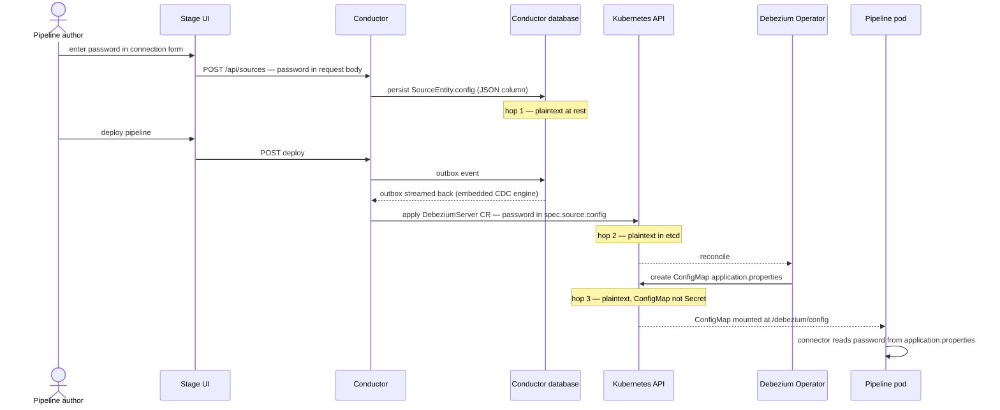

# DDD-67: Credentials Management for Debezium Platform

<!-- TODO: status line / issue link once the PR is opened. Number reserved by
     https://github.com/debezium/debezium-design-documents/issues/67 -->

## Motivation

The Debezium Platform enables users to create and manage data pipelines through the Stage UI.
However, the platform currently does not provide a secure mechanism to store, rotate, and audit 
secrets -- passwords, API tokens, certificates, encryption keys, etc.
Credentials management is critical for security and compliance, and for production use.

## Current state

Secrets currently travel a three-hop plaintext path
through Debezium Platform:

1. Source and destination configuration — password included — is stored as a
   plain `Map` persisted to a JSON column in the conductor database
   (`SourceEntity.config`, `DestinationEntity.config`).
2. `PipelineMapper.createSource()` copies that config verbatim into the
   `DebeziumServer` CR spec.
3. The operator renders the whole configuration into a **ConfigMap**
   (`application.properties`), not a Secret, mounted into the pipeline pod.



Every hop stores the credential in the clear. ConfigMaps have no separate RBAC
tier, sit outside the etcd encryption-at-rest providers that cover Secrets, and
routinely appear in support bundles and GitOps diffs.

A seam intended for credentials exists but is dormant end to end: the `Vault`
entity has REST CRUD, persistence and outbox events on create/update/delete,
join tables binding it to sources, destinations and transforms — and then the
watcher flow ends at a no-op (`OperatorVaultController.deploy()` is an empty
stub), `PipelineMapper` reads none of it, and the Stage UI never calls the
API. Even fully wired, today's entity models a secret *container* (a plaintext
`Map`, `plaintext` boolean included), not a reference to an external store.

Beyond exposure at rest, the model has no rotation story. Credentials are
long-lived shared secrets; the only rotation primitive in the surrounding
ecosystem (External Secrets Operator, Vault Secrets Operator) is a rollout
restart of the consuming Deployment — wrong for a connector holding a
replication slot, where the deployment strategy is `Recreate` and every bounce
is a hard gap in streaming.

## Goals

- Provide a **reference implementation using [OpenBao](https://openbao.org/)**
  — open source (MPL-2.0, a Linux Foundation project), API-compatible with
  HashiCorp Vault, and therefore license-safe for an Apache-2.0 project to
  document and test against.
- **Support other secret stores and workload identities** by design: stores
  (HashiCorp Vault, AWS Secrets Manager, Azure Key Vault, GCP Secret Manager)
  plug in behind the `SecretStore` SPI; identity verifiers that decorate the
  ServiceAccount rather than the pod (AWS IRSA, Azure Workload Identity, GCP
  Workload Identity Federation) are covered by bring-your-own ServiceAccount.
- Pipeline configuration carries **references, not values** — no credential is
  written to the conductor database, the `DebeziumServer` CR, or any
  ConfigMap. Because resolution operates on configuration properties, it is
  agnostic to what the secret is for: a JDBC database password, an API key for
  an external REST service invoked from a transform, a Kafka SASL password, an
  offset-store credential.
- The pipeline pod **fetches its own credentials** from a secret store,
  authenticating with a Kubernetes identity it cannot forge (audience-scoped
  projected ServiceAccount token).
- **Dynamic database credentials**: short-lived roles minted per pod by the
  secret store's database engine, with an expiry the DBA controls.
- **Static secrets** (Kafka SASL passwords, HTTP tokens, …) resolved from KV
  storage through the same mechanism.
- The mechanism is **backend-agnostic**: an SPI with one implementation per
  secret store, starting with OpenBao.
- **Inert by default**: both the Debezium Server and platform changes activate
  only when explicitly configured; existing deployments are untouched.

## Non-goals

- **Per-pipeline credential segregation.** The trust boundary of this design is
  the Debezium Platform instance: one auth role and one policy, so every
  pipeline pod holds the same secret-store permissions, and any operator who
  can create a pipeline can bind any credential reference. Pipelines within an
  instance are mutually trusted. Finer segregation is future work (see
  *Future Work*).
- **Production installation of the secret store** (TLS, storage, unseal,
  backup). The reference implementation documents it; this design assumes a
  reachable, configured OpenBao.
- **Human SSO.** This is workload identity; user authentication to the
  platform is a separate concern.

## Proposed Changes

### Overview

<!-- TODO: architecture diagram (DDD-67/ directory, commit the .excalidraw
     source alongside the rendered image) -->

The design has two independent halves:

1. **Debezium Server** gains a secret-resolution SPI. A configuration property
   carries a reference such as `${vault::openbao/password}`; a SmallRye
   `SecretKeysHandler` resolves it when the configuration is read — before any
   Kafka client, JDBC driver or sink sees it. `SecretStore` is the SPI;
   `OpenBaoSecretStore` is the first implementation (Kubernetes auth, plain
   `java.net.http`, zero new dependencies).
2. **Debezium Platform** (conductor + chart) provisions what the pod needs to
   resolve those references: a per-pipeline ServiceAccount with
   `automountServiceAccountToken: false`, an audience-scoped projected token
   volume, and the vault coordinates (address, path, auth role) as pod
   environment. Gated behind `pipeline.vault.enabled: false`.

A third actor is a **human operator**, not code: the platform is operated, not
provisioned as code. Secret-store setup is a short, ordered list of commands an
operator runs and verifies — once per platform (Kubernetes auth method), once
per database (mount, connection config, role template, root rotation, policy),
and one `kv put` per static secret.

### Reference syntax and resolution (Debezium Server)

```properties
debezium.source.database.user=${vault::openbao/username}
debezium.source.database.password=${vault::openbao/password}
debezium.sink.kafka.producer.sasl.jaas.config=...password="${vault::kafka/password}";
```

- `vault` is the fixed handler name — SmallRye dispatches on it, so it does not
  vary per backend; the `SecretStore` SPI exists so that it never has to.
- `openbao` / `kafka` are **vault names**. The mapping from a name to a backend
  and path is configuration, not part of the reference:

```properties
debezium.vault.names=openbao,kafka
debezium.vault.openbao.address=http://openbao.openbao.svc:8200
debezium.vault.openbao.path=db/ecommerce/creds/pipeline
debezium.vault.kafka.address=http://openbao.openbao.svc:8200
debezium.vault.kafka.path=secret/data/debezium/demo/kafka
```

The reference deliberately carries no path: a pipeline author cannot type a
reference that reads somewhere else, and nothing environment-specific blocks
promoting a pipeline definition between environments.

References are expanded even when embedded inside a larger value (the Kafka
JAAS line above), and resolution covers every property — source, sink, offset
storage, schema history. The latter two belong to neither source nor sink,
which is the structural argument for resolving at the configuration layer
rather than per connector.

`OpenBaoSecretStore` authenticates via `auth/kubernetes/login` with the
projected token, then reads the configured path. Response handling covers both
dynamic engines (`data` is the flat credential map) and KV v2 (values nested
under `data.data` beside `data.metadata` — detected by shape, not configured).
An empty result is an error, never a silent no-op.

<!-- TODO: SecretStore interface snippet + config model class names once the
     debezium-server PR is shaped -->

### Pod identity and provisioning (Debezium Platform)

When `pipeline.vault.enabled: true`, the conductor:

- creates a per-pipeline ServiceAccount (`<pipeline>-sa`, server-side apply,
  label-based lifecycle) with `automountServiceAccountToken: false`;
- mounts an audience-scoped projected token via `runtime.storage.external`
  (`audience: openbao` — a claim inside the token, so it cannot be replayed
  against the Kubernetes API server);
- passes the vault coordinates to the pod as environment variables
  (`DEBEZIUM_VAULT_NAMES`, `_ADDRESS`, `_PATH`, `_AUTH_ROLE`,
  `_AUTH_TOKEN_PATH`);
- substitutes `${vault::…}` references for the source credential properties.

Measured result: the pod's only token is the projected one. It cannot call the
Kubernetes API (`401`); a token stolen from the pod is only good for logging in
to the secret store as the pipeline role. No component holds both cluster
power and a database credential:

| Component | K8s API access | DB credential |
|---|---|---|
| Conductor | yes — creates CRs | **no** |
| Operator | yes — reconciles | no |
| Pipeline pod | **no** | yes — short-lived, self-fetched |

Related: the operator today binds its config-view Role (namespace-wide read on
Secrets and ConfigMaps) to user-supplied ServiceAccounts as well as its own
([debezium/dbz#2327](https://github.com/debezium/dbz/issues/2327)). With
automount off the grant is inert, but that is two settings cancelling out, not
a protection; dbz#2327 makes the property robust.

### Conductor data model: the Vault entity as a reference catalog

The conductor already carries the schema for this design, built for a
different purpose. The `Vault` entity today models a secret *container*; this
design repurposes it as a **catalog of references** — records that point at
credentials the platform can never read.

- **Fields.** `address`, `path` and `authRole` are added; `plaintext` and the
  items-as-values semantics are retired. `items` survives as the list of key
  names the reference serves (`username`/`password` for a database mount;
  typed in by the operator for a KV entry, since the conductor holds no token
  to list keys).
- **Registration.** Creating the vault record becomes the operator's final
  per-database step: after configuring `db/ecommerce` in the secret store,
  they register the `ecommerce` reference in the UI. Secret-store
  configuration is the authorization decision; the vault record is its
  publication to platform users, and it is what the credential dropdown in
  the source and destination forms lists.
- **Binding.** The initial conductor schema already creates the link tables
  `source_vault`, `destination_vault` and `transform_vault`
  (`V3.1.0__initial_database.sql`); no code reads them today. They become the
  binding: a `source_vault` row linking a source to vault `ecommerce` is what
  tells `PipelineMapper`, when it builds the CR for a pipeline using that
  source, to substitute `${vault::ecommerce/…}` for the credential properties
  and to emit that vault's coordinates as pod environment. The chart-level
  `pipeline.vault.*` values are the single-vault first increment of the same
  mechanism.
- **No writes to the secret store.** `OperatorVaultController.deploy()` stays
  empty by design — the platform holds no secret-store write access. The
  existing vault outbox events find a different purpose: an edit to a
  reference's *coordinates* must propagate to the pipelines bound to it
  (regenerated CRs, hence pod restarts), because references resolve once at
  pod startup. Adding a key in the secret store, by contrast, triggers
  nothing until a source edit introduces a reference to it — that edit flows
  through the normal pipeline-update path and redeploys the pod.

### Operator responsibilities

| Work | Cadence | How |
|---|---|---|
| Enable Kubernetes auth, write auth config | once per platform | documented commands |
| Postgres bootstrap role + grants; `db/<database>` mount; connection config; `rotate-root`; role template; policy; auth role | once per database | documented commands |
| Static secret (`bao kv put`) | per secret | documented command |
| Bind vault name → source in a pipeline | per pipeline | platform UI |

Two properties settle the DBA conversation: after `rotate-root`, **no human
knows the bootstrap password**; and the DBA writes the `creation_statements`
SQL template themselves — the privilege ceiling is set by the DBA, in SQL they
can read.

<!-- TODO: decide how much of the per-database command sequence belongs here
     vs. in reference-implementation docs -->

### Security model and measured behavior

Findings from the proof of concept (local k3d lab, OpenBao 2.6.2, CNPG
PostgreSQL 16) that the design depends on — measured, not assumed:

- **Lease operations are not token-scoped.** Any token whose policy grants
  `sys/leases/renew`/`revoke` (body form) can renew or revoke *any* lease it
  names, across pipelines. This is consistent with the instance-level trust
  boundary, and it is why per-pipeline segregation cannot be achieved by
  policy alone.
- The CLI **path form** (`sys/leases/revoke/<id>`) is a different ACL path and
  is denied under exact-path rules — client code must use the body form.
- `token_no_default_policy=true` **breaks** `auth/token/renew-self` (403); the
  `default` policy stays.
- A whole-object write on a role, policy or auth config **replaces** it;
  partial writes silently detach fields. Every documented command carries the
  full parameter set plus a verification read.
- Dropping a PostgreSQL role does **not** terminate an established replication
  connection; revocation takes effect at the next connection attempt. No
  stable role needs to own the slot; publications and slots must be owned by
  durable roles regardless.

### Requirements

The minted role holds `SELECT` and `REPLICATION` only, which imposes:

- `publication.autocreate.mode=disabled` — publications are owned objects, and
  `FOR ALL TABLES` needs superuser; a pipeline on defaults fails at startup
  with an error that reads as a connector fault.
- `ALTER DEFAULT PRIVILEGES` on the schema-owning user, or tables added later
  are invisible to every credential minted afterwards (an empty snapshot, not
  an error).
- The pipeline policy needs `update` on `sys/leases/renew` and
  `sys/leases/revoke` in addition to `read` on the creds path — with `read`
  alone the pod starts fine and wedges silently at lease expiry.
- One logical replication slot per pipeline; `max_replication_slots` must be
  sized for pipelines plus standbys.

### Backward compatibility

Nothing activates by default on either side. Debezium Server behaves
identically unless `debezium.vault.names` is set; the platform chart ships
`pipeline.vault.enabled: false` and the conductor emits today's plaintext
config when it is off. No offset formats, topic naming or public APIs change.

### Implementation steps

1. `debezium-server`: `SecretStore` SPI, `OpenBaoSecretStore`, SmallRye
   handler, config model, unit tests. Inert by default.
2. `debezium-platform`: per-pipeline ServiceAccount, projected token volume,
   vault environment and reference substitution behind
   `pipeline.vault.enabled` (single platform vault via chart values). Tests
   both ways.
3. `debezium-platform`: evolve the `Vault` entity into the reference catalog
   (coordinate fields, key list, binding read in `PipelineMapper`) and
   implement the Stage vault page and credential dropdown.
4. `debezium-operator`: dbz#2327 — gate the config-view RBAC on
   `kubernetes-config` being enabled (independent, unblocks the "no silent
   widening" property).
5. Lease renewal in `OpenBaoSecretStore` (auth token + secret lease, modelled
   on Spring Vault's `SecretLeaseContainer`), plus `close()` revoking the held
   lease. <!-- TODO: same PR as step 1 or follow-up — pending discussion -->
6. Reference-implementation documentation: secret-store install and the
   operator command sequences.

## Rejected Alternatives

- **External Secrets Operator** — no lease lifecycle; each refresh mints a new
  credential and orphans the previous lease. Fine for static KV, wrong for
  dynamic database credentials.
- **Vault Secrets Operator** — correct lease handling, but BUSL-1.1; and like
  ESO its rotation primitive is a rollout restart, a hard streaming gap under
  `Recreate`.
- **Kafka `ConfigProvider`** — solves the same problem one layer lower, for
  Kafka properties only. Config-layer resolution covers every property with
  one mechanism; Kafka's provider remains the right tool for raw Kafka clients
  outside Debezium Server.
- **`quarkus-vault`** — transparent renewal exists, but its expiry answer is
  datasource `max-lifetime`, and Debezium does not use a Quarkus datasource;
  it would also bind the deliberately dependency-free SPI to Quarkus.
- **`connection.factory.class` as the primary mechanism** — measured and
  working including on the replication path, but JDBC-only; it cannot reach a
  Kafka sink, schema history or offset storage. Retained as a possible
  complement for credentials shorter-lived than the pipeline (e.g. AWS RDS
  IAM's 15-minute tokens).
- **Conductor-mediated custody** (conductor fetches and injects) —
  concentrates blast radius in the component with cluster power and inherits
  restart-to-rotate.
- **Identity-templated policies** (`db/{{identity.entity.metadata.database}}`)
  — requires the platform to write identity entities, which is adjacent to
  policy administration; bakes one-database-per-pipeline into a flat metadata
  map; entity lifecycle on pipeline recreate/delete is unspecified.

## Open Questions

- **Where does renewal land** — inside the initial `debezium-server` PR or a
  follow-up (implementation step 4)? Related decision: fail-closed or fail-open
  when renewal fails (today an expired lease drops the minted role while the
  established stream keeps running — silently).
- **`max_ttl` is a ceiling on uninterrupted pipeline lifetime.** Configuration
  is read once at startup, so renewal cannot pass `max_ttl` and the pipeline
  must restart to obtain a new credential. Acceptable with `max_ttl` in days?
  Or does reconnect-time re-resolution need an upstream seam?
- **UI surface**: with vault enabled the credential field becomes a dropdown of
  references. Every platform operator sees — and can bind — every reference;
  acceptable under the instance trust boundary, stated here so it is a
  decision rather than a surprise.

## Future Work

- Per-pipeline segregation: per-database policies and auth roles, which
  requires replacing `bound_service_account_names="*"` (per-database
  namespaces are the variant that avoids a per-pipeline secret-store step).
- Converting offset storage and schema history JDBC credentials to
  `${vault::…}` references (mechanism already covers them).
- Additional engines behind the same SPI: cloud secret managers, `aws`/`gcp`/
  `azure` dynamic engines, PKI for Kafka mTLS (needs `update`, not `read`).
- The conductor's own database credential (its embedded outbox CDC engine) as
  a `${vault::…}` consumer.

## References

- [debezium/dbz#2340](https://github.com/debezium/dbz/issues/2340) — platform
  vault integration issue
- [debezium/dbz#2327](https://github.com/debezium/dbz/issues/2327) — operator
  RBAC gating
- [SmallRye Config secret handlers](https://smallrye.io/smallrye-config/Main/config/secret-keys/)
- [Kafka configuration providers](https://kafka.apache.org/documentation/#config_providers)
- [Spring Vault `SecretLeaseContainer`](https://docs.spring.io/spring-vault/reference/vault/propertysource.html)
  — the renewal design to model
- [OpenBao database secrets engine](https://openbao.org/docs/secrets/databases/)
