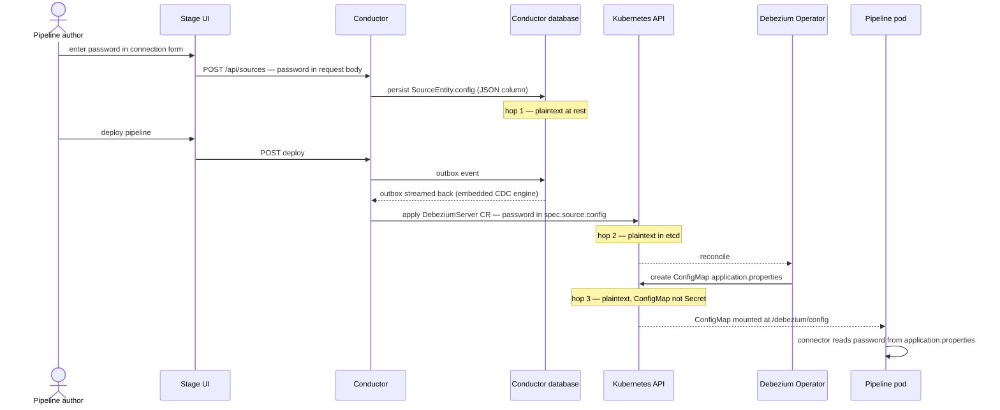
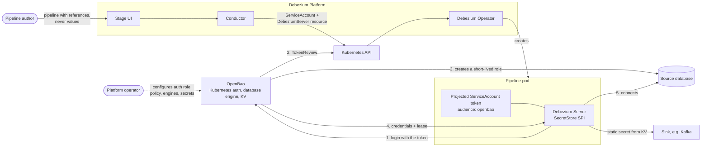
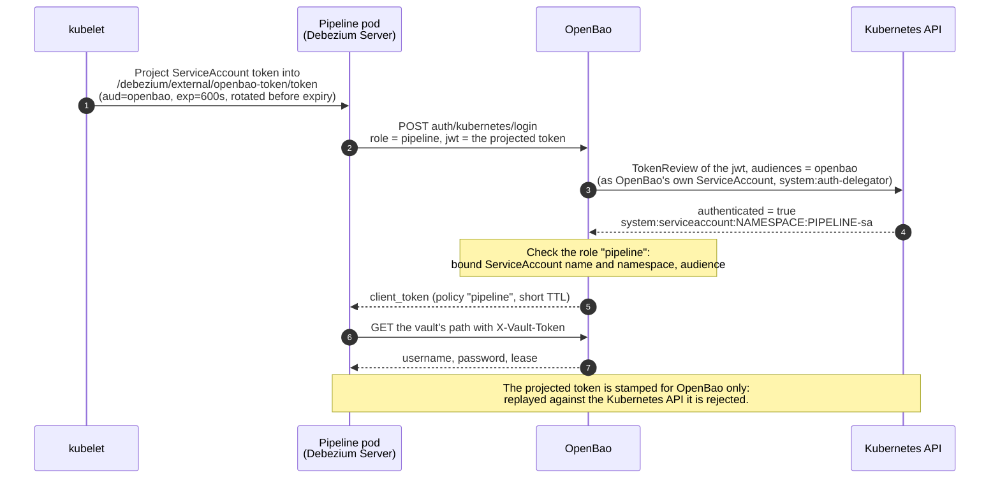
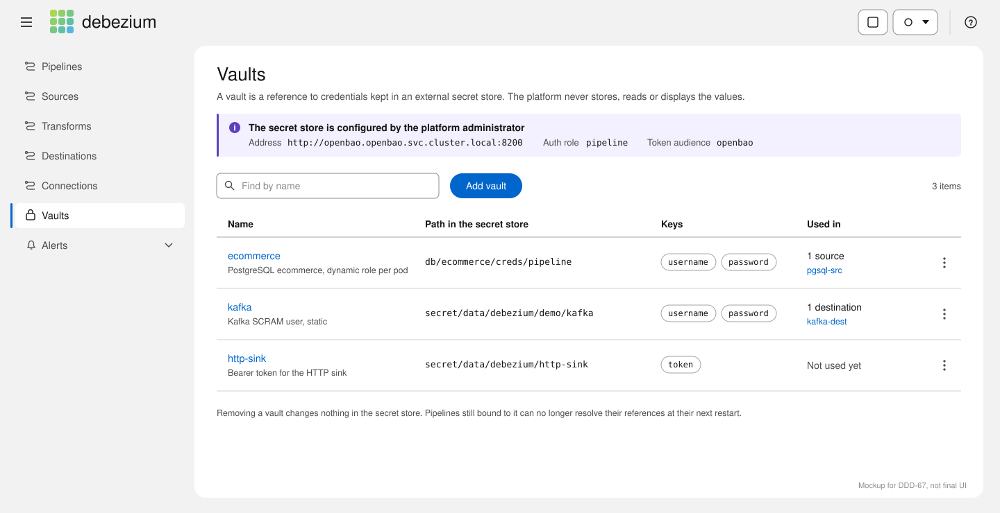
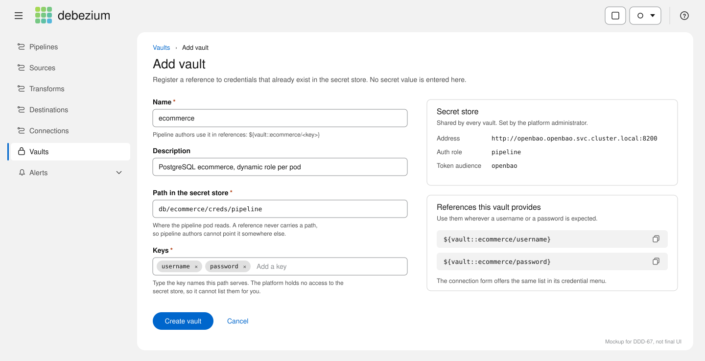
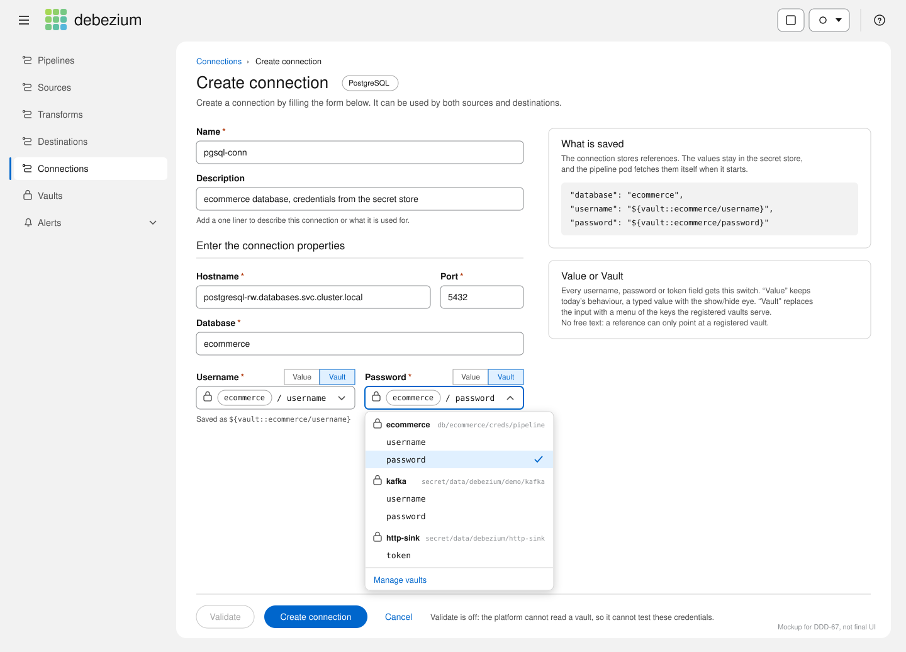
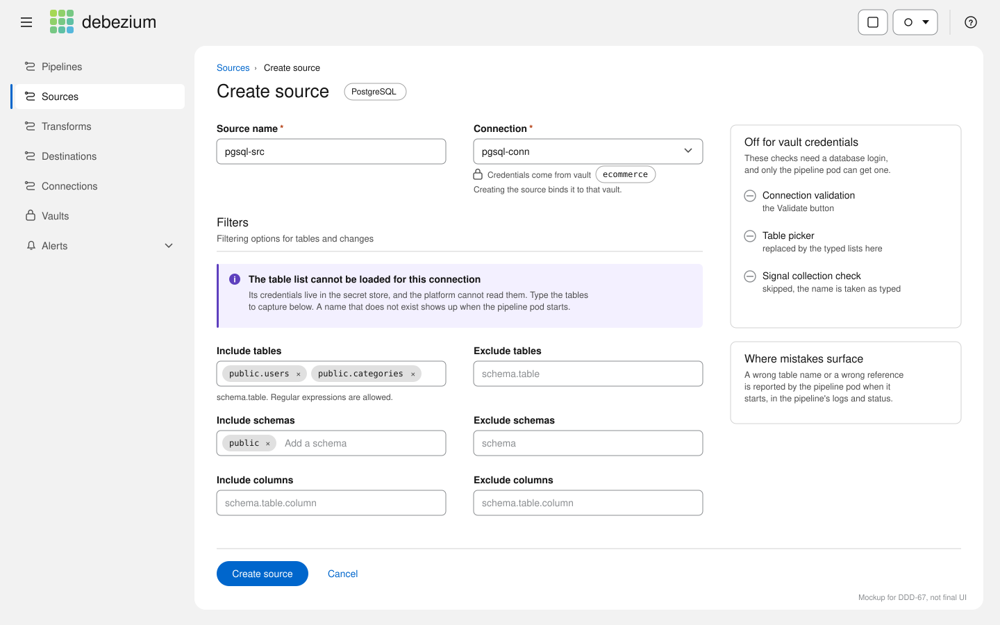

# DDD-67: Credentials Management for Debezium Platform

## Motivation

The Debezium Platform enables users to create and manage data pipelines through the Stage UI.
However, the platform currently does not provide a secure mechanism to store, rotate, and audit
secrets – passwords, API tokens, encryption keys, etc.
Credentials management is critical for security and compliance, and for production use.

## Current state

Secrets currently travel a plaintext path
through Debezium Platform:

1. Connector configuration — source, destination, transform, and connection — password included, is stored as a
   plain `Map` persisted to a JSON column in the conductor database
   (`SourceEntity.config`, `DestinationEntity.config`).
2. `PipelineMapper.createSource()` copies that config as-is into the
   `DebeziumServer` CR spec.
3. The operator renders the whole configuration into a **ConfigMap**
   (`application.properties`), not a Secret, mounted into the pipeline pod.



Every hop stores the credential in the clear. Read access to ConfigMaps is usually
granted far more widely than access to Secrets, and ConfigMaps are not guaranteed to have the same encryption-at-rest protection as Secrets.
Many clusters encrypt Secrets but not ConfigMaps. So if you put credentials in a ConfigMap,
those credentials may be stored with weaker protection and may be easier to leak.
ConfigMaps also often get included in troubleshooting exports, so any credentials
stored there may be accidentally shared.

The platform already includes the beginnings of a credentials mechanism, but it is not wired up: the `Vault`
entity has REST CRUD, persistence and outbox events on create/update/delete,
join tables binding it to sources, destinations, and transforms — but then the
watcher flow ends at a no-op (`OperatorVaultController.deploy()` is an empty
stub), `PipelineMapper` reads none of it, and the Stage UI never calls the
API. Even fully wired, today's entity models a secret _container_ (a plaintext
`Map`, `plaintext` boolean included), not a reference to an external store.

This approach also makes credential rotation difficult. The credentials are shared
secrets that tend to live for a long time. Tools like External Secrets Operator or
Vault Secrets Operator can update the secret value, but the usual way to make the
application pick up that change is to restart the Deployment.

For JDBC connectors, this is typically not a good fit. The connector holds a replication
slot and uses a `Recreate` deployment strategy, so each restart fully stops streaming
before starting it again. In practice, every credential rotation would cause an interruption in the data stream.

## Goals

- Provide a **reference implementation using [OpenBao](https://openbao.org/)**
  — open source (MPL-2.0, a Linux Foundation project), API-compatible with
  HashiCorp Vault.
- **Support other secret stores and workload identities** by design: stores
  (HashiCorp Vault, AWS Secrets Manager, Azure Key Vault, GCP Secret Manager)
  plug in behind the `SecretStore` SPI; identity verifiers that decorate the
  ServiceAccount rather than the pod (AWS IRSA, Azure Workload Identity, GCP
  Workload Identity Federation) are covered by bring-your-own ServiceAccount.
- Pipeline configuration carries **references, not values** — no credential is
  written to the conductor database, the `DebeziumServer` CR, or any
  ConfigMap. Because resolution operates on configuration properties, it is
  agnostic to what the secret is for: a JDBC database password, an API key for
  an external REST service invoked from a transform, a Kafka SASL password, an
  offset-store credential.
- The pipeline pod **fetches its own credentials** from a secret store,
  authenticating with a Kubernetes identity it cannot forge (audience-scoped
  projected ServiceAccount token).
- **Dynamic database credentials**: short-lived database roles are created for
each pod by the secret store's database engine. Today, those roles are valid
for the configured TTL. PostgreSQL only checks credentials when a connection
is created, so existing connections can keep working until they are recreated.
Lease renewal is not implemented yet, but this model provides the foundation
for renewing credentials in the future, up to the configured maximum TTL.
- **Static secrets** (Kafka SASL passwords, HTTP tokens, …) resolved from KV
  storage through the same mechanism.
- The mechanism is **backend-agnostic**: an SPI with one implementation per
  secret store, starting with OpenBao.
- **Inert by default**: both the Debezium Server and platform changes activate
  only when explicitly configured; existing deployments are untouched.

## Out of scope

- **Lease renewal.** Future work. The design leaves room for it, and it is straightforward for OpenBao with PostgreSQL.
- **Per-pipeline credential segregation.** The trust boundary of this design is
  the Debezium Platform instance: one auth role and one policy, so every
  pipeline pod holds the same secret-store permissions, and any operator who
  can create a pipeline can bind any credential reference. Pipelines within an
  instance are mutually trusted. Finer segregation is future work.
- **Production installation of the secret store** (TLS, storage, unseal,
  backup). The reference implementation documents it; this design assumes a
  reachable, configured OpenBao.
- **Human SSO.** This is workload identity; user authentication to the
  platform is a separate concern – OpenBao supports OIDC natively though.
- **Infrastructure as Code** is out of scope for now. The implementation thus
  requires a human operator to operate and configure the secret store.

## Proposed Changes

### Overview



The design has two independent halves:

1. **Debezium Server** gains a secret-resolution Service Provider Interface. A configuration property
   carries a reference such as `${vault::ecommerce/password}`; a SmallRye
   `SecretKeysHandler` resolves it when the configuration is read — before any
   Kafka client, JDBC driver, or sink sees it. The SPI is `SecretStore`, and
   `OpenBaoSecretStore` is the first implementation (Kubernetes auth, plain
   `java.net.http`, zero new dependencies).
2. **Debezium Platform** (conductor + chart) provisions what the pod needs to
   resolve those references: a per-pipeline ServiceAccount with
   `automountServiceAccountToken: false`, an audience-scoped projected token
   volume, and the vault coordinates (address, auth role) as pod
   environment. Gated behind `pipeline.vault.enabled: false`.

The platform is operated by hand rather than provisioned as code, since Infrastructure as Code is out of scope for now. Secret-store
setup is a short, ordered list of commands an operator runs and verifies — once per platform (Kubernetes auth method),
once per database (mount, connection config, role template, root rotation, policy),
and one `kv put` per static secret.

### Reference syntax and resolution (Debezium Server)

```properties
debezium.source.database.user=${vault::ecommerce/username}
debezium.source.database.password=${vault::ecommerce/password}
debezium.sink.kafka.producer.sasl.jaas.config=...password="${vault::kafka/password}";
```

The reference does not include a path on purpose. This prevents users from pointing
it at a different secret location, and makes the same pipeline definition easier to move between environments.

References are expanded even when embedded inside a larger value (the Kafka
JAAS line above), and resolution covers every property — source, sink, offset
storage, schema history. This is the argument for resolving at the configuration layer
rather than per connector: some sensitive credentials are related to neither source nor sink.

Resolution is delegated to a small Service Provider Interface, so the handler knows nothing
about any particular store:

```java
public interface SecretStore extends AutoCloseable {

    /**
     * Reads every value held at {@code path}. Returning the whole set lets one read serve
     * several properties: a dynamic database credential arrives as a username and a password
     * together, and fetching them separately would mint two unrelated credentials.
     */
    Map<String, String> read(String path);

    @Override
    default void close() {
    }
}
```

A `${vault::<name>/<key>}` expression is parsed into a `VaultReference`. `VaultSecretKeysHandler`
looks up the named `Vault` (a name, a fixed path and a `SecretStore`), reads it once, caches the
whole map, and answers keys from it. `VaultSecretKeysHandlerFactory` builds the vaults from
`debezium.vault.<name>.*` properties. `OpenBaoSecretStore` is the first implementation and the
factory instantiates it directly today; how another implementation is selected is not designed yet.

### Pod identity and provisioning (Debezium Platform)

The following configuration is required to enable vault integration:

```yaml
- name: PIPELINE_VAULT_ENABLED
  value: "true"
- name: PIPELINE_VAULT_AUDIENCE
  value: "openbao"
- name: PIPELINE_VAULT_AUTH_ROLE
  value: "pipeline"
- name: PIPELINE_VAULT_ADDRESS
  value: "http://openbao.openbao.svc.cluster.local:8200"
- name: PIPELINE_VAULT_VOLUME_NAME
  value: "openbao-token"
- name: PIPELINE_VAULT_TOKEN_EXPIRATION_SECONDS
  value: "600"
```

On the secret-store side, the operator enables the Kubernetes auth method once and writes a
single policy that every pipeline pod shares:

```shell
bao auth enable kubernetes
bao write auth/kubernetes/config kubernetes_host="https://kubernetes.default.svc:443"

bao policy write pipeline - <<'POLICY'
path "db/+/creds/pipeline"       { capabilities = ["read"] }
path "secret/data/debezium/*"    { capabilities = ["read"] }
path "sys/leases/renew"          { capabilities = ["update"] }
path "sys/leases/revoke"         { capabilities = ["update"] }
POLICY
```

The two `sys/leases` lines are forward-looking. Nothing renews or revokes a lease yet (see
Future Work); granting them now means the policy does not have to change later.

The login is a three-party exchange: the pod presents its identity, OpenBao asks the
Kubernetes API whether that identity is genuine, and only then issues its own token.



`OpenBaoSecretStore` authenticates via `auth/kubernetes/login` with the
projected token, then reads the configured path. Response handling covers both
dynamic engines and KV v2 (values nested under `data.data` beside `data.metadata`).

When `pipeline.vault.enabled: true`, the conductor:

- creates a per-pipeline ServiceAccount (`<pipeline>-sa`, server-side apply,
  label-based lifecycle) with `automountServiceAccountToken: false`;
- mounts an audience-scoped projected token via `runtime.storage.external`
  (`audience: openbao` — a claim inside the token, so it cannot be replayed
  against the Kubernetes API server);
- passes the coordinates of each vault bound to the pipeline to the pod as environment variables
  (`DEBEZIUM_VAULT_NAMES`, `_ADDRESS`, `_PATH`, `_AUTH_ROLE`,
  `_AUTH_TOKEN_PATH`);
- leaves the credential properties as they are: they already hold the `${vault::…}`
  references chosen in the connection form, and the pod resolves them at startup.

Measured result: the pod's only token is the projected one. It cannot call the
Kubernetes API (`401`), and a token stolen from the pod is only good for logging in
to the secret store as the pipeline role. No component holds both cluster
access and a database credential:

| Component | K8s API access | DB credential |
|---|---|---|
| Conductor | yes — creates CRs | **no** |
| Operator | yes — reconciles | no |
| Pipeline pod | **no** | yes — short-lived, self-fetched |

Related: today the operator grants every pipeline ServiceAccount read access to all
Secrets and ConfigMaps in the namespace, including a ServiceAccount the platform supplies
([debezium/dbz#2327](https://github.com/debezium/dbz/issues/2327)). This design turns off
token automount, so the pod cannot use that access. Implementing dbz#2327 becomes critical, 
because only then the access will be totally gone.

### Conductor data model: the Vault entity as a reference catalog

The conductor already carries the schema for this design, but the `Vault` entity today models 
a secret _container_; this design repurposes it as a **catalog of references** — records that point at
credentials the platform itself can never read.

The record changes shape as follows:

| Field | Today | Proposed |
|---|---|---|
| `id`, `name`, `description` | as is | unchanged; `name` is what a reference uses: `${vault::<name>/<key>}` |
| `plaintext` | boolean: the values are stored unencrypted | removed; the platform stores no values |
| `items` | `Map<String, String>` of secret values | the key names the reference serves, no values |
| `path` | absent | new column: the location in the secret store, e.g. `db/ecommerce/creds/pipeline` |
| store address, auth role | absent | not on the entity: platform-wide configuration (`pipeline.vault.address`, `pipeline.vault.authRole`), one store and one role per platform instance |

The key names in `items` are `username` and `password` for a database mount. For a KV entry
the operator types them in, since the conductor holds no token to list keys. One Flyway
migration covers the change: add `path`, drop `plaintext`, clear any stored values. The first
increment keeps `path` inside `items` to avoid that migration; the column is the target.

- **Registration:** Creating the vault record becomes the operator's final
  per-database step: after configuring `db/ecommerce` in the secret store,
  they register the `ecommerce` reference in the UI. Secret-store
  configuration is the authorization decision; the vault record is its
  publication to platform users, and it is what the credential dropdown in
  the source and destination forms lists.
- **Binding:** The initial conductor schema already creates the link tables
  `source_vault`, `destination_vault` and `transform_vault`
  (`V3.1.0__initial_database.sql`); no code reads them today. They become the
  binding: a `source_vault` row linking a source to vault `ecommerce` is what
  tells `PipelineMapper`, when it builds the CR for a pipeline using that
  source, to emit that vault's coordinates as pod environment, so the
  `${vault::ecommerce/…}` references held by the connection can be resolved. The chart-level
  `pipeline.vault.*` values carry only what every vault shares: whether the
  feature is on, the store address, the auth role and the projected-token
  settings. What differs per vault, its name and path, comes from the bound row.
- **No writes to the secret store:** `OperatorVaultController.deploy()` stays
  empty by design — the platform holds no secret-store write access. The
  existing vault outbox events find a different purpose: an edit to a
  reference's _coordinates_ must propagate to the pipelines bound to it
  (regenerated CRs, hence pod restarts), because references resolve once at
  pod startup. Adding a key in the secret store, by contrast, triggers
  nothing until a source edit introduces a reference to it — that edit flows
  through the normal pipeline-update path and redeploys the pod.

#### Until the Stage UI catches up

The Stage UI has no Vault page yet, and the connection, source and destination forms do not
know about vaults. Until those pages are adapted, the same steps are done by calling the
conductor's REST API directly. The example below is the whole flow for one pipeline that reads
PostgreSQL and writes to Kafka. `https://dmp.example.com` stands for wherever your platform is
published, and the `id` values are the ones returned by the earlier calls.

```shell
# 1. Register the vaults. A vault is only a pointer: a name, the path in the secret store,
#    and the key names it serves. No secret value is sent, the platform never sees one.
#    (For now the path travels inside "items"; see the table above.)
curl -s -X POST https://dmp.example.com/api/vaults -H 'content-type: application/json' -d '{
  "name": "ecommerce",
  "description": "PostgreSQL ecommerce, dynamic role per pod",
  "plaintext": false,
  "items": { "path": "db/ecommerce/creds/pipeline", "keys": "username,password" }
}'

curl -s -X POST https://dmp.example.com/api/vaults -H 'content-type: application/json' -d '{
  "name": "kafka",
  "description": "Kafka SCRAM user demo, static",
  "plaintext": false,
  "items": { "path": "secret/data/debezium/demo/kafka", "keys": "username,password" }
}'

# 2. Create the connections. Where a username or password used to be typed, write a
#    reference instead: the vault name, a slash, the key.
curl -s -X POST https://dmp.example.com/api/connections -H 'content-type: application/json' -d '{
  "name": "pgsql-conn", "type": "POSTGRESQL",
  "config": {
    "hostname": "postgresql-rw.databases.svc.cluster.local", "port": 5432,
    "database": "ecommerce",
    "username": "${vault::ecommerce/username}",
    "password": "${vault::ecommerce/password}"
  }
}'

#    A reference also works inside a longer value, such as the Kafka JAAS line.
curl -s -X POST https://dmp.example.com/api/connections -H 'content-type: application/json' -d '{
  "name": "kafka-conn", "type": "KAFKA",
  "config": {
    "producer.bootstrap.servers": "my-cluster-kafka-bootstrap.kafka.svc.cluster.local:9094",
    "producer.security.protocol": "SASL_PLAINTEXT",
    "producer.sasl.mechanism": "SCRAM-SHA-512",
    "producer.sasl.jaas.config": "org.apache.kafka.common.security.scram.ScramLoginModule required username=\"${vault::kafka/username}\" password=\"${vault::kafka/password}\";"
  }
}'

# 3. Create the source and the destination, and bind each one to the vault it uses.
#    The "vaults" entry is the binding: it tells the conductor to hand that vault's
#    coordinates to the pipeline pod. "connection" and "vaults" use the ids from steps 1 and 2.
curl -s -X POST https://dmp.example.com/api/sources -H 'content-type: application/json' -d '{
  "name": "pgsql-src", "type": "io.debezium.connector.postgresql.PostgresConnector", "schema": "string",
  "connection": { "id": 1 },
  "vaults": [ { "id": 1, "name": "ecommerce" } ],
  "config": { "plugin.name": "pgoutput", "publication.name": "dbz_ecommerce",
              "publication.autocreate.mode": "disabled",
              "table.include.list": "public.users,public.categories",
              "topic.prefix": "kafkademo", "slot.name": "kafka_pipeline" }
}'

curl -s -X POST https://dmp.example.com/api/destinations -H 'content-type: application/json' -d '{
  "name": "kafka-dest", "type": "kafka", "schema": "string",
  "connection": { "id": 2 },
  "vaults": [ { "id": 2, "name": "kafka" } ],
  "config": {
    "producer.key.serializer": "org.apache.kafka.common.serialization.StringSerializer",
    "producer.value.serializer": "org.apache.kafka.common.serialization.StringSerializer"
  }
}'
```

From there the pipeline is created in the UI as usual, from `pgsql-src` and `kafka-dest`.

### Stage UI changes (mockups)

The proposed flow would look like this:

**Vaults page.** The `Vaults` entry already exists in the navigation behind a feature flag,
with an empty state only. It becomes a list of references: the name authors use, the path in
the secret store, the keys it serves, and which sources or destinations are bound to it. The
store address, auth role and token audience are shown read-only, because they are platform-wide.



**Add vault.** The form asks for a name, a path and the key names, and nothing else. No secret
value can be typed anywhere. The panel on the right shows the references the vault will
provide, ready to copy.



**Connection form.** Every username, password or token field gets a `Value` / `Vault` switch.
`Value` keeps today's behaviour. `Vault` replaces the input with a menu of the keys the
registered vaults serve, grouped by vault, so a reference can only point at a registered vault
and nobody has to type the `${vault::…}` syntax. The connection then stores the references,
as in the REST example above. `Validate` is switched off in that case: the platform cannot read
a vault, so it cannot test the credentials, and a wrong reference shows up when the pipeline
pod starts.



**Source form, Filters section.** Picking a connection that uses a vault binds the source to
that vault; nothing else is asked. The table picker cannot work for such a connection, for the
same reason `Validate` cannot: it needs a database login, and only the pipeline pod can get one.
Instead of today's "Failed to load database table/collection" error, the section explains why
and falls back to typed include and exclude lists. The signal collection check is skipped the
same way. Nothing breaks silently: a table name that does not exist is reported by the
pipeline pod when it starts.



### Operator responsibilities

| Work | Cadence | How |
|---|---|---|
| Enable Kubernetes auth, write auth config | once per platform | documented commands |
| Postgres bootstrap role + grants; `db/<database>` mount; connection config; `rotate-root`; role template; policy; auth role | once per database | documented commands |
| Static secret (`bao kv put`) | per secret | documented command |
| Bind vault name → source in a pipeline | per pipeline | platform UI |

**Note:** as per [the OpenBao doc](https://openbao.org/docs/secrets/databases/) it is strongly recommended to rotate
the bootstrap role. At that point: **no human knows the bootstrap password**. The DBAs write the `creation_statements`
SQL template themselves, so they control explicitly the privileges.

### Security model and measured behavior

Findings from the proof of concept (local k3d lab, OpenBao 2.6.2, CNPG
PostgreSQL 16) that the design depends on:

- **Lease operations are not token-scoped.** Any token whose policy grants
  `sys/leases/renew`/`revoke` (body form) can renew or revoke _any_ lease it
  names, across pipelines. This is consistent with the instance-level trust
  boundary, and it is why per-pipeline segregation cannot be achieved by
  policy alone.
- The CLI **path form** (`sys/leases/revoke/<id>`) is a different ACL path and
  is denied under exact-path rules — client code must use the body form.
- `token_no_default_policy=true` **breaks** `auth/token/renew-self` (403); the
  `default` policy stays.
- Dropping a PostgreSQL role does **not** terminate an established replication
  connection; revocation takes effect at the next connection attempt. No
  stable role needs to own the slot; publications and slots must be owned by
  durable roles regardless.

**Note:**

The database role that OpenBao creates for a pipeline is small on purpose: it can read
tables (`SELECT`) and stream changes (`REPLICATION`), nothing more. So as per best practices, the DBAs must 
create the publication beforehand. A role this small cannot create a publication, and
`FOR ALL TABLES` even needs a superuser. The DBA creates the publication once, and the
connector is set to `publication.autocreate.mode=disabled`.

### Backward compatibility

Nothing activates by default on either side. Debezium Server behaves
identically unless `debezium.vault.names` is set; the platform chart ships
`pipeline.vault.enabled: false` and the conductor emits today's plaintext
config when it is off. No offset formats, topic naming, or public APIs change.

### Implementation steps

1. `debezium-server`: `SecretStore` SPI, `OpenBaoSecretStore`, SmallRye
   handler, config model, unit tests. Inert by default.
2. `debezium-platform`: per-pipeline ServiceAccount, projected token volume, and
   the bound vaults' coordinates as pod environment, behind
   `pipeline.vault.enabled`. Tests both ways.
3. `debezium-platform`: evolve the `Vault` entity into the reference catalog
   (a `path` column, key list, binding read in `PipelineMapper`) and
   implement the Stage vault page and credential dropdown.
4. `debezium-operator`: dbz#2327 — gate the config-view RBAC on
   `kubernetes-config` being enabled (independent, unblocks the "no silent
   widening" property).
5. Reference-implementation documentation: secret-store install and the
   operator command sequences.

## Rejected Alternatives

- **External Secrets Operator** — no lease lifecycle; each refresh mints a new
  credential and orphans the previous lease. Fine for static KV, wrong for
  dynamic database credentials.
- **Vault Secrets Operator** — correct lease handling, but BUSL-1.1; and like
  ESO its rotation primitive is a rollout restart, a hard streaming gap under
  `Recreate`.
- **Kafka `ConfigProvider`** — solves the same problem one layer lower, for
  Kafka properties only. Config-layer resolution covers every property with
  one mechanism; Kafka's provider remains the right tool for raw Kafka clients
  outside Debezium Server.
- **`quarkus-vault`** — transparent renewal exists, but its expiry answer is
  datasource `max-lifetime`, and Debezium does not use a Quarkus datasource;
  it would also bind the deliberately dependency-free SPI to Quarkus.
- **`connection.factory.class` as the primary mechanism** — measured and
  working including on the replication path, but JDBC-only; it cannot reach a
  Kafka sink, schema history, or offset storage. Retained as a possible
  complement for credentials shorter-lived than the pipeline (e.g. AWS RDS
  IAM's 15-minute tokens).
- **Conductor-mediated custody** (conductor fetches and injects) —
  breaks the segregation of privileges described at line 303.

## Open Questions

- **Selecting a `SecretStore` implementation.** The factory instantiates `OpenBaoSecretStore`
  directly today. A second store needs a selection mechanism, for example a
  `debezium.vault.<name>.type` property resolved through `ServiceLoader`.
- **Design-time database access.** Three conductor features open a database connection with
  the stored credentials: connection validation (`POST /connections/validate`), the table
  picker in the source Filters section (`GET /connections/{id}/collections`), and the signal
  collection check. None can work when the credentials are references, because the conductor
  holds no access to the secret store. The first increment accepts the loss, as shown in the
  mockups: typed table lists, no validation, errors at pod start. Two candidates to restore
  them:
  - Give the conductor its own identity and a separate, metadata-only database role from the
    secret store. All three features come back, but the conductor then holds a database
    credential, which changes the "Conductor: no" row of the components table above.
  - Run the check in a short-lived pod that logs in like a pipeline pod and reports back.
    The property is kept, at the price of latency and more moving parts.

## Future Work

- Lease renewal in `OpenBaoSecretStore`: renew the auth token and the secret lease while the
  pipeline runs, modelled on Spring Vault's `SecretLeaseContainer`, and revoke the held lease
  in `close()`.
- Per-pipeline segregation: per-database policies and auth roles, which
  requires replacing `bound_service_account_names="*"` (per-database
  namespaces are the variant that avoids a per-pipeline secret-store step).
- Converting offset storage and schema history JDBC credentials to
  `${vault::…}` references (mechanism already covers them).
- Additional engines behind the same SPI: cloud secret managers, `aws`/`gcp`/
  `azure` dynamic engines, PKI for Kafka mTLS (needs `update`, not `read`).
- The conductor's own database credential (its embedded outbox CDC engine) as
  a `${vault::…}` consumer.

## References

- [debezium/dbz#2596](https://github.com/debezium/dbz/issues/2596) — platform
  vault integration issue
- [debezium/dbz#2327](https://github.com/debezium/dbz/issues/2327) — operator
  RBAC gating
- [SmallRye Config secret handlers](https://smallrye.io/smallrye-config/Main/config/secret-keys/)
- [Kafka configuration providers](https://kafka.apache.org/documentation/#config_providers)
- [Spring Vault `SecretLeaseContainer`](https://docs.spring.io/spring-vault/reference/vault/propertysource.html)
  — the renewal design to model
- [OpenBao database secrets engine](https://openbao.org/docs/secrets/databases/)
