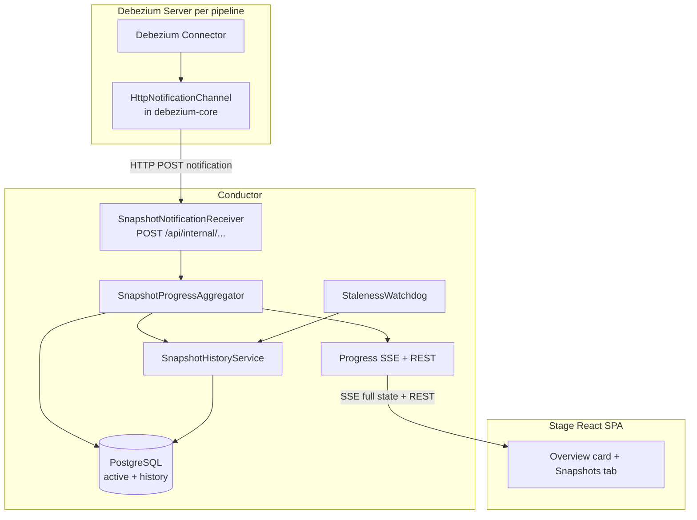

# DDD-68: Snapshot Monitoring for Debezium Platform

## Motivation

The platform can already trigger incremental snapshots (from the Actions tab) and runs an initial snapshot automatically on first pipeline start (driven by `snapshot.mode`). What it cannot do today is show what a snapshot is doing while it runs.

Once a snapshot starts there is no visibility into its progress. Users cannot tell whether a snapshot is still running, which table is being processed, how many tables remain, or whether it has stalled. The only way to check is to read the connector logs, which is slow, requires cluster access, and is not something a platform operator should have to do for a routine operation.

A snapshot of a large database can run for a long time. During that window downstream consumers are waiting for a complete backfill, and the operator has no way to set expectations or to notice that a single large table (or a permission error on one table) is holding everything up.

This document proposes a snapshot monitoring feature that turns the raw progress signals Debezium already emits into a clear, real time view in the UI: a global progress bar, a per table breakdown, rows scanned counters, and a history of completed runs.

## Goals

Primary objectives:

1. Give operators real time visibility into initial and incremental snapshot progress, per pipeline, without reading connector logs.
2. Show both a global view (tables completed out of total) and a per table view (status, rows scanned, and chunk progress when available).
3. Present initial and incremental snapshots through one uniform UI and one uniform API, despite their differences at the notification level.
4. Persist completed snapshot runs as history so operators can review past durations, outcomes, and per table results.
5. Push updates to the UI as they happen (no polling) while keeping the client simple.
6. Survive restarts of both the Debezium Server and the Conductor without losing progress state.

Non goals for this phase:

- No global "all snapshots across all pipelines" page. Monitoring is scoped to one pipeline.
- No control actions from this feature. It is read only. Triggering snapshots stays in the Actions tab.
- No scan rate / throughput indicator, no ETA, and no snapshot alerting. These are listed under Future Enhancements.
- No feature specific metrics/observability export in this phase.

## Proposed Solution

Debezium already emits `Notification` events during both initial and incremental snapshots (STARTED, IN_PROGRESS, per table completion, COMPLETED, and so on). The platform does not consume these yet.

The solution has three parts:

1. **Notification delivery.** An HTTP notification channel, contributed to debezium-core and therefore transitively available on the Debezium Server classpath, POSTs each snapshot notification to the Conductor. No custom image or packaging is required; the channel is inert until enabled.
2. **State aggregation.** A service in the Conductor consumes these raw notifications, folds them into a per pipeline snapshot progress state, persists the structural state, and moves completed runs into history.
3. **Real time push.** A Server Sent Events (SSE) endpoint streams the current progress state to the UI as it changes, plus plain REST endpoints for the current state and for history.

No new infrastructure is introduced. The feature reuses the existing PostgreSQL database and the existing in cluster HTTP connectivity between the Conductor and Debezium Server.

A key design choice: **the platform always sends the full progress state, never deltas.** Each SSE event carries the complete snapshot aggregate, so the frontend simply replaces its state on every event. There is no client side accumulation, no gap handling, and no replay protocol.

## Architecture



Flow in words:

1. The connector emits a snapshot notification. The HTTP channel POSTs it to the Conductor's internal receiver. The pipeline identity is a path parameter in the callback URL, which the platform auto configures when it deploys the Debezium Server; the channel does not derive it.
2. The receiver hands the notification to the aggregator. The aggregator updates a per pipeline progress state (structural state in PostgreSQL, high frequency chunk progress in memory) and broadcasts the merged full state to any connected UI clients.
3. On a terminal event (COMPLETED / ABORTED / SKIPPED) the run is moved to the history tables and the active state is cleared. A staleness watchdog is the backstop that closes an active snapshot that stopped receiving updates (see Resilience).
4. The frontend subscribes to the SSE stream for the pipeline and renders whatever the latest event contains.

### Deployment boundaries

- **Debezium Server side:** only the HTTP notification channel, which ships in debezium-core. The platform enables it and injects the callback URL when creating the connector. There is nothing to build or mount.
- **Conductor side:** the receiver, the aggregator, the persistence services, the scheduled cleanup and watchdog jobs, and the SSE + REST endpoints.
- **Frontend side:** the Overview compact card and the dedicated Snapshots tab, described below.

### Security note (relevant to deployment, not to the frontend)

The internal receiver is reached only from inside the cluster through the Conductor Service DNS, never through the external Ingress. Because the Conductor serves everything under `/api`, the Ingress must be configured to deny external access to `/api/internal/*`. The frontend never calls the internal receiver; it only calls the public `/api/pipelines/...` endpoints.

## Backend Components (Overview)

This section is intentionally light and focuses on responsibilities rather than implementation detail.

- **HttpNotificationChannel** (debezium-core): serializes each `Notification` to JSON and POSTs it to the pre configured Conductor URL. Retries transient failures; escalates retries for terminal events. Never blocks snapshot execution.
- **SnapshotNotificationReceiver** (Conductor API): accepts the POST, validates the pipeline, returns `202 Accepted`, and forwards to the aggregator.
- **SnapshotProgressAggregator** (Conductor domain): the state machine. Persists structural transitions (start, per table completion, pause/resume, terminal) to PostgreSQL, keeps high frequency chunk progress in memory, merges the two into the view model, and broadcasts it over SSE.
- **ActiveSnapshotService / SnapshotHistoryService** (Conductor domain): persistence for the active tier and the history tier respectively, including the atomic active to history migration on completion.
- **SnapshotHistoryCleanup / SnapshotStalenessWatchdog** (Conductor domain): scheduled jobs for retention cleanup and for closing stalled snapshots.

## API Reference

All endpoints are under the `/api` prefix and are scoped to a single pipeline by `{pipelineId}` (the platform pipeline id, a number).

### 1. Live progress stream (SSE)

```
GET /api/pipelines/{pipelineId}/snapshots/progress/stream
Accept: text/event-stream
```

- Emits named events: `event: snapshot-progress`.
- The **first event on connect** is always the current state (an active snapshot or an IDLE payload), so the UI never starts blank.
- Every subsequent event is the **complete** progress aggregate (full state, not a delta). Render by replacing state.
- The browser `EventSource` reconnects automatically. On reconnect the server resends current state as the first event. There is no last event id or catch up logic to implement.
- Events are debounced server side (about one per second per pipeline during bursts), so the stream does not flood.

```js
const es = new EventSource(`/api/pipelines/${pipelineId}/snapshots/progress/stream`);
es.addEventListener("snapshot-progress", (e) => {
  const state = JSON.parse(e.data);
  setSnapshotProgress(state); // replace, do not merge
});
```

### 2. Current progress (one shot)

```
GET /api/pipelines/{pipelineId}/snapshots/progress
-> 200 application/json  (SnapshotProgressResponse)
```

Returns the same aggregate that one SSE event carries. Use it for the Overview card's first paint and as a fallback when `EventSource` is not available. Returns the IDLE payload when no snapshot is active.

### 3. Snapshot history list

```
GET /api/pipelines/{pipelineId}/snapshots/history
    ?type=INITIAL|INCREMENTAL
    &outcome=COMPLETED|ABORTED|SKIPPED
    &from=<ISO-8601>
    &to=<ISO-8601>
    &page=0
    &size=20
-> 200 application/json  (PagedSnapshotHistoryResponse)
```

All query parameters are optional. The list omits the per table breakdown to stay light; sort is most recent first.

### 4. Snapshot history detail

```
GET /api/pipelines/{pipelineId}/snapshots/history/{historyId}
-> 200 application/json  (SnapshotHistoryResponse, with per table entries)
```

Used when the operator expands a history row.

### Payload shapes

**SnapshotProgressResponse** (SSE event data and the one shot endpoint):

```json
{
  "type": "INITIAL",
  "status": "RUNNING",
  "globalProgress": { "totalTables": 12, "completedTables": 7, "percentage": 58.3 },
  "tables": [
    {
      "name": "inventory.orders",
      "status": "IN_PROGRESS",
      "progress": { "chunkIndex": 3, "totalChunks": 10, "percentage": 30.0 },
      "rowsScanned": 45000,
      "skipReason": null
    },
    {
      "name": "inventory.customers",
      "status": "COMPLETED",
      "progress": null,
      "rowsScanned": 12000,
      "skipReason": null
    }
  ],
  "startedAt": "2026-08-05T10:00:00Z",
  "lastUpdatedAt": "2026-08-05T10:05:32Z",
  "elapsedSeconds": 332,
  "totalRowsScanned": 245000
}
```

Notes for rendering:

- `type` is `INITIAL` or `INCREMENTAL`, and is `null` when IDLE.
- The **top level** `status` is the snapshot lifecycle state (`SnapshotState`): `IDLE`, `RUNNING`, `PAUSED`, or a terminal outcome. Each **table** `status` is a separate `TableState`: `PENDING`, `IN_PROGRESS`, `COMPLETED`, `SKIPPED`, `FAILED`.
- `progress` on a table is `null` when there is no chunk data (a completed table, or an incremental table before the optional core enhancement exists). When `progress` is null, show a spinner plus the rows scanned counter instead of a bar.
- `skipReason` is set only for `SKIPPED` or `FAILED` tables (for example "No primary key", "SQL exception").
- `elapsedSeconds` is provided; the UI may also compute a live "running for" label from `startedAt`.

**IDLE payload** (no active snapshot):

```json
{ "type": null, "status": "IDLE", "globalProgress": null, "tables": [] }
```

**SnapshotHistoryResponse** (list item and detail):

```json
{
  "id": 42,
  "pipelineId": 7,
  "pipelineName": "inventory-pipeline",
  "type": "INITIAL",
  "outcome": "COMPLETED",
  "totalTables": 12,
  "completedTables": 12,
  "totalRowsScanned": 1245000,
  "startedAt": "2026-08-05T10:00:00Z",
  "completedAt": "2026-08-05T10:12:34Z",
  "durationSeconds": 754,
  "tables": [
    { "tableName": "inventory.products", "outcome": "COMPLETED", "rowsScanned": 12000, "skipReason": null, "durationSeconds": 15 }
  ]
}
```

In the list response the `tables` array is empty or omitted; it is populated only by the detail endpoint. `outcome` can also be `UNKNOWN` (see the lifecycle section).

**PagedSnapshotHistoryResponse**:

```json
{ "items": [ /* SnapshotHistoryResponse without tables */ ], "page": 0, "size": 20, "totalElements": 3, "totalPages": 1 }
```

## Frontend / UI Requirements

The feature appears in two places on the pipeline detail page.

### A. Overview tab: compact progress card

Shown only when a snapshot is active for the pipeline. Hidden when IDLE.

```
┌─────────────────────────────────────────────────────────────┐
│  Snapshot In Progress                                        │
│                                                              │
│  Initial Snapshot   ██████████░░░░░░░░░░  58%  (7/12 tables) │
│  Running for 5m 32s                                         │
│                                           [ View Details ]   │
└─────────────────────────────────────────────────────────────┘
```

When a snapshot is paused:

```
┌─────────────────────────────────────────────────────────────┐
│  Snapshot Paused                                             │
│                                                              │
│  Incremental Snapshot   ██████░░░░░░░░░░  30%  (3/10 tables) │
│  Paused after 2m 15s                                         │
│                                           [ View Details ]   │
└─────────────────────────────────────────────────────────────┘
```

- Show snapshot type, a global progress bar, the percentage, and the table count (`completedTables`/`totalTables`).
- Show elapsed time. Do not show a scan rate; that is intentionally out of scope.
- When `status` is `PAUSED`, show a "Snapshot Paused" heading and a "Paused" badge, and a static (non animated) bar with a "Paused after Xm Ys" line.
- "View Details" navigates to the Snapshots tab.
- Data source: the one shot `/progress` endpoint for first paint, then the SSE stream for live updates.

### B. Snapshots tab (dedicated)

This is a new tab, separate from the Monitoring tab (which hosts the Prometheus observability panels). The tab shows an active state badge while a snapshot is running.

**Active view (status RUNNING or PAUSED):**

```
┌─────────────────────────────────────────────────────────────────────┐
│  Snapshot Progress                                                    │
├─────────────────────────────────────────────────────────────────────┤
│                                                                      │
│  Initial Snapshot   ██████████████░░░░░░░░  58%                      │
│  Status: Running   |   Started: 10:00:12 UTC   |   Elapsed: 5m 32s  │
│  Tables: 7 of 12 completed   |   Total rows scanned: 245,000        │
│                                                                      │
│  ── Tables ─────────────────────────────────────────────────────     │
│                                                                      │
│  Table                     │ Status       │ Progress       │ Rows    │
│  ──────────────────────────┼──────────────┼────────────────┼─────── │
│  inventory.products        │ ● Completed  │ ██████████ 100%│ 12,000  │
│  inventory.customers       │ ● Completed  │ ██████████ 100%│ 8,500   │
│  inventory.orders          │ ● Completed  │ ██████████ 100%│ 95,000  │
│  inventory.order_items     │ ● Completed  │ ██████████ 100%│ 42,000  │
│  inventory.payments        │ ● Completed  │ ██████████ 100%│ 31,200  │
│  inventory.shipments       │ ● Completed  │ ██████████ 100%│ 11,300  │
│  inventory.returns         │ ● Completed  │ ██████████ 100%│ 45,000  │
│  inventory.reviews         │ ◐ In Progress│ ██████░░░░  58%│ 28,400  │
│  inventory.categories      │ ○ Pending    │                │         │
│  inventory.suppliers       │ ○ Pending    │                │         │
│  inventory.warehouses      │ ○ Pending    │                │         │
│  inventory.audit_log       │ ○ Pending    │                │         │
│                                                                      │
└─────────────────────────────────────────────────────────────────────┘
```

When a table was skipped or failed, show the reason in place of the progress bar:

```
│  inventory.temp_data       │ ⊘ Skipped    │ No primary key │         │
│  inventory.legacy_log      │ ✕ Failed     │ SQL exception  │ 0       │
```

- A global progress bar with the overall percentage at the top.
- A summary line: status, start time, elapsed duration, tables completed out of total, and total rows scanned.
- A per table list, ordered by processing sequence (completed first, then in progress, then pending):
  - Table name.
  - Status icon: filled for completed, half filled for in progress, empty for pending, a warning icon for skipped or failed.
  - A per table progress bar when `progress` is present; otherwise a spinner plus the rows scanned counter (graceful degradation).
  - Rows scanned, always shown.
  - For skipped or failed tables, show the `skipReason`.

**Inactive view (status IDLE):**

```
┌─────────────────────────────────────────────────────────────────────┐
│  Snapshot Progress                                                    │
├─────────────────────────────────────────────────────────────────────┤
│                                                                      │
│  No active snapshot                                                  │
│                                                                      │
│  ── History ────────────────────────────────────────────────────     │
│                                                                      │
│  Type          │ Outcome   │ Tables │ Rows      │ Duration │ Date        │
│  ──────────────┼───────────┼────────┼───────────┼──────────┼─────────── │
│  Initial       │ Completed │ 12/12  │ 1,245,000 │ 12m 34s  │ Aug 5 10:12 │
│  Incremental   │ Completed │ 3/3    │ 45,200    │ 1m 02s   │ Aug 4 16:30 │
│  Incremental   │ Aborted   │ 1/5    │ 8,100     │ 0m 32s   │ Aug 3 09:15 │
│                                                                      │
└─────────────────────────────────────────────────────────────────────┘
```

Clicking a history row expands it to show the per table breakdown of that run:

```
│  ▼ Initial   │ Completed │ 12/12  │ 1,245,000 │ 12m 34s  │ Aug 5 10:12 │
│  ┌──────────────────────────────────────────────────────────────────│
│  │ Table                     │ Outcome   │ Rows     │ Duration     │
│  │ ──────────────────────────┼───────────┼──────────┼──────────── │
│  │ inventory.products        │ Completed │ 12,000   │ 0m 15s       │
│  │ inventory.customers       │ Completed │ 8,500    │ 0m 12s       │
│  │ inventory.orders          │ Completed │ 95,000   │ 2m 45s       │
│  │ ...                                                              │
│  └──────────────────────────────────────────────────────────────────│
```

- A "No active snapshot" line.
- Below it, the history table (from the history list endpoint) with columns: type, outcome, tables (completed/total), rows, duration, and date. Sorted most recent first.
- Clicking a history row expands it to show the per table breakdown, fetched from the history detail endpoint.

### C. State handling summary

| Top level `status` | Meaning | UI behavior |
|--------------------|---------|-------------|
| `IDLE` | No snapshot running | Hide the Overview card; show "No active snapshot" plus history in the tab |
| `RUNNING` | Actively scanning tables | Animated progress bar and table list |
| `PAUSED` | Incremental snapshot paused | Static bar, "Paused" badge |
| `COMPLETED` / `ABORTED` / `SKIPPED` / `UNKNOWN` | Terminal | The run moves to history; the live view returns to IDLE |

The frontend does not need to interpret raw Debezium notifications or track transitions. It renders the latest full state and, for history, reads the REST endpoints.

### D. Graceful degradation

For incremental snapshots, per table chunk progress may not be available (it depends on an optional Debezium core enhancement). In that case `progress` is `null` and the UI shows a spinner and the rows scanned counter rather than a bar. Global progress (tables completed out of total) always works.

```
│  inventory.reviews         │ ◐ In Progress│ ↻ 28,400 rows │ 28,400  │
```

- Animated spinner icon instead of a progress bar.
- Rows scanned counter updates as notifications arrive.
- Global progress (tables completed out of total) still works regardless.

## Snapshot Lifecycle and States

The platform maps raw Debezium notifications into a simplified lifecycle. Both snapshot types share this model.

- Snapshot level states: `IDLE`, `RUNNING`, `PAUSED`, and terminal `COMPLETED`, `ABORTED`, `SKIPPED`, `UNKNOWN`.
- Table level states: `PENDING`, `IN_PROGRESS`, `COMPLETED`, `SKIPPED`, `FAILED`.

`UNKNOWN` is a terminal outcome the platform assigns when it lost track of a running snapshot (for example the Conductor was down through the terminal notification). The staleness watchdog closes such a snapshot so the UI never stays stuck in `RUNNING`. From the frontend's point of view, `UNKNOWN` is just another outcome shown in history.

## Resilience (Summary)

- **Missed progress events are harmless.** Notifications carry absolute state, so the next successful delivery fully corrects the view. This is why after a restart the progress percentage jumps to the correct value rather than drifting.
- **Missed terminal events** are the only non self correcting case. Terminal events are retried more aggressively, and the staleness watchdog is the backstop, closing an active snapshot that stops receiving updates after a configurable timeout (default 15 minutes) with the `UNKNOWN` outcome.
- **Restarts.** Active structural state is persisted to PostgreSQL, so a Conductor restart restores which tables completed. Only the in memory chunk progress is lost and it rebuilds from the next progress notification.
- **SSE reconnect.** Handled by `EventSource`; the server resends full state on reconnect.

## Configuration

Operator facing configuration (not frontend concerns), with defaults:

| Property | Default | Description |
|----------|---------|-------------|
| `snapshot.monitoring.sse.debounce` | `1s` | Minimum interval between SSE pushes per pipeline |
| `snapshot.monitoring.history.retention` | `30d` | How long completed history is kept |
| `snapshot.monitoring.history.cleanup.interval` | `24h` | How often the cleanup job runs |
| `snapshot.monitoring.watchdog.stale-timeout` | `15m` | Age after which an active snapshot with no updates is closed as `UNKNOWN` |
| `snapshot.monitoring.watchdog.check-interval` | `5m` | How often the watchdog scans |

## Debezium Core Dependencies

- **Required (FR-C1):** the initial snapshot STARTED notification must include the full `data_collections` list so the total table count is known from the start. Until this lands, the total table count is back filled lazily and the global percentage renders as indeterminate at the very beginning.
- **Optional (FR-C2 to FR-C4):** add a row count to incremental snapshot notifications so incremental snapshots can show per table chunk progress. Until this lands, incremental per table progress uses the spinner plus counter fallback. No frontend change is needed to adopt it later; the `progress` field simply starts being populated.

## Future Enhancements (Out of Scope)

- Global snapshots page listing active snapshots across all pipelines.
- Scan rate / throughput indicator (rows per second).
- ETA computation.
- Snapshot alerting (alert when a snapshot stalls, fails, or exceeds a duration).
- Export a completed snapshot report (CSV / JSON).
- Compare two snapshot runs side by side.

## References

- Debezium notification SPI: `io.debezium.pipeline.notification.channels.NotificationChannel`.
- Debezium documentation on initial and incremental snapshot notifications.
