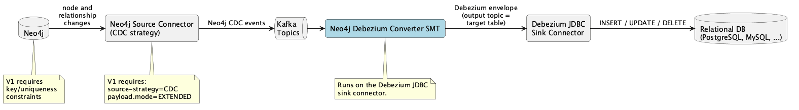

# DDD-74: Graph-to-Relational Debezium SMT for Neo4j

## Motivation

The [Neo4j CUD Converter](DDD-55.md) SMT converts Debezium relational change events into Neo4j's CUD format, enabling a **relational-to-graph** pipeline. 
This DDD describes the opposite direction: a **graph-to-relational** pipeline that streams changes from Neo4j back into a relational database.

Neo4j already ships a Kafka source connector that captures changes from a Neo4j database using its Change Data Capture (CDC) feature and emits them to Kafka in Neo4j's own CDC event format. 
Debezium already ships a JDBC sink connector that writes to a relational database and consumes the native Debezium envelope format directly. 
There is no bridge between the two formats.

This DDD describes the **V1** of the **Neo4j Debezium Converter**, a Kafka Connect Single Message Transform (SMT) that converts Neo4j CDC change events into the Debezium envelope format, enabling pipelines like:

```
Neo4j -> Neo4j Source Connector (CDC) -> Kafka -> SMT -> Debezium JDBC Sink Connector -> PostgreSQL
```

Together with the Neo4j CUD Converter this closes the loop, allowing Neo4j and a relational database to be kept in sync in either direction.

## Goals

1. **Transform Neo4j CDC change events into the Debezium envelope format**, so that any Debezium JDBC sink connector target (PostgreSQL, MySQL, Oracle, SQL Server, Db2, ...) can be fed from Neo4j.
2. **Zero-config by default**: because Neo4j CDC events are self-describing, the SMT derives the full mapping automatically from each event and runs with no per-entity configuration.
3. **Support all CDC operations**: create (`c`), update (`u`), and delete (`d`), mapped to the corresponding Debezium operations.
4. **Produce a schema-typed envelope** so the Debezium JDBC sink can create and evolve target tables and pick correct column types.
5. **Stateless**: no connection to Neo4j or the relational database, and no state beyond the current message and the configuration.

## Out of scope

- **Relational-to-Graph SMT** (the opposite direction): handled by the Neo4j CUD Converter.
- **Stateful operations**: cross-topic key resolution, relationship-to-foreign-key back-patching that needs the full target row, and schema reconciliation across events all require state and are out of scope.
- **Neo4j schema/index change events**: Neo4j CDC does not emit schema or index changes, so there is nothing to propagate as DDL. Constraint and index management on both sides is the user's responsibility.
- **Query-based source strategy**: V1 assumes the Neo4j source connector runs with the CDC source strategy, which produces structured `before`/`after` change events. The custom-query strategy is out of scope.

## Architecture

The SMT is deployed on the **Debezium JDBC sink connector** side. 
It intercepts each Neo4j CDC event read from Kafka, reads the mapping configuration, and rewrites the record into a Debezium envelope `Struct` (with `before`, `after`, `source`, `op`, `ts_ms`) plus a primary-key `Struct` as the record key. It also sets the record's output topic to the target table name it derives from the event, so the Debezium JDBC sink (with `collection.name.format=${topic}`, its default) writes each row to the right table.



## Proposed Solution

The SMT transforms each Neo4j CDC event into a Debezium envelope. 
Two characteristics of Neo4j are decisive: Neo4j's optional schema and its identity model.
So this section starts with those constraints, then defines the operation, node, and relationship mappings, and finally the [Configuration Schema](#configuration-schema).

### The core problem: Neo4j is schema-optional

Two fundamental mismatches drive every design decision below.

**1. Identity.** A relational row has a stable primary key. A Neo4j entity has an internal `elementId` (unstable across database restore, backup, and cluster membership changes) and, only if the user defined a constraint, a business `keys` value. 
To produce a stable relational primary key the SMT must use the `keys` field, which is populated from Neo4j key/uniqueness constraints. 
The `keys` field is a map keyed by label, each value a list of key-property maps:

```json
"keys": {
  "Customer": [ { "id": 1004 } ]
}
```

If no constraint exists, `keys` is empty and the SMT cannot derive a portable primary key. 
V1 therefore **requires the relevant Neo4j constraints to exist** and treats a missing key as a `field.missing.behavior` condition (fail/warn/ignore). 

**2. Schema.** Relational tables have a fixed, typed set of columns. Neo4j nodes with the same label may carry different properties and property types. 
The SMT builds the Kafka Connect schema per record from the event, and the Debezium JDBC sink reconciles it with the table. 
Reliable type inference depends on the Neo4j source connector's `payload.mode` (see [Type Mapping](#type-mapping)).

The mapping quality depends on how the Neo4j source connector is configured. V1 assumes the CDC source strategy, `EXTENDED` payload mode, and key/uniqueness constraints on every mapped entity. These are described in [Required Neo4j source connector settings](#required-neo4j-source-connector-settings).

#### Operation Mapping

Neo4j CDC operations map to Debezium operations one-to-one:

| Neo4j `event.operation` | Meaning | Debezium `op` | Row image used |
|:---|:---|:---|:---|
| `c` | Create | `c` | `state.after` |
| `u` | Update | `u` | `state.after` (and `state.before` for the key) |
| `d` | Delete | `d` | `state.before` |

The Debezium JDBC sink applies `c`/`u` as an upsert (with `insert.mode=upsert`) and `d` as a delete keyed by the primary key, so create and update are both idempotent and safe for at-least-once delivery.

A `u` that changes a primary-key value cannot be represented by a one-record SMT and is treated as an error rather than emitted as a silently-wrong row (see [Key-value changes are not supported](#key-value-changes-are-not-supported)).

#### Node Mapping

A Neo4j node change event carries `event.eventType = "n"`, one or more `labels`, a `keys` map, and `state.before`/`state.after` each with a `properties` object. It maps to a row as follows:

| Neo4j field | Debezium envelope | Description |
|:---|:---|:---|
| matched `label` | **output topic** → target table | `label.<Label>.table` if set, else the label transformed by `table.naming` |
| `keys.<Label>` entry | `after`/`before` key columns + record key | Primary-key columns |
| `state.after.properties` | `after` non-key columns | Row columns |
| `state.before.properties` | `before` (for `u`/`d`) | Previous row image |
| `event.operation` | `op` | See operation mapping |

**Multi-label nodes.** A Neo4j node can carry several labels at once, for example `(:Person:Customer)`, but a relational row belongs to exactly one table. 
The SMT must therefore pick the single label that "owns" the row: the one whose name becomes the table and whose `keys` entry becomes the primary key. 
With a single-label node this is unambiguous and needs no configuration; with multiple labels the convention alone cannot choose, so the choice is resolved by configuration.

The user configures the owning label by giving **exactly one** of the node's labels a `label.<Label>.*` mapping. 
The SMT uses that label's table and key; the remaining labels are ignored for routing.

For example, given a `(:Person:Customer)` node and the configuration:

```properties
transforms.neo4j.label.Customer.table=customers
```

the node is routed to `customers`, keyed by `keys.Customer`; `Person` is ignored because it has no mapping.

Two ambiguous cases are therefore treated as errors:

- **No mapped label.** If a multi-label node has no `label.<Label>.*` mapping on any of its labels, the SMT cannot know which label owns the row and does not fall back to convention. The record is handled per `field.missing.behavior` (fail/warn/ignore).
- **More than one mapped label.** If a single node carries two or more labels that each have a mapping, the owner is genuinely ambiguous. The SMT cannot pick one, so the record is rejected the same way, per `field.missing.behavior`.

**Example: node create**

Neo4j CDC input (`payload.mode=EXTENDED` shortened for readability):
```json
{
  "event": {
    "elementId": "4:abc:1",
    "eventType": "n",
    "operation": "c",
    "labels": ["Customer"],
    "keys": { "Customer": [ { "id": 1004 } ] },
    "state": {
      "before": null,
      "after": {
        "labels": ["Customer"],
        "properties": {
          "id": 1004,
          "first_name": "John",
          "last_name": "Foo",
          "email": "john@foo.org"
        }
      }
    }
  },
  "metadata": { "txCommitTime": "2023-03-03T11:58:30.526Z", "txId": 12 }
}
```

Debezium envelope output (target table `Customer`, key `id`):
```json
{
  "before": null,
  "after": {
    "id": 1004,
    "first_name": "John",
    "last_name": "Foo",
    "email": "john@foo.org"
  },
  "source": {
    "connector": "neo4j",
    "ts_ms": 1677844710526,
    "txId": 12,
    "table": "Customer"
  },
  "op": "c",
  "ts_ms": 1677844710526
}
```

The record key is a `Struct` `{ "id": 1004 }`, so the sink can be configured with `primary.key.mode=record_key`.

**Example: node delete**

Neo4j CDC input has `operation: "d"`, a full `state.before`, and `state.after: null`. The SMT emits a Debezium delete with `op: "d"`, populating `before` (and the record key) from `state.before.properties` and the `keys` map. The Debezium JDBC sink deletes the row by primary key.

#### Relationship Mapping

A relationship change event carries `event.eventType = "r"`, a `type` (the relationship type), `start` and `end` node objects (each with `elementId`, `labels`, and `keys`), a `keys` value for the relationship itself, and `state.before`/`state.after` with relationship `properties` only (relationships have no labels).

The SMT supports two relationship mapping modes, mirroring the two ways the Neo4j CUD Converter turns tables into relationships.

1. **Join-table mode (default)**:
A relationship becomes one row in a join table. The start node key becomes one foreign-key column, the end node key becomes the other, and relationship properties become the remaining columns. This is the exact inverse of the Neo4j CUD Converter's join-table mapping.

> **Why join-table is the default?** A join table is a correct representation of a relationship at *any* cardinality (1:1, 1:N, N:M), whereas a foreign-key column is only valid when the relationship is to-one. The CDC event carries no cardinality information, so the SMT cannot tell whether foreign-key mode is safe. Defaulting to foreign-key would therefore risk silent data loss: if a relationship is actually many-to-many, each new relationship for the same owner would overwrite the single FK column of the previous one. Foreign-key mode also has nowhere to put relationship *properties* (e.g. `CONTAINS {quantity}`), which a join table holds naturally. The always-safe representation is thus the default, and foreign-key mode is a deliberate opt-in the user chooses when they know the relationship is to-one and property-free.

**Example: `(:Order)-[:CONTAINS {quantity}]->(:Product)` -> `order_items`**

Neo4j CDC input:
```json
{
  "event": {
    "eventType": "r",
    "operation": "c",
    "type": "CONTAINS",
    "start": { "labels": ["Order"],   "keys": { "Order":   [ { "id": 5001 } ] } },
    "end":   { "labels": ["Product"], "keys": { "Product": [ { "id": 200 } ] } },
    "state": { "before": null, "after": { "properties": { "quantity": 3 } } }
  },
  "metadata": { "txCommitTime": "2023-03-03T12:00:00.000Z", "txId": 15 }
}
```

Configuration (`column.naming=snake_case` gives the lowercase `order_id` / `product_id` columns; `quantity` comes straight from the property; only the join-table name is overridden, since the default would be the relationship type `CONTAINS`):
```properties
transforms.neo4j.column.naming=snake_case
transforms.neo4j.relationship.CONTAINS.table=order_items
```

Debezium envelope output (target table `order_items`, composite key `order_id`, `product_id`):
```json
{
  "before": null,
  "after": { "order_id": 5001, "product_id": 200, "quantity": 3 },
  "source": { "connector": "neo4j", "table": "order_items", "txId": 15 },
  "op": "c",
  "ts_ms": 1677844800000
}
```

2. **Foreign-key mode**:
A relationship becomes a foreign-key column update on the entity table of one endpoint (for a to-one relationship). This is not the default, so `mode=foreign_key` must be set explicitly.

The **`owner`** property names which endpoint holds the foreign key: the owner's table is the one updated (its key selects the row), and the *other* endpoint's key becomes the foreign-key value written into it. It defaults to **`start`**, meaning the start node's table gets a foreign key pointing at the end node, which reads with the arrow direction, `(start)-[:REL]->(end)`. For `(:Order)-[:PLACED_BY]->(:Customer)` the default is correct: `orders` holds `customer_id`.
When the foreign key belongs on the *end* side, for example `(:Customer)-[:PLACED]->(:Order)`, where one customer has many orders and `orders` must hold `customer_id`, the user must set `owner=end`.

**Example: `(:Order)-[:PLACED_BY]->(:Customer)` -> `orders.customer_id`**

Neo4j CDC input:
```json
{
  "event": {
    "eventType": "r",
    "operation": "c",
    "type": "PLACED_BY",
    "start": { "labels": ["Order"],    "keys": { "Order":    [ { "id": 5001 } ] } },
    "end":   { "labels": ["Customer"], "keys": { "Customer": [ { "id": 1004 } ] } },
    "state": { "before": null, "after": { "properties": {} } }
  },
  "metadata": { "txCommitTime": "2023-03-03T12:00:00.000Z", "txId": 16 }
}
```

Configuration (`snake_case` naming makes the foreign-key column `customer_id` rather than the `as_is` `Customer_id`):
```properties
transforms.neo4j.column.naming=snake_case
transforms.neo4j.relationship.PLACED_BY.mode=foreign_key
transforms.neo4j.relationship.PLACED_BY.table=orders
```

Debezium envelope output (target table `orders`, keyed by `id`):
```json
{
  "before": null,
  "after": { "id": 5001, "customer_id": 1004 },
  "source": { "connector": "neo4j", "table": "orders", "txId": 16 },
  "op": "u",
  "ts_ms": 1677844800000
}
```

This is a **partial update**: `after` carries only the owner's key (`id`) plus the foreign-key column (`customer_id`), so the Debezium JDBC sink upsert leaves the other `orders` columns untouched when the row already exists. 
The partial shape reflects how Neo4j CDC separates events: a relationship event (`eventType="r"`) only ever carries the endpoint keys and the relationship's own properties, so a foreign-key change is always emitted as this partial update. A change to any *non-foreign-key* field of the `Order` node is a distinct node event (`eventType="n"`) that carries the full `state.after.properties`, which the SMT emits as a full-row upsert. 
The foreign-key column is therefore only ever written by relationship events, and the node's own columns only ever by node events. 
This mode has ordering caveats (the owner row should exist first) and is discussed under [Limitations](#limitations-and-constraints). Join-table mode is preferred where the relational model uses a join table.

### Configuration Schema

The SMT is **zero-config by default**; every property in this section is an **optional override**. All properties use the SMT instance prefix (e.g. `transforms.neo4j.*`).

#### Zero-config by default

The Neo4j CUD Converter (relational-to-graph) is fully declarative for a fundamental reason: a relational DML change event is **structurally opaque**. 
The event for an `orders` row contains `customer_id: 1004`, but nothing in it says whether that column is a plain integer or a foreign key, and the event carries no relationship metadata at all. 
That information is simply not in the stream (it lives in DDL / the catalog, which is stateful and out of scope), so it has to come from the user. Hence the Neo4j CUD Converter requires the user to declare labels, id properties, foreign keys, relationship types, and join-table roles.

The graph-to-relational direction is the opposite: **Neo4j CDC events are self-describing.** Every structural fact the Neo4j CUD Converter had to ask the user for is already present in each event:

| Structural fact | Neo4j CUD Converter (relational source) | This SMT (Neo4j CDC source) |
|:---|:---|:---|
| Node vs. relationship (table vs. join table) | User declares `node.mode` | `event.eventType` = `n` / `r` |
| Entity type / label | User declares `node.labels` | `event.labels` (node), `event.type` (relationship) |
| Primary key columns | User declares `node.id.properties` | `event.keys`, populated from Neo4j constraints |
| Relationship endpoints | User declares `relationship.<fk>.target.*` | `event.start` / `event.end`, each with `labels` + `keys` |
| Which columns are properties | User declares include/exclude | `state.after.properties` |

Because of this, the SMT applies a **convention-based default mapping** that requires no per-entity configuration:

- **node label → table**: the label, transformed by the global `table.naming` option (`as_is` default, or `snake_case`);
- **primary key**: the properties in `event.keys` for the matched label;
- **columns**: the entries in `state.after.properties`;
- **relationship → join table**: the relationship `type`, transformed by the same `table.naming` option;

Declarative configuration therefore drops from **required** (Neo4j CUD Converter) to **optional overrides**, needed only to:

1. match a **pre-existing** relational schema whose table/column names differ from the conventions;
2. opt into **foreign-key mode** for a relationship instead of the default join-table mode;
3. disambiguate a **multi-label** node (which label owns the row);
4. handle a label or relationship that has **no constraint**, so `event.keys` is empty.

The rest of this section details those overrides: naming first, then the per-entity and global property tables.

#### Naming overrides

Table and column names do not usually need configuring: the SMT derives them from the event and applies them itself, setting the output topic to the target table (which the JDBC sink writes to via `collection.name.format=${topic}`) and naming the columns from the properties. Overrides are needed only when the target database already exists with different names. Two cases:

**Greenfield target → no naming configuration needed.** If the target database is empty and the Debezium JDBC sink creates the tables (`schema.evolution=basic`), the convention names are used with the defaults `table.naming=as_is` and `column.naming=as_is`: a `Customer` node becomes a `Customer` table keyed by `id`, and a `CONTAINS` relationship becomes a `CONTAINS` table with columns `Order_id`, `Product_id`, `quantity`. 
The defaults preserve the Neo4j casing uniformly, table and column alike, so a `CONTAINS` table carries `Order_id`, not `order_id`. 
To get the conventional lowercase relational form (`contains`, `order_id`), set `table.naming=snake_case` and `column.naming=snake_case`, which both snake-case and lowercase. 

**Pre-existing target → override the names the SMT emits.** When the tables already exist with different names, adjust the mapping so the SMT emits the right ones:

- **Table names**: globally with `table.naming` (`as_is` or `snake_case`), or per entity with `label.<Label>.table` / `relationship.<TYPE>.table`;
- **Column names**: globally with `column.naming` (`as_is` or `snake_case`), and join-table foreign-key columns with `relationship.fk.naming`.

| Property | Type | Required | Default | Description |
|:---|:---|:---|:---|:---|
| `table.naming` | String | No | `as_is` | How a label / relationship type becomes a table name: `as_is` or `snake_case` |
| `column.naming` | String | No | `as_is` | How a property becomes a column name |
| `relationship.fk.naming` | String | No | `<label>_<key>` | The *structure* of a foreign-key column name (which endpoint label, which key, joined by `_`). The composed name is then cased by `column.naming` like any other column, so `as_is` yields `Order_id` and `snake_case` yields `order_id` |

For a rename these conventions cannot express, for example an arbitrary per-column rename that is not a global `snake_case` rule, the stock Kafka Connect SMTs still chain after this one, before the sink:

```
Neo4j CDC -> [Neo4j Debezium Converter] -> [ReplaceField] -> JDBC sink
```

```properties
transforms=neo4j,rename
transforms.neo4j.type=io.debezium.transforms.Neo4jDebeziumConverter
transforms.rename.type=org.apache.kafka.connect.transforms.ReplaceField$Value
transforms.rename.renames=email:email_address
```

#### SMT Registration

```properties
transforms=neo4j
transforms.neo4j.type=io.debezium.transforms.Neo4jDebeziumConverter
```

#### Node (label) configuration

Configured per label under `label.<Label>.*`:

| Property | Type | Required | Default | Description |
|:---|:---|:---|:---|:---|
| `label.<Label>.table` | String | No | Derived from label via `table.naming` | Target relational table |
| `label.<Label>.key.properties` | String | No | The label's `keys` constraint | Comma-separated key columns forming the primary key |
| `label.<Label>.properties.include` | String | No | All properties | Columns to include. Mutually exclusive with `exclude` |
| `label.<Label>.properties.exclude` | String | No | None | Columns to exclude |

#### Relationship configuration

Configured per relationship type under `relationship.<TYPE>.*`:

| Property | Type | Required | Default | Description |
|:---|:---|:---|:---|:---|
| `relationship.<TYPE>.mode` | String | No | `join_table` | `join_table` or `foreign_key`. Only `foreign_key` needs to be set explicitly, since it changes the default shape |
| `relationship.<TYPE>.table` | String | No | Derived from the type (join table) or the owner label (foreign_key) | Target table |
| `relationship.<TYPE>.start.column` | String | No | Derived from the start endpoint label + key | Join-table column populated from the start node key |
| `relationship.<TYPE>.end.column` | String | No | Derived from the end endpoint label + key | Join-table column populated from the end node key |
| `relationship.<TYPE>.properties` | String | No | All | Relationship properties to include as columns |
| `relationship.<TYPE>.owner` | String | No | `start` | (foreign_key) Which endpoint owns the row to update (`start` or `end`) |
| `relationship.<TYPE>.fk.column` | String | No | Derived from the non-owner label + key | (foreign_key) Foreign-key column populated from the non-owner endpoint key |

#### Global configuration

| Property | Type | Required | Default | Description |
|:---|:---|:---|:---|:---|
| `field.missing.behavior` | String | No | `warn` | How to react when a required key or image is missing: `fail`, `warn` (drop record), or `ignore` (drop silently). Mirrors the Neo4j CUD Converter |
| `tombstones.enabled` | Boolean | No | `true` | Whether an incoming tombstone record (null value) is passed through unchanged (`true`) or dropped (`false`) |

### Full Configuration Example

Source graph model (used by both examples below):
```
(:Customer {id, first_name, last_name, email})
(:Order {id, total, status})-[:PLACED_BY]->(:Customer)
(:Product {id, name, price})
(:Order)-[:CONTAINS {quantity}]->(:Product)
```

#### Example A: greenfield, zero per-entity configuration

When the relational schema does not exist yet (the JDBC sink creates it via `schema.evolution`), the convention-based default mapping is enough. No `label.*` or `relationship.*` properties are needed:

```properties
connector.class=io.debezium.connector.jdbc.JdbcSinkConnector
connection.url=jdbc:postgresql://postgres:5432/inventory
connection.username=debezium
connection.password=dbz
topics=Customer,Order,Product,CONTAINS,PLACED_BY
insert.mode=upsert
delete.enabled=true
primary.key.mode=record_key
schema.evolution=basic

# --- SMT: no per-entity mapping required ---
transforms=neo4j
transforms.neo4j.type=io.debezium.transforms.Neo4jDebeziumConverter
```

With the defaults `table.naming=as_is` and `column.naming=as_is`, this produces tables `Customer`, `Order`, `Product` (from the labels) and a `CONTAINS` join table with `Order_id`, `Product_id`, `quantity` (from the `CONTAINS` relationship). The `PLACED_BY` relationship defaults to its own join table `PLACED_BY(Order_id, Customer_id)`; set it to foreign-key mode (Example B) to fold it into the `Order` table instead.

#### Example B: matching a pre-existing schema (overrides)

To write into the example relational schema from the Neo4j CUD Converter (plural table names, a `customer_id` foreign key on `orders` rather than a join table), the pre-existing names differ from the conventions, so overrides are supplied:

```sql
CREATE TABLE customers   ( id INT PRIMARY KEY, first_name VARCHAR, last_name VARCHAR, email VARCHAR );
CREATE TABLE orders      ( id INT PRIMARY KEY, customer_id INT REFERENCES customers(id), total DECIMAL, status VARCHAR );
CREATE TABLE products    ( id INT PRIMARY KEY, name VARCHAR, price DECIMAL );
CREATE TABLE order_items ( order_id INT REFERENCES orders(id), product_id INT REFERENCES products(id),
                           quantity INT, PRIMARY KEY (order_id, product_id) );
```

```properties
# (connection / insert.mode / delete.enabled / primary.key.mode as in Example A)
transforms=neo4j
transforms.neo4j.type=io.debezium.transforms.Neo4jDebeziumConverter

# Lowercase relational form: customer_id / order_id / product_id foreign-key columns
transforms.neo4j.column.naming=snake_case

# Plural table names (the pre-existing schema differs from the label names)
transforms.neo4j.label.Customer.table=customers
transforms.neo4j.label.Order.table=orders
transforms.neo4j.label.Product.table=products

# CONTAINS -> order_items (the join table name is not derivable from the type)
transforms.neo4j.relationship.CONTAINS.table=order_items

# PLACED_BY -> orders.customer_id foreign key instead of a join table
transforms.neo4j.relationship.PLACED_BY.mode=foreign_key
```

Everything else: the `id` primary keys, the `order_id` / `product_id` join columns, the `quantity` and `customer_id` columns, still comes from the conventions and the CDC event (with `column.naming=snake_case` supplying the lowercase form), so only the genuine differences from convention are configured.

### Type Mapping

Neo4j property types map to Kafka Connect schema types (used to build the envelope) and then to relational columns by the JDBC sink. 
With `payload.mode=EXTENDED` the type comes from the event; with `COMPACT` (not compatible with **V1**) it is inferred from the runtime value.

| Neo4j property type | Kafka Connect schema | Notes |
|:---|:---|:---|
| Integer (`Long`) | `INT64` | Neo4j integers are 64-bit |
| Float (`Double`) | `FLOAT64` | |
| Boolean | `BOOLEAN` | |
| String | `STRING` | |
| ByteArray | `BYTES` | |
| `Date` | `io.debezium.time.Date` | ISO date |
| `LocalDateTime` / `DateTime` | `io.debezium.time.Timestamp` / `ZonedTimestamp` | Timezone preserved for `DateTime` |
| `LocalTime` / `Time` | `io.debezium.time.MicroTime` / `ZonedTime` | |
| `Duration` | `STRING` | ISO-8601 duration; no relational equivalent |
| `Point` | `STRING` | WKT / GeoJSON; no portable relational equivalent |
| List of primitives | `ARRAY` | Homogeneous; maps to array column where the dialect supports it, otherwise serialize |
| Map / nested | `STRING` (JSON) | Relational columns are flat |
| `null` | column set to null | Distinguishing an absent property from a null needs EXTENDED (see below) |


### Tombstone and Delete Handling

- **Node delete** (`operation: "d"`): emitted as a Debezium `op: "d"` with `before` and the record key taken from `state.before` and `keys`. The sink deletes the row by primary key (requires `delete.enabled=true` and a primary key mapping).
- **Relationship delete** in join-table mode: emitted as a Debezium delete of the join-table row, keyed by the two endpoint keys.
- **Relationship delete** in foreign-key mode: emitted as an `op: "u"` that sets the foreign-key column to null on the owner row (the row itself is not deleted).
- **Tombstone**: a delete is emitted as a single `op: "d"` record; the SMT does not (and cannot) emit a separate tombstone afterwards, since it is one-record-in/one-record-out. `tombstones.enabled` instead governs incoming tombstones: when `true` a tombstone record (null value) already on the topic is passed through unchanged, when `false` it is dropped.

A Neo4j `DETACH DELETE` produces a node delete event plus a relationship delete event per attached relationship, so each maps independently to the corresponding relational delete.

## Limitations and Constraints

### Required Neo4j source connector settings

The SMT is only compatible with an upstream Neo4j source connector configured as follows. 
These are not tuning recommendations; V1 relies on each of them.

1. **CDC source strategy**: `neo4j.source-strategy=CDC` produces structured `before`/`after` change events. The custom-query strategy is [out of scope](#out-of-scope).
2. **`EXTENDED` payload mode**: `neo4j.payload.mode=EXTENDED` carries explicit per-property type metadata, so the SMT can distinguish, for example, a Neo4j `Date` from a `LocalDateTime`, a list's element type, and a removed property from an absent one. With the default `COMPACT` mode this metadata is absent and the SMT must infer types from runtime values, so some distinctions cannot be recovered (see [Type Mapping](#type-mapping)).
3. **Key/uniqueness constraints**: define a key or uniqueness constraint on every label and relationship that maps to a table with a primary key, so that `event.keys` is populated. Without one the SMT cannot derive a portable primary key (see [Requires Neo4j constraints for stable keys](#requires-neo4j-constraints-for-stable-keys)).

**Topic layout is flexible.** The SMT identifies each entity from the self-describing CDC event (`event.eventType` / `labels` / `type`), not from the topic, and sets the output topic to the derived target table (via `table.naming` and any `label.<Label>.table` / `relationship.<TYPE>.table` override), which the Debezium JDBC sink writes with `collection.name.format=${topic}` (its default). 
The source connector may therefore publish one topic per entity or route several entity types onto a single shared topic, both work. One topic per entity is a common choice and pairs naturally with `key-strategy=ENTITY_KEYS` for per-entity ordering (see [Cross-topic ordering and referential integrity](#cross-topic-ordering-and-referential-integrity)).

> [!NOTE]
> Full change capture also requires enabling CDC on the database (for example `ALTER DATABASE neo4j SET OPTION txLogEnrichment 'FULL'`), so that `before`/`after` images and `keys` are present in every event.

### Requires Neo4j constraints for stable keys

The SMT derives relational primary keys from the CDC `keys` field, which Neo4j only populates for labels and relationships that have key or uniqueness constraints. Without constraints, `keys` is empty and the SMT cannot build a portable primary key. V1 does **not** fall back to `elementId` as a surrogate key: `elementId` is not stable across database restore, backup/restore, or cluster changes, so using it would silently break the mapping to existing relational rows after any such event. V1 therefore **requires** key/uniqueness constraints on every mapped label and relationship, and treats a missing key as a [`field.missing.behavior`](#global-configuration) condition (fail/warn/ignore).

### Key-value changes are not supported

A change to a primary-key property value cannot be represented correctly by a stateless SMT. 
In a relational source such a change is rewritten into a delete of the old key followed by a create of the new key, the pair the Debezium JDBC sink expects. 
An SMT is one-record-in/one-record-out, so it cannot emit that pair: a single `u` keyed by the new value would be upserted as a new row while the old row is orphaned. 
V1 therefore detects a `u` whose `state.before` key differs from its `state.after` key and handles it as a [`field.missing.behavior`](#global-configuration) condition (fail/warn/ignore) instead of emitting a silently-wrong row. 

### No compaction tombstone after a delete

For Kafka *tombstone* events, Debezium connectors conventionally emit two records to the topic, a delete event + a tombstone immediately after with the same key but a null value.
The SMT cannot do it since it is one-record-in/one-record-out, so emitting the `op: "d"` envelope *and* a tombstone would be two output events for one input. 
A delete is therefore the `op: "d"` envelope alone, which is all the Debezium JDBC sink needs to delete the row by primary key.

The `tombstones.enabled` option does not change this; it only governs whether an *incoming* (already null-valued) tombstone is passed through or dropped (see [Tombstone and Delete Handling](#tombstone-and-delete-handling)).
### Schema rigidity mismatch

Neo4j is schema-optional; relational tables are not. Heterogeneous properties across nodes of the same label, or properties whose type changes over time, can force the JDBC sink to evolve or reject the table. Use `payload.mode=EXTENDED`, `schema.evolution=basic` on the sink, and `properties.include` to pin columns.

### Foreign-key mode is a partial update

In `foreign_key` mode the relationship event carries only the endpoint keys, not the full owner row, so the SMT emits a partial update of the foreign-key column. If the owner row does not yet exist, an upsert inserts a sparse row (key plus foreign key, other columns null/default) that is later filled in when the node event arrives. This depends on cross-topic ordering (below) and on the sink using `insert.mode=upsert`.

### Cross-topic ordering and referential integrity

Kafka guarantees ordering only within a partition. A node and its relationships, or the two endpoints of a join-table row, are different entities that generally land on different topics or partitions, so they can arrive in any relative order. 
A join-table row can therefore reference entity rows that do not exist yet, and if the relational schema enforces foreign-key constraints such a write fails until the referenced rows exist.

**This cannot be solved in the SMT.** An SMT is stateless and processes one record at a time (`apply` returns a single record), so it can neither buffer a relationship until its endpoints arrive, reorder the stream, nor emit placeholder parent rows. 
Resolving the order needs cross-record, cross-topic state that only a stateful stream processor or the target database has.

**The Neo4j source connector cannot fully solve it either.** It can guarantee ordering *per entity* with `neo4j.cdc.topic.<topic>.key-strategy=ENTITY_KEYS`, which routes every change for the same node/relationship to the same partition, so a create followed by an update of the *same* row is never reordered. 
But it cannot guarantee *cross-entity* order (a node before the relationship that references it): those are distinct entities on distinct topics, and Neo4j CDC's `seq` orders records within a transaction without reflecting the actual operation order, so the connector has no node-before-relationship ordering to propagate even in principle.

Because neither stage can enforce referential order, it is handled at the edges:

- accept eventual consistency and rely on the sink's retries;
- relax or defer foreign-key constraints on the relational side during streaming (e.g. `DEFERRABLE INITIALLY DEFERRED`);
- ensure the Neo4j source connector's initial snapshot loads nodes before relationships;
- set `key-strategy=ENTITY_KEYS` so that at least per-entity order (create-before-update of the same row) is preserved.

### No transaction boundaries

Neo4j CDC carries `txId` and `seq`, but each event is transformed independently and the JDBC sink batches by Kafka consumer batch, not by source transaction. A multi-statement Neo4j transaction is not replayed atomically on the relational side.

## Implementation

### SMT class

```
io.debezium.transforms.Neo4jDebeziumConverter
```

It implements `org.apache.kafka.connect.transforms.Transformation<R>` and is deployed on the Debezium JDBC sink connector. It mirrors the structure of the Neo4j CUD Converter (`Neo4jCudConverter`): a thin `Transformation` entry point delegating to a config parser (`label.*` and `relationship.*` mappings), an event factory that reads the Neo4j CDC `Struct` and builds the Debezium envelope and key `Struct`s, and per-record schema construction.

The SMT will live in the `debezium-connect-plugins` module, packaged as a JAR added to the connector's plugin path, alongside `Neo4jCudConverter`.
