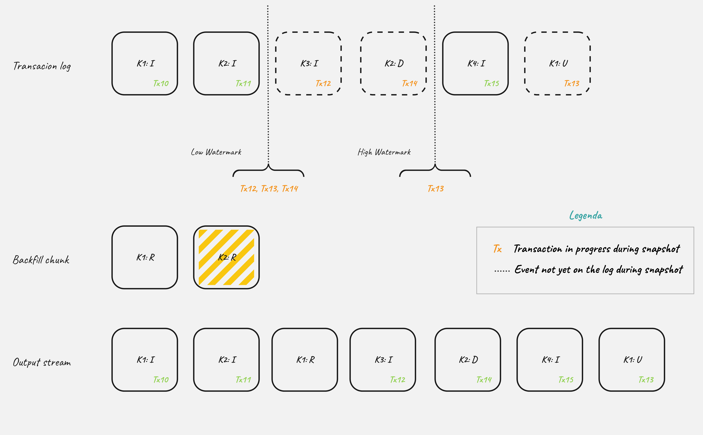

# DDD-8: Read-only incremental snapshots for other relational connectors

## Motivation
[Incremental snapshot](https://debezium.io/blog/2021/10/07/incremental-snapshots/) was a major improvement introduced in Debezium 1.6 to solve three key issues with Debezium's handling of captured tables.

First, there was the near-impossibility of adding additional tables to the captured list if existing data needed to be streamed. 
Second, the long-running snapshot process could not be terminated or resumed, requiring a complete restart if interrupted. 
Third, change data streaming was blocked until the snapshot was completed. 
The incremental snapshot addresses these problems by enabling more flexible and efficient data capture.

The incremental snapshot was implemented based on the paper [DBLog: A Watermark Based Change-Data-Capture Framework](https://arxiv.org/pdf/2010.12597v1) by Andreas Andreakis and Ioannis Papapanagiotou.
The main idea behind this approach is that change data streaming is executed continuously together with snapshotting. 
The framework inserts low and high watermarks into the transaction log (by writing to the source database), and between those two points, a part of the snapshotted table is read. 
The framework keeps a record of database changes between the watermarks and reconciles them with the snapshotted values if the same records are snapshotted and modified during the window.

This means that Debezium must have write permission on a specific table used during the snapshot to create the low/high watermarks.

This can be a limitation for some users with different motivations:

* Capturing changes from read-replicas
* Policy restrictions - hard to get write permissions

To remove this friction, there was a community contribution that permitted to have [read-only incremental snapshots for MySQL](https://debezium.io/blog/2022/04/07/read-only-incremental-snapshots/) leveraging on the `GTIDs`.

## Goals

The goal is to investigate the possibility to have read-only incremental snapshot for others databases too. 

### PostgreSQL

There are two possible way to avoid writing the low/high watermark on the table identified by the `signal.data.collection` property:

* Use [pg_logical_emit_message](https://pgpedia.info/p/pg_logical_emit_message.html****) that permits to write directly into the WAL. It is available from PostgreSQL 9.6.
* Use [pg_current_snapshot](https://pgpedia.info/p/pg_current_snapshot.html) that permits to get a current snapshot - a data structure showing which transaction IDs are now in-progress. It is available from PostgreSQL 13.

The use of `pg_logical_emit_message` is restricted to superusers and users having `REPLICATION` privilege, 
so it is fine to be used with major Debezium configurations except when logical decoder plugin is `pgoutput` and `publication.autocreate.mode` is `disabled`. 
With this setup, Debezium does not require replication privileges since the creation of publications are not automatically managed by Debezium.

Since, in general, it is best to manually create publications for the tables that you want to capture, before you set up the connector, the use of `pg_logical_emit_message` has been discarded.

The `pg_current_snapshot` functions instead does not require any specific privileges, so it is a good fit for meet our goal. 

#### High level algorithm
The `pg_current_snapshot` returns a [pg_snapshot](https://github.com/postgres/postgres/blob/06c418e163e913966e17cb2d3fb1c5f8a8d58308/src/include/utils/snapshot.h#L142) that is composed by:

* xmin: defines the oldest active transaction in the system. All transactions with a txid lower than this value have already been committed.
* xmax: contains the most recent transaction ID known by the snapshot. All tuples with a txid > xmax are invisible by the current snapshot.
* xip: the set of in-progress transaction IDs contained in a snapshot.

> **_NOTE:_** the id returned is `xid8` which never wraps around, so we don't need to take care about it either.

```shell
SELECT pg_current_snapshot();
 pg_current_snapshot 
---------------------
 795:799:795,797
(1 row)
```
The idea is to use the `pg_current_snapshot` to get the `xmin` before starting reading the chunk and the `xmax` after finishing the read of the chunk. 
In this way we can clearly identify the de-duplication window. When an event with `txId` that falls inside the window arrives, it needs to be de-duplicated. 

It is also worth to note that the connection used during incremental snapshot queries doesn't explicitly set the transaction isolation level, 
by default the [READ COMMITTED](https://www.postgresql.org/docs/current/transaction-iso.html) is used.
This will avoid a possible *dirty read* - a transaction reads data written by a concurrent uncommitted transaction.

In pseudocode, the algorithm for deduplicating events read from log and events retrieved via snapshot chunks looks like this: 

```text
(1) pg_snapshot lwSnapshot := pg_current_snapshot()
(2) chunk := select next chunk from table
(3) pg_snapshot hwSnapshot := pg_current_snapshot()
  inwindow := false
  // other steps of event processing loop
  while true do
       e := next event from changelog
       append e to outputbuffer
       if not inwindow then
           if e.txId >= pg_snaphot_min(lwSnapshot)  //reached the low watermark
               inwindow := true
       
       if e.txId < max(pg_snaphot_max(lwSnapshot), pg_snaphot_max(hwSnapshot)) //haven't reached the high watermark yet
           if chunk contains e.key then
               remove e.key from chunk
       else //reached the high watermark
           for each row in chunk do
               append row to outputbuffer
   // other steps of event processing loop
```

The figure below shows the process of deduplication. We have:

* Transaction log: is the resulting database logs, each square represent and event with the indication of: its key, the type of operation (**I**nsert, **U**pdate, **D**elete), and the associated transaction.
* Back-fill chunks: record read from the database during chunk snapshot. Striped one means that the record has been removed by the deduplication.
* Output stream: the final emitted events. 

The thing to note here is what happens to the record with key `k2`. 
This record is read by the snapshot and, since it associated to a transaction that completed during the snapshot - the high watermark reveal only the `Tx13` is still in progress, 
we are sure that this event must be deduplicated. This will effectively remove from the windows the event that was read.



#### Proposed changes

Provide a `PostgresReadOnlyIncrementalSnapshotChangeEventSource` that will implement the following methods from the `IncrementalSnapshotChangeEventSource` interface:

```java
void processMessage(P partition, DataCollectionId dataCollectionId, Object key, OffsetContext offsetContext); // (1)
void emitWindowOpen(); // (2)
void emitWindowClose(P partition, OffsetContext offsetContext); // (3)
```
1. Contains the logic to check whenever the low/high watermark reached and deduplication.
2. Call the `pg_current_snapshot()` to get the current in-progress transaction IDs
3. Call the `pg_current_snapshot()` to get the current in-progress transaction IDs, and define the completed transaction IDs.

Extend the `AbstractIncrementalSnapshotContext` with `PostgresReadOnlyIncrementalSnapshotContext` to add information about the low/high watermark sets.

Note that before calling the `pg_current_snapshot()` a call to `pg_current_xact_id ()` must be done to force the database to assign a new transaction ID because we will not any database updates. This enables the `pg_current_snapshot()` to see the others transactions. 

Support for `read.only` property will be added to enable the read only incremental snapshot. 

#### Limitations
The `pg_current_snapshot()` will show only top-level transaction IDs; sub-transaction IDs are not shown;

So if the snapshot is reading a chunk from a table that is modified through a sub-transaction a duplicate may not be recognized. 

Furthermore, the de-duplication algorithm is based on the assumption that the transaction isolation level is set to [READ COMMITTED](https://www.postgresql.org/docs/current/transaction-iso.html).
