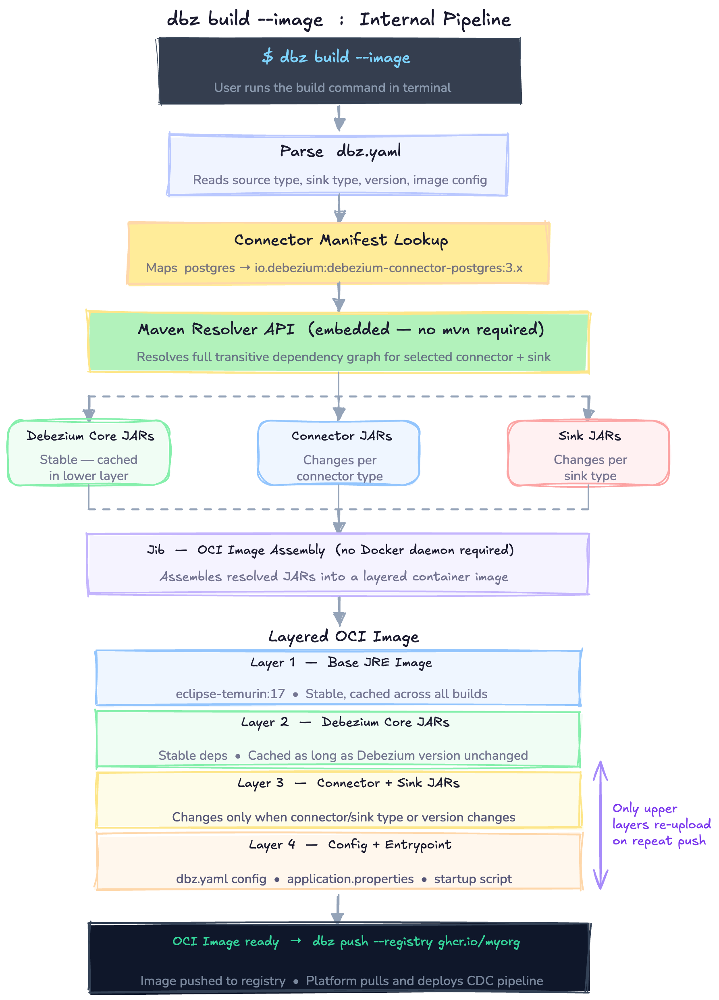

# Debezium: Debezium CLI — A Unified Command-Line Interface for CDC Pipeline Lifecycle Management

## About Me

1. **Name:** Binayak Das (GitHub: `Binayak490-cyber`)
2. **University / Program / Year / Expected Graduation:** Medhavi Skills University / B.Tech Computer Science Engineering 
3. **Contact:** binayak490@gmail.com | +91 9435512001
4. **Time Zone:** IST (UTC+5:30)
5. **Resume:** [GitHub](https://github.com/Binayak490-cyber)

### Introduction

I am Binayak Das, a Computer Science undergraduate at Medhavi Skills University, India. I have been drawn to developer tooling and open source infrastructure for a while - tools that sit between the developer and the system, making complex workflows feel simple. The Debezium CLI project is exactly that kind of problem: CDC pipelines today require manual setup, UI-driven configuration, and no scriptable path from zero to a running pipeline. A well-designed CLI fixes all of that.

Over the past few weeks I have been actively contributing to the Debezium codebase, with multiple pull requests submitted to the Debezium organization. Each contribution meant reading unfamiliar code, understanding how it worked, and making changes without breaking anything else - which gave me a solid feel for how the codebase is structured. I also connected with mentors Giovanni Panice and Mario Fiore Vitale on the #community-gsoc Zulip channel and had a detailed discussion about the project scope and architecture. I work primarily with Java, Python, JavaScript, and TypeScript, and have hands-on experience with Docker and containerization - which maps directly to the Jib-based OCI image assembly at the core of this proposal.

To validate my design before submitting this proposal, I built a working proof of concept of the dbz build pipeline - it reads a dbz.yaml config, performs a connector manifest lookup, resolves the dependency graph, and assembles the layered OCI image structure. Building it confirmed that the architecture I am proposing works on real Debezium connectors today.

---

## Code Contribution

| # | PR Link | Repository | Status |
|---|---|---|---|
| 1 | [#7119 — Pull actual default values into description of configuration properties](https://github.com/debezium/debezium/pull/7119) | debezium/debezium | Merged |
| 2 | [#7126 — Fix incorrect JavaDoc in Configuration getters](https://github.com/debezium/debezium/pull/7126) | debezium/debezium | Merged |
| 3 | [#7137 — Refactor duplicated validator logic for include/exclude filter properties](https://github.com/debezium/debezium/pull/7137) | debezium/debezium | Merged |
| 4 | [#7154 — Initialize MDC earlier during connector startup](https://github.com/debezium/debezium/pull/7154) | debezium/debezium | Merged |
| 5 | [#7141 — Persist incremental snapshot pause state in connector offsets](https://github.com/debezium/debezium/pull/7141) | debezium/debezium | Open |
| 6 | [#7206 — Propagate MDC context in snapshot worker threads and JdbcConnection close thread](https://github.com/debezium/debezium/pull/7206) | debezium/debezium | Open |
| 7 | [#255 — Prevent infinite retry loop when connector initialization fails](https://github.com/debezium/debezium-server/pull/255) | debezium/debezium-server | Open |
| 8 | [PR #XXXX](https://github.com/debezium/) | debezium/debezium | Open / Merged |

> All PRs are submitted to the Debezium organization, written entirely by me, and publicly visible to mentors and org admins.

---

## Project Information

### Abstract

Debezium is a powerful CDC platform, but today the only way to fully create and manage a CDC pipeline is through the Debezium Platform UI. There is no command-line interface that gives developers a fast, scriptable, and developer-friendly way to interact with the CDC ecosystem. This project proposes building `dbz` — a unified Debezium CLI — as a brand new piece of the Debezium ecosystem. The CLI has two core responsibilities: a **build subsystem** that assembles a trimmed Debezium Server with only the connectors the user actually needs, and a **platform subsystem** that wraps the Debezium Platform REST API to create, manage, and observe CDC pipelines from the terminal. The complete developer journey is: `dbz init` → `dbz build` → `dbz push` → Platform deploys. This makes Debezium more accessible, more scriptable, and a natural entry point for anyone starting with CDC.

---

## Why This Project?

CDC is infrastructure-level work, and infrastructure tools live in the terminal. Docker, kubectl, and the AWS CLI prove that a well-designed CLI is often more powerful than a UI — it's composable, scriptable, and fits naturally into CI/CD pipelines. Debezium deserves the same.

What drew me to this project is that it is not a feature addition — it is a new piece of the ecosystem that I would own end to end. In my conversations with mentors Giovanni Panice and Mario Fiore Vitale on the `#community-gsoc` Zulip channel, Giovanni confirmed that the build mechanism is open to my proposal and that the Debezium Platform is already live and documented via an OpenAPI specification. That means the platform integration half is well-scoped, and the build subsystem is where I get to make real architectural decisions.

From a developer experience perspective, I believe the biggest friction point in Debezium today is **setup** — figuring out which JARs to include, how to wire connectors together, and how to get a server running. A CLI that solves that in a single command is the highest-value DX win. Giovanni agreed with this reasoning and encouraged me to defend it in my proposal.

From my own perspective, the value of the Debezium CLI comes down to three things: **speed**, **control**, and **confidence**.

Today, a developer who wants to run a CDC pipeline has to manually hunt for the right JARs, write configuration by hand, and rely on a UI to deploy and observe what is happening. There is no fast path. The CLI changes that — `dbz init` gives you a working config in seconds, `dbz build` assembles exactly the right dependencies without requiring Maven or Docker, and `dbz pipeline logs --stream` brings observability directly into the terminal where developers already work.

The deeper value is **ownership** — a developer using the CLI can version-control their entire CDC setup, reproduce it anywhere, and wire it into CI/CD pipelines. That is something a UI can never offer. For teams that treat infrastructure as code, the CLI makes Debezium a first-class citizen in that workflow.

---

### Technical Description

#### System Overview

The Debezium CLI (`dbz`) is designed around a single principle: **a developer should be able to go from zero to a running CDC pipeline using only the terminal, without reading pages of documentation or manually managing JARs and configuration files.**

To achieve this, the CLI is split into two distinct but connected subsystems. The **Build Subsystem** handles the local developer experience — scaffolding config, assembling a trimmed Debezium Server, and packaging it as a container image. The **Platform Subsystem** handles the operational experience — talking to a running Debezium Platform instance to create, manage, and observe pipelines via its REST API. These two subsystems are not independent features; they form a single end-to-end flow where the output of the Build Subsystem (a container image in a registry) becomes the input to the Platform Subsystem (a pipeline that references that image).

The CLI is organized into two subsystems that connect into a single end-to-end developer journey:

```
╔══════════════════════════════════════════════════════════════════════════════╗
║                            dbz  CLI  (Unified)                              ║
╠═════════════════════════════════════╦════════════════════════════════════════╣
║       BUILD SUBSYSTEM               ║       PLATFORM SUBSYSTEM               ║
║  ─────────────────────────────────  ║  ────────────────────────────────────  ║
║   dbz init  --source  --sink        ║   dbz pipeline  list / get /           ║
║   dbz validate                      ║                 create / update /      ║
║   dbz build                         ║                 delete / logs /        ║
║   dbz build --image                 ║                 signal                 ║
║   dbz push  --registry <url>        ║   dbz source    list / get / create …  ║
║                                     ║   dbz destination  …                   ║
║  [ Reads: dbz.yaml ]                ║   dbz connection   validate / schemas  ║
║  [ Uses:  Maven Resolver API ]      ║   dbz transform    …                   ║
║  [ Packs: Jib (OCI image) ]         ║   dbz catalog   list / get             ║
║                                     ║   dbz pipeline logs --stream  (WS)     ║
╚══════════════╦══════════════════════╩═══════════════════╦════════════════════╝
               ║                                          ║
               ║  push image                              ║  REST / WebSocket
               ▼                                          ▼
╔══════════════════════════╗             ╔═══════════════════════════════════╗
║    Container Registry    ║             ║      Debezium Platform            ║
║  ──────────────────────  ║             ║  ───────────────────────────────  ║
║   • Docker Hub           ║             ║   conductor (Quarkus REST API)    ║
║   • GitHub GHCR          ║  ◄──────────║   • /api/pipelines  (CRUD)        ║
║   • Custom registry      ║  pull image ║   • /api/sources                  ║
║                          ║             ║   • /api/destinations              ║
╚══════════════╦═══════════╝             ║   • /api/connections               ║
               ║                         ║   • /api/catalog                   ║
               ║  deploy                 ║   • WS  log stream                 ║
               ▼                         ╚═══════════════════════════════════╝
╔══════════════════════════╗
║    Debezium Server       ║
║  ──────────────────────  ║
║   CDC Engine (Quarkus)   ║
║   • Postgres Connector   ║
║   • MySQL Connector      ║
║   • Kafka Sink           ║
║   • Custom Sink          ║
╚══════════════════════════╝

  Developer Journey:
  ─────────────────
  $ dbz init --source postgres --sink kafka     ← scaffold dbz.yaml
  $ dbz build --image                           ← assemble trimmed server image
  $ dbz push --registry ghcr.io/myorg           ← push to registry
  $ dbz pipeline create --file pipeline.yaml    ← Platform picks up image & runs CDC
  $ dbz pipeline logs --stream <id>             ← live log tail via WebSocket
```

> A visual version of this diagram is available at: [Excalidraw](https://excalidraw.com/#json=Bq2DmutAwtB0pr_MfWZ_n,wFhcJ57jXLh2e21h9PS6dw)

---

#### Module Structure

The CLI will live as a new Maven module `debezium-cli` inside the main `debezium/debezium` monorepo. This placement is intentional — it shares the Debezium BOM (Bill of Materials), is versioned together with all other Debezium components, and benefits from the existing CI/CD infrastructure. The internal package structure follows the same conventions as the rest of the codebase:

- `io.debezium.cli` — entry point, top-level `DbzCommand` (Picocli root)
- `io.debezium.cli.build` — Build Subsystem: init, build, push commands
- `io.debezium.cli.platform` — Platform Subsystem: pipeline, source, destination, connection, transform, catalog commands
- `io.debezium.cli.config` — CLI config management, `dbz.yaml` parsing, env var interpolation
- `io.debezium.cli.client` — Quarkus REST client interfaces for Platform API
- `io.debezium.cli.output` — Output formatters (table, JSON, plain)
- `io.debezium.cli.manifest` — Connector manifest registry (connector name → Maven coordinates)

---

#### Technology Stack

| Component | Choice | Reason |
|---|---|---|
| CLI Framework | **Quarkus CLI + Picocli** | Consistent with Platform backend; Picocli provides subcommands, auto-generated help, shell completion |
| HTTP Client | **Quarkus REST Client (JAX-RS)** | Native Quarkus integration, type-safe REST calls against Platform API |
| WebSocket Client | **Quarkus WebSocket client** | For live pipeline log streaming (`dbz pipeline logs --stream`) |
| Build artifact | **Native binary via GraalVM** | Fast startup (<50ms), no JVM required, single distributable binary |
| Container building | **Jib** | Builds OCI images without a Docker daemon — better for CI/CD |
| Config format | **YAML (`dbz.yaml`)** | Human-readable, familiar to Debezium users |
| Repository | **New module `debezium-cli`** inside `debezium/debezium` | Shares BOM, versioned together with the ecosystem |

---

#### CLI Framework Design — Picocli Command Hierarchy

The CLI is built using **Quarkus CLI + Picocli**. Picocli was chosen because it is already used across the Java ecosystem, provides automatic `--help` generation, shell completion scripts (bash/zsh/fish), and supports deeply nested subcommand trees — which is exactly what `dbz pipeline create`, `dbz source list`, etc. require.

The command hierarchy is designed as a tree. The root `DbzCommand` holds global options like `--output` and `--quiet`. Each subsystem (build, platform) is a command group. Each resource (pipeline, source, destination) is a subcommand group, and each action (list, get, create) is a leaf command. This design means adding a new resource in the future requires only adding a new subcommand group — the global flags, output formatting, and config loading are inherited through Picocli's mixin system.

A `@Mixin` class called `PlatformClientMixin` is shared across all Platform Subsystem commands. It reads the platform URL from `~/.dbz/config.yaml`, instantiates the REST client, and handles authentication. This eliminates duplicated boilerplate across the 30+ platform commands and ensures consistent error handling when the Platform is unreachable.

---

#### Full Command Structure

**Build Subsystem — assembles a trimmed Debezium Server:**

```bash
dbz init --source postgres --sink kafka   # scaffold dbz.yaml config template
dbz build                                 # assemble a trimmed JAR
dbz build --image                         # produce an OCI container image
dbz push                                  # push image to container registry
dbz push --registry ghcr.io/myorg
```

**Platform Subsystem — wraps the Debezium Platform REST API:**

```bash
# Pipelines
dbz pipeline list
dbz pipeline get <id>
dbz pipeline create --file pipeline.yaml
dbz pipeline update <id> --file pipeline.yaml
dbz pipeline delete <id>
dbz pipeline logs <id>                     # download full logs
dbz pipeline logs --stream <id>            # live log tail via WebSocket
dbz pipeline signal <id> --type <type>

# Sources
dbz source list | get | create | update | delete
dbz source verify-signals <id>

# Destinations
dbz destination list | get | create | update | delete

# Connections
dbz connection list | get | create | update | delete
dbz connection validate --file conn.yaml
dbz connection schemas
dbz connection collections <id>

# Transforms
dbz transform list | get | create | update | delete

# Catalog — discover available connectors
dbz catalog list
dbz catalog list --type source
dbz catalog get <type> <class>

# CLI config
dbz config set platform-url http://localhost:8080
dbz config get
dbz version
```

---

#### Configuration Management — `dbz.yaml` Design

The `dbz.yaml` file is the central configuration artifact of the Build Subsystem. It serves two purposes: it describes the CDC pipeline (which connector, which sink, what database) and it controls the build process (image name, registry, tag). When a user runs `dbz init --source postgres --sink kafka`, the CLI scaffolds a fully commented `dbz.yaml` template with placeholder values and documentation inline. This removes the need to consult external documentation for basic setups.

The config file supports **environment variable interpolation** using `${VAR_NAME}` syntax. This is critical for production use — credentials like database passwords should never be hardcoded in a config file. The interpolation is resolved at build time by the CLI, keeping secrets out of the image and out of version control.

The CLI's own configuration (Platform URL, registry credentials) is stored separately in `~/.dbz/config.yaml` — a user-level config that persists across projects. This separation mirrors how tools like `kubectl` and the AWS CLI handle the distinction between project config and user-level credentials.

---

#### How `dbz init` Works Internally

When a user runs `dbz init --source postgres --sink kafka`, the CLI does not just print a hardcoded string. It uses **Qute** — Quarkus's built-in type-safe templating engine — to render a `dbz.yaml` template from a set of bundled template files. Each connector type has its own Qute template that includes the connector-specific required fields, their types, and inline comments explaining each field. For example, the Postgres template includes `database.hostname`, `database.port`, `slot.name`, and `publication.name` — fields that are unique to the Postgres connector and would be confusing to discover manually.

This template-per-connector design means adding support for a new connector in the future only requires adding a new Qute template file — no changes to the `init` command logic itself. The template rendering also performs **connector compatibility validation** at init time — if the user specifies a source and sink combination that is known to be incompatible (e.g. a connector that does not support a particular sink format), the CLI warns immediately rather than letting the user discover this at build time.

---

#### How `dbz validate` Works Internally

The `dbz validate` command performs two levels of validation against `dbz.yaml`. The first level is **schema validation** — it checks that all required fields are present, that values match their expected types (e.g. `database.port` is an integer), and that no unknown fields are present. This is implemented using a JSON Schema validator (the `dbz.yaml` is parsed to a JSON object internally and validated against a bundled JSON Schema file). The JSON Schema approach was chosen because it is declarative — adding a new required field to a connector only requires updating the schema file, not writing new Java validation code.

The second level is **semantic validation** — it checks things that JSON Schema cannot express, such as whether the connector name matches a known entry in the connector manifest, whether the sink type is compatible with the selected source connector, and whether referenced environment variables actually exist in the current shell environment. Each validation failure produces a clear, actionable error message that tells the user exactly which field is wrong and what the correct value should be. This is the same pattern used by tools like Terraform's `terraform validate` — validate early, fail fast, explain clearly.

---

#### How `dbz push` Authenticates to the Registry

Registry authentication is one of the most common pain points in container-based workflows. The CLI handles this by reading credentials from the user's existing **Docker credential store** — specifically `~/.docker/config.json` — using the same credential resolution logic that Docker CLI and Jib use. This means if the user is already logged in to Docker Hub or GHCR via `docker login`, the CLI can push without asking for credentials again.

For CI/CD environments where `~/.docker/config.json` does not exist, the CLI also supports credentials via environment variables (`DBZ_REGISTRY_USERNAME` and `DBZ_REGISTRY_PASSWORD`) and via the user-level `~/.dbz/config.yaml`. The resolution order is: environment variables first, then `~/.dbz/config.yaml`, then `~/.docker/config.json`. This mirrors how other tools like Skopeo and Crane handle registry authentication and makes the CLI behave predictably across local and CI environments.

---

#### Connector Manifest — Update Strategy

The connector manifest is a YAML file bundled inside the CLI binary at compile time. It maps connector names to their Maven coordinates and supported version ranges. For example:

```yaml
connectors:
  postgres:
    artifact: io.debezium:debezium-connector-postgres
    versions: ["2.7.x", "3.0.x", "3.1.x"]
    sinks: [kafka, http, pulsar, redis]
  mysql:
    artifact: io.debezium:debezium-connector-mysql
    versions: ["2.7.x", "3.0.x", "3.1.x"]
    sinks: [kafka, http, pulsar, redis]
```

Because the manifest is bundled inside the binary, it is always consistent with the CLI version — there is no risk of the manifest being out of sync with the connector versions the CLI knows how to assemble. When a new Debezium connector version is released, the manifest is updated and a new CLI version is released alongside it, following Debezium's existing release cadence.

For advanced users who need to use a connector version not in the bundled manifest (e.g. a snapshot build or a community connector), the manifest supports an **override mechanism** in `dbz.yaml` — the user can specify a custom Maven coordinate directly, and the CLI will resolve it from Maven Central or a configured private repository. This escape hatch ensures the CLI never becomes a blocker for users who need cutting-edge connector versions.

---

#### The Developer Journey (End-to-End)

```bash
# Step 1 — Scaffold a CDC project (no Platform needed)
dbz init --source postgres --sink kafka
# Generates dbz.yaml with config template

# Step 2 — Edit dbz.yaml with your database credentials and topic config

# Step 3 — Build a trimmed server image
dbz build --image
# Resolves only postgres-connector + kafka-sink JARs
# Produces: debezium-server:postgres-kafka-1.0

# Step 4 — Push to registry
dbz push --registry ghcr.io/myorg

# Step 5 — Deploy via Platform
dbz config set platform-url https://my-platform.internal
dbz source create --file source.yaml
dbz destination create --file dest.yaml
dbz pipeline create --file pipeline.yaml
# Platform pulls image from registry, starts CDC

# Step 6 — Monitor
dbz pipeline list
dbz pipeline logs --stream <id>            # live log tail
```

---

#### Build Subsystem Design — Trimmed Server Assembly

This is the most novel and architecturally interesting part of the project. The core problem it solves is that Debezium Server today ships as a fat JAR containing every connector and sink — Postgres, MySQL, MongoDB, Oracle, Kafka, Pulsar, HTTP, and more. A user who only needs Postgres-to-Kafka still downloads and runs a JAR with all of these included. This increases image size, startup time, and attack surface.

The CLI solves this by assembling a **trimmed server** — a Debezium Server JAR that contains only the connector and sink the user actually needs. The mechanism works as follows:

**`dbz.yaml` — project config file generated by `dbz init`:**

```yaml
version: "1.0"
name: "my-postgres-to-kafka"

source:
  type: postgres
  config:
    database.hostname: localhost
    database.port: 5432
    database.user: ${DBZ_DB_USER}
    database.password: ${DBZ_DB_PASS}
    database.dbname: mydb
    table.include.list: public.orders

sink:
  type: kafka
  config:
    producer.bootstrap.servers: localhost:9092
    topic.prefix: cdc

build:
  image:
    name: debezium-server
    tag: postgres-kafka-latest
    registry: ghcr.io/myorg
```

**How `dbz build` works:**

1. Parse `dbz.yaml` to identify the connector + sink combination
2. Look up a **connector manifest** (bundled with the CLI binary) that maps `postgres` → `io.debezium:debezium-connector-postgres:${version}`
3. Use the **Maven Resolver API** (embedded — no Maven installation required) to resolve only the needed JAR dependency graph
4. Assemble a Debezium Server runner with the resolved classpath
5. Optionally wrap in an OCI image via **Jib** (`dbz build --image`)

**Why Maven Resolver API over shelling out to `mvn`:**
Embedding Maven Resolver adds ~2MB to the binary but eliminates the requirement for Maven to be installed on the user's machine. This is the right DX tradeoff — one binary, no prerequisites.

The **connector manifest** is a YAML file bundled inside the CLI binary that maps human-readable connector names to their Maven coordinates and known compatible versions. For example, `postgres` maps to `io.debezium:debezium-connector-postgres:${debezium.version}`. This manifest is versioned alongside the CLI — when a new connector is released, the manifest is updated and a new CLI version is released. The manifest also declares transitive dependency exclusions, ensuring that conflicting transitive dependencies between connectors do not appear in the assembled classpath.

The **classpath assembly** produces a directory of JARs rather than a single fat JAR. This is intentional — Jib can layer these JARs efficiently in the container image, putting stable dependencies (Debezium core, Quarkus runtime) in lower layers that are cached across rebuilds, and putting frequently changing connector JARs in upper layers. This makes `dbz push` significantly faster on repeat builds because only the top layers need to be uploaded.

> The diagram below shows the complete internal pipeline of `dbz build --image` — from user command all the way to a layered OCI image ready for push.



---

#### Platform REST Client Design

The CLI integrates with the Debezium Platform through its REST API, which is already available in the `debezium-platform-conductor` module (confirmed by mentor Giovanni Panice). The Platform backend is a Quarkus application that exposes an **OpenAPI specification** at `/q/openapi` when running. This specification formally describes all 35+ endpoints across 7 resources: pipelines, sources, destinations, connections, transforms, vaults, and catalog.

Rather than hand-writing HTTP calls, the CLI uses a **Quarkus REST Client** interface that is registered against the Platform's base URL. Each interface method maps directly to one Platform endpoint. This approach is type-safe — if the Platform changes a request or response shape, the compiler catches the mismatch immediately rather than failing at runtime. The REST client handles JSON serialization/deserialization automatically via Jackson, which is already part of the Quarkus dependency tree.

**Authentication** is handled via a configurable header injected by the `PlatformClientMixin`. If the Platform requires a bearer token, the user sets it once with `dbz config set platform-token <token>` and the mixin injects it as an `Authorization` header on every request. The mixin also performs a health check on startup — if the Platform URL is unreachable, the CLI fails fast with a clear error message rather than producing a confusing HTTP timeout deep in the stack.

**Error handling** is a first-class concern. When the Platform returns a 4xx or 5xx response, the CLI extracts the error body, formats it clearly, and exits with a non-zero exit code. This makes the CLI scriptable — CI/CD pipelines can rely on exit codes to detect failures without parsing output. The `--quiet` flag suppresses all output except errors, and `--dry-run` on write commands prints the request body that would be sent without actually calling the API.

```java
@RegisterRestClient(configKey = "debezium-platform-api")
@Path("/api")
public interface PlatformClient {

    @GET @Path("/pipelines")
    List<Pipeline> listPipelines();

    @POST @Path("/pipelines")
    Response createPipeline(PipelineRequest request);

    @GET @Path("/pipelines/{id}/logs")
    String downloadLogs(@PathParam("id") String id);

    // ... all 30 endpoints
}
```

Platform URL is configured once via `dbz config set platform-url <url>` and stored in `~/.dbz/config.yaml`.

---

#### Live Log Streaming

One of the most impactful observability features of the CLI is `dbz pipeline logs --stream <id>` — the equivalent of `kubectl logs -f` for Debezium. The Debezium Platform already exposes a WebSocket endpoint for real-time pipeline log streaming. The CLI connects to this endpoint using a Quarkus WebSocket client, receives log lines as they are emitted by the running CDC engine, and prints them to the terminal in real time.

The WebSocket connection lifecycle is managed carefully: the CLI blocks the main thread while the connection is open, handles `SIGINT` (Ctrl+C) gracefully by closing the connection cleanly, and reconnects automatically if the connection drops unexpectedly (with an exponential backoff). This makes `dbz pipeline logs --stream` reliable enough to use in a monitoring script, not just for interactive debugging.

```java
@ClientWebSocket
public class PipelineLogSocket {
    @OnMessage
    void onMessage(String logLine) {
        System.out.println(logLine);
    }
    @OnClose
    void onClose(CloseReason reason) {
        // reconnect logic with backoff
    }
}
```

---

#### Output Formatting and Scripting

A CLI tool is only as useful as its output. All read commands in the Platform Subsystem support three output modes via `--output`:

- **Table (default):** A human-readable formatted table with column headers, aligned columns, and coloured status indicators (e.g. RUNNING in green, STOPPED in red). This is the default because it is the most readable in interactive use.
- **JSON (`--output json`):** The raw Platform API response serialized as JSON. This is intended for piping into `jq` or other JSON processors in scripts.
- **Plain (`--output plain`):** Space-separated values with no headers. This is intended for shell scripting where `awk` or `cut` is used to extract specific fields.

The output formatting logic lives in a separate `io.debezium.cli.output` package and is completely decoupled from the command logic. Each command produces a typed result object, and the formatter decides how to render it. This separation means adding a new output format (e.g. YAML) in the future requires no changes to any command class — only a new formatter implementation.

#### Native Binary — GraalVM Compilation

The final artifact of the CLI is a **native binary** compiled via GraalVM's `native-image` tool. This means the user can install a single file — `dbz` on Linux/macOS — with no JVM, no JAVA_HOME, and no classpath management required. Startup time is under 50ms, making the CLI feel instant and suitable for use in CI/CD pipelines where JVM startup overhead would be unacceptable.

Compiling to a native binary with Quarkus and Picocli requires careful handling of **reflection** — GraalVM's `native-image` performs closed-world analysis at compile time and must be told about any classes that are instantiated reflectively at runtime (which includes Jackson deserialization of API response types, Picocli command classes, and config parsers). This is handled by registering all necessary classes in Quarkus native build configuration using `@RegisterForReflection` annotations and a `reflection-config.json` resource. Getting this right is one of the technical challenges of the final week — it requires running the binary against a live Platform instance and testing all code paths to ensure no `ClassNotFoundException` occurs at runtime.

#### Testing Strategy

The CLI will have a three-layer test suite:

- **Unit tests (JUnit 5):** Test config parsing, connector manifest lookup, output formatting, and command argument validation in isolation. These run in milliseconds and form the core of the CI gate.
- **Integration tests (Quarkus Test + WireMock):** Mock the Debezium Platform REST API using WireMock and test all Platform Subsystem commands against the mock. This verifies the HTTP client, JSON serialization, error handling, and output formatting end-to-end without requiring a live Platform instance.
- **End-to-end tests:** Run against a real Debezium Platform instance (started via Docker Compose in CI) and verify the full `init → build → push → pipeline create → logs` flow. These are slower and run only on PR merge, not on every commit.

---

#### Tradeoffs

| Decision | Chosen | Alternative | Why |
|---|---|---|---|
| Build artifact | Native binary via GraalVM | Fat JAR | No JVM required, instant startup, single file |
| Maven resolution | Embedded Maven Resolver API | Shell out to `mvn` | No Maven install needed on user machine |
| REST client | Generated from OpenAPI spec | Hand-written | Type-safe, auto-updates with Platform API changes |
| Image building | Jib | Docker CLI | No Docker daemon required |
| Config format | YAML | TOML / JSON | Most familiar to Debezium users |

---

#### References

- [Debezium Platform Conductor (REST API source)](https://github.com/debezium/debezium-platform/tree/main/debezium-platform-conductor)
- [Debezium Server](https://github.com/debezium/debezium/tree/main/debezium-server)
- [Quarkus CLI + Picocli Guide](https://quarkus.io/guides/picocli)
- [Maven Resolver API](https://maven.apache.org/resolver/)
- [Jib — containerization without Docker](https://github.com/GoogleContainerTools/jib)
- [Mentor conversation on #community-gsoc Zulip](https://debezium.zulipchat.com/#narrow/channel/573881-community-gsoc/topic/newcomers)

---

### Roadmap

#### Phase 1

- **Community Bonding (pre-coding, ~15h)**
  - Run the Debezium Platform locally and explore all 30 REST endpoints hands-on
  - Deep-dive into Debezium Server's Quarkus build system to finalize the assembly approach
  - Finalize command naming and `dbz.yaml` schema with mentors
  - Set up the `debezium-cli` module scaffold in the monorepo
  - Configure CI/CD (GitHub Actions: build, test, native binary)
  - Submit a small bugfix/good-first-issue PR to establish familiarity with the codebase
  - **Deliverable:** A short demo walkthrough showing the project scaffold running, CI/CD pipeline passing, and a recorded explanation of why each setup decision was made — confirming the architectural foundation is agreed upon with mentors before coding begins

- **Week 1 — Project Scaffold + Core Infrastructure (~25h)**
  - Create `debezium-cli` Maven module with Quarkus + Picocli dependencies
  - Implement base command: `dbz`, `dbz version`, `dbz help`
  - Implement `dbz config set/get` — reads/writes `~/.dbz/config.yaml`
  - Set up unit test framework (JUnit 5 + Quarkus test)
  - Set up GitHub Actions CI
  - Deliverable: Compilable CLI binary with `version`, `help`, and `config` commands working

- **Week 2 — `dbz init` + Config Schema (~30h)**
  - Design and implement `dbz.yaml` schema (connector type, sink type, DB config, build config)
  - Implement `dbz init --source <type> --sink <type>` — generates a commented `dbz.yaml` template
  - Implement env var interpolation in config (`${VAR_NAME}`)
  - Implement `dbz validate` — validates `dbz.yaml` against schema before build
  - Unit tests for config parsing and validation
  - Deliverable: `dbz init --source postgres --sink kafka` generates a valid, usable `dbz.yaml`

- **Week 3 — `dbz build`: Connector Selection + Dependency Resolution (~30h)**
  - Build connector manifest: maps connector names to Maven coordinates
  - Integrate embedded Maven Resolver API for dependency resolution
  - Implement `dbz build` — reads `dbz.yaml`, resolves JAR dependency graph, assembles classpath
  - Produce a runnable Debezium Server fat JAR
  - Integration tests with real dependency resolution
  - Deliverable: `dbz build` produces a working Debezium Server JAR for a postgres-kafka pair

- **Week 4 — `dbz build --image`: Containerization (~30h)**
  - Integrate Jib for OCI image building (no Docker daemon required)
  - Implement `dbz build --image` — wraps the assembled JAR in a container image
  - Image tagging strategy from `dbz.yaml` build config
  - Image metadata (labels, entrypoint, environment variables)
  - Integration tests
  - Deliverable: `dbz build --image` produces a runnable OCI image locally

- **Week 5 — `dbz push` + Phase 1 End-to-End (~25h)**
  - Implement `dbz push [--registry <url>]` — authenticates and pushes image to registry
  - Support Docker Hub and GitHub Container Registry out of the box
  - End-to-end integration test: `init → build --image → push → verify image in registry`
  - Polish error messages and terminal output for Phase 1 commands
  - Update README and module documentation
  - Deliverable: Full `init → build → push` flow working end-to-end — Phase 1 complete

#### Phase 2 — Midterm Point

- **Week 6 — Platform Client Foundation + Pipeline Read (~30h)**
  - Generate/implement typed REST client from Platform OpenAPI spec
  - Implement `dbz config set platform-url` with connection health check on startup
  - Implement `dbz pipeline list` and `dbz pipeline get <id>`
  - Implement output formatting: table (default), JSON (`--output json`), plain
  - Unit tests with mocked Platform responses
  - Deliverable: `dbz pipeline list` returns a formatted list from a running Platform

- **Week 7 — Pipeline Write Operations (~30h)**
  - Implement `dbz pipeline create --file pipeline.yaml`
  - Implement `dbz pipeline update <id> --file pipeline.yaml`
  - Implement `dbz pipeline delete <id>` with confirmation prompt
  - Implement `dbz pipeline signal <id> --type <type>`
  - Integration tests against local Platform instance
  - Deliverable: Full pipeline CRUD working from the CLI

- **Week 8 — Source + Destination Management (~25h)**
  - Implement `dbz source list/get/create/update/delete`
  - Implement `dbz source verify-signals <id>`
  - Implement `dbz destination list/get/create/update/delete`
  - Integration tests
  - Deliverable: Source and Destination management complete — Midterm milestone reached

- **Week 9 — Connection + Transform Management (~25h)**
  - Implement `dbz connection list/get/create/update/delete`
  - Implement `dbz connection validate --file conn.yaml`
  - Implement `dbz connection schemas` and `dbz connection collections <id>`
  - Implement `dbz transform list/get/create/update/delete`
  - Integration tests
  - Deliverable: Connection validation and transform management complete

- **Week 10 — Monitoring: Logs + Catalog (~30h)**
  - Implement `dbz pipeline logs <id>` — download full log dump
  - Implement `dbz pipeline logs --stream <id>` — live WebSocket log tail
  - Implement `dbz catalog list [--type <type>]`
  - Implement `dbz catalog get <type> <class>`
  - Integration tests for WebSocket streaming
  - Deliverable: Live log streaming working — the `kubectl logs -f` equivalent for Debezium

- **Week 11 — Polish, Error Handling + Integration Tests (~25h)**
  - Full end-to-end integration test suite (init → build → push → Platform deploy → monitor)
  - Consistent, user-friendly error messages across all commands
  - `--quiet` flag for scripting (suppress output, only exit codes)
  - `--dry-run` flag for write commands (preview what would happen)
  - Surface Platform API error messages clearly in the terminal
  - Deliverable: Production-quality error handling and complete integration test suite

- **Final Week — Native Binary + Documentation (~30h)**
  - Build native binary via GraalVM (configure reflection hints for Quarkus native)
  - Test native binary on Linux and macOS
  - Write comprehensive README with quickstart guide
  - Add shell completion generation (Picocli built-in: bash/zsh/fish)
  - Write final GSoC blog post summarizing the project
  - Submit final PR for review and merge
  - Deliverable: Distributable native binary — project complete and ready for community use

---

#### Hour Summary

| Phase | Hours |
|---|---|
| Community Bonding | ~15h |
| Phase 1 (Weeks 1–5) | ~140h |
| Phase 2 (Weeks 6–11) | ~165h |
| Final Week | ~30h |
| **Total** | **~350h** |

---

#### Stretch Goals

| Goal | Description |
|---|---|
| `dbz doctor` | Health check — verifies Platform connectivity, registry access |
| Interactive TUI | Terminal dashboard for pipeline overview using a TUI library |
| `dbz import` | Import an existing Kafka Connect connector config into a pipeline |
| Plugin system | `dbz plugin add` for community connector manifests |
| Windows native binary | GraalVM native build for Windows |

---

## Other Commitments

I have no academic exams, internships or other priorities that will conflict with the GSoC coding period. I can commit 30-40 hours per week for the full duration of the program. I will communicate with mentors daily via GitHub discussions or Zulip channels and provide a weekly progress report. If any conflicts come up then my mentors will be informed of these specific dates in advance.

---

## Appendix

### Mentor Conversations (Zulip #community-gsoc)

- [Project discussion thread — Debezium CLI](https://debezium.zulipchat.com/#narrow/channel/573881-community-gsoc/topic/Binayak.20-.20Debezium.20CLI)
- [Newcomers introduction](https://debezium.zulipchat.com/#narrow/channel/573881-community-gsoc/topic/newcomers)

Key points confirmed with mentor Giovanni Panice:
- Build mechanism: **open to proposal** — this proposal uses embedded Maven Resolver API
- Platform REST API: **available today**, documented via OpenAPI specification (exposed at `/q/openapi`)
- Architecture (build → push → Platform): **validated** — *"sounds really interesting (if it's feasible)"*
- Roadmap structure: **core goals + stretch goals** as defined above
- DX priority: **removing setup friction is the highest-value win** — confirmed in mentor conversation

### Platform REST API Coverage

The CLI covers all endpoints exposed by the Debezium Platform conductor (`debezium-platform-conductor`):

| Resource | Endpoints |
|---|---|
| Pipelines | list, get, create, update, delete, logs (download), logs (stream), signal |
| Sources | list, get, create, update, delete, verify-signals |
| Destinations | list, get, create, update, delete |
| Connections | list, get, create, update, delete, validate, schemas, collections |
| Transforms | list, get, create, update, delete |
| Catalog | list (current), list (versioned), get by type+class |
| WebSocket | Live log stream (`/api/pipelines/{id}/logs/stream`) |
