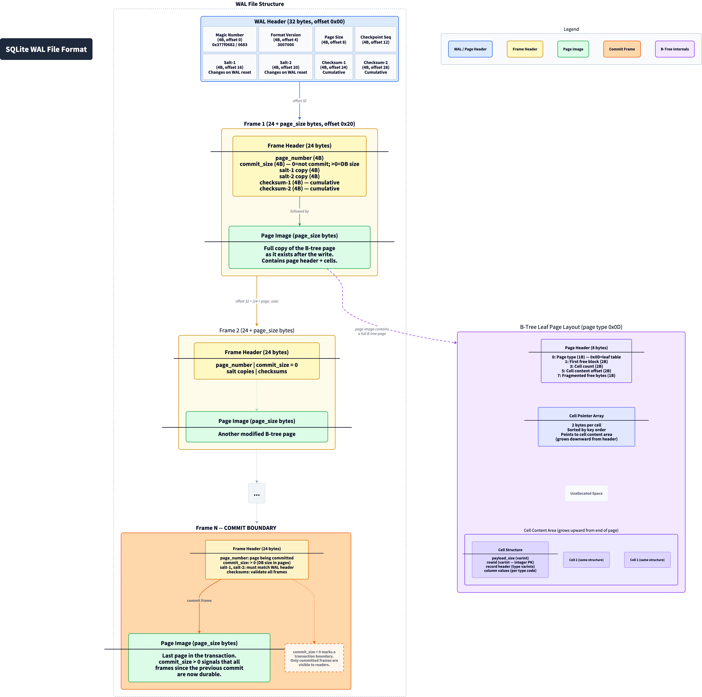
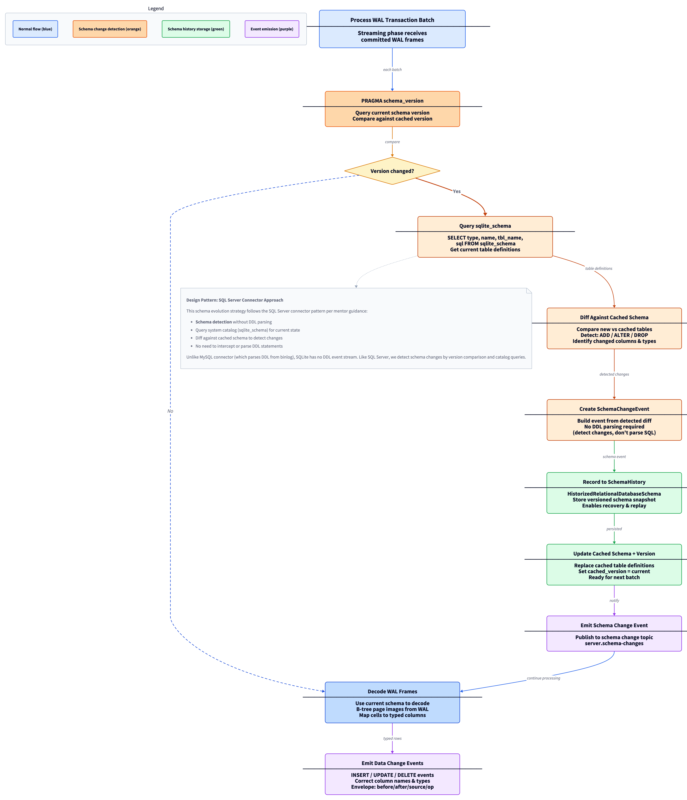
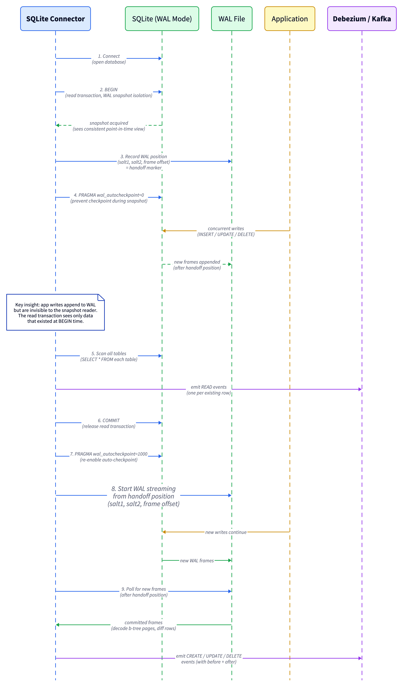
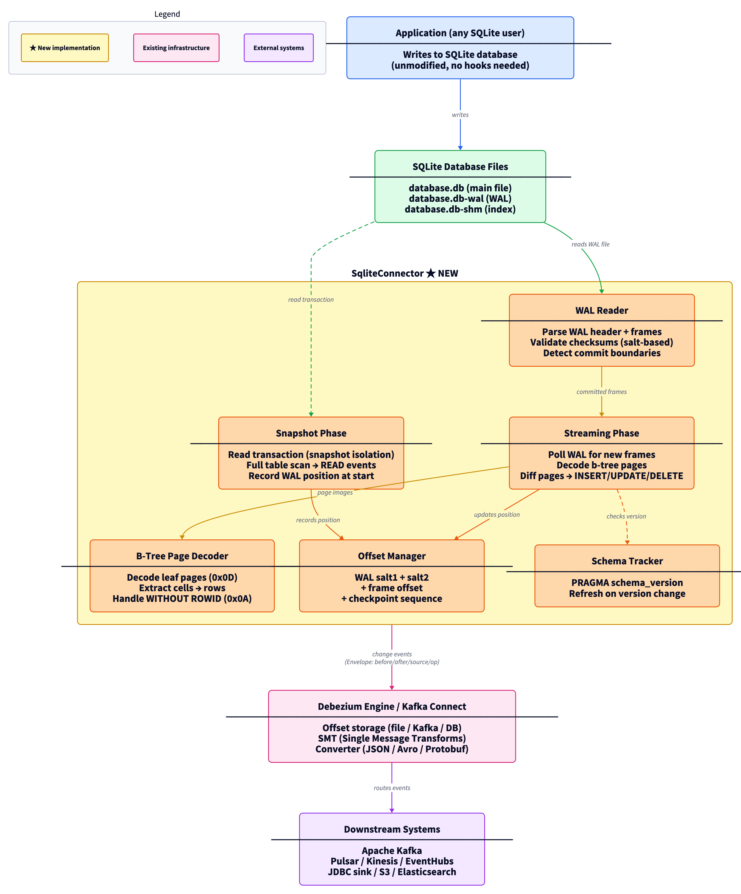
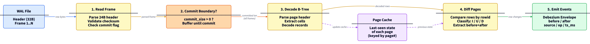

# Debezium source connector for SQLite

## About Me

1. **Name**: Zihan Dai (GitHub: [@PDGGK](https://github.com/PDGGK))
2. **University**: University of Melbourne — Computing and Software Systems + Data Science, First Class Honours
3. **Contact**: dzh1436286758@gmail.com
4. **Timezone**: UTC+10 (Melbourne, Australia)
5. **Awards**: British Physics Olympiad (BPhO) Top Gold; Extended Project Qualification A\*
6. **Zulip introduction**: [Zihan - SQLite Source Connector](https://debezium.zulipchat.com/#narrow/channel/573881-community-gsoc/topic/Zihan.20-.20SQLite.20Source.20Connector)

**Professional experience:**

| Period | Role | Organization | Key Work |
|--------|------|-------------|----------|
| Nov 2024 – Feb 2025 | Core Module Developer | Changzhou Data Technology × Alibaba Cloud Bailian | vLLM + GPTQ microservices; ReAct decision pipeline; 98% classification accuracy on enterprise ad-compliance workloads |
| Jan 2025 – Mar 2025 | Frontend Systems Engineer | ByteDance Winter Camp | Built Heimdallr, a distributed frontend monitoring SDK in TypeScript; 5,000 logs/sec ingestion; real-time anomaly alerting |

**Technical skills:** Java, Python, C/C++, TypeScript, Spring Framework, Kafka Connect, time-series databases, DAO patterns, microservices, Docker, JUnit, Testcontainers, Git/GitHub.

**Time commitment:** 25+ hours per week. No exam or schedule conflicts (June–August).


## Code Contribution

**Debezium** (directly related to this project):

| Contribution | Status |
|-------------|--------|
| [debezium-platform#309](https://github.com/debezium/debezium-platform/pull/309): Add description field to connections API payload | Open |

I have also built the Debezium codebase locally and run the PostgreSQL connector's integration test suite.

**Other open-source contributions** (11 merged PRs across 5 organizations — Apache Beam, IoTDB, ShardingSphere, Iceberg, OpenCV):

| Contribution | Status |
|-------------|--------|
| [beam#37681](https://github.com/apache/beam/pull/37681): Fix resource leak in KafkaIO GCS truststore download | Merged |
| [beam#37356](https://github.com/apache/beam/pull/37356): Make withBackOffSupplier public for bounded retry | Merged |
| [beam#37298](https://github.com/apache/beam/pull/37298): Enhance serialization error messages | Merged |
| [beam#37297](https://github.com/apache/beam/pull/37297): Document Ubuntu 24.04 Python version requirements | Merged |
| [beam#37458](https://github.com/apache/beam/pull/37458): Add record header support to WriteToKafka | Merged |
| [iotdb#17212](https://github.com/apache/iotdb/pull/17212): Fix Process resource leak in system metrics collection | Merged |
| [shardingsphere#38244](https://github.com/apache/shardingsphere/pull/38244): Fix RegistryCenter resource leak in StatisticsCollectJobWorker | Merged |
| [shardingsphere#38152](https://github.com/apache/shardingsphere/pull/38152): Fix ClassCastException reading ZooKeeper config | Merged |
| [iceberg#15463](https://github.com/apache/iceberg/pull/15463): Fix JDBC ResultSet leaks in JdbcCatalog and JdbcUtil | Merged |
| [opencv#28502](https://github.com/opencv/opencv/pull/28502): Fix erode/dilate documentation parameter names | Merged |
| [opencv#28699](https://github.com/opencv/opencv/pull/28699): Replace System.exit with exceptions in HighGui | Merged |
| [sw360#3969](https://github.com/eclipse-sw360/sw360/pull/3969): Fix CSVReader resource leak in UserDatabaseHandler | Open |
| [sw360#3968](https://github.com/eclipse-sw360/sw360/pull/3968): Fix resource leak in SVMUtils | Open |
| [sw360#3967](https://github.com/eclipse-sw360/sw360/pull/3967): Fix FileInputStream leak in ComponentDatabaseHandler | Open |

All contributions target resource management, connector reliability, and correct lifecycle handling — the same work a CDC connector demands.


## Project Information

### Abstract

This project builds a Debezium Source Connector for SQLite that reads the Write-Ahead Log (WAL) to detect committed changes, reconstructs row-level events from page-level WAL frames by decoding SQLite's b-tree page format, and emits standard Debezium change events (Envelope with before/after/source/op fields) that flow into Kafka, Pulsar, or any Debezium Server sink.

SQLite's WAL was designed for local concurrency, not replication. Unlike PostgreSQL's logical decoding or MySQL's binlog, SQLite WAL frames are physical page images — not logical row operations. The connector must parse WAL frame headers to identify committed transactions, decode b-tree leaf pages to extract row data, diff page states to determine which rows were inserted, updated, or deleted, and handle edge cases including WITHOUT ROWID tables, overflow pages, and WAL checkpoint/reset cycles.

I have a working proof-of-concept: a standalone Java WAL reader + b-tree page decoder with 11/11 tests passing and ~50K frames/sec throughput ([sqlite-wal-poc](https://github.com/PDGGK/sqlite-wal-poc)).


### Why This Project?

My open-source work has a recurring theme: finding and fixing resource lifecycle bugs in data infrastructure — GCS handle leaks in Beam's KafkaIO connector, unclosed JDBC ResultSets in Iceberg's catalog, RegistryCenter leaks in ShardingSphere, Process handle leaks in IoTDB's metrics collection. A CDC connector is, at its core, a resource lifecycle problem: database connections, WAL file handles, offset state, schema history — all of it must be acquired, tracked, and released correctly across restarts, rebalances, and crashes. The SQLite connector needs exactly this kind of work.

My Beam KafkaIO contributions gave me practical experience with the Kafka Connect ecosystem that Debezium runs on. Adding record header support to `WriteToKafka` (beam#37458), fixing resource leaks in GCS truststore downloads (beam#37681), and making backoff strategies configurable for bounded retry (beam#37356) all required understanding how Kafka producers, consumers, and Connect workers manage state across distributed systems. The Iceberg JDBC work (iceberg#15463) gave me direct experience with the pattern of reading database metadata, tracking schema, and closing cursors correctly — the same concerns that drive a connector's snapshot and streaming phases.

SQLite's WAL gives you raw B-tree page images, not logical row operations. Reconstructing row-level changes from physical page images — parsing WAL frame headers, decoding b-tree cells via serial type codes and varints, handling checkpoint and WAL reset boundaries — is a low-level systems problem where you have to understand the on-disk format, not just call an API. That's the kind of work I find interesting.

Giovanni responded to my technical email with three specific design answers: no convention for non-monotonic offset tracking (design my own), study the MySQL connector for schema evolution, and use SQLite's read-lock for snapshot-to-stream handoff. He then directed me to "read the guideline and propose a draft pull request," which I have done (debezium-platform#309). That pre-proposal technical engagement directly shaped this proposal's architecture.


### Technical Description

#### Problem Statement

Debezium provides CDC connectors for PostgreSQL, MySQL, MongoDB, SQL Server, Oracle, and other databases. Each connector taps into the database's native change stream mechanism to capture row-level changes with at-least-once delivery guarantees and resume capability.

SQLite has no equivalent mechanism. It is an embedded database with no server process, no replication protocol, and no built-in change subscription API. But SQLite's ubiquity (over a trillion active deployments according to sqlite.org) means there are real use cases for CDC:

- **Edge-to-cloud sync**: Mobile and IoT applications use SQLite locally and need to replicate changes to central systems
- **Embedded analytics**: Applications with SQLite backends need to stream changes into data warehouses
- **Audit and compliance**: Regulatory requirements for change tracking apply to SQLite-backed systems too
- **Legacy migration**: Organizations moving from SQLite to server databases need change capture during transition

The existing approaches to SQLite change tracking each have limitations:

| Approach | Mechanism | Limitations |
|----------|-----------|-------------|
| Trigger-based | `CREATE TRIGGER` writing to changelog table | Requires DDL on target database; triggers can be dropped; performance overhead on every write |
| Session extension | `sqlite3session` API | Requires application to explicitly register tables; C API only; not available in all SQLite builds |
| `update_hook` / `preupdate_hook` | C callback on data changes | In-process only; requires linking into application; no persistence across restarts |
| Polling | Periodic full-table scans | No change granularity; high overhead; misses intermediate states |
| Litestream | WAL-frame streaming to S3/GCS | Replication only (not row-level CDC); no change event semantics; no schema awareness |

None of these produce Debezium-compatible change events. A WAL-based Debezium connector addresses these gaps: it reads the WAL file externally (no application changes required), reconstructs row-level change events, and plugs into the existing Debezium/Kafka Connect infrastructure.

#### v1 Scope and Non-Goals

| Category | Supported (v1) | Not Supported (v1) |
|----------|----------------|---------------------|
| Journal mode | WAL mode only | DELETE, TRUNCATE, PERSIST, MEMORY, WAL2 |
| Table type | Rowid tables (`INTEGER PRIMARY KEY` or implicit `rowid`) | `WITHOUT ROWID` tables (stretch goal), virtual tables |
| Operations | INSERT, UPDATE, DELETE | `VACUUM`, `REINDEX`, `auto_vacuum` (treated as WAL reset) |
| Schema changes | `ALTER TABLE ADD COLUMN`, `CREATE TABLE`, `DROP TABLE` | `ALTER TABLE RENAME COLUMN` (SQLite 3.25+), multiple DDLs between polls |
| Databases | Single database file | `ATTACH`-ed databases, in-memory databases |
| Payload size | Standard cells (payload fits in local page) | Overflow pages (stretch goal) |
| Restart | Resume from stored offset if WAL unchanged | Gap-free recovery after checkpoint truncation during downtime |

#### Design Overview

The SQLite connector follows the same architecture as existing Debezium relational database connectors (modeled on the PostgreSQL connector, as directed by mentor Giovanni Panice). The `SqliteConnectorTask` creates a `ChangeEventSourceCoordinator` that orchestrates the two-phase lifecycle: snapshot first, then streaming.

1. **Snapshot phase**: Acquires a SQLite read transaction (providing snapshot isolation under WAL mode), performs a full table scan of all configured tables, and emits `READ` events for each existing row. The read transaction's WAL position establishes the handoff point for streaming.

2. **Streaming phase**: Polls the WAL file for new committed frames, decodes b-tree pages to reconstruct row-level changes, and emits `CREATE`, `UPDATE`, or `DELETE` events. The offset tracks WAL identity (salt values) and commit frame position for resumable streaming across WAL checkpoint/reset cycles.

#### WAL-Based Change Detection



SQLite's WAL file consists of a 32-byte header followed by a sequence of frames. Each frame contains a 24-byte frame header and a full database page image:

```
WAL File Layout:
+-------------------------------------+
| WAL Header (32 bytes)               |
|   magic, format, page_size,         |
|   checkpoint_seq, salt-1, salt-2,   |
|   checksum-1, checksum-2            |
+-------------------------------------+
| Frame 1: Header (24B) + Page Image  |
|   page_number, commit_size,         |
|   salt copy, checksum               |
+-------------------------------------+
| Frame 2: Header (24B) + Page Image  |
+-------------------------------------+
| ...                                 |
+-------------------------------------+
```

The connector's WAL reader:

1. **Opens the WAL file** and validates the header (magic number `0x377f0682` for little-endian checksums or `0x377f0683` for big-endian)
2. **Reads frames sequentially** starting at byte offset `32 + (N-1) * (pageSize + 24)` for frame N, validating each frame's salt copies against the WAL header salts
3. **Validates frame checksums**: SQLite uses a cumulative checksum algorithm where each frame's checksum pair `(s0, s1)` is computed over the frame header's first 8 bytes plus the full page data, seeded from the previous frame's checksum. The algorithm processes 32-bit words: `s0 += word[i] + s1; s1 += word[i+1] + s0`. A frame is valid only if its computed checksum matches the stored checksum AND its salt copies match the WAL header salts
4. **Identifies commit boundaries** via the `commit_size` field in frame headers (non-zero = last frame of a committed transaction)
5. **Buffers frames per transaction** until a commit frame is seen, then processes the entire transaction atomically
6. **Decodes b-tree pages** within committed frames to extract row-level data
7. **Detects WAL reset**: if salt values differ from stored salts, the WAL has been reset. The connector increments its epoch counter and restarts reading from frame 1

Commit detection logic:

```java
public class WalReader {
    private final RandomAccessFile walFile;
    private final int pageSize;
    private long currentOffset;
    private int salt1, salt2;

    public List<WalTransaction> readNewTransactions() {
        List<WalFrame> pendingFrames = new ArrayList<>();
        List<WalTransaction> committed = new ArrayList<>();

        while (hasMoreFrames()) {
            WalFrame frame = readFrame(currentOffset);
            if (!frame.saltsMatch(salt1, salt2)) {
                break; // salt mismatch: WAL reset or end of valid data
            }
            if (!frame.validateChecksum(prevChecksum)) {
                break; // checksum mismatch: corruption or end of valid data
            }
            pendingFrames.add(frame);

            if (frame.commitSize > 0) {
                committed.add(new WalTransaction(
                    List.copyOf(pendingFrames), frame.commitSize));
                pendingFrames.clear();
            }
            currentOffset += FRAME_HEADER_SIZE + pageSize;
        }
        return committed;
    }
}
```

#### B-Tree Page Decoding

WAL frames contain raw database page images. To extract row-level changes, the connector decodes SQLite's b-tree page format:

```
B-Tree Leaf Page Layout:
+------------------------------+
| Page Header (8 or 12 bytes)  |
|   page_type (0x0D = leaf)    |
|   first_free_block           |
|   cell_count                 |
|   cell_content_offset        |
|   fragmented_free_bytes      |
+------------------------------+
| Cell Pointer Array           |
|   (2 bytes per cell, sorted) |
+------------------------------+
| Unallocated Space            |
+------------------------------+
| Cell Content Area            |
|   Cell N: [size][rowid][data]|
|   ...                        |
|   Cell 1: [size][rowid][data]|
+------------------------------+
```

Page decoder:

```java
public class BTreePageDecoder {
    public List<RowData> decodeLeafPage(byte[] pageImage, boolean isFirstPage) {
        int hdrOffset = isFirstPage ? 100 : 0;
        int pageType = pageImage[hdrOffset] & 0xFF;
        if (pageType != 0x0D) return Collections.emptyList();

        int cellCount = readUint16(pageImage, hdrOffset + 3);
        List<RowData> rows = new ArrayList<>(cellCount);

        for (int i = 0; i < cellCount; i++) {
            int cellPtr = readUint16(pageImage, hdrOffset + 8 + i * 2);
            RowData row = decodeCellAt(pageImage, cellPtr);
            rows.add(row);
        }
        return rows;
    }

    private RowData decodeCellAt(byte[] page, int offset) {
        VarInt payloadSize = readVarint(page, offset);
        VarInt rowId = readVarint(page, offset + payloadSize.bytesRead);
        int headerStart = offset + payloadSize.bytesRead + rowId.bytesRead;
        return decodeRecord(page, headerStart, payloadSize.value, rowId.value);
    }
}
```

**Change detection strategy**: A naive per-page diff is unsound for b-tree storage — rows can move between pages during b-tree splits, merges, rebalancing, or `VACUUM`. The connector performs **transaction-wide reconciliation**: for each committed transaction, it collects ALL modified pages, groups them by table root page, and builds a complete row set keyed by `rowid`. The diff against the cached row set produces:

- Rows in new set but not in cache → `INSERT`
- Rows in both but with different column values → `UPDATE`
- Rows in cache but not in new set → `DELETE`

#### Offset Management

SQLite's WAL frame indices are non-monotonic — they reset to zero when the WAL is checkpointed and reset. The connector's offset encodes:

```java
public class SqliteOffsetContext extends CommonOffsetContext<SqliteSourceInfo> {
    private int walSalt1;           // WAL header salt-1
    private int walSalt2;           // WAL header salt-2
    private long walEpoch;          // monotonic counter: incremented on each WAL reset
    private long walFrameOffset;    // byte offset of last processed commit frame
    private int schemaVersion;      // PRAGMA schema_version at last event
    private Instant timestamp;

    @Override
    public Map<String, ?> getOffset() {
        return Map.of(
            "wal_salt1", walSalt1,
            "wal_salt2", walSalt2,
            "wal_epoch", walEpoch,
            "wal_offset", walFrameOffset,
            "schema_version", schemaVersion,
            "ts_ms", timestamp.toEpochMilli(),
            "snapshot_completed", snapshotCompleted
        );
    }
}
```

The `walEpoch` field makes offset comparison trivial — `(epoch=5, offset=100)` is always after `(epoch=4, offset=99999)`. This design was based on mentor Giovanni's guidance that Debezium has "no convention" for non-monotonic offsets and I needed to design my own.

**Resume logic**: On restart, the connector reads the stored offset and compares the WAL salts:
- **Salts match**: Resume reading from `walFrameOffset`
- **Salts differ**: WAL was reset. Increment `walEpoch` and resume from the beginning of the new WAL. Changes in truncated WAL frames are permanently lost — configurable `wal.gap.policy` (warn/fail/resnapshot)
- **No stored offset**: Start with a full snapshot

#### Schema Evolution

Following mentor guidance ("check MySQL connector"), the connector uses `HistorizedRelationalDatabaseSchema` (the same base class as MySQL and SQL Server connectors). The approach follows the SQL Server connector pattern — schema detection via metadata comparison rather than DDL parsing:

1. On startup, recover schema state from `SchemaHistory` store
2. Before processing each WAL transaction, check `PRAGMA schema_version`
3. If version changed: query `sqlite_schema`, diff against cached schema, record a full `TableChanges` snapshot, emit `SchemaChangeEvent`
4. Schema is NOT embedded in every data change event — `getDdlParser()` returns `null`



#### Snapshot-to-Stream Handoff

Following mentor guidance ("take a look at read-lock in SQLite"), the handoff uses SQLite's WAL-mode snapshot isolation:

1. Begin read transaction (`BEGIN DEFERRED` + first read) — snapshot pinned
2. Record WAL end mark — the JDBC connection acquires `WAL_READ_LOCK(N)`
3. Scan all configured tables — emit `READ` events
4. Commit read transaction — release shared lock
5. Begin streaming from handoff marker

**Open question for mentor review**: The exact mechanism for determining the reader's WAL end mark (`mxFrame`) is the least proven part of this design. Approaches under investigation: (a) `sqlite3_snapshot_get()` (SQLite 3.10+), (b) scanning the WAL file while JDBC read transaction is held, (c) custom native extension via JNI. This will be validated during the bonding period with mentor input.



#### Connector Architecture



The connector implements the standard Debezium connector class hierarchy:

| Debezium Base Class | SQLite Class | Role |
|:---|:---|:---|
| RelationalBaseSourceConnector | SqliteConnector | Config, task creation |
| BaseSourceTask | SqliteConnectorTask | Coordinator, schema |
| ChangeEventSourceFactory | SqliteChangeEventSourceFactory | Snapshot + streaming |
| RelationalSnapshotChangeEventSource | SqliteSnapshotChangeEventSource | 7-step snapshot |
| StreamingChangeEventSource | SqliteStreamingChangeEventSource | WAL poll, decode, emit |
| CommonOffsetContext | SqliteOffsetContext | Salt + epoch + offset |
| HistorizedRelationalDatabaseSchema | SqliteDatabaseSchema | Schema history |
| RelationalChangeRecordEmitter | SqliteChangeRecordEmitter | Page-diff to events |
| HistorizedRelationalDatabaseConnectorConfig | SqliteConnectorConfig | Config + SchemaHistory |



#### Change Event Format

```json
{
  "schema": { "..." },
  "payload": {
    "before": null,
    "after": {
      "id": 42,
      "name": "sensor-1",
      "temperature": 23.5,
      "updated_at": "2026-06-15T10:30:00Z"
    },
    "source": {
      "version": "3.5.0",
      "connector": "sqlite",
      "name": "edge-devices",
      "db": "/data/sensors.db",
      "table": "readings",
      "wal_salt1": 1234567890,
      "wal_salt2": 987654321,
      "wal_epoch": 3,
      "wal_offset": 65536
    },
    "op": "c",
    "ts_ms": 1750000000000
  }
}
```

#### Key Design Decisions

- **WAL-based over trigger-based**: WAL reading is passive — no DDL changes to the target database. Mentor confirmed WAL-based approach.
- **Page-level diff over session extension**: The `sqlite3session` API requires explicit table registration. WAL-based change detection works with any SQLite database.
- **Non-monotonic offset (salt + epoch) over frame number**: Mentor confirmed "no convention — design your own." The salt-based design handles WAL reset transparently.
- **Schema version polling over per-event schema**: Mentor directed: "check MySQL connector." Checking `schema_version` is a single integer comparison per batch cycle.

#### Risks and Mitigation

| Risk | Likelihood | Mitigation |
|------|-----------|------------|
| B-tree page decoding complexity | High | Start with common cases; overflow and WITHOUT ROWID as stretch goals |
| WAL checkpoint during streaming | Medium | JDBC connection holds `WAL_READ_LOCK(N)`, preventing truncation past reader's mark |
| Offline downtime + WAL truncation | Medium | Hard limitation of WAL-based CDC. Configurable `wal.gap.policy` (warn/fail/resnapshot) |
| Performance of page-level diff | Medium | Benchmark transaction-wide reconciliation cost; cache decoded row sets |
| Schema changes between WAL frames | Medium | Check `schema_version` per batch; record full snapshots for recovery |

#### Fallback Plan

If transaction-wide reconciliation is not working correctly by the end of Week 4 (Jun 29), invoke the fallback immediately. **Minimum viable product**: Replace raw WAL page decoding with a hybrid approach — use WAL frame monitoring to detect WHICH tables changed, then re-read via JDBC `SELECT`. This sacrifices `before` images and intermediate states but produces valid Debezium events.

#### Proof of Concept

I built a standalone Java proof-of-concept: [sqlite-wal-poc](https://github.com/PDGGK/sqlite-wal-poc)

- WAL header parsing, frame reading, cumulative checksum validation
- Commit boundary detection via `commit_size` field
- B-tree leaf page decoding (page type `0x0D`): cell pointer arrays, varint-encoded record headers, column extraction

**Results** (10,000 rows, 3 tables, 4096-byte page size):
- WAL header parsing: <1ms
- Frame reading throughput: ~50,000 frames/sec
- B-tree page decoding: ~2ms per page (average 45 cells/page)
- Decoded row data matches expected content from `SELECT * FROM table`


### Roadmap

#### **Phase 1**

**Community Bonding** (May 8 – Jun 1): Set up development environment (Debezium build, Docker SQLite); study PostgreSQL connector architecture; implement `SqliteConnector`, `SqliteConnectorTask`, config properties; implement minimal WAL file reader prototype; discuss b-tree decoding strategy with mentor.

Deliverable: Connector skeleton compiles and loads in Kafka Connect; WAL reader prototype reviewed by mentor.

##### Week 1 (Jun 2 – Jun 8)
Implement `WalReader`: WAL header parsing, frame reading, checksum validation, commit boundary detection. Productionize PoC WAL code into Debezium module structure.

Deliverable: WAL reader unit tests passing against generated WAL files.

##### Week 2 (Jun 9 – Jun 15)
Implement `BTreePageDecoder`: leaf page parsing, cell extraction, record format decoding, varint handling, all 12 serial types.

Deliverable: Page decoder unit tests passing against known SQLite pages.

**Decision gate**: Can I decode all 12 serial types correctly?

##### Week 3 (Jun 16 – Jun 22)
Implement `SqliteStreamingChangeEventSource`: WAL polling loop, page cache, single-page change detection, Debezium Envelope event emission.

Deliverable: Streaming produces correct change events for single-table INSERT/UPDATE/DELETE.

##### Week 4 (Jun 23 – Jun 29)
Transaction-wide reconciliation: multi-page diff, page overlay (WAL + main DB), row-set keyed by rowid, multi-table support.

Deliverable: Transaction-wide reconciliation passes CT-1 (b-tree split) and CT-2 (same-row multi-update).

**Decision gate**: If reconciliation not working, invoke fallback plan (hybrid WAL-detect + JDBC-read).

##### Week 5 (Jun 30 – Jul 6)
Implement `SqliteSnapshotChangeEventSource`: read-transaction snapshot, WAL position handoff. Implement `SqliteOffsetContext`: salt-based resume token.

Deliverable: Snapshot + streaming end-to-end working.

**Decision gate**: Does end-to-end produce correct events for a 3-table database?

#### **Phase 2** — Midterm point

##### Week 6 (Jul 7 – Jul 13)
Docker integration tests (CT-3 through CT-6); fix edge cases; buffer week for Weeks 2-5 slip; polish midterm deliverables; write midterm report.

Deliverable: **Midterm evaluation**.

##### Week 7 (Jul 14 – Jul 20)
Implement `SqliteDatabaseSchema`: schema_version tracking, schema change events, column type mapping, `HistorizedRelationalDatabaseSchema` integration.

Deliverable: Schema evolution handling complete.

##### Week 8 (Jul 21 – Jul 27)
Core path hardening: reconciliation edge cases, page cache optimization, multi-table concurrent writes; correctness tests CT-7 through CT-10.

Deliverable: Core streaming path production-ready.

##### Week 9 (Jul 28 – Aug 3)
Snapshot-to-stream handoff hardening: checkpoint resilience, salt mismatch recovery; concurrent reader testing; address code review feedback from first upstream PR.

Deliverable: Handoff passes all edge case tests.

##### Week 10 (Aug 4 – Aug 10)
Performance benchmarking (TC-1 through TC-5); Debezium Server integration tests.

Deliverable: Benchmark report + Debezium Server tests passing.

##### Week 11 (Aug 11 – Aug 17)
User documentation (configuration, WAL mode requirements, limitations); write blog post for debezium.io; address remaining code review feedback.

Deliverable: Documentation and blog post complete.

##### **Final Week** (Aug 18 – Aug 25)
Final polish; submit upstream PR; submit final evaluation.

Deliverable: **Final evaluation**. Upstream PR to debezium/debezium repository.

**Stretch goals** (if time permits):
- WITHOUT ROWID table support (index b-tree pages `0x0A`)
- Overflow page handling
- FTS5 content table support
- Multi-database monitoring
- Debezium UI integration
- WAL2 support


## Other Commitments

No exam or schedule conflicts during the GSoC period (June–August). I am based in UTC+10 (Melbourne, Australia) and can commit 25+ hours per week. Weekly sync with mentor Giovanni Panice via email or Debezium Zulip, with status updates posted to #community-gsoc.

**Communication plan:**
- Weekly written status report via email to Giovanni (primary mentor) and Vincenzo Santonastaso (co-mentor)
- Day-to-day questions on Debezium Zulip #community-gsoc channel
- Blockers flagged within 24 hours via email and Zulip
- Code reviews via GitHub PRs with clear descriptions; large changes broken into independently reviewable parts

**Post-GSoC**: I plan to maintain the connector after GSoC. SQLite's WAL format has been stable since version 3.7.0 (2010). My longer-term goal is to pursue Debezium committer status through sustained contribution.


## Appendix

### References

- [SQLite WAL Format Documentation](https://www.sqlite.org/walformat.html)
- [SQLite File Format (B-Tree Pages)](https://www.sqlite.org/fileformat2.html)
- [Debezium Architecture](https://debezium.io/documentation/reference/stable/architecture.html)
- [Debezium PostgreSQL Connector Source](https://github.com/debezium/debezium/tree/main/debezium-connector-postgres)
- [Debezium MySQL Connector Source](https://github.com/debezium/debezium/tree/main/debezium-connector-mysql)
- [Debezium Connector Development Guide](https://debezium.io/documentation/reference/stable/development/engine.html)
- [JBoss Community GSoC 2026 Ideas](https://spaces.redhat.com/spaces/GSOC/pages/750884772/Google+Summer+of+Code+2026+Ideas)
- [SQLite Session Extension](https://www.sqlite.org/sessionintro.html)
- [Litestream (SQLite Replication)](https://litestream.io/)
