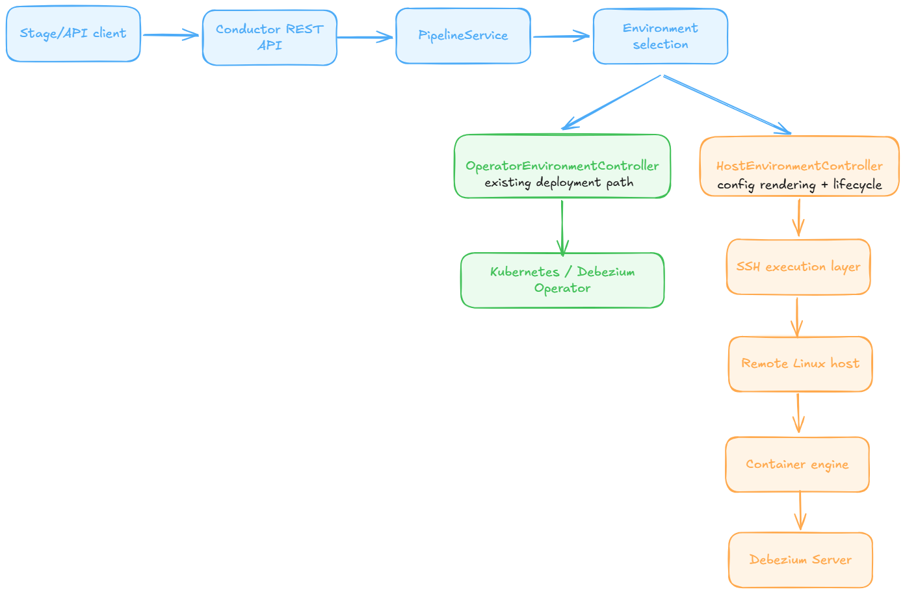

# Debezium: Host-Based Pipeline Deployment for the Debezium Platform

## About Me

**Name:** Anny Dang (GitHub: [VanKhanhAnny](https://github.com/VanKhanhAnny))

**University:** University of South Florida  
**Program:** B.S. in Computer Science  
**Year:** Undergraduate student  
**Expected Graduation Date:** May 2027

**Contact info:**

- **Email:** `khanhvandang@usf.edu`
- **Email:** `arianne.dangvankhanh@gmail.com`
- **LinkedIn:** <https://www.linkedin.com/in/van-khanh-dang-anny/>
- **Zulip introduction / project discussion:** <https://debezium.zulipchat.com/#narrow/channel/573881-community-gsoc/topic/Anny.20Dang.20-.20Host-Based.20Pipeline.20Deployment/near/581702445>

**Time zone:** America/New_York (UTC-4 / UTC-5 depending on DST)

## Code Contribution

The Debezium code contribution most directly relevant to this proposal is:

- [`debezium/debezium-platform#312`](https://github.com/debezium/debezium-platform/pull/312)  
  Added RFC 1123 validation for pipeline names across backend and frontend, together with tests.

I also made a smaller documentation contribution that helped me understand local setup and environment assumptions:

- [`debezium/debezium-platform#311`](https://github.com/debezium/debezium-platform/pull/311)  
  Documentation update for local kind setup and example namespace usage.

These contributions are directly inside `debezium-platform`, which is the codebase for this project. Together they helped me understand the local setup, the split between Stage and Conductor, the existing validation and API flow, and how deployment-facing constraints appear in the application model.

## Project Information

### Abstract

I am applying for the Host-Based Pipeline Deployment project for Debezium Platform. The goal is to extend the platform so that the same pipeline model currently deployed through the Debezium Operator on Kubernetes can also be deployed to Linux hosts outside Kubernetes, such as virtual machines, bare metal servers, or cloud instances. My plan is to build this as a second environment path inside the existing Conductor architecture rather than as a parallel deployment subsystem. The MVP I want to deliver is Linux hosts reachable over SSH, deployment of Debezium Server through a supported container engine, centralized lifecycle control from Conductor, and automated unit and integration tests. That scope would cover deploy, update, start, stop, and remove operations. I am deliberately keeping the first version narrow because I think a stable host-based environment implementation is more valuable than a broader design that leaves the core lifecycle path fragile. My strongest fit for this work is backend and platform engineering, especially Java, REST APIs, validation, integration-heavy services, and testing.

### Why this project?

I want to work on this project because it matches the kind of engineering work I enjoy most. I like backend design, operational behavior, integration boundaries, and control-plane logic that can be tested properly. What interests me here is extending Debezium Platform so the same pipeline model can be managed across more than one runtime environment.

I am also interested in this project because it fits an existing architectural seam in Debezium Platform instead of forcing an unnatural redesign. From reading the codebase and working through my contributions, my understanding is that Conductor already has environment-oriented abstractions such as `EnvironmentController`, and the current implementation is operator-specific. That makes host-based deployment feel like a real platform extension rather than an unrelated feature.

The Debezium GSoC AMA and contributor guide also made the expected shape of the project clearer to me. The work is primarily backend-oriented, centered on Quarkus, REST APIs, a supported container engine, SSH, and lifecycle management in the Platform backend. That is where I think I can contribute the most.

### Technical Description

#### 1. Problem statement and scope

Today, Debezium Platform supports pipeline deployment through the Debezium Operator on Kubernetes. The missing capability is a comparable deployment path for Linux hosts outside Kubernetes. My proposal is to add a host-based environment implementation that fits the current Platform design and manages Debezium Server on remote Linux hosts through secure remote execution.

I am intentionally not proposing a very broad fleet-management system. The MVP is:

- Linux hosts only
- SSH as the first secure remote access path
- container-engine-based Debezium Server deployment
- centralized lifecycle control from Conductor
- backend APIs and tests first

I consider the following explicitly out of MVP scope:

- non-Linux hosts
- broad cloud provisioning across multiple providers
- standalone package or JAR-based deployment before the container-engine path is stable
- turning the host environment into a full infrastructure inventory system

#### 2. Understanding of the current Debezium Platform architecture

Debezium Platform has two main components:

- **Conductor**, the backend service responsible for orchestration and control
- **Stage**, the frontend UI

For this project, the main implementation work belongs in Conductor. My understanding from the codebase is:

- pipeline definitions are environment-agnostic at the model level
- deployment work is delegated through environment-oriented abstractions
- Kubernetes deployment is currently handled through the operator-specific environment path, especially `OperatorEnvironmentController`
- `PipelineService` still assumes the operator environment in places, which is one of the seams this project should address

This is important because I do not want to build a second orchestration flow outside the Platform's design. I want to extend the current environment abstraction so that Kubernetes and host-based deployments remain two environment paths for the same pipeline model.

One code path I paid attention to while preparing for this proposal was the current deployment flow around `PipelineService` and the environment abstractions, because that looks like the right place to extend behavior for host targets instead of branching into a separate subsystem. In particular, the current `PipelineService.environmentController()` assumption looks like the kind of boundary this project should generalize instead of bypassing. My PR for pipeline-name validation was obviously much smaller than this project, but it still forced me to trace behavior across both Stage and Conductor, which helped me get more comfortable navigating the platform.

#### 2.1 Current deployment flow in code

From the codebase, my current understanding of the deployment flow is:

1. `PipelineResource` handles API requests for pipeline creation, updates, deletion, logs, and signals.
2. `PipelineService.onChange()` emits `PipelineEvent.update(...)` or `PipelineEvent.delete(...)`.
3. The watcher side receives those events through `PipelineConsumer`.
4. `PipelineConsumer.accept()` delegates to `environment.pipelines().deploy(...)` when a payload is present, or `undeploy(...)` when it is not.
5. Today, the selected environment is effectively the operator path, because `PipelineService.environmentController()` still returns the first registered environment controller and includes a TODO noting that only the operator environment is currently supported.

That flow is helpful because it shows that host-based deployment should be added as another environment path inside the existing model, not as a separate orchestration mechanism.

At the end of that operator path, `OperatorPipelineController.deploy()` maps `PipelineFlat` through `PipelineMapper.map()` into a `DebeziumServer` custom resource and hands it to `DebeziumKubernetesAdapter.deployPipeline(...)`. That is a useful reference point for the host-based design. The new path does not need a different source model. It needs a different renderer and executor at the end of the same Conductor flow.

#### 3. Proposed MVP architecture

My proposed MVP has four main pieces:

1. **Host target model**
   - A first-class representation of a deployable Linux host in Conductor.
   - The initial model should include at least host address, connection endpoint, a reference to a mounted SSH key, runtime capabilities, and deployment path or working directory.

2. **Host-based environment implementation**
   - A new host-oriented environment controller and pipeline controller that fit alongside the operator-specific implementation.
   - This path should be selected based on the pipeline target rather than by adding a separate control plane.

3. **SSH-backed remote execution layer**
   - Secure host access for preflight checks, file transfer, and lifecycle commands.
   - This layer should provide clear failure reporting so the API can surface useful deployment errors.

4. **Container-engine deployment flow**
   - Render Debezium Server runtime configuration from the existing pipeline model.
   - Transfer the rendered runtime bundle to the remote host.
   - Start and manage Debezium Server through a supported container engine.

The Conductor remains the control plane. The host is an execution target, not a second source of truth for configuration.



#### 3.1 Likely implementation touchpoints

Based on my current reading of the codebase, I expect the first implementation slice to touch these areas:

- `PipelineService`, especially the current `environmentController()` selection logic
- the `EnvironmentController` and `PipelineController` abstractions
- `OperatorEnvironmentController` as the closest existing environment implementation to mirror structurally
- `OperatorPipelineController` and `PipelineMapper`, because the host path should mirror their role while producing different runtime artifacts
- `PipelineResource` as an example for the backend API shape
- `PipelineConsumer` in the watcher flow, because host deployments should still move through the existing event-driven path rather than a separate orchestration path

#### 3.2 What should stay unchanged

One thing I want to preserve in this project is the current event-driven deployment model. A pipeline change should still move through the same high-level flow in Conductor, and the host-based support should plug into that flow through the environment abstraction rather than bypassing it.

More concretely, I do not want to change the basic contract that:

- `PipelineService` emits pipeline events,
- the watcher consumes them,
- and the selected environment-specific pipeline controller performs the actual deployment work.

That is important because the project should extend the existing control plane, not create a second one.

#### 4. Host registration and pipeline association

One practical detail this proposal should make explicit is how users define target hosts. This project is not just "deploy somewhere over SSH." The Platform needs a clear way to model where a pipeline is supposed to run.

My expectation is that the MVP needs a host-target registration path in Conductor, likely exposed through backend APIs first. A user should be able to register a host target with:

- human-readable name
- hostname or IP address
- connection port
- username or connection identity
- supported runtime or detected runtime capabilities
- target working directory
- SSH key reference that points to key material already mounted into Conductor, not stored in Platform entities
- optional labels or environment metadata

After registration, Conductor should be able to run preflight checks before a pipeline is associated with that host. That association then determines whether deployment uses the operator-backed environment or the host-based environment.

Those preflight checks should validate at least:

- SSH connectivity and remote-user permissions
- supported Linux family or package-manager assumptions
- presence of the chosen container engine, or whether it can be bootstrapped
- working-directory creation and write access
- ability to pull the Debezium Server image from a registry

For one supported Linux family, I think the MVP can go one step further than validation and include a narrow bootstrap path. If the chosen container engine is missing, Conductor should be able to install it, create the working directory, ensure the service is enabled and running, and verify that the target user can launch a simple test container. Outside that narrow support matrix, the system should fail fast with an actionable preflight error instead of trying to provision every possible host shape.

A simple API shape for that first step could look like:

```http
POST /api/hosts
Content-Type: application/json
```

```json
{
  "name": "analytics-vm-1",
  "hostname": "10.0.0.25",
  "port": 22,
  "username": "debezium",
  "runtime": "podman",
  "workingDir": "/opt/debezium/analytics-vm-1",
  "privateKeyRef": "file:/opt/conductor/ssh/analytics-vm-1",
  "labels": ["dev", "vm"]
}
```

I would keep Stage changes minimal in the MVP. For the first implementation, backend support and a documented API matter more than trying to build a polished UI too early. That also makes mentor review easier, because the core behavior can be validated at the backend level first.

#### 4.1 First implementation slice

If I had to describe the first meaningful implementation slice in one sequence, it would be:

1. represent a host target in Conductor,
2. replace the current operator-only environment selection with host-aware routing,
3. add host preflight or bootstrap support and render Debezium Server configuration for a remote target,
4. execute deploy and undeploy through a host-based pipeline controller,
5. cover that path with tests before expanding into extra lifecycle features or UI work.

I think that is the safest way to make progress early while keeping the design tied to the real seams already present in the codebase.

#### 5. Secure remote execution and secret handling

The official project idea explicitly mentions secure remote access. For the MVP, I think SSH is the correct first path.

The SSH execution layer should support:

- opening authenticated remote sessions
- transferring generated configuration or runtime files
- executing lifecycle commands
- returning structured error information

For credentials, I would not make the MVP depend on Platform-managed vault support, because that part of the current codebase is not implemented yet. A more realistic first step is to let Conductor receive SSH private keys through its own runtime environment, for example as mounted files or deployment-time secret volumes, and let the host-target model store only a reference to that mounted key. The key material itself should not be persisted in Platform entities.

#### 6. Container-engine-first deployment path

From the official project description, I think a container-based runtime is the right place to start.

The current operator path is useful as a design reference here. Today, `PipelineMapper` takes `PipelineFlat` and produces a `DebeziumServer` resource containing source, sink, offset, schema-history, transform, signal, notification, and logging configuration. For a host target, I would keep the same pipeline input model but change the output artifact. Instead of a Kubernetes custom resource, the host path should render a small runtime bundle that a container engine can execute on a Linux machine.

For the MVP, the deployment flow would be:

1. Validate the target host and runtime prerequisites.
2. Render Debezium Server runtime configuration from the pipeline model.
3. Transfer a small runtime bundle to the target host.
4. Pull the Debezium Server image through the supported container engine.
5. Start Debezium Server through that container engine.
6. Persist enough metadata in Conductor to support later lifecycle actions.

For the container-engine-first MVP, I expect that runtime bundle to contain:

- a rendered `application.properties` file derived from the pipeline's source, sink, transform, offset, schema-history, signal, notification, and log settings
- a small env file or launch script describing container name, image, mounted paths, and any runtime flags
- a target working-directory layout on the host where generated files, logs, and lifecycle metadata can live

I would not copy the Debezium Server image itself from Conductor to the target machine. The host runtime should pull that image from the configured registry. I also would not transfer the SSH private key used by Conductor. If a pipeline needs local secret files on the target machine, those should come from pre-provisioned host paths or mounted files rather than from a new vault-replication design in the MVP.

Even with a general container-engine design, the first version still needs one concrete runtime to support. I would confirm that choice with mentors before implementation.

#### 7. Lifecycle management

The lifecycle operations I consider required for project success are:

- deploy
- update or redeploy
- start
- stop
- remove

If time allows, I would also add:

- status improvements
- basic log retrieval
- minimal Stage support for host selection or registration

These are stretch goals, not baseline success criteria.

#### 8. Trade-offs: direct SSH MVP vs. host-side agent

Another possible design is to use SSH only for bootstrap, then install a lightweight service on the host and use HTTP for ongoing lifecycle management. I think that is a valid direction, but I would still choose a direct SSH-backed MVP first.

**Option A: direct SSH-backed lifecycle management**

Pros:

- smaller surface area for a 350-hour project
- no extra host-side service to package, deploy, secure, and upgrade
- easier to validate the core environment extension first

Cons:

- repeated SSH execution for lifecycle operations
- less flexibility for richer host-local behavior

**Option B: SSH bootstrap plus host-side lifecycle service**

Pros:

- cleaner long-term separation between control plane and execution node
- more efficient recurring lifecycle operations
- easier future expansion into richer host-local monitoring or restart behavior

Cons:

- larger scope
- more moving parts to test and secure
- higher risk of spending the summer on framework and packaging work before stabilizing the core platform integration

For that reason, my proposal keeps the host-side lifecycle service as an optional stretch goal. I would rather finish a stable host-based environment path first than overcommit to a broader architecture and leave the core flow unfinished.

#### 9. Testing strategy

I want testing to be part of the implementation from the start, not something added after the main code path exists.

My testing plan is:

- unit tests for host target modeling, config rendering, and command generation
- integration tests against a disposable Linux target reachable over SSH
- regression coverage for the current Kubernetes and operator path
- a documented demo setup that mentors and future contributors can reproduce

I consider remote lifecycle testing one of the highest-risk parts of the project. Because of that, I would build the integration harness early rather than leaving it to the end.

#### 10. Public discussion and references

- **Public discussion link:** <https://debezium.zulipchat.com/#narrow/channel/573881-community-gsoc/topic/Anny.20Dang.20-.20Host-Based.20Pipeline.20Deployment/near/581702445>
- [Debezium Platform repository](https://github.com/debezium/debezium-platform)
- [Debezium GSoC contributor guide](https://github.com/debezium/debezium-design-documents/blob/main/gsoc/README.md)
- [Debezium GSoC proposal template](https://github.com/debezium/debezium-design-documents/blob/main/gsoc/template.md)
- [Debezium Server documentation](https://debezium.io/documentation/reference/stable/operations/debezium-server.html)

### Roadmap

#### **Phase 1**

**Community Bonding**

- Review the current Conductor deployment flow in more detail.
- Confirm MVP assumptions with mentors, especially around host registration, secret handling, and the first supported container engine.
- Write a short design note covering host targets, SSH execution, lifecycle boundaries, and the testing plan.

##### Week 1

- Add the first version of the host target model and the backend wiring needed to represent non-Kubernetes deployment targets.
- Trace and document the current deployment-routing flow inside Conductor so the host path can extend it cleanly.

##### Week 2

- Implement the initial environment-selection path so host-based deployment can be routed through the existing backend architecture.
- Add unit tests around the routing logic and target selection.

##### Week 3

- Implement the SSH execution abstraction for remote commands, authentication, and failure reporting.
- Build the first vertical slice tests around command execution.

##### Week 4

- Add remote file-transfer support and host preflight checks.
- Implement the narrow bootstrap path for one supported Linux family and one container engine.
- Define how configuration artifacts are staged on the target host.

##### Week 5

- Render Debezium Server runtime configuration from the platform pipeline model.
- Finalize the runtime bundle shape (`application.properties`, launch metadata, working-directory layout).
- Add unit tests for configuration rendering and command generation.

#### **Phase 2** - Midterm point

By midterm, I want the project to have a real backend path for host targets, a working SSH layer, and enough of the deployment flow in place to validate the architecture.

##### Week 6

- Implement the first full deployment flow for one supported container engine, including image pull and container start.
- Persist the metadata needed for later lifecycle operations.

##### Week 7

- Implement start, stop, and remove operations.
- Improve lifecycle failure reporting and make the backend responses debuggable.

##### Week 8

- Implement update or redeploy behavior.
- Add integration tests against a disposable SSH-accessible Linux target.

##### Week 9

- Expand integration coverage for lifecycle operations and remote failures.
- Add regression coverage to ensure the existing Kubernetes/operator path is not broken.

##### Week 10

- Add status tracking and improve backend visibility into deployment state.
- If feasible, add basic log retrieval for host-based deployments.

##### Week 11

- Write documentation for host-target configuration, local testing, and a reproducible demo flow.
- Use remaining feature time on one optional improvement, most likely either status/log improvements or a very small Stage enhancement.

##### **Final Week**

- Final cleanup and stabilization
- Address mentor review feedback
- Prepare the final demo and project write-up
- Ensure all planned code and documentation are submitted for review

## Other commitments

I expect to be available for approximately 35 to 40 hours per week during the GSoC period. I do not currently have summer classes or travel plans that I expect to interfere with the project schedule.

I am aware that I was busy with midterms during the current application period, and I take that as a reminder that I need to communicate schedule constraints early. If anything changes during GSoC, I will raise it with mentors in advance and adjust my schedule around the project milestones rather than waiting until it becomes a problem.

## Appendix

### Relevant background

- Backend API development with Java and Spring Boot
- Validation logic, event-driven integrations, and Kafka-related work
- Experience with concurrent pipelines, asynchronous processing, and CI/CD
- React and TypeScript experience for minor frontend adjustments if needed

### Why I think this scope is feasible

I am intentionally proposing a narrower MVP than some of the public drafts for this project. I think that is the right choice for a 350-hour project. A stable host-based environment implementation, good tests, and a clear lifecycle path would be a stronger result than a broader design that introduces extra components before the core deployment path is reliable. I would rather leave one stretch goal undone than ship a version where the basic deploy and update path is still fragile.

