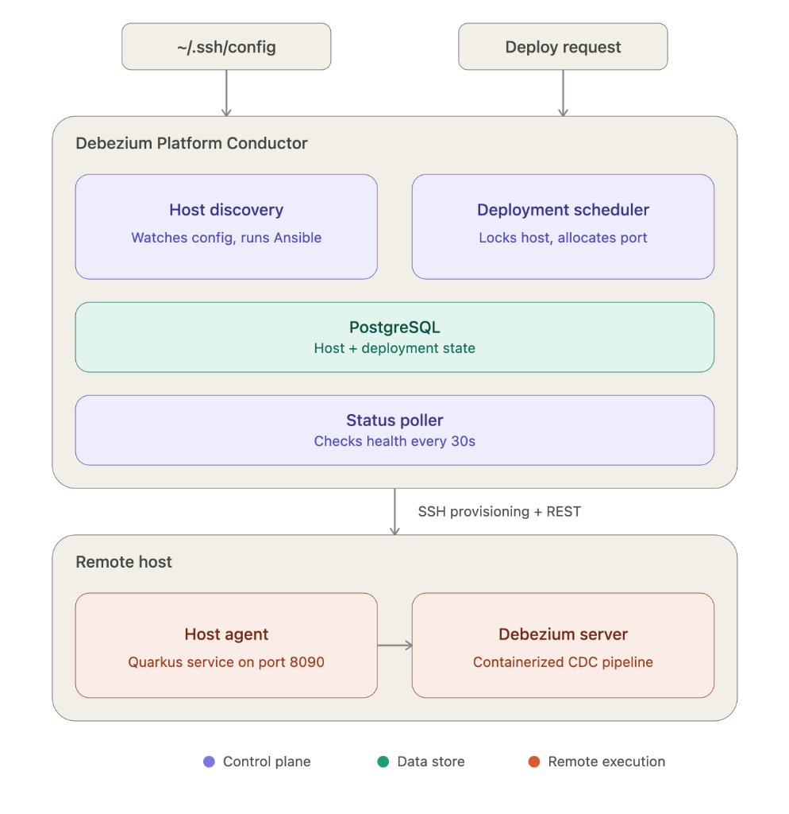
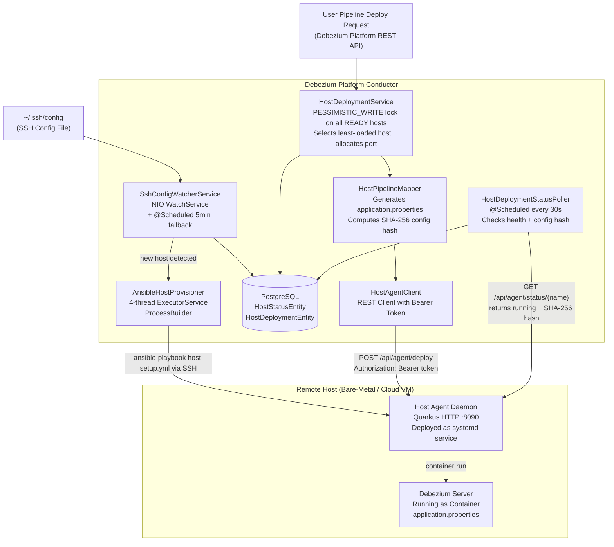

# GSoC 2026 Final Submission - Divyanshu Kumar

**Organization:** Red Hat JBoss (Debezium)  
**Project:** Host-Based Pipeline Deployment for the Debezium Platform  
**Mentors:** [Mario Fiore Vitale](https://www.linkedin.com/in/mfvitale/), [Giovanni Panice](https://www.linkedin.com/in/giovannipanice/)  

---

## Abstract

The [Debezium Platform](https://github.com/debezium/debezium-platform) currently supports pipeline deployment exclusively through the Kubernetes-based Debezium Operator. While this works well for teams running Kubernetes, a significant number of production environments run on bare-metal servers, cloud VMs (EC2, Azure VMs, GCP instances), and on-premise machines that do not run Kubernetes at all. This project introduces a host-based deployment path as a first-class alternative to the existing Kubernetes operator path, enabling users to deploy Debezium Server pipelines directly to remote hosts as containerized workloads without managing any Kubernetes infrastructure.

The implementation adds a new `HostEnvironmentController` selected at startup via a global deployment mode property (`platform.deployment.mode=host`), using Quarkus `@LookupIfProperty` CDI bean selection so the same compiled image supports both modes. Hosts are discovered automatically from a standard OpenSSH `~/.ssh/config` file, watched for changes via a Java NIO `WatchService`, and provisioned idempotently using an Ansible playbook that installs a container engine and a lightweight Host Agent on each remote machine. Pipeline scheduling is handled by a concurrency-safe round-robin strategy using `PESSIMISTIC_WRITE` locking. The Host Agent, a small Quarkus HTTP server deployed as a `systemd` service, translates REST calls from the Conductor into native container runtime management commands, achieving full pipeline lifecycle parity with the Kubernetes path (deploy, undeploy, stop, start, and log streaming). A background status poller with SHA-256 config drift detection continuously monitors all active deployments. Six of the seven planned sub-issues have been merged to the upstream repository, with the seventh (Host Agent submodule) in active development.

### High-Level Architecture

---

## Code and Artifacts

All contributions are located in the [debezium/debezium-platform](https://github.com/debezium/debezium-platform) repository.

**Parent Tracker Issue:** [debezium/dbz#2085](https://github.com/debezium/dbz/issues/2085)

---

### Sub-Issue 1: JPA Data Model and Flyway Migration (DBZ-2086)

Built the foundational persistence layer and schema migrations required for host-mode pipeline management.

- **`HostStatusEntity`**: Tracks discovered hosts with their SSH alias (`UNIQUE` constraint), cached hostname, provisioning status (`PENDING`, `PROVISIONING`, `READY`, `FAILED`, `REMOVED`), Ansible execution output, agent port, bearer token, and `lastCheckedAt` timestamp. Load is calculated dynamically via a live `COUNT(*)` query inside a pessimistic lock rather than storing a counter column, preventing counter drift under concurrent deployments.
- **`HostDeploymentEntity`**: Maps a pipeline to its assigned host. Stores container name, image version, allocated server port, deployment status (`DEPLOYING`, `RUNNING`, `STOPPED`, `FAILED`, `CONFIG_DRIFT`), and SHA-256 config hash for drift detection. A `UNIQUE` constraint on `pipeline_id` enforces one active deployment per pipeline. Records are hard-deleted on undeployment to allow clean re-deployment and port recycling.
- **`ProvisioningStatus`** and **`DeploymentStatus`** enums.
- **Flyway migration (`V3.6.0__create_heartbeat_table.sql`)**: Additive database migration creating `host_status` and `host_deployment` tables, sequences, indexes, and initial foreign key constraints.

- **Issue:** [debezium/dbz#2086](https://github.com/debezium/dbz/issues/2086)
- **PR [#436](https://github.com/debezium/debezium-platform/pull/436)** (merged)

---

### Sub-Issue 2: Deployment Mode Selection with `@LookupIfProperty` CDI Wiring (DBZ-2087)

Introduced global deployment mode switching using Quarkus CDI runtime property evaluation, allowing the platform to select its active environment controller at startup.

- Added `@LookupIfProperty(name = "platform.deployment.mode", stringValue = "operator", lookupIfMissing = true)` to `OperatorEnvironmentController`. Setting `lookupIfMissing = true` guarantees backward compatibility so existing Kubernetes deployments continue running without configuration changes.
- Implemented `HostEnvironmentController` annotated with `@LookupIfProperty(name = "platform.deployment.mode", stringValue = "host")` to handle host-mode routing, along with `HostVaultController`.
- Refactored `PipelineService` from `@All List<EnvironmentController>` to `Instance<EnvironmentController>.get()`, resolving an existing `TODO` comment in the codebase ("only operator environment is supported currently").
- Updated `AbstractEventConsumer`, `PipelineConsumer`, and `VaultConsumer` to seamlessly inherit CDI runtime lookup.
- Created `HostModeTestProfile` and `HostModeWiringIT` test suite to verify mode activation and CDI wiring under test conditions.

- **Issue:** [debezium/dbz#2087](https://github.com/debezium/dbz/issues/2087)
- **PR [#443](https://github.com/debezium/debezium-platform/pull/443)** (merged)

---

### Sub-Issue 3: OpenSSH Config File Parser (DBZ-2088)

Implemented a zero-dependency Java parser for OpenSSH `~/.ssh/config` files to handle automated host discovery.

- **`SshConfigParser`**: `@ApplicationScoped` parser using `BufferedReader` line streaming.
- **Refactored Architecture**: Extracted a `HostBlock` builder pattern using stream processing and arrow-case switch statements based on mentor review feedback.
- **`SshHostEntry`**: Immutable record representing parsed host connection details (alias, hostname, user, port, identity file).
- **Spec Compliance**: Full parsing support per `ssh_config(5)` including case-insensitive keywords, `=` and whitespace key-value delimiters, inline comments (`#`), quoted paths with spaces, port range validation (1-65535), duplicate alias detection, and wildcard filtering (`Host *`, `Host db-?`).
- **Test Suite**: Built `SshConfigParserTest` with 24 dedicated unit test cases covering edge cases such as malformed lines, out-of-range ports, and mixed wildcards.

- **Issue:** [debezium/dbz#2088](https://github.com/debezium/dbz/issues/2088)
- **PR [#450](https://github.com/debezium/debezium-platform/pull/450)** (merged)

---

### Sub-Issue 4: SSH Config Watcher and Blaze-Persistence Reconciliation (DBZ-2090)

Implemented background host discovery watching and database state reconciliation, incorporating Blaze-Persistence entity views.

- **Blaze-Persistence Layer**: Refactored the persistence layer into `HostStatusService` backed by Blaze-Persistence `HostStatus` and `HostStatusReference` view models.
- **Plan Builder Pattern**: Extracted `HostReconciliationPlanBuilder` to decouple pure reconciliation state computation (`ReconciliationPlan`) from database side-effects, fully unit tested in `HostReconciliationPlanBuilderTest`.
- **NIO WatchService & Debouncing**: `SshConfigWatcherService` monitors the parent directory (handling atomic symlink-swaps used by Kubernetes ConfigMap volume mounts) with a 2-second debounce buffer and a 5-minute `@Scheduled` fallback reconciliation loop.
- **SSH Key Permission Check**: Validates `IdentityFile` POSIX permissions (`0400` / `0600`) on startup, logging clear error messages if permissions are too open (`0644`) to prevent silent OpenSSH runtime failures.
- **Test Suite**: Built `SshConfigWatcherServiceIT` integration test suite backed by `SshConfigWatcherTestProfile`.

- **Issue:** [debezium/dbz#2090](https://github.com/debezium/dbz/issues/2090)
- **PR [#460](https://github.com/debezium/debezium-platform/pull/460)** (merged)

---

### Sub-Issue 5: Host Provisioning Engine and Ansible Automation (DBZ-2092)

Implemented the automated host provisioning service that prepares remote target machines for pipeline deployment via Ansible.

- **Decoupled Architecture**: Defined the `HostProvisioner` interface and `AnsibleHostProvisioner` implementation, separating high-level host lifecycle state management from `ProcessBuilder` execution.
- **Quarkus Configuration Group**: Introduced `HostConfigGroup` (`platform.host.*`) for runtime-configurable playbook paths, execution timeouts, thread pool sizes, and SSH config locations.
- **Thread Isolation**: Dedicated 4-thread `ExecutorService` pool isolating blocking Ansible playbook execution (2-5 minutes) from Quarkus reactive loops and common thread pools.
- **Ansible Output Progress Filtering**: Built a real-time log filter in `AnsibleHostProvisioner` that converts raw Ansible stdout (~100 lines) into clean task-level `INFO` progress logs while routing verbose output to `DEBUG`.
- **Idempotent Playbooks**: Created `host-setup.yml` (Python bootstrapping via `raw`, container engine setup, user group permissions, Host Agent systemd unit, and image pre-pulling) and `host-teardown.yml` for host removal. Fixed PEP 668 externally managed environment issues for Ubuntu 24.04+.
- **Test Suite**: Implemented `HostSetupPlaybookIT` and `smoke-test.yml` for real provisioning pipeline verification.

- **Issue:** [debezium/dbz#2092](https://github.com/debezium/dbz/issues/2092)
- **PR [#466](https://github.com/debezium/debezium-platform/pull/466)** (merged)

---

### Sub-Issue 6: Concurrency-Safe Scheduling and Pipeline Lifecycle Parity (DBZ-2101)

Implemented pipeline deployment scheduling, container lifecycle orchestration, mapper serialization, and status polling.

- **Concurrency-Safe Scheduling (`HostDeploymentService`)**: Uses `PESSIMISTIC_WRITE` locks on all `READY` hosts (sorted by ID to prevent deadlocks) before evaluating host load or allocating ports (`MAX(serverPort) + 1` from base 9000). Locks are held strictly during selection and released via `@Transactional(REQUIRES_NEW)` before container runtime execution.
- **Domain Boundary Refactoring**: Replaced JPA entity leaks across service boundaries with clean domain records (`HostAllocation`, `DeploymentRequest`) and Blaze-Persistence view models (`HostDeployment`).
- **Container Runtime & Log Extraction**: Defined the `HostContainerRuntime` interface implemented by `AnsibleContainerRuntime`, decoupling `HostPipelineController` from direct process execution. Extracted container log streaming into `HostDockerLogReader`, implementing the platform `LogReader` interface.
- **Ansible Command Pattern**: Encapsulated Ansible ad-hoc execution in `AnsibleCommandRunner` using the Command pattern (`ShellCommand`, `CopyCommand`, `FileCommand` implementing `AnsibleCommand`).
- **Status Polling & Transient Fault Tolerance (`HostDeploymentStatusPoller`)**: Periodically inspects active deployments via Ansible ad-hoc `docker inspect` commands, wrapped with `RetryingRunnable` exponential backoff to prevent transient SSH timeouts from falsely marking pipelines as `FAILED`. Performs SHA-256 hash checks to detect remote configuration drift (`CONFIG_DRIFT`).
- **Synchronized Deletion & Flyway Migration**: `HostPipelineController` synchronizes container undeployment before pipeline record removal. Flyway migration `V3.7.0.3__add_deployed_at.sql` adds `deployed_at` and drops the database-level FK constraint so the host service manages deployment cleanup independently without database-level blocking.

- **Issue:** [debezium/dbz#2101](https://github.com/debezium/dbz/issues/2101)
- **PR [#493](https://github.com/debezium/debezium-platform/pull/493)** (merged)

---

### Sub-Issue 7: Host Agent Remote Daemon Submodule (DBZ-2094)

Implementing the Host Agent: a lightweight Quarkus-based HTTP server deployed on target remote hosts to translate REST calls into container execution commands.

- **Standalone Submodule**: `debezium-platform-host-agent` Maven submodule producing an independent, small-footprint binary with zero JPA, Kubernetes, or Debezium Engine dependencies.
- **Daemon & Security**: Configured as a `systemd` service running on port 8090 (auto-start on boot, `Restart=always`), secured via host-specific bearer token validation (`Authorization: Bearer <token>`).
- **Endpoints**: `POST /api/agent/deploy` (returns `202 Accepted` immediately to keep Conductor threads unblocked), `POST /api/agent/undeploy`, `POST /api/agent/stop`, `POST /api/agent/start`, `GET /api/agent/status/{name}` (returns SHA-256 config hash for drift detection), and `GET /api/agent/logs/{name}`.

- **Issue:** [debezium/dbz#2094](https://github.com/debezium/dbz/issues/2094)
- **PR:** In progress

---

### Additional Stability Fix: Atomic SSH Config Writes in Integration Tests (DBZ-2509)

Resolved a race condition in `SshConfigWatcherServiceIT` causing intermittent integration test failures on loaded CI environments ([debezium/debezium#7848](https://github.com/debezium/debezium/issues/7848)).

- **Root Cause**: Integration tests modified the monitored SSH config file using `Files.writeString()`, which non-atomically truncates the target file before writing updated content. On heavily loaded CI runners, the background `WatchService` watcher thread occasionally executed during this truncate-then-write window, causing `SshConfigParser` to read an empty file and incorrectly mark active host entities as `REMOVED`.
- **Atomic Write Helper**: Extracted `writeConfigAtomically()` in `SshConfigWatcherServiceIT`, writing content to a temporary file on the same filesystem before executing `Files.move(..., StandardCopyOption.ATOMIC_MOVE)`. This guarantees concurrent file system watchers always observe a fully written config file.

- **Issue:** [debezium/dbz#2509](https://github.com/debezium/dbz/issues/2509)
- **PR [#518](https://github.com/debezium/debezium-platform/pull/518)** (merged)

---

### Worklog

**Parent Tracker Issue:** [debezium/dbz#2085](https://github.com/debezium/dbz/issues/2085)

| Week | Dates | Task | Issue / PR |
|------|-------|------|------------|
| 1-2 | May 25 - Jun 7 | Community bonding, design review of DDD-41 with mentors, finalize sub-issue breakdown | N/A |
| 3 | Jun 8 - Jun 14 | `HostStatusEntity`, `HostDeploymentEntity`, enums, Flyway migration | [dbz#2086](https://github.com/debezium/dbz/issues/2086), [PR #436](https://github.com/debezium/debezium-platform/pull/436) |
| 4 | Jun 15 - Jun 21 | `@LookupIfProperty` CDI wiring, `HostEnvironmentController`, `PipelineService` refactor | [dbz#2087](https://github.com/debezium/dbz/issues/2087), [PR #443](https://github.com/debezium/debezium-platform/pull/443) |
| 5 | Jun 22 - Jun 28 | `SshConfigParser`, `SshHostEntry`, 24 unit tests | [dbz#2088](https://github.com/debezium/dbz/issues/2088), [PR #450](https://github.com/debezium/debezium-platform/pull/450) |
| 6-7 | Jun 29 - Jul 12 | `SshConfigWatcherService`, NIO `WatchService`, debounce, `@Scheduled` fallback, SSH key permission validation | [dbz#2090](https://github.com/debezium/dbz/issues/2090), [PR #460](https://github.com/debezium/debezium-platform/pull/460) |
| 8-9 | Jul 13 - Jul 26 | `HostProvisioningService`, dedicated executor pool, Ansible playbook, provisioning state machine | [dbz#2092](https://github.com/debezium/dbz/issues/2092), [PR #466](https://github.com/debezium/debezium-platform/pull/466) |
| 10-13 | Jul 27 - Aug 24 | `HostDeploymentService` (PESSIMISTIC_WRITE scheduling), `HostPipelineMapper`, `HostPipelineController`, `HostDeploymentStatusPoller`, `HostAgentApi`, `HostAgentClient`, consecutive-failure threshold, migration fixes | [dbz#2101](https://github.com/debezium/dbz/issues/2101), [PR #493](https://github.com/debezium/debezium-platform/pull/493) |
| 14+ | Aug 25 - present | Host Agent submodule (`debezium-platform-host-agent`), all Agent endpoints, bearer token auth, `systemd` integration | [dbz#2094](https://github.com/debezium/dbz/issues/2094) (PR in progress) |
| Post-GSoC | Aug 26 - Aug 28 | Fix flaky `SshConfigWatcherServiceIT` with atomic file writes | [dbz#2509](https://github.com/debezium/dbz/issues/2509), [PR #518](https://github.com/debezium/debezium-platform/pull/518) |

---

## Articles & Talks

- **Debezium Community Showcase Presentation & Demo**: Presented a live demonstration of the host-based provisioning engine to the Debezium community, showcasing zero-intervention host discovery via `~/.ssh/config` watching, automatic database reconciliation, and Ansible playbook execution (container engine provisioning, Host Agent deployment, and image pre-pulling). [(LinkedIn Post)](https://www.linkedin.com/posts/divyanshu-kumar-24026b296_gsoc-gsoc2026-debezium-activity-7490684219577225216-uUd4)
- **Dev.to Technical Deep Dive (Host Discovery & Provisioning Engine)**: Published an in-depth article analyzing the host discovery architecture, Java NIO `WatchService` file system events (including macOS polling fallbacks for JDK-8293067), Ansible process I/O log filtering (~100 lines of raw output reduced to ~15 task-level progress lines), and runtime-configurable `HostConfigGroup` design. [(Dev.to Article)](https://dev.to/d1vyanshukumar/building-zero-touch-host-provisioning-for-the-debezium-platform-6nc)
- **Foundational Technical Series & System Design Updates**: Published a series of technical updates during the community bonding and design phase covering OpenSSH config specifications, Quarkus `@LookupIfProperty` CDI bean selection, Ansible thread isolation, and pessimistic locking patterns. [(LinkedIn Update)](https://www.linkedin.com/posts/divyanshu-kumar-24026b296_gsoc-gsoc2026-googlesummerofcode-activity-7473229842163949568-CrOc)
- **Community Channels**: Regular GSoC 2026 progress updates and architectural discussions shared in the Debezium Zulip community (`#community-gsoc`).
- **Official Debezium Blog Post (to be delivered)**: A comprehensive technical post introducing host-based pipeline deployment to the wider developer community is planned for publication on the official [Debezium Blog](https://debezium.io/blog/), covering overall architecture, concurrency-safe scheduling, and an end-to-end setup walkthrough.

---

## Future Work & Continued Community Contribution

### Short-Term Technical Roadmap
- **Complete Host Agent Sub-Issue ([dbz#2094](https://github.com/debezium/dbz/issues/2094))**: Finalize the `debezium-platform-host-agent` Maven submodule, complete end-to-end testing of bearer token authentication and systemd daemon integration, and merge the PR.
- **Feature Documentation & User Guides**: Author comprehensive end-user and administrator documentation for host-based pipeline deployment in the official Debezium documentation repository, covering SSH config volume mounts, mode selection (`platform.deployment.mode=host`), security considerations, and operational troubleshooting.
- **Dedicated Agent Health Endpoint (`GET /api/agent/health`)**: Add an explicit health probe endpoint so the `HostDeploymentStatusPoller` can reliably differentiate between an idle, healthy remote host and a network partition, reducing false-positive `FAILED` status transitions.
- **Label & Tag-Based Host Scheduling**: Extend the `DeployStrategy` interface beyond round-robin load distribution to support metadata tag matching (such as matching pipelines to hosts tagged with `env=prod` or `region=us-east`), catering to enterprise topology constraints.
- **Graceful Host Drain Workflows**: Implement a graceful migration phase when a host is removed from `~/.ssh/config`, automatically stopping containers and re-scheduling pipelines onto remaining healthy hosts before transitioning the host entity to `REMOVED`.
- **Debezium Platform UI Integration**: Surface host provisioning progress, real-time container health, agent connection indicators, and SHA-256 config drift warnings directly within the Debezium Platform web user interface.

### Long-Term Commitment to Debezium & Open Source
Working on the Debezium Platform during GSoC 2026 under the mentorship of Mario Fiore Vitale and Giovanni Panice has been a transformative engineering experience. The host-based deployment path is a fundamental component of the Platform, and my involvement does not end with the official GSoC timeline.

I will be staying actively involved as a long-term maintainer and contributor in the Debezium ecosystem:
- **Module Maintenance**: Actively maintaining the `environment/host/` package and Host Agent codebase in `debezium-platform`, addressing community issue reports, optimizing Ansible provisioning execution, and keeping dependencies up to date.
- **Community Engagement**: Remaining an active member of the Debezium Zulip community, helping answer user questions, assisting new contributors, and reviewing pull requests.
- **Further Platform Evolution**: Participating in upcoming architectural discussions around Debezium Platform enhancements, connector management, and bare-metal CDC infrastructure.
