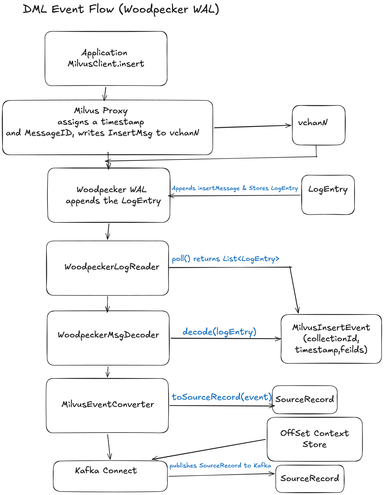
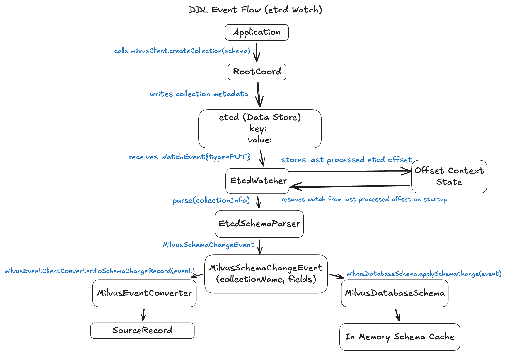

# Debezium: Debezium Source Connector for Milvus

**Sub-org:** Debezium  
**Organization:** JBoss Community by RedHat  
**Program:** Google Summer of Code 2026  
**Project Complexity:** Intermediate  
**Expected Size:** 350 hours
---

## Introduction

**Zulip Introduction:** My introduction to the Debezium Community on Zulip: [#community-gsoc > newcomers](https://debezium.zulipchat.com/#narrow/channel/573881-community-gsoc/topic/newcomers/near/576803669)

**Community Discussion:** Discussion about the project with mentors on Zulip: [#community-gsoc > Kartik - Milvus Connector](https://debezium.zulipchat.com/#narrow/channel/573881-community-gsoc/topic/Kartik.20-.20Milvus.20Connector/near/579765536)

## About Me

**Name:** Kartik Angiras  
**GitHub:** [github.com/kartikangiras](https://github.com/kartikangiras)  
**LinkedIn:** [linkedin.com/in/kartikangiras](https://linkedin.com/in/kartikangiras)  
**Email:** [angiraskartik@gmail.com](mailto:angiraskartik@gmail.com)  
**University:** ABES Engineering College  
**Program:** Computer Science & Engineering  
**Expected Graduation Year:** 2028  
**Timezone:** IST (UTC +5:30)  

---

## Why This Project?

My interest in this project grew naturally from exploring AI pipeline systems where vector databases are central to the architecture. While working with it, I repeatedly encountered a critical situation where once vectors were written to databases, they disappeared from the data ecosystem. There was no way to track what changed. Milvus is a cloud-native vector database used for similarity search over dense and sparse embeddings. Despite its widespread adoption, Milvus lacks a Debezium source connector. The only existing integrations are sink connectors meaning data can flow into Milvus from relational databases, but not out of Milvus into the data ecosystem. This project is an opportunity to build foundational infrastructure benefiting the entire Milvus and Debezium ecosystems.

## Why Me?

Being into code for a brief period of time, open source is something that affected my life without me even knowing about it. It felt amazing to me that I could contribute to stuff that could be used by people globally.

I started with Cloud-Native and DevOps in 2024, learning about Docker and Kubernetes. However, to deploy something via these tools, I needed robust projects, so I pivoted to fullstack engineering. This was the key turning point, as I could ship something daily. With project-based learning, I could deploy constantly and iterate.

In 2025, I got my hands dirty with Jenkins and Oras, which helped me dive deep into CI/CD pipelines and plugin architecture. Since then, I have been active and improving codebases in various open-source projects, especially those under the CNCF ecosystem such as Kyverno, Oras, PipeCD, OpenYurt, Antrea, Urunc, and Kubernetes.

I have been active in the Debezium community and project since February 2026. With my active presence in the community, I have helped Debezium improve the quality of the codebase by fixing triage bugs and implementing community feature requests.

My contributions range from basic disparities to adding S3Processor, adding support for Milvus connection validation, fixing invalid regex patterns, and triaging community bugs with proper testing. This demonstrates my abilities and skills to perform any task without strain, making me the perfect fit for this role.

## Tech Stack

I am generally tech stack agnostic, picking up whatever I need to achieve the problem's requirements. However, I am experienced with:

**Programming Languages:** Java, Go, JavaScript, TypeScript, Python

**Core Libraries:** NextJS, React, Express, Maven, Ginkgo, Gradle, SpringBoot

**Databases:** PostgreSQL, MongoDB, Vector DB

**Tools:** Git, GitHub, AWS, Docker, CI/CD, Kubernetes

---

## Code Contribution

### My Contributions to Debezium


| S.No. | PR Number                                                      | Project                    | Status      |
| ----- | -------------------------------------------------------------- | -------------------------- | ----------- |
| 1     | [#7128](https://github.com/debezium/debezium/pull/7128)        | debezium/debezium          | Merged      |
| 2     | [#7138](https://github.com/debezium/debezium/pull/7138)        | debezium/debezium          | Merged      |
| 3     | [#7139](https://github.com/debezium/debezium/pull/7139)        | debezium/debezium          | Merged      |
| 4     | [#7143](https://github.com/debezium/debezium/pull/7143)        | debezium/debezium          | Merged      |
| 5     | [#7153](https://github.com/debezium/debezium/pull/7153)        | debezium/debezium          | Merged      |
| 6     | [#7179](https://github.com/debezium/debezium/pull/7179)        | debezium/debezium          | Merged      |
| 7     | [#7140](https://github.com/debezium/debezium/pull/7140)        | debezium/debezium          | In Progress |
| 8     | [#7181](https://github.com/debezium/debezium/pull/7181)        | debezium/debezium          | In Progress |
| 9     | [#7183](https://github.com/debezium/debezium/pull/7183)        | debezium/debezium          | In Progress |
| 10    | [#7213](https://github.com/debezium/debezium/pull/7213)        | debezium/debezium          | In Progress |
| 11    | [#310](https://github.com/debezium/debezium-platform/pull/310) | debezium/debezium-platform | In Progress |
| 12    | [#253](https://github.com/debezium/debezium-server/pull/253)   | debezium/debezium-server   | Merged      |


### Previous Contributions in Open Source

I am passionate about contributing to open-source projects and have been active across multiple ecosystems:

- **[Kyverno (CNCF)](https://github.com/kyverno/kyverno/pulls?q=is%3Apr+author%3Akartikangiras+is%3Aclosed):** Policy engine contributions
- **[ORAS (CNCF)](https://github.com/oras-project/oras-java/pulls?q=is%3Apr+author%3Akartikangiras+is%3Aclosed):** Registry authentication standards
- **[Prometheus Operator](https://github.com/prometheus-operator/prometheus-operator/pulls?q=is%3Apr+author%3Akartikangiras+is%3Aclosed):** Monitoring infrastructure
- **[OpenYurt (CNCF)](https://github.com/openyurtio/openyurt/pulls?q=is%3Apr+author%3Akartikangiras+is%3Aclosed):** Edge computing
- **[Antrea (CNCF)](https://github.com/antrea-io/antrea/pulls?q=is%3Apr+author%3Akartikangiras+is%3Aclosed):** Networking
- **[Swift](https://github.com/swiftlang/vscode-swift/pulls?q=is%3Apr+author%3Akartikangiras+is%3Aclosed):** Programming language
- **[Jenkins](https://github.com/jenkinsci/tekton-client-plugin/pulls?q=is%3Apr+author%3Akartikangiras+is%3Aclosed):** Plugin development and enhancements
- **[Lightning Network](https://github.com/lightningnetwork/lnd/pulls/kartikangiras):** Blockchain payments

---

### Abstract

Milvus currently lacks a Debezium source connector, forcing users into manual workarounds for data replication and auditing. This project proposes a Native Debezium Source Connector for Milvus 2.6+, leveraging the Woodpecker Streaming Service (WAL) for DML and Etcd for atomic DDL events.

Strategically, this project focuses exclusively on the 2.6+ StreamingNode architecture. Developing for legacy, MQ-coupled versions (2.5 and below) offers diminishing returns as those versions approach depreciation. Milvus 2.6 represents the definitive future of the platform. This approach ensures robustness, and makes Debezium source Connector for Milvus a future proof integration.

---

### Technical Description

#### Approach

To address version heterogeneity (Milvus 2.5 uses MQ; 2.6+ uses Woodpecker WAL), this proposal implements a MilvusLogReader abstraction layer. The primary focus and only focus for the entire 12 weeks of Google Summer of Code timeline will be on WoodpeckerLogReader for Milvus 2.6+. Since EtcdWatcher and MilvusOffsetContext are version-agnostic, adding 2.5 support will be just a simple MessageQueue FallBack Implementation that can go as a stretch goal. This ensures forward compatibility with minimal technical debt.

#### 1. CDC Strategy Evaluation

I rigorously researched multiple strategies and narrowed down to 3 technically distinct approaches for implementing CDC from Milvus.

**1.1 Strategy 1 - Woodpecker WAL Direct Reader**

Since Milvus 2.6, all mutations (inserts, deletes, DDL) are written as serialized protobuf LogEntry messages to Woodpecker's virtual channels before being acknowledged to the client. A connector can subscribe to a vchannel from a specific MessageID and replay the log in order.

**Pros:**

- Total ordering: Woodpecker guarantees monotonically increasing MessageIDs; events are delivered in exact write order.
- Complete DML: Every insert and delete is captured, including uncommitted batches not yet flushed to object storage.
- Native checkpoint: Woodpecker's checkpoint mechanism provides a natural snapshot boundary.
- Backend-agnostic: The connector does not need to know whether the underlying store is S3 or a custom object store.

**Cons:**

- Milvus 2.6+ only: Clusters running older Milvus versions (Pulsar/Kafka backend) cannot use this strategy.
- DDL partial: DDL messages exist in the WAL, but parsing them is more complex than watching etcd.

**1.2 Strategy 2 - ETCD Metadata Watch**

All Milvus metadata lives in etcd. Collection schemas, segment metadata, and channel assignments are stored under well-known key prefixes. Using Jetcd's watch API, the connector can receive PUT and DELETE notifications whenever a collection is created, modified, or dropped.

**Pros:**

- Excellent for DDL: Collection operations like create/alter are cleanly modeled as etcd key mutations.
- Stable API: Etcd is an external dependency with a versioned gRPC API, far more stable than internal Woodpecker APIs.
- Simple implementation: Jetcd client is mature and well-documented.

**Cons:**

- No DML: Insert and delete operations are NOT stored in etcd—they are in the WAL. etcd is purely a metadata store.
- Standalone is insufficient: Alone, this strategy cannot fulfill the connector's core requirement of capturing data mutations.

**1.3 Strategy 3 - Message Queue Subscription**

In Milvus versions 2.5 and earlier, Woodpecker was replaced by an external message queue (Apache Pulsar or Apache Kafka). The Milvus proxy publishes insert and delete operations to dedicated topics.

**Pros:**

- Supports older Milvus versions (2.0 - 2.5 with Pulsar/Kafka backend).
- Well-understood consumer semantics (Kafka consumer groups, Pulsar subscriptions).

**Cons:**

- MQ-backend dependency: The connector is tightly coupled to whether the cluster uses Pulsar or Kafka, requiring dual implementations.
- Access control: Production clusters often restrict direct MQ access to internal services only.
- Depreciated: Milvus 2.6+ deprecates the external MQ dependency in favor of Woodpecker.

#### 2. Proposed Approach: Hybrid (Woodpecker WAL + ETCD Watch)

The optimal approach is a **Hybrid strategy** combining **Woodpecker WAL for all DML events + ETCD watch for all DDL events**. This is the only strategy providing a complete, ordered Debezium change stream for both schema changes and data mutations.

**Justification:**

The core insight is that Milvus naturally separates concerns: data mutations flow through the WAL (Woodpecker), while metadata mutations flow through Etcd. This maps cleanly to the separation between Debezium's data change events and schema change events.

- **Woodpecker WAL is the only source for DML:** There is no other place to get ordered insert/delete events. Strategy 2 (Etcd) cannot capture DML, and Strategy 3 (MQ) is being deprecated.
- **Etcd is the cleanest source for DDL:** DDL messages exist in the WAL, but they are also written atomically to Etcd with richer metadata. Parsing DDL from Etcd is simpler, more stable, and better aligned with how Debezium's schema history mechanism works.

---
#### 3. Implementation Plan

**3.1 Module Structure**

The connector will be implemented as a new Maven module `debezium-connector-milvus` within the Debezium repository, following the existing connector layout:


| Component Category   | Milvus Class                     | Role                  | Framework Base Class / Interface                           | UseCase                                 |
| -------------------- | -------------------------------- | --------------------- | ---------------------------------------------------------- | --------------------------------------- |
| Connector Entry      | MilvusConnector                  | extends               | io.debezium.connector.common.BaseSourceConnector           | Entry point for Kafka Connect           |
| Task Execution       | MilvusConnectorTask              | extends               | io.debezium.connector.common.BaseSourceTask                | Long-running polling worker             |
| Configuration        | MilvusConnectorConfig            | extends               | io.debezium.config.CommonConnectorConfig                   | Configuration management                |
| Source Orchestration | MilvusChangeEventSourceFactory   | implements            | io.debezium.pipeline.source.spi.ChangeEventSourceFactory   | Orchestrates snapshot and streaming     |
| Initial Sync         | MilvusSnapshotChangeEventSource  | implements            | io.debezium.pipeline.source.spi.SnapshotChangeEventSource  | Handles initial bulk read               |
| Streaming Sync       | MilvusStreamingChangeEventSource | implements            | io.debezium.pipeline.source.spi.StreamingChangeEventSource | Handles streaming mutations                            |
| State Management     | MilvusOffsetContext              | implements            | io.debezium.pipeline.spi.OffsetContext                     | Dual-key offset tracking                |
| Schema Tracking      | MilvusDatabaseSchema             | extends               | io.debezium.relational.RelationalDatabaseSchema | Schema cache management                 |
| Context              | MilvusTaskContext                | Internal state holder | —                                                          | Internal state holder                   |
| DML Fetcher          | WoodpeckerLogReader              | WAL Subscriber        | —                                                          | WAL subscriber via Woodpecker client    |
| DDL Watcher          | EtcdWatcher                      | Metadata Monitor      | —                                                          | Metadata monitor via jetcd              |
| Data Mapping         | MilvusEventConverter             | Record Generator      | —                                                          | Record generator for Debezium envelopes |
| Protocol Buffer      | WoodpeckerMsgDecoder             | Protobuf Parser       | —                                                          | Protobuf parser for WAL entries         |
| Specialized Types    | VectorFieldSerializer            | Vector Encoder        | —                                                          | Vector encoder for all vector types     |


**3.2 Core Data Flow**

**3.2.1 DML Event Flow (Woodpecker WAL)**



1. **Application Insert:** The application calls insert() on the Milvus client, triggering the Proxy to assign a timestamp and MessageId.
2. **WAL Write:** The Proxy serializes the mutation as an InsertMsg protobuf and durably appends it to the appropriate Woodpecker vchannel.
3. **Connector Polling:** The WoodpeckerLogReader continuously polls the vchannel via woodpecker client, fetching batches of LogEntry messages from the last saved cursor position.
4. **Protobuf Decoding:** The WoodpeckerMsgDecoder parses the columnar protobuf structure.
5. **Envelope Construction:** MilvusEventConverter wraps each row into a standard Debezium change envelope, populating the after payload and source metadata fields.
6. **Offset Commit:** The SourceTask saves the latest MessageId as the new offset into Kafka Connect's offset storage, ensuring crash-safe resumption.
7. **Kafka Publish:** The completed SourceRecord is published to the Kafka topic, available for all downstream consumers.

**3.2.2 DDL Event Flow (Etcd Watch)**



1. **Application DDL Call:** The application calls createCollection() on the Milvus client, which routes through the RootCoordinator.
2. **Etcd Write:** The RootCoordinator atomically writes the full CollectionInfo protobuf to the Etcd key.
3. **Watch Event Received:** The EtcdWatcher immediately receives a PUT watch event containing the key and raw protobuf value.
4. **Schema Parsing:** The EtcdSchemaParser decodes the CollectionInfo protobuf, extracting field names, data types, vector dimensions, and index parameters.
5. **Envelope Construction:** MilvusEventConverter wraps the parsed schema into a Debezium schema-change envelope, ready for publication to the schema history topic.
6. **Schema Cache Update:** The MilvusDatabaseSchema updates its in-memory schema cache so all subsequent DML events for this collection are encoded with correct field definitions.
7. **Offset Commit:** The etcd revision number from the watch event is saved as the DDL offset, ensuring schema changes are never replayed or missed on restart.
8. **Kafka Publish:** The schema-change record lands on the schema history Kafka topic, allowing downstream consumers and Schema Registry to stay in sync.

**3.3 Snapshot Implementation**

The standard initial snapshot must produce a consistent view of all collection data paired with a WAL cut-point ensuring no events are missed or duplicated during transition to streaming:

1. **Metadata Anchoring:** Query Etcd for all collection IDs/schemas and record the current revision to establish a consistent starting point.
2. **Checkpoint Identification:** Retrieve MessageID from the DataCoordinator for each collection to identify the last WAL position flushed to object storage.
3. **Stream Buffering:** Begin consuming Vchannels in buffer mode, holding live events to prevent premature emission during the snapshot.
4. **Bulk Snapshot Read:** Fetch all segment files from S3 via the DataCoord API. Emit every row as a SourceRecord with a unique snapshot offset.
5. **Buffer Transition:** Signal snapshot-complete, switch to streaming mode, and drain the buffer by emitting all events in order.
6. **Live Streaming:** Resume normal streaming operations. The snapshot is finalized, and real-time event processing continues seamlessly.

---
#### 4. APIs and Pseudocode

I have created pseudocode and API samples for the core components of this proposal. These are initial snippets that can be refined during actual coding with proper discussion with mentors.

**4.1 MilvusConnector**

**Purpose:** Serves as the primary interface for configuration validation and infrastructure discovery.

**Implementation:** Extends BaseSourceConnector to establish initial gRPC and Etcd connectivity.

**Role:** Discovers active collections and partitions work into parallelized Kafka Connect tasks.

```java
public class MilvusConnector extends BaseSourceConnector {
  @Override public String version() { return Module.version(); }
  @Override public Class<? extends Task> taskClass() {
    return MilvusConnectorTask.class;
  }
  @Override public void start(Map<String, String> props) {
    config = MilvusConnectorConfig.from(props);
    // Validate, then discover vchannels for task partitioning
  }
}
```

**4.2 MilvusConnectorTask**

**Purpose:** Acts as the dedicated worker unit responsible for moving data from assigned vchannels.

**Implementation:** Extends BaseSourceTask to initialize the EventDispatcher and MilvusTaskContext.

**Role:** Orchestrates the transition logic between the historical snapshot and the live stream.

```java
public final class MilvusConnectorTask
    extends BaseSourceTask<MilvusPartition, MilvusOffsetContext> {

  @Override
  public ChangeEventSourceCoordinator<MilvusPartition, MilvusOffsetContext>
      start(Configuration config) {

    MilvusConnectorConfig connConfig = new MilvusConnectorConfig(config);
    MilvusTaskContext taskContext = new MilvusTaskContext(connConfig);
    MilvusDatabaseSchema schema = new MilvusDatabaseSchema(connConfig);
    ErrorHandler errorHandler = new MilvusErrorHandler(connConfig, queue);
    EventDispatcher<MilvusPartition, MilvusCollectionId> dispatcher = ...;

    Offsets<MilvusPartition, MilvusOffsetContext> previousOffsets =
        getPreviousOffsets(new MilvusPartition.Provider(connConfig),
                           new MilvusOffsetContext.Loader(connConfig));

    MilvusChangeEventSourceFactory factory =
        new MilvusChangeEventSourceFactory(connConfig, errorHandler,
            dispatcher, clock, taskContext, schema, snapshotterService);

    // Coordinator handles snapshot→streaming lifecycle automatically
    ChangeEventSourceCoordinator<MilvusPartition, MilvusOffsetContext> coordinator =
        new ChangeEventSourceCoordinator<>(previousOffsets, errorHandler,
            MilvusConnector.class, connConfig, factory, metricsFactory,
            dispatcher, schema, signalProcessor, notificationService,
            snapshotterService);
    coordinator.start(taskContext);
    return coordinator;
  }
}
```

**4.3 MilvusStreamingChangeEventSource — orchestrates WAL + etcd**

**Purpose:** Executes the primary event loop for continuous, real-time data capture from Milvus 2.6.

**Implementation:** Implements StreamingChangeEventSource to merge DML (WAL) and DDL (Etcd) inputs.

**Role:** Ensures strictly ordered event delivery using Milvus synchronization "Timeticks."

```java
public class MilvusStreamingChangeEventSource
    implements StreamingChangeEventSource<MilvusPartition, MilvusOffsetContext> {

  private final WoodpeckerLogReader walReader;  // DML source
  private final EtcdWatcher ddlWatcher;         // DDL source

  @Override
  public void execute(ChangeEventSourceContext ctx,
      MilvusPartition partition, MilvusOffsetContext offsetCtx) {
    ddlWatcher.start(offsetCtx.etcdRevision());
    walReader.start(offsetCtx.walMessageId());
    while (ctx.isRunning()) {
      handleDdlEvents(ddlWatcher.drainPending());
      handleDmlEvents(walReader.poll());
    }
  }
}
```


**4.4 MilvusChangeEventSourceFactory**

**Purpose:** Decouples the instantiation of Snapshot and Streaming sources from the main task logic.

**Implementation:** Implements ChangeEventSourceFactory to provide the engine with 2.6-native helpers.

**Role:** Injects the WoodpeckerLogReader and EtcdWatcher into the execution sources.

```java
public class MilvusChangeEventSourceFactory
    implements ChangeEventSourceFactory<MilvusPartition, MilvusOffsetContext> {

  @Override
  public SnapshotChangeEventSource<MilvusPartition, MilvusOffsetContext>
      getSnapshotChangeEventSource(...) {
    return new MilvusSnapshotChangeEventSource(
        config, taskContext, schema, dispatcher, clock, snapshotterService);
  }

  @Override
  public StreamingChangeEventSource<MilvusPartition, MilvusOffsetContext>
      getStreamingChangeEventSource(MilvusOffsetContext offsetContext) {
    return new MilvusStreamingChangeEventSource(
        config, taskContext, dispatcher, schema, errorHandler,
        new WoodpeckerLogReader(config),  // DML
        new EtcdWatcher(config));           // DDL
  }
}
```

**4.5 MilvusOffsetContext**

**Structure:** A composite map per vchannel: { "wal_message_id": MessageId, "etcd_revision": long }.

**Startup Logic:**

- **Offset Found:** WoodpeckerLogReader resumes from the MessageId, EtcdWatcher resumes from the revision.
- **No Offset:** Returns a value triggering MilvusSnapshotChangeEventSource for a baseline sync.

**Consistency:** On restart, both WAL and Etcd streams rewind to the last acknowledged position, ensuring they never drift apart.

**Purpose:** Guarantees crash-safe recovery by acting as the connector's bookmark.

**Role:** Serializes internal Milvus positions into the standardized Debezium format for Kafka storage.

```java
public class MilvusOffsetContext implements OffsetContext {
    private String walMessageId; // Woodpecker DML position
    private long etcdRevision;   // Etcd DDL position
    private boolean snapshotCompleted;

    // Standard Debezium method to persist state to Kafka
    @Override
    public Map<String, ?> getOffset() {
        return Collect.hashMapOf(
            "wal_message_id", walMessageId,
            "etcd_revision", etcdRevision,
            "snapshot_completed", snapshotCompleted
        );
    }

    public void markSnapshotRecord(boolean completed) {
        this.snapshotCompleted = completed;
    }

    // Used by HistorizedRelationalDatabaseSchema to align history with data
    public void updateEtcdRevision(long revision) {
        this.etcdRevision = revision;
    }
}
```

**4.6 MilvusDatabaseSchema**

**Purpose**: Orchestrates the mapping between Milvus collection definitions and the Debezium relational model to ensure strictly typed event emission.

**Implementation**: Extends RelationalDatabaseSchema and utilizes a custom MilvusValueConverter to handle vector-specific serialization logic.

**Role**: Maintains a versioned history of collection metadata, allowing the connector to decode WAL events even after schema evolution.

```java
public class MilvusDatabaseSchema extends RelationalDatabaseSchema {

    public MilvusDatabaseSchema(MilvusConnectorConfig config) {
        super(config, new MilvusValueConverter(), ..., false);
    }

    /** Translates Milvus Etcd metadata into Debezium Relational Tables */
    public void applySchemaChange(CollectionId id, CollectionSchema milvusSchema) {
        // Map Milvus DB to Catalog (similar to MySQL)
        TableId tableId = new TableId(id.dbName(), null, id.collectionName());
        TableEditor editor = Table.editor().tableId(tableId);

        milvusSchema.getFieldsList().forEach(field -> {
            editor.addColumn(Column.editor()
                .name(field.getName())
                .typeName(field.getType().name()) // Crucial for Vector mapping
                .jdbcType(Types.OTHER)
                .create());
        });

        buildAndRegisterSchema(editor.create()); 
    }
}
```

**4.7 MilvusTaskContext**

**Purpose:** Serves as the immutable state container for a specific Kafka Connect task instance.

**Implementation:** Encapsulates the MilvusConnectorConfig and provides shared access to the MilvusDatabaseSchema and shared clock.

**Role:** Coordinates lifecycle signals between the Snapshot and Streaming phases to ensure thread-safe configuration access across all helper components.

```java
public class MilvusTaskContext {
    private final MilvusConnectorConfig config;
    private final MilvusDatabaseSchema schema;
    private final Clock clock;

    public MilvusTaskContext(MilvusConnectorConfig config, MilvusDatabaseSchema schema) {
        this.config = config;
        this.schema = schema;
        this.clock = Clock.system();
    }
    public MilvusDatabaseSchema getSchema() { return schema; }
    public MilvusConnectorConfig getConfig() { return config; }
    public Clock getClock() { return clock; }
}
```

**4.8 WoodpeckerLogReader**

**Purpose:** Implements the high-performance DML extraction path by connecting directly to the Milvus 2.6 StreamingNode.

**Implementation:** Manages persistent gRPC streams to Woodpecker vchannels using the subscribe and seek protocols.

**Role:** Provides a backpressure-aware polling mechanism that retrieves raw Protobuf LogEntry batches for the streaming source.

```java
public class WoodpeckerLogReader implements AutoCloseable {
    private final StreamingServiceGrpc.StreamingServiceStub stub;
    private final LinkedBlockingQueue<LogEntry> eventBuffer = new LinkedBlockingQueue<>(1000);

    public void subscribe(String vchannel, String messageId) {
        SubscribeRequest req = SubscribeRequest.newBuilder()
            .setVchannel(vchannel)
            .setStartMessageId(messageId)
            .build();
        stub.subscribe(req, new LogEntryStreamObserver(eventBuffer));
    }
    public List<LogEntry> poll(Duration timeout) throws InterruptedException {
        List<LogEntry> batch = new ArrayList<>();
        batch.add(eventBuffer.poll(timeout.toMillis(), TimeUnit.MILLISECONDS));
        eventBuffer.drainTo(batch, 100);
        return batch;
    }
}
```

**4.9 EtcdWatcher**

**Purpose:** Monitors the Etcd key-space for atomic DDL notifications (Create/Drop/Alter) using the jetcd client.

**Implementation:** Tracks the etcd_revision to ensure the connector resumes metadata watches without skipping historical schema updates.

**Role:** Feeds parsed collection metadata into the MilvusDatabaseSchema to trigger relational table updates in the Kafka history topic.

```java
public class EtcdWatcher implements AutoCloseable {
    private final Watch watchClient;

    public void start(long revision, Consumer<WatchResponse> callback) {
        Watch.Listener listener = Watch.listener(response -> {
            response.getEvents().forEach(event -> {
                ByteSequence key = event.getKeyValue().getKey();
                // Logic to identify collection ID from Etcd key path
                callback.accept(response);
            });
        });
        watchClient.watch(ByteSequence.from(ROOT_PATH, UTF_8), options(revision), listener);
    }
    private WatchOptions options(long rev) { return WatchOptions.newBuilder().withRevision(rev).build(); }
}
```

**4.10 WoodpeckerMsgDecoder**

**Purpose:** Performs the critical "Structural Pivot" by converting Milvus's columnar storage format into row-based records.

**Implementation:** Iterates through the FieldData arrays in a LogEntry to reconstruct individual Java Maps for each inserted entity.

**Role:** Extracts system-level metadata like the TSO (Timestamp Oracle) to ensure events are ordered correctly in the final Kafka topic.

```java
public List<Map<String, Object>> pivot(InsertMsg insertMsg) {
    int rowCount = insertMsg.getFieldsData(0).getScalars().getValuesCount();
    List<Map<String, Object>> rows = new ArrayList<>(rowCount);
    for (int i = 0; i < rowCount; i++) {
        Map<String, Object> row = new HashMap<>();
        for (FieldData field : insertMsg.getFieldsDataList()) {
            // Map columnar value at index 'i' to the row map
            row.put(field.getFieldName(), ValueExtractor.at(field, i));
        }
        rows.add(row);
    }
    return rows;
}
```

**4.11 VectorFieldSerializer**

**Purpose:** Implements the ValueConverter SPI to handle high-dimensional vector types as requested by the mentor.

**Implementation:** Translates raw floating-point or binary arrays into the target format (Base64 or JSON) defined in the config.

**Role:** Ensures that Kafka Connect schemas correctly identify vector fields as specialized strings, maintaining compatibility with downstream Sinks.

```java
public class VectorFieldSerializer implements ValueConverter {
    @Override
    public Object convert(Object value) {
        if (value instanceof float[]) {
            // Convert float[] vector to Base64 for JSON-safe transport
            return Base64.getEncoder().encodeToString(serializeFloats((float[]) value));
        } else if (value instanceof byte[]) {
            return Base64.getEncoder().encodeToString((byte[]) value);
        }
        return value; // Fallback for standard scalar types
    }
    private byte[] serializeFloats(float[] f) { /* Bit-level conversion */ return new byte[0]; }
}
```

**4.12 MilvusEventConverter**

**Purpose:** Acts as the final assembly line where decoded data is packaged into a standard Debezium SourceRecord.

**Implementation:** Populates the source block with Milvus metadata, including the vchannel name and the specific WAL wal_message_id.

**Role:** Dispatches the final envelope to the EventDispatcher, which manages the at-least-once delivery guarantees of the connector.

```java
public SourceRecord createRecord(MilvusPartition part, Map<String, Object> row, Op op) {
    TableId tableId = schema.tableIdFor(row);
    Struct value = schema.getAfterStruct(tableId, row);
    
    return new SourceRecord(
        part.getSourcePartition(),
        offsetContext.getOffset(),
        topicNamingStrategy.topicName(tableId),
        schema.keySchema(tableId), schema.keyFromValue(tableId, row),
        schema.valueSchema(tableId), value
    );
}
```

**4.13 Sample Change Event Output**

**Purpose:** Provides a predictable, standard data format for all downstream Kafka consumers.

**Implementation:** Produces a Debezium JSON envelope with before/after blocks and source metadata.

**Role:** Transforms high-dimensional vectors into Base64 strings for compatibility with standard systems.


```json
{
  "schema": {
    "type": "struct",
    "name": "milvus.default.articles.Envelope",
    "fields": [
      { "field": "before", "type": "struct", "optional": true, "name": "milvus.default.articles.Value" },
      { "field": "after", "type": "struct", "optional": true, "name": "milvus.default.articles.Value" },
      { "field": "source", "type": "struct", "optional": false, "name": "io.debezium.connector.milvus.Source" },
      { "field": "op", "type": "string", "optional": false },
      { "field": "ts_ms", "type": "int64", "optional": true }
    ]
  },
  "payload": {
    "before": null,
    "after": {
      "id": 1001,
      "vector": "AAAAAAAAAAAAAAAAAAAAAAAAAAAAAAAAAAAAAAAAAAAAAAAAAAAAAAAAAAAAAAAAAKo=",
      "title": "Introduction to Vector Search",
      "category": "AI"
    },
    "source": {
      "version": "2.6.x",
      "connector": "milvus",
      "name": "milvus_server",
      "ts_ms": 1712000000001,
      "snapshot": "false",
      "db": "default",
      "collection": "articles",
      "vchannel": "by-dev-rootcoord-dml_0_449001v0",
      "wal_message_id": "450-12",
      "etcd_revision": 892
    },
    "op": "c",
    "ts_ms": 1712000000050
  }
}
```
---

#### 5. Testing

**5.1 Unit Tests**

Add unit tests for the following helpers
- **MilvusEventConverter**
- **EtcdSchemaParser**
- **OffsetContext**
- **VectorFieldSerializer**

**5.2 Integration Tests**

- End-to-end insert to Kafka topic verification using Milvus Docker image + Kafka container.
- Snapshot-to-streaming transition based tests such as Insert rows, start connector, verify snapshot events followed by new insert events with no gaps or duplicates.
- DDL change events based tests such as Create collection, add field, drop collection, and verify schema change events on schema history topic.
---

#### 6. Tradeoffs and Limitations

**Architectural Coupling & Version Constraints**

- **Tradeoff:** Direct WAL access delivers the lowest latency and highest fidelity, but it couples the connector to Woodpecker's internal format and strictly targets Milvus 2.5+.
- **Limitation:** Internal format changes require a connector update, and older Milvus clusters are not supported on this primary path.

**Snapshot Writer Blocking**

- **Tradeoff**: Using a DataCoord checkpoint ensures a seamless, gapless transition from bulk SDK reads to live WAL streaming without record duplication, but it increases S3/Object Storage egress and network IO during the initial sync phase.
- **Limitation**: The connector does not block Milvus writers. However, it requires the Milvus cluster to maintain a sufficiently long Log Retention period. This ensures that WAL entries generated during the snapshot remain available for the streaming source to catch up once the bulk read completes.

---

#### 7. Roadmap

#### **Community Bonding (Pre-Coding)**

- Study Milvus 2.6 internals, Woodpecker protobuf schemas (msg.proto, common.proto), Etcd key layout, and vchannel assignment logic
- Set up a local Milvus cluster via docker-compose
- Run existing Debezium connectors (MongoDB, PostgreSQL) end-to-end to internalize the framework patterns
- Finalize architecture design doc with mentors

**Deliverable:** Comprehensive technical knowledge and approved design document

#### **Phase 1: Foundation & Metadata Synchronization (Weeks 1–5)**

**Week 1: Environment & Configuration**

- Initialize the debezium-connector-milvus Maven module and integrate the Milvus 2.6 Proto dependencies for gRPC communication.
- Implement MilvusConnectorConfig to handle 2.6-specific properties like streaming.node.grpc.url and etcd.root.path.
- Set up a local Docker Compose environment with Milvus 2.6 (StreamingNode enabled) for rapid development testing.

**Week 2: Core Framework Wiring**

- Extend MilvusConnector and MilvusConnectorTask to manage the lifecycle of the Kafka Connect worker.
- Implement MilvusPartition to represent individual vchannels as the unit of parallelism in Debezium.
- Define the MilvusTaskContext as the shared state holder for configuration and schema history.

**Week 3: EtcdWatcher**

- Build EtcdWatcher using the jetcd client to monitor the /root-coord/collection/ path for DDL changes.
- Implement MilvusDatabaseSchema to convert Milvus Protobuf schema definitions into Kafka Connect Schema objects.
- Trigger schema-change events to the Kafka schema-changes topic whenever a collection is altered or created.

**Week 4: Reliability & Offset Management**

- Implement MilvusOffsetContext with the Dual-Key storage logic, tracking wal_message_id and etcd_revision concurrently.
- Develop the serialization logic to convert Milvus MessageID (Protobuf) into a String/Base64 format for Kafka persistence.
- Create unit tests to verify bookmark accuracy.

**Week 5: MilvusSnapshotChangeEventSource**

- Implement the Snapshot Engine to perform reads of existing collection data using the Milvus Java SDK.
- Coordinate the capturing of the current etcd_revision before the snapshot to ensure a gapless handover to streaming.
- Emit records with the op=r (read) code to populate the initial Kafka topics.

**Deliverable:** Core connector framework with metadata tracking and snapshot capability.

#### **Phase 2: WAL Streaming & Integration (Weeks 6–11) - Midterm point**

**Week 6: WoodpeckerLogReader**

- Build the gRPC client logic to subscribe to the Milvus 2.6 Streaming Service.
- Implement the subscribe() and poll() loop to pull raw LogEntry batches from specific Woodpecker vchannels.
- Handle gRPC disparities and reconnection logic specific to the StreamingNode architecture.

**Week 7: WoodpeckerMsgDecoder**

- Implement the transformation of Milvus's Protobuf column arrays into individual row maps.
- Decode InsertMsg and DeleteMsg types for event ordering.
- Support the new Milvus 2.6 data types, including jSON fields, during the decoding phase.

**Week 8: Vector Processing & Conversion**

- Implement VectorFieldSerializer to encode FloatVector, BinaryVector, and SparseFloatVector types into Base64 strings.
- Build MilvusEventConverter to assemble the final Debezium Envelope.
- Map Milvus metadata into the source block for full traceability.

**Week 9: The Hybrid Orchestrator**

- Implement MilvusStreamingChangeEventSource to run the main execution loop.
- Implement Milvus synchronization watermarks to emit buffered DML events in the correct order.
- Implement MilvusChangeEventSourceFactory to seamlessly switch from Snapshot to Streaming mode.

**Week 10: Integration Testing**

- Develop integration tests using Testcontainers to simulate Milvus node failures and etcd restarts.
- Ensure that data inserted during a connector crash is successfully captured upon restart.
- Test Collectiob edge cases to ensure the reader works as expected.

**Week 11: Performance & Refinement**

- Run benchmarks on high-dimensional vector cases to identify gRPC disparities.
- Add Collection Filtering logic and Heartbeat events for monitoring idle channels.
- Optimize memory usage in the WoodpeckerMsgDecoder to handle large insert batches without errors.

**Deliverable:** Production-ready connector with comprehensive integration tests.

#### **Phase 3: Documentation & Final Submission (Week 12)**

**Week 12: Documentation & Final Submission**

- Write full README with quickstart guide.
- Create configuration reference documentation.
- Address any remaining edge cases or bugs.

**Deliverable:** Production-ready connector with comprehensive documentation.

---

#### 8. Project Timeline

The project will be divided into three key phases across 12 weeks:

**Phase 1: Foundation & Metadata Synchronization (Weeks 1–5, 165 hrs)**

- Environment setup & configuration (20 hrs)
- Core framework wiring (25 hrs)
- Etcd-based metadata synchronization (40 hrs)
- Offset management & crash recovery (40 hrs)
- Initial snapshot engine implementation (40 hrs)

**Phase 2: WAL Streaming & Integration (Weeks 6–11, 160 hrs)**

- Woodpecker WAL reader & gRPC subscription (45 hrs)
- Columnar-to-row data pivot & protobuf decoding (35 hrs)
- Vector field serialization & event conversion (30 hrs)
- Hybrid orchestrator & streaming engine (25 hrs)
- Integration testing & crash recovery validation (25 hrs)

**Phase 3: Documentation & Final Submission (Week 12, 25 hrs)**

- Comprehensive README & quickstart guide
- Configuration reference & architecture documentation
- Final bug fixes & edge case handling


**Total:** 350 hours across 3 phases with weekly progress reviews and submission checkpoint.

---

#### 9. Stretch Goal: Legacy Version Support (Milvus ≤ 2.5)

To ensure the connector remains useful for older deployments and maximize its applicability, the following fallback mechanism is proposed as a Stretch Goal:

**Message Queue (MQ) Fallback Strategy**

**Component:** MessageQueueFallbackReader

**Logic:** For Milvus clusters where the Woodpecker WAL service is unavailable or incompatible (pre-v2.5), the connector will subscribe directly to the underlying Message Queue (typically Pulsar or Kafka).

**Tradeoff:** While this allows for broader version compatibility, it requires the Kafka Connect worker to have network line-of-sight to the internal Milvus MQ brokers and appropriate client libraries included. 

**Timeline:** This stretch goal will be implemented **after the completion of GSoC** or **if time permits before the final submission**.

---

#### 10. Availability

**Academic Schedule:**

- I have my university examinations throughout the entire month of May (2026)
- However, this is manageable with a plan to dedicate 2-4 hours per day during exam period

**Time Commitment:**

- I can dedicate **35-45 hours per week** to the project
- Active availability: **Monday to Friday, 9 AM to 9 PM IST**

---
## Appendix

### Edge Case Handling

The connector handles the following critical scenarios to maintain data integrity:

**Case 1: Cluster Node Failover**

When a Milvus node crashes, the WAL reader automatically switches to the backup node and resumes from the last saved position. No data is lost during the transition.

**Case 2: Dynamic Schema Updates**

When collections contain unstructured metadata (JSON fields), the decoder automatically extracts and flattens them into the final event, allowing the connector to capture all data even when the schema changes.

**Case 3: Storage Transition**

When Woodpecker moves log data from memory to object storage, the reader maintains order using the internal timestamp system, ensuring no data gaps during the transition.

---