# Debezium: Source Connector for SQLite

## About me

1. **Name:** Siddhant Chaturvedi (GitHub: [@siddhantcvdi](https://github.com/siddhantcvdi))
2. **University / Program / Year:** IIIT Gwalior, Integrated BTech+MTech in IT, 3rd Year / Expected Graduation: 2028
3. **Contact:** 
   - Email: siddhantcvdi@gmail.com
   - Phone: +91 6372207434
4. **Time zone:** IST (UTC+5:30)
5. **Experience:** Software Engineering Intern at TeemCRM 
6. [Link to Zulip Introduction](https://debezium.zulipchat.com/#narrow/channel/573881-community-gsoc/topic/newcomers/near/577126130)

## Code Contributions

### [Define explicit Jandex version in Quarkus modules](https://github.com/debezium/debezium-quarkus/pull/26)

| Field  | Detail |
|--------|--------|
| Repo   | `debezium/debezium-quarkus` |
| Status | Merged |

During the build process, Maven was printing warnings due to a missing explicit Jandex version, causing it to fall back to a default. I explicitly set the `jandex` and `jandex-maven-plugin` versions using the `${version.jandex}` property in the affected `pom.xml` files, aligning them with the centralized dependency management.

### [Connection validator for Redis](https://github.com/debezium/debezium-platform/pull/274)

| Field  | Detail |
|--------|--------|
| Repo   | `debezium/debezium-platform` |
| Status | Merged |

I implemented a Redis Connection Validator in the `debezium-platform-conductor` module that validates Redis connection configuration before the connector starts. It checks host, port, and optional SSL settings and returns clear error messages for misconfigured fields.

**Key Changes:**
- `RedisConnectionValidator.java` — core validation logic
- `RedisConnectionValidatorTest.java` — unit tests covering valid and invalid configurations
- `RedisConnectionValidatorAuthIT.java` — integration tests for authenticated Redis connections using Testcontainers

### [Fix stale `database.*` namespace references in SQL Server](https://github.com/debezium/debezium/pull/7136)

| Field  | Detail |
|--------|--------|
| Repo   | `debezium/debezium` |
| Status | Merged |

The JDBC driver passthrough configuration namespace was renamed from `database.` to `driver.` in Debezium 2.0, but the SQL Server connector retained several stale references to the old namespace. I replaced them across the codebase and expanded the SSL configuration documentation with clearer examples.

**Key changes:**
- Updated `pom.xml` SSL properties to use the `driver.` prefix matching the Microsoft JDBC driver's expected keys
- Extended `TestHelper.java` to read `driver.*` system properties alongside `database.*` so Maven-set SSL properties are correctly picked up during tests
- Replaced the hardcoded `database.applicationIntent` reference in `SqlServerConnectorConfig.java` while retaining backward compatibility

### [Google Cloud Pub/Sub connection validator](https://github.com/debezium/debezium-platform/pull/279)

| Field  | Detail |
|--------|--------|
| Repo   | `debezium/debezium-platform` |
| Status | Under Review |

I implemented a Pub/Sub Connection Validator in the `debezium-platform-conductor` module with a two-phase validation approach - config validation first without any network calls, followed by a live connection attempt. It supports three credential modes: Application Default Credentials for GCP-hosted environments, inline service account JSON, and a custom gRPC endpoint for the Pub/Sub Emulator.

**Key changes:**
- `PubSubConnectionValidator.java` — core validation logic with emulator support via `ManagedChannel` and `NoCredentialsProvider`
- `PubSubConnectionValidatorTest.java` — unit tests covering null config, missing `project.id`, malformed credentials, and whitespace handling
- `PubSubConnectionValidatorIT.java` — integration tests against a live Pub/Sub emulator container
- `PubSubTestResource.java` — Quarkus test resource managing the emulator container lifecycle
- Added `GOOGLE_PUB_SUB` schema entry to `connection-schemas.json` and necessary dependencies to `pom.xml`

## Project Information

### Abstract

SQLite is a lightweight, embedded relational database widely used in desktop, mobile, and edge/IoT applications, where it serves as the primary data store for local application state. Despite its widespread adoption, no production-ready Change Data Capture connector exists for SQLite. This project proposes a Debezium source connector for SQLite that captures row-level changes by directly parsing the SQLite Write Ahead Log (WAL) file. Unlike other Debezium connectors that receive structured change events from a network replication protocol, this connector decodes raw SQLite B-tree leaf pages, reconstructs before and after row states by diffing page versions across WAL frames and produces standard change events operations without requiring any modifications to the main application using the database. The connector supports an initial blocked snapshot, dynamic schema introspection, and a controlled checkpoint lifecycle. By bridging SQLite with Kafka and Debezium Server, this connector enables audit trails, observability, and edge-to-cloud data pipelines for the vast ecosystem of applications already built on SQLite.

### Why this project?

I was introduced to Change Data Capture while exploring Debezium as part of GSoC and I found it to be genuinely interesting. The idea of capturing changes directly from a database without relying on base application logic felt very elegant. As I read more about Debezium and went through parts of the codebase, I was impressed by the connector models for various databases. 

Unlike systems where change events are already exposed in a more structured form, this project requires working with the database internals. Understanding WAL behavior, page-level changes, and binary structures makes it a much deeper systems problem, and that is exactly what makes it exciting to me. I enjoy work that involves digging deep and understanding how things actually function internally.

Apart from the technical challenge, SQLite is used in a huge number of applications like embedded, mobile, and local-first environments, but it does not yet have a strong CDC. Building a connector for it would make real-time change capture possible in these places, which makes the work feel quite practical.

# Technical Description

This section focuses on the technical implemetation of SQLite Source Connector. Databases like PostgreSQL and MySQL expose change events through a network replication protocol. SQLite has no such protocol. It is an embedded, file-based database with no network interface.

## Prototype

To validate the core WAL parsing approach before implementing the full connector, I built a Python prototype consisting of two scripts:

- [`setup_db.py`](prototype/setup_db.py) — Creates a test SQLite database in WAL mode, populates it with sample data, and performs INSERT/UPDATE/DELETE operations to generate WAL frames for testing.
- [`wal_parser.py`](prototype/wal_parser.py) — Parses the WAL file binary, decodes B-tree leaf pages, extracts row data using varint and serial type decoding, and diffs old/new page states to produce change events.

The output (attached) shows the parser correctly detecting all three transactions from raw binary:

### INSERT Event
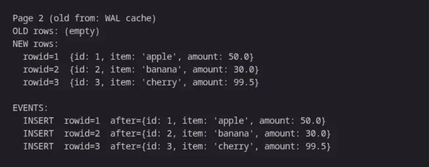
### UPDATE Event
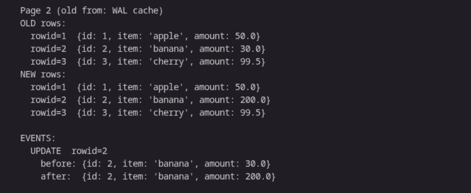
### DELETE Event
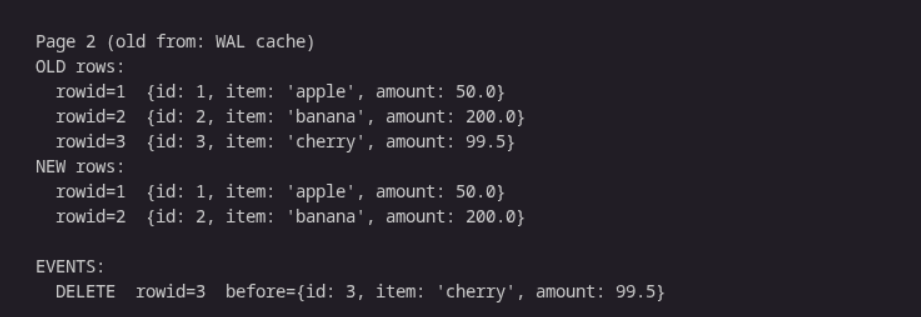

### Architecture of SQLite Connector
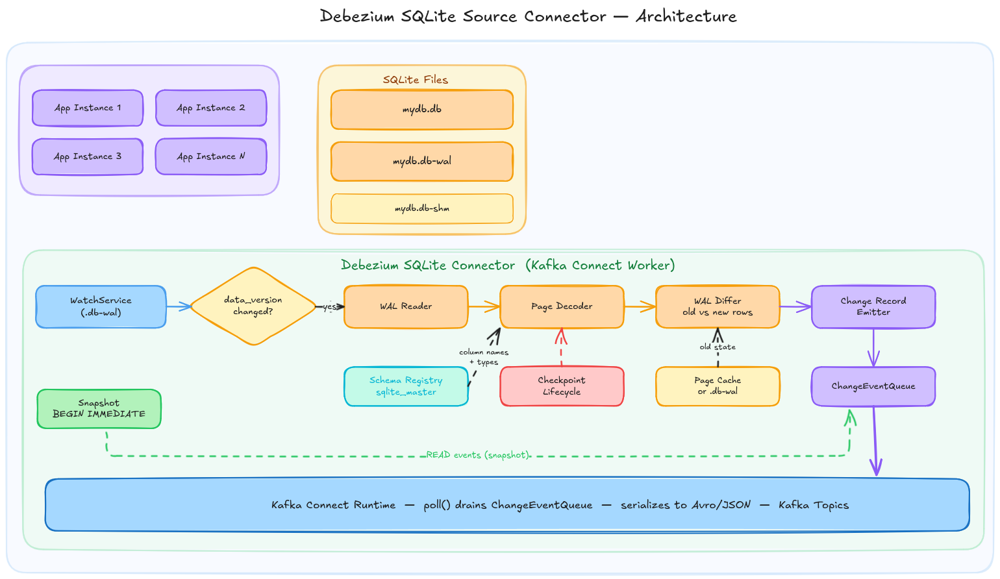

At a high level, the connector works as follows. On first startup it performs a blocked snapshot reading all existing rows from tracked tables. Once the snapshot completes, the streaming phase begins. A WatchService monitors the .db-wal file for OS-level modification events, gated by PRAGMA data_version to confirm only committed writes trigger a parsing cycle. When a change is detected, the WAL reader parses frame headers and groups them into committed transactions. The page decoder then decodes the raw B-tree leaf pages reading cell pointers, varints, and serial types to reconstruct row values. The WAL differ compares the new page state against the old state, retrieved either from the in-memory page cache or the .db file directly and produces INSERT, UPDATE, or DELETE events with correct before and after values. These events are converted into Debezium SourceRecord objects and placed on the ChangeEventQueue, which Kafka Connect drains via poll() and publishes to Kafka topics. Throughout streaming, the connector holds an open reader transaction and registers a WAL hook to prevent unexpected checkpoints from invalidating the page cache, performing its own controlled checkpoint at configurable intervals.

The Technical Implementation has been divided into 6 main modules:
1. Project Skeleton and Configuration
2. Schema Handling
3. Initial Snapshot
4. WAL Parsing Engine
5. Streaming 
6. Testing and Documentation

## Module 1 - Project Skeleton and Configuration

### Preface and Goal
Every Debezium connector follows the same foundational pattern: 
1. SourceConnector that validates configuration and spawns tasks. 
2. SourceTask that runs the main loop 
3. JDBC connection wrapper that enforces database-specific requirements.

This module establishes the connector foundation following the standard Debezium connector pattern. The SQLite-specific additions are WAL mode enforcement at startup and disabling auto-checkpoint on the connector connection. The goal is a connector that compiles, connects to SQLite, enforces WAL mode, and fails clearly with useful error messages when configuration is wrong. Every subsequent module builds directly on this foundation

### Deliverables
- Connector compiles against the Debezium BOM and Kafka Connect API.
- Connects to any SQLite .db file via JDBC.
- Enforces PRAGMA journal_mode=WAL on startup and fails immediately if WAL mode is unavailable.
- Disables automatic checkpointing on the connector connection.
- Validates all configuration fields.

### Co-located Deployment
Every other Debezium connector connects to a remote database server over a network. SQLite has no server and no network protocol. The connector reads that file directly using Java's FileChannel, which means it must run on the same machine as the .db file. This is enforced at startup and documented as a known limitation.


## Module 2 - Schema Handling

### Preface and Goal

Before the connector can decode a single row from the WAL, it needs to know the structure of every table it is monitoring i.e. the column names, their types, which column is the primary key etc.

The main goal of this module is to dynamically get the schema of any SQLite database without hardcoding and providing column names, types, primary key information, and schema change detection to every other module that needs it.

### Deliverables

- Read and parse all table schemas dynamically from `sqlite_master`
- Provides root page number per table for WAL frame-to-table mapping
- Maps SQLite type affinities to Kafka Connect schema types
- Detects WITHOUT ROWID tables and extracts their composite primary key
- Detects schema changes during streaming via PRAGMA schema_version

###   `sqlite_master`: SQLite's Schema Store

Unlike PostgreSQL or MySQL, SQLite stores the raw CREATE TABLE SQL string in a special table called `sqlite_master`. To know the schema of a table, we need to read this SQL string and parse it on our own.

```sql
SELECT name, sql FROM sqlite_master WHERE type = 'table';
-- Returns rows like:
-- name: "orders"
-- sql:  "CREATE TABLE orders (id INTEGER PRIMARY KEY, item TEXT, amount REAL)"
```

To know the schema of a table, the connector reads this SQL string and parses it, extracting column names, declared types, and constraints. This is different from other connectors which can query a structured catalog directly.

### The Rowid Alias
When a column is declared `INTEGER PRIMARY KEY`, SQLite makes it an alias for the table's internal rowid and omits it from the record body entirely. If the connector does not account for this, it reads NULL for that column. The schema registry should flag such columns during parsing so the WAL page decoder knows to substitute the rowid value rather than reading from the record body.

### Root Page Mapping
The `rootpage` value tells the connector which page number in the .db file is the root of that table's B-tree. When a WAL frame arrives, the connector knows the page number that changed but not which table it belongs to. So we need to maintain a root page to table name map built from sqlite_master to identify which table a WAL frame is modifying.

### Schema Change Detection
SQLite increments PRAGMA schema_version on every DDL operation. The connector can poll this value each streaming cycle. When it changes, SqliteDatabaseSchema re-reads sqlite_master, rebuilds the column map, and emits a schema change event.

### Rough Structure of Schema Handling Module
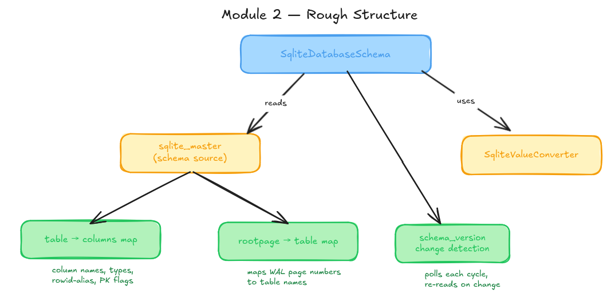

`SqliteDatabaseSchema` is the single entry point for all schema information in the connector. 
It reads from `sqlite_master` which produces two outputs: a table to columns map (storing column names, types, rowid-alias flags, and primary key information for each table) and a rootpage to table map (which tells the WAL parsing engine which table a given page number belongs to).

It uses `SqliteValueConverter` to handle the mapping from SQLite's type affinities to Kafka Connect schema types, keeping type conversion logic separate from schema introspection logic. The third responsibility of  `SqliteDatabaseSchema` is polling `PRAGMA schema_version` each cycle and triggering a full re-read of `sqlite_master` when it changes.

**The following table represents the SQLite Affinity to Kafka Connect Type mapping:**
| SQLite Affinity  | Kafka Connect Type |
|--------|--------|
| INTEGER   | INT64 |
| REAL | FLOAT64 |
| TEXT | STRING |
| BLOB | BYTES |
| NUMERIC | FLOAT64/ INT64 |


### Implementation Approach

At startup, `SqliteDatabaseSchema` queries sqlite_master for all tables and builds both maps in a single pass.  The SQL parser extracts column definitions from the CREATE TABLE statement. For each column it reads the name, determines the SQLite type affinity from the declared type keyword, and checks for `PRIMARY KEY` and `INTEGER PRIMARY KEY` (rowid alias):

```java
SqliteColumn parseColumn(String definition) {
    String columnName   = extractName(definition);
    String declaredType = extractType(definition);
    String affinity     = resolveAffinity(declaredType); // INTEGER, REAL, TEXT, BLOB, NUMERIC

    boolean isPrimaryKey  = definition.contains("PRIMARY KEY");
    boolean isRowidAlias  = affinity.equals("INTEGER") && isPrimaryKey;
    // isRowidAlias tells page decoder to use rowid value, not record body

    return new SqliteColumn(columnName, affinity, isPrimaryKey, isRowidAlias);
}
```
For schema change detection, `PRAGMA schema_version` is polled on each streaming cycle. A change triggers a full re-introspection and a schema change event:
```java
long currentVersion = readSchemaVersion();

if (currentVersion != cachedSchemaVersion) {
    refreshFromSqliteMaster();
    emitSchemaChangeEvent();
    cachedSchemaVersion = currentVersion;
}
```

## Module 3 - Initial Snapshot

### Preface and Goal

When the connector starts for the first time, it has no knowledge of the current state of the database. Before streaming WAL changes, it needs to establish a baseline. This is the snapshot. Without it consumers would only see changes that happen after the connector started, without context of what existed before.

The goal is a full read of all tracked tables that completes atomically after which the connector transitions seamlessly into streaming mode.

### Deliverables

- Full read of all rows from every tracked table via BEGIN IMMEDIATE
- Each row emitted as a READ event to the ChangeEventQueue
- Offset context initialised with data_version, wal_frame_index, and per-table last_rowid
- Clean transition into streaming mode after snapshot completes

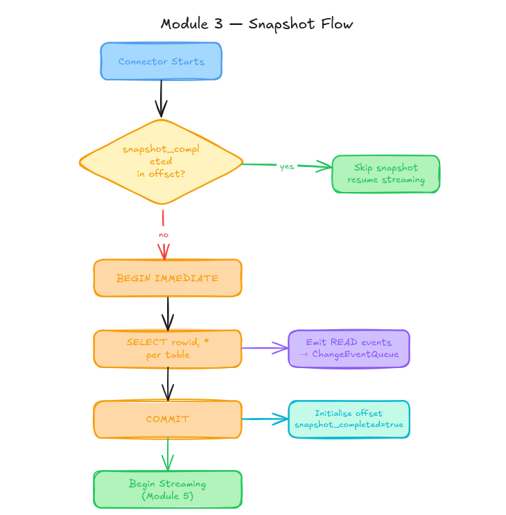

### BEGIN IMMEDIATE
SQLite provides a transaction type called BEGIN IMMEDIATE that acquires a reserved lock on the database at the start of the transaction. This prevents any other connection from writing while the snapshot transaction is open, while still allowing other readers.

```sql
BEGIN IMMEDIATE;
  -- connector reads all rows here
  -- no other writer can commit during this window
  SELECT rowid, * FROM orders;
  SELECT rowid, * FROM products;
  ...
COMMIT;
```

This gives the connector a consistent point-in-time view of the entire database for the duration of the snapshot. All reads within this transaction see the same version of the data regardless of how long the snapshot takes.

### Why rowid Must Be Explicit
The snapshot query uses `SELECT rowid, *` rather than `SELECT *`. The rowid is SQLite's internal unique row identifier and is not included in `SELECT *` by default. It must be explicitly selected as it is used in WAL Parsing Engine.

### Offset Initialisation
After the snapshot completes we need to populate the offset context so streaming can resume correctly on restart.
```json
{
  "snapshot_completed": true,
  "data_version": 42,
  "wal_frame_index": 17,
  "tables": {
    "orders":   { "last_rowid": 150 },
    "products": { "last_rowid": 32  }
  }
}
```

On restart, if `snapshot_completed` is true we can skip the snapshot  entirely and streaming resumes from `wal_frame_index`. . If `snapshot_completed` is false or absent (for example if the connector crashed mid-snapshot) the snapshot runs again from the beginning.

### Implementation Approach
I will extend `RelationalSnapshotChangeEventSource` and override the locking and query methods to adapt to SQLite's constraints. The BEGIN IMMEDIATE lock override replaces Postgres-style isolation levels:

```java
@Override
void lockTablesForSchemaSnapshot() {
    jdbcConnection.execute("BEGIN IMMEDIATE");
}

@Override
String getSnapshotSelect(TableId tableId) {
    return "SELECT rowid, * FROM " + tableId.table();
}
```
On restart, the offset loader checks `snapshot_completed` before deciding whether to snapshot or stream:

```java
if (previousOffset != null && previousOffset.isSnapshotCompleted()) {
    // skip snapshot, resume streaming from stored wal_frame_index
    startStreaming(previousOffset.getWalFrameIndex());
} else {
    // run snapshot from scratch
    runSnapshot();
}
```

## Module 4 - WAL Parsing Engine 
### Preface and Goal
This module contains the core technical contribution of the connector. Every Debezium connector receives change events from the database through a structured network protocol. In SQLite the only source of change information is the WAL file (a binary file of raw database page images with no row-level structure).

The goal of this module is to extract row-level INSERT, UPDATE, and DELETE events with correct before and after values directly from the raw WAL binary without issuing any additional queries to the database.

### Deliverables

- Parse WAL file header and frame headers from raw binary.
- Group WAL frames into committed transactions using the commit marker.
- Decode SQLite B-tree leaf pages: cell pointers, varints, serial types, column values.
- Retrieve old page state from page cache or .db file fallback.
- Diff old and new decoded rows by rowid to produce INSERT/UPDATE/DELETE events with correct before/after values.
- Handle overflow pages for large row payloads.

### WAL File Format
The WAL file is a sequence of frames. Each frame is a fixed-size unit consisting of a 24-byte header followed by one full database page of data (typically 4096 bytes). The file begins with a 32-byte WAL header that establishes the page size and two salt values used to validate frames.

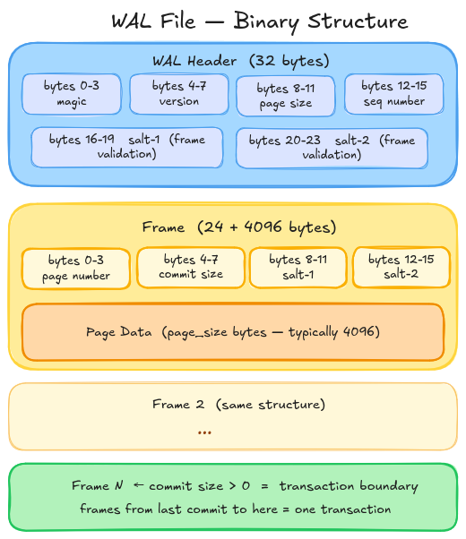

The frame header contains the page number (which database page this frame is a new version of) and a commit size field. A commit size of zero means the frame is part of an in-progress transaction. A non-zero value means this is the last frame of a committed transaction. Everything from the previous commit marker up to and including this frame forms one atomic unit. The connector only processes complete committed transactions, never partial ones.

### Getting Old and New Pages
To produce before/after row values, the connector needs the state before the transaction and the state after.The new state is always the current WAL frame. The old state comes from one of two places:
1. Page modified for first time: Get the old state from .db file at offset `(pageNumber - 1) × pageSize`.
2. Page modified again (already in WAL): Get old state from previous WAL frame for that page (from page cache)

The connector maintains a page cache `Map<pageNumber, lastFrameData`  which is its in-memory record of what each page looked like after the last transaction it processed. It is updated after every transaction and provides an O(1) lookup for the old state of any subsequent write to the same page. Without this cache, the connector would need to scan the entire WAL file from the beginning on every change to find the previous version of a page.

### Decoding a Page
A WAL frame's page data is a raw SQLite B-tree page. For CDC purposes, only table leaf pages are relevant which can be identified by the first byte of the page being `0x0D`. Interior pages `(0x05)` are structural index nodes with no row data and are skipped.

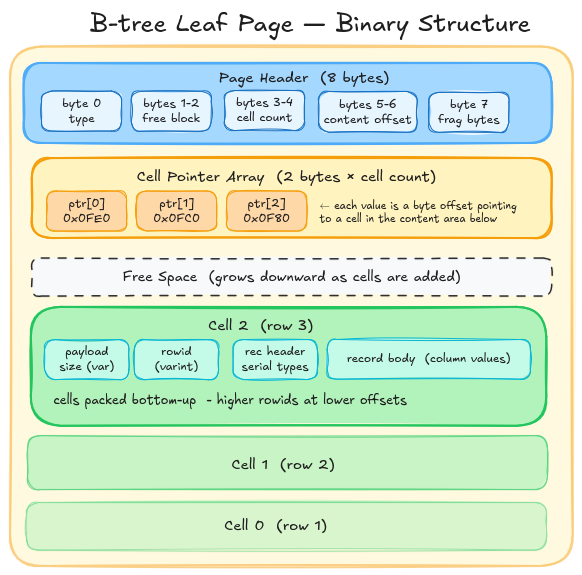

A leaf page contains a cell pointer array near the top which is a list of 2-byte offsets pointing to where each cell (row) starts within the page. Each cell in a page encodes one row using SQLite's record format.
The following image gives a detailed structure of a cell.


The record header in a cell contains serial types. Serial types in the record header tell the decoder what type each column value is and how many bytes it occupies in the body. The decoder reads the header first to collect all serial types, then reads the body values in order. For example, serial type 1 means a 1-byte signed integer, serial type 7 means an 8-byte IEEE 754 float, and odd values ≥ 13 mean UTF-8 text with length (N-13)/2. The decoder reads all serial types from the header first, then reads the body values in order using those sizes.

### Overflow Pages
When a row's payload exceeds roughly 1/4 of the page size, SQLite stores the overflow in overflow pages. The cell on the leaf page contains only the first portion of the record and a 4-byte pointer to the first overflow page. Each overflow page begins with a 4-byte pointer to the next, followed by continuation data. The decoder follows this chain, reading each overflow page from the WAL frame map or .db file, until the full record is reassembled.

### Diffing Old and New Pages
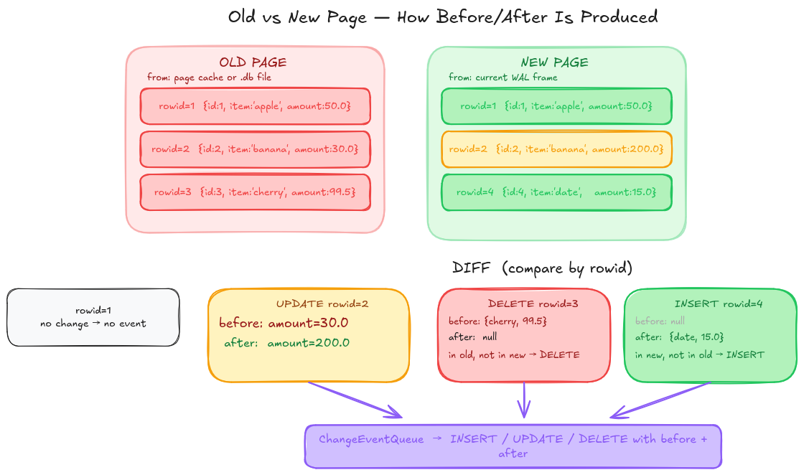
Once both old and new pages are decoded into maps of `rowid → column values`, the diff is straightforward:
1. rowid in new only: INSERT  (before = null,  after = new row)
2. rowid in old only: DELETE  (before = old row, after = null)
3. rowid in both, values differ: UPDATE (before = old row, after = new row)
4. rowid in both, values same: no event

This produces the complete before/after change events that the Debezium framework expects.

### Implementation Approach
The WAL reader opens the .db-wal file as a `FileChannel` and reads the WAL header once to extract page size and salt values. It then reads frame headers sequentially, validating salts and accumulating frames until a non-zero commit size signals the end of a transaction:

```java
ByteBuffer walHeader = readBytes(walChannel, 0, 32);
int pageSize = walHeader.getInt(8);
int salt1    = walHeader.getInt(16);
int salt2    = walHeader.getInt(20);

List<WalFrame> currentTxn = new ArrayList<>();
while (hasMoreFrames()) {
    WalFrame frame = readFrame(offset);
    if (frame.salt1 != salt1) { handleWalReset(); break; }
    currentTxn.add(frame);
    if (frame.commitSize > 0) {
        processTransaction(currentTxn);
        currentTxn.clear();
    }
}
```

The page decoder checks the page type byte, iterates the cell pointer array, and for each cell parses payload size, rowid, serial types, and values using the varint decoder:

```java
Map<Long, Map<String, Object>> decodePage(byte[] pageData, TableMetadata schema) {
    if (pageData[0] != 0x0D) return Map.of(); // not a leaf page

    int cellCount = readShort(pageData, 3);
    Map<Long, Map<String, Object>> rows = new LinkedHashMap<>();

    for (int i = 0; i < cellCount; i++) {
        int cellOffset  = readShort(pageData, 8 + i * 2);
        long payloadSize = readVarint(pageData, cellOffset);
        long rowid       = readVarint(pageData, cellOffset + varintSize(payloadSize));
        Map<String, Object> values = decodeRecord(pageData, cellOffset, rowid, schema);
        rows.put(rowid, values);
    }
    return rows;
}
```

The WAL differ retrieves the old page state from the page cache or .db file, calls the page decoder on both, and diffs by rowid:

```java
byte[] oldPage = pageCache.containsKey(pageNumber)
    ? pageCache.get(pageNumber)
    : readFromDbFile(pageNumber);

Map<Long, Map<String, Object>> oldRows = decodePage(oldPage, schema);
Map<Long, Map<String, Object>> newRows = decodePage(newPage, schema);

for (long rowid : union(oldRows.keySet(), newRows.keySet())) {
    if (!oldRows.containsKey(rowid))                  emitInsert(newRows.get(rowid));
    else if (!newRows.containsKey(rowid))             emitDelete(oldRows.get(rowid));
    else if (!oldRows.get(rowid).equals(newRows.get(rowid))) emitUpdate(oldRows.get(rowid), newRows.get(rowid));
}
pageCache.put(pageNumber, newPage);
```

## Module 5 - Streaming

### Preface & Goal

The WAL parsing engine decoded WAL pages and produced change events. This module is about the layer that drives that engine continuously, that is detecting when changes happen, triggering the WAL parsing cycle, managing the checkpoint lifecycle to keep the page cache consistent, and wiring everything into the Debezium framework so events can reach Kafka.

The goal is a continuous streaming loop that processes every committed SQLite transaction as a stream of Debezium change events and controls checkpointing safely.

### Deliverables

- WatchService monitoring `.db-wal` for file modification events
- PRAGMA data_version gate confirming committed writes before parsing
- Full streaming loop driving the WAL parsing engine
- Checkpoint lifecycle
- Correct restart recovery from stored offset (wal_frame_index, data_version)
- An Emitter building Debezium SourceRecord objects with correct before/after Struct values and Avro-compatible naming

### How changes are detected

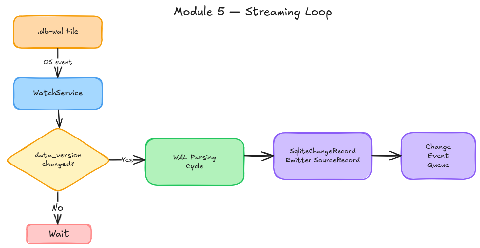

The connector uses a two-layer detection mechanism to know when a committed write has occurred:

1. **Layer 1 - Watch Service:** Java's WatchService API registers the directory containing the .db-wal file for OS-level file modification events. When any process writes to the WAL, the OS notifies the connector immediately.

2. **Layer 2 - PRAGMA data_version:** WatchService fires on every write to the WAL file, including mid-transaction writes that are not yet committed. PRAGMA data_version is a SQLite counter that only increments when a transaction fully commits. The connector reads this value after each WatchService event and compares it to the stored value. If it has not changed, the WAL write was not a commit and the connector ignores it and waits for the next event.


### The Checkpoint Lifecycle

The WAL file cannot grow indefinitely and SQLite needs to periodically checkpoint to reclaim space and maintain read performance. But if a checkpoint happens unexpectedly while the connector is reading, the page cache becomes stale. It holds old page states that no longer match what is in the WAL which leads to incorrect before values in change events.

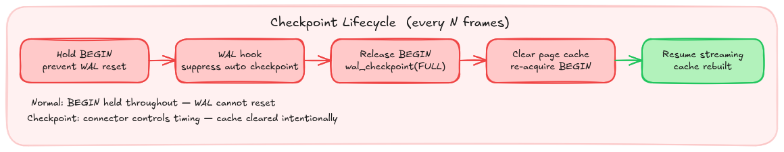

The connector prevents this with a three-layer strategy:

- **Hold BEGIN:** The connector maintains an open read transaction (BEGIN) on a dedicated reader connection. According to the SQLite WAL documentation, a writer will only reset the WAL if no readers are currently using it. Holding BEGIN registers the connector as an active reader, preventing the WAL from being reset while the connector is mid-cycle.

- **WAL hook:** The connector registers a WAL hook via sqlite3_wal_hook() (accessible through the native API of org.xerial:sqlite-jdbc) that fires after every commit. By returning zero from this hook, the connector suppresses all automatic checkpoints on the database entirely regardless of which connection triggers them.

- **Periodic controlled checkpoint:** To prevent the WAL from growing without bound, the connector should perform its own checkpoint at configurable intervals. The connector needs to release BEGIN, run PRAGMA wal_checkpoint(FULL), clear the page cache and re-acquire BEGIN. Because the connector controls the timing, it knows the cache is intentionally stale during this window and rebuilds it cleanly from the updated .db file on the next reads.

### Building SourceRecords
The change record emitter receives the operation type and before/after column value maps from the WAL differ, builds Kafka Connect Struct objects using the schema from SqliteDatabaseSchema, and wraps them in Debezium's standard change event envelope. Field names and topic names are normalised to Avro-compatible identifiers at this stage. The actual serialisation to Avro or JSON binary format is handled by the Kafka Connect runtime, not by the connector.

### Restart Recovery
Every time a transaction is processed, the connector should update its offset:
```json
{
  "snapshot_completed": true,
  "data_version": 42,
  "wal_frame_index": 17,
  "tables": {
    "orders": { "last_rowid": 150 }
  }
}
```

On restart, the connector reads this offset from Kafka Connect.
1. If data_version matches the current database value, that means nothing changed while the connector was down, resume from wal_frame_index
2. If data_version is higher then changes were missed and we need to re-read WAL from wal_frame_index to catch up
3. If WAL has been reset (salt mismatch at stored frame index) then perform a new snapshot

### Implementation Approach
The streaming loop implements StreamingChangeEventSource following the same contract as the Postgres connector. The WatchService drives the loop, gated by data_version:

```java
while (context.isRunning()) {
    WatchKey key = watcher.poll(pollInterval, MILLISECONDS);
    if (key != null) {
        long currentVersion = readDataVersion();
        if (currentVersion != lastDataVersion) {
            processWalCycle();
            lastDataVersion = currentVersion;
        }
        key.reset();
    }
}
```

The checkpoint lifecycle uses a dedicated reader connection holding BEGIN and a WAL hook registered via sqlite-jdbc's native API:

```java
// suppress all automatic checkpoints
SQLiteConnection nativeConn = readerConn.unwrap(SQLiteConnection.class);
nativeConn.getDatabase().register_wal_hook((db, dbName, pages) -> 0);

// periodic controlled checkpoint
void performControlledCheckpoint() {
    readerConn.execute("COMMIT");                     // release reader lock
    jdbcConn.execute("PRAGMA wal_checkpoint(FULL)");  // checkpoint
    pageCache.clear();                                // intentional cache clear
    readerConn.execute("BEGIN");                      // re-acquire reader lock
}
```
The change record emitter builds a SourceRecord using the before/after maps from the WAL differ:

```java
SourceRecord buildRecord(Operation op, Map<String, Object> before, Map<String, Object> after, TableMetadata schema) {
    Struct beforeStruct = before != null ? toStruct(before, schema) : null;
    Struct afterStruct  = after  != null ? toStruct(after,  schema) : null;
    Struct envelope     = schema.getEnvelopeSchema().create(beforeStruct, afterStruct, sourceInfo);
    return new SourceRecord(partition, offset, topic, envelope.schema(), envelope);
}
```

## Module 6 — Testing & Documentation

### Preface & Goal

The connector is only good if it works in every scenario. The WAL parsing engine involves low-level binary decoding with several subtle edge cases like overflow pages, checkpoint boundaries, salt validation. This module builds the confidence through targeted unit tests on the parsing layer and end-to-end integration tests across every scenario the connector is expected to handle.

### Deliverables
- Unit tests for each WAL parsing class with known binary inputs and expected outputs
- Integration tests covering all major CDC scenarios end-to-end
- README with setup instructions, config reference, and deployment guide
- Documentation of known limitations

## Known Limitations

The following limitations are inherent to SQLite's architecture or to the scope of this project. They are documented explicitly rather than treated as bugs to be fixed later.
 
| Limitation | Reason |
|---|---|
| Co-located deployment only | SQLite has no network protocol — the connector reads the `.db` file directly via `FileChannel` and must run on the same machine |
| WAL mode required | Rollback journal mode deletes change history on every commit — there is nothing to read for CDC |
| SQLite ≥ 3.51.3 recommended | Earlier versions have a WAL reset bug that can cause data corruption under concurrent checkpoint conditions, fixed in March 2026 |
| Application connections should also set `wal_autocheckpoint=0` | The WAL hook suppresses checkpoints on the database level, but documenting this for application connections provides an additional safety layer |
| `WITHOUT ROWID` and overflow pages handled in Phase 2 | These are valid SQLite features and will be supported, but the iterative approach recommended by mentors prioritises common cases first |

# Roadmap

GSoC 2026 allocates approximately 350 hours for a large project over 12 coding weeks. I plan to commit a minimum of **30 hours per week** throughout the coding period.

## Phase 1

### Community Bonding

Before coding starts I plan to:
- Set up the full Debezium development environment and confirm the build works end to end
- Study the Postgres connector source code in depth — specifically the connector task, streaming source, change record emitter, and offset context — as these are the direct reference implementations for the SQLite connector
- Read the official SQLite WAL documentation and file format specification in detail.
- Discuss and finalise the detailed design with mentors, particularly the WAL hook API access via `sqlite-jdbc`, the `WITHOUT ROWID` handling approach, and overflow page scope for Phase 1.

---

### Week 1: Project Skeleton

- Set up Maven project with correct Debezium BOM, sqlite-jdbc, and Kafka Connect dependencies
- Implement the connector entry point.
- Implement a JDBC connection wrapper that enforces WAL mode on startup and disables auto-checkpoint.
- Implement error handling.
- Connector JAR builds, connects to a SQLite file, and enforces WAL mode.

---

### Week 2: Schema Handling

- Implement a schema registry that reads all table definitions dynamically from sqlite_master.
- Build and maintain a root page number to table name map so the WAL parsing engine can immediately identify which table a given WAL frame belongs to
- Implement type affinity mapping from SQLite's five affinities to Kafka Connect schema types

---

### Week 3: Initial Snapshot

- Implement the snapshot phase using `BEGIN IMMEDIATE` to acquire an exclusive writer lock and get the initial state.
- Implement an offset context that stores `snapshot_completed`, `data_version`, `wal_frame_index`, and per-table `last_rowid`
- Wire the connector task's `start()`, `poll()`, and `stop()` lifecycle together end to end
- Integration test: snapshot produces correct `READ` events for all rows

---

### Week 4: Varint Decoder & Page Decoder

- Implement a varint decoder for SQLite's variable-length integer encoding.
- Implement a page decoder that checks the page type byte (`0x0D` for table leaf), reads the cell pointer array, and for each cell parses required details. 
- Handle all serial type categories: NULL, integers of varying widths, float64, integer constants, TEXT, and BLOB
- Unit tests using real WAL binary snapshots captured from the Python prototype

---

### Week 5: WAL Reader & Differ

- Implement a WAL reader that opens `.db-wal` as a `FileChannel`, parses the 32-byte WAL header to extract page size and salt values, reads frame headers sequentially, validates salts, and groups frames into committed transactions using the commit marker.
- Implement a WAL differ that retrieves old page state from the page cache or the database file as a fallback, calls the page decoder on both old and new pages, diffs decoded rows by rowid, and produces INSERT/UPDATE/DELETE change events with correct before/after values.
- Unit tests: INSERT/UPDATE/DELETE detection from known old/new page pairs

---

## Phase 2: Midterm

At this point we have snapshot working end to end, WAL parsing engine fully unit tested, basic streaming working for simple tables. Remaining work is streaming orchestration.

---

### Week 6: Streaming Loop

- Implement the main streaming loop: `WatchService` on the `.db-wal` directory for OS-level file modification events.
- Implement a change record emitter that builds Debezium `SourceRecord` objects with before/after `Struct` values and Avro-compatible field and topic naming.
- Update the offset after every transaction with the latest `data_version` and `wal_frame_index`
- Integration test: INSERT/UPDATE/DELETE each produce correct `SourceRecord` with before/after values

---

### Week 7: Checkpoint Lifecycle

- Hold `BEGIN` on a dedicated reader connection to prevent WAL reset mid-cycle
- Register a WAL hook via `sqlite3_wal_hook()` through the `sqlite-jdbc` native API to suppress all automatic checkpoints regardless of which connection triggers them
- Implement periodic controlled checkpoint
- Expose a config field to control checkpoint frequency
- Integration test: connector produces correct before/after values across a controlled checkpoint

---

### Week 8: Restart Recovery & Schema Changes

- Implement restart recovery.
- Implement schema change handling.
- Integration tests: restart with no missed events. Handle `ALTER TABLE without connector restart

---

### Week 9: Overflow Pages & WITHOUT ROWID

- Implement overflow page chain following in the page decoder and detect when a cell's payload exceeds the inline threshold.
- Implement `WITHOUT ROWID` table handling.
- Integration tests: large row payloads decoded correctly, `WITHOUT ROWID` table changes captured

---

### Week 10: Integration Testing & Bug Fixes

- Full integration test suite: snapshot, streaming, restart, schema change, checkpoint, overflow pages, multi-table, `WITHOUT ROWID`
- Fix any bugs surfaced by integration tests
- Stress test: high write throughput, WAL growing large, checkpoint under load.
- Verify offset correctness under all restart scenarios.

---

### Week 11: Polish & Code Review Preparation

- Dedicated week for code quality, addressing mentor review feedback, and preparing the final writeup. No new features, the main focus is on making the existing code production-ready and ensuring the project is in a state that can be submitted and maintained by the community.

---

### Final Week: Documentation & Submission

- Complete README: prerequisites, quick start, full configuration reference, deployment guide for both Kafka Connect and Embedded Engine
- Document known limitations
- Final code submission to the Debezium organisation
- Final report written and submitted via the GSoC website

## Other commitments

I am a full-time student at the Indian Institute of Information Technology. I currently have a part-time internship which will conclude before the GSoC coding period begins and will not overlap with any development work.

I also have a Bachelor's Thesis Project (BTP) running through the summer, expected to wrap up by end of June. However, this period coincides with my college vacations from May to mid-July, so I will have full availability for GSoC without any conflict.

From May to mid-July I am on college vacation, which means no classes and maximum flexibility outside of the BTP. From mid-July onwards, classes resume from 10am to 4pm, after which I am completely free. The bulk of the complex work — streaming orchestration, checkpoint lifecycle, edge cases, and integration testing (Weeks 6-10) — falls in this period, and the post-4pm availability is more than sufficient to maintain full GSoC pace for those weeks.

I am committed to communicating proactively with my mentors if anything changes, and to maintaining consistent weekly updates regardless of workload elsewhere.

## Post GSOC Commitments
I intend to remain an active contributor to the Debezium project beyond the GSoC period. The SQLite connector will be in a functional state by the end of GSoC, but like any new connector there will be follow-up work. I will stay engaged and continue improving the connector.

 # References
 
- [SQLite WAL documentation](https://www.sqlite.org/wal.html)
- [SQLite file format specification](https://www.sqlite.org/fileformat2.html)
- [SQLite PRAGMA reference](https://www.sqlite.org/pragma.html)
- [Debezium connector development guide](https://debezium.io/documentation/reference/stable/development/engine.html)
- [Debezium Postgres connector: reference implementation](https://github.com/debezium/debezium/tree/main/debezium-connector-postgres)
- [Mentor discussion on Zulip](https://debezium.zulipchat.com/#narrow/channel/573881-community-gsoc/topic/Siddhant.20-.20SQLite.20connector/with/582273764)
- [SQLite WAL reset bug — fixed in 3.51.3](https://www.sqlite.org/wal.html#the_wal_reset_bug)

