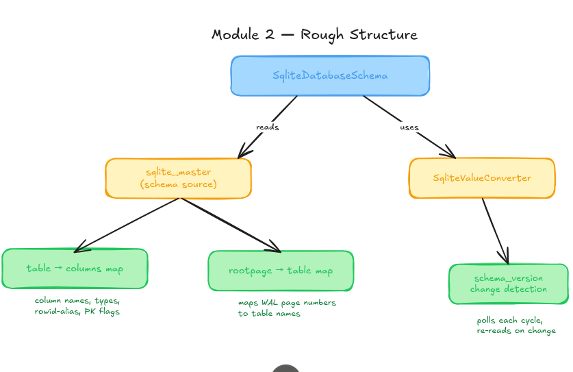

# Debezium: Source Connector for SQLite

## About me

1. **Name:** Siddhant Chaturvedi (GitHub: [@siddhantcvdi](https://github.com/siddhantcvdi))
2. **University / Program / Year:** IIIT Gwalior, Integrated BTech+MTech in IT, 3rd Year / Expected Graduation: 2028
3. **Contact:** 
   - Email: siddhantcvdi@gmail.com
   - Phone: +91 6372207434
4. **Time zone:** IST (UTC+5:30)
5. **Experience:** Software Engineering Intern at TeemCRM | JEE Qualified (Top 1.2%)
6. [Link to Zulip Introduction](https://debezium.zulipchat.com/#narrow/channel/573881-community-gsoc/topic/newcomers/near/577126130)

## Code Contributions

### [Define explicit Jandex version in Quarkus modules](https://github.com/debezium/debezium-quarkus/pull/26)

| Field  | Detail |
|--------|--------|
| Repo   | `debezium/debezium-quarkus` |
| Status | Merged |

During the build process, Maven was printing warnings due to a missing explicit Jandex version, causing it to fall back to a default. I explicitly set the `jandex` and `jandex-maven-plugin` versions using the `${version.jandex}` property in the affected `pom.xml` files, aligning them with the centralized dependency management.

### [Connection validator for Redis](https://github.com/debezium/debezium-platform/pull/274)

| Field  | Detail |
|--------|--------|
| Repo   | `debezium/debezium-platform` |
| Status | Merged |

Implemented a Redis Connection Validator in the `debezium-platform-conductor` module, which validates Redis connection configuration before the connector starts. The validator checks host, port, and optional SSL settings, and gives clear error messages for misconfigured fields.

**Key Changes:**
- `RedisConnectionValidator.java` - Core validation logic.
- `RedisConnectionValidatorTest.java` - Unit tests covering valid and invalid configurations
- `RedisConnectionValidatorAuthIT.java` - Integration tests for authenticated Redis connections
- `RedisTestResource` / `RedisTestResourceAuthenticated` - Test containers pulling from **mirror.gcr.io/redis:7-alpine**

### [Fix stale `database.*` namespace references in SQL Server](https://github.com/debezium/debezium/pull/7136)

| Field  | Detail |
|--------|--------|
| Repo   | `debezium/debezium` |
| Status | Merged |

The JDBC driver passthrough configuration namespace was renamed from `database.` to `driver.` in Debezium 2.0, but the SQL Server connector retained several stale references to the old namespace. This PR replaces them across tests, `pom.xml`, and documentation, and expands the SSL configuration docs with clearer examples.

Key changes:
- `pom.xml` - Updated all the SSL properties to use `driver.` prefix matching the camelCase keys expected by the Microsoft JDBC driver.
- `SqlServerConnectorIT.java` - Updated test config to use new namespace and keys.
- `TestHelper.java` - Extended ther helpers to also read `driver.*` system properties alongside `database.*`, so Maven-set SSL properties are correctly picked up during tests.
- `SqlServerConnectorConfig.java` - Replaced the hardcoded `database.applicationIntent` falling back to `database.applicationIntent` for backward compatibility.

### [Google Cloud Pub/Sub connection validator](https://github.com/debezium/debezium-platform/pull/279)

| Field  | Detail |
|--------|--------|
| Repo   | `debezium/debezium-platform` |
| Status | Under Review |

This Pull Request implements **PubSubConnectionValidator** in the **debezium-platform-conductor** module, validating Google Cloud Pub/Sub destinations before the connector starts. 

**It supports three credential modes:**
- Application Default Credentials (ADC) — for GCP-hosted environments and it needs no config. 
- Inline service account JSON via `credentials.json`
- Custom gRPC endpoint via `endpoint` for the Pub/Sub Emulator

**Key changes:**
- `PubSubConnectionValidator.java`: Added a two-phase validation which checks the config first (without network) and then attempts to make a connection. Add support for emulator via `ManagedChannel` with `NoCredentialsProvider`
- `connection-schemas.json`: Added **GOOGLE_PUB_SUB** schema entry with **project.id** as the only required field
- `application.yml`: Added timeout and scope config properties
- `PubSubConnectionValidatorTest.java`: Wrote unit tests covering cases like null config, missing `project.id`, malformed inline credentials, whitespace trimming, and optional field acceptance
- `PubSubConnectionValidatorIT.java`: It includes integration tests against a live PubSubEmulatorContainer, including unreachable endpoint failure
- `PubSubTestResource.java`: This is a quarkus test resource managing the `gcr.io/google.com/cloudsdktool/google-cloud-cli:emulators` container lifecycle
- `pom.xml`: Added **google-cloud-pubsub** and **testcontainers-gcloud** dependencies

## Project Information

### Abstract

SQLite is a lightweight, embedded relational database widely used in desktop, mobile, and edge/IoT applications, where it serves as the primary data store for local application state. Despite its widespread adoption, no production-ready Change Data Capture connector exists for SQLite. This project proposes a Debezium source connector for SQLite that captures row-level changes by directly parsing the SQLite Write Ahead Log (WAL) file. Unlike other Debezium connectors that receive structured change events from a network replication protocol, this connector decodes raw SQLite B-tree leaf pages, reconstructs before and after row states by diffing page versions across WAL frames and produces standard change events operations without requiring any modifications to the main application using the database. The connector supports an initial blocked snapshot, dynamic schema introspection, and a controlled checkpoint lifecycle. By bridging SQLite with Kafka and Debezium Server, this connector enables audit trails, observability, and edge-to-cloud data pipelines for the vast ecosystem of applications already built on SQLite.

### Why this project?

I was introduced to Change Data Capture while exploring Debezium as part of GSoC and I found it to be genuinely interesting. The idea of capturing changes directly from a database without relying on base application logic felt very elegant. As I read more about Debezium and went through parts of the codebase, I was impressed by the connector models for various databases. 

Unlike systems where change events are already exposed in a more structured form, this project requires working with the database internals. Understanding WAL behavior, page-level changes, and binary structures makes it a much deeper systems problem, and that is exactly what makes it exciting to me. I enjoy work that involves digging deep and understanding how things actually function internally.

Apart from the technical challenge, SQLite is used in a huge number of applications like embedded, mobile, and local-first environments, but it does not yet have a strong CDC. Building a connector for it would make real-time change capture possible in these places, which makes the work feel quite practical.

# Technical Description

This section focuses on the technical implemetation of SQLite Source Connector. Databases like PostgreSQL and MySQL expose change events through a network replication protocol. QLite has no such protocol. It is an embedded, file-based database with no network interface.

The Technical Implementation has been divided into 6 main modules:
1. Project Skeleton and Configuration
2. Schema Handling
3. Intial Snapshot
4. WAL Parsing Engine
5. Streaming 
6. Testing and Documentation

## Module 1 - Project Skeleton and Configuration

### Preface and Goal
Every Debezium connector follows the same foundational pattern: 
1. SourceConnector that validates configuration and spawns tasks. 
2. SourceTask that runs the main loop 
3. JDBC connection wrapper that enforces database-specific requirements.

   This module does not contain anything new and implements the same pattern for SQLite.

### Deliverables
- Connector compiles against the Debezium BOM and Kafka Connect API.
- Connects to any SQLite .db file via JDBC.
- Enforces PRAGMA journal_mode=WAL on startup and fails immediately if WAL mode is unavailable.
- Disables automatic checkpointing on the connector connection.
- Validates all configuration fields.


## Module 2 - Schema Handling

### Preface and Goal

Before the connector can decode a single row from the WAL, it needs to know the structure of every table it is monitoring i.e. the column names, their types, which column is the primary key etc.

The main goal of this module is to dynamically get the schema of any SQLite database without hardcoding and providing column names, types, primary key information, and schema change detection to every other module that needs it.

### Deliverables

- Read and parse all table schemas dynamically from `sqlite_master`
- Provides root page number per table for WAL frame-to-table mapping
- Maps SQLite type affinities to Kafka Connect schema types
- Detects WITHOUT ROWID tables and extracts their composite primary key
- Detects schema changes during streaming via PRAGMA schema_version

### Description

Unlike PostgreSQL or MySQL, SQLite stores the raw CREATE TABLE SQL string in a special table called `sqlite_master`. To know the schema of a table, we need to read this SQL string and parse it on our own.

```sql
SELECT name, sql FROM sqlite_master WHERE type = 'table';
-- Returns rows like:
-- name: "orders"
-- sql:  "CREATE TABLE orders (id INTEGER PRIMARY KEY, item TEXT, amount REAL)"
```
We just need to parse the sql string to get the schema of the table.

We also have to maintain a map that keeps a relation between pages of the database and which table are they associated with. When a WAL frame arrives, the connector knows the page number that changed but not which table it belongs to. By maintaining a rootpage to table name map the connector can immediately identify which table a WAL frame is modifying.



`SqliteValueConverter` handles the affinity-to-Kafka-Connect type mapping.SQLite uses five type affinities rather than strict types. The connector maps these to Kafka Connect schema types:

| SQLite Affinity  | Kafka Connect Type |
|--------|--------|
| INTEGER   | INT64 |
| REAL | FLOAT64 |
| TEXT | STRING |
| BLOB | BYTES |
| NUMERIC | FLOAT64/ INT64 |

### Schema Change Detection
SQLite increments PRAGMA schema_version on every DDL operation. The connector polls this value each streaming cycle. When it changes, SqliteDatabaseSchema re-reads sqlite_master, rebuilds the column map, and emits a schema change event. 

- [Quarkus Debezium Extension](https://github.com/debezium/debezium-design-documents/blob/main/DDD-12.md)
- [Read-only incremental snapshots for other relational connectors](https://github.com/debezium/debezium-design-documents/blob/main/DDD-12.md)


### Roadmap

The default schedule for GSoC is 12 weeks, either full-time or part-time. See [the GSoC timeline](https://developers.google.com/open-source/gsoc/timeline) for precise dates. This template assumes you'll be using those 12 weeks; if you're doing an alternate schedule you can adjust appropriately.

#### **Phase 1**

**Community Bonding**: List any paperwork you want to do before coding starts.

For each coding week below, list planned code deliverables. Break the project into weeks and estimate what you will have complete at the end of each one. This schedule can be adjusted later if need be.

##### Week 1 
Note that usually even week 1's deliverables should include some code.

##### Week 2

##### Week 3

##### Week 4

##### Week 5

#### **Phase 2** - Midterm point

You need enough done at this point for your mentor to evaluate your progress and pass you. Usually you want to be a bit more than half done.

##### Week 6

##### Week 7

##### Week 8

##### Week 9

##### Week 10

##### Week 11

##### **Final Week**
End of the standard GSoC coding period.  List the final planned deliverables for your project here.

At this stage your project should be completed and your code should already have been submitted to your organization, final report written, reviewed, and submitted via the GSoC website.  

_**Please Note:** We ask our GSoC contributors to produce a final writeup summarizing their work prior to completion of GSoC.  This can often be based on your final report or, if you prefer, can be a more narrative-style summary of your experience with GSoC (lessons learned, challenges, highlights, etc).  The writeup should be posted either on a blogging platform where links tend to persist reliably._

## Other commitments

Provide a brief summary about your previous committments, other work schedule, or studies during GSoC that you'll need to work around during GSoC. Provide also a plan to honor these committments while also completing your GSoC project. Your mentors should be aware of these information to effective supporting you.

## Appendix

*Optional*: Please add any additional content or references/links that support your application.

*Note: Portions of this application template were borrowed from the excellent template provided the Python GSoC organization: https://github.com/python-gsoc/python-gsoc.github.io/blob/main/ApplicationTemplate.md.  Thanks!*