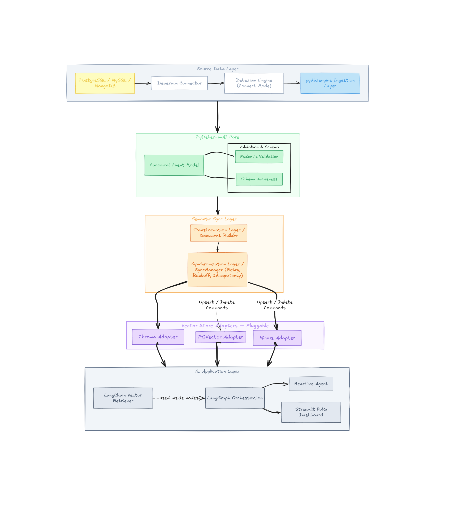

  # Debezium: PyDebeziumAI

  **Project Size**: 350 hours

  ## About me

  **Name**: Kodukulla Mohnish Mythreya (GitHub: [KMohnishM](https://github.com/KMohnishM))

  **University**: Vellore Institute of Technology, Chennai  
  **Program**: B-Tech Computer Science Engineering (CSE Core)  
  **Year**: 3rd Year  
  **Expected Graduation**: June 2027

  **Contact info**:
  - **Email**: kmohnishm@gmail.com
  - **Time zone**: IST (UTC +5:30)

  **Zulip Introduction**: [Kodukulla - PyDebeziumAI](https://debezium.zulipchat.com/#narrow/channel/573881-community-gsoc/topic/Kodukulla.20-.20PyDebeziumAI/near/577819893)

  **Resume**: [Link to resume](https://drive.google.com/file/d/1WbbDSw-EdcWaQnonxACWivQ3OBTIXQwW/view?usp=sharing)

  ---

  ## Code Contribution

  I have been actively contributing to Debezium (both on Java and Python parts) to build a strong understanding of the codebase, CDC event handling, schema management, and community practices.

  - [PR #400](https://github.com/debezium/debezium-examples/pull/400) – **Add Python example demonstrating Debezium Connect-mode** (Draft)  
    Added a complete runnable example under `debezium-python/` using `pydbzengine` in Connect mode, including robust event handling and logical type conversion. This directly proves the foundation for PyDebeziumAI.

  - [PR #7223](https://github.com/debezium/debezium/pull/7223) – **Adding MongoDB Sink Event Handler** (Open)  
    Introduced dedicated MongoDB event handling for CDC operations with new event classes and routing logic.

  - [PR #7254](https://github.com/debezium/debezium/pull/7254) – **Support for `collection.fields.additional.error.on.missing` in MongoEventRouter** (Draft)
    Added support for missing additional-field handling in MongoDB outbox SMT, fixed a related `NullPointerException` in shared `EventRouterDelegate` logic, and added unit tests for missing-field scenarios.

  - [PR #7211](https://github.com/debezium/debezium/pull/7211) – **Schema Inconsistency Fixing** (Open)  
    Fixed schema mismatch in MariaDB connector for tables with generated/hidden columns.

  - [PR #7176](https://github.com/debezium/debezium/pull/7176) – **Document Updated with postgresql on GCP** (Open)  
    Added and improved documentation for PostgreSQL on Google Cloud SQL.

  - [PR #254](https://github.com/debezium/debezium-server/pull/254) – **Create test-jar for debezium-server-core** (Merged)  
    Enabled reuse of test utilities across modules.

  These contributions show my ability to work across the Debezium ecosystem and have prepared me well for the Python-focused work in this project.

  ---

  ## Project Information

  ### Abstract
  With rapid advances in AI, many applications rely on retrieval-augmented generation (RAG) over domain data stored in relational databases. Most current pipelines become stale because they depend on polling or periodic batch reloads.

  **PyDebeziumAI** will deliver a first-class Python library that integrates directly into LangChain and LangGraph. It uses Debezium CDC events (via the existing `pydbzengine`) to keep the LLM context **immediately up-to-date** whenever the underlying database changes.

  The library will:
  - Extend `pydbzengine` with a new `DebeziumLangChainHandler`
  - Convert CDC events into LangChain `Document` objects in real time
  - Provide a pluggable real-time updater for vector stores
  - Include multiple example applications and full related documentation
  - Be published on PyPI

  This creates a perfect bridge between Debezium's change data capture and modern AI frameworks.

  ### Project Scope

  The scope is to deliver a production-ready Python CDC-to-semantic-sync pipeline that keeps vector indexes deterministically aligned with relational changes, with a simple developer API, tests, documentation, runnable examples, and a PyPI release.

  ### Why this project?
  
  My interest in this project comes from how real-time systems can interact with intelligent models in a reliable and structured way.
  
  Instead of approaching this only conceptually, I started by working directly with the system. I explored `pydbzengine`, ran end-to-end CDC pipelines, and studied how Debezium events are represented and consumed. During this process, I focused on how this continuous stream of structured CDC events can be transformed into formats usable by frameworks like LangChain and LangGraph.
  
  Through discussions with mentors on Zulip, I focused on schema handling, event representation, and integration boundaries. Acting on this feedback, I implemented a working prototype and validated integration boundaries for real-time CDC-to-AI workflows. These steps helped me understand the practical challenges involved in bridging CDC systems with AI frameworks.
  
  What motivates me about this project is the opportunity to take these initial explorations further and develop them into a clean, reusable, and well-integrated library. It allows me to work at the intersection of distributed systems and AI infrastructure, which aligns closely with my long-term interests.
  
  I am also motivated by the collaborative aspect of the Debezium community. Through my contributions and interactions, I have become comfortable with the codebase and development workflow, and I am excited to continue building on that foundation during GSoC.

  ### Technical Description

  PyDebeziumAI is designed as a real-time semantic synchronization layer between Debezium CDC streams and LLM ecosystems such as LangChain and LangGraph.

  The project moves from batch-driven refreshes to continuous sync, so retrieval context remains fresh, deterministic, and debuggable.

  #### 1. Architecture Overview

  The system follows a modular event-driven architecture:

  

  End-to-end flow:
  1. Capture row changes using Debezium via `pydbzengine`.
  2. Normalize events into a canonical Python model.
  3. Project canonical events into semantic `Document` objects.
  4. Apply deterministic synchronization in vector storage.
  5. Expose retrievers/tools for LangChain and LangGraph.

  #### 2. Design Foundations From Mentor Discussions

  Key design decisions were influenced by public `#community-gsoc` discussions:

  - **Connect mode over JSON** for stronger schema fidelity and lower overhead.
  - **Schema-aware canonical model** for stable internal contracts.
  - **Pydantic validation** for correctness and maintainability.
  - **Abstraction-first interfaces** to keep backend integrations pluggable.

  #### 3. Core Technical Design

  ##### 3.1 Ingestion Layer

  The ingestion layer is responsible for receiving change events from Debezium in a format that can be processed consistently by downstream components.

  Supported ingestion modes:
  - **Connect mode (preferred):** consumes `SourceRecord` through JPype (no JSON round-trip).
  - **JSON mode:** maintained for compatibility and easier local debugging.

  Core responsibilities:
  - Decode connector-specific envelopes.
  - Extract operation (`c/u/d/r`), key, timestamps, and source metadata.
  - Forward normalized records to the canonical model boundary.

  ##### 3.2 Canonical Event Contract

  All incoming records are transformed into a single typed model to isolate connector differences.

  ```python
  class DebeziumPayloadModel(BaseModel):
    before: Optional[Dict[str, Any]] = None
    after: Optional[Dict[str, Any]] = None
    op: str
    ts_ms: Optional[int] = None

    @model_validator(mode="after")
    def check_op(self):
      valid_ops = {"c", "u", "d", "r"}
      if self.op not in valid_ops:
        raise ValueError(f"Invalid op: {self.op!r}")
      return self


  class DebeziumEventModel(BaseModel):
    destination: str
    partition: Optional[int] = None
    key: Optional[str] = None
    payload: DebeziumPayloadModel
  ```

  Design properties:
  - Recursive normalization of nested values.
  - Connector logical-type handling (timestamps, decimals, etc.).
  - Deterministic serialization for testing and replay.
  - Connect-mode ingestion is normalized through `SourceRecordExtractor` and validated through `DebeziumEventModel.from_source_record(...)`.

  ##### 3.3 Identity, Ordering, and Idempotency

  Correctness depends on deterministic identity and replay-safe processing.

  - **Document ID strategy:** `namespace.table:primary-key-hash` (or deterministic composite key encoding).
  - **Ordering assumption:** per-table or per-partition order as delivered by Debezium source stream.
  - **Idempotency:** repeated events for the same key+state must converge to one final vector state.
  - **Update rule:** `u` events are applied as replace semantics (`delete + add`) to avoid stale embeddings.

  ##### 3.4 Transformation Layer (Semantic Projection)

  The transformation layer converts canonical row events into semantic documents using pluggable policies:
  - Field selection (include/exclude columns).
  - Template rendering per table.
  - Metadata strategy for filtering (tenant, table, operation time, source).

  ```python
  Document(
    page_content="semantic representation",
    metadata={"table": "customers", "pk": "123", "tenant": "acme"},
    id="customers:123",
  )
  ```

  This ensures adapter-level compatibility with multiple vector store backends.

  ##### 3.5 Synchronization Layer

  The synchronization layer applies CDC semantics to the target vector backend and ensures that state transitions remain correct under retries, restarts, and partial failures.

  Synchronization semantics:
  - `c` and `r`: upsert as add.
  - `u`: replace (delete existing ID, then insert new rendering).
  - `d`: hard delete where supported, soft-delete fallback otherwise.

  Reliability responsibilities:
  - Retry with bounded exponential backoff.
  - Dead-letter path for non-retryable failures.
  - Checkpointing/offset-aware progression for restart safety.
  - Optional bounded queue and backpressure controls.

  ##### 3.6 Vector and Memory Adapter Abstractions

  To keep the system extensible, PyDebeziumAI uses adapter boundaries instead of backend-specific logic in the core pipeline.

  Core abstraction in scope:
  - LangChain `VectorStore` adapter interface.
  - Core backends: **Chroma, PGVector, Milvus**.

  Extended abstraction direction:
  - A generalized memory adapter interface is planned after VectorStore stability.
  - Additional memory types (for example, buffer/summary/custom memory) are considered optional extensions.

  ##### 3.7 Schema Evolution Strategy

  Schema changes are expected in real systems; the pipeline will explicitly handle:
  - Additive columns.
  - Nullable to non-null transitions where source provides compatible values.
  - Column removals through projection fallback rules.
  - Version tagging in metadata to support safe migrations.

  The document builder will support per-table projection policies to avoid embedding unstable or noisy fields.

  ##### 3.8 Observability and Diagnostics

  Observability is treated as a first-class concern so that latency, failures, and lag can be measured and debugged in production-like environments.

  Planned observability signals:
  - Event ingest rate and sync rate.
  - End-to-end latency (event timestamp to vector update completion).
  - Retry count, failure count, and dead-letter count.
  - Queue depth / lag indicators.

  Operational diagnostics:
  - Structured logs with event IDs and table/key context.
  - Optional tracing hooks for pipeline stages.

  ##### 3.9 Security and Operational Safety

  The project uses secure-by-default operational practices so developers can adopt the library safely without extra hardening work for basic usage.

  - No sensitive secret material persisted by default.
  - Config-driven masking for selected fields in logs.
  - Safe defaults for retries and timeouts.
  - Documented production guidance for embedding provider credentials and DB access policies.

  #### 4. Developer Experience (API Design)

  The API is intentionally simple while allowing advanced configuration:

  ```python
  from pydebeziumai import LiveContext

  rag = LiveContext(
    debezium_config=...,
    vector_store="chroma",
    embedding_model="openai",
    id_strategy="table_pk",
    projection_policy="default",
  )

  rag.start()
  retriever = rag.as_retriever()
  ```

  Advanced extension points:
  - custom document builders,
  - custom ID strategies,
  - custom sync/retry policy,
  - optional callback hooks for metrics and tracing.

  #### 5. Performance and Reliability Objectives

  Target baseline objectives for evaluation:
  - p95 end-to-end CDC-to-index latency under 2 seconds (local benchmark profile).
  - sustained throughput target >= 150 events/sec in benchmark scenario.
  - successful recovery after transient vector store failure without data loss.
  - deterministic final state after replay tests.

  #### 6. Testing Strategy

  Multi-layer test plan:
  - **Unit tests:** canonical parsing, projection, ID generation, sync semantics.
  - **Integration tests:** Debezium source -> pipeline -> vector store for Chroma/PGVector/Milvus.
  - **Failure tests:** retries, backpressure, partial outages.
  - **Replay/idempotency tests:** duplicate events and restart behavior.
  - **Example validation tests:** runnable demos as CI checks.

  #### 7. Design Decisions, Trade-offs, and Mitigations

  | Decision | Benefit | Trade-off | Mitigation |
  |---|---|---|---|
  | Connect mode as default | Better latency and schema fidelity | JPype dependency and JVM bridge overhead | Keep JSON compatibility path; build contract tests for both modes |
  | Replace semantics for updates | Correctness across heterogeneous stores | Additional write operations | Performance benchmarking and tuning for acceptable latency |
  | LangChain adapter boundary | Broad ecosystem compatibility | Reduced access to backend-specific tuning | Enforce adapter contract tests; define backend capability matrix |
  | Typed canonical model | Safer evolution and maintainability | Additional conversion layer | Deterministic serialization enables testing and replay |
  | Multi-backend support | Flexibility and portability | Integration complexity per backend | Staged rollout: Chroma → PGVector → Milvus; contract tests |
  | Schema evolution via projection | Safe field evolution without re-embedding | Projection policy maintenance burden | Version tagging in metadata; fallback rendering rules |

  ---
  
  ## Roadmap
  
  The project follows the standard 12-week GSoC schedule (full-time), structured around building a CDC-driven semantic synchronization system in incremental layers.
    
  ### Community Bonding (May 1 - May 24) - ~20 hrs/week
  - Continue contributions to Debezium and related repositories
  - Finalize package plan and release workflow (`pydebeziumai`)
  - Set up CI/CD, linting, and testing baseline
  - Study LangChain/LangGraph retriever and VectorStore internals
  - Align on design decisions with mentors
  - Prepare development milestones and evaluation checkpoints
  
  ### Phase 1 - Core Pipeline (Weeks 1-5)
  
  #### Week 1 (May 25 – May 31) - 35-40 hrs
  - Extend `pydbzengine` with handler skeleton
  - Implement canonical Pydantic `DebeziumEventModel` + payload validation
  - Normalize Connect + JSON ingestion
  - **Outcome**: Stable ingestion + validated event pipeline
  
  #### Week 2 (June 1 – June 7) - 35-40 hrs
  - Implement Transformation Layer (Document Builder)
  - Add deterministic key generation (`table:primary_key`)
  - Convert canonical events → LangChain `Document`
  - **Outcome**: Semantic representation working
  
  #### Week 3 (June 8 – June 14) - 35-40 hrs
  - Implement Synchronization Layer (SyncManager)
  - Handle CDC operations: insert → add, update → delete + insert, delete → delete / soft-delete fallback
  - Integrate with Chroma backend
  - **Outcome**: End-to-end real-time synchronization pipeline
  
  #### Week 4 (June 15 – June 21) - 35-40 hrs
  - Integrate LangChain retriever
  - Add LangGraph node support
  - Build first example: Real-time RAG chatbot
  - Add initial tests
  - **Outcome**: Full working pipeline + usable example
  
  #### Week 5 (June 22 – June 28) - 35-40 hrs
  - Add second backend (PGVector)
  - Start third backend integration (Milvus)
  - Improve logging, observability, and debugging
  - **Outcome**: Chroma + PGVector stable, Milvus integration started
  
  ### Midterm Milestone (Evaluation ~July 6)
  - Core system complete: ingestion, transformation, synchronization, retriever
  - One complete example working
  - Pre-release published on TestPyPI
  
  ### Phase 2 - Expansion & Production Readiness (Weeks 6-11)
  
  #### Week 6 (July 6 - July 12) - 25-30 hrs
  - Complete Milvus backend and compatibility tests
  - Build second example: LangGraph reactive agent
  - Add structured filtering via metadata
  - **Outcome**: Three core backends operational (Chroma, PGVector, Milvus)
  
  #### Week 7 (July 13 – July 19) - 25-30 hrs
  - Documentation: quickstart guide, API docs (Sphinx), architecture explanation
  - Improve developer experience
  - **Outcome**: Developer-ready library
  
  #### Week 8 (July 20 - July 26) - 25-30 hrs
  - Performance benchmarking (latency + throughput)
  - Introduce batching and async processing improvements
  - **Outcome**: Performance-aware system
  
  #### Week 9 (July 27 - August 2) - 25-30 hrs
  - Packaging and release preparation (artifacts, metadata, release checklist)
  - Stability improvements and CI/CD refinement
  - **Outcome**: Release-ready package candidate
  
  #### Week 10 (August 3 - August 9) - 25-30 hrs
  - Final testing and bug fixes
  - Publish package to PyPI
  - Documentation polish
  
  #### Week 11 (August 10 - August 16) - 25-30 hrs
  - Third example: Live Dashboard (Streamlit)
  - Stretch goal work (if time permits)
  
  ### Final Week
  - Submit final report
  - Publish blog / demo video
  - Present project to Debezium community
  
  ### Stretch Goals
  
  1. Additional vector store backends (Qdrant, Weaviate)
  2. Advanced document strategies (selective embedding, field-aware projection)
  3. Pydantic AI integration for typed RAG pipelines
  4. Advanced async + batching optimizations
  5. Optional lightweight in-memory cache for deletes and schema evolution

  ### Success Criteria

  1. Functional correctness
  - CDC operations (`c/u/d/r`) map to deterministic vector-state transitions.
  - Replay and duplicate-event tests converge to correct final state.

  2. Reliability
  - Retry and backoff flows validated by failure-injection tests.
  - Pipeline restarts recover and continue without corrupting state.

  3. Performance
  - Benchmark report published with latency and throughput numbers.
  - Documented tuning guidance for batching and async workers.

  4. Developer experience
  - Quickstart from zero to running demo in under 15 minutes.
  - API docs and examples for all core backends.

  5. Release quality
  - Automated CI for tests and style checks.
  - TestPyPI pre-release and final PyPI publication completed.


  ## Other Commitments
  
  My university end-semester exams conclude before the start of the coding period, allowing me to fully dedicate myself from Week 1 onward.
  
  GSoC largely overlaps with my summer break, during which I have no other major commitments. I plan to work 35-40 hours per week during the initial weeks, focusing on building the core architecture and foundational components of the system.
  
  My university resumes on July 5, after which I will maintain a consistent commitment of 25-30 hours per week. The project plan is structured to front-load critical components (ingestion, state management, and synchronization layers) during the initial high-availability period to ensure steady progress.
  
  I will maintain regular communication with my mentors regarding progress and availability, and will proactively adjust my schedule if required to meet project milestones.

  ---

  ## Appendix

  - Project idea: [PyDebeziumAI](https://github.com/debezium/debezium/blob/main/gsoc/2026/ideas.md#pydebeziumai)
  - `pydbzengine` repository: https://github.com/memiiso/pydbzengine
  - All discussions are in the public `#community-gsoc-Kodukulla-PyDebezium-AI` channel (linked in Zulip intro)
  - Architecture diagram: see `architecture.png` (embedded above in Technical Description)
