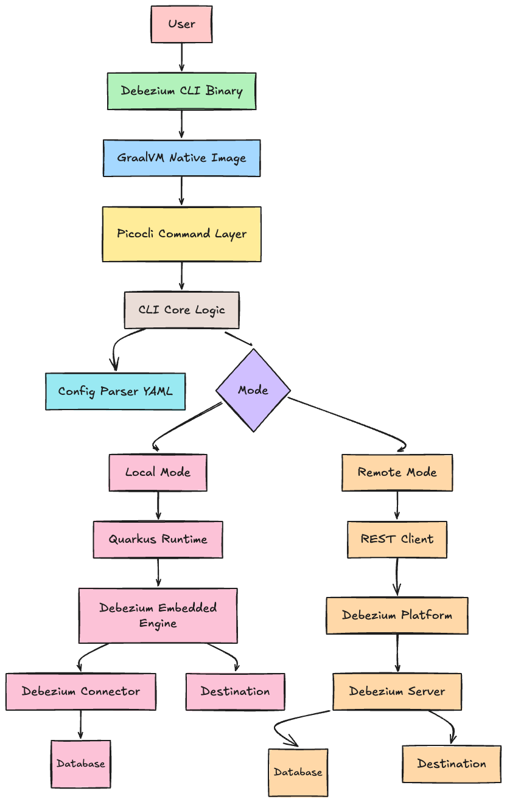

# Debezium: Debezium CLI

**Project Size**: 350 hours

## About me

**Name**: Divyansh Agrawal (GitHub: [div-dev123](https://github.com/div-dev123))  
**University**: Vellore Institute of Technology, Chennai  
**Program**: B-Tech Computer Science Engineering  
**Year**: 3rd Year  
**Expected Graduation**: June 2027  

**Contact info**:  
- **Email**: divyanshagra18@gmail.com  
- **Phone**: +91 9900708571  
- **LinkedIn**: [divyansh-agrawal](https://www.linkedin.com/in/divyansh-agrawal-28213a213/)  

**Time zone**: IST (UTC +5:30)  

**Zulip Introduction**: [Divyansh - Debezium CLI](https://debezium.zulipchat.com/#narrow/channel/573881-community-gsoc/topic/Divyansh.20-.20Debezium.20CLI/with/579742626)  

---

## Code Contribution

I have been actively contributing to Debezium to better understand the codebase, standard practices, and the community.

- [PR #7161](https://github.com/debezium/debezium/pull/7161) - **DecimalHandlingMode Integration Tests**: Added integration tests for NUMERIC and DECIMAL columns.
- [PR #7166](https://github.com/debezium/debezium/pull/7166) - **Git DCO Documentation**: Added Git DCO commit sign-off instructions to the documentation.
- [PR #7169](https://github.com/debezium/debezium/pull/7169) - **Postgres Incremental Snapshots Fix**: Resolved a NullPointerException in SchemaChangeEvent for Postgres incremental snapshots.
- [PR #7173](https://github.com/debezium/debezium/pull/7173) - **PR Template**: Added a comprehensive `PULL_REQUEST_TEMPLATE.md` to the repository.
- [PR #7195](https://github.com/debezium/debezium/pull/7195) - **Enum Validation Fix**: Fixed Enum validation for connector configuration in SMTs.

---

## Project Information

### Abstract

Debezium is a powerful CDC platform, but getting started with it can be complex. Users often need to manually configure Kafka, connectors, and multiple services before they can see their first change event. 

This project proposes the **Debezium CLI**, a standalone, developer-friendly tool that simplifies the process of creating, running, and monitoring CDC pipelines. The project's primary focus is to deliver a **"Local-First" experience**, enabling users to run CDC pipelines locally using Debezium’s existing runtime capabilities without requiring a Kafka cluster.

As a secondary goal, the CLI will integrate with the **Debezium Management Platform** to manage distributed production pipelines, providing a consistent declarative workflow across both local and remote environments.

Unlike approaches that require building and deploying container images or managing external infrastructure, this CLI focuses on a local-first execution model, allowing developers to run CDC pipelines instantly with minimal setup.

---

### Why this project?

While exploring Debezium, I realized that even simple CDC use cases require significant setup (Kafka, connectors, and multiple services). During my experiments with JBang templates, I also faced practical issues such as port conflicts and having to manually orchestrate different tools.

These experiences made me feel that there is room for a simpler interface - something similar to tools like Docker or Git, where a few commands are enough to get started.

I am particularly interested in improving **Developer Experience (DX)** and building tools that reduce complexity for developers. While I am still building deeper experience in Java frameworks like Quarkus and technologies like GraalVM, I have a strong foundation in programming and have been actively contributing to Debezium to understand its internals.

This project is an opportunity for me to both contribute meaningfully to an open-source ecosystem and deepen my understanding of systems like CDC pipelines, distributed data flow, and developer tooling.

---

# Technical Description

The Debezium CLI is designed as an orchestration and interaction layer on top of existing Debezium components. Instead of reimplementing CDC functionality, it focuses on improving developer experience by simplifying how pipelines are created, executed, and managed.

The CLI is built using **Picocli** for command handling and **Quarkus** as the runtime foundation. Quarkus plays a central role, especially in Local Mode, where it is used to run Debezium pipelines via its existing extensions.

---

## 1. Declarative Configuration (GitOps-style Workflow)

Instead of requiring users to write low-level connector configurations, the CLI introduces a declarative YAML format inspired by the Debezium Platform's domain model.

```yaml
connection:
  name: my-postgres
  type: postgres
  config:
    hostname: localhost
    port: 5432
    username: debezium
    password: dbz
    database: inventory

source:
  name: inventory-source
  type: postgres
  table.include.list: inventory
  connection: my-postgres

destination:
  name: kafka-dest
  type: kafka
  config:
    bootstrap.servers: localhost:9092

pipeline:
  name: inventory-pipeline
  source: inventory-source
  destination: kafka-dest
```

Users can then apply this configuration using:

```
debezium apply pipeline.yaml
```

This approach allows pipelines to be version-controlled, reused, and shared easily.

---

## 2. Architecture Overview



At a high level, the CLI reads the YAML configuration and decides how to execute it based on the user’s setup. 
Depending on whether the user wants a local setup or is working with an existing deployment, it switches between two execution modes.

### A. Local / Embedded Mode (`--local`) - Primary Focus

This is the main focus of the project and targets local development and rapid experimentation.

**Core idea**: Run CDC pipelines locally without requiring external infrastructure like Kafka.

**How it works:**

Internally, the CLI maps the parsed YAML configuration into Quarkus configuration properties (`quarkus.debezium.*`). 
These properties are injected into the Quarkus runtime using the `ConfigProvider` before starting the embedded Debezium Engine.

The execution flow for `debezium apply --local` is:
`YAML -> Parsed Model -> Config Mapper -> Quarkus Config -> Embedded Engine Start`

**Execution:**

- A local runtime (based on Quarkus) is started
- Debezium connectors (Postgres, MySQL, MongoDB, etc.) are loaded via extensions
- CDC events are captured and routed to configured destinations (file, logs, or optional Kafka)

The Debezium Engine is then executed in a managed thread, allowing the CLI to control its lifecycle (start, stop, logs).

**Local Pipeline Manager:**

In Local Mode, the CLI maintains a lightweight process manager to track running pipelines. Each pipeline is assigned an ID and stored in a local state file (`~/.debezium/pipelines.json`).

This enables commands like:
- `debezium pipeline stop <name>`
- `debezium pipeline status <name>`
- `debezium pipeline logs <name>`

Internally, each pipeline runs in a separate thread or process, allowing multiple pipelines to run concurrently.

**Key point:**
This mode reuses the existing Quarkus + Debezium integration, rather than building a new execution engine.

---

### B. Remote / Platform Mode (`--platform <url>`) - Secondary

In cases where users are already running the Debezium Platform, the CLI acts more like a client rather than running anything itself.

**Core idea**: Provide a CLI alternative to the Platform UI

**How it works:**

- The CLI acts as a REST client
- Sends pipeline definitions to the platform backend (Conductor)
- The platform manages execution using Debezium Server instances

**Execution flow:**

```
CLI -> REST API -> Platform -> Debezium Server -> Pipeline execution
```

---

## 3. CLI Commands and Developer Experience (DX)

The CLI is designed to follow simple and familiar command patterns:

- **`debezium quickstart`**  
  Bootstraps a new CDC project with minimal setup

- **`debezium init <template>`**  
  Generates ready-made configs for common use cases (e.g., `postgres-file`, `mysql-kafka`)

- **`debezium apply -f <file.yaml>`**  
  Creates or updates a pipeline declaratively

- **`debezium validate <file.yaml>`**  
  Validates pipeline configurations to catch missing fields or invalid configs early, preventing runtime failures

- **`debezium pipeline start/stop <name>`**  
  Controls pipeline execution

- **`debezium pipeline status <name>`**  
  Displays pipeline state (running/stopped) and basic execution statistics

- **`debezium pipeline logs <name> --follow`**  
  Streams logs (local or remote)

- **`debezium connection test`**  
  Validates database connectivity before running pipelines

---

## 4. Role of Quarkus and GraalVM

### Quarkus

- Quarkus essentially acts as the runtime that makes local execution possible without needing a full external setup.
- Enables integration via Debezium extensions
- Handles configuration, lifecycle, and dependency management

### GraalVM

- Used to compile the CLI into a native binary
- Provides fast startup and low memory usage
- Improves usability by removing the need for a JVM at runtime

---

## 5. Technical Challenges

- **Native Image Constraints**  
  Since GraalVM uses closed-world analysis, dynamically loaded connectors and reflection-heavy frameworks (like Jackson and Debezium internals) require explicit configuration. Identifying and registering these classes correctly is essential to avoid runtime failures in the native binary.

- **Configuration Translation Layer**  
  The CLI must reliably map user-friendly YAML into low-level Debezium and Quarkus configuration properties. Ensuring correctness, completeness, and compatibility across connectors is a key challenge.

- **Local Pipeline Lifecycle Management**  
  Running multiple CDC pipelines locally requires managing execution threads, tracking state, and ensuring proper cleanup. Handling crashes, restarts, and log streaming in a CLI environment introduces additional complexity.

- **Environment & Resource Conflicts**  
  Since pipelines run locally, conflicts such as port usage, database locks, or connector misconfiguration must be detected early and handled gracefully.

- **Platform API Alignment**  
  The CLI must remain compatible with evolving Debezium Platform APIs, requiring careful abstraction and validation of request/response structures.

---

## Roadmap

---

### **Phase 0: Contribution and Preparation (April 1 - May 1)**

- Continue contributing to Debezium to understand the codebase  
- Explore Debezium Quarkus Extensions and example pipelines  
- Learn core technologies: Picocli, Quarkus, GraalVM  

---

### **Phase 1: Foundation and Local Mode (Core Deliverable)**

#### **Community Bonding (May 1 - May 24)**  
- Finalize YAML schema and CLI command structure  
- Study Debezium Quarkus Extensions and execution model  
- Understand differences between Debezium Server and Embedded Engine  
- Setup project structure (Quarkus + Picocli + build tooling)  
- Discuss and refine design decisions with mentors 
- Additionally Study the debezium-server-dist-builder by Ondrej Babec

---

#### **Week 1 (May 25 - May 31)** - 30 hours
- Scaffold CLI using Picocli  
- Implement base command structure (`apply`, `pipeline`, etc.)  
- Implement YAML parsing into internal models  

**Outcome**:  
CLI can parse a YAML file and print structured pipeline configuration  

---

#### **Week 2 (June 1 - June 7)** - 30 hours
- Integrate Debezium via Quarkus extensions  
- Build configuration translator (YAML → Quarkus config)  
- Prototype basic pipeline execution  

**Outcome**:  
CLI can generate valid Quarkus configuration for a pipeline  

---

#### **Week 3 (June 8 - June 14)** - 30 hours
- Implement `debezium apply --local` for PostgreSQL  
- Start embedded Debezium Engine via Quarkus  
- Validate CDC event capture  

**Outcome**:  
Working local CDC pipeline (Postgres → logs/file)  

---

#### **Week 4 (June 15 - June 21)** - 30 hours
- Extend Local Mode to MySQL and MongoDB  
- Add lifecycle commands:  
  - `pipeline stop`  
  - `pipeline logs`  

**Outcome**:  
Multiple connectors supported with basic lifecycle control  

---

#### **Week 5 (June 22 - June 28)** - 25 hours
- Improve reliability (error handling, config validation)  
- Handle common issues (port conflicts, invalid configs)  
- Generate GraalVM native binary  

**Outcome**:  
Stable CLI with native executable and improved UX  

---

#### **Week 6 (June 29 - July 5)** - 25 hours
- Implement REST client for Debezium Platform APIs  
- Add support for `connection test` via platform  

**Outcome**:  
CLI can communicate with Debezium Platform and validate connections  

---

### **Midterm Milestone (Evaluation July 6)**

- Local CDC pipelines fully functional  
- Native CLI binary available  
- Basic commands implemented (`apply`, `logs`, `stop`)  
- Initial integration with Debezium Platform APIs  

---

### **Phase 2: Remote Mode and UX Improvements**

#### **Week 7 (July 6 - July 12)** - 30 hours
- Implement `debezium apply --platform <url>`  
- Support creation of core resources (Connection, Source, Destination, Pipeline)  

**Outcome**:  
CLI can deploy pipelines to Debezium Platform  

---

#### **Week 8 (July 13 - July 19)** - 30 hours
- Add pipeline management features:  
  - **`debezium pipeline status`**: View pipeline state and basic runtime information
  - **`debezium pipeline stop`**

**Outcome**:  
Basic remote pipeline lifecycle management and status monitoring  

---

#### **Week 9 (July 20 - July 26)** - 30 hours
- Implement log streaming (basic version)  
- Improve CLI output formatting  

**Outcome**:  
Users can monitor pipelines via CLI  

---

#### **Week 10 (July 27 - August 2)** - 30 hours
- Add config validation using platform catalog  
- Improve error messages  

**Outcome**:  
Better validation and user feedback  

---

#### **Week 11 (August 3 - August 9)** - 30 hours
- Testing (unit + integration with Testcontainers)  
- Documentation and usage examples  
- Bug fixes and polish  

**Outcome**:  
Production-ready CLI with documentation  

---

#### **Final Week (August 10 - August 16)** - 30 hours
- Final improvements and cleanup  
- Submission and documentation completion  

---

### **Stretch Goals**

1. **Interactive Quickstart Wizard**  
   - `debezium quickstart` with guided YAML generation  

2. **WebSocket Log Streaming**  
   - Real-time logs from remote platform  

3. **CLI Distribution and Packaging**  
   - Native binaries for macOS, Linux, and Windows  
   - Installation via package managers (e.g., Homebrew)  

4. **Dry Run Mode**  
   - Preview pipeline execution without running it via `debezium apply --dry-run` 
   - Display resolved configuration and execution plan  

5. **Pipeline Templates**  
   - Predefined templates for common CDC use cases  
   - Provide a quick bootstrap path with `debezium init`
---

## Other commitments

I have my university end semester exams till 8th May so I will be able to actively start working from 9th May. To make up for missing a part of community bonding period I will give extra hours for the rest of the bonding time.

Other than that, GSOC squarely falls during my summer break and as such I do not have any other commitments that would interfere with my work on this project. Aside from a day or two off biweekly for personal reasons I will be fully available and responsive during the GSOC period.

During my break I can easily give upto 35-40 hours a week to the project. My university begins from mid July and hence after that the time per week might reduce to 20-25 hours. Therefor I will make sure most of my work is finished before the planned schedule to make up for the reduced hours.

## Appendix

1. [Debezium Server Dist Builder](https://github.com/obabec/debezium-server-dist-builder)
