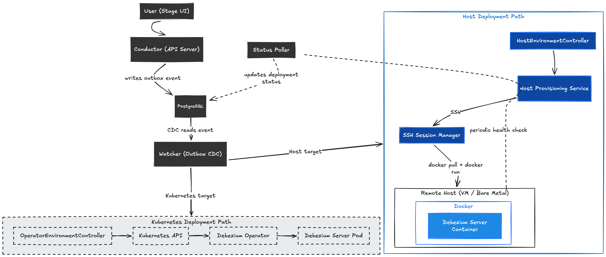

# Debezium: Host-Based Pipeline Deployment for the Debezium Platform 

**Sub-org:** Debezium  
**Organization:** JBoss Community by RedHat  
**Program:** Google Summer of Code 2026  
**Project size:** 350 hours  
**Skill level:** Intermediate  

---
## Introduction

**My Zulip Introduction:** [#community-gsoc > newcomers](https://debezium.zulipchat.com/#narrow/channel/573881-community-gsoc/topic/newcomers/near/576529788)

## About Me
 
**Name:** Gm Aravind (Github: [gmarav05](https://github.com/gmarav05) )<br>

**University:** Neil Gogte Institute of Technology, Hyderabad, India.  
**Program**: Bachelor of Engineering in Computer Science Engineering.<br>
**Year**: 4th Year <br>
**Expected Graduation Date**: June 2026 <br>

**Contact info**:
- **Email**: gmarav005@gmail.com
- **Phone no:** +91 9618391446

**Time zone**: IST Asia/Kolkata (UTC +5:30)
  

---

## Code Contribution

I have been actively contributing to Debezium across multiple repositories 
to understand the codebase, community practices and CDC internals.

My contributions to debezium-platform are especially relevant like building connection validators gave me experience with the Conductor architecture, Quarkus patterns and integration testing approach that this project builds on.

| S.No. | PR / Issue | Repository | Description | Status |
|-------|-----------|------------|-------------|--------|
| 1 | [#273](https://github.com/debezium/debezium-platform/pull/273) | debezium/debezium-platform | Added RabbitMQ connection validator with SSL and timeout support | Merged |
| 2 | [#287](https://github.com/debezium/debezium-platform/pull/287) | debezium/debezium-platform | Added NATS Streaming connection validator | Merged |
| 3 | [#280](https://github.com/debezium/debezium-platform/pull/280) | debezium/debezium-platform | Added Qdrant Sink connection validator with integration test | Merged |
| 4 | [#7122](https://github.com/debezium/debezium/pull/7122) | debezium/debezium | Added default value for OpenLineage job description | Merged |
| 5 | [#7165](https://github.com/debezium/debezium/pull/7165) | debezium/debezium | Replaced divisive terminology (blacklist/whitelist) in tests | Merged |
| 6 | [#7167](https://github.com/debezium/debezium/pull/7167) | debezium/debezium | Enforced spaces over tabs in XML files via Checkstyle rule | Merged |
| 7 | [#7144](https://github.com/debezium/debezium/pull/7144) | debezium/debezium | Updated MongoDB connector with active connection validation | Partially Merged |
| 8 | [#7227](https://github.com/debezium/debezium/pull/7227) | debezium/debezium | Updated CONTRIBUTING.md to use ./mvnw for reproducibility | Merged |
| 9 | [#398](https://github.com/debezium/debezium-examples/pull/398) | debezium/debezium-examples | Extracted Apicurio Registry into standalone example, upgraded to Debezium 3.4 | Merged |
| 10 | [#88](https://github.com/debezium/debezium-connector-ibmi/pull/88) | debezium/debezium-connector-ibmi | Fixed tab indentation in XML config files | Merged |
| 11 | [#256](https://github.com/debezium/debezium-server/pull/256) | debezium/debezium-server | Fixed tab indentation in server distribution XML | Merged |
| 12 | [#472](https://github.com/debezium/dbz/issues/472) | debezium/debezium | Investigated separate constant class establishment | Investigation - Closed |

---

## Project Information

### Abstract

The Debezium Platform currently supports deploying CDC pipelines only on Kubernetes through the Debezium Operator. But, many teams run their infrastructure on plain Linux servers, virtual machines or cloud instances where Kubernetes is not available. This project extends the Platform to deploy Debezium Server on these non-Kubernetes environments using SSH and Docker.

The main idea is to add a new deployment backend a `HostEnvironmentController` that plugs into the Platform's existing architecture alongside the Kubernetes controller. So, When a user creates a pipeline and points it at a registered remote host the Platform connects over SSH, prepares the host where it checks for Docker, permissions, disk space and deploys a Debezium Server container with the right configuration. The Platform then manages the full lifecycle like deploy, update, stop, and remove all from the same UI and API that already exists for Kubernetes deployments.

So, This enables teams to use the Debezium Platform regardless of whether they run Kubernetes or not and even mix both in the same setup.


## Why this project?

My contributions to `debezium-platform` like connection validators, integration tests gave me a solid understanding of the Conductor architecture and Quarkus patterns. I also enjoy working with Java, Docker, SSH and system-level tooling and this project felt like a next step.

The problem is clear the Debezium Platform works well on Kubernetes. But, many teams also don't use Kubernetes. Their databases run on plain Linux servers, VMs or cloud instances. Right now, these teams cannot use the Platform at all. This project fills that gap by adding SSH and Docker-based deployment alongside the existing Kubernetes path.

The Platform already has a clean `EnvironmentController` interface designed for this kind of extension. Building a new implementation that fits into an existing architecture is what I enjoy most.


### Technical Description

#### 1. Understanding the Existing Architecture

The Debezium Platform has two main components: the **Conductor** (backend REST API built with Quarkus) and the **Stage** (React frontend). For this project, we work inside the Conductor.

The Conductor uses an event-driven deployment flow:

1. A user creates a pipeline through the REST API.
2. The pipeline is saved to PostgreSQL, and an event is written to an outbox table.
3. The **Watcher** (an embedded Debezium Engine inside the Conductor) picks up that event via CDC.
4. The Watcher delegates the deployment to an `EnvironmentController`.

Today, the only `EnvironmentController` implementation is `OperatorEnvironmentController`, which deploys to Kubernetes using the Debezium Operator.

The key interfaces are:

```java
public interface EnvironmentController {
    PipelineController pipelines();
    VaultController vaults();
}

public interface PipelineController {
    void deploy(PipelineFlat pipeline);
    void undeploy(Long id);
    void stop(Long id);
    void start(Long id);
    LogReader logReader(Long id);
    void sendSignal(Long pipelineId, Signal signal);
}
```

The pipeline model is already environment-agnostic it has no mention of Kubernetes or Docker. This means I only need to add a second `EnvironmentController` implementation without changing the pipeline model or the event flow.



*Figure 1: Debezium Platform architecture showing the existing Kubernetes deployment path (dashed) and the new Host-Based deployment path (blue)*

#### 2. Design Decisions from Mentor Discussions

These decisions were made after discussing with mentors Mario Fiore Vitale and Giovanni Panice on `#community-gsoc` Zulip:

- **Docker-first approach** — Mario confirmed that for the GSoC timeline, the focus should be on containerized deployment. Supporting standalone Debezium Server JAR can be a long-term goal after GSoC.

- **Extend existing architecture** — When I asked whether to create new REST endpoints or extend existing ones, Mario pointed me to the Platform codebase. After studying it, I found the `EnvironmentController` interface which is already designed for adding new deployment backends. This confirmed that my approach (implementing a new `HostEnvironmentController`) fits the existing architecture.

- **Reviewed the AMA** — Giovanni recommended reviewing the AMA session first. From it, I understood that the backend is a Quarkus app with REST endpoints and the project focuses on Docker + SSH for host-based deployments.

Community discussion: [#community-gsoc > GM - Host-Based Pipeline Deployment for the Debezium Platfor](https://debezium.zulipchat.com/#narrow/channel/573881-community-gsoc/topic/GM.20-.20Host-Based.20Pipeline.20Deployment.20for.20the.20Debezium.20Platfor/with/582238948)


#### 3. What I'm Adding — Component Overview

This project adds five components to the Conductor:

1. **HostEnvironmentController** — A new `EnvironmentController` implementation that handles host-based deployments. It plugs into the existing event flow alongside the Kubernetes controller.

2. **SSH Layer** — An SSH client using Apache MINA SSHD that connects to remote hosts, runs commands and uploads configuration files via SFTP.

3. **Host Provisioning Service** — It Runs automated checks on a remote host like  Is Docker installed?, Are permissions correct?, Do we have Disk space? and fixes issues where possible.

4. **Docker Deployment Engine** — Generates `application.properties` from the pipeline config, uploads it to the remote host and runs Debezium Server as a Docker container.

5. **Host Management REST API** — New endpoints (`/api/hosts`) for registering, provisioning and managing remote hosts as deployment targets.

Additionally, I will also add a **Status Poller** that periodically checks if deployed containers are still running, since bare-metal hosts don't have Kubernetes-style watch mechanisms.

#### 4. SSH Layer — Secure Remote Access

To deploy on a remote host, the Platform needs to connect to it, run commands, and upload files. I will use [Apache MINA SSHD](https://mina.apache.org/sshd-project/) as the SSH client library Because It is actively maintained, supports modern key types (Ed25519) and has a clean async API.

##### 4.1 SSH Session Manager

This class manages all SSH connections. It creates the SSH client once at startup and reuses it for all connections:

```java
@ApplicationScoped
public class SshSessionManager {

    private SshClient client;

    @PostConstruct
    void init() {
        this.client = SshClient.setUpDefaultClient();
        this.client.start();
    }

    public SshSession openSession(SshConnectionConfig config) {
        ConnectFuture future = client.connect(
            config.getUsername(), config.getHost(), config.getPort()
        );
        ClientSession session = future.verify(CONNECT_TIMEOUT).getSession();

        if (config.hasPrivateKey()) {
            session.addPublicKeyIdentity(loadKeyPair(config.getPrivateKeyRef()));
        } else {
            session.addPasswordIdentity(config.getPassword());
        }
        session.auth().verify(AUTH_TIMEOUT);
        return new SshSession(session);
    }

    @PreDestroy
    void shutdown() {
        if (client != null) client.stop();
    }
}
```

#### 5. Host Provisioning — Preparing the Remote Host

When a user registers a new remote host, the Platform needs to check if that host is ready to run Debezium Server. This is what the provisioning service does. It runs a series of checks over SSH and tries to fix problems automatically.

##### 5.1 How It Works

Each check follows a simple pattern run a command, check the result, fix it if possible:

```java
public interface ProvisioningCheck {
    String name();
    CheckResult run(SshSession session);
    boolean canRemediate();
    void remediate(SshSession session);
}
```

##### 5.2 The Checks 

| # | Check | What It Does | How It Fixes |
|---|-------|-------------|--------------|
| 1 | **Connectivity** | Runs `echo health-check` to verify SSH works | Cannot fix — fails immediately if SSH is broken |
| 2 | **Docker Installed** | Runs `docker version` to check if Docker exists | Installs Docker using `apt-get` or `yum` based on the OS |
| 3 | **Docker Running** | Runs `systemctl is-active docker` | Starts Docker with `systemctl start docker` |
| 4 | **User Permissions** | Runs `groups` to check if user is in the `docker` group | Runs `sudo usermod -aG docker $USER` |
| 5 | **Port Available** | Runs `ss -tlnp \| grep :8080` to check if the port is free | Cannot fix — tells the user which process is using the port |
| 6 | **Disk Space** | Runs `df -h /` to check available space | Cannot fix — warns the user if less than 2GB is available |

##### 5.3 Provisioning Report

After all checks run a report is saved to the database and returned through the API:

```java
public class ProvisioningReport {
    private HostTarget host;
    private ProvisioningStatus status;  // READY, PARTIAL, FAILED
    private List<CheckResult> checkResults;
    private Instant timestamp;
}

```

#### 6. Docker Deployment Engine — Running Debezium Server

This is the core of the project. Once a host is provisioned and SSH is working this component handles the actual deployment lifecycle to deploy, update, stop and remove.

##### 6.1 Deploy Flow

When the Watcher picks up a new pipeline event and routes it to `HostPipelineController.deploy()`, here's what happens step by step:

**Step 1 — Generate config:** A `HostPipelineMapper` converts the pipeline definition into an `application.properties` file that Debezium Server expects:

```properties
debezium.source.connector.class=io.debezium.connector.postgresql.PostgresConnector
debezium.source.database.hostname=10.0.0.5
debezium.source.database.port=5432
debezium.source.database.user=debezium
debezium.source.database.dbname=inventory
debezium.sink.type=kafka
debezium.sink.kafka.producer.bootstrap.servers=kafka:9092
```

**Step 2 — Upload config:** The config file is uploaded via SFTP to `/opt/debezium/pipelines/{pipelineId}/application.properties` on the remote host.

**Step 3** — Pull image: Runs docker pull quay.io/debezium/server:{version} over SSH.

**Step 4** — Start container: Runs the following over SSH:

```
docker run -d \
  --name debezium-pipeline-{pipelineId} \
  --restart unless-stopped \
  -v /opt/debezium/pipelines/{pipelineId}:/debezium/conf \
  -p 8080:8080 \
  quay.io/debezium/server:{version}
```

**Step 5** — Verify: Runs docker inspect to check the container is running. If it failed, fetches the last 50 log lines with docker logs so the user gets a clear error message.

##### 6.2 Update Flow
The deploy() method is idempotent. if a container already exists for this pipeline it updates instead of creating a new one:

Generate new application.properties.
Upload it via SFTP and overwrite the old file.
Restart the container: docker restart debezium-pipeline-{pipelineId}.
Verify it is running.

##### 6.3 Stop and Remove
Stop: docker stop debezium-pipeline-{pipelineId}
Remove: docker rm debezium-pipeline-{pipelineId} + rm -rf /opt/debezium/pipelines/{pipelineId}

##### 6.4 Status Polling
Since bare-metal hosts do not have Kubernetes-style watch mechanisms, I will add a HostDeploymentStatusPoller that checks all active deployments every 30 seconds:

```
@ApplicationScoped
public class HostDeploymentStatusPoller {

    @Scheduled(every = "30s")
    void pollHostDeployments() {
        // For each active deployment:
        // SSH in run docker inspect -> update status in database
        // Possible statuses: RUNNING, STOPPED, EXITED, NOT_FOUND
    }
}
```
#### 7. Data Model — New Database Entities

I will add two new tables to the Platform's PostgreSQL database, following the same JPA patterns used by existing entities like `PipelineEntity` and `VaultEntity`.

##### 7.1 HostTarget — A registered remote host

This stores the information about each remote server the user registers:

```java
@Entity(name = "host_target")
public class HostTargetEntity {
    @Id @GeneratedValue
    private Long id;

    @Column(unique = true, nullable = false)
    private String name;               // e.g. "production-server-1"

    private String description;

    @Column(nullable = false)
    private String hostname;            // e.g. "192.168.1.100"

    private int port = 22;              // SSH port, default 22

    @Column(nullable = false)
    private String username;            // SSH username

    @Enumerated(EnumType.STRING)
    private AuthType authType;          // SSH_KEY or PASSWORD

    @ManyToOne
    private VaultEntity credential;     // References existing Vault system

    @Enumerated(EnumType.STRING)
    private ProvisioningStatus provisioningStatus;  // READY, PARTIAL, FAILED
}
```
##### 7.2 HostDeployment — A pipeline running on a host
This tracks each Debezium Server container deployed on a remote host:

```
@Entity(name = "host_deployment")
public class HostDeploymentEntity {
    @Id @GeneratedValue
    private Long id;

    @ManyToOne
    private PipelineEntity pipeline;     // Which pipeline

    @ManyToOne
    private HostTargetEntity hostTarget; // Which host

    private String containerName;        // e.g. "debezium-pipeline-42"
    private String imageVersion;         // e.g. "2.5"

    @Enumerated(EnumType.STRING)
    private DeploymentStatus status;     // DEPLOYING, RUNNING, STOPPED, FAILED, CONFIG_DRIFT

    private String configHash;           // SHA-256 of applied config
}
```

##### 7.3 Database Migration
I will add a Flyway migration file (V3.5.0__add_host_deployment.sql) following the existing naming convention to create these tables with proper foreign keys and sequences.

Key design decision: SSH credentials are stored using the existing VaultEntity rather than creating a new secret storage system. This will keep credential management consistent across the Platform.

#### 8. REST API — Host Management Endpoints

The existing `PipelineResource` already handles pipeline CRUD and deployment is triggered automatically through the outbox event flow. I do not need separate deploy/undeploy endpoints.

What I need to add is a new `HostTargetResource` for managing remote hosts as deployment targets. It follows the same patterns as existing resources like `VaultResource` and `SourceResource`:

##### 8.1 Host Management Endpoints

| Method | Endpoint | Description |
|--------|----------|-------------|
| `POST` | `/api/hosts` | Register a new host and trigger provisioning |
| `GET` | `/api/hosts` | List all registered hosts |
| `GET` | `/api/hosts/{id}` | Get host details with provisioning status |
| `DELETE` | `/api/hosts/{id}` | Remove a host registration |
| `POST` | `/api/hosts/{id}/provisioning` | Re-run provisioning checks |
| `GET` | `/api/hosts/{id}/provisioning` | Get the latest provisioning report |

##### 8.2 Pipeline-Host Association

To link a pipeline to a remote host, I will add a sub-endpoint on the existing pipeline path:

| Method | Endpoint | Description |
|--------|----------|-------------|
| `POST` | `/api/pipelines/{id}/host` | Associate pipeline with a host target |
| `DELETE` | `/api/pipelines/{id}/host` | Remove host association |

Once a pipeline is associated with a host, the routing logic in `PipelineService` sends future deploy events to `HostPipelineController` instead of `OperatorPipelineController`.

##### 8.3 Logs (No New Endpoint Needed)

The existing `GET /api/pipelines/{id}/logs` endpoint already works for host deployments because it delegates through `EnvironmentController.pipelines().logReader()`. My `HostPipelineController` implements this by running `docker logs` over SSH.

#### 9. Key Technical Decisions

| Decision | Why | Tradeoff |
|----------|-----|----------|
| **Apache MINA SSHD** over JSch | Actively maintained, supports Ed25519 keys, built-in SFTP | Slightly larger dependency |
| **Docker** over standalone JAR | Same container runs identically on any host, easy cleanup with `docker rm` | Requires Docker installed on the host |
| **Vault integration** for SSH credentials | Reuses existing Platform secret management, no new storage mechanism | Tied to Platform's Vault system |
| **SHA-256 config hash** for drift detection | Lightweight check, catches manual changes on the server | Only detects config file changes, not runtime state |
| **30s polling** for status checks | Good balance between responsiveness and SSH overhead | Not real-time like Kubernetes watch events |
| **Quarkus-native patterns** (CDI, constructor injection) | Matches existing codebase exactly, no friction | Must follow Quarkus conventions strictly |

#### 10. Testing Strategy

- **Unit tests** — Test `HostPipelineMapper` (config generation), `DockerCommandBuilder` (command formatting), and routing logic (`EnvironmentController` dispatch) using mocks.

- **Integration tests** — Use Testcontainers with an OpenSSH server container to test real SSH connections, SFTP file uploads, and Docker command execution. Use Docker-in-Docker for end-to-end deployment tests.

- **API tests** — Use REST-assured (already in the project) to test all `/api/hosts` endpoints for success cases, validation errors, and 404 responses.

- **Regression tests** — Verify the existing Kubernetes deployment path (`OperatorEnvironmentController`) is completely unaffected by the new code.

#### 11. References

- [Debezium Platform Repository](https://github.com/debezium/debezium-platform)
- [Apache MINA SSHD](https://mina.apache.org/sshd-project/)
- [Debezium Server Documentation](https://debezium.io/documentation/reference/stable/operations/debezium-server.html)
- [Testcontainers](https://testcontainers.com/)
---

### Roadmap

#### Community Bonding (May 8 – June 1)

- Study the `debezium-platform-conductor` codebase end-to-end, focusing on the `environment` package.
- Trace the full event flow: `PipelineService` → outbox event → `Watcher` → `PipelineConsumer` → `EnvironmentController.pipelines().deploy()`.
- Study how `OperatorPipelineController` and `PipelineMapper` translate a pipeline into a Kubernetes deployment.
- Set up the full local development environment.
- Discuss design questions with mentors: routing logic in `PipelineService.environmentController()` and Vault integration for SSH credentials.

#### Phase 1 — Foundation (Weeks 1–5)

##### Week 1
- Create `HostEnvironmentController` implementing `EnvironmentController`, backed by `HostPipelineController` and `HostVaultController`.
- Fix the routing logic in `PipelineService.environmentController()` to dispatch to the correct controller based on the pipeline's target.
- Write unit tests for the routing logic.

##### Week 2
- Create `HostTargetEntity` and `HostDeploymentEntity` JPA entities.
- Write Flyway migration `V3.5.0__add_host_deployment.sql`.
- Add Apache MINA SSHD dependency to `pom.xml`.

##### Week 3
- Implement `SshSessionManager` and `SshSession` with command execution and SFTP file upload.
- Implement `SshConnectionConfig` for holding host, port, username and authentication details.

##### Week 4
- Write SSH integration tests using Testcontainers with an OpenSSH server container.
- Test: password auth, key auth, command execution, SFTP upload, error handling.

##### Week 5
- Implement all six `ProvisioningCheck` classes (Connectivity, Docker Installed, Docker Running, Permissions, Port, Disk Space).
- Implement `HostProvisioningService` that runs checks in order and attempts fixes.

---

#### Phase 2 — Midterm Point (Weeks 6–7)

##### Week 6
- Implement `HostTargetResource` REST endpoints (`/api/hosts`).
- Write REST-assured API tests for host registration and provisioning.
- Prepare a working demo of host registration + automated provisioning for midterm evaluation.

##### Week 7 — Midterm Evaluation
- Demo to mentors: register a host, run provisioning over SSH, show the provisioning report.
- Collect feedback on the approach before building the deployment engine.

#### Phase 2 — Deployment Engine (Weeks 8–11)

##### Week 8
- Implement `HostPipelineMapper` to generate `application.properties` from a pipeline definition.
- Implement `DockerCommandBuilder` for building docker run, stop, rm, inspect commands.
- Write unit tests for config generation and command building.

##### Week 9
- Implement `DockerDeploymentEngine` with full lifecycle: deploy, update, stop, remove.
- Wire `HostPipelineController` to use the deployment engine.
- Write integration tests using Docker-in-Docker.

##### Week 10
- Add pipeline-host association endpoints (`POST/DELETE /api/pipelines/{id}/host`).
- Implement `HostDeploymentStatusPoller` with config drift detection.
- Write tests for status polling and drift detection.

##### Week 11
- Write full end-to-end test: PostgreSQL source → register host → deploy pipeline → verify Debezium Server container is running.
- Fix any bugs found during end-to-end testing.

#### **Final Week** (Week 12)

- Add OpenAPI annotations to all new endpoints.
- Write developer documentation.
- Review all error messages for clarity.
- Submit pull request and Write final GSoC blog post summarizing the project on platforms like hashnode, dev.to and Medium.

---

## Other Commitments


I have no internships, jobs or other commitments during the GSoC period because I am in my final year of B.E in Computer Science and I am preparing for 2027 M.Tech Entrance Test.

So, I can dedicate easily **40-50 hours per week** to the project throughout the entire coding period and still have time to prepare for 2027 Test. 

I will maintain regular communication with mentors through Zulip and weekly progress updates. I have been contributing to Debezium since February 2026 and plan to continue contributing and collaborate even after the program. 

If any unexpected conflict comes up, I will inform my mentors in advance 
and adjust my schedule to stay on track with project milestones.

---

## Appendix

### Tools and Libraries

- [Apache MINA SSHD](https://mina.apache.org/sshd-project/) 
- [Testcontainers](https://testcontainers.com/) 
- [Debezium Server](https://debezium.io/documentation/reference/stable/operations/debezium-server.html)
- [Quarkus](https://quarkus.io/) 
