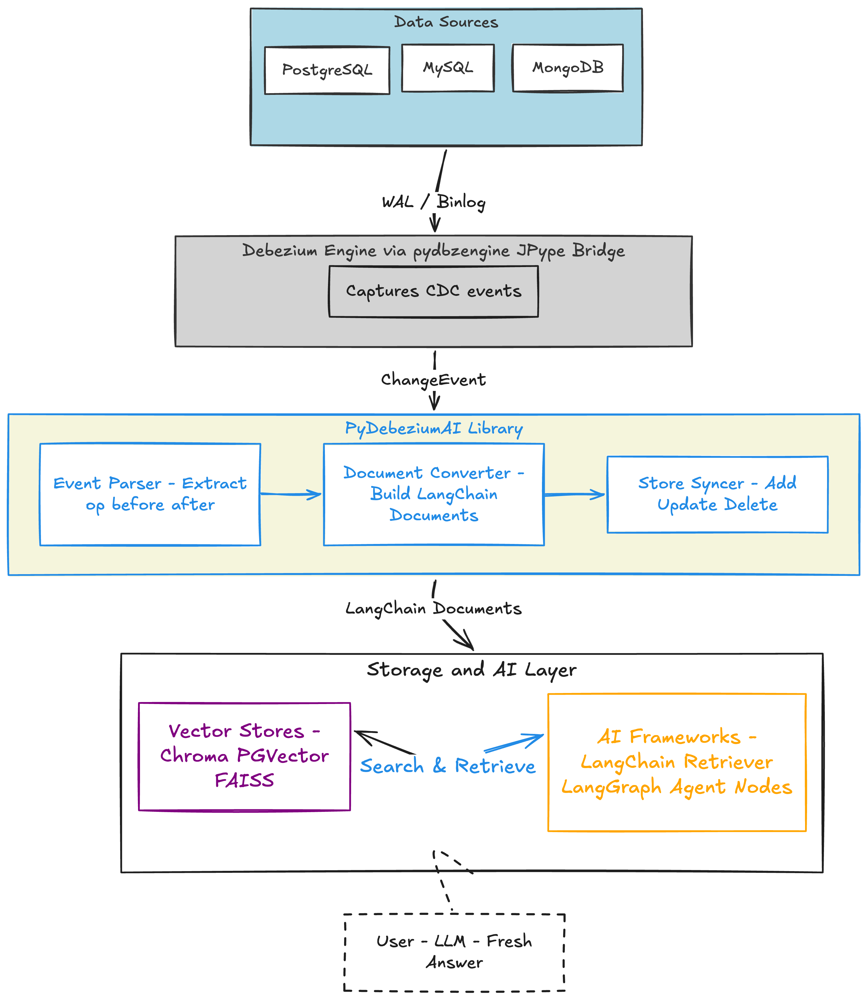

# Debezium: PyDebeziumAI

**Sub-org:** Debezium  
**Organization:** JBoss Community by RedHat  
**Program:** Google Summer of Code 2026  
**Project size:** 350 hours  
**Skill level:** Intermediate  

---
## Introduction

**My Zulip Introduction:** [#community-gsoc > newcomers](https://debezium.zulipchat.com/#narrow/channel/573881-community-gsoc/topic/newcomers/near/576529788)

## About Me
 
**Name:** Gm Aravind (Github: [gmarav05](https://github.com/gmarav05) )<br>

**University:** Neil Gogte Institute of Technology, Hyderabad, India.  
**Program**: Bachelor of Engineering in Computer Science Engineering.<br>
**Year**: 4th Year <br>
**Expected Graduation Date**: June 2026 <br>

**Contact info**:
- **Email**: gmarav005@gmail.com
- **Phone no:** +91 9618391446

**Time zone**: IST Asia/Kolkata (UTC +5:30)
  

---

## Code Contribution

I have been actively contributing to Debezium across multiple repositories 
to understand the codebase, community practices and CDC internals.

| S.No. | PR / Issue | Repository | Description | Status |
|-------|-----------|------------|-------------|--------|
| 1 | [#7122](https://github.com/debezium/debezium/pull/7122) | debezium/debezium | Added default value for OpenLineage job description | Merged |
| 2 | [#7165](https://github.com/debezium/debezium/pull/7165) | debezium/debezium | Replaced divisive terminology (blacklist/whitelist) in tests | Merged |
| 3 | [#7167](https://github.com/debezium/debezium/pull/7167) | debezium/debezium | Enforced spaces over tabs in XML files via Checkstyle rule | Merged |
| 4 | [#7144](https://github.com/debezium/debezium/pull/7144) | debezium/debezium | Updated MongoDB connector with active connection validation | Partially Merged |
| 5 | [#273](https://github.com/debezium/debezium-platform/pull/273) | debezium/debezium-platform | Added RabbitMQ connection validator with SSL and timeout support | Merged |
| 6 | [#287](https://github.com/debezium/debezium-platform/pull/287) | debezium/debezium-platform | Added NATS Streaming connection validator | Merged |
| 7 | [#280](https://github.com/debezium/debezium-platform/pull/280) | debezium/debezium-platform | Added Qdrant Sink connection validator with integration test | Merged |
| 8 | [#398](https://github.com/debezium/debezium-examples/pull/398) | debezium/debezium-examples | Extracted Apicurio Registry into standalone example, upgraded to Debezium 3.4 | Merged |
| 9 | [#88](https://github.com/debezium/debezium-connector-ibmi/pull/88) | debezium/debezium-connector-ibmi | Fixed tab indentation in XML config files | Merged |
| 10 | [#256](https://github.com/debezium/debezium-server/pull/256) | debezium/debezium-server | Fixed tab indentation in server distribution XML | Merged |
| 11 | [#7227](https://github.com/debezium/debezium/pull/7227) | debezium/debezium | Updated CONTRIBUTING.md to use ./mvnw for reproducibility | Merged |
| 12 | [#472](https://github.com/debezium/dbz/issues/472) | debezium/debezium | Investigated Establishment of some separate constant class. | Investigation - Closed |


---

## Project Information

### Abstract


Currently, When we hear AI application they are most likely using RAG (Retrieval-Augmented Generation) under the hood to pull data 
from databases and answer user questions. But they update this data periodically in every few hours or days. So, this often leads to AI giving outdated answers or info.

**PyDebeziumAI** will solve this by using Debezium CDC to detect database changes instantly and pushes them into LangChain and LangGraph, So the AI always has fresh data It is just like a live wire between your database and your AI. It builds on top of `pydbzengine`, which runs the Debezium engine inside Python via JPype.


This project will deliver:
- A published Python library.
- Full user and developer documentation.
- LangGraph node integration for agent-based workflows.
- A custom change handler that converts Debezium CDC events into LangChain 
  Documents and syncs them into vector stores in real time
- A pluggable vector store backend (Qdrant and Chroma as initial targets, 
  extendable to PGVector and others)


I have already built a working prototype PostgreSQL CDC events (INSERT, 
UPDATE, DELETE) flowing through pydbzengine into a Chroma vector store via 
LangChain Documents to test the core architecture.

## Why This Project?


My interest in AI related projects started a few months ago through Andrew Ng's DeepLearning.ai courses, after that I built web applications using 
Supabase and Chroma. Which gave me a solid foundation in how AI systems retrieve and use data.

First, I started by running `pydbzengine` locally with PostgreSQL and watching INSERT, UPDATE and DELETE events arrive like a flash. Then, I realized the power of Debezium and how it fits into AI pipeline.

I then built a 
prototype that pushes the CDC events into a Chroma vector store as 
LangChain Documents. Now, When I updated a row in Postgres, the vector store 
reflected immediately within seconds and no delay.

I have also been actively contributing to Debezium across the core project, 
platform, server, connectors, and examples. This gave me a solid 
understanding of the codebase the workflow and the community.

What excites & motivates me most is seeing the Debezium adopters page. The apps I use 
every day for food delivery, insurance and e-commerce are all on it. It 
makes the impact of this project very real and personal to me.


---

### Technical Description


#### 1. System Design Overview

PyDebeziumAI is in between Debezium which watches databases for changes
and LangChain/LangGraph which powers AI apps. It translates database 
change events into AI-ready data in real time through four layers:




#### 2. Design Decisions from Mentor Discussions

These decisions was taken by me after discussing with mentor Vojtech Juranek on 
`#community-gsoc > GM - PyDebeziumAI` Zulip:

- **Reuse pydbzengine** — I proposed using `pydbzengine` as a dependency 
  rather than building a new Java bridge.

- **Architecture validated** — I proposed the three-component design 
  (Event Parser → Document Converter → Store Syncer).

- **Pluggable vector store** — The vector store layer uses LangChain's 
  `VectorStore` abstraction, keeping the library backend-agnostic.

#### 3. Core Components

##### 3.1 CDC Event Handler (Entry Point)

This extends `pydbzengine` handler. Debezium calls `handleJsonBatch` 
every time the database changes

```python
class DebeziumLangChainHandler(BasePythonChangeHandler):
    def __init__(self, converter, syncer):
        self.converter = converter
        self.syncer = syncer
    
    def handleJsonBatch(self, records: list[ChangeEvent]):
        for record in records:
            event = EventParser.parse(record)
            if event:
                doc = self.converter.to_document(event)
                self.syncer.sync(event.op, doc, event.doc_id)
```

##### 3.2 Event Parser

This Opens the Debezium envelope and extracts the useful parts:

```python
class EventParser:
    @staticmethod
    def parse(record: ChangeEvent) -> ParsedEvent:
        payload = json.loads(str(record.value())).get("payload", {})
        source = payload.get("source", {})
        after = payload.get("after")
        before = payload.get("before")
        row = after or before
        
        return ParsedEvent(
            op=payload.get("op"),      
            before=before, after=after,
            table=source.get("table"),
            doc_id=f"{source.get('table')}:{row.get('id')}"
        )
```

##### 3.3 Document Converter
Turns a database row into a LangChain Document the AI can understand:

```python
class DocumentConverter:
    def to_document(self, event: ParsedEvent) -> Document:
        row = event.after or event.before
        content = ", ".join(f"{k}: {v}" for k, v in row.items())
        return Document(
            page_content=content,
            metadata={"table": event.table, "op": event.op},
            id=event.doc_id
        )
```

##### 3.4 Vector Store Syncer
Handles add/update/delete against any LangChain vector store:

```python
class VectorStoreSyncer:
    def sync(self, op, document, doc_id):
        if op in ("c", "r"):       # INSERT / SNAPSHOT → adds
            self.store.add_documents([document], ids=[doc_id])
        elif op == "u":            # UPDATE → replaces
            self.store.delete(ids=[doc_id])
            self.store.add_documents([document], ids=[doc_id])
        elif op == "d":            # DELETE → removes
            self.store.delete(ids=[doc_id])
```

##### 3.5 LangGraph Integration
A plug-and-play node for agent workflows:

```python
def create_live_retriever_node(vectorstore, k=5):
    retriever = vectorstore.as_retriever(search_kwargs={"k": k})
    def retrieve(state):
        state["context"] = "\n".join(
            d.page_content for d in retriever.invoke(state["query"]))
        return state
    return retrieve
```

#### 4. Developer Experience
The full setup in just a few lines:

```python
from pydebeziumai import LiveContext

ctx = LiveContext(
    debezium_config={...},
    vector_store="chroma",
    embedding_model="all-MiniLM-L6-v2"
)
ctx.start()

retriever = ctx.as_retriever()
docs = retriever.invoke("What orders are shipped?")
```

#### 5. Tradeoffs

| Decision | Benefit | Tradeoff |
|----------|---------|----------|
| Build on `pydbzengine` | Reuse proven bridge, faster dev | External dependency |
| Delete + re-insert for updates | Works with all vector stores | Extra operation per update |
| LangChain `VectorStore` abstraction | Pluggable backends | Less DB-specific control |
| Local embeddings | No API key, works offline | Slower than cloud embeddings |
| Deterministic doc IDs `table:pk` | Clean update/delete tracking | Assumes single primary key |
| Qdrant as initial target | Production-grade vector DB, mentor-recommended | Requires Qdrant server running |


#### 5.1 Testing Strategy

- **Unit tests** — Using `pytest` with mocked Debezium events (fake JSON 
  payloads) to test EventParser, DocumentConverter and VectorStoreSyncer 
  independently without needing a real database.

- **Integration tests** — Using Docker (PostgreSQL + pydbzengine) to run 
  real CDC events end-to-end and verify documents appear correctly in the 
  vector store. Same setup as my working prototype.

- **CI/CD** — GitHub Actions will run both unit and integration tests on 
  every pull request to catch regressions early.


#### 6. Example Applications

1. **E-Commerce Customer Support Bot** — A support chatbot connected to a 
   product and orders database. When an order status changes or a product 
   goes out of stock, the AI knows immediately and gives accurate answers.

2. **Healthcare Appointment Tracker** — AI assistant for a clinic where 
   doctor schedules and patient appointments change frequently. The AI 
   always knows the latest availability without manual data refresh.


#### 7. References
- [pydbzengine](https://github.com/memiiso/pydbzengine)
- [Debezium documentation](https://debezium.io/documentation/)
- [LangChain VectorStore API](https://docs.langchain.com/oss/python/integrations/vectorstores)
- [LangGraph docs](https://docs.langchain.com/oss/python/langgraph/overview)


---

### Roadmap

### **Community Bonding (May 1 - 24)**  - 40 hrs/week

- Set up project repository structure and CI/CD pipeline.
- Finalize package name and PyPI setup for `pydebeziumai`.
- Deep dive into LangChain VectorStore and Retriever internals.
- Study LangGraph node architecture for integration design.
- Align final design decisions with mentors.
- Build another small prototype for warm up.
- I should start building.

**Deliverable:** Repository ready, development environment configured, 
design doc approved.

---

#### **Phase 1** (Weeks 1–5) -  40-50 hrs/week

##### Week 1 — Project Setup and Event Parser
- Initialize `pydebeziumai` package with proper Python project structure.
- Implement `ParsedEvent` dataclass and `EventParser` class.
- Parse real Debezium CDC events (op, before, after, table, doc_id).
- Write unit tests for all event types (c, u, d, r).

**Deliverable:** Event parsing working and tested with real CDC events.

##### Week 2 — Document Converter
- Implement `DocumentConverter` with default text template.
- Add support for custom user-defined templates.
- Add metadata mapping (table, op, timestamp).
- Write unit tests for document conversion.

**Deliverable:** CDC events converting into LangChain Documents correctly.

##### Week 3 — Vector Store Syncer
- Implement `VectorStoreSyncer` with add/update/delete logic.
- Integrate with Qdrant as the first vector store backend.
- Handle edge cases (duplicate IDs, missing fields, null values).
- Write integration tests with real Qdrant instance.

**Deliverable:** End-to-end pipeline working CDC event to Document to
vector store synced.

##### Week 4 — Handler and LiveContext API
- Implement `DebeziumLangChainHandler` extending `BasePythonChangeHandler`.
- Build the `LiveContext` high-level API class.
- Add embedding model configuration (local sentence-transformers).
- Write integration tests with pydbzengine + PostgreSQL.

**Deliverable:** Full working library — `LiveContext.start()` streams 
changes into vector store automatically.

##### Week 5 — Chroma Vector Store Backend + Multi-Backend Testing
- Add Chroma as second vector store backend.
- Ensure pluggable backend switching via configuration.
- Write comprehensive test suite covering all op types on both backends (Qdrant and Chroma).
- Fix bugs found during integration testing.

**Deliverable:** Multi-backend support working. Pre-release published on 
TestPyPI.

---

#### **Phase 2** — Midterm Point (Weeks 6–11) - 40-50 hrs/week

##### Week 6 — LangGraph Integration
- Implement `create_live_retriever_node()` for LangGraph workflows.
- Build a reusable LangGraph node that provides live database context.
- Write tests for agent-based retrieval flows.

**Deliverable:** LangGraph integration working and tested.

##### Week 7 — Example App 1: E-Commerce Support Bot
- Build full example: PostgreSQL → PyDebeziumAI → Chatbot.
- Include Docker Compose setup for easy reproduction.
- Write step-by-step README for the example.

**Deliverable:** First complete, runnable example application.

##### Week 8 — Example App 2: Healthcare Appointment Tracker
- Build second example demonstrating a different use case.
- Include LangGraph agent workflow in this example.
- Write README with setup instructions.

**Deliverable:** Second example showing LangGraph integration.

##### Week 9 — Documentation
- Write quickstart guide to get running in 5 minutes.
- Write API reference documentation.
- Write architecture explanation for developers.
- Add configuration reference for all supported options.

**Deliverable:** Complete user and developer documentation.

##### Week 10 — Performance and Reliability
- Add batching support for high-throughput scenarios.
- Add error handling and retry logic for transient failures.
- Run performance benchmarks (latency from DB change to vector store update).
- Optimize hot paths based on benchmark results.

**Deliverable:** Production-ready performance with benchmarks documented.

##### Week 11 — Polish and Edge Cases
- Handle schema evolution (new columns, dropped columns).
- Add logging and observability.
- Fix all remaining bugs from testing.
- Code review and cleanup.

**Deliverable:** Library ready for stable release.

##### **Final Week** (Week 12)
- Publish package on PyPI (`pip install pydebeziumai`).
- Submit final report.
- Write final GSoC blog post summarizing the project on platforms like hashnode, dev.to and Medium.

**Deliverable:** Published library, final report and blog post.

---

### Stretch Goals

If time permits, then I would like to work on these additional features:

1. Additional vector store backends (FAISS, PGVector, Milvus, Pinecone) priority based on popularity.
2. Async processing for non-blocking event handling.
3. Schema-aware document generation (auto-detect column types).
4. Monitoring dashboard showing CDC event throughput and latency.

---

## Other Commitments


I have no internships, jobs or other commitments during the GSoC period because I am in my final year of B.E in Computer Science and I am preparing for 2027 M.Tech Entrance Test.

So, I can dedicate easily **40-50 hours per week** to the project throughout the entire coding period and still have time to prepare for 2027 Test. 

I will maintain regular communication with mentors through Zulip and weekly progress updates. I have been contributing to Debezium since February 2026 and plan to continue contributing and collaborate even after the program. 

If any unexpected conflict comes up, I will inform my mentors in advance 
and adjust my schedule to stay on track with project milestones.

---

## Appendix

### Project Links
- **Project Idea:** [PyDebeziumAI on Debezium GSoC Ideas](https://debezium.io/community/gsoc/)
- **pydbzengine Repository:** [github.com/memiiso/pydbzengine](https://github.com/memiiso/pydbzengine)
- **Debezium Project:** [debezium.io](https://debezium.io/)
- Architecture diagram: [`architecture.png`](./architecture.png)

### Mentor Conversations
- All discussions are in the public `#community-gsoc > GM - PyDebeziumAI` 
  channel on [Debezium Zulip](https://debezium.zulipchat.com/#narrow/channel/573881-community-gsoc/topic/GM.20-.20PyDebeziumAI/with/581639407)

### Prototype Work
- Working prototype: PostgreSQL CDC to pydbzengine to Chroma vector store 
  with LangChain Documents, demonstrating real-time INSERT, UPDATE, and 
  DELETE synchronization.