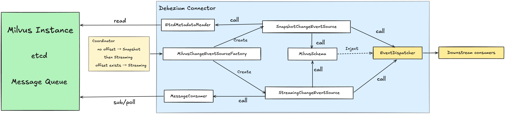
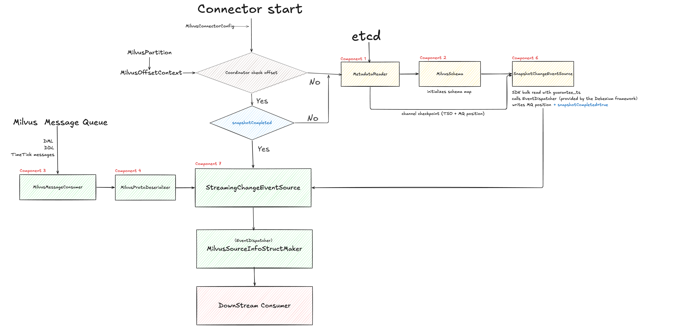

# Debezium: Milvus Source Connector for Debezium

  **Sub-org:** Debezium  
  **Organization:** JBoss Community by RedHat  
  **Program:** Google Summer of Code 2026  
  **Skill level:** Intermediate  
  **Expected Size:** 350 hours

## About Me

- **Name:** Yuang Li (Aiden Li)
- **University:** Northeastern University
- **Program:** M.S. in Computer Science
- **Expected Graduation:** December 2026
- **Email:** Yuangli971@gmail.com
- **Time Zone:** America/New_York(Eastern Standard Time)


## Code Contribution

- Contribution.
  - [add pravega connection validator](https://github.com/debezium/debezium-platform/pull/281)
  - [add Infinispan connection validator](https://github.com/debezium/debezium-platform/pull/288)
  - [Start & Stop API for the Quarkus Runtime Extension](https://github.com/debezium/debezium-quarkus/pull/33)

---

## Project Information

### Abstract

Milvus is a cloud-native vector database for high-performance similarity search. Debezium currently provides a Milvus sink connector, but not a source connector, so changes within Milvus cannot yet be captured for replication, auditing, or downstream processing.

This project proposes a Debezium source connector for Milvus 2.5, covering initial snapshot, streaming CDC, schema handling, offset management, and restart recovery. Kafka is the primary target, with Pulsar support considered as a stretch goal.

Milvus 2.5 is selected because its Kafka/Pulsar-based architecture is comparatively stable and well understood. Milvus 2.6 introduces Woodpecker and a new StreamingService layer, which significantly changes the consumption model and still appears to be evolving, so support for 2.6 is deferred as future work.

With a Milvus connector, changes in vector data can be captured and consumed in real time, allowing teams to trigger downstream workflows, keep dependent systems updated, and integrate Milvus more cleanly into existing data platforms. This is particularly useful in systems such as RAG, semantic retrieval, and recommendation pipelines, where keeping vector data fresh and synchronized is important.

## Why this project?

During a previous internship I worked with Kafka-based data pipelines, which led me to CDC and how it keeps distributed systems consistent. A big part of that was reading Jay Kreps [The Log](https://engineering.linkedin.com/distributed-systems/log-what-every-software-engineer-should-know-about-real-time-datas-unifying), the idea that an append-only log is the unifying abstraction behind databases, replication, and stream processing changed how I think about distributed systems.


What I liked most was that building this connector is essentially putting theories that I learned into practice, using Milvus's internal WAL and message queue as the source of truth, and building a reliable change stream on top of it. Figuring out why etcd and the message queue need to work together, finding the timetick mechanism for DDL/DML ordering, tracing how milvus-cdc uses etcd checkpoints as MQ seek positions. These were problems I enjoyed digging into, and they felt like a direct application of the ideas that got me interested in this space in the first place.

---

## Technical Description
### Scope

**Primary goal**: Implement a fully working Debezium source connector for Milvus 2.5 with Kafka as the message queue backend — covering initial snapshot, streaming CDC, schema handling, offset management, and restart recovery.

**Stretch goal**: Extend `MilvusMessageConsumer` with a Pulsar implementation. Since the interface is already abstracted, this is an incremental addition that does not affect the core pipeline design.

**Future work**: Woodpecker WAL support for Milvus 2.6, pending stabilization of WAL DDL support.

---

### Technical Architecture



---
### Data Flow


The flow diagram above covers the following cases:

- **Case 1**: First start (no offset) — full snapshot then streaming
- **Case 2**: Restart, schema unchanged — resume streaming from last MQ position
- **Case 3**: Restart, schema changed — resume streaming, schema updated via `CreateCollectionMsg` in MQ
- **Case 4**: Snapshot interrupted — `snapshotCompleted=false` detected on restart, full snapshot re-executed
- Additional Edge Cases see in Appendix
---
### Technical Challenges

#### Snapshot-to-streaming handoff consistency
##### Challenge:
Milvus TSO timestamps and MQ offsets are two different coordinate systems. A connector must ensure that the initial snapshot and the streaming phase meet at the same logical point, without gaps or duplicates.
##### Approach:
use the channel checkpoint stored in etcd as the anchor.
Before the bulk read, read the MQ seek position from etcd and extract the embedded TSO as `guarantee_ts` for the SDK query(Milvus's Strong consistency level), Start streaming from exactly that MQ position after snapshot completes.

**Milvus's Strong consistency level:**
when a query is issued with a guarantee_ts,the QueryNode blocks until all writes before that timestamp are visible, giving the snapshot a well-defined point-in-time view.

---

#### Schema Design: DatabaseSchema<CollectionId> vs RelationalDatabaseSchema

##### Background

Milvus has no JDBC layer, no `java.sql.Types` mapping, and no `ALTER TABLE`-style DDL. Collection schemas are recovered directly from etcd at startup, and `CreateCollectionRequest` messages in the MQ carry the full `CollectionSchema` inline. 

This creates a design choice: should `MilvusSchema` implement `DatabaseSchema<CollectionId>` directly, similar to `MongoDbSchema`, or extend `RelationalDatabaseSchema`, similar to MySQL/PostgreSQL connectors?

##### Option A: extends RelationalDatabaseSchema
**Pros**
- **More reuse:** Reuses Debezium’s existing schema infrastructure, including registry, filtering, topic naming, and `TableSchemaBuilder`.
- **Clearer conversion path:** Fits naturally with a `MilvusValueConverter implements ValueConverterProvider`, using the same `typeName()` based dispatch pattern already used in other connectors.(same pattern used in BinlogValueConverters and PostgreSQL's type registry, without requiring jdbcType() mappings)
- **Manageable adaptation:** Mapping `CollectionId` to `TableId(catalog=dbName, schema=null, table=collectionName)` is not ideal, but it is consistent with existing Debezium patterns.(MySQL/MariaDB leaves schema empty, PostgreSQL leaves catalog empty. )
  
**Cons**
- **Less native fit:** Requires an internal `CollectionId -> TableId` translation layer and exposes relational-style identifiers in topic names and logs.
- **Heavier config model:** Requires `MilvusConnectorConfig` to extend `RelationalDatabaseConnectorConfig`, bringing in JDBC-oriented behavior that must be overridden or excluded.


##### Option B: implements DatabaseSchema<CollectionId>
**Pros**
- **Native fit:** Keeps `CollectionId` as the native identifier throughout the schema layer, without translating to `TableId`, and stays closer to Milvus’s native data model.
- **Simpler pattern:** Has a clear reference in `MongoDbSchema`, with a straightforward structure centered on `schemaFor()` and a `ConcurrentHashMap<CollectionId, DataCollectionSchema>`.
- **Lighter config model:** Allows `MilvusConnectorConfig` to extend `CommonConnectorConfig` directly, without inheriting relational/JDBC-oriented configuration.
  
**Cons**
- **Less reuse:** Schema registry, filtering, topic naming, and related schema infrastructure must be implemented manually.
- **Weaker conversion path:** `TableSchemaBuilder` is not directly reusable, and the design does not provide an equally clear place for mapping Milvus types to Kafka Connect schemas.

##### Decision

The connector will start with **Option A**. 

Because Debezium is designed to handle high-volume CDC workloads, reliability and ease of debugging matter a lot. Reusing framework components that are already established in Debezium should help make the connector more reliable, and a clearer schema/conversion path should make the implementation easier to debug. 

Also, since Debezium is an open-source project, it is important that other contributors can understand the structure quickly and contribute without too much overhead. Reuse and a clear path both help reduce that cost.

The connector should fall back to Option B, if the `CollectionId -> TableId` translation becomes complex and makes the code harder to debug or making the logic harder for others to follow during the implementation.

> Related framework integration issues will be prototyped during Community Bonding before coding begins.
> `CollectionId → TableId` is an internal translation layer only， Milvus is not being modeled as a relational system. The goal is to reuse Debezium's existing event and schema pipeline.
---

### Key Components

##### Component 1: EtcdMetadataReader
Responsibility: 
  - Connects to etcd to read collection schema, vchannel names, and the current MQ channel checkpoint position. 
```java
  public class EtcdMetadataReader {

  public EtcdMetadataReader(MilvusConnectorConfig config);

  /** Reads field definitions for a given collection */
  public CollectionSchema readSchema(String collectionName)
          throws DebeziumException;

  /** Reads vchannel → topic mappings for all configured collections */
  public Map<String, String> readVchannelTopics(List<String> collections);

  /** Reads the current MQ channel checkpoint position from etcd. */
  public MilvusChannelPosition readChannelCheckpoint(String vchannel);

}
```
**Implementation notes:**
The channel checkpoint stored in etcd is a Protobuf-encoded MQ seek position containing an embedded TSO timestamp. This is the anchor used to align snapshot and streaming 
(see details in Technical Challenge 1).

---
##### Component 2: MilvusSchema
Responsibility:
- Extends `RelationalDatabaseSchema`  to maintain the current Debezium schema state for all monitored collections.
- Converts Milvus `CollectionSchema` (Protobuf format) into Debezium `Schema` (Kafka Connect format) via `MilvusValueConverter`.
- Serves as the single source of truth for collection schemas, injected into `EventDispatcher` at construction time.
```java
public class MilvusSchema extends RelationalDatabaseSchema {

    public MilvusSchema(MilvusConnectorConfig config,
                        TopicNamingStrategy topicNamingStrategy,
                        MilvusValueConverter valueConverter,
                        TableFilter tableFilter,
                        boolean tableIdCaseInsensitive);

    /** Called by snapshot and streaming sources; converts CollectionId to TableId internally */
    public void applySchemaChange(
            CollectionId collectionId,
            CollectionSchema milvusSchema,
            MilvusOffsetContext offsetContext,
            EventDispatcher<TableId> dispatcher
    ) throws InterruptedException;

    /** Removes the schema entry for a dropped collection */
    public void removeSchema(CollectionId collectionId);

    /** Internal mapping: CollectionId → TableId(catalog=dbName, schema=null, table=collectionName) */
    private TableId toTableId(CollectionId collectionId);
}

public class MilvusValueConverter implements ValueConverterProvider {
    @Override public SchemaBuilder schemaBuilder(Column column);
    @Override public ValueConverter converter(Column column, Field fieldDefn);
}
```
**Implementation notes:**
- External methods accept `CollectionId` and convert to `TableId` internally via `toTableId()`.so `CollectionId` remains the only ID type visible to the rest of the connector.
- `MilvusValueConverter` dispatches on `column.typeName()`, vector dimension and array element type are encoded in c`olumn.typeExpression()` and parsed at conversion time.
- `applySchemaChange()` accepts `EventDispatcher<TableId>` to support future schema change event emission for downstream consumers; 
- Schema change events are emitted before subsequent DML events for that collection are processed.
See [Appendix B](#appendix-b-component-2-detail) for FieldSchema to Column mapping and type map.
---
##### Component 3: MilvusConnectorConfig
Responsibility:
- Extends `RelationalDatabaseConnectorConfig` to declare and validate all user-facing configuration properties.
- Wires in `MilvusSourceInfoStructMaker` and validates MQ-type/endpoint consistency at startup.

Properties span four groups: Connection, MQ, Filters, and Snapshot. See [Appendix C](#appendix-c-milvusconnectorconfig-properties)for the full property table.
```java
public class MilvusConnectorConfig extends RelationalDatabaseConnectorConfig {

    public static final Field SOURCE_INFO_STRUCT_MAKER = CommonConnectorConfig.SOURCE_INFO_STRUCT_MAKER
            .withDefault(MilvusSourceInfoStructMaker.class.getName());

    private static final ConfigDefinition CONFIG_DEFINITION = RelationalDatabaseConnectorConfig.CONFIG_DEFINITION.edit()
            .name("Milvus")
            .type(ETCD_ENDPOINTS, MILVUS_URI, TOKEN, MQ_TYPE)
            .connector(SNAPSHOT_MODE)
            .events(SOURCE_INFO_STRUCT_MAKER)
            .create();

    public static Field.Set ALL_FIELDS = Field.setOf(CONFIG_DEFINITION.all());

    @Override
    protected SourceInfoStructMaker<? extends AbstractSourceInfo>
            getSourceInfoStructMaker(Version version) {
        return getSourceInfoStructMaker(SOURCE_INFO_STRUCT_MAKER,
                MilvusModule.name(), MilvusModule.version(), this);
    }

    // Validates that mq.type and its corresponding endpoint are both present
    private static int validateMqConfig(Configuration config,
                                         Field field,
                                         ValidationOutput problems) { ... }

    // Uses Milvus SDK health check instead of JDBC
    @Override
    protected boolean validateConnection(...) { ... }
}
```

**Implementation notes:**
`MilvusModule` is a small helper providing `name()`, `version()`, and `contextName()`, following the pattern of `io.debezium.connector.mysql.Module`.
---
##### Component 4: MilvusMessageConsumer (abstract interface)
Responsibility:
- Abstracts the difference between Kafka and Pulsar,
- WAL(version 2.6) in the future
```java
public interface MilvusMessageConsumer extends AutoCloseable {

    /** Subscribes to the topic for a given vchannel, starting from the specified offset */
    void subscribe(String vchannel, MilvusOffset fromOffset);

    /** Polls a batch of raw messages */
    List<RawMessage> poll(Duration timeout);

    /** Commits the current consumption position */
    void commit(MilvusOffset offset);
}

// Two implementations — selected at startup based on mq.type config
public class KafkaMilvusMessageConsumer implements MilvusMessageConsumer {}
public class PulsarMilvusMessageConsumer implements MilvusMessageConsumer {}
```
Kafka and pulsar share the same message body format: `milvus-proto Protobuf`:
- The Kafka implementation uses `kafka-clients` with offset as `topic` + `partition` + `long`.
- The Pulsar implementation uses `pulsar-client` with offset as `MessageId` (`ledgerId` + `entryId`)
---
##### Component 5: MilvusProtoDeserializer
Responsibility:
- Parses raw MQ payloads into structured Milvus change events.
- Converts `column-oriented` INSERT payloads into `row-oriented` records for Debezium event emission.
- Extracts schema information from `collection-creation` messages for schema updates and schema change events.
- Extracts `timetick` watermarks used to order and flush buffered DDL and DML events.
```java
public class MilvusProtoDeserializer {

    public MilvusChangeEvent deserialize(RawMessage message)
        throws DebeziumException;
}

public sealed interface MilvusChangeEvent {
    record InsertEvent(String collection, List<Map<String, Object>> rows)
        implements MilvusChangeEvent {}
    record DeleteEvent(String collection, List<Object> primaryKeys)
        implements MilvusChangeEvent {}
    record CreateCollectionEvent(String collection, CollectionSchema schema)
        implements MilvusChangeEvent {}
    record DropCollectionEvent(String collection)
        implements MilvusChangeEvent {}
    record TimeTickEvent(long tso)
        implements MilvusChangeEvent {}
}
```

- `DeleteEvent` retains `List<Object> primaryKeys` at the deserializer level.
-  `MilvusStreamingChangeEventSource` is responsible for iterating over the list and dispatching one delete `ChangeEvent` per primary key, consistent with other Debezium connectors.

## References

- Milvus `InsertRequest` definition in `msg.proto`: [msg.proto](https://github.com/milvus-io/milvus-proto/blob/master/proto/msg.proto)
- Milvus `FieldData` definition in `schema.proto`: [schema.proto](https://github.com/milvus-io/milvus-proto/blob/master/proto/schema.proto)
- Milvus internal column-to-row conversion: [utils.go](https://github.com/milvus-io/milvus/blob/master/internal/storage/utils.go#L540-L582)
---
##### Component 6:MilvusChangeEventSourceFactory
Responsibility:
-   Implements Debezium's `ChangeEventSourceFactory`, called by `ChangeEventSourceCoordinator` at startup to construct the snapshot and streaming sources.

```java
import java.util.Optional;

public class MilvusChangeEventSourceFactory
        implements ChangeEventSourceFactory<MilvusPartition, MilvusOffsetContext> {

  @Override
  public SnapshotChangeEventSource<MilvusPartition, MilvusOffsetContext>
  getSnapshotChangeEventSource(
          SnapshotProgressListener<MilvusPartition> snapshotProgressListener,
          NotificationService<MilvusPartition, MilvusOffsetContext> notificationService
  );

  @Override
  public StreamingChangeEventSource<MilvusPartition, MilvusOffsetContext>
  getStreamingChangeEventSource();

  @Override
  public Optional<IncrementalSnapshotChangeEventSource<MilvusPartition, ? extends DataCollectionId>>
  getIncrementalSnapshotChangeEventSource(
          MilvusOffsetContext offsetContext,
          SnapshotProgressListener<MilvusPartition> snapshotProgressListener,
          DataChangeEventListener<MilvusPartition> dataChangeEventListener,
          NotificationService<MilvusPartition, MilvusOffsetContext> notificationService
  ) {
    return Optional.empty();
  }
}
```
- `getIncrementalSnapshotChangeEventSource` — returns `Optional.empty()` for now.
-  Incremental snapshot is deferred because it requires a signaling mechanism and a chunking strategy compatible with Milvus's query API. The current abstraction in MilvusSnapshotChangeEventSource is designed to be reusable for this purpose once the core pipeline is stable.
---
##### Component 7:MilvusSnapshotChangeEventSource
Responsibility:
- Extends `AbstractSnapshotChangeEventSource` to perform the initial bulk read of existing collection data.
- Implements the **snapshot-to-streaming handoff** by reading the etcd channel checkpoint before snapshot execution.
- Uses the embedded TSO as `guarantee_ts` for a `consistency_level=Strong` Milvus query, ensuring that the snapshot reflects a well-defined point in time.
- Stores the corresponding MQ position in `MilvusOffsetContext` so streaming can continue from the matching position after snapshot completion or restart.

```java
public class MilvusSnapshotChangeEventSource
        extends AbstractSnapshotChangeEventSource<MilvusPartition, MilvusOffsetContext> {

  @Override
  protected SnapshotResult<MilvusOffsetContext> doExecute(
          ChangeEventSourceContext context,
          MilvusOffsetContext previousOffset,
          SnapshotContext<MilvusPartition, MilvusOffsetContext> snapshotContext,
          SnapshottingTask snapshottingTask
  ) throws Exception;
}
```

---
##### Component 8: MilvusStreamingChangeEventSource
Responsibility:
- Implements `StreamingChangeEventSource` to consume the message queue from the offset recorded at the end of the snapshot.
- Handles DML, DDL, and timetick messages emitted through Milvus MQ.
- - Buffers events in arrival order. on each `TimeTickEvent(tso)`, flushes all buffered events with `timestamp ≤ tso`. DDL events update the schema before any subsequent DML for that collection is dispatched.
- Supports restart recovery by resuming consumption from the stored MQ position.
```java
public class MilvusStreamingChangeEventSource
        implements StreamingChangeEventSource<MilvusPartition, MilvusOffsetContext> {

  @Override
  public void execute(
          ChangeEventSourceContext context,
          MilvusPartition partition,
          MilvusOffsetContext offsetContext
  ) throws InterruptedException;
}
```
---
##### Component 9: MilvusOffsetContext
Responsibility:
- Tracks connector position per pchannel and stores vchannel-level state (`tso`, `snapshot_completed`) for dedup and restart recovery.
- Serializes/deserializes offset map for Kafka Connect offset storage.

```java
public class MilvusOffsetContext extends CommonOffsetContext<MilvusSourceInfo> {

    /** Serializes current state into a primitive Map for Connect offset storage */
    @Override
    public Map<String, ?> getOffset() { ... }

    /** Restores a MilvusOffsetContext from a previously persisted offset map */
    public static class Loader implements OffsetContext.Loader<MilvusOffsetContext> {
        @Override
        public MilvusOffsetContext load(Map<String, ?> offset) { ... }
    }
}

public class MilvusPartition implements Partition {
    private final String pchannel;

    @Override
    public Map<String, String> getSourcePartition() {
        return Map.of("pchannel", pchannel);
    }
}
```
**Implementation notes:**
- Partition key is `pchannel` rather than `vchannel`, because one `pchannel` maps to multiple `vchannels`, using vchannel as the key would require loading N offsets on restart.
- vchannel states are nested as a JSON map within the pchannel offset entry. See [Appendix D](#appendix-d-milvusoffsetcontext-offset-structure) for full offset structure and restart recovery logic.
- on restart, all vchannels under a pchannel resume from the same MQ position and may reprocess some events; duplicates are filtered by comparing `tso` against the stored value before dispatch.
---
##### Component 10: MilvusSourceInfoStructMaker
Responsibility:
- Populates the `source` block in every Debezium change event.
- Called by `EventDispatcher` when building each change event.
- Extends `CommonSourceInfoStructMaker` to include Milvus-specific metadata.

Fields are grouped into three categories:

| Category | Fields | Purpose |
|---|---|---|
| Source identity | `collection`, `partition`, `vchannel` | Routing, filtering, shard-level debugging |
| Position / ordering | `tso`, `segment_id` | Event ordering, latency monitoring, replay tracing |
| Event metadata | `collection_id`, `partition_id`, `msg_id` | Distinguish drop/recreate by ID, dedup and debugging in at-least-once scenarios |

`tso` upper 46 bits encode physical milliseconds; `timestamp()` derives wall-clock time from it.
```java
public class MilvusSourceInfoStructMaker extends CommonSourceInfoStructMaker {

    @Override
    public void init(String connector, String version, CommonConnectorConfig config) {
        super.init(connector, version, config);
        // schema: commonStruct fields + collection, collection_id,
        //         partition (optional), partition_id (optional),
        //         vchannel, tso, segment_id (optional), msg_id (optional)
    }

    @Override
    public Struct struct(MilvusSourceInfo sourceInfo) { ... }
}

public class MilvusSourceInfo extends BaseSourceInfo {

    @Override
    protected Instant timestamp() {
        return tso == 0 ? null : Instant.ofEpochMilli(tso >> 18);
    }

    @Override
    protected String database() { return collectionName; }
}
```
---

##### Testing Strategy

- Unit tests: cover isolated logic: deserialization, schema conversion, and offset serialization
- Integration tests: use Testcontainers to validate etcd reads, MQ consumption, snapshot, and streaming against real infrastructure
- End-to-end tests: validate full connector lifecycle: cold start, restart recovery, schema evolution, and edge cases (timetick stall, offset expiry, empty collection)

---
### Roadmap

#### Community Bonding (May 1 – May 24)

- Prototype `CollectionId → TableId` mapping and validate [Schema Design](#schema-design-databaseschemacollectionid-vs-relationaldatabaseschema) coverage across key cases
- Set up local development and test environment
- Confirm technical direction with mentors (etcd bootstrap, MQ consumption, timetick ordering)
- Review `milvus-proto` message definitions and validate assumptions around TSO encoding and Strong consistency
- Prepare detailed implementation and testing plan and share with mentors

**Deliverables:**
- Agreed detailed technical plan with mentors
- Dev environment ready
- Detailed plan shared with mentors

---

#### Phase 1: Core Connector Pipeline

| Week | Key Tasks | Deliverables |
|------|-----------|--------------|
| Week 1 (May 25–31) | - Create `debezium-connector-milvus` module skeleton <br>- Set up CI, Checkstyle, and project structure <br>- Implement `EtcdMetadataReader` for schema, vchannel, and checkpoint bootstrap | - Module builds successfully <br>- etcd bootstrap works in integration test |
| Week 2 (Jun 1–7) | - Integrate `milvus-proto` codegen into the build <br>- Implement `MilvusProtoDeserializer` for DML, DDL, and timetick message types <br>- Add column-to-row transformation for INSERT payloads | - Deserializer covers all message types <br>- Unit tests pass for message parsing and row reconstruction |
| Week 3 (Jun 8–14) | - Implement `MilvusSchema` for in-memory schema tracking and Milvus-to-Debezium type conversion <br>- Implement `MilvusConnectorConfig`: define all user-facing properties, wire in `MilvusSourceInfoStructMaker`, add MQ-type validation <br>- Define `MilvusMessageConsumer` abstraction <br>- Implement `KafkaMilvusMessageConsumer` <br>- Add offset serialization in `MilvusOffsetContext` | - Schema conversion works for all supported field types <br>- `MilvusConnectorConfig` builds and passes startup validation <br>- Kafka MQ consumption works in integration test <br>- Offset round-trip validated |
| Week 4 (Jun 15–21) | - Implement snapshot-to-streaming handoff: read etcd checkpoint, extract `guarantee_ts`, record MQ start position in `MilvusOffsetContext` <br>- Implement `MilvusSourceInfoStructMaker` and `MilvusSourceInfo`: populate source block fields for all event types <br>- Implement `MilvusStreamingChangeEventSource` (DML + timetick handling) <br>- Add `MilvusChangeEventSourceFactory` | - Handoff anchor recorded correctly <br>- Source block fields verified in emitted events <br>- Streaming consumes live MQ events end to end |
| Week 5 (Jun 22–28) | - Wire full connector pipeline end to end <br>- Validate restart recovery from stored MQ position <br>- Add basic retry and error-handling logic for MQ and SDK interactions | - First end-to-end prototype working <br>- Restart recovery validated in integration test |


---

#### Phase 2: Correctness, Recovery, and Stabilization

| Week | Key Tasks | Deliverables |
|------|-----------|--------------|
| Week 6 (Jun 29 – Jul 5) | - Add DELETE handling and verify DDL/DML ordering through timetick <br>- Test edge cases <br>- Expand integration test coverage for streaming correctness | - Ordered schema and data events validated <br>- Edge case handling complete |
| Week 7 (Jul 6–12) | - Implement `MilvusSnapshotChangeEventSource`  <br>- Test snapshot boundary cases | - Snapshot boundary and restart scenarios covered by integration tests <br>-  Snapshot bulk read works against live Milvus |
| **Week 8 (Jul 13–19)** | **Buffer** — address review feedback and outstanding issues from Phase 1–2; prepare and submit midterm report | - Midterm report submitted <br>- Core pipeline stable and review-ready |

---

#### Phase 3: Schema Handling and Documentation

| Week | Key Tasks | Deliverables |
|------|-----------|--------------|
| Week 9 (Jul 20–26) | - Improve schema handling for collection create and drop flows <br>- Add connector configuration validation <br>- Expand Kafka integration test matrix: schema evolution, restart under load, offset expiry recovery, empty collection snapshot | - Schema evolution and recovery flows correct in integration tests <br>- Config validation implemented |
| Week 10 (Jul 27 – Aug 2) | - Measure basic performance baseline <br>- Prepare Docker Compose demo environment <br>- Write user-facing documentation (config, supported field types, limitations) | - Demo environment runnable <br>- Documentation complete <br>- Performance baseline recorded |
| **Week 11 (Aug 3–16)** | **Buffer** — fix remaining issues, address review feedback; write user-facing documentation (config, supported field types, limitations); begin Pulsar stretch work if schedule permits | - All outstanding issues resolved <br>- Documentation complete <br>- Codebase ready for final submission |

---

#### Final Week (Aug 17–23)

- Final cleanup and testing
- Prepare release notes and final documentation updates
- Fix any last-minute bugs
- Submit final work product and mentor evaluation by Aug 24 deadline
- Publish final writeup on project design decisions and lessons learned

**Deliverables:**
- Final code and documentation submitted by Aug 24
- Release notes and project summary complete
- Final writeup published

---

**Stretch Goal:** If the Kafka-based connector is stable on schedule, extend `MilvusMessageConsumer` with a Pulsar implementation during Week 11. Beyond the GSoC period, I plan to continue maintaining the connector, fixing bugs, and contributing to Milvus 2.6 WAL (Woodpecker) support as it stabilizes.


## Other commitments

I do not expect any major external commitments during the GSoC coding period beyond my regular coursework. I will prioritize this project accordingly and will communicate early if any scheduling conflicts arise.

## Appendix
---
### Appendix A: edge cases

The following edge cases are handled within `MilvusStreamingChangeEventSource` (see Component 8) and `MilvusSnapshotChangeEventSource` (see Component 7):

- **Drop collection with buffered DML** (Case 5): Buffered DML events are emitted before the drop is processed. Events are discarded only if the schema is already unavailable. `MilvusSchema.removeSchema() `and the drop schema change event are emitted after all buffered DML has been dispatched.

- **Timetick interruption** (Case 6): If no `TimeTickMsg` is received within a configurable timeout, buffered events are force-flushed with a warning log, the connector continues running; if the stall persists, the warning is repeated on each flush cycle.

- **MQ offset expired** (Case 7): If the stored MQ checkpoint position is no longer available on the broker, behavior is determined by `snapshot.mode`. 
  - `initial` re-runs the full snapshot;
  -  `never` stops with a descriptive error.

- **Collection not found at startup** (Case 8): If `EtcdMetadataReader` cannot find metadata for a configured collection in etcd, the connector stops immediately following Debezium's fail-fast convention.
---
**Appendix B: Component 2 Detail**

`FieldSchema → Column` mapping:
- `jdbcType` set to `Types.OTHER` uniformly
- `fieldID` used as `position`; fallback to list index if zero
- Primary key fields passed to `TableSchemaBuilder` separately via `FieldSchema.getIsPrimaryKey()`
- `FloatVector` and `Array` types: dimension and element type encoded in `column.typeExpression()`, parsed by `MilvusValueConverter` at conversion time

Type map:

| Milvus DataType | Kafka Connect output |
|---|---|
| `Bool` | `BOOLEAN` |
| `Int8`–`Int64` | `INT8`–`INT64` |
| `Float` / `Double` | `FLOAT32` / `FLOAT64` |
| `VarChar` / `String` | `STRING` |
| `JSON` | `Json.builder()` |
| `FloatVector` | `io.debezium.data.vector.FloatVector` |
| `BinaryVector`, `Float16Vector`, `BFloat16Vector`, `Int8Vector`, `SparseFloatVector` | `BYTES` |
| `Array` | `SchemaBuilder.array(elementSchema)` |

---
### Appendix C: MilvusConnectorConfig properties

| Group | Property | Required | Default | Notes |
|---|---|--------|---|---|
| **Connection** | `milvus.etcd.endpoints` | required| none | Comma-separated |
| | `milvus.etcd.root.path` |optional | `by-dev` | |
| | `milvus.uri` |required| `http://localhost:19530` | Replaces `HOSTNAME`/`PORT` |
| | `milvus.token` |optional | none | PASSWORD type, optional |
| **MQ** | `milvus.mq.type` | required | `kafka` | `kafka` / `pulsar` |
| | `milvus.kafka.bootstrap.servers` | conditional | none | Required when `mq.type=kafka` |
| | `milvus.pulsar.service.url` | conditional | none | Required when `mq.type=pulsar` |
| **Filters** | `collection.include.list` | optional | none | Maps to `TABLE_INCLUDE_LIST` |
| **Snapshot** | `snapshot.mode` |optional | `initial` | `initial` / `never` |

MQ validation: if `mq.type=kafka` but `bootstrap.servers` is absent (or vice versa for Pulsar), the connector fails at startup with a descriptive error.

Expired MQ offset behavior is determined by `snapshot.mode`:
- `initial` → treat as a new deployment, re-run snapshot
- `never` → stop with a descriptive error
---
### Appendix D: MilvusOffsetContext offset structure
```
key   = { "pchannel": "<pchannel_name>" }
value = {
    "mq_topic":          String,
    "mq_partition":      int,        // Kafka only
    "mq_offset":         long,       // Kafka only
    "pulsar_ledger_id":  long,       // Pulsar only
    "pulsar_entry_id":   long,       // Pulsar only
    "vchannel_states":   String      // JSON-serialized map
        // e.g. { "vchannel_A": { "tso": 123, "snapshot_completed": true }, ... }
}
```
- `tso` — used for dedup during streaming; messages with tso ≤ stored value are skipped.  
- `snapshot_completed` — controls restart behavior; cannot be replaced by tso since snapshot uses the SDK, not MQ.

Restart recovery logic:
- `snapshot_completed = false` → re-run snapshot with a fresh `guarantee_ts` read from etcd
- `snapshot_completed = true` → seek to stored pchannel MQ position, use tso for dedup